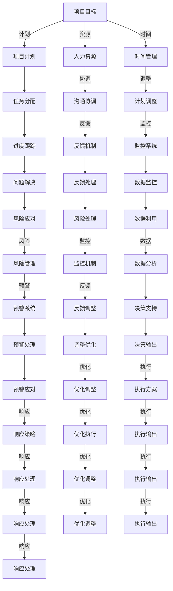

                 

# 思维导图：可视化思考的有效工具

## 1. 背景介绍

### 1.1 问题由来

在数字化时代，信息量爆炸式增长，处理复杂问题的难度和复杂性不断增加。传统的线性思考方式难以应对多维度、交叉型的信息结构，而思维导图的引入，为问题解决提供了一种全新的工具和方法。

### 1.2 问题核心关键点

思维导图工具的本质，是通过将信息元素以图形化的方式组织和展示，帮助思维者从多个角度和层次，系统梳理、深入理解问题的各个方面，从而提高问题解决效率和质量。

## 2. 核心概念与联系

### 2.1 核心概念概述

为更好地理解思维导图工具的原理和应用，本节将介绍几个关键概念及其关联：

- 思维导图（Mind Map）：一种图形化的思考和记录工具，通过将信息元素以层次结构的形式组织和展示，帮助思维者进行系统的思维和分析。
- 节点（Node）：思维导图的基本单元，代表一个概念、主题或子主题。
- 连接线（Line）：节点之间的连接，表示节点之间的关系，可以是逻辑关联、因果关系、层次关系等。
- 颜色和形状：节点和连接线的颜色和形状，用于区分和强调不同的信息要素，提升思维导图的可读性。
- 分支结构：思维导图的主干结构，分支层次清晰，便于理解和记忆。
- 层级关系：不同层级节点的组织方式，体现信息元素之间的逻辑和层次关系。
- 聚焦与发散：思维导图的核心思维模式，通过聚合节点构建逻辑框架，通过发散节点探索多种可能性。

这些概念相互联系，共同构成了思维导图工具的基础框架，使得其在问题分析和解决过程中，展现出强大的组织和分析能力。

### 2.2 核心概念原理和架构的 Mermaid 流程图

```mermaid
graph TB
    A[思维导图] --> B[节点(Node)]
    A --> C[连接线(Line)]
    A --> D[颜色和形状]
    A --> E[分支结构]
    A --> F[层级关系]
    A --> G[聚焦与发散]
```

这个流程图展示了思维导图工具的核心组成和基本功能：

- 从思维导图本身开始，通过节点和连接线，将信息组织成结构化的层次关系。
- 节点和连接线的颜色和形状，用于区分和强调不同的信息要素。
- 分支结构和层级关系，确保信息的组织清晰和逻辑严密。
- 聚焦与发散，思维导图的两大思维模式，帮助思维者从多个角度深入理解问题。

## 3. 核心算法原理 & 具体操作步骤

### 3.1 算法原理概述

思维导图算法的基本原理，是利用图论的拓扑结构，将信息元素以节点和连接线的形式，构建出图形化的表示。其核心思想是通过层次化、结构化的方式，展现信息元素之间的关系和层次，促进信息的系统分析和整理。

### 3.2 算法步骤详解

思维导图工具的使用，一般包括以下关键步骤：

**Step 1: 确定思维导图的主题**
- 明确思维导图的核心主题，作为思维导图的主干节点。

**Step 2: 添加基本节点**
- 将与主题相关的核心信息元素，作为一级节点添加在主干节点下。

**Step 3: 分支扩展**
- 对一级节点进行扩展，添加下一层次的子节点，构成多层次的思维导图结构。

**Step 4: 连接线和关系**
- 在节点之间添加连接线，表示信息元素之间的逻辑关系，可以是因果、并列、包含等。

**Step 5: 优化节点和结构**
- 对节点进行颜色、形状等设计，以增强信息的可视性和重要性。
- 调整分支结构，保持逻辑清晰和层次分明。

**Step 6: 应用和反馈**
- 将思维导图应用于问题解决，逐步完善思维导图，从发散和聚焦中综合考虑和分析。
- 根据反馈调整思维导图，提升问题解决效果。

### 3.3 算法优缺点

思维导图工具的优点在于：
1. 直观可视化：图形化的展示方式，易于理解和记忆。
2. 系统性分析：通过层次结构，帮助思维者系统梳理和分析信息。
3. 灵活可扩展：根据问题需求，灵活添加节点和连接线。
4. 便于整理：适用于信息整理和知识管理，有助于知识共享和传承。
5. 促进创新：发散思维模式，促进思维者探索多种可能性和解决方案。

同时，该工具也存在一些局限性：
1. 复杂度较高：对于非常复杂的问题，构建完整的思维导图可能较为繁琐。
2. 技术依赖：依赖于思维导图软件或工具，可能存在兼容性问题。
3. 可操作性问题：需要思维者具备一定的空间思维和图形设计能力。

### 3.4 算法应用领域

思维导图工具在多个领域和场景中得到了广泛应用，例如：

- 项目管理：通过思维导图梳理项目计划、任务分配、依赖关系等，提升项目管理效率。
- 知识管理：对知识库进行结构化梳理，促进知识的系统存储和共享。
- 问题解决：在复杂问题分析和解决中，思维导图帮助思维者系统分析问题，探索多种解决方案。
- 教育培训：辅助学生和教师进行知识点的系统整理和教学设计，提升学习效果。
- 创业创新：帮助创业者梳理商业计划、产品路线、市场策略等，促进创新项目的发展。

## 4. 数学模型和公式 & 详细讲解 & 举例说明

### 4.1 数学模型构建

思维导图工具虽然以图形化展示为主，但也可用数学模型进行描述和优化。一个基本的思维导图可以表示为一个图 $G=(V,E)$，其中：

- $V$ 为节点集合，每个节点 $v \in V$ 表示一个概念或信息元素。
- $E$ 为连接线集合，每条边 $e \in E$ 表示节点之间的逻辑关系。

### 4.2 公式推导过程

对于一个简单的思维导图，可以定义节点权重 $w(v)$ 和边权重 $w(e)$，用于表示节点和连接线的相对重要性和关系强度。节点权重可以表示为：

$$
w(v) = \sum_{e \in N(v)} w(e)
$$

其中 $N(v)$ 为节点 $v$ 的邻居节点集合。边权重可以表示为：

$$
w(e) = \frac{1}{|N(e)|} \sum_{v \in N(e)} w(v)
$$

其中 $N(e)$ 为边 $e$ 所连接的节点集合。

通过这些权重，可以进一步计算思维导图的信息流强度和节点重要性，帮助思维者识别关键信息和决策路径。

### 4.3 案例分析与讲解

以一个简单的项目管理思维导图为例：



此思维导图展示了项目管理的关键要素和逻辑关系，节点和连接线表示了项目目标、计划、资源、时间、任务分配、协调、调整、进度跟踪、反馈、监控、问题解决、风险管理、预警、优化、执行、响应等要素，通过数学模型可以进一步量化和优化这些要素的关系。

## 5. 项目实践：代码实例和详细解释说明

### 5.1 开发环境搭建

思维导图工具通常使用专业的思维导图软件，如MindMeister、XMind、Coggle等。这些软件提供了丰富的图形化编辑界面和导出格式。

### 5.2 源代码详细实现

由于思维导图工具以图形化展示为主，并无直接的代码实现，但可以使用一些库和框架，如D3.js、Graphviz等，在网页端实现动态交互式思维导图。以下是一个简单的D3.js思维导图示例：

```html
<!DOCTYPE html>
<html>
<head>
    <title>简单思维导图</title>
    <script src="https://d3js.org/d3.v5.min.js"></script>
    <style>
        .node {
            font: 14px sans-serif;
            background-color: #fff;
            color: #333;
            padding: 5px;
        }
        .link {
            fill: none;
            stroke: #ccc;
            stroke-width: 2px;
        }
    </style>
</head>
<body>
    <script>
        var width = 500, height = 500;
        var tree = d3.hierarchy({ "name": "项目目标", "children": [
            { "name": "项目计划", "children": [
                { "name": "任务分配" },
                { "name": "进度跟踪", "children": [
                    { "name": "问题解决" },
                    { "name": "风险管理", "children": [
                        { "name": "风险预警" },
                        { "name": "风险应对" }
                    ] }
                ] }
            ] },
            { "name": "人力资源", "children": [
                { "name": "沟通协调" },
                { "name": "反馈机制" }
            ] },
            { "name": "时间管理", "children": [
                { "name": "计划调整" },
                { "name": "监控系统" }
            ] }
        ] });
        var treeLayout = d3.tree().size([height, width]);
        var node = d3.select("body").append("svg")
            .attr("width", width)
            .attr("height", height)
            .append("g")
            .attr("transform", "translate(" + width / 2 + "," + height / 2 + ")");
        var links = node.selectAll(".link")
            .data(treeLayout.links(tree))
            .enter().append("line")
            .attr("class", "link")
            .attr("x1", function(d) { return d.x })
            .attr("y1", function(d) { return d.y })
            .attr("x2", function(d) { return d.x })
            .attr("y2", function(d) { return d.y });
        var nodes = node.selectAll(".node")
            .data(treeLayout.nodes(tree))
            .enter().append("circle")
            .attr("class", "node")
            .attr("cx", function(d) { return d.x })
            .attr("cy", function(d) { return d.y })
            .attr("r", 5);
        var labels = node.selectAll("text")
            .data(treeLayout.nodes(tree))
            .enter().append("text")
            .attr("class", "label")
            .attr("x", function(d) { return d.x })
            .attr("y", function(d) { return d.y })
            .attr("dy", ".35em")
            .text(function(d) { return d.data.name });
    </script>
</body>
</html>
```

该代码创建了一个简单的树形思维导图，展示了一个项目管理的层次结构。

### 5.3 代码解读与分析

思维导图工具虽然以图形化展示为主，但其核心思想可以抽象为图论模型。以下是代码的核心实现过程：

- 首先定义了一个树形数据结构 `tree`，表示思维导图的层次关系。
- 然后使用 `d3.tree()` 创建了树形布局 `treeLayout`，指定了思维导图的宽度和高度。
- 根据布局，将节点和连接线添加到 SVG 元素中，并通过 CSS 样式设计节点和连接线的外观。
- 最后通过数据绑定和选择器操作，将节点、连接线和标签添加到 SVG 元素中，完成思维导图的构建。

## 6. 实际应用场景

### 6.1 项目管理

在项目管理中，思维导图工具可以帮助团队系统梳理项目计划、任务分配、依赖关系等，提升项目管理的效率和质量。

- 确定项目目标和关键里程碑，构建思维导图的根节点。
- 将任务、资源、时间等要素作为子节点，构建树形结构。
- 通过颜色和形状区分不同要素的重要性，帮助团队聚焦关键问题。
- 通过分支扩展和连接线，表示任务和资源之间的依赖关系，便于跟踪和调整。

### 6.2 知识管理

在知识管理中，思维导图工具有助于知识的系统整理和共享，促进知识的传承和创新。

- 通过构建知识主题树，梳理知识库中的核心概念和子主题。
- 添加节点和连接线，表示不同概念之间的关联和层次关系。
- 使用颜色和形状，区分核心和次要知识点，便于知识的查找和利用。
- 通过分支结构，展示知识点的扩展和应用，促进知识的应用和创新。

### 6.3 问题解决

在复杂问题解决中，思维导图工具帮助思维者系统梳理问题脉络，探索多种解决方案。

- 确定问题核心，作为思维导图的根节点。
- 添加分支节点，表示问题的不同方面和影响因素。
- 通过连接线表示因果、并列等关系，帮助思维者深入理解问题。
- 通过发散思维，探索多种可能的解决方案，选择最优方案。

## 7. 工具和资源推荐

### 7.1 学习资源推荐

- 《思维导图工具与方法》：一本系统介绍思维导图工具原理和使用方法的书籍。
- 《系统思考与思维导图》：一本将思维导图与系统思考结合使用的经典书籍。
- 在线课程：Coursera、Udemy等平台上有大量思维导图工具和应用的课程。

### 7.2 开发工具推荐

- MindMeister：在线思维导图工具，支持实时协作和云端存储。
- XMind：一款功能强大的本地思维导图工具，支持多种导出格式。
- Coggle：一款简洁易用的在线思维导图工具，适合快速创建和分享思维导图。

### 7.3 相关论文推荐

- "Using Mind Maps for Knowledge Organization and Management"：一篇系统介绍思维导图在知识管理中应用的论文。
- "Mind Mapping as a Tool for Creative Problem Solving"：一篇探讨思维导图在创意问题解决中的应用论文。

## 8. 总结：未来发展趋势与挑战

### 8.1 研究成果总结

思维导图工具在问题分析和解决中，展现了强大的系统性分析和组织能力，已经成为一种重要的思维工具和方法。其应用领域和场景不断扩展，从项目管理、知识管理到问题解决，都得到了广泛应用。

### 8.2 未来发展趋势

思维导图工具的未来发展趋势包括：

- 智能化的增强：借助AI和机器学习技术，提升思维导图的自动生成和优化能力。
- 全平台的多端支持：在不同设备和平台，提供统一的思维导图工具体验。
- 社区和协作的强化：建立思维导图社区，促进知识共享和协作创新。
- 移动化和实时协作：支持移动设备访问和实时协作，提升思维导图的应用灵活性。
- 跨学科的应用：将思维导图工具扩展到更多学科和领域，促进跨学科的创新应用。

### 8.3 面临的挑战

思维导图工具在应用和发展过程中，仍面临一些挑战：

- 工具的易用性：需要进一步提升工具的用户界面和操作体验，降低使用门槛。
- 知识体系的完备性：需要不断丰富和完善知识库，提升知识的质量和覆盖面。
- 创新的持续性：需要持续探索和创新，避免思维导图的工具和应用逐渐落后。
- 标准的统一性：需要建立思维导图的标准和规范，促进不同工具之间的互操作性。

### 8.4 研究展望

思维导图工具的未来研究方向包括：

- 智能化和自动化：借助AI技术，实现思维导图的自动生成和优化，提升工具的智能性和易用性。
- 跨模态的融合：将思维导图与其他数据模型（如知识图谱）进行融合，增强思维导图的表达力和应用范围。
- 跨领域的创新应用：探索思维导图在更多领域和场景中的创新应用，推动跨学科的协同创新。

## 9. 附录：常见问题与解答

**Q1：思维导图工具适用于哪些场景？**

A: 思维导图工具适用于系统梳理和分析各种复杂问题，提升问题解决效率和质量。具体场景包括项目管理、知识管理、问题解决等。

**Q2：如何制作一个高效的思维导图？**

A: 制作高效思维导图的关键在于：
1. 确定核心主题和关键要素。
2. 构建层次分明的结构，避免信息过载。
3. 通过颜色和形状区分信息要素的重要性。
4. 使用连接线表示逻辑关系，便于理解和分析。
5. 通过发散思维，探索多种可能的解决方案。

**Q3：思维导图工具与其他思维工具的区别是什么？**

A: 思维导图工具的核心在于图形化的信息组织和分析，与其他思维工具（如脑图、流程图）相比，其特点在于：
1. 图形化展示，直观易懂。
2. 系统性分析，层次分明。
3. 发散思维，探索多种可能性。
4. 支持实时协作和云存储，便于知识共享。

**Q4：思维导图工具的局限性有哪些？**

A: 思维导图工具的局限性包括：
1. 复杂度较高，对于非常复杂的问题，可能需要较长时间构建。
2. 依赖工具，需要思维者具备一定的空间思维和图形设计能力。
3. 可视化效果有限，无法展示复杂的逻辑关系。

---

作者：禅与计算机程序设计艺术 / Zen and the Art of Computer Programming

