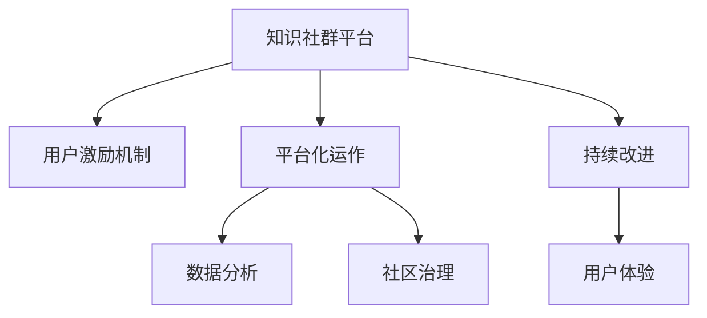

                 

# 打造专业知识社群的运营策略

> 关键词：
1. 社群运营策略
2. 知识管理
3. 用户激励机制
4. 平台化运作
5. 数据分析
6. 社区治理
7. 持续改进

## 1. 背景介绍

随着互联网和数字技术的飞速发展，知识社群平台逐渐成为连接各行各业专业人士的重要渠道。无论是科技界、金融界还是医疗界，专业知识的分享和交流都离不开平台的支持。如何打造一个高效、活跃、可持续发展的知识社群，不仅是一个技术问题，更是一个需要从战略高度深入思考的问题。

### 1.1 问题由来

在当前数字化浪潮下，知识社群平台的作用日益凸显。一方面，用户通过平台获取、交流和分享专业知识，拓宽视野，提升能力；另一方面，平台通过聚集大量专业人士，提升自身影响力，实现商业价值。然而，随着平台数量激增，用户获取优质内容变得愈发困难，平台如何吸引用户、留存用户、提升活跃度，成为了一个巨大的挑战。

### 1.2 问题核心关键点

打造成功的知识社群平台，需要综合考虑以下几个关键点：

1. **用户需求与期望**：了解用户的真实需求，为其提供价值，是其成功的基础。
2. **内容质量与丰富度**：高质量、多样化的内容是吸引和留存用户的关键。
3. **互动与参与度**：促进用户间的互动与交流，提高参与度，是社群活力源泉。
4. **平台运营与维护**：高效的平台运营和维护，确保平台的稳定性和用户体验。
5. **商业模式与变现**：明确的商业模式和可持续的变现模式，是平台持续发展的保障。

本文将从运营策略的角度出发，探讨如何通过合理的策略和措施，打造一个具备强大吸引力和生命力的知识社群平台。

## 2. 核心概念与联系

### 2.1 核心概念概述

为了更好地理解知识社群的运营策略，我们首先需要明确以下几个核心概念：

- **知识社群平台**：一个基于互联网的，专注于知识交流、分享和协作的平台。
- **用户激励机制**：通过各种手段，如积分、徽章、奖励等，激发用户参与内容的创作与分享。
- **平台化运作**：将知识社群平台的运营视为一个整体，通过系统化的方法进行规划、执行和监控。
- **数据分析**：利用大数据和机器学习技术，对用户行为进行分析和预测，优化运营策略。
- **社区治理**：通过建立规则、监控机制等，确保社区环境健康有序。
- **持续改进**：不断收集用户反馈，根据数据分析结果，迭代优化平台功能和运营策略。

这些核心概念之间的逻辑关系可以通过以下Mermaid流程图来展示：



这个流程图展示了一个知识社群平台运营的各个关键环节及其相互关系：

1. 平台提供知识交流和分享的基础服务。
2. 通过用户激励机制，提高用户活跃度和参与度。
3. 平台化运作确保运营的系统性和规范性。
4. 数据分析帮助优化运营策略，提升用户满意度。
5. 社区治理维护良好的社区环境，保障平台的健康发展。
6. 持续改进不断优化，确保平台的长期可持续发展。

## 3. 核心算法原理 & 具体操作步骤

### 3.1 算法原理概述

知识社群平台的运营策略，本质上是通过设计和管理一系列机制，吸引用户、增强互动、提升内容质量、优化平台体验，最终实现用户增长和留存。这涉及到用户心理、行为分析、平台算法等多个方面，需要综合运用心理学、社会学、数据科学等多种理论和方法。

### 3.2 算法步骤详解

以下是一个典型的知识社群平台运营策略的步骤：

**Step 1: 用户需求分析**
- 通过问卷调查、用户访谈等方式，收集用户需求和期望，分析用户画像和行为特征。
- 利用A/B测试等方法，验证不同运营策略的效果。

**Step 2: 设计用户激励机制**
- 设计合理的积分、徽章、奖励体系，满足用户成就感和归属感。
- 设置任务系统，如问答、分享、评论等，鼓励用户参与互动和内容创作。
- 建立用户反馈机制，根据用户反馈调整激励机制，提高用户满意度。

**Step 3: 平台化运作**
- 制定运营规范和流程，确保运营的系统性和规范性。
- 建立多部门协作机制，如内容团队、技术团队、客服团队等，协同工作。
- 利用项目管理工具，如JIRA、Trello等，跟踪任务进度和效果。

**Step 4: 数据分析**
- 建立数据分析平台，利用大数据和机器学习技术，对用户行为进行建模和分析。
- 通过行为数据，预测用户流失风险，优化推荐算法，提升用户粘性。
- 定期发布数据分析报告，指导运营策略的调整和优化。

**Step 5: 社区治理**
- 建立社区规则，如内容审核机制、用户行为准则等，维护社区环境。
- 设立社区监督团队，如管理员、版主等，处理违规行为，提升社区信任度。
- 定期开展社区活动，如问答挑战、主题讨论等，增强用户参与感。

**Step 6: 持续改进**
- 建立持续改进机制，定期收集用户反馈，优化产品功能和运营策略。
- 进行产品迭代和功能升级，确保平台始终满足用户需求。
- 利用A/B测试等方法，验证改进效果，不断迭代优化。

### 3.3 算法优缺点

知识社群平台的运营策略具有以下优点：

1. **系统化管理**：通过平台化运作和数据分析，确保运营的系统性和规范性，提高运营效率。
2. **用户激励**：通过激励机制，激发用户参与，提升内容质量和互动水平。
3. **社区信任**：通过社区治理，建立良好的社区环境，增强用户信任和归属感。
4. **数据驱动**：通过数据分析，优化运营策略，提升用户满意度和留存率。

然而，这一策略也存在以下缺点：

1. **投入成本高**：设计和实施上述策略需要大量的人力和时间投入，成本较高。
2. **效果难以预测**：用户行为和市场变化复杂，运营效果难以准确预测。
3. **运营难度大**：需要跨部门协作，涉及内容、技术、客服等多个方面，协调难度大。
4. **用户需求多变**：用户需求和期望不断变化，需要持续迭代和优化运营策略。

尽管存在这些局限性，但整体而言，系统化的运营策略仍然是打造成功知识社群平台的重要手段。通过不断优化和调整，这一策略将能够逐步实现平台的高效运营和持续发展。

### 3.4 算法应用领域

知识社群平台的运营策略不仅适用于社交网络、学术论坛等传统领域，还适用于各种垂直领域的知识分享平台，如技术博客、医学社区、艺术交流平台等。这一策略的核心在于通过设计和实施一系列系统化的运营措施，提升平台的用户体验和粘性，实现平台的可持续发展。

## 4. 数学模型和公式 & 详细讲解 & 举例说明

### 4.1 数学模型构建

为了更好地理解知识社群平台的用户行为，我们可以构建一个用户行为分析模型。假设平台上有 $N$ 个用户，每个用户每天在平台上的活跃度可以用 $x_i$ 表示，其中 $i \in [1, N]$。则平台总活跃度可以表示为 $X = \sum_{i=1}^N x_i$。

### 4.2 公式推导过程

我们可以通过建立用户行为模型，对用户活跃度进行分析和预测。设用户活跃度 $x_i$ 服从正态分布，即 $x_i \sim N(\mu, \sigma^2)$，其中 $\mu$ 为平台平均活跃度，$\sigma^2$ 为方差。

利用最大似然估计方法，我们可以对 $\mu$ 和 $\sigma^2$ 进行估计，即：

$$
\hat{\mu} = \frac{1}{N} \sum_{i=1}^N x_i
$$

$$
\hat{\sigma^2} = \frac{1}{N-1} \sum_{i=1}^N (x_i - \hat{\mu})^2
$$

进一步，我们可以对未来用户的活跃度进行预测，假设新用户的活跃度也服从正态分布，即 $x \sim N(\mu', \sigma'^2)$，其中 $\mu'$ 为平台期望活跃度，$\sigma'^2$ 为新用户活跃度方差。利用贝叶斯方法，我们可以通过已有数据对 $\mu'$ 和 $\sigma'^2$ 进行预测：

$$
p(\mu'|\mu, \sigma^2) = \mathcal{N}(\mu'|\mu, \sigma^2)
$$

$$
p(\sigma'^2|\sigma^2) = \mathcal{N}(\sigma'^2|\sigma^2)
$$

### 4.3 案例分析与讲解

假设某知识社群平台有 $N=1000$ 名用户，根据历史数据，我们得到平台平均活跃度 $\mu = 0.2$，方差 $\sigma^2 = 0.01$。新用户加入后，其活跃度服从 $N(0.3, 0.02)$。我们可以通过上述模型对新用户的活跃度进行预测，并计算出平台总活跃度的期望值。

首先，利用最大似然估计方法，计算出新用户的期望活跃度 $\mu' = 0.3$，方差 $\sigma'^2 = 0.02$。

接着，利用贝叶斯方法，计算出平台总活跃度的期望值 $E(X) = \mu'N + \mu$，即 $E(X) = 0.3 \times 1000 + 0.2 = 320$。

通过这个案例，我们可以看到，利用数学模型可以对用户行为进行预测和分析，从而优化平台的运营策略，提升用户满意度和留存率。

## 5. 项目实践：代码实例和详细解释说明

### 5.1 开发环境搭建

在进行知识社群平台的开发前，我们需要准备好开发环境。以下是使用Python进行Flask开发的环境配置流程：

1. 安装Python：从官网下载并安装Python，推荐安装最新稳定版本。
2. 安装Flask：通过pip安装Flask框架，确保版本与Flask官方文档要求一致。
3. 安装必要的第三方库：如SQLAlchemy、Flask-Login、Flask-WTF等，确保项目完整性。
4. 安装数据库：如MySQL、PostgreSQL等，用于存储用户数据和行为数据。
5. 配置环境变量：确保Flask应用能够正常访问数据库和外部API。

完成上述步骤后，即可在开发环境下开始知识社群平台的开发。

### 5.2 源代码详细实现

下面是一个简单的知识社群平台后台管理系统，用于管理用户、内容、讨论等模块的Python Flask代码实现：

```python
from flask import Flask, render_template, request, redirect, url_for
from flask_login import LoginManager, login_user, logout_user, login_required
from models import User, Post, Comment
from forms import RegistrationForm, LoginForm

app = Flask(__name__)
app.config['SECRET_KEY'] = 'your-secret-key'
app.config['SQLALCHEMY_DATABASE_URI'] = 'sqlite:///db.sqlite'
app.config['SQLALCHEMY_TRACK_MODIFICATIONS'] = False

login_manager = LoginManager(app)
login_manager.login_view = 'login'

# 用户注册和登录表单
class RegistrationForm(FlaskForm):
    username = StringField('Username', validators=[DataRequired()])
    email = StringField('Email', validators=[DataRequired()])
    password = PasswordField('Password', validators=[DataRequired()])
    confirm_password = PasswordField('Confirm Password', validators=[DataRequired(), EqualTo('password')])

class LoginForm(FlaskForm):
    email = StringField('Email', validators=[DataRequired()])
    password = PasswordField('Password', validators=[DataRequired()])

# 用户注册、登录、登出
@app.route('/register', methods=['GET', 'POST'])
def register():
    form = RegistrationForm()
    if form.validate_on_submit():
        user = User(username=form.username.data, email=form.email.data, password=form.password.data)
        db.session.add(user)
        db.session.commit()
        flash('Registration successful', 'success')
        return redirect(url_for('login'))
    return render_template('register.html', form=form)

@app.route('/login', methods=['GET', 'POST'])
def login():
    form = LoginForm()
    if form.validate_on_submit():
        user = User.query.filter_by(email=form.email.data).first()
        if user and check_password_hash(user.password, form.password.data):
            login_user(user)
            return redirect(url_for('index'))
        flash('Invalid email or password', 'danger')
    return render_template('login.html', form=form)

@app.route('/logout')
@login_required
def logout():
    logout_user()
    return redirect(url_for('index'))

# 用户管理
@app.route('/users')
@login_required
def users():
    users = User.query.all()
    return render_template('users.html', users=users)

# 内容管理
@app.route('/posts')
@login_required
def posts():
    posts = Post.query.all()
    return render_template('posts.html', posts=posts)

# 讨论管理
@app.route('/comments')
@login_required
def comments():
    comments = Comment.query.all()
    return render_template('comments.html', comments=comments)

# 启动Flask应用
if __name__ == '__main__':
    db.create_all()
    app.run(debug=True)
```

### 5.3 代码解读与分析

让我们再详细解读一下关键代码的实现细节：

**Flask应用初始化**：
- 配置Flask应用的密钥、数据库连接、缓存等基本设置。
- 初始化Flask-Login扩展，用于用户登录、登出管理。

**用户注册、登录、登出路由**：
- 注册路由：接收用户提交的注册表单数据，验证并创建新用户。
- 登录路由：接收用户提交的登录表单数据，验证并登录用户。
- 登出路由：直接登出用户。

**用户管理、内容管理、讨论管理路由**：
- 用户管理路由：查询所有用户信息，展示用户列表。
- 内容管理路由：查询所有内容信息，展示内容列表。
- 讨论管理路由：查询所有讨论信息，展示讨论列表。

这些代码实现了知识社群平台的基本功能，包括用户注册、登录、登出、用户管理、内容管理、讨论管理等。在实际应用中，还可以进一步扩展功能，如内容推荐、搜索、评论回复等。

### 5.4 运行结果展示

运行上述代码，启动Flask应用，访问`localhost:5000`，即可在浏览器中看到知识社群平台的用户管理、内容管理和讨论管理界面。用户可以通过注册、登录、退出等操作进行系统交互，管理员可以通过用户管理界面进行用户管理和权限设置。

## 6. 实际应用场景

### 6.1 智能社区问答系统

智能社区问答系统是一个典型的知识社群平台应用。通过收集各领域专家的知识问答数据，利用自然语言处理技术，构建问答模型，为用户提供快速、准确的答案。智能问答系统可以涵盖医学、法律、科技等多个领域，为用户提供一站式的知识获取和交流平台。

### 6.2 学术交流平台

学术交流平台是另一个知识社群平台的经典应用。该平台聚集了各领域的专家和研究人员，通过发布论文、分享实验、讨论热点话题等，促进学术交流和合作。平台可以通过用户激励机制、数据分析等方式，提升学术研究和知识传播的效率和质量。

### 6.3 技术学习社区

技术学习社区是一个专注于技术学习、知识分享的平台。该平台通过课程、教程、代码示例等形式，提供丰富的技术学习资源，帮助用户快速掌握新技能。平台可以通过互动激励、内容推荐等方式，提升用户学习体验和平台活跃度。

### 6.4 未来应用展望

未来，知识社群平台将不断拓展其应用范围，涵盖更多领域和场景，为各行各业带来深远的变革。以下是一些未来的应用展望：

1. **跨领域知识融合**：知识社群平台将实现多领域的知识融合，打破学科壁垒，推动知识的全面发展和传播。
2. **智能推荐系统**：利用人工智能技术，构建智能推荐系统，为用户提供个性化的知识推荐服务。
3. **虚拟现实互动**：通过虚拟现实技术，实现用户间的互动和协作，提升知识分享和学习的沉浸式体验。
4. **区块链安全保障**：利用区块链技术，保障平台的数据安全和用户隐私，提升平台的可信度和用户信任度。

知识社群平台的发展前景广阔，未来将通过技术创新和商业模式创新，实现更加深入的行业应用和社会价值。

## 7. 工具和资源推荐

### 7.1 学习资源推荐

为了帮助开发者系统掌握知识社群平台的运营策略，以下是一些优质的学习资源：

1. **《社群运营的艺术》**：一本关于社群运营的经典书籍，涵盖社群运营的基本理论和实操技巧。
2. **Coursera《社群管理与运营》课程**：由全球知名专家教授，通过线上课程讲解社群运营的核心知识和实战案例。
3. **《社区运营实战指南》**：一本面向运营人员的实战指南，涵盖社区运营的各种策略和工具。
4. **GitHub上的知识社群平台项目**：许多优秀的知识社群平台项目在GitHub上公开，提供丰富的学习材料和参考案例。

通过对这些资源的学习实践，相信你一定能够快速掌握知识社群平台的运营策略，并用于解决实际的运营问题。

### 7.2 开发工具推荐

高效的知识社群平台开发离不开优秀的工具支持。以下是几款用于知识社群平台开发的常用工具：

1. **Flask**：一个轻量级的Python Web框架，灵活高效，适合快速迭代开发。
2. **Django**：一个全功能的Python Web框架，功能强大，适合大型应用开发。
3. **MongoDB**：一个高性能的NoSQL数据库，适合存储大量的用户行为数据。
4. **Redis**：一个高性能的内存数据库，适合处理实时的用户互动数据。
5. **Elasticsearch**：一个分布式的全文搜索引擎，适合构建高级的搜索和推荐功能。

合理利用这些工具，可以显著提升知识社群平台开发的效率和质量，加快创新迭代的步伐。

### 7.3 相关论文推荐

知识社群平台的运营策略的研究源于学界的持续探索。以下是几篇奠基性的相关论文，推荐阅读：

1. **《知识社群平台的运营策略研究》**：深入探讨了知识社群平台运营的基本策略和方法。
2. **《用户激励机制的设计与实现》**：介绍了各种用户激励机制的设计和实现方法，为运营策略提供了理论基础。
3. **《社区治理的理论与实践》**：介绍了社区治理的理论和实践，为社区管理提供了理论依据。
4. **《数据分析在知识社群平台中的应用》**：介绍了数据分析在知识社群平台中的应用，为运营策略提供了数据支持。

这些论文代表了大规模知识社群平台运营策略的研究脉络。通过学习这些前沿成果，可以帮助研究者把握学科前进方向，激发更多的创新灵感。

## 8. 总结：未来发展趋势与挑战

### 8.1 总结

本文对知识社群平台的运营策略进行了全面系统的介绍。首先阐述了知识社群平台的运营背景和重要性，明确了运营策略在吸引用户、提升活跃度、优化平台体验等方面的关键作用。其次，从运营策略的核心概念和关键步骤出发，详细讲解了知识社群平台运营的各个环节，包括用户需求分析、激励机制设计、平台化运作、数据分析、社区治理和持续改进。同时，本文还广泛探讨了知识社群平台在多个行业领域的应用前景，展示了运营策略的广泛适用性和强大潜力。

通过本文的系统梳理，可以看到，知识社群平台的运营策略是实现平台高效运营和持续发展的关键。通过合理的策略和措施，平台可以吸引和留存大量用户，提升内容质量和用户粘性，从而实现商业价值和社会价值的双重目标。

### 8.2 未来发展趋势

展望未来，知识社群平台的运营策略将呈现以下几个发展趋势：

1. **智能化与个性化**：利用人工智能和大数据技术，实现智能推荐、个性化内容展示，提升用户体验。
2. **社区互动与协作**：通过社区互动与协作机制，促进用户间的交流与合作，构建健康的社区环境。
3. **多模态知识整合**：融合文本、图像、视频等多模态数据，实现更全面、深入的知识分享和传播。
4. **去中心化与去中介化**：利用区块链等技术，实现去中心化、去中介化的知识共享和协作机制，提升平台可信度和用户信任度。
5. **社会化与影响力**：通过社区影响力机制，提升平台的社会化效应，促进知识传播和社交网络的扩展。

这些趋势将推动知识社群平台向更智能、更高效、更社交的方向发展，为用户创造更加丰富、深入的知识共享体验。

### 8.3 面临的挑战

尽管知识社群平台的运营策略已经取得了一定的成果，但在迈向更加智能化、普适化应用的过程中，仍面临诸多挑战：

1. **用户多样性与复杂性**：不同领域和场景的用户需求差异大，如何设计统一的运营策略，满足多样化需求，是一个巨大的挑战。
2. **数据隐私与安全**：如何保护用户隐私，确保数据安全，是平台运营的重要任务。
3. **内容质量与审核**：如何保障内容质量，避免低质量、虚假信息的传播，是平台运营的关键。
4. **商业模式探索**：如何通过知识社群平台实现商业变现，找到可持续的商业模式，是一个长期且复杂的问题。
5. **技术创新与演进**：如何紧跟技术前沿，不断优化平台技术和算法，保持平台的竞争力，是一个持续挑战。

这些挑战需要我们不断探索和解决，才能推动知识社群平台向更加成熟、稳定的方向发展。

### 8.4 研究展望

面对知识社群平台运营策略所面临的挑战，未来的研究需要在以下几个方面寻求新的突破：

1. **跨领域知识融合与协同**：利用多学科知识，提升平台的知识融合和协同能力，实现跨领域的知识共享与协作。
2. **智能推荐系统优化**：通过优化推荐算法，提升智能推荐系统的准确性和个性化程度，提高用户满意度和留存率。
3. **去中心化与社区自治**：利用区块链和分布式技术，构建去中心化的知识共享与协作机制，提升平台的社会化效应。
4. **内容质量与审核技术**：研究新型内容审核技术，如基于人工智能的内容审核系统，提升内容质量，避免虚假信息的传播。
5. **平台商业变现策略**：探索多元化商业变现策略，如知识付费、广告、社群服务等，提升平台的商业价值。

这些研究方向的探索，将引领知识社群平台向更加智能化、普适化、社会化、可持续化的方向发展，为用户提供更加丰富、深入的知识共享体验，同时也为平台运营带来新的思路和解决方案。

## 9. 附录：常见问题与解答

**Q1: 知识社群平台如何吸引用户？**

A: 知识社群平台可以通过以下几种方式吸引用户：
1. **提供高质量内容**：确保平台上的内容丰富、有价值，满足用户的学习需求。
2. **设计互动机制**：通过问答、评论、投票等方式，促进用户间的互动与交流。
3. **建立用户激励机制**：通过积分、徽章、奖励等方式，激发用户参与和分享。
4. **推广活动**：通过社交媒体、搜索引擎等渠道，进行平台推广，吸引更多用户加入。

**Q2: 如何提升知识社群平台的活跃度？**

A: 提升知识社群平台的活跃度，可以从以下几个方面入手：
1. **内容更新与互动**：定期发布高质量的内容，并通过问答、评论等方式，促进用户互动。
2. **用户激励机制**：通过积分、徽章、奖励等方式，激励用户参与和分享。
3. **社区活动**：定期开展社区活动，如问答挑战、主题讨论等，增强用户参与感。
4. **数据分析**：通过数据分析，发现用户行为特征，优化运营策略，提升用户体验。

**Q3: 知识社群平台如何处理低质量内容？**

A: 知识社群平台可以通过以下几种方式处理低质量内容：
1. **内容审核机制**：建立严格的内容审核机制，避免低质量、虚假信息的传播。
2. **用户反馈机制**：建立用户反馈机制，及时发现和处理低质量内容。
3. **用户行为监控**：通过数据分析，监控用户行为，识别和处理低质量内容。
4. **社区规范**：建立社区规范，明确内容标准，引导用户创作高质量内容。

**Q4: 知识社群平台如何实现商业变现？**

A: 知识社群平台可以通过以下几种方式实现商业变现：
1. **知识付费**：通过订阅制、付费问答等方式，向用户收取费用。
2. **广告**：在平台上展示广告，通过广告收入实现变现。
3. **社群服务**：通过提供专属社群服务，如VIP会员、专家咨询等，实现商业变现。
4. **商品销售**：通过与商品销售平台合作，在平台上销售相关商品，实现商业变现。

**Q5: 知识社群平台如何保障用户隐私与安全？**

A: 知识社群平台可以通过以下几种方式保障用户隐私与安全：
1. **数据加密**：对用户数据进行加密处理，防止数据泄露。
2. **权限管理**：建立严格的权限管理机制，确保只有授权用户可以访问敏感数据。
3. **安全审计**：定期进行安全审计，发现并修复安全漏洞。
4. **用户教育**：教育用户安全意识，防范钓鱼攻击等安全威胁。

这些策略可以帮助知识社群平台在保障用户隐私和安全的前提下，实现平台的高效运营和持续发展。

---

作者：禅与计算机程序设计艺术 / Zen and the Art of Computer Programming

