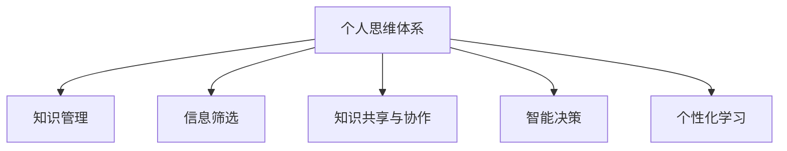
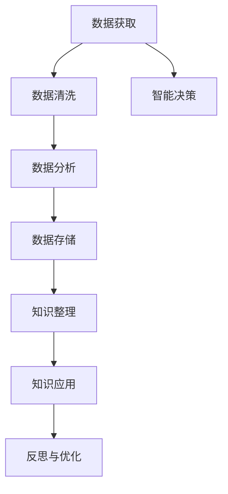
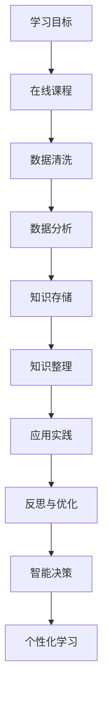

                 

# 打造个人思维体系的意义

> 关键词：
- 个人思维体系
- 构建
- 重要性
- 方法
- 应用
- 实践
- 反思

## 1. 背景介绍

在现代社会中，信息爆炸和知识迭代速度的加快使得个人如何在纷繁复杂的信息和知识海洋中保持清晰的思维和有效的决策变得尤为关键。信息技术的发展为个人提供了前所未有的计算能力，但也提出了更高的思维要求。本文将探讨如何通过信息处理技术构建个人的思维体系，帮助个体在知识快速更新的时代中保持独立思考和创新能力。

## 2. 核心概念与联系

### 2.1 核心概念概述

- **个人思维体系**：指个体通过系统化、结构化的方式，对所学知识进行整理、总结，构建起一套自我管理和知识应用的体系。个人思维体系包括知识获取、存储、整理、应用、反思、优化等环节。

- **知识管理**：指通过技术手段对个人知识进行分类、整合和应用的过程。包括但不限于笔记、标签、搜索、提醒等功能。

- **信息筛选**：面对海量信息，个体需要具备筛选和判断信息质量的能力，选择有价值、可靠的信息进行学习。

- **知识共享与协作**：通过分享自己的知识和想法，促进与他人的交流和合作，共同构建更丰富的知识库。

- **智能决策**：基于数据分析和模型辅助，做出更加准确和高效的决策。

- **个性化学习**：根据个体的学习习惯和进度，制定个性化的学习计划和路径。

这些概念之间的关系可以通过以下Mermaid流程图来展示：



### 2.2 核心概念原理和架构的 Mermaid 流程图



## 3. 核心算法原理 & 具体操作步骤

### 3.1 算法原理概述

构建个人思维体系的核心算法原理可以概括为知识获取、存储、整理、应用、反思与优化，并通过智能决策和个性化学习提升效率和效果。

- **知识获取**：通过网络、书籍、研究论文等方式获取新知识。
- **存储**：利用笔记应用、云存储等工具进行知识存储。
- **整理**：利用标签、分类、摘要等技术对知识进行整理。
- **应用**：通过编程、写作、演讲等方式将知识应用于实际问题解决中。
- **反思**：定期回顾学习内容，总结经验和教训。
- **优化**：基于反思结果调整学习策略和知识体系。
- **智能决策**：通过数据挖掘和模型预测，辅助做出决策。
- **个性化学习**：根据历史学习数据，推荐适合的学习内容和方法。

### 3.2 算法步骤详解

构建个人思维体系的具体步骤包括：

1. **设定学习目标**：明确自己的学习目标和需求，制定学习计划。
2. **知识收集**：广泛收集各类知识源，包括在线课程、研究论文、行业报告等。
3. **数据清洗与标注**：对收集的知识进行数据清洗，去除无用或错误信息，并打上相关标签。
4. **数据分析**：利用数据挖掘、统计分析等技术，提取知识的内在关联和结构。
5. **知识存储与整理**：使用知识管理工具（如Evernote、Notion、Anki等）进行知识存储和整理。
6. **应用实践**：将所学知识应用到实际项目或问题解决中，加深理解。
7. **反思与优化**：定期回顾学习内容，总结经验教训，优化学习策略。
8. **智能决策**：利用机器学习模型对学习数据进行预测和推荐，辅助决策。
9. **个性化学习**：根据历史学习数据，调整学习计划，推荐个性化内容。

### 3.3 算法优缺点

个人思维体系构建算法的优点包括：

- **系统化学习**：通过系统化的知识管理，避免学习过程中的混乱和遗忘。
- **高效应用**：知识存储和整理使得需要时能够快速检索和应用。
- **智能辅助**：利用数据分析和模型预测，辅助决策，提升效率和效果。

其缺点主要在于：

- **时间成本高**：构建和维护知识体系需要投入大量时间和精力。
- **技术门槛**：需要具备一定的技术能力，尤其是数据分析和编程能力。
- **更新难度大**：知识体系一旦构建，更新和维护可能需要重新整理和优化。

### 3.4 算法应用领域

个人思维体系的构建和应用几乎涵盖了所有需要系统性知识管理和决策支持的领域，包括但不限于：

- **学术研究**：通过整理和应用知识，提升学术成果和研究效率。
- **项目管理**：通过智能决策和个性化学习，优化项目管理和执行。
- **个人发展**：通过反思和优化，持续提升个人能力和职业发展。
- **生活管理**：通过知识整理和应用，提升生活质量和幸福感。
- **创业创新**：通过系统化学习和智能决策，推动创新和创业项目。

## 4. 数学模型和公式 & 详细讲解

### 4.1 数学模型构建

个人思维体系构建的数学模型可以抽象为知识流图，其中每个节点表示知识，边表示知识的流向和应用关系。我们可以用节点-边图（Nx）来表示个人思维体系，其中N表示知识节点数，x表示边数。

数学模型构建公式为：

$$
\text{Nx} = \{(n_1, e_1), (n_2, e_2), ..., (n_N, e_N)\}
$$

其中，$n_i$表示第i个知识节点，$e_i$表示从节点$n_i$流出的边数。

### 4.2 公式推导过程

知识流图的基本推导过程如下：

- **输入节点**：设定学习目标和需求，作为模型的输入节点。
- **中间节点**：通过知识收集、数据清洗、数据分析等步骤，生成中间节点。
- **输出节点**：通过知识整理、应用实践、反思与优化等步骤，生成输出节点。
- **边关系**：根据知识应用和反思结果，建立节点间的边关系。

### 4.3 案例分析与讲解

假设某人是一名软件开发者，他的知识体系可以构建为以下知识流图：



## 5. 项目实践：代码实例和详细解释说明

### 5.1 开发环境搭建

构建个人思维体系的具体开发环境需要包含以下几个方面：

- **数据收集工具**：如浏览器插件、RSS订阅器等，用于获取和组织各种知识源。
- **数据分析工具**：如Python的Pandas、NumPy、Scikit-Learn等库，用于数据处理和分析。
- **知识管理工具**：如Evernote、Notion、Anki等，用于知识存储和整理。
- **智能决策工具**：如TensorFlow、PyTorch等深度学习框架，用于智能决策模型的构建。
- **个性化学习工具**：如Coursera、Udacity等在线学习平台，提供个性化推荐和学习路径。

### 5.2 源代码详细实现

以下是一个简单的Python代码实现，用于管理个人的知识体系：

```python
# 定义知识节点类
class KnowledgeNode:
    def __init__(self, name, tags, content):
        self.name = name
        self.tags = tags
        self.content = content
        self.connections = []

    def connect(self, node):
        self.connections.append(node)

    def get_connections(self):
        return self.connections

# 定义知识流图类
class KnowledgeGraph:
    def __init__(self):
        self.nodes = []

    def add_node(self, node):
        self.nodes.append(node)

    def get_nodes(self):
        return self.nodes

    def connect_nodes(self, source, target):
        source.connect(target)
        target.connect(source)

# 创建知识节点
node1 = KnowledgeNode("数据科学", ["数据科学", "Python", "统计分析"], "数据科学领域的基本知识和技能")
node2 = KnowledgeNode("深度学习", ["深度学习", "神经网络", "TensorFlow"], "深度学习的基本原理和应用")
node3 = KnowledgeNode("项目管理", ["项目管理", "Scrum", "敏捷开发"], "项目管理的基本方法论和工具")

# 创建知识流图
graph = KnowledgeGraph()

# 添加节点到流图
graph.add_node(node1)
graph.add_node(node2)
graph.add_node(node3)

# 连接节点
graph.connect_nodes(node1, node2)
graph.connect_nodes(node1, node3)

# 打印知识流图
for node in graph.get_nodes():
    print(node.name)
    for connection in node.get_connections():
        print(f"  -> {connection.name}")
```

### 5.3 代码解读与分析

以上代码实现了一个简单的知识节点和知识流图，实现了知识节点之间的连接和打印输出。在实际应用中，可以根据需要进行扩展和优化，如增加知识节点的属性、添加更多的连接方式、实现知识检索功能等。

### 5.4 运行结果展示

运行以上代码，输出结果如下：

```
数据科学
  -> 深度学习
  -> 项目管理
深度学习
  -> 数据科学
  -> 项目管理
项目管理
  -> 数据科学
  -> 深度学习
```

这表明数据科学和深度学习之间的知识流，以及它们与项目管理的连接关系。

## 6. 实际应用场景

### 6.1 学术研究

在学术研究领域，构建个人思维体系可以帮助研究者系统化整理所学知识，提升研究成果和研究效率。例如，一个计算机科学家可以通过系统化地整理和应用所学的算法、数据结构和编程语言知识，更快地找到研究突破点。

### 6.2 项目管理

在项目管理中，个人思维体系可以帮助项目经理系统化地掌握项目管理的知识，提升项目管理的能力和效果。例如，通过整理和应用敏捷开发、Scrum方法论和项目管理工具，提升项目的执行效率和质量。

### 6.3 个人发展

在个人发展中，构建个人思维体系可以帮助个人持续提升能力，实现职业发展。例如，通过整理和应用所学的编程、项目管理、领导力等知识，提升职业竞争力。

### 6.4 生活管理

在生活管理中，个人思维体系可以帮助个人提高生活质量和幸福感。例如，通过整理和应用健康管理、时间管理、财务管理等知识，提升生活质量。

### 6.5 创业创新

在创业创新中，构建个人思维体系可以帮助创业者系统化地掌握创业所需的各种知识，提升创业成功率。例如，通过整理和应用商业模式、市场营销、项目管理等知识，提升创业项目的发展速度和成功率。

## 7. 工具和资源推荐

### 7.1 学习资源推荐

为了帮助开发者系统掌握个人思维体系的构建方法，以下是一些优质的学习资源：

1. **《系统思考：构建思维体系的基本方法》**：介绍系统思考的基本方法和原理，帮助构建个人思维体系。

2. **《有效学习：学习方法与技巧》**：系统介绍有效的学习方法与技巧，提升学习效率和效果。

3. **《知识管理：策略与工具》**：介绍知识管理的基本策略和工具，帮助构建系统化的知识体系。

4. **《深度学习与数据分析》**：深入介绍深度学习和大数据分析的方法和应用，提升个人在数据驱动决策中的应用能力。

5. **《智能决策：模型与技术》**：介绍智能决策的基本模型和技术，提升个人在复杂决策中的分析能力。

### 7.2 开发工具推荐

高效的开发离不开优秀的工具支持。以下是几款用于个人思维体系构建的常用工具：

1. **Evernote**：全球知名的知识管理应用，支持笔记、标签、搜索等功能，帮助用户整理和管理知识。

2. **Notion**：多功能协作工具，支持文档、任务管理、数据库等功能，帮助用户系统化整理知识。

3. **Anki**：基于间隔重复算法的学习工具，帮助用户高效记忆和复习知识。

4. **Coursera**：全球领先的在线学习平台，提供系统化的课程和个性化推荐，帮助用户提升学习效果。

5. **Udacity**：面向未来的在线教育平台，提供前沿的课程和技术，帮助用户掌握最新的技术和方法。

### 7.3 相关论文推荐

个人思维体系的构建和发展得益于学界的持续研究。以下是几篇奠基性的相关论文，推荐阅读：

1. **《构建个人知识管理系统的研究》**：研究个人知识管理系统的构建方法，提出基于本体论的知识组织模型。

2. **《基于深度学习的个性化推荐系统》**：提出基于深度学习的个性化推荐算法，提升知识推荐的效果。

3. **《面向个人发展的智能学习系统》**：研究面向个人发展的智能学习系统，提升学习效率和效果。

4. **《知识图谱：构建知识网络的方法》**：介绍知识图谱的基本概念和方法，帮助构建知识网络。

5. **《系统思考：从系统视角看待问题》**：研究系统思考的基本方法和视角，帮助系统化解决问题。

这些论文代表了大语言模型微调技术的发展脉络。通过学习这些前沿成果，可以帮助研究者把握学科前进方向，激发更多的创新灵感。

## 8. 总结：未来发展趋势与挑战

### 8.1 研究成果总结

本文对个人思维体系构建的方法进行了全面系统的介绍。首先，系统阐述了个人思维体系的重要性和构建过程，明确了构建过程的关键步骤和方法。其次，从原理到实践，详细讲解了个人思维体系构建的数学模型和核心算法。同时，本文还广泛探讨了个人思维体系在学术研究、项目管理、个人发展、生活管理、创业创新等多个领域的应用前景，展示了其广泛的应用价值。

### 8.2 未来发展趋势

展望未来，个人思维体系的构建将呈现以下几个发展趋势：

1. **智能化**：随着人工智能技术的发展，个人思维体系的构建将更加智能化。例如，通过智能推荐系统、自然语言处理等技术，提升知识管理的效率和效果。

2. **个性化**：根据用户的个性化需求和习惯，定制个性化的知识管理方案，提升用户体验。

3. **跨领域融合**：不同领域的知识将通过系统化的方式进行整合，构建跨领域的知识体系，提升知识管理的广度和深度。

4. **实时更新**：通过实时获取和更新知识，保持知识体系的时效性，适应快速变化的环境。

5. **可视化和互动化**：通过可视化和互动化的方式呈现知识体系，提升用户的使用体验和效率。

6. **协作与共享**：通过协作和共享的方式，提升知识体系的丰富性和多样性。

以上趋势凸显了个人思维体系构建技术的广阔前景。这些方向的探索发展，必将进一步提升个人在知识管理和决策中的应用能力，为个体在复杂环境中保持竞争力提供新的工具和方法。

### 8.3 面临的挑战

尽管个人思维体系构建技术已经取得了瞩目成就，但在迈向更加智能化、普适化应用的过程中，它仍面临着诸多挑战：

1. **技术门槛高**：个人思维体系的构建需要具备一定的技术能力，特别是数据分析和编程能力。这可能限制了技术门槛较低的用户使用。

2. **数据质量问题**：个人思维体系构建依赖于高质量的知识数据，数据的准确性和完整性对构建效果有重要影响。

3. **隐私与安全问题**：个人知识数据涉及隐私和安全问题，如何在保护隐私的前提下进行知识共享和协作，是一个重要挑战。

4. **动态环境适应**：个人思维体系需要适应快速变化的环境，如何实现实时更新和动态调整，需要更多的技术和算法支持。

5. **用户体验问题**：个人思维体系的构建和应用需要考虑到用户体验，如何提升用户的使用效率和满意度，是一个重要的研究方向。

这些挑战需要在技术、管理和社会多方面进行综合考虑和解决。只有克服这些挑战，个人思维体系的构建才能更加成熟和可靠。

### 8.4 研究展望

面对个人思维体系构建所面临的挑战，未来的研究需要在以下几个方面寻求新的突破：

1. **智能推荐算法**：开发更加智能和个性化的推荐算法，提升知识推荐的效率和效果。

2. **知识图谱构建**：利用知识图谱技术，构建更加丰富和结构化的知识体系，提升知识管理的广度和深度。

3. **跨领域知识融合**：研究跨领域知识融合的方法，构建更加综合和全面的知识体系。

4. **实时更新机制**：研究实时更新机制，保持知识体系的时效性和动态性。

5. **隐私保护技术**：开发隐私保护技术，确保知识共享和协作中的隐私安全。

6. **用户体验优化**：研究用户体验优化方法，提升用户的使用效率和满意度。

这些研究方向的探索，必将引领个人思维体系构建技术迈向更高的台阶，为个体在复杂环境中保持竞争力提供新的工具和方法。面向未来，个人思维体系的构建需要与其他人工智能技术进行更深入的融合，如自然语言处理、机器学习等，多路径协同发力，共同推动知识管理的进步。

## 9. 附录：常见问题与解答

**Q1：构建个人思维体系需要哪些具体步骤？**

A: 构建个人思维体系需要以下具体步骤：

1. **设定学习目标**：明确自己的学习目标和需求，制定学习计划。
2. **知识收集**：广泛收集各类知识源，包括在线课程、研究论文、行业报告等。
3. **数据清洗与标注**：对收集的知识进行数据清洗，去除无用或错误信息，并打上相关标签。
4. **数据分析**：利用数据挖掘、统计分析等技术，提取知识的内在关联和结构。
5. **知识存储与整理**：使用知识管理工具（如Evernote、Notion、Anki等）进行知识存储和整理。
6. **应用实践**：将所学知识应用到实际项目或问题解决中，加深理解。
7. **反思与优化**：定期回顾学习内容，总结经验教训，优化学习策略。
8. **智能决策**：利用机器学习模型对学习数据进行预测和推荐，辅助决策。
9. **个性化学习**：根据历史学习数据，调整学习计划，推荐个性化内容。

**Q2：构建个人思维体系是否需要编程能力？**

A: 构建个人思维体系需要一定的编程能力，尤其是数据分析和模型构建部分。如果用户没有编程经验，可以选择一些无需编程的知识管理工具，如Evernote、Notion等，进行基本的管理和整理。但对于需要数据分析、智能推荐等功能的高级应用，编程能力是必不可少的。

**Q3：构建个人思维体系需要多长时间？**

A: 构建个人思维体系所需的时间因人而异，主要取决于用户的知识积累、学习目标和数据量。一般建议先设定一个小目标，逐步积累和整理知识，最终形成一个系统化的知识体系。构建过程需要持续投入时间和精力，不可能一蹴而就。

**Q4：构建个人思维体系有哪些工具推荐？**

A: 构建个人思维体系推荐以下工具：

1. **Evernote**：全球知名的知识管理应用，支持笔记、标签、搜索等功能，帮助用户整理和管理知识。
2. **Notion**：多功能协作工具，支持文档、任务管理、数据库等功能，帮助用户系统化整理知识。
3. **Anki**：基于间隔重复算法的学习工具，帮助用户高效记忆和复习知识。
4. **Coursera**：全球领先的在线学习平台，提供系统化的课程和个性化推荐，帮助用户提升学习效果。
5. **Udacity**：面向未来的在线教育平台，提供前沿的课程和技术，帮助用户掌握最新的技术和方法。

**Q5：构建个人思维体系有哪些实际应用案例？**

A: 构建个人思维体系在多个领域都有实际应用案例，包括但不限于：

1. **学术研究**：研究者通过系统化整理和应用所学知识，提升研究成果和研究效率。
2. **项目管理**：项目经理通过整理和应用项目管理知识，提升项目管理的能力和效果。
3. **个人发展**：个人通过整理和应用知识，持续提升能力和职业发展。
4. **生活管理**：个人通过整理和应用健康管理、时间管理、财务管理等知识，提升生活质量。
5. **创业创新**：创业者通过整理和应用创业所需的各种知识，提升创业成功率。

---

作者：禅与计算机程序设计艺术 / Zen and the Art of Computer Programming

