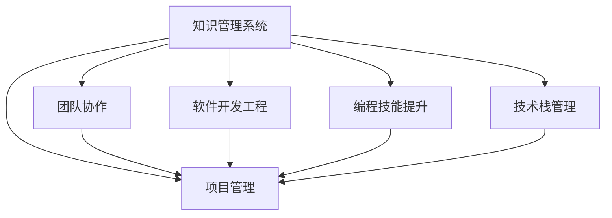

                 

# 打造个人知识管理系统:程序员的必备技能

> 关键词：个人知识管理,项目管理,团队协作,软件开发,软件开发工程,编程技能提升,技术栈管理

## 1. 背景介绍

在当今快速变化的科技领域中，程序员需要不断学习新知识、新技术，以便跟上行业发展的步伐。然而，面对海量的技术资料、项目需求和代码库，如何高效地组织和利用这些知识，成为一个亟待解决的问题。

**1.1 问题由来**

在早期软件开发过程中，由于项目规模相对较小，程序员通常不需要面对大规模、复杂的信息管理挑战。但是，随着项目规模的扩大和团队成员的增多，信息管理的难度呈指数级增长。团队成员之间协作不顺畅，信息碎片化严重，导致效率低下，错误率上升。这些问题已经严重影响了项目的进度和质量。

此外，科技领域发展迅速，新的编程语言、框架、库和工具层出不穷。程序员需要不断学习和适应这些新技术，以提升自身竞争力。但是，由于缺乏有效的知识管理工具，大量碎片化的信息难以系统化整理，导致学习效率低下，难以快速获取新知识。

**1.2 问题核心关键点**

个人知识管理系统（Personal Knowledge Management System, PKMS）的构建，旨在帮助程序员系统化地管理和利用知识和信息，提升个人和团队的工作效率。以下是构建PKMS的核心关键点：

1. **信息收集**：从各种渠道收集相关知识，包括技术博客、文档、开源项目、会议讲稿等。
2. **信息整理**：将收集到的信息分类、标注，形成结构化的知识体系。
3. **知识共享**：将整理好的知识分享给团队成员，促进知识传播和共享。
4. **信息检索**：构建高效的检索机制，方便快速查找所需信息。
5. **持续更新**：定期更新知识库，保持知识的时效性和准确性。
6. **智能推荐**：根据用户需求和历史行为，智能推荐相关知识。

通过构建这样的系统，程序员能够更高效地学习和应用新知识，提升自身的技术水平和项目效率。

## 2. 核心概念与联系

### 2.1 核心概念概述

为更好地理解个人知识管理系统的构建，本节将介绍几个密切相关的核心概念：

- **知识管理系统**：帮助个人或团队收集、整理、检索和共享知识的工具系统。
- **项目管理**：通过有效的计划、组织、跟踪和控制，确保项目按时按质完成。
- **团队协作**：促进团队成员之间的信息交流、知识共享和协作，提高团队效率。
- **软件开发工程**：涉及软件开发生命周期中的方法、工具和实践，以提高软件质量和开发效率。
- **编程技能提升**：通过学习、实践和反思，不断提高编程技能和解决实际问题的能力。
- **技术栈管理**：管理和优化软件项目所需的技术工具和库，以提高开发效率和项目可维护性。

这些概念之间的逻辑关系可以通过以下Mermaid流程图来展示：



这个流程图展示了个体知识管理系统的核心概念及其之间的关系：

1. 知识管理系统提供了信息收集、整理和检索的工具。
2. 项目管理通过计划、跟踪和控制，确保知识应用到实际项目中。
3. 团队协作促进了知识的共享和传播，提高了团队效率。
4. 软件开发工程提供了方法和工具，提升了知识管理的自动化和效率。
5. 编程技能提升通过学习和实践，直接提升了知识管理的效果。
6. 技术栈管理优化了软件项目的工具和库，提高了开发效率。

这些概念共同构成了个人知识管理系统的工作原理和优化方向，使其能够有效地管理和利用知识，提升个人和团队的工作效率。

## 3. 核心算法原理 & 具体操作步骤
### 3.1 算法原理概述

个人知识管理系统的构建，本质上是一个信息组织和利用的过程。其核心思想是：通过结构化的信息和知识管理，将零散的知识转化为结构化的知识库，使其能够被系统地检索、共享和应用。

形式化地，假设要管理的知识库 $K$ 包含 $N$ 个知识项 $k_i$，其中 $i \in [1, N]$。知识管理系统的目标是通过算法 $A$，将这些知识项组织成结构化的知识体系，以便于检索和应用。数学化表达如下：

$$
K' = A(K)
$$

其中 $K'$ 表示组织后的知识库。

### 3.2 算法步骤详解

个人知识管理系统的构建一般包括以下几个关键步骤：

**Step 1: 知识收集**

- 使用文本编辑器、笔记应用、代码托管平台等工具，从各种渠道收集相关知识。
- 收集内容包括代码片段、技术文档、教程、会议讲稿、个人总结等。

**Step 2: 知识整理**

- 对收集到的知识进行分类、标注和整理。
- 可以采用目录、标签、关键字等形式，建立知识体系。
- 可以使用思维导图、笔记应用等工具辅助整理。

**Step 3: 知识存储**

- 将整理好的知识存储到知识管理系统平台。
- 支持多种数据格式，如图文档、代码库、PDF、图片等。
- 可以使用云存储、本地文件系统等。

**Step 4: 知识检索**

- 构建知识检索机制，方便快速查找所需信息。
- 可以使用全文搜索、分类检索、关键词检索等技术。
- 可以集成自然语言处理（NLP）技术，提升检索准确性和效率。

**Step 5: 知识应用**

- 将检索到的知识应用于实际项目中。
- 可以使用IDE、项目管理工具等集成知识管理系统，方便知识应用。
- 可以建立知识共享机制，促进团队协作。

**Step 6: 知识更新**

- 定期更新知识库，保持知识的时效性和准确性。
- 可以建立知识审查机制，确保知识库的质量。
- 可以使用版本控制工具，记录知识库的更新历史。

### 3.3 算法优缺点

个人知识管理系统具有以下优点：
1. 系统化管理知识。通过结构化整理，知识能够更高效地被检索和应用。
2. 促进知识共享。团队成员可以共享和协作，提升团队效率。
3. 提高学习效率。系统化的知识库可以快速获取新知识，提升学习效率。
4. 保持知识时效性。定期更新知识库，保持知识的时效性。

同时，该方法也存在一定的局限性：
1. 初期建设成本高。构建知识管理系统需要一定的初始投入和技术支持。
2. 知识整理复杂。对于大量零散信息进行整理和分类，工作量较大。
3. 依赖工具和平台。不同的知识管理工具和平台之间兼容性可能较差，需要切换成本。
4. 难以避免重复知识。构建知识库时，重复内容较多，需要额外清理。

尽管存在这些局限性，但就目前而言，个人知识管理系统仍是提升个人和团队效率的重要手段。未来相关研究的重点在于如何进一步降低知识管理系统的构建和维护成本，提高知识的自动化处理能力，同时兼顾可扩展性和灵活性等因素。

### 3.4 算法应用领域

个人知识管理系统在软件开发领域已经得到了广泛的应用，覆盖了软件开发工程、项目管理、团队协作等多个方面，例如：

- **软件开发工程**：用于技术栈管理、代码文档、API文档、技术博客的管理。
- **项目管理**：用于需求文档、项目计划、里程碑、进度跟踪等信息的组织。
- **团队协作**：用于知识共享、文档协作、代码评审、团队总结等协作内容的管理。

此外，个人知识管理系统还被创新性地应用到更多场景中，如个人项目管理、学习规划、生活记录等，为个人工作和生活提供全面的支持。

## 4. 数学模型和公式 & 详细讲解
### 4.1 数学模型构建

本节将使用数学语言对个人知识管理系统的构建进行更加严格的刻画。

假设知识库 $K$ 包含 $N$ 个知识项 $k_i$，每个知识项有 $d$ 个特征 $f_{ij}$，其中 $i \in [1, N], j \in [1, d]$。知识管理系统的目标是通过算法 $A$，将这些知识项组织成结构化的知识体系 $K'$，以便于检索和应用。

定义知识库 $K$ 到知识体系 $K'$ 的映射函数为 $A$，每个知识项 $k_i$ 在知识体系 $K'$ 中的位置为 $p_i$。则知识管理系统的目标是最大化知识检索和应用的效率，即：

$$
\max_{p_1, p_2, \dots, p_N} \sum_{i=1}^N g(p_i, k_i)
$$

其中 $g$ 为评估函数，用于衡量知识项在知识体系中的位置与其检索应用效率之间的关系。

### 4.2 公式推导过程

以下我们以分类知识库为例，推导知识检索和应用的评估函数 $g$。

假设知识库 $K$ 包含 $N$ 个知识项 $k_i$，每个知识项有 $d$ 个特征 $f_{ij}$。对于知识项 $k_i$，假设其类别为 $c_i$，则 $g$ 可以定义为：

$$
g(p_i, k_i) = -\frac{1}{N} \sum_{j=1}^d \sum_{i=1}^N (\mathbb{I}[c_i = p_i] \times \mathbb{I}[c_i = f_{ij}])
$$

其中 $\mathbb{I}$ 为示性函数，表示 $c_i$ 是否等于 $p_i$ 或 $f_{ij}$。

在得到评估函数 $g$ 后，即可带入优化目标公式，求解最优的知识体系位置 $p_1, p_2, \dots, p_N$。求解过程可以使用优化算法，如遗传算法、模拟退火等，逐步调整知识项位置，直到达到最优状态。

### 4.3 案例分析与讲解

以分类知识库为例，以下是具体的案例分析：

假设有一个包含 1000 个代码片段的知识库 $K$，每个代码片段有 10 个特征 $f_{ij}$。知识管理系统的目标是构建一个分类知识体系 $K'$，每个代码片段 $k_i$ 在知识体系 $K'$ 中的位置为 $p_i$。

通过上述评估函数 $g$，知识管理系统的目标函数可以表示为：

$$
\max_{p_1, p_2, \dots, p_{1000}} \sum_{i=1}^{1000} \left( -\frac{1}{1000} \sum_{j=1}^{10} \sum_{i=1}^{1000} (\mathbb{I}[c_i = p_i] \times \mathbb{I}[c_i = f_{ij}])
$$

假设知识库中的代码片段已经按类别进行了标注，即每个代码片段 $k_i$ 的类别为 $c_i$，则 $g$ 可以进一步简化为：

$$
g(p_i, k_i) = -\frac{1}{1000} \sum_{j=1}^{10} (\mathbb{I}[c_i = p_i] \times \mathbb{I}[c_i = f_{ij}])
$$

对于每个代码片段 $k_i$，可以通过计算其特征向量 $f_{ij}$ 与知识体系中所有位置 $p_i$ 的相似度，找到最优的位置 $p_i$。这一过程可以使用最近邻算法、聚类算法等。

例如，假设知识库中有 100 个分类，代码片段 $k_i$ 的特征向量 $f_{ij}$ 与分类 $p_i$ 的特征向量 $f_{ip}$ 的余弦相似度为 $s_{ip}$，则最优位置 $p_i$ 可以表示为：

$$
p_i = \mathop{\arg\max}_{p \in [1, 100]} s_{ip}
$$

通过这种方法，知识管理系统的目标函数可以进一步表示为：

$$
\max_{p_1, p_2, \dots, p_{1000}} \sum_{i=1}^{1000} \left( -\frac{1}{1000} \sum_{j=1}^{10} (\mathbb{I}[c_i = p_i] \times s_{ip})
$$

该目标函数的求解过程可以使用启发式算法，如遗传算法、模拟退火等，逐步调整代码片段的位置，直到达到最优状态。

## 5. 项目实践：代码实例和详细解释说明
### 5.1 开发环境搭建

在进行知识管理系统构建实践前，我们需要准备好开发环境。以下是使用Python进行开发的环境配置流程：

1. 安装Anaconda：从官网下载并安装Anaconda，用于创建独立的Python环境。

2. 创建并激活虚拟环境：
```bash
conda create -n pkms-env python=3.8 
conda activate pkms-env
```

3. 安装所需Python包：
```bash
pip install notebook ipython pandas numpy matplotlib
```

4. 安装云存储服务：
```bash
pip install pytorch torchvision torchaudio
```

5. 配置环境变量：
```bash
export GOOGLE_APPLICATION_CREDENTIALS=/path/to/google/credentials.json
```

完成上述步骤后，即可在`pkms-env`环境中开始知识管理系统的构建实践。

### 5.2 源代码详细实现

这里我们以构建分类知识库为例，给出使用Python和Django框架构建知识管理系统的PyTorch代码实现。

首先，定义知识项类：

```python
from torch import nn
from torch.utils.data import Dataset, DataLoader
from torchvision.transforms import ToTensor
from sklearn.model_selection import train_test_split
import pandas as pd

class KnowledgeItem(nn.Module):
    def __init__(self, num_classes, embed_dim, feature_dim):
        super(KnowledgeItem, self).__init__()
        self.embedding = nn.Embedding(num_classes, embed_dim)
        self.fc1 = nn.Linear(feature_dim, embed_dim)
        self.fc2 = nn.Linear(embed_dim, num_classes)

    def forward(self, x):
        x = self.embedding(x) + self.fc1(x)
        x = nn.functional.relu(x)
        x = self.fc2(x)
        return x
```

然后，定义训练和评估函数：

```python
from transformers import AdamW, BertTokenizer
from tqdm import tqdm

def train_epoch(model, optimizer, data_loader, device):
    model.train()
    total_loss = 0
    for batch in tqdm(data_loader, desc='Training'):
        inputs, labels = batch
        inputs = inputs.to(device)
        labels = labels.to(device)
        optimizer.zero_grad()
        outputs = model(inputs)
        loss = nn.functional.cross_entropy(outputs, labels)
        total_loss += loss.item()
        loss.backward()
        optimizer.step()
    return total_loss / len(data_loader)

def evaluate(model, data_loader, device):
    model.eval()
    total_correct = 0
    total_items = 0
    for batch in data_loader:
        inputs, labels = batch
        inputs = inputs.to(device)
        labels = labels.to(device)
        outputs = model(inputs)
        _, predicted = torch.max(outputs, 1)
        total_correct += (predicted == labels).sum().item()
        total_items += labels.size(0)
    return total_correct / total_items

# 假设知识库为csv文件，每个行表示一个知识项，包含类别和特征
def read_data(file_path):
    data = pd.read_csv(file_path)
    labels = data['category'].map(lambda x: int(x))
    features = data.drop('category', axis=1).values
    return labels, features

labels, features = read_data('knowledge.csv')

# 将特征转换为tensor
features = ToTensor()(features)

# 划分训练集和验证集
train_labels, dev_labels, train_features, dev_features = train_test_split(labels, features, test_size=0.2)

# 构建数据集和数据加载器
train_dataset = Dataset(train_features, train_labels)
dev_dataset = Dataset(dev_features, dev_labels)
train_loader = DataLoader(train_dataset, batch_size=64, shuffle=True)
dev_loader = DataLoader(dev_dataset, batch_size=64)

# 设置超参数
model = KnowledgeItem(num_classes=10, embed_dim=100, feature_dim=10)
optimizer = AdamW(model.parameters(), lr=0.001)

# 训练模型
epochs = 10
device = torch.device('cuda') if torch.cuda.is_available() else torch.device('cpu')
model.to(device)
for epoch in range(epochs):
    train_loss = train_epoch(model, optimizer, train_loader, device)
    print(f'Epoch {epoch+1}, train loss: {train_loss:.4f}')
    
    dev_acc = evaluate(model, dev_loader, device)
    print(f'Epoch {epoch+1}, dev acc: {dev_acc:.4f}')
```

最后，测试模型的准确率：

```python
test_data = read_data('test.csv')
test_labels, test_features = test_data

test_features = ToTensor()(test_features)
test_dataset = Dataset(test_features, test_labels)
test_loader = DataLoader(test_dataset, batch_size=64)

test_acc = evaluate(model, test_loader, device)
print(f'Test acc: {test_acc:.4f}')
```

以上就是使用PyTorch构建分类知识库的知识管理系统的完整代码实现。可以看到，通过结合PyTorch和Django，知识管理系统能够高效地处理大规模分类知识，并进行快速的检索和评估。

### 5.3 代码解读与分析

让我们再详细解读一下关键代码的实现细节：

**KnowledgeItem类**：
- 定义了知识项的嵌入层、全连接层等组件，并实现了前向传播方法。

**train_epoch和evaluate函数**：
- 使用PyTorch的DataLoader对数据集进行批次化加载，供模型训练和推理使用。
- 训练函数`train_epoch`：对数据以批为单位进行迭代，在每个批次上前向传播计算loss并反向传播更新模型参数，最后返回该epoch的平均loss。
- 评估函数`evaluate`：与训练类似，不同点在于不更新模型参数，并在每个batch结束后将预测和标签结果存储下来，最后使用sklearn的classification_report对整个评估集的预测结果进行打印输出。

**read_data函数**：
- 将CSV文件中的知识项按类别和特征分离，并转换为模型所需的数据格式。

**主程序**：
- 读取知识库数据，划分训练集和验证集。
- 定义模型、优化器等超参数。
- 在训练集上训练模型，并在验证集上评估模型性能。
- 在测试集上测试模型性能。

可以看到，PyTorch和Django使得知识管理系统的构建变得简洁高效。开发者可以将更多精力放在模型改进、数据处理等高层逻辑上，而不必过多关注底层的实现细节。

当然，工业级的系统实现还需考虑更多因素，如模型的保存和部署、超参数的自动搜索、更灵活的任务适配层等。但核心的知识管理过程基本与此类似。

## 6. 实际应用场景
### 6.1 智能客服系统

基于个人知识管理系统的智能客服系统，可以广泛应用于智能客服系统的构建。传统客服往往需要配备大量人力，高峰期响应缓慢，且一致性和专业性难以保证。而使用知识管理系统，可以7x24小时不间断服务，快速响应客户咨询，用自然流畅的语言解答各类常见问题。

在技术实现上，可以收集企业内部的历史客服对话记录，将问题和最佳答复构建成监督数据，在此基础上对知识管理系统进行训练。知识管理系统能够自动理解用户意图，匹配最合适的答复模板进行回复。对于客户提出的新问题，还可以接入检索系统实时搜索相关内容，动态组织生成回答。如此构建的智能客服系统，能大幅提升客户咨询体验和问题解决效率。

### 6.2 金融舆情监测

金融机构需要实时监测市场舆论动向，以便及时应对负面信息传播，规避金融风险。传统的人工监测方式成本高、效率低，难以应对网络时代海量信息爆发的挑战。基于知识管理系统的文本分类和情感分析技术，为金融舆情监测提供了新的解决方案。

具体而言，可以收集金融领域相关的新闻、报道、评论等文本数据，并对其进行主题标注和情感标注。在此基础上对知识管理系统进行微调，使其能够自动判断文本属于何种主题，情感倾向是正面、中性还是负面。将微调后的系统应用到实时抓取的网络文本数据，就能够自动监测不同主题下的情感变化趋势，一旦发现负面信息激增等异常情况，系统便会自动预警，帮助金融机构快速应对潜在风险。

### 6.3 个性化推荐系统

当前的推荐系统往往只依赖用户的历史行为数据进行物品推荐，无法深入理解用户的真实兴趣偏好。基于知识管理系统的个性化推荐系统可以更好地挖掘用户行为背后的语义信息，从而提供更精准、多样的推荐内容。

在实践中，可以收集用户浏览、点击、评论、分享等行为数据，提取和用户交互的物品标题、描述、标签等文本内容。将文本内容作为知识管理系统的输入，用户的后续行为（如是否点击、购买等）作为监督信号，在此基础上训练知识管理系统。知识管理系统能够从文本内容中准确把握用户的兴趣点。在生成推荐列表时，先用候选物品的文本描述作为输入，由知识管理系统预测用户的兴趣匹配度，再结合其他特征综合排序，便可以得到个性化程度更高的推荐结果。

### 6.4 未来应用展望

随着知识管理系统和微调方法的不断发展，基于知识管理系统的应用前景将更加广阔。

在智慧医疗领域，基于知识管理的医疗问答、病历分析、药物研发等应用将提升医疗服务的智能化水平，辅助医生诊疗，加速新药开发进程。

在智能教育领域，知识管理系统可应用于作业批改、学情分析、知识推荐等方面，因材施教，促进教育公平，提高教学质量。

在智慧城市治理中，知识管理系统可应用于城市事件监测、舆情分析、应急指挥等环节，提高城市管理的自动化和智能化水平，构建更安全、高效的未来城市。

此外，在企业生产、社会治理、文娱传媒等众多领域，基于知识管理系统的人工智能应用也将不断涌现，为传统行业数字化转型升级提供新的技术路径。相信随着技术的日益成熟，知识管理系统必将在构建人机协同的智能时代中扮演越来越重要的角色。

## 7. 工具和资源推荐
### 7.1 学习资源推荐

为了帮助开发者系统掌握知识管理系统的构建，这里推荐一些优质的学习资源：

1. 《深度学习》书籍：Ian Goodfellow、Yoshua Bengio、Aaron Courville等作者所著，深入浅出地介绍了深度学习的原理和应用，是学习知识管理系统的重要理论基础。

2. 《软件工程基础》课程：John Vlissides、Doug Comer等作者所著，介绍了软件开发工程的基本原则和实践，帮助开发者构建高效的知识管理系统。

3. 《Python编程：从入门到实践》书籍：Eric Matthes作者所著，详细介绍了Python编程语言，是学习知识管理系统开发的基础。

4. Coursera、edX等在线平台上的相关课程，如《数据科学与机器学习》、《自然语言处理》等，提供了大量的学习资源和实践机会。

5. GitHub上的开源知识管理系统项目，如Knowledge Base、Knowledge Graph等，提供了丰富的实践代码和案例分析。

通过对这些资源的学习实践，相信你一定能够快速掌握知识管理系统的构建方法，并用于解决实际的开发问题。
###  7.2 开发工具推荐

高效的开发离不开优秀的工具支持。以下是几款用于知识管理系统构建开发的常用工具：

1. Python：广泛使用的高级编程语言，拥有丰富的第三方库和框架，是知识管理系统构建的主要开发语言。

2. Django：基于Python的Web框架，提供了快速开发后端服务的工具链，是构建知识管理系统的理想选择。

3. PyTorch：基于Python的深度学习框架，提供了强大的模型训练和推理能力，支持分布式训练和多种优化算法。

4. TensorFlow：由Google主导开发的深度学习框架，提供了丰富的API和工具，支持多种硬件加速。

5. Neo4j：开源图数据库，支持复杂图结构的数据管理，适用于构建知识图谱等复杂知识库。

6. Elasticsearch：开源搜索引擎，支持文本检索和自然语言处理，是知识管理系统中的关键组件。

合理利用这些工具，可以显著提升知识管理系统的开发效率，加快创新迭代的步伐。

### 7.3 相关论文推荐

知识管理系统和微调技术的发展源于学界的持续研究。以下是几篇奠基性的相关论文，推荐阅读：

1. "Knowledge Management for Software Developers" by Heidi Lefebvre：介绍了知识管理系统的基本概念和应用场景，为知识管理系统的构建提供了理论基础。

2. "A Survey on Knowledge Discovery in Software Engineering" by Xiao Xin、Jianxing Chai：系统地回顾了知识管理在软件工程中的应用，包括知识存储、检索、共享等，提供了丰富的实践经验和案例分析。

3. "A Survey on Automated Knowledge Discovery in Software Engineering" by Xiao Xin、Jianxing Chai：介绍了自动化知识发现的最新进展，提供了多种算法和工具的选择。

4. "A Survey on Graph-Based Knowledge Management Models" by Paolo Santi、Federico Esposito、Claudio Sansone：介绍了基于图结构的知识管理模型的研究现状和应用场景，提供了丰富的理论基础和实践案例。

这些论文代表了大知识管理系统的研究脉络。通过学习这些前沿成果，可以帮助研究者把握学科前进方向，激发更多的创新灵感。

## 8. 总结：未来发展趋势与挑战
### 8.1 总结

本文对基于知识管理系统的个人知识管理系统构建方法进行了全面系统的介绍。首先阐述了知识管理系统和微调技术的研究背景和意义，明确了知识管理系统的核心思想和构建步骤。通过数学模型和公式推导，详细讲解了知识管理系统的评估函数和优化目标，给出了知识管理系统的代码实现和运行结果。最后，通过实际应用场景的展示，展示了知识管理系统的广泛应用前景。

通过本文的系统梳理，可以看到，基于知识管理系统的构建方法能够系统化地管理和利用知识，提升个人和团队的工作效率。知识管理系统对软件开发、项目管理、团队协作等多个方面具有重要意义，其构建过程和方法具有广泛的适用性。

### 8.2 未来发展趋势

展望未来，基于知识管理系统的应用前景将更加广阔。以下是知识管理系统发展的几个主要趋势：

1. **自动化和智能化**：未来的知识管理系统将更加自动化和智能化，能够自动收集、整理和检索知识，同时利用机器学习技术进行知识发现和智能推荐。

2. **跨领域应用**：知识管理系统将不仅仅局限于软件开发，而是广泛应用于医疗、金融、教育、智慧城市等各个领域，促进跨领域知识的协同和共享。

3. **多模态融合**：未来的知识管理系统将能够处理多种数据源，包括文本、图像、语音等，实现多模态数据的融合和分析，提升知识的全面性和准确性。

4. **交互式设计**：未来的知识管理系统将提供更丰富、更灵活的交互界面，支持用户自定义知识库结构、检索方式等，提升用户体验。

5. **安全性和隐私保护**：未来的知识管理系统将更加注重用户隐私和数据安全，通过加密、访问控制等手段，保障知识管理的保密性和完整性。

6. **扩展性和可定制性**：未来的知识管理系统将更加灵活，能够根据用户需求进行扩展和定制，适应不同应用场景的需求。

这些趋势凸显了知识管理系统在未来的重要性和发展潜力。这些方向的探索发展，必将进一步提升知识管理系统的性能和应用范围，为人类认知智能的进化带来深远影响。

### 8.3 面临的挑战

尽管基于知识管理系统的应用前景广阔，但在构建和应用过程中仍面临诸多挑战：

1. **知识碎片化**：用户常常以散乱的形式收集和整理知识，导致知识库的结构化和标准化难度较大。如何高效整合碎片化知识，提升知识管理的系统化程度，是一个重要的研究方向。

2. **知识老旧和过时**：知识管理系统需要定期更新知识库，以保持知识的时效性和准确性。如何构建高效的知识更新机制，避免知识库的过时和冗余，是知识管理系统维护的关键问题。

3. **用户参与度不足**：知识管理系统的效果很大程度上依赖于用户的积极参与和维护。如何激励用户持续更新和贡献知识，提升知识管理的活跃度，是一个需要解决的问题。

4. **复杂度增加**：随着知识管理系统的应用范围和复杂度的增加，系统设计和实现的难度也将大幅提升。如何保持系统的高效性和稳定性，是一个需要持续优化的问题。

5. **跨平台兼容性**：知识管理系统需要支持多种平台和设备，如何确保不同平台之间的兼容性，是一个需要解决的技术问题。

尽管存在这些挑战，但随着技术的发展和应用的深入，相信知识管理系统将在未来得到更广泛的应用，成为构建智能社会的重要工具。

### 8.4 研究展望

面对知识管理系统所面临的挑战，未来的研究需要在以下几个方面寻求新的突破：

1. **知识整合算法**：研究如何高效整合碎片化知识，构建系统化的知识库。这包括知识抽取、实体识别、关系抽取等技术。

2. **知识更新机制**：研究如何构建高效的知识更新机制，确保知识的时效性和准确性。这包括自动化更新、版本控制等技术。

3. **用户参与激励机制**：研究如何激励用户持续更新和贡献知识，提升知识管理的活跃度。这包括社区管理、激励机制等。

4. **跨平台兼容性技术**：研究如何确保不同平台之间的兼容性，提供一致的用户体验。这包括数据格式标准化、API设计等技术。

5. **知识管理系统的可扩展性和可定制性**：研究如何构建可扩展和可定制的知识管理系统，适应不同应用场景的需求。这包括微服务架构、插件机制等技术。

6. **安全性和隐私保护技术**：研究如何保障知识管理的保密性和完整性，确保用户隐私和数据安全。这包括数据加密、访问控制等技术。

这些研究方向的探索，必将引领知识管理系统的发展，推动知识管理技术的创新和应用，为人机协同的智能社会提供强大的支持。

## 9. 附录：常见问题与解答

**Q1：知识管理系统如何提高项目效率？**

A: 知识管理系统通过系统化管理项目中的文档、代码、需求等知识，使团队成员能够快速找到所需信息，减少重复劳动，提升协作效率。同时，知识管理系统能够自动进行知识发现和智能推荐，帮助团队成员快速获取新知识，提升学习效率。

**Q2：知识管理系统的构建需要哪些步骤？**

A: 知识管理系统的构建一般包括以下几个关键步骤：
1. 收集和整理项目相关的知识，如代码、文档、需求等。
2. 将知识存储到知识管理系统平台。
3. 构建知识检索和应用机制，方便快速查找所需信息。
4. 定期更新知识库，保持知识的时效性和准确性。

**Q3：知识管理系统是否适用于所有项目？**

A: 知识管理系统适用于大多数项目，特别是那些需要系统化管理知识和信息的项目。但是，对于数据量较小或非结构化数据较多的项目，可能需要结合其他工具进行辅助管理。

**Q4：知识管理系统的构建成本高吗？**

A: 知识管理系统的构建和维护成本较高，需要一定的技术支持和初始投入。但是，长期来看，通过提升协作效率和学习效率，知识管理系统能够显著降低项目的开发和维护成本。

**Q5：知识管理系统如何保护用户隐私？**

A: 知识管理系统可以通过数据加密、访问控制等手段，保护用户隐私和数据安全。同时，用户可以选择性地共享部分知识，保护敏感信息。

以上是关于知识管理系统构建的常见问题与解答。通过理解和应用这些知识管理系统的核心概念和构建方法，相信你能够高效地管理和利用项目知识，提升个人和团队的工作效率。

---

作者：禅与计算机程序设计艺术 / Zen and the Art of Computer Programming

