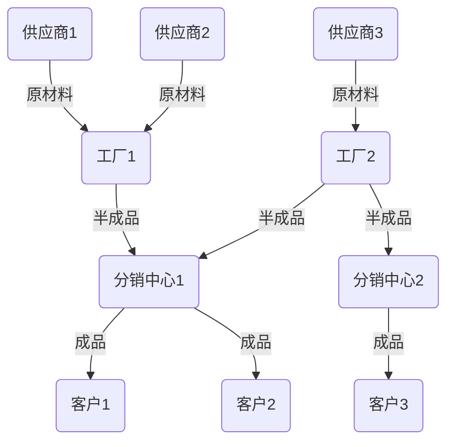

# 供应链系统、ERP系统、To B平台产品架构设计

## 1. 背景介绍

### 1.1 问题的由来

在当今快节奏的商业环境中，企业面临着来自多方面的挑战。为了保持竞争力并实现可持续发展,企业需要高效管理供应链、资源规划和业务合作伙伴关系。传统的分散式系统已经无法满足现代企业的需求,因此出现了供应链管理系统、企业资源计划(ERP)系统和面向企业的电子商务平台(To B平台)等解决方案。

供应链管理系统旨在优化供应链流程,提高效率和响应能力。ERP系统则集成了企业内部的核心业务流程,如财务、人力资源、生产和物流等。而To B平台则致力于简化企业之间的交易,提供在线采购、销售和合作的渠道。

然而,构建一个能够满足复杂业务需求的综合解决方案并非易事。它需要一个健壮、可扩展和安全的产品架构,以确保系统的高效运行和未来的发展。

### 1.2 研究现状

许多企业和研究机构都在探索如何设计和实现高效的供应链、ERP和To B平台解决方案。一些著名的供应链管理系统包括SAP的Advanced Planning & Optimization (APO)、Oracle的Supply Chain Management (SCM)和Manhattan Associates的供应链套件。在ERP系统方面,SAP、Oracle和Microsoft Dynamics都提供了成熟的产品。而在To B平台领域,Alibaba、Amazon Business和ThomasNet等公司都推出了自己的解决方案。

然而,这些现有解决方案往往存在着一些局限性,例如:

- 系统之间的集成困难
- 缺乏灵活性和可扩展性
- 安全性和隐私保护存在隐患
- 难以满足特定行业或企业的定制需求

因此,设计一个统一的、模块化的产品架构,以解决这些问题,成为了当前研究的重点。

### 1.3 研究意义

设计一个综合的供应链、ERP和To B平台产品架构,对于企业和整个行业都具有重要意义:

- 提高运营效率:通过集成和优化各个系统,企业可以提高供应链管理、资源规划和业务合作的效率,降低运营成本。
- 增强竞争力:拥有一个先进的综合解决方案,可以帮助企业获得竞争优势,满足不断变化的市场需求。
- 促进协作:统一的平台可以促进企业内部各部门之间,以及企业与合作伙伴之间的协作和信息共享。
- 支持创新:灵活的架构可以更容易地集成新技术和新功能,支持企业的创新和发展。

### 1.4 本文结构

本文将详细探讨供应链系统、ERP系统和To B平台产品架构的设计。文章主要包括以下几个部分:

1. **背景介绍**:阐述问题的由来、研究现状和意义。
2. **核心概念与联系**:介绍供应链、ERP和To B平台的核心概念,以及它们之间的关系。
3. **核心算法原理与具体操作步骤**:探讨产品架构设计中所采用的核心算法原理,并详细说明具体的操作步骤。
4. **数学模型和公式详细讲解与举例说明**:建立相关的数学模型,推导公式,并通过案例分析加以说明。
5. **项目实践:代码实例和详细解释说明**:提供实际的代码实现,并对其进行详细的解释和分析。
6. **实际应用场景**:介绍该产品架构在实际场景中的应用,并探讨未来的应用前景。
7. **工具和资源推荐**:推荐相关的学习资源、开发工具、论文等资源。
8. **总结:未来发展趋势与挑战**:总结研究成果,展望未来发展趋势,并分析可能面临的挑战。
9. **附录:常见问题与解答**:列出一些常见问题并给出解答。

## 2. 核心概念与联系

在深入探讨产品架构设计之前,我们需要先了解供应链系统、ERP系统和To B平台的核心概念,以及它们之间的关系。

### 2.1 供应链系统

供应链系统是指管理和优化供应链流程的系统,包括计划、采购、生产、运输和物流等环节。它的主要目标是提高效率、降低成本,并满足客户需求。

供应链系统的核心概念包括:

- **供应链网络**:包括供应商、制造商、分销商、零售商和最终客户等各个参与者。
- **物料流**:原材料、半成品和成品在供应链网络中的流动。
- **信息流**:在供应链参与者之间传递的订单、库存、需求和其他相关信息。
- **供应链规划**:根据预测需求制定生产、采购和运输计划。
- **供应链执行**:实施供应链计划,包括采购、生产、运输和交付等活动。
- **供应链协作**:供应链参与者之间的协作和信息共享。

### 2.2 ERP系统

ERP(Enterprise Resource Planning,企业资源计划)系统是一种集成了企业内部核心业务流程的软件系统,旨在提高企业运营效率和决策能力。

ERP系统的核心概念包括:

- **财务管理**:记录和管理企业的财务数据,包括总账、应收应付、成本核算等。
- **人力资源管理**:管理员工信息、薪酬、绩效和培训等。
- **生产计划与控制**:制定生产计划,监控生产过程,管理库存等。
- **销售与分销**:处理销售订单、交货、发票和客户关系管理等。
- **供应链管理**:与供应商合作,管理采购、运输和物流等。
- **数据集成**:将企业内部各个部门的数据集成到一个统一的数据库中。

### 2.3 To B平台

To B(Trade to Business)平台是一种面向企业的电子商务平台,为企业与企业之间的交易提供在线渠道。它可以简化采购、销售和合作流程,提高效率和透明度。

To B平台的核心概念包括:

- **在线采购**:企业可以在平台上搜索和采购所需的产品或服务。
- **在线销售**:企业可以在平台上展示和销售自己的产品或服务。
- **供应商管理**:企业可以管理和评估供应商,建立长期合作关系。
- **合作伙伴关系**:企业可以在平台上寻找合作伙伴,开展各种形式的合作。
- **信息共享**:平台提供信息共享和协作的渠道,促进企业之间的沟通和协作。
- **支付和结算**:平台提供安全的在线支付和结算功能。

### 2.4 三者关系

供应链系统、ERP系统和To B平台虽然各自侧重不同的领域,但它们之间存在着密切的关系和互补性:

1. **供应链系统与ERP系统**:供应链系统负责管理供应链流程,而ERP系统则提供了与供应链相关的模块,如采购、生产和物流等。两者需要紧密集成,以实现高效的供应链管理。

2. **ERP系统与To B平台**:ERP系统管理着企业内部的核心业务流程,而To B平台则为企业与外部合作伙伴的交易提供渠道。两者的集成可以简化采购、销售和合作流程,提高效率。

3. **供应链系统与To B平台**:供应链系统需要与供应商、分销商和客户进行协作,而To B平台则提供了一个在线协作和交易的平台。两者的结合可以优化供应链流程,提高响应能力。

因此,设计一个统一的产品架构,将这三个系统有机地集成在一起,可以充分发挥它们的协同作用,为企业带来更大的价值。

## 3. 核心算法原理与具体操作步骤

在设计供应链系统、ERP系统和To B平台产品架构时,需要采用一些核心算法来优化流程和决策。本节将介绍其中的一些关键算法原理及具体操作步骤。

### 3.1 算法原理概述

#### 3.1.1 供应链优化算法

供应链优化算法旨在最小化供应链总成本,同时满足客户需求和其他约束条件。常见的算法包括:

- **线性规划**:建立线性目标函数和约束条件,求解最优解。
- **混合整数规划**:在线性规划的基础上,引入整数变量来处理离散决策。
- **启发式算法**:如遗传算法、模拟退火等,用于求解复杂的组合优化问题。

#### 3.1.2 需求预测算法

需求预测算法用于预测未来的产品需求,以便制定生产和采购计划。常见的算法包括:

- **移动平均法**:根据历史数据计算滚动平均值作为预测值。
- **指数平滑法**:赋予最新数据更高权重,逐步减小历史数据的影响。
- **回归分析**:建立需求与影响因素之间的回归模型,进行预测。

#### 3.1.3 库存管理算法

库存管理算法用于确定最佳库存水平,平衡库存成本和缺货风险。常见的算法包括:

- **经济订货量模型(EOQ)**:根据订货成本和库存持有成本,计算最优订货量。
- **再订货点模型(ROP)**:根据lead time和需求率,确定触发补货的库存水平。
- **安全库存模型**:考虑需求波动和lead time波动,确定安全库存水平。

#### 3.1.4 运输路径优化算法

运输路径优化算法旨在找到最短路径或最低成本路径,以优化物流运输。常见的算法包括:

- **Dijkstra算法**:计算单源最短路径问题的最优解。
- **Floyd算法**:计算任意两点之间的最短路径。
- **车辆路径问题(VRP)**:在约束条件下,规划多辆车的最优路径。

### 3.2 算法步骤详解

接下来,我们将详细介绍其中一种核心算法的具体操作步骤——混合整数规划算法,用于求解供应链网络优化问题。

#### 步骤1:构建供应链网络模型

首先,我们需要建立供应链网络模型,包括供应商、工厂、分销中心和客户等节点,以及它们之间的物料流和成本。

#### 步骤2:确定决策变量

我们需要确定决策变量,即需要优化的对象。在供应链网络优化问题中,决策变量通常包括:

- 供应商到工厂的物料流量
- 工厂到分销中心的物料流量
- 分销中心到客户的物料流量
- 各节点的生产量或库存量

我们用 $x_{ijk}$ 表示从节点 $i$ 到节点 $j$ 的物料流量,其中 $k$ 表示产品种类。

#### 步骤3:建立目标函数

目标函数通常是要最小化的总成本,包括原材料采购成本、生产成本、运输成本和库存成本等。

$$\min \sum_{i,j,k} c_{ijk}x_{ijk} + \sum_i f_i(y_i)$$

其中,
- $c_{ijk}$ 是从节点 $i$ 到节点 $j$ 运输产品 $k$ 的单位成本
- $f_i(y_i)$ 是节点 $i$ 的生产或库存成本函数,与生产量或库存量 $y_i$ 有关

#### 步骤4:设置约束条件

约束条件包括供应链网络的物料平衡约束、生产能力约束、库存容量约束等。

1) 物料平衡约束:
$$\sum_i x_{ijk} - \sum_j x_{