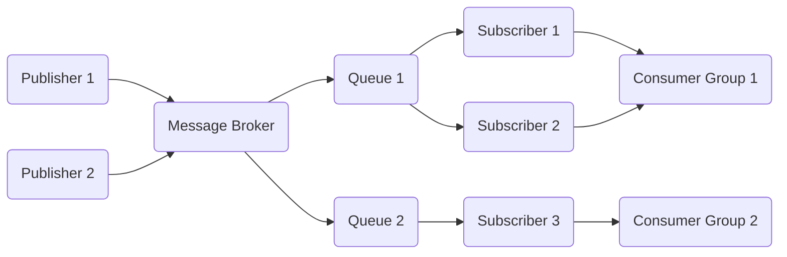

# 发布订阅 原理与代码实例讲解

## 1. 背景介绍

### 1.1 问题的由来

在软件系统的设计中,组件之间的通信和协作是一个关键问题。传统的面向对象编程范式中,对象之间通常通过紧密耦合的方式进行交互,这种方式存在一些缺陷,例如:

- 高度耦合导致可维护性和可扩展性较差
- 对象之间的依赖关系复杂,难以管理
- 需要对象之间相互了解彼此的接口,不够灵活

为了解决这些问题,发布订阅模式(Publish/Subscribe Pattern)应运而生。发布订阅模式提供了一种松耦合的通信机制,使得发布者(Publisher)和订阅者(Subscriber)之间的依赖关系降到最低。

### 1.2 研究现状

发布订阅模式已经被广泛应用于各种软件系统中,例如:

- 企业应用集成(Enterprise Application Integration, EAI)
- 物联网(Internet of Things, IoT)系统
- 实时系统
- 分布式系统
- 消息中间件(Message Queues)

目前,已经有许多成熟的发布订阅框架和库,例如RabbitMQ、Apache Kafka、Google Cloud Pub/Sub等。这些框架和库提供了可靠、高效的发布订阅功能,并支持各种消息传递模式(如点对点、发布/订阅、请求/响应等)。

### 1.3 研究意义

发布订阅模式具有以下优点:

- 松耦合:发布者和订阅者之间没有直接依赖关系,可以独立开发和部署
- 可扩展性强:新的发布者和订阅者可以动态加入系统,无需修改现有代码
- 异步通信:发布者和订阅者之间通过消息队列进行异步通信,提高了系统的吞吐量和响应能力
- 可靠性高:消息队列可以保证消息的持久化和传递,即使订阅者暂时离线也不会丢失消息

因此,深入研究发布订阅模式的原理和实现方式,对于设计和构建可扩展、灵活、高效的软件系统具有重要意义。

### 1.4 本文结构

本文将从以下几个方面详细介绍发布订阅模式:

1. 核心概念与联系
2. 核心算法原理与具体操作步骤
3. 数学模型和公式详细讲解与举例说明
4. 项目实践:代码实例和详细解释说明
5. 实际应用场景
6. 工具和资源推荐
7. 总结:未来发展趋势与挑战
8. 附录:常见问题与解答

## 2. 核心概念与联系

发布订阅模式涉及以下几个核心概念:

1. **发布者(Publisher)**: 发布者是产生消息的一方,它将消息发送到消息代理(Message Broker)或消息通道(Message Channel)中。

2. **订阅者(Subscriber)**: 订阅者是消费消息的一方,它从消息代理或消息通道中接收感兴趣的消息。

3. **消息代理(Message Broker)**: 消息代理是一个中介,它负责接收发布者发送的消息,并将消息路由到相应的订阅者。常见的消息代理有RabbitMQ、Apache Kafka等。

4. **主题(Topic)**: 主题是消息的逻辑分类,发布者将消息发布到特定的主题中,订阅者则订阅感兴趣的主题。

5. **消息队列(Message Queue)**: 消息队列用于暂时存储消息,以便订阅者可以异步地获取消息。

6. **消费组(Consumer Group)**: 在某些发布订阅系统中,订阅者可以组成消费组,每个消费组只会消费一次消息,实现消息的负载均衡和容错。

这些概念之间的关系如下所示:

发布者将消息发送到消息代理,消息代理根据主题将消息存储在相应的消息队列中。订阅者从消息队列中获取消息,可以组成消费组实现负载均衡和容错。

## 3. 核心算法原理与具体操作步骤

### 3.1 算法原理概述

发布订阅模式的核心算法原理可以概括为以下几个步骤:

1. **发布消息**: 发布者将消息发送到消息代理。

2. **路由消息**: 消息代理根据消息的主题,将消息路由到相应的消息队列中。

3. **订阅消息**: 订阅者向消息代理发送订阅请求,订阅感兴趣的主题。

4. **分发消息**: 消息代理将消息队列中的消息分发给订阅了相应主题的订阅者。

5. **消费消息**: 订阅者接收并处理消息。

6. **确认消息**: 订阅者向消息代理确认已经成功处理了消息,消息代理可以从队列中删除该消息。

这个过程中,发布者和订阅者之间是完全解耦的,它们只需要与消息代理进行交互,而不需要知道对方的存在。

### 3.2 算法步骤详解

下面我们详细解释一下发布订阅模式的算法步骤:

1. **发布消息**

发布者将消息发送到消息代理,通常包括以下信息:

- 消息体(Message Body): 实际的消息内容
- 消息头(Message Header): 包含一些元数据,如消息ID、发送时间等
- 消息属性(Message Properties): 可选的自定义属性
- 消息主题(Message Topic): 消息所属的主题

发布者可以使用消息代理提供的客户端库或API来发送消息。

2. **路由消息**

消息代理接收到发布者发送的消息后,需要根据消息的主题将消息路由到相应的消息队列中。这个过程通常包括以下步骤:

- 解析消息主题
- 查找与主题匹配的绑定(Binding),绑定将主题与消息队列关联起来
- 将消息存储到匹配的消息队列中

不同的消息代理可能采用不同的路由策略,例如主题匹配(Topic Matching)、内容过滤(Content Filtering)等。

3. **订阅消息**

订阅者向消息代理发送订阅请求,指定感兴趣的主题。订阅请求通常包括以下信息:

- 订阅主题(Subscription Topic): 订阅的主题
- 消费组(Consumer Group): 可选的消费组名称
- 其他订阅选项: 如消费模式(推拉模式)、消费位移(Offset)等

消息代理接收到订阅请求后,会将订阅者与相应的消息队列建立关联。

4. **分发消息**

消息代理将消息队列中的消息分发给订阅了相应主题的订阅者。分发策略可以是:

- 推模式(Push Mode): 消息代理主动将消息推送给订阅者
- 拉模式(Pull Mode): 订阅者主动从消息代理拉取消息

在推模式下,消息代理需要维护订阅者的在线状态和消费位移;在拉模式下,订阅者需要自行维护消费位移。

5. **消费消息**

订阅者接收到消息后,需要对消息进行处理。处理完成后,订阅者需要向消息代理发送确认信号,表示该消息已经被成功处理。

6. **确认消息**

消息代理收到订阅者的确认信号后,将从消息队列中删除该消息。如果在一定时间内没有收到确认信号,消息代理可能会重新分发该消息或将其持久化到磁盘,以防止消息丢失。

### 3.3 算法优缺点

发布订阅模式的优点包括:

- 解耦:发布者和订阅者之间完全解耦,可以独立开发和部署
- 可扩展性强:新的发布者和订阅者可以动态加入系统,无需修改现有代码
- 异步通信:发布者和订阅者之间通过消息队列进行异步通信,提高了系统的吞吐量和响应能力
- 可靠性高:消息队列可以保证消息的持久化和传递,即使订阅者暂时离线也不会丢失消息
- 负载均衡:订阅者可以组成消费组,实现消息的负载均衡和容错

缺点包括:

- 增加了系统复杂性:需要引入消息代理作为中介,增加了系统的复杂性
- 消息顺序性:在某些情况下,消息的顺序性可能会被打乱
- 性能开销:消息的发送、路由和分发会带来一定的性能开销
- 消息重复:在某些异常情况下,可能会出现消息重复的问题

### 3.4 算法应用领域

发布订阅模式可以应用于以下领域:

- 企业应用集成(EAI):集成不同的企业应用系统
- 物联网(IoT)系统:连接大量的物联网设备,实现设备之间的通信
- 实时系统:处理实时数据流,如股票行情、天气预报等
- 分布式系统:实现分布式系统中不同组件之间的通信
- 消息中间件:构建可靠、高效的消息传递系统
- 事件驱动架构:实现基于事件的loosely-coupled架构
- 流处理系统:处理实时数据流,如Kafka Streams、Apache Flink等

## 4. 数学模型和公式详细讲解与举例说明

在发布订阅模式中,我们可以使用一些数学模型和公式来描述和分析系统的行为。

### 4.1 数学模型构建

假设我们有一个发布订阅系统,包含 $m$ 个发布者和 $n$ 个订阅者。我们用 $P = \{p_1, p_2, \ldots, p_m\}$ 表示发布者集合,用 $S = \{s_1, s_2, \ldots, s_n\}$ 表示订阅者集合。

我们定义一个主题集合 $T = \{t_1, t_2, \ldots, t_k\}$,每个发布者 $p_i$ 可以向一个或多个主题发布消息,每个订阅者 $s_j$ 可以订阅一个或多个主题。

我们用 $\mathcal{P}(t_i)$ 表示发布到主题 $t_i$ 的发布者集合,用 $\mathcal{S}(t_i)$ 表示订阅主题 $t_i$ 的订阅者集合。那么我们有:

$$
\mathcal{P}(t_i) \subseteq P, \quad \mathcal{S}(t_i) \subseteq S
$$

我们假设每个发布者 $p_i$ 以恒定的速率 $\lambda_i$ 向其发布的主题发送消息,那么主题 $t_i$ 的总消息发送速率为:

$$
\Lambda(t_i) = \sum_{p_j \in \mathcal{P}(t_i)} \lambda_j
$$

另一方面,每个订阅者 $s_j$ 以恒定的速率 $\mu_j$ 消费其订阅的主题的消息,那么主题 $t_i$ 的总消息消费速率为:

$$
M(t_i) = \sum_{s_j \in \mathcal{S}(t_i)} \mu_j
$$

为了保证系统的稳定性,对于每个主题 $t_i$,我们需要保证:

$$
\Lambda(t_i) < M(t_i)
$$

也就是说,消费速率要大于发送速率,否则消息队列会无限增长,导致系统崩溃。

### 4.2 公式推导过程

在发布订阅系统中,我们经常需要计算消息队列的长度、消息等待时间等指标。下面我们将推导出这些公式。

假设主题 $t_i$ 的消息发送过程是一个泊松过程,其参数为 $\Lambda(t_i)$,消息消费过程也是一个泊松过程,其参数为 $M(t_i)$。根据队列论的结果,我们可以得到:

1. 消息队列长度的期望值:

$$
E[L(t_i)] = \frac{\Lambda(t_i)}{M(t_i) - \Lambda