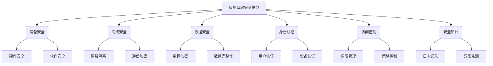

# 基于Java的智能家居设计：基于Java的智能家居安全模型

## 1. 背景介绍

### 1.1 问题的由来

随着科技的飞速发展，智能家居系统逐渐走进了我们的生活。智能家居系统能够通过互联网将家中的各种设备连接起来，实现对家居环境的自动化控制和远程监控。然而，随着智能家居系统的普及，安全问题也日益突出。由于智能家居系统涉及到大量的个人隐私数据和家庭信息，一旦系统被黑客入侵或者存在安全漏洞，将会给用户带来严重的隐私泄露和财产损失风险。因此，如何设计一个安全可靠的智能家居系统，成为了当前亟待解决的问题。

### 1.2 研究现状

目前，智能家居系统的安全问题已经引起了广泛关注。业界和学术界都在积极探索各种解决方案。常见的安全防护措施包括:

1. 加强设备和网络的安全防护
2. 采用加密技术保护数据传输
3. 实现身份认证和访问控制
4. 建立安全审计和监控机制

然而，由于智能家居系统涉及多种异构设备和复杂的网络环境，单一的安全防护措施难以满足全面的安全需求。因此，需要构建一个综合的安全框架,从系统架构、通信协议、数据存储等多个层面进行全方位的安全设计和防护。

### 1.3 研究意义

设计一个安全可靠的智能家居系统,对于保护用户的隐私和财产安全具有重要意义。同时,也将促进智能家居产业的健康发展。具体意义包括:

1. 提高用户对智能家居系统的信任度和使用粘性
2. 降低智能家居系统被攻击的风险,避免隐私泄露和财产损失
3. 为智能家居系统的安全规范和标准制定提供参考
4. 推动智能家居行业的技术创新和产业升级

### 1.4 本文结构

本文将围绕基于Java的智能家居安全模型展开讨论。全文共分为八个部分:

1. 背景介绍
2. 核心概念与联系
3. 核心算法原理与具体操作步骤
4. 数学模型和公式详细讲解与举例说明
5. 项目实践:代码实例和详细解释说明
6. 实际应用场景
7. 工具和资源推荐
8. 总结:未来发展趋势与挑战

## 2. 核心概念与联系

智能家居安全模型涉及到多个核心概念,它们之间存在着密切联系。下面将逐一介绍这些概念及其关系。

1. **设备安全**: 包括硬件安全和软件安全两个方面。硬件安全是指对智能家居设备的物理访问进行保护,防止被盗窃或者破坏;软件安全是指对设备系统和应用程序进行加固,防止被植入恶意代码或者遭受攻击。

2. **网络安全**: 主要包括网络隔离和通信加密两个方面。网络隔离是指将智能家居网络与外部网络进行物理或逻辑隔离,降低被攻击的风险;通信加密是指对智能家居设备之间的通信数据进行加密,防止被窃听或者篡改。

3. **数据安全**: 包括数据加密和数据完整性两个方面。数据加密是指对智能家居系统中的用户数据和设备数据进行加密存储,防止被窃取;数据完整性是指保证数据在传输和存储过程中不被篡改。

4. **身份认证**: 包括用户认证和设备认证两个方面。用户认证是指对使用智能家居系统的用户进行身份验证,防止非法用户访问;设备认证是指对接入智能家居网络的设备进行身份验证,防止非法设备接入。

5. **访问控制**: 包括权限管理和策略控制两个方面。权限管理是指对不同用户和设备分配不同的访问权限,控制它们对智能家居系统的访问范围;策略控制是指根据预定义的安全策略,对用户和设备的行为进行控制和约束。

6. **安全审计**: 包括日志记录和异常监测两个方面。日志记录是指对智能家居系统中的各种操作和事件进行记录,为安全审计和事后追查提供依据;异常监测是指对系统的运行状态进行实时监控,及时发现和处理安全异常。

上述各个概念相互关联、相互作用,共同构建了一个完整的智能家居安全防护体系。只有将这些概念有机结合,才能真正实现智能家居系统的全方位安全防护。

## 3. 核心算法原理与具体操作步骤

### 3.1 算法原理概述

智能家居安全模型的核心算法是基于Java的安全认证和访问控制算法。该算法的主要原理是:

1. 基于角色的访问控制(Role-Based Access Control, RBAC)
2. 基于属性的访问控制(Attribute-Based Access Control, ABAC)
3. 密钥交换和数字签名

RBAC是一种著名的访问控制模型,它将权限与角色相关联,用户通过被分配某个角色而获得该角色的权限。ABAC则是一种更加灵活的访问控制模型,它根据用户的属性(如身份、角色、环境等)动态决定用户的权限。

在智能家居场景中,RBAC用于管理家庭成员和智能设备的基本权限,而ABAC则用于根据具体情况动态调整权限。例如,在夜间时段,某些噪音设备的权限会被限制;当检测到有陌生人进入时,也会临时禁止某些隐私设备的访问。

为了保证通信安全,该算法采用了密钥交换和数字签名技术。所有设备和用户在接入系统时,都需要通过密钥交换协议获取会话密钥,用于加密后续的通信数据。同时,每个设备和用户都有一对公钥和私钥,用于对发送数据进行数字签名,接收方可以验证签名从而确认数据的完整性和发送者的身份。

### 3.2 算法步骤详解

该算法的具体步骤如下:

1. **系统初始化**
    - 为系统管理员分配超级权限角色
    - 导入所有智能设备的公钥,并为它们分配默认角色
    - 设置系统的根证书和密钥交换参数

2. **用户注册**
    - 用户提供身份信息(如姓名、邮箱等)
    - 系统为用户生成公钥/私钥对
    - 管理员为用户分配角色和权限

3. **设备接入**
    - 设备使用其私钥对自身信息进行签名
    - 系统验证设备签名,确认设备身份
    - 系统和设备执行密钥交换协议,协商会话密钥
    - 系统根据设备类型和属性,动态分配权限

4. **访问请求**
    - 用户或设备使用会话密钥加密访问请求
    - 请求附带用户/设备的身份信息和数字签名
    - 系统验证签名,确认发送者身份
    - 系统评估发送者的角色/属性,决定是否允许访问

5. **权限评估**
    - 首先评估基于角色的权限
    - 然后根据属性、环境等因素调整权限
    - 如果权限不足,拒绝访问请求
    - 如果权限满足,允许访问,并记录日志

6. **密钥更新**
    - 定期更新系统密钥和设备会话密钥
    - 对于已注销的用户,吊销其公钥

该算法通过角色和属性相结合的方式,实现了精细化的访问控制;通过密钥交换和数字签名,保证了通信的机密性、完整性和身份认证。同时,它还具有良好的扩展性,可以方便地集成新的访问控制策略和安全机制。

### 3.3 算法优缺点

**优点**:

1. 融合RBAC和ABAC,实现了灵活的访问控制
2. 采用密钥交换和数字签名,保证通信安全
3. 具有良好的扩展性,可集成新的安全机制
4. 遵循行业标准和最佳实践,可靠性较高

**缺点**:

1. 密钥管理相对复杂,需要专门的密钥基础设施
2. 访问控制策略的配置和维护工作量较大
3. 对系统资源的消耗较高,特别是加解密运算
4. 暂时缺乏大规模应用场景的实践验证

### 3.4 算法应用领域

该算法可以应用于各种智能家居系统,尤其适合于对安全性和隐私保护要求较高的场景,如:

- 高端智能社区
- 智能酒店
- 智能办公室
- 智能医疗机构
- 其他对隐私和数据安全要求较高的场景

除智能家居外,该算法的核心思想也可以推广应用于其他物联网系统、云计算环境等领域,为分布式系统提供安全可靠的访问控制解决方案。

## 4. 数学模型和公式详细讲解与举例说明

### 4.1 数学模型构建

智能家居安全模型中的访问控制策略,可以用一个六元组数学模型来表示:

$$
AC = (U, R, P, S, E, \phi)
$$

其中:

- $U$ 表示用户集合
- $R$ 表示角色集合
- $P$ 表示权限集合
- $S$ 表示智能设备集合
- $E$ 表示环境属性集合
- $\phi$ 表示访问控制策略函数

访问控制策略函数 $\phi$ 的定义如下:

$$
\phi: U \times R \times P \times S \times E \rightarrow \{0, 1\}
$$

其中, $\phi(u, r, p, s, e) = 1$ 表示允许用户 $u$ 在角色 $r$ 下,对设备 $s$ 执行权限 $p$,且满足环境属性 $e$; 否则为 $0$,表示拒绝访问。

这个数学模型综合考虑了用户身份、角色、权限、设备以及环境因素,能够精确描述智能家居系统中的访问控制策略。

### 4.2 公式推导过程

我们以一个简单的RBAC模型为例,推导出访问控制策略函数的具体形式。

假设有用户集合 $U$、角色集合 $R$、权限集合 $P$,我们定义:

- 用户-角色分配关系 $UA \subseteq U \times R$
- 角色-权限分配关系 $PA \subseteq R \times P$

则基于RBAC的访问控制策略函数可以表示为:

$$
\phi_{\text{RBAC}}(u, r, p) = \begin{cases}
1, & \text{if } \exists (u, r) \in UA \text{ and } (r, p) \in PA\\
0, & \text{otherwise}
\end{cases}
$$

进一步,我们引入设备集合 $S$,定义设备-权限分配关系 $SPA \subseteq S \times P$,则策略函数可扩展为:

$$
\phi_{\text{RBAC}}(u, r, p, s) = \begin{cases}
1, & \text{if } \exists (u, r) \in UA, (r, p) \in PA, (s, p) \in SPA\\
0, & \text{otherwise}
\end{cases}
$$

最后,我们引入环境属性集合 $E$,定义环境约束条件 $C(e)$,则最终的访问控制策略函数为:

$$
\phi(u, r, p, s, e) = \begin{cases}
1, & \text{if } \exists (