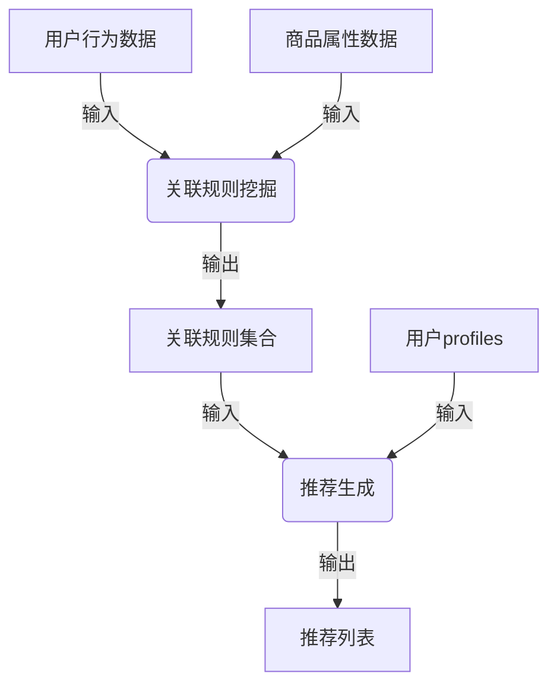

# 基于关联挖掘的服装推荐系统详细设计与具体代码实现

## 1. 背景介绍

### 1.1 问题的由来

在当今时代,随着互联网和电子商务的快速发展,人们购物的方式发生了翻天覆地的变化。线上购物已经成为了一种主流趋势,但同时也带来了一个新的挑战:如何从海量的商品中精准推荐符合用户需求和偏好的商品?传统的基于内容或协同过滤的推荐算法已经难以满足日益增长的个性化需求。

服装作为一种重要的消费品,对于很多人来说不仅仅是满足基本的穿着需求,更是一种时尚追求和个性展现。然而,由于服装种类繁多、款式新旧交替、个人品味差异等因素,如何为用户推荐合适的服装成为了一个亟待解决的问题。

### 1.2 研究现状

为了解决上述问题,研究人员提出了多种推荐算法,例如基于内容的推荐、协同过滤推荐、基于知识的推荐等。其中,基于关联规则挖掘的推荐算法因其能够发现隐藏在海量数据中的有趣关联模式而备受关注。

关联规则挖掘最早被应用于市场篮分析,用于发现不同商品之间的关联关系,从而为商家提供有价值的决策支持。随后,这一技术也被引入到推荐系统领域,用于发现用户行为模式和商品关联模式,为个性化推荐提供支持。

目前,已有多项研究工作探索了基于关联规则挖掘的服装推荐算法,取得了一定的成果。但是,大多数现有方法还存在一些不足,例如难以处理高维、稀疏的数据、无法充分利用多源异构数据、对于复杂的用户偏好和商品属性关联挖掘能力有限等。

### 1.3 研究意义

设计一种高效、准确的基于关联挖掘的服装推荐系统,不仅能够提高电子商务平台的用户体验和销售额,还能为其他推荐场景提供借鉴和参考。具体来说,本研究的意义主要体现在以下几个方面:

1. **提高推荐质量**:通过深入挖掘用户行为数据和商品属性数据,发现隐藏的关联模式,从而提高推荐的准确性和个性化程度。
2. **优化用户体验**:准确的推荐可以减少用户在海量商品中寻找感兴趣商品的时间和精力,提升购物体验。
3. **促进销售额增长**:为用户推荐感兴趣的商品,可以提高成交率和复购率,从而促进电商平台的销售额增长。
4. **支持决策制定**:挖掘出的关联模式不仅可用于推荐,还可为商家的营销策略、库存管理等决策提供依据。

### 1.4 本文结构

本文将详细介绍基于关联挖掘的服装推荐系统的设计和实现过程。文章主要分为以下几个部分:

1. **背景介绍**:阐述问题的由来、研究现状和意义。
2. **核心概念与联系**:介绍关联规则挖掘、推荐系统等核心概念,并阐明它们之间的联系。
3. **核心算法原理与具体步骤**:深入探讨关联规则挖掘算法的原理和具体实现步骤,包括算法优缺点和应用领域分析。
4. **数学模型和公式详解**:构建关联规则挖掘的数学模型,并对相关公式进行推导和案例分析。
5. **项目实践:代码实例和解释**:提供一个基于Python的服装推荐系统实例,包括开发环境搭建、源代码实现、代码解读和运行结果展示。
6. **实际应用场景**:介绍基于关联挖掘的服装推荐系统在实际场景中的应用,并对未来应用前景进行展望。
7. **工具和资源推荐**:推荐相关的学习资源、开发工具、论文等资源,方便读者进一步学习和研究。
8. **总结:未来发展趋势与挑战**:总结研究成果,探讨该领域的发展趋势和面临的挑战,并对未来研究方向进行展望。
9. **附录:常见问题与解答**:列出一些常见问题并给出解答,帮助读者更好地理解和应用该技术。

## 2. 核心概念与联系

在深入探讨基于关联挖掘的服装推荐系统之前,我们需要先了解一些核心概念,包括关联规则挖掘、推荐系统等,并阐明它们之间的联系。

### 2.1 关联规则挖掘

#### 2.1.1 定义

关联规则挖掘(Association Rule Mining)是一种从大规模数据集中发现有趣关联或相关性模式的技术。它最早被应用于市场篮分析,用于发现不同商品之间的关联关系,从而为商家提供有价值的决策支持。

一条关联规则通常表示为 `X -> Y`,其中 X 和 Y 都是数据集中的项集(项的集合),X 被称为前件(antecedent),Y 被称为后件(consequent)。该规则的含义是:如果一个交易包含了 X,那么它也很可能包含 Y。

#### 2.1.2 度量指标

评估关联规则的质量通常使用以下两个度量指标:

1. **支持度(Support)**:支持度表示数据集中包含 X 和 Y 的记录占总记录数的比例,用于衡量规则的普遍性和重要性。

   $$\text{Support}(X \rightarrow Y) = \frac{\text{count}(X \cup Y)}{N}$$

   其中,count(X ∪ Y)表示包含项集 X 和 Y 的记录数,N 表示总记录数。

2. **置信度(Confidence)**:置信度表示包含 X 的记录中同时也包含 Y 的比例,用于衡量规则的可靠性。

   $$\text{Confidence}(X \rightarrow Y) = \frac{\text{count}(X \cup Y)}{\text{count}(X)}$$

通常,我们会设置一个最小支持度和最小置信度阈值,只保留满足这些阈值的关联规则。

#### 2.1.3 算法

关联规则挖掘的经典算法有 Apriori 算法、FP-Growth 算法等。这些算法的核心思想是通过反复扫描数据集,发现频繁项集,然后根据频繁项集生成关联规则。

### 2.2 推荐系统

推荐系统是一种为用户主动推荐可能感兴趣的项目(如商品、服务、信息等)的智能系统。它通过分析用户的历史行为数据、偏好等信息,预测用户的潜在需求,从而提供个性化的推荐。

推荐系统通常采用以下几种技术:

1. **基于内容(Content-based)推荐**:根据项目的内容特征(如书籍的主题、电影的类型等)与用户的历史偏好进行匹配。
2. **协同过滤(Collaborative Filtering)推荐**:基于用户之间的相似性或项目之间的相似性进行推荐。
3. **基于知识(Knowledge-based)推荐**:利用领域知识和规则进行推理和推荐。
4. **混合(Hybrid)推荐**:结合上述多种技术的优点,综合多种推荐策略。

### 2.3 关联挖掘与推荐系统的联系

关联规则挖掘技术可以为推荐系统提供有力支持。具体来说,它们之间的联系主要体现在以下几个方面:

1. **发现隐藏的关联模式**:通过关联规则挖掘,我们可以从用户行为数据和商品属性数据中发现隐藏的关联模式,例如用户的购买习惯、商品之间的关联等。这些模式可以为推荐系统提供有价值的信息。

2. **构建推荐模型**:关联规则可以直接用于构建推荐模型。例如,如果发现规则 `{上衣A} -> {裤子B}`的置信度很高,那么对于购买了上衣A的用户,我们可以推荐裤子B。

3. **优化推荐策略**:关联规则挖掘可以帮助我们优化推荐策略,例如通过分析用户的购买模式,调整推荐时机和频率;通过分析商品之间的关联,优化推荐列表的组合等。

4. **提高推荐质量**:将关联挖掘技术与其他推荐技术(如协同过滤)相结合,可以提高推荐的准确性和个性化程度。

5. **支持决策制定**:除了用于推荐,关联规则挖掘还可以为商家的营销策略、库存管理等决策提供依据。

综上所述,关联规则挖掘为推荐系统提供了有力支持,而推荐系统也为关联规则挖掘提供了广阔的应用场景。两者的结合可以极大地提高推荐的质量和效果。

## 3. 核心算法原理与具体操作步骤

在上一节中,我们介绍了关联规则挖掘和推荐系统的核心概念,本节将深入探讨基于关联规则挖掘的推荐算法的原理和具体实现步骤。

### 3.1 算法原理概述

基于关联规则挖掘的推荐算法主要分为两个阶段:

1. **关联规则挖掘阶段**:从用户行为数据和商品属性数据中挖掘出有趣的关联规则。
2. **推荐生成阶段**:基于挖掘出的关联规则,为用户生成个性化推荐列表。

具体来说,算法的工作流程如下:

1. 收集用户的历史行为数据(如浏览记录、购买记录等)和商品的属性数据(如类别、价格、描述等)作为输入。
2. 使用关联规则挖掘算法(如Apriori、FP-Growth等)从这些数据中发现频繁项集,并基于频繁项集生成关联规则集合。
3. 针对每个用户,结合其用户画像(user profile)和挖掘出的关联规则,为其生成个性化的推荐列表。

在整个过程中,关联规则挖掘阶段是关键,它决定了推荐质量的高低。下面我们将重点介绍这一阶段的核心算法原理和具体步骤。

### 3.2 算法步骤详解

假设我们有一个包含用户购买记录的数据集 D,其中每条记录表示一个用户的购买项集(即一次购买中包含的所有商品)。我们的目标是从 D 中发现有趣的关联规则,即满足最小支持度和最小置信度阈值的规则。

一种常见的关联规则挖掘算法是 Apriori 算法,它的核心思想是反复扫描数据集,发现频繁项集,然后根据频繁项集生成关联规则。具体步骤如下:

#### 3.2.1 第一次扫描:发现频繁1-项集

1. 扫描数据集 D,统计每个项(商品)的出现次数。
2. 计算每个项的支持度,并将支持度大于最小支持度阈值的项作为频繁1-项集 L1。

#### 3.2.2 第k次扫描:发现频繁k-项集

1. 基于频繁(k-1)-项集 Lk-1,生成候选k-项集 Ck。
2. 扫描数据集 D,统计每个候选k-项集在 D 中出现的次数。
3. 计算每个候选k-项集的支持度,并将支持度大于最小支持度阈值的项集作为频繁k-项集 Lk。
4. 重复步骤1-3,直到无法再生成新的频繁项集为止。

#### 3.2.3 生成关联规则

对于每个频繁k-项集 l,生成所有非空的真子集 s,如果 s