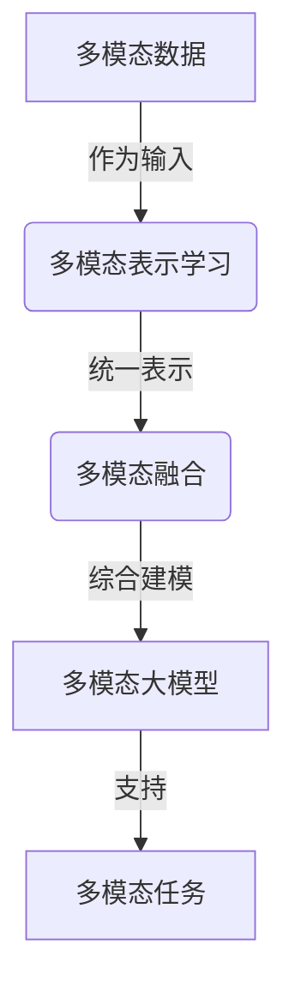

# 多模态大模型：技术原理与实战 用多模态大模型打造AI助理实战

## 1. 背景介绍

### 1.1 问题的由来

随着人工智能技术的不断发展，人们对AI助理的期望也在不断提高。传统的文本交互方式已经无法满足用户的需求,用户希望与AI助理进行更自然、更多模态的交互,比如语音、视觉、手势等。因此,构建支持多模态交互的AI助理成为了一个迫切的需求。

多模态大模型(Multimodal Large Model)应运而生,它能够同时处理文本、语音、图像、视频等多种模态数据,为构建多模态AI助理奠定了基础。本文将深入探讨多模态大模型的技术原理,并通过实战案例演示如何利用它打造智能AI助理。

### 1.2 研究现状

近年来,随着深度学习技术的飞速发展,大型预训练模型(Large Pre-trained Model)在自然语言处理、计算机视觉等领域取得了巨大成功。代表性模型包括GPT、BERT、ViT等。然而,这些模型大多专注于单一模态,无法同时处理多种模态数据。

为解决这一问题,研究人员提出了多模态大模型,旨在统一处理不同模态的数据。代表性工作包括:

- **DALL-E**: OpenAI推出的生成式多模态大模型,能够根据文本描述生成图像。
- **Flamingo**: DeepMind提出的多模态模型,支持文本、图像、视频等多种模态数据的处理。
- **GPT-4**: OpenAI即将发布的新一代大模型,预计将支持多模态输入输出。

这些模型展现了多模态大模型在多模态交互、多模态生成等领域的巨大潜力。

### 1.3 研究意义

构建支持多模态交互的AI助理,对于提升人机交互体验、拓展AI应用场景具有重要意义:

1. **自然交互体验**: 多模态交互更贴近人类的自然交互方式,有助于提高AI助理的易用性和用户体验。

2. **信息表达丰富**: 通过整合多种模态数据,AI助理可以更全面、更生动地表达和理解信息。

3. **拓展应用场景**: 多模态AI助理可广泛应用于教育、医疗、旅游、娱乐等多个领域,为人们带来全新的智能服务体验。

4. **推动AI发展**: 多模态大模型是人工智能发展的前沿方向,对于推动AI技术创新具有重要意义。

### 1.4 本文结构

本文将全面介绍多模态大模型的技术原理和实战应用。主要内容包括:

1. 核心概念与联系
2. 核心算法原理与具体操作步骤
3. 数学模型和公式详细讲解与案例分析
4. 项目实践:代码实例和详细解释
5. 实际应用场景
6. 工具和资源推荐
7. 总结:未来发展趋势与挑战
8. 附录:常见问题与解答

## 2. 核心概念与联系

在深入探讨多模态大模型的技术细节之前,我们先来了解一些核心概念及它们之间的联系。

### 2.1 多模态数据

所谓多模态数据,是指包含多种形式(模态)的数据,常见的模态包括:

- 文本(Text)
- 语音(Speech)
- 图像(Image)
- 视频(Video)
- 等等

多模态数据能够更全面、更生动地表达信息,是构建智能AI系统的重要数据来源。

### 2.2 多模态表示学习

多模态表示学习(Multimodal Representation Learning)旨在从多模态数据中学习出统一的表示形式,使得不同模态的数据可以在同一个向量空间中进行处理和计算。这是实现多模态融合的关键技术。

常见的多模态表示学习方法包括:

- 共享编码器(Shared Encoder)
- 对比学习(Contrastive Learning)
- 自注意力机制(Self-Attention Mechanism)

### 2.3 多模态融合

多模态融合(Multimodal Fusion)是指将来自不同模态的信息进行融合,得到综合的多模态表示。这是实现多模态建模和推理的核心环节。

常见的多模态融合方法有:

- 特征级融合(Feature-level Fusion)
- 决策级融合(Decision-level Fusion)
- 注意力融合(Attention Fusion)

### 2.4 多模态大模型

多模态大模型(Multimodal Large Model)是一种能够统一处理多种模态数据的大型神经网络模型。它通过多模态表示学习和多模态融合技术,实现了对多模态数据的高效建模和推理。

多模态大模型可应用于多种任务,如多模态生成、多模态检索、多模态问答等,为构建智能AI助理奠定了基础。

### 2.5 核心概念联系

上述核心概念之间存在紧密联系,如下所示:

1. 多模态数据作为输入,经过多模态表示学习得到统一的表示形式。
2. 统一的多模态表示作为输入,通过多模态融合技术进行综合建模。
3. 多模态融合的结果构建了多模态大模型,支持多种多模态任务。

掌握这些核心概念及其联系,有助于我们深入理解多模态大模型的工作原理。

## 3. 核心算法原理与具体操作步骤

### 3.1 算法原理概述

多模态大模型的核心算法原理可概括为三个主要步骤:

1. **多模态表示学习**: 将不同模态的输入数据映射到同一个向量空间中,得到统一的表示形式。
2. **多模态融合**: 将不同模态的表示进行融合,得到综合的多模态表示。
3. **多模态建模与推理**: 基于融合后的多模态表示,进行下游任务的建模和推理。

这三个步骤构成了多模态大模型的核心算法流程,我们将在下文对每个步骤进行详细介绍。

### 3.2 算法步骤详解

#### 3.2.1 多模态表示学习

多模态表示学习的目标是将不同模态的输入数据映射到同一个向量空间中,得到统一的表示形式。常见的方法包括:

1. **共享编码器(Shared Encoder)**

   该方法使用一个共享的编码器网络(如Transformer)对不同模态的输入进行编码,得到统一的向量表示。例如,对于文本输入和图像输入,可以使用相同的Transformer编码器对它们进行编码,得到文本表示和图像表示。

   $$\boldsymbol{h}_\text{text} = \text{TextEncoder}(\text{text\_input})$$
   $$\boldsymbol{h}_\text{image} = \text{ImageEncoder}(\text{image\_input})$$

2. **对比学习(Contrastive Learning)**

   对比学习通过最大化相似样本之间的相似度,最小化不相似样本之间的相似度,来学习出统一的表示空间。常见的对比学习方法包括MoCo、SimCLR等。

   $$\mathcal{L}_\text{contrast} = -\log \frac{\exp(\text{sim}(\boldsymbol{h}_i, \boldsymbol{h}_j) / \tau)}{\sum_{k=1}^{N} \exp(\text{sim}(\boldsymbol{h}_i, \boldsymbol{h}_k) / \tau)}$$

3. **自注意力机制(Self-Attention Mechanism)**

   自注意力机制能够自动捕获输入数据中的重要信息,并生成相应的表示向量。通过设计合适的注意力机制,可以实现不同模态之间的交互,从而得到统一的表示。

   $$\boldsymbol{h}_i = \sum_{j=1}^{N} \alpha_{ij} \boldsymbol{x}_j$$
   $$\alpha_{ij} = \frac{\exp(e_{ij})}{\sum_{k=1}^{N} \exp(e_{ik})}, \quad e_{ij} = f(\boldsymbol{x}_i, \boldsymbol{x}_j)$$

通过上述方法,我们可以将不同模态的输入数据映射到同一个向量空间中,为后续的多模态融合奠定基础。

#### 3.2.2 多模态融合

多模态融合旨在将不同模态的表示进行融合,得到综合的多模态表示。常见的融合方法包括:

1. **特征级融合(Feature-level Fusion)**

   特征级融合直接将不同模态的表示向量进行拼接或加权求和,得到融合后的多模态表示。

   $$\boldsymbol{h}_\text{fused} = \begin{cases}
   \text{Concat}(\boldsymbol{h}_\text{text}, \boldsymbol{h}_\text{image}) \\
   \alpha \boldsymbol{h}_\text{text} + \beta \boldsymbol{h}_\text{image}
   \end{cases}$$

2. **决策级融合(Decision-level Fusion)**

   决策级融合先分别对每种模态进行单模态建模,再将各模态的决策结果进行融合。

   $$\boldsymbol{y}_\text{text} = f_\text{text}(\boldsymbol{h}_\text{text})$$
   $$\boldsymbol{y}_\text{image} = f_\text{image}(\boldsymbol{h}_\text{image})$$
   $$\boldsymbol{y}_\text{fused} = g(\boldsymbol{y}_\text{text}, \boldsymbol{y}_\text{image})$$

3. **注意力融合(Attention Fusion)**

   注意力融合使用注意力机制动态地为不同模态分配权重,得到加权融合的多模态表示。

   $$\boldsymbol{h}_\text{fused} = \sum_{i=1}^{M} \alpha_i \boldsymbol{h}_i$$
   $$\alpha_i = \frac{\exp(e_i)}{\sum_{j=1}^{M} \exp(e_j)}, \quad e_i = f(\boldsymbol{h}_i, \boldsymbol{q})$$

通过上述融合方法,我们可以将不同模态的表示进行融合,得到综合的多模态表示,为后续的多模态建模与推理奠定基础。

#### 3.2.3 多模态建模与推理

基于融合后的多模态表示,我们可以进行多模态建模和推理,完成下游任务。常见的方法包括:

1. **多模态分类(Multimodal Classification)**

   将多模态表示输入到分类器中,对目标类别进行预测。

   $$\boldsymbol{y} = \text{Classifier}(\boldsymbol{h}_\text{fused})$$

2. **多模态生成(Multimodal Generation)**

   将多模态表示输入到生成器中,生成目标模态的输出。

   $$\boldsymbol{x}_\text{gen} = \text{Generator}(\boldsymbol{h}_\text{fused})$$

3. **多模态检索(Multimodal Retrieval)**

   基于多模态表示计算查询和候选项之间的相似度,完成检索任务。

   $$\text{score}(\boldsymbol{q}, \boldsymbol{c}) = f(\boldsymbol{h}_\boldsymbol{q}, \boldsymbol{h}_\boldsymbol{c})$$

4. **多模态问答(Multimodal Question Answering)**

   将多模态表示输入到问答模型中,回答基于多模态数据的问题。

   $$\boldsymbol{a} = \text{QAModel}(\boldsymbol{h}_\text{fused}, \boldsymbol{q})$$

通过上述方法,我们可以利用多模态大模型完成各种多模态任务,为构建智能AI助理奠定基础。

### 3.3 算法优缺点

多模态大模型算法具有以下优缺点:

**优点**:

1. **统一处理多模态数据**: 能够同时处理文本、图像、视频等多种模态数据,实现真正的多模态交互和建模。
2. **数据利用率高**: 通过融合多模态信息,能够更充分地利用数据中蕴含的知识,提高模型性能。
3. **泛化能力强**: 模型在训练过程中接触到多种模态数据,因此具有更强的泛化能力。
4. **应用场景广泛**: 多模态大模型可应用于多模态生成、多模态检索、多模态问答等多个领域。

**缺点**:

1. **训