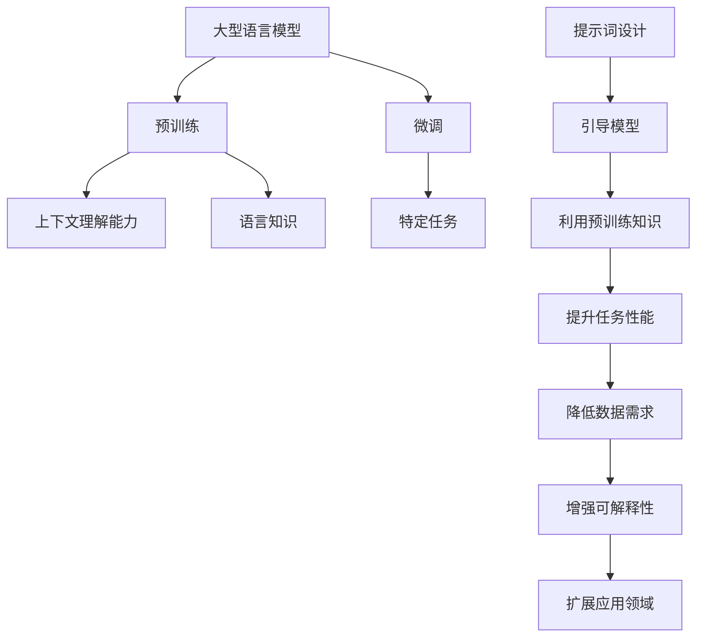

# 大语言模型原理与工程实践：提示词设计

## 1. 背景介绍

### 1.1 问题的由来

近年来,大型语言模型(Large Language Models, LLMs)在自然语言处理(NLP)领域取得了令人瞩目的成就。这些模型通过在海量文本数据上进行预训练,学习到了丰富的语言知识和上下文理解能力。然而,直接将这些模型应用于特定任务时,往往会遇到一些挑战,例如:

1. **样本不足**:虽然预训练数据规模庞大,但针对特定任务的标注数据通常较少,导致微调效果不佳。
2. **任务偏移**:预训练数据与特定任务存在分布偏移,模型在新任务上的泛化能力受到影响。
3. **知识孤岛**:模型缺乏对特定领域知识的理解,难以应对需要专业知识的任务。

为了解决这些问题,**提示词设计(Prompt Engineering)**应运而生。它通过巧妙设计提示词(Prompt),引导语言模型更好地利用预训练知识,提升在特定任务上的表现。

### 1.2 研究现状

提示词设计作为一种新兴的范式,已经在多个领域展现出巨大的潜力。例如,在文本生成、问答系统、代码生成等任务中,通过设计合适的提示词,可以显著提高语言模型的性能。

目前,提示词设计主要分为以下几种方式:

1. **手工设计**:人工编写提示词,需要大量的人力和领域知识。
2. **自动搜索**:通过搜索算法自动生成提示词,但搜索空间巨大,效率低下。
3. **元学习**:在辅助数据上学习生成提示词的能力,但需要大量标注数据。
4. **反馈优化**:根据模型输出与期望的差异,迭代优化提示词,但收敛慢。

虽然现有方法取得了一些进展,但仍然存在诸多挑战,如提示词质量的评估、提示词的可解释性、提示词生成的高效性等,亟待进一步研究和探索。

### 1.3 研究意义

提示词设计对于充分发挥大型语言模型的潜力至关重要。通过合理的提示词设计,我们可以:

1. **提高任务性能**:引导模型更好地利用预训练知识,提升在特定任务上的表现。
2. **降低数据需求**:减少对大量标注数据的依赖,降低数据获取和标注的成本。
3. **增强可解释性**:通过分析提示词,更好地理解模型的决策过程和知识来源。
4. **扩展应用领域**:将语言模型应用于更多需要专业知识的领域,如医疗、法律等。

因此,深入研究提示词设计的原理和方法,对于充分发挥大型语言模型的潜力,推动人工智能技术的发展具有重要意义。

### 1.4 本文结构

本文将全面介绍提示词设计的理论基础、方法和应用。主要内容包括:

1. 核心概念与联系
2. 核心算法原理与具体操作步骤
3. 数学模型和公式详细讲解与案例分析
4. 项目实践:代码实例和详细解释
5. 实际应用场景和未来展望
6. 工具和资源推荐
7. 总结:未来发展趋势与挑战
8. 附录:常见问题与解答

接下来,我们将逐一探讨这些内容。

## 2. 核心概念与联系

在深入讨论提示词设计的细节之前,我们先介绍一些核心概念和它们之间的联系。

1. **大型语言模型(LLMs)**: 通过在海量文本数据上进行预训练,获得了丰富的语言知识和上下文理解能力。
2. **预训练**: 使用自监督学习或无监督学习的方式,在大规模文本数据上训练语言模型,获取通用的语言知识。
3. **微调**: 在特定任务的标注数据上,对预训练模型进行进一步的有监督微调,使其适应特定任务。
4. **提示词设计**: 通过巧妙设计提示词,引导语言模型更好地利用预训练知识,提升在特定任务上的表现。
5. **任务性能提升**: 合理的提示词设计可以显著提高语言模型在特定任务上的性能。
6. **降低数据需求**: 通过提示词设计,可以减少对大量标注数据的依赖,降低数据获取和标注的成本。
7. **增强可解释性**: 分析提示词可以更好地理解模型的决策过程和知识来源,提高模型的可解释性。
8. **扩展应用领域**: 将语言模型应用于更多需要专业知识的领域,如医疗、法律等。

这些概念相互关联、环环相扣,共同构成了提示词设计的理论基础和应用价值。接下来,我们将深入探讨提示词设计的核心算法原理和具体操作步骤。

## 3. 核心算法原理与具体操作步骤

### 3.1 算法原理概述

提示词设计的核心算法原理可以概括为:通过设计合适的提示词,将原任务转化为语言模型在预训练过程中已经接触过的形式,从而引导模型更好地利用预训练知识。

这个过程可以分为以下几个关键步骤:

1. **任务形式化**: 将原始任务转化为一种语言模型熟悉的形式,例如文本生成、文本分类等。
2. **提示词设计**: 设计合适的提示词,将形式化后的任务与语言模型的预训练知识联系起来。
3. **模型推理**: 将提示词输入到语言模型中,模型根据预训练知识和提示词进行推理,输出结果。
4. **结果解码**: 将模型输出解码为原始任务的目标形式,得到最终结果。

这个过程的关键在于提示词的设计。一个好的提示词应该能够充分利用语言模型的预训练知识,同时又不会引入过多的噪声和偏差。下面我们将详细介绍提示词设计的具体操作步骤。

### 3.2 算法步骤详解

提示词设计的具体操作步骤如下:

1. **任务分析**
   - 深入理解任务的本质,包括输入、输出、约束条件等。
   - 确定任务的形式化方式,例如文本生成、分类、问答等。

2. **预训练知识挖掘**
   - 分析语言模型的预训练数据和训练目标,了解其掌握的知识类型。
   - 确定与当前任务相关的预训练知识,作为设计提示词的基础。

3. **提示词模板设计**
   - 根据任务形式和预训练知识,设计初始的提示词模板。
   - 模板应该能够将任务与预训练知识联系起来,同时保留足够的灵活性。

4. **提示词优化**
   - 通过人工或自动化方法,不断优化和迭代提示词。
   - 评估提示词对模型性能的影响,并根据反馈进行调整。

5. **上下文增强**
   - 为提示词添加额外的上下文信息,如任务描述、示例等。
   - 这些上下文可以进一步引导模型理解任务,提高性能。

6. **模型推理与结果解码**
   - 将优化后的提示词输入语言模型,获取模型输出。
   - 将模型输出解码为原始任务的目标形式,得到最终结果。

7. **性能评估与迭代**
   - 在测试集上评估模型的性能,包括准确性、稳健性等指标。
   - 根据评估结果,重新优化提示词,进行多轮迭代。

这个过程需要不断地试错和调整,直到获得满意的性能。下面我们将介绍一些提示词设计的技巧和注意事项。

### 3.3 算法优缺点

提示词设计作为一种新兴的范式,具有以下优点:

1. **数据高效**:通过提示词设计,可以减少对大量标注数据的依赖,降低数据获取和标注的成本。
2. **泛化性强**:提示词设计可以帮助语言模型更好地利用预训练知识,提升在新任务上的泛化能力。
3. **可解释性**:通过分析提示词,可以更好地理解模型的决策过程和知识来源,提高模型的可解释性。
4. **灵活性高**:提示词设计可以应用于各种不同的任务和领域,具有很强的灵活性和适应性。

但同时,提示词设计也存在一些缺点和挑战:

1. **人工成本高**:手工设计高质量的提示词需要大量的人力和领域知识,成本较高。
2. **自动化困难**:自动化生成提示词的算法目前仍然效率较低,搜索空间巨大。
3. **评估困难**:缺乏统一的评估标准和方法,难以客观评估提示词的质量。
4. **可解释性局限**:虽然提示词本身具有一定的可解释性,但对于复杂的语言模型决策过程,解释能力仍然有限。

因此,提示词设计的研究还需要进一步深入,以提高其效率、可靠性和可解释性。

### 3.4 算法应用领域

提示词设计作为一种通用的范式,可以应用于各种基于语言模型的任务和领域,包括但不限于:

1. **文本生成**:通过设计合适的提示词,可以指导语言模型生成高质量的文本,如新闻报道、小说、广告文案等。
2. **问答系统**:将问题转化为提示词,引导语言模型根据预训练知识回答相关问题。
3. **代码生成**:将代码生成任务形式化为文本生成问题,利用提示词指导模型生成目标代码。
4. **文本分类**:通过设计分类提示词,将文本分类任务转化为语言模型熟悉的形式。
5. **机器翻译**:将源语言文本作为提示词,引导模型生成目标语言的翻译结果。
6. **知识提取**:设计提示词从语言模型中提取特定领域的知识,构建知识库。
7. **多模态任务**:将图像、视频等多模态信息编码为提示词,指导语言模型进行多模态理解和生成。

除了上述常见任务,提示词设计还可以应用于需要专业知识的领域,如医疗、法律、金融等,帮助语言模型掌握和利用这些领域知识。

总的来说,提示词设计为语言模型的应用开辟了新的可能性,有望推动人工智能技术在更多领域的落地和发展。

## 4. 数学模型和公式详细讲解与举例说明

### 4.1 数学模型构建

为了更好地理解和优化提示词设计过程,我们需要构建相应的数学模型。在这里,我们将提示词设计问题形式化为一个优化问题。

假设我们有一个语言模型 $M$,经过预训练得到参数 $\theta$。我们的目标是在给定任务 $\mathcal{T}$ 和预训练知识 $\mathcal{K}$ 的情况下,找到一个最优的提示词 $\mathbf{p}^*$,使得模型在该任务上的性能最大化。

我们可以将这个问题表示为:

$$\mathbf{p}^* = \arg\max_{\mathbf{p}} \mathcal{R}(M_\theta(\mathbf{p}), \mathcal{T})$$

其中:

- $\mathbf{p}$ 是提示词,属于一个可行的提示词空间 $\mathcal{P}$
- $M_\theta(\mathbf{p})$ 表示将提示词 $\mathbf{p}$ 输入到语言模型 $M$ 中,获得的