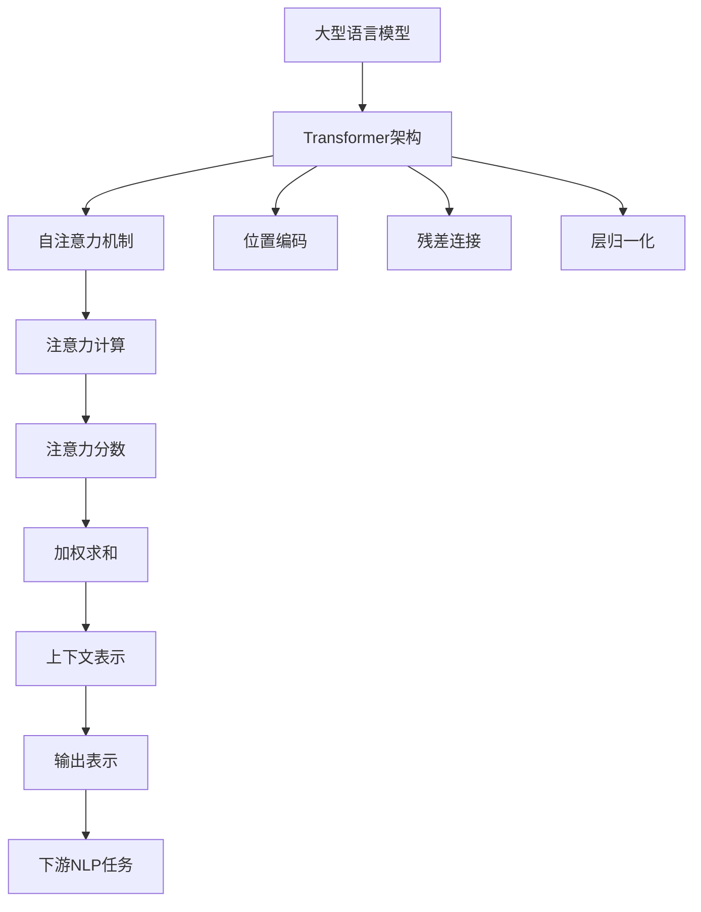

# 大语言模型原理基础与前沿 高效扩展Transformer推理

## 1. 背景介绍

### 1.1 问题的由来

随着深度学习技术的不断发展,大型语言模型在自然语言处理(NLP)领域取得了令人瞩目的成就。传统的NLP模型通常依赖于手工设计的特征工程和规则,难以捕捉语言的复杂性和丰富语义。而大型语言模型则能够直接从海量语料中学习语言知识,避免了手工特征工程的繁琐过程。

Transformer是一种革命性的序列到序列(Seq2Seq)模型架构,它完全基于注意力机制,不需要复杂的递归或者卷积结构,在机器翻译、文本生成等任务上表现出色。然而,Transformer模型的计算复杂度随着输入序列长度的增加而呈现指数级增长,这对于处理长文本带来了巨大的计算挑战。因此,如何高效扩展Transformer以支持长序列推理,成为了当前研究的热点问题。

### 1.2 研究现状

目前,研究人员提出了多种方法来提高Transformer的长序列推理能力,主要包括:

1. **稀疏注意力机制(Sparse Attention)**: 通过构造稀疏注意力模式,减少不必要的注意力计算,从而降低计算复杂度。代表工作包括Sparse Transformer、Longformer等。

2. **局部注意力机制(Local Attention)**: 将注意力机制限制在局部窗口内,只计算局部依赖关系,降低了计算量。代表工作包括ETC、Reformer等。

3. **层次注意力机制(Hierarchical Attention)**: 在不同层次上应用注意力机制,捕捉不同范围的依赖关系。代表工作包括Transformer-XL、Compressive Transformer等。

4. **高效内存管理**: 通过优化内存使用策略,减少内存开销,支持更长序列的推理。代表工作包括Routing Transformer等。

5. **模型压缩与知识蒸馏**: 通过模型压缩、知识蒸馏等技术,将大型Transformer模型压缩为小型高效模型,提高推理速度。

尽管取得了一定进展,但现有方法在计算效率、推理质量、通用性等方面仍有待进一步改进。

### 1.3 研究意义

高效扩展Transformer推理能力,对于解决长序列NLP任务具有重要意义:

1. **提高推理质量**: 能够处理更长的文本输入,捕捉更丰富的上下文信息,提升模型的推理质量。

2. **拓展应用场景**: 支持更多长文本场景的应用,如长文本生成、文档级阅读理解等。

3. **提高计算效率**: 降低计算复杂度,节省计算资源,实现高效推理。

4. **推动模型创新**: 激发新的模型架构和算法创新,推动NLP技术发展。

### 1.4 本文结构

本文将全面介绍大型语言模型的基础理论和高效扩展Transformer推理的前沿技术。文章主要内容包括:

- 核心概念与联系
- 核心算法原理与具体操作步骤
- 数学模型和公式详细讲解与案例分析
- 项目实践:代码实例和详细解释
- 实际应用场景分析
- 工具和资源推荐
- 未来发展趋势与挑战总结
- 常见问题解答

## 2. 核心概念与联系

在深入探讨高效扩展Transformer推理之前,我们需要先了解一些核心概念及其相互联系。

1. **大型语言模型(Large Language Model,LLM)**: 指基于海量语料训练的大规模神经网络模型,能够捕捉丰富的语言知识和上下文信息,在各种NLP任务上表现出色。

2. **Transformer架构**: Transformer是一种全新的序列到序列模型架构,完全基于注意力机制,不需要复杂的递归或卷积结构,在机器翻译、文本生成等任务上表现优异。

3. **自注意力机制(Self-Attention)**: Transformer的核心组件,能够直接捕捉序列中任意两个位置之间的依赖关系,克服了RNN的长期依赖问题。

4. **位置编码(Positional Encoding)**: 由于Transformer没有递归或卷积结构,无法直接捕捉序列的位置信息,因此需要显式地添加位置编码来表示位置信息。

5. **残差连接(Residual Connection)**: 通过残差连接,可以更好地传递梯度信号,缓解深层网络的梯度消失问题。

6. **层归一化(Layer Normalization)**: 对每一层的输入进行归一化处理,加速模型收敛,提高模型性能。

7. **注意力计算(Attention Computation)**: 自注意力机制的核心,计算查询(Query)与键(Key)之间的相似性得分,并根据该得分对值(Value)进行加权求和。

8. **注意力分数(Attention Score)**: 查询与键之间的相似性得分,用于衡量两个位置之间的依赖关系强度。

9. **加权求和(Weighted Sum)**: 根据注意力分数对值进行加权求和,得到上下文表示。

10. **上下文表示(Contextual Representation)**: 融合了全局依赖关系信息的序列表示。

11. **输出表示(Output Representation)**: Transformer的最终输出,可用于下游NLP任务,如机器翻译、文本生成等。

12. **下游NLP任务(Downstream NLP Tasks)**: 大型语言模型可以应用于各种自然语言处理任务,如文本分类、阅读理解、对话系统等。

通过上述核心概念的相互联系,我们可以深入理解Transformer模型的工作原理,为探讨高效扩展Transformer推理奠定基础。

## 3. 核心算法原理与具体操作步骤

### 3.1 算法原理概述

Transformer模型的核心算法是**自注意力机制(Self-Attention)**,它能够直接捕捉序列中任意两个位置之间的依赖关系,克服了RNN的长期依赖问题。自注意力机制的计算过程如下:

1. 将输入序列进行线性投影,得到查询(Query)、键(Key)和值(Value)向量。
2. 计算查询与所有键之间的注意力分数,表示它们之间的相似性程度。
3. 对注意力分数进行软最大值归一化,得到注意力权重。
4. 根据注意力权重对值向量进行加权求和,得到上下文表示。
5. 将上下文表示与输入序列进行残差连接,并进行层归一化,得到最终的输出表示。

注意力机制的核心思想是通过计算查询与键之间的相似性,动态地捕捉序列中任意两个位置之间的依赖关系,从而获得更丰富的上下文信息。

然而,标准的自注意力机制存在一个重大缺陷:计算复杂度随着输入序列长度的增加而呈现指数级增长,这对于处理长文本带来了巨大的计算挑战。为了解决这个问题,研究人员提出了多种高效扩展Transformer推理的方法,包括稀疏注意力、局部注意力、层次注意力等,我们将在后续章节详细介绍。

### 3.2 算法步骤详解

现在,让我们通过一个具体的例子,详细解释自注意力机制的计算步骤。假设我们有一个长度为4的输入序列$X = [x_1, x_2, x_3, x_4]$,我们希望计算第二个位置$x_2$的上下文表示。

1. **线性投影**

   首先,我们将输入序列$X$分别投影到查询(Query)、键(Key)和值(Value)空间,得到对应的向量表示:

   $$
   \begin{aligned}
   Q &= [q_1, q_2, q_3, q_4] = X \cdot W_Q \\
   K &= [k_1, k_2, k_3, k_4] = X \cdot W_K \\
   V &= [v_1, v_2, v_3, v_4] = X \cdot W_V
   \end{aligned}
   $$

   其中$W_Q, W_K, W_V$分别是查询、键和值的线性投影矩阵。

2. **计算注意力分数**

   接下来,我们计算查询$q_2$与所有键$k_1, k_2, k_3, k_4$之间的注意力分数,表示它们之间的相似性程度:

   $$
   \text{Attention Score}(q_2, k_j) = q_2 \cdot k_j^T
   $$

   得到的注意力分数向量为:

   $$
   \text{Attention Scores} = [q_2 \cdot k_1^T, q_2 \cdot k_2^T, q_2 \cdot k_3^T, q_2 \cdot k_4^T]
   $$

3. **软最大值归一化**

   为了得到注意力权重,我们需要对注意力分数进行软最大值归一化:

   $$
   \text{Attention Weights} = \text{softmax}(\text{Attention Scores})
   $$

   其中,softmax函数定义为:

   $$
   \text{softmax}(x_i) = \frac{e^{x_i}}{\sum_{j} e^{x_j}}
   $$

   这样可以确保注意力权重的和为1,并且权重值越大,表示对应位置的依赖关系越强。

4. **加权求和**

   最后,我们根据注意力权重对值向量进行加权求和,得到$x_2$的上下文表示:

   $$
   \text{Context Representation}(x_2) = \sum_{j} \text{Attention Weight}(q_2, k_j) \cdot v_j
   $$

   这个上下文表示融合了输入序列中所有位置的信息,体现了自注意力机制的全局依赖性质。

通过上述步骤,我们成功计算出了$x_2$的上下文表示。对于其他位置,计算过程是类似的。最终,我们将得到整个序列的上下文表示,作为Transformer的输出,可用于下游NLP任务。

### 3.3 算法优缺点

自注意力机制相比传统的序列模型(如RNN)具有以下优点:

1. **全局依赖性**: 能够直接捕捉序列中任意两个位置之间的依赖关系,克服了RNN的长期依赖问题。

2. **并行计算**: 注意力计算可以高度并行化,提高了计算效率。

3. **灵活性**: 注意力机制可以应用于不同类型的序列数据,如文本、图像、音频等。

4. **可解释性**: 注意力权重可以反映模型关注的重点区域,具有一定的可解释性。

然而,自注意力机制也存在一些缺点:

1. **计算复杂度高**: 标准的自注意力机制的计算复杂度随着输入序列长度的增加而呈现指数级增长,对于长序列推理带来了巨大的计算挑战。

2. **位置编码依赖**: 由于Transformer缺乏递归或卷积结构,无法直接捕捉序列的位置信息,需要依赖于位置编码。

3. **长距离依赖捕捉能力有限**: 虽然理论上自注意力机制可以捕捉任意长度的依赖关系,但在实践中,对于超长距离的依赖关系,捕捉能力会受到一定限制。

4. **缺乏归纳偏置**: 与CNN和RNN相比,Transformer缺乏一些有益的归纳偏置(如局部连续性、层次结构等),可能需要更多的数据和计算资源来学习这些偏置。

总的来说,自注意力机制是一种强大的序列建模方法,但也存在一些需要改进的地方,特别是在处理长序列时的计算效率问题。

### 3.4 算法应用领域

自注意力机制及其变体广泛应用于各种自然语言处理任务,包括但不限于:

1. **机器翻译**: Transformer是最先应用于机器