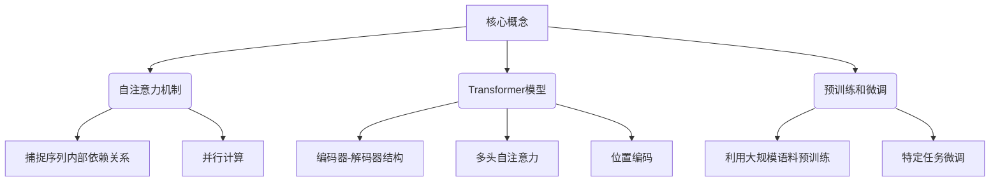
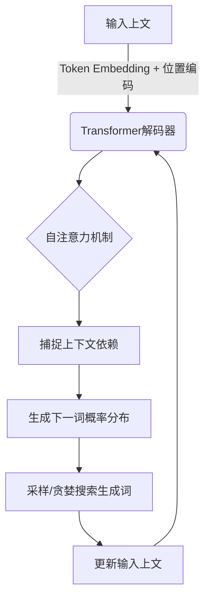

# 大语言模型应用指南：ChatGPT扩展功能原理

## 1. 背景介绍

### 1.1 问题的由来

随着人工智能技术的不断发展,大型语言模型(Large Language Model, LLM)已经成为当前最引人注目的研究热点之一。作为一种基于深度学习的自然语言处理(NLP)模型,LLM能够从海量文本数据中学习语言模式,并生成看似人类写作的连贯、流畅的文本。

其中,OpenAI推出的ChatGPT无疑是最具代表性的LLM之一。它不仅能够回答各种问题、撰写文章和代码,还能根据上下文进行多轮对话,展现出惊人的语言理解和生成能力。然而,ChatGPT的内部机制究竟是如何运作的?它是如何实现这些强大功能的?这些都是亟待解答的问题。

### 1.2 研究现状

目前,已有许多研究人员致力于探索LLM的内在原理。一些研究表明,LLM的强大能力源自其巨大的参数量和预训练语料库。例如,GPT-3拥有1750亿个参数,训练语料包含数十亿个网页和书籍。通过在海量数据上预训练,LLM能够学习到丰富的语言知识,并在下游任务中表现出色。

另一方面,LLM也面临一些挑战,如缺乏常识推理能力、存在偏见和不确定性等。研究人员正在探索各种方法来解决这些问题,例如引入外部知识库、设计更好的训练目标函数等。

### 1.3 研究意义

深入探究ChatGPT等LLM的内部机制,对于推动人工智能技术的发展具有重要意义。首先,揭示LLM的工作原理有助于我们更好地理解和利用这一强大的技术,开发出更多实用的应用。其次,研究LLM也可能为解决其固有缺陷提供线索,促进模型的不断完善和优化。此外,探索LLM还有助于推动自然语言处理、深度学习等相关领域的理论发展。

### 1.4 本文结构

本文将全面剖析ChatGPT扩展功能的内部原理,内容包括:

1. 核心概念与联系
2. 核心算法原理与具体操作步骤
3. 数学模型和公式详细讲解与案例分析
4. 项目实践:代码实例和详细解释说明
5. 实际应用场景
6. 工具和资源推荐
7. 总结:未来发展趋势与挑战
8. 附录:常见问题与解答

## 2. 核心概念与联系

为了理解ChatGPT扩展功能的原理,我们需要先了解一些核心概念,包括自注意力机制(Self-Attention)、转换器(Transformer)模型、预训练(Pre-training)和微调(Fine-tuning)等。

### 2.1 自注意力机制

自注意力机制是Transformer等模型的核心,它能够捕捉输入序列中任意两个位置之间的依赖关系,而不受位置限制。这种全局依赖建模的能力使得自注意力机制在序列到序列(Seq2Seq)任务中表现出色。

与传统的RNN和CNN相比,自注意力机制还具有并行计算的优势,能够加速训练过程。自注意力机制的计算过程可以概括为三个步骤:构建查询(Query)、键(Key)和值(Value)矩阵,计算注意力权重,加权求和得到注意力表示。

### 2.2 Transformer模型

Transformer是一种全新的基于自注意力机制的序列到序列模型,由编码器(Encoder)和解码器(Decoder)组成。编码器将输入序列映射到中间表示,解码器则根据中间表示生成输出序列。

Transformer中广泛使用了多头自注意力(Multi-Head Attention)和位置编码(Positional Encoding)等技术。多头注意力允许模型关注输入的不同位置,而位置编码则赋予序列元素位置信息,因为自注意力机制本身无法捕捉位置关系。

### 2.3 预训练和微调

预训练和微调是当前主流的迁移学习范式。在预训练阶段,LLM(如GPT、BERT等)会在大规模无标注文本数据上进行通用语言表示学习,获取丰富的语言知识。而在微调阶段,预训练模型会在特定的下游任务数据上进行进一步训练,使模型适应新的任务。

通过这种两阶段训练策略,LLM能够在下游任务上表现出惊人的泛化能力。同时,预训练和微调范式也大大减少了从头训练模型的计算开销。

ChatGPT正是基于GPT-3这一大型预训练语言模型,并在特定任务上进行了微调,从而获得了强大的对话、问答和文本生成能力。

## 3. 核心算法原理与具体操作步骤

### 3.1 算法原理概述

ChatGPT的核心算法基于GPT-3模型,它是一种基于Transformer的自回归语言模型(Auto-Regressive Language Model)。自回归语言模型的目标是最大化给定历史文本的当前词的条件概率,即:

$$P(x_t|x_1,x_2,...,x_{t-1})$$

其中$x_t$表示当前词,$(x_1,x_2,...,x_{t-1})$表示历史文本序列。

为了学习上述条件概率分布,GPT-3采用了基于Transformer解码器的自回归模型结构。具体来说,模型会根据输入的上文,通过自注意力机制捕捉上下文依赖关系,并预测下一个词的概率分布。重复这一过程,直至生成完整的文本序列。

上图展示了GPT-3的基本工作流程。首先,输入的上文经过词嵌入(Token Embedding)和位置编码,然后送入Transformer解码器进行处理。在解码器内部,自注意力机制会捕捉上文中词与词之间的依赖关系,并据此生成下一个词的概率分布。通过采样或贪婪搜索从概率分布中选取一个词,将其附加到输入上文,重复上述过程直至生成完整序列。

需要注意的是,GPT-3属于单向语言模型,只能利用左侧上文信息进行预测。而ChatGPT则在GPT-3的基础上,引入了一些特殊的训练技巧和对话策略,赋予其更强的交互和上下文理解能力。

### 3.2 算法步骤详解

我们将GPT-3及其在ChatGPT中的应用,分解为以下几个关键步骤:

1. **输入处理**:将用户的输入文本进行分词(Tokenization),得到一个词元(Token)序列。同时,为每个词元添加位置编码,赋予其位置信息。

2. **Embedding层**:将词元序列通过Embedding层映射为对应的向量表示,即词嵌入(Word Embedding)。这一步将离散的词元数据转化为模型可以处理的连续值向量。

3. **Transformer解码器**:词嵌入序列被输入到Transformer解码器中进行处理。解码器由多个相同的解码器层(Decoder Layer)组成,每一层包含了多头自注意力(Multi-Head Attention)和前馈神经网络(Feed-Forward Network)等子层。

   - **自注意力子层**:计算输入序列元素之间的注意力权重,捕捉元素间的依赖关系,得到注意力表示。
   - **前馈子层**:对注意力表示进行进一步的非线性变换,提取更高层次的特征表示。

4. **生成概率分布**:Transformer解码器的最后一层输出一个概率分布,表示下一个词的预测概率。通过对概率分布采样或贪婪搜索,可以得到下一个预测词。

5. **上下文更新**:将预测的词附加到输入序列,重复上述过程直至生成完整序列或达到预设长度。

6. **特殊策略(ChatGPT)**:在GPT-3的基础上,ChatGPT还采用了一些特殊的训练技巧和对话策略,如反向语料训练(Reversed Corpus)、上下文学习(Contexts Learning)等,以增强其上下文理解和交互能力。

需要说明的是,上述算法步骤并非完全独立,中间存在一些交叉和反馈,如注意力机制的残差连接、层归一化(Layer Normalization)等。此外,不同的语言模型在具体实现上也可能有所差异。

### 3.3 算法优缺点

**优点:**

1. **并行计算**:Transformer模型中的自注意力机制允许并行计算,从而加快了训练速度。
2. **长距离依赖建模**:自注意力机制能够直接捕捉任意距离的依赖关系,而不受距离限制。
3. **可解释性**:注意力权重可视化有助于解释模型内部工作机制。
4. **泛化能力强**:通过预训练和微调范式,模型可以在下游任务上展现出惊人的泛化能力。
5. **多功能性**:ChatGPT不仅能进行对话,还能执行其他任务如问答、文本生成等。

**缺点:**

1. **缺乏常识推理能力**:尽管语言模型能够生成看似合理的文本,但其缺乏真正的理解和推理能力。
2. **存在偏见和不确定性**:语言模型可能会受到训练数据的影响,产生一些偏见和不确定性。
3. **对抗样本脆弱性**:语言模型对于一些精心设计的对抗样本(Adversarial Examples)表现出脆弱性。
4. **计算资源消耗大**:训练大型语言模型需要消耗大量的计算资源,对硬件要求较高。
5. **缺乏解释和控制**:语言模型的"黑箱"特性使其内部机制缺乏透明度,难以对其行为进行解释和控制。

### 3.4 算法应用领域

作为一种强大的自然语言处理技术,大型语言模型及其衍生模型(如ChatGPT)在诸多领域都有广泛的应用前景:

1. **对话系统**:ChatGPT可用于构建智能对话代理,为用户提供问答、查询等服务。
2. **文本生成**:语言模型可用于自动生成新闻、小说、诗歌、代码等不同类型的文本。
3. **机器翻译**:通过适当的训练,语言模型可用于高质量的机器翻译任务。
4. **文本摘要**:语言模型能够对长文本进行理解和压缩,生成高质量的文本摘要。
5. **信息抽取**:语言模型可用于从非结构化文本中抽取关键信息,如命名实体识别等。
6. **情感分析**:通过分析文本的情感倾向性,语言模型可应用于情感分析和观点挖掘。
7. **智能写作辅助**:语言模型可用于自动续写、修改已有文本,为写作提供辅助。

总的来说,大型语言模型是一种通用的自然语言处理基础模型,在广泛的应用场景中都有重要作用。随着模型性能的不断提高,其应用前景将更加广阔。

## 4. 数学模型和公式详细讲解与举例说明

### 4.1 数学模型构建

为了更好地理解GPT-3及ChatGPT的内部工作原理,我们需要对其数学模型有更深入的了解。GPT-3模型的核心是一种基于Transformer解码器的自回归语言模型,其目标是最大化给定历史文