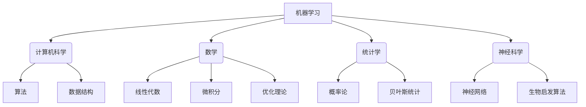

# 大语言模型应用指南：什么是机器学习

## 1. 背景介绍

### 1.1 问题的由来

在当今的数字时代，数据已经成为了一种新的"燃料"，推动着各行各业的创新和发展。随着数据量的快速增长，传统的数据处理方法已经无法满足现代应用的需求。因此，机器学习(Machine Learning)作为一种能够从数据中自动分析并获取模式的技术,应运而生。

机器学习的概念最早可以追溯到上世纪 50 年代,当时人工智能研究的一个分支。然而,直到近年来,随着计算能力的飞速提升、大数据时代的到来以及算法的不断优化,机器学习才真正进入了一个全新的发展阶段,并在众多领域取得了令人瞩目的成就。

### 1.2 研究现状

机器学习已经广泛应用于图像识别、自然语言处理、推荐系统、金融预测等诸多领域,并取得了卓越的成绩。以图像识别为例,机器学习算法已经能够超越人类水平,准确率高达 99% 以上。在自然语言处理领域,机器学习模型可以实现高质量的机器翻译、语音识别、问答系统等功能。

与此同时,机器学习也面临着一些挑战,例如:

- 数据质量问题:机器学习模型的性能很大程度上依赖于训练数据的质量和数量。如何获取高质量的训练数据仍然是一个挑战。
- 算法解释性:许多机器学习模型被视为"黑箱",难以解释其内部工作原理,这在一定程度上限制了其在一些关键领域(如医疗、金融等)的应用。
- 算力需求:训练大型机器学习模型需要消耗大量的计算资源,这对硬件设施提出了很高的要求。

### 1.3 研究意义

机器学习技术的发展对于提高生产效率、优化决策过程、推动科技创新等方面具有重要意义。它能够帮助人类从海量数据中发现隐藏的模式和规律,从而做出更加准确的预测和决策。同时,机器学习也为解决一些传统方法难以解决的复杂问题提供了新的思路和方法。

此外,机器学习还有望在医疗、教育、交通、环保等领域发挥重要作用,为人类社会的可持续发展做出贡献。

### 1.4 本文结构

本文将全面介绍机器学习的核心概念、算法原理、数学模型、实际应用以及未来发展趋势。文章结构如下:

1. 背景介绍
2. 核心概念与联系
3. 核心算法原理与具体操作步骤
4. 数学模型和公式详细讲解与举例说明
5. 项目实践:代码实例和详细解释说明
6. 实际应用场景
7. 工具和资源推荐
8. 总结:未来发展趋势与挑战
9. 附录:常见问题与解答

## 2. 核心概念与联系

机器学习是一门涉及多个学科的交叉领域,包括计算机科学、数学、统计学、神经科学等。它的核心概念与多个领域紧密相关,如下图所示:

### 2.1 计算机科学

机器学习算法的实现和优化离不开计算机科学的支持,尤其是算法和数据结构方面的知识。高效的算法和合理的数据结构设计能够提高机器学习模型的训练和预测效率。

### 2.2 数学

数学是机器学习的理论基础。线性代数为机器学习提供了矩阵和向量的运算支持;微积分为机器学习算法的优化过程提供了理论依据;优化理论则为寻找最优解提供了方法论。

### 2.3 统计学

统计学是机器学习的另一个重要支柱。概率论为机器学习模型提供了处理不确定性的理论基础;贝叶斯统计则为机器学习提供了一种强大的推理和决策框架。

### 2.4 神经科学

神经网络是机器学习中一种重要的模型,其设计灵感来源于生物神经系统。神经科学对于理解和优化神经网络模型具有重要意义。此外,生物启发算法(如遗传算法、蚁群算法等)也为机器学习提供了新的思路和方法。

## 3. 核心算法原理与具体操作步骤

机器学习算法的核心思想是从数据中"学习"模式,并基于所学习的模式对新数据进行预测或决策。根据学习的方式不同,机器学习算法可以分为三大类:监督学习、无监督学习和强化学习。

### 3.1 算法原理概述

#### 3.1.1 监督学习

监督学习(Supervised Learning)是最常见的机器学习范式。在监督学习中,算法会从一组已标记的训练数据(包含输入特征和期望输出)中学习一个映射函数,然后使用这个函数对新的未标记数据进行预测或决策。

监督学习可以分为两大类:

- 回归(Regression):当输出是连续值时,任务被称为回归问题,如预测房价、销量等。
- 分类(Classification):当输出是离散值或类别时,任务被称为分类问题,如图像分类、垃圾邮件检测等。

常见的监督学习算法包括线性回归、逻辑回归、决策树、支持向量机(SVM)、神经网络等。

#### 3.1.2 无监督学习

无监督学习(Unsupervised Learning)的目标是从未标记的数据中发现隐藏的模式或结构。无监督学习算法不需要预先标记的训练数据,而是根据数据的内在特征自动发现数据的分布和模式。

无监督学习常见的任务包括:

- 聚类(Clustering):将相似的数据点分组到同一个簇中,如客户细分、基因序列聚类等。
- 降维(Dimensionality Reduction):将高维数据映射到低维空间,以提高可解释性和降低计算复杂度,如主成分分析(PCA)、t-SNE等。
- 关联规则挖掘(Association Rule Mining):发现数据集中的频繁模式,如购物篮分析等。

常见的无监督学习算法包括K-Means聚类、高斯混合模型(GMM)、DBSCAN、层次聚类等。

#### 3.1.3 强化学习

强化学习(Reinforcement Learning)是一种基于环境交互的学习范式。在强化学习中,智能体(Agent)通过与环境(Environment)不断交互,根据获得的奖励信号(Reward)调整自身的策略(Policy),以最大化长期累积奖励。

强化学习的核心思想是"试错"和"奖惩"。智能体通过不断尝试不同的行为,并根据获得的奖惩信号来调整策略,最终学习到一个最优策略。

强化学习广泛应用于机器人控制、游戏AI、自动驾驶等领域。常见的强化学习算法包括Q-Learning、Sarsa、策略梯度(Policy Gradient)、深度Q网络(DQN)等。

### 3.2 算法步骤详解

以监督学习中的线性回归为例,具体算法步骤如下:

1. **数据预处理**:对原始数据进行清洗、标准化等预处理,以提高模型的性能和稳定性。
2. **特征工程**:从原始数据中提取有意义的特征,作为模型的输入。
3. **训练集和测试集划分**:将数据集划分为训练集和测试集,用于模型训练和评估。
4. **模型选择**:选择合适的模型,如线性回归模型。
5. **模型训练**:使用训练集数据,通过优化算法(如梯度下降)学习模型参数,使模型在训练集上的损失函数(如均方误差)最小化。
6. **模型评估**:使用测试集数据评估模型的性能,计算评估指标(如均方根误差)。
7. **模型调优**:根据评估结果,调整模型超参数或特征,重复训练和评估,直到达到满意的性能。
8. **模型部署**:将训练好的模型部署到实际应用中,对新的未标记数据进行预测。

### 3.3 算法优缺点

不同的机器学习算法都有其优缺点,需要根据具体问题和数据特点选择合适的算法。

以线性回归为例,其优点包括:

- 模型简单,易于理解和解释
- 训练速度快,计算效率高
- 对异常值不太敏感

缺点包括:

- 只能学习线性模式,对非线性问题拟合效果差
- 对特征缩放敏感,需要进行数据标准化
- 对异常值虽不太敏感,但仍然容易受到异常值的影响

因此,线性回归更适用于数据呈线性关系、样本量较大、异常值较少的问题。对于非线性问题或异常值较多的情况,需要考虑使用其他算法,如决策树、支持向量机或神经网络等。

### 3.4 算法应用领域

机器学习算法在诸多领域都有广泛的应用,包括但不限于:

- **计算机视觉**:图像分类、目标检测、人脸识别等
- **自然语言处理**:机器翻译、文本分类、情感分析等
- **推荐系统**:个性化推荐、协同过滤等
- **金融**:信用评分、欺诈检测、风险管理等
- **医疗**:疾病诊断、药物发现、影像分析等
- **制造业**:预测性维护、质量控制等
- **交通**:路径规划、交通流量预测等
- **营销**:用户细分、广告投放等

机器学习为这些领域带来了全新的解决方案和发展机遇,推动了相关领域的创新和进步。

## 4. 数学模型和公式详细讲解与举例说明

机器学习算法的核心是基于数学模型和公式,通过优化目标函数来学习模型参数。本节将详细介绍一些常见的机器学习数学模型和公式,并结合实例进行讲解。

### 4.1 数学模型构建

在构建机器学习模型时,通常需要定义以下几个关键要素:

- **输入特征向量(Feature Vector) $\boldsymbol{x}$**:表示样本的特征,通常为 $n$ 维向量 $\boldsymbol{x} = (x_1, x_2, \dots, x_n)^\top$。
- **目标变量(Target Variable) $y$**:模型需要预测或决策的目标,可以是连续值(回归问题)或离散值(分类问题)。
- **模型函数(Model Function) $f(\boldsymbol{x}; \boldsymbol{\theta})$**:将输入特征映射到目标变量的函数,其中 $\boldsymbol{\theta}$ 为模型参数。
- **损失函数(Loss Function) $\mathcal{L}(y, f(\boldsymbol{x}; \boldsymbol{\theta}))$**:衡量模型预测值与真实值之间差异的函数。
- **正则化项(Regularization Term) $\Omega(\boldsymbol{\theta})$**:用于防止过拟合的惩罚项。

机器学习的目标是通过优化以下目标函数,学习模型参数 $\boldsymbol{\theta}$:

$$
\min_{\boldsymbol{\theta}} \frac{1}{N} \sum_{i=1}^{N} \mathcal{L}(y_i, f(\boldsymbol{x}_i; \boldsymbol{\theta})) + \lambda \Omega(\boldsymbol{\theta})
$$

其中 $N$ 为训练样本数, $\lambda$ 为正则化系数,控制正则化项的权重。

不同的机器学习算法对上述要素的定义不同,从而导致了不同的模型形式和优化方法。

### 4.2 公式推导过程

以线性回归为例,我们将推导其目标函数和优化过程。

**