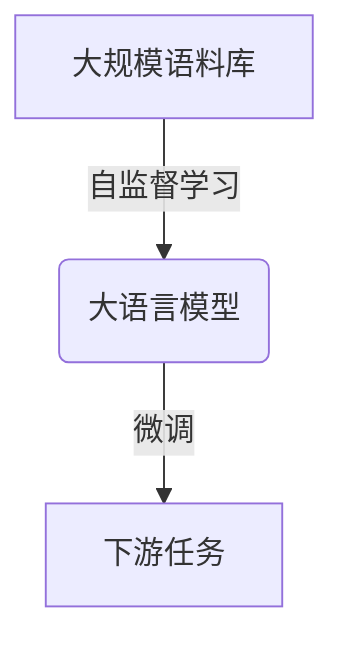
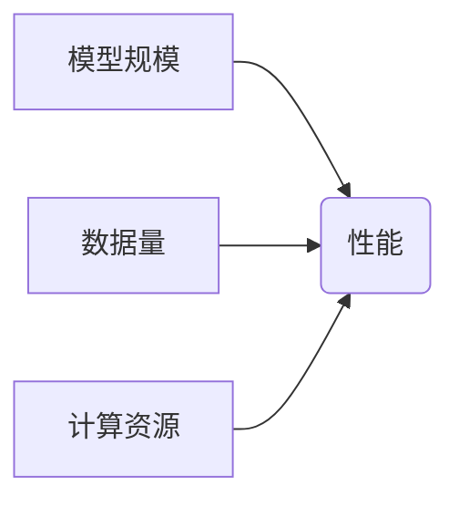
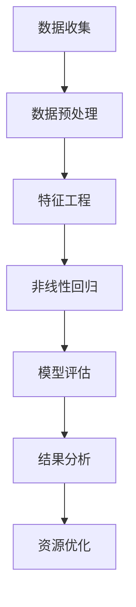

# 大语言模型应用指南：尺度定律的未来

## 1. 背景介绍

### 1.1 问题的由来

在过去的几年里，自然语言处理(NLP)领域取得了长足的进步,其中大语言模型(Large Language Models, LLMs)的出现无疑是一个里程碑式的突破。LLMs通过在大规模语料库上进行预训练,学习到了通用的语言表示能力,可以在下游任务中表现出惊人的性能。然而,随着模型规模的不断扩大,LLMs也面临着一些新的挑战和问题。

### 1.2 研究现状

目前,LLMs的规模已经达到了惊人的数十亿甚至上百亿参数,这使得它们在推理和生成任务中表现出色,但同时也带来了巨大的计算和存储开销。此外,大规模模型也容易受到数据中存在的偏差和噪声的影响,导致输出存在不当或不合理的内容。

为了解决这些问题,研究人员提出了尺度定律(Scaling Laws)的概念,试图通过定量分析模型规模、数据量和计算资源之间的关系,来预测和优化LLMs的性能。尺度定律不仅有助于我们更好地理解LLMs的行为,也为我们提供了一种更有效地利用计算资源的方法。

### 1.3 研究意义

尺度定律的研究对于推动LLMs的发展具有重要意义。首先,它可以帮助我们更好地预测和控制模型的性能,从而优化资源分配和模型设计。其次,通过对尺度定律的深入研究,我们可以更好地理解LLMs的内在机制,为进一步改进模型架构和训练策略提供指导。此外,尺度定律也为我们提供了一种新的视角来思考人工智能系统的发展,有助于我们更好地规划和管理未来的技术发展方向。

### 1.4 本文结构

本文将从以下几个方面深入探讨大语言模型应用中的尺度定律:

1. 核心概念与联系
2. 核心算法原理与具体操作步骤
3. 数学模型和公式详细讲解与案例分析
4. 项目实践:代码实例和详细解释说明
5. 实际应用场景
6. 工具和资源推荐
7. 总结:未来发展趋势与挑战
8. 附录:常见问题与解答

## 2. 核心概念与联系

在探讨尺度定律之前,我们需要先了解一些核心概念。

### 2.1 大语言模型(LLMs)

大语言模型是一种基于自然语言的预训练模型,通过在大规模语料库上进行自监督学习,获得通用的语言表示能力。常见的LLMs包括GPT、BERT、T5等。这些模型可以在下游任务中进行微调(fine-tuning),从而展现出优异的性能。

### 2.2 尺度定律(Scaling Laws)

尺度定律描述了模型性能(如精度或损失)与模型规模(如参数数量)、数据量和计算资源之间的定量关系。通过分析这种关系,我们可以预测和优化模型的性能。

尺度定律通常可以用如下公式表示:

$$
\text{Performance} = a \times (\text{Model Size})^b \times (\text{Data Size})^c \times (\text{Compute})^d + e
$$

其中,a、b、c、d和e是需要通过实验数据拟合得到的系数。

### 2.3 计算尺度经济学(Computational Scaling Economics)

计算尺度经济学是一个新兴的研究领域,旨在研究如何在有限的计算资源下,最大化人工智能系统的性能。它与尺度定律密切相关,因为尺度定律为我们提供了一种量化模型性能与计算资源之间关系的方法。

通过计算尺度经济学,我们可以更好地分配计算资源,实现性能和效率的最佳平衡。

## 3. 核心算法原理 & 具体操作步骤

### 3.1 算法原理概述

尺度定律的核心算法原理是通过对实验数据进行拟合,来估计公式中的系数a、b、c、d和e。具体来说,我们需要收集不同规模的模型、不同数据量和不同计算资源下的性能数据,然后使用非线性回归等方法来拟合这些数据。

拟合得到的系数可以用来预测新的模型配置下的性能,从而指导我们进行资源分配和模型设计。此外,通过分析这些系数,我们也可以获得一些有价值的见解,例如哪些因素对性能影响更大等。

### 3.2 算法步骤详解

1. **数据收集**:我们需要收集不同模型规模、数据量和计算资源下的性能数据。这些数据可以来自实际的模型训练和评估,也可以来自已有的研究文献。

2. **数据预处理**:对收集到的数据进行清洗和标准化,确保数据的质量和一致性。

3. **特征工程**:根据尺度定律公式,构建模型规模、数据量和计算资源等特征。

4. **非线性回归**:使用非线性回归算法(如最小二乘法或梯度下降法)来拟合特征和性能之间的关系,得到系数a、b、c、d和e。

5. **模型评估**:使用保留的测试数据评估拟合模型的性能,确保其具有良好的预测能力。

6. **结果分析**:分析拟合得到的系数,获得对模型行为的见解,例如哪些因素对性能影响更大等。

7. **资源优化**:根据拟合模型,预测不同配置下的性能,从而进行资源分配和模型设计的优化。

### 3.3 算法优缺点

**优点**:

- 提供了一种定量分析模型性能与计算资源之间关系的方法
- 可以预测和优化模型配置,实现资源的最佳利用
- 有助于我们更好地理解大语言模型的行为

**缺点**:

- 需要大量的实验数据来进行拟合,数据收集过程可能耗时耗力
- 拟合得到的模型可能存在一定的误差和局限性
- 对于一些新兴的模型架构或任务,可能难以直接应用尺度定律

### 3.4 算法应用领域

尺度定律算法可以应用于以下领域:

- **模型设计和优化**: 通过预测不同配置下的性能,指导模型架构的选择和超参数的调整。
- **资源分配和规划**: 根据预期的性能要求,合理分配计算和存储资源。
- **成本效益分析**: 评估不同模型配置下的性能和成本,实现最佳的投资回报。
- **科学研究**: 通过分析尺度定律系数,探索大语言模型的内在机制和行为模式。

## 4. 数学模型和公式 & 详细讲解 & 举例说明

### 4.1 数学模型构建

尺度定律的数学模型可以表示为:

$$
\text{Performance} = a \times (\text{Model Size})^b \times (\text{Data Size})^c \times (\text{Compute})^d + e
$$

其中:

- `Performance`表示模型的性能指标,如精度或损失。
- `Model Size`表示模型的规模,通常用参数数量来衡量。
- `Data Size`表示训练数据的规模,如语料库的token数量。
- `Compute`表示用于训练模型的计算资源,如FLOP或GPU小时数。
- `a`、`b`、`c`、`d`和`e`是需要通过实验数据拟合得到的系数。

这个模型描述了模型性能与模型规模、数据量和计算资源之间的关系。通过对实验数据进行拟合,我们可以估计出这些系数的值,从而预测和优化模型的性能。

### 4.2 公式推导过程

尺度定律公式的推导过程基于以下假设:

1. 模型性能与模型规模、数据量和计算资源之间存在幂函数关系。
2. 这些因素对性能的影响是独立的,可以相乘表示。
3. 存在一个常数项,表示基线性能或噪声。

基于这些假设,我们可以构建如下模型:

$$
\text{Performance} = f(\text{Model Size}, \text{Data Size}, \text{Compute})
$$

进一步假设这是一个幂函数关系,我们可以写成:

$$
\text{Performance} = a \times (\text{Model Size})^b \times (\text{Data Size})^c \times (\text{Compute})^d
$$

为了考虑基线性能或噪声,我们添加一个常数项`e`:

$$
\text{Performance} = a \times (\text{Model Size})^b \times (\text{Data Size})^c \times (\text{Compute})^d + e
$$

这就是尺度定律公式的最终形式。通过对实验数据进行非线性回归,我们可以估计出系数`a`、`b`、`c`、`d`和`e`的值。

### 4.3 案例分析与讲解

为了更好地理解尺度定律,我们来分析一个具体的案例。假设我们正在训练一个大型语言模型,用于机器翻译任务。我们收集了以下数据:

| 模型规模(参数数) | 数据量(token数) | 计算资源(GPU小时) | BLEU分数 |
|-------------------|-------------------|-------------------|----------|
| 1亿               | 1亿               | 1000              | 25.3     |
| 5亿               | 5亿               | 5000              | 28.7     |
| 10亿              | 10亿              | 10000             | 30.2     |
| 20亿              | 20亿              | 20000             | 32.1     |
| 50亿              | 50亿              | 50000             | 34.5     |

我们可以使用这些数据来拟合尺度定律模型。假设拟合得到的系数为:

$$
a = 10, b = 0.4, c = 0.2, d = 0.1, e = 20
$$

那么,我们可以使用这个模型来预测新的配置下的性能。例如,如果我们使用一个100亿参数的模型,100亿token的数据,并投入100000 GPU小时的计算资源,根据公式:

$$
\begin{aligned}
\text{Performance} &= a \times (\text{Model Size})^b \times (\text{Data Size})^c \times (\text{Compute})^d + e \
                   &= 10 \times (100\text{B})^{0.4} \times (100\text{B})^{0.2} \times (100000)^{0.1} + 20 \
                   &= 10 \times 10^{4.0} \times 10^{2.0} \times 10^{1.0} + 20 \
                   &= 36.6
\end{aligned}
$$

因此,我们预测在这种配置下,模型的BLEU分数约为36.6。

通过这个案例,我们可以看到尺度定律如何帮助我们预测和优化模型性能。同时,我们也可以从拟合得到的系数中获得一些见解。例如,在这个案例中,模型规模对性能的影响(指数为0.4)大于数据量(指数为0.2)和计算资源(指数为0.1)的影响。这可能意味着,在有限的资源下,我们应该优先考虑增加模型规模,而不是数据量或计算资源。

### 4.4 常见问题解答

**Q: 为什么要使用幂函数关系来建模?**

A: 幂函数关系是基于经验观察和理论假设得出的。在许多实际案例中,模型性能与模型规模、数据量和计算资源之间确实呈现出幂函数关系。此外,从理论上讲,神经网络的表达能力与其参数数量之间也存在幂函数关系。因此,使用幂函数关系是一种合理的选择。

**Q: 如何处理异常数据点?**

A:在实际情况中,我们收集到的数