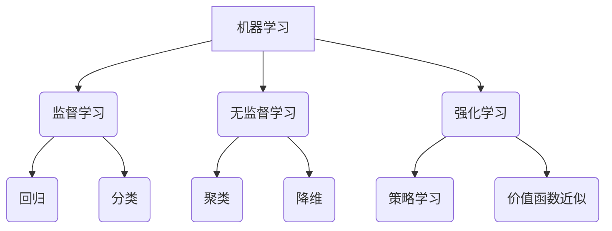
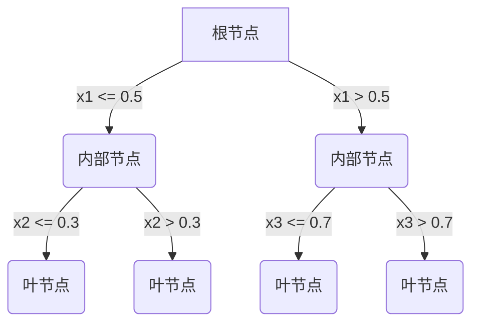
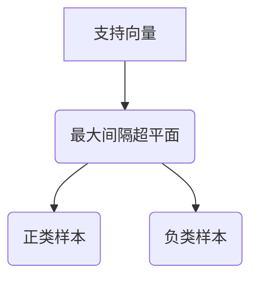
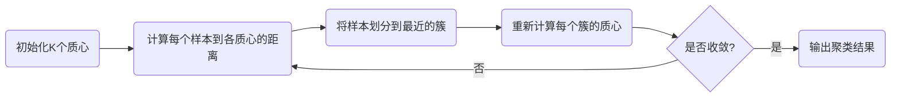

# 机器学习原理与代码实例讲解

## 1. 背景介绍

### 1.1 问题的由来

在当今数据爆炸的时代，海量数据的存在为人工智能和机器学习的发展提供了fertile土壤。从金融预测到医疗诊断,从语音识别到自动驾驶,机器学习已广泛应用于各个领域,并取得了令人瞩目的成就。然而,机器学习算法的工作原理及其背后的数学原理对于许多从业者来说仍然是一个黑箱。

### 1.2 研究现状

目前,机器学习理论研究主要集中在以下几个方面:

1. **算法优化**:提出新的算法或对现有算法进行改进,以提高模型的准确性、效率和鲁棒性。
2. **理论证明**:从数学角度严格证明算法的收敛性、泛化能力等性质。
3. **应用拓展**:将机器学习应用于新的领域,解决实际问题。

### 1.3 研究意义

深入理解机器学习算法的原理及其数学基础对于从业者来说至关重要。它不仅有助于更好地应用和调优算法,还能启发设计新的改进算法。此外,掌握算法原理有助于分析其优缺点,并将其应用于合适的场景。

### 1.4 本文结构

本文将从以下几个方面深入探讨机器学习的原理和实践:

1. 核心概念与联系
2. 核心算法原理及具体操作步骤
3. 数学模型和公式详细讲解及案例分析
4. 项目实践:代码实例和详细解释
5. 实际应用场景
6. 工具和资源推荐
7. 总结:未来发展趋势与挑战
8. 附录:常见问题与解答

## 2. 核心概念与联系

在深入探讨算法原理之前,我们有必要先了解机器学习的一些核心概念及其内在联系。

### 2.1 监督学习与无监督学习

- **监督学习**(Supervised Learning)是机器学习中最常见的一种范式。在监督学习中,算法会从标注好的训练数据中学习到一个映射函数,用于对新的输入数据进行预测或分类。典型的监督学习任务包括回归(Regression)和分类(Classification)。

- **无监督学习**(Unsupervised Learning)则不需要标注的训练数据。算法从未标注的原始数据中自动发现内在的模式和结构。常见的无监督学习任务包括聚类(Clustering)和降维(Dimensionality Reduction)。

### 2.2 强化学习

**强化学习**(Reinforcement Learning)是一种基于环境交互的学习范式。智能体(Agent)通过与环境(Environment)进行交互,获取奖励信号(Reward),并根据这些信号来调整自身的行为策略,从而达到最大化长期累积奖励的目标。强化学习常用于解决序列决策问题,如机器人控制、游戏AI等。

### 2.3 监督学习、无监督学习与强化学习的关系

监督学习、无监督学习和强化学习是机器学习的三大主要范式,它们之间存在一些内在联系:

- 监督学习和无监督学习都可以作为强化学习的一种辅助手段,如用监督学习训练一个价值函数近似器,或用无监督学习发现环境的隐藏状态。

- 强化学习可以被看作是一种序列监督学习问题,其中标签是长期累积奖励。

- 无监督学习可以用于从大量未标注数据中提取特征,这些特征可以被监督学习或强化学习算法利用。

## 3. 核心算法原理与具体操作步骤

本节将重点介绍几种核心的机器学习算法,包括它们的原理、操作步骤、优缺点以及应用领域。

### 3.1 算法原理概述

#### 3.1.1 线性回归

线性回归是最简单也是最基础的一种监督学习算法。它试图学习出一个最佳拟合的线性函数,使得输入特征与目标值之间的残差平方和最小。

$$\hat{y} = w_0 + w_1x_1 + w_2x_2 + ... + w_nx_n$$

其中$\hat{y}$是预测值,$(x_1, x_2, ..., x_n)$是输入特征,$w_i$是对应特征的权重。

#### 3.1.2 逻辑回归

逻辑回归是一种用于分类任务的算法。它通过学习一个对数几率(log-odds)的线性函数,将输入特征映射到0到1之间的值,该值可以解释为样本属于正类的概率。

$$\hat{p} = \sigma(w_0 + w_1x_1 + w_2x_2 + ... + w_nx_n)$$

其中$\sigma$是Sigmoid函数,用于将线性函数的输出映射到(0,1)区间。

#### 3.1.3 决策树

决策树是一种流行的监督学习算法,可用于回归和分类任务。它通过递归地对特征空间进行划分,构建一棵决策树,将输入样本映射到相应的输出值。

#### 3.1.4 支持向量机

支持向量机(SVM)是一种强大的监督学习算法,主要用于分类任务。它试图在高维特征空间中找到一个最大边距的超平面,将不同类别的样本分开。

#### 3.1.5 K-Means聚类

K-Means是一种常用的无监督学习算法,用于对未标注数据进行聚类。它通过迭代优化,将样本划分为K个簇,使得簇内样本相似度最大,簇间样本相似度最小。

#### 3.1.6 主成分分析

主成分分析(PCA)是一种常用的无监督学习算法,用于数据降维。它通过找到数据的主要成分(方差最大的正交方向),将高维数据映射到低维空间,同时尽可能保留原始数据的信息。

### 3.2 算法步骤详解

接下来,我们将详细解释上述算法的具体操作步骤。

#### 3.2.1 线性回归

1. **数据预处理**:对输入特征和目标值进行标准化或归一化处理。
2. **模型初始化**:初始化权重向量$w$,通常将其设置为全0或随机小值。
3. **计算预测值**:对于每个训练样本,根据公式$\hat{y} = w_0 + w_1x_1 + w_2x_2 + ... + w_nx_n$计算预测值$\hat{y}$。
4. **计算损失函数**:通常使用均方误差(MSE)作为损失函数,即$\frac{1}{2m}\sum_{i=1}^m(y^{(i)} - \hat{y}^{(i)})^2$。
5. **梯度下降**:计算损失函数关于权重的梯度,并使用梯度下降法更新权重,直到收敛或达到最大迭代次数。
6. **模型评估**:在测试集上评估模型的性能,如均方根误差(RMSE)等指标。

#### 3.2.2 逻辑回归

1. **数据预处理**:对输入特征进行标准化或归一化处理。
2. **模型初始化**:初始化权重向量$w$,通常将其设置为全0或随机小值。
3. **计算概率估计**:对于每个训练样本,根据公式$\hat{p} = \sigma(w_0 + w_1x_1 + w_2x_2 + ... + w_nx_n)$计算属于正类的概率估计$\hat{p}$。
4. **计算损失函数**:通常使用交叉熵损失函数,即$-\frac{1}{m}\sum_{i=1}^m[y^{(i)}\log\hat{p}^{(i)} + (1-y^{(i)})\log(1-\hat{p}^{(i)})]$。
5. **梯度下降**:计算损失函数关于权重的梯度,并使用梯度下降法更新权重,直到收敛或达到最大迭代次数。
6. **模型评估**:在测试集上评估模型的性能,如准确率、精确率、召回率等指标。

#### 3.2.3 决策树

1. **选择最优特征**:对于当前节点,计算每个特征的信息增益或信息增益比,选择增益最大的特征作为当前节点的分裂特征。
2. **生成子节点**:根据选择的分裂特征,将当前节点的样本划分为若干子节点。
3. **递归构建树**:对于每个子节点,重复步骤1和2,直到满足停止条件(如达到最大深度、样本数小于阈值等)。
4. **生成叶节点**:对于满足停止条件的节点,将其标记为叶节点,并根据该节点的样本确定其输出值(回归树输出均值,分类树输出众数)。
5. **树的修剪**:可选地对生成的决策树进行修剪,以防止过拟合。
6. **模型评估**:在测试集上评估模型的性能,如均方根误差(RMSE)、准确率等指标。

#### 3.2.4 支持向量机

1. **数据预处理**:对输入特征进行标准化或归一化处理。
2. **构建核函数**:选择合适的核函数(如线性核、多项式核、高斯核等),将输入特征映射到高维空间。
3. **求解对偶问题**:将原始优化问题转化为对偶形式,通过求解对偶问题来获得支持向量及其对应的系数。
4. **构建分类器**:根据支持向量及其系数,构建最终的分类器函数。
5. **模型评估**:在测试集上评估模型的性能,如准确率、精确率、召回率等指标。

#### 3.2.5 K-Means聚类

1. **初始化簇质心**:随机选择K个样本作为初始簇质心。
2. **计算距离**:对于每个样本,计算它与每个簇质心的距离(通常使用欧几里得距离)。
3. **分配簇标记**:将每个样本分配到距离最近的簇。
4. **更新质心**:对于每个簇,重新计算其质心(通常为簇内所有样本的均值)。
5. **判断收敛**:如果质心没有发生变化或达到最大迭代次数,则算法收敛;否则返回步骤2,继续迭代。
6. **模型评估**:使用簇内平方和(WSS)、轮廓系数等指标评估聚类性能。

#### 3.2.6 主成分分析

1. **数据中心化**:将输入数据矩阵$X$中心化,使其具有0均值。
2. **计算协方差矩阵**:计算中心化后的数据矩阵$X$的协方差矩阵$\Sigma = \frac{1}{m}X^TX$。
3. **求解特征值和特征向量**:对协方差矩阵$\Sigma$进行特