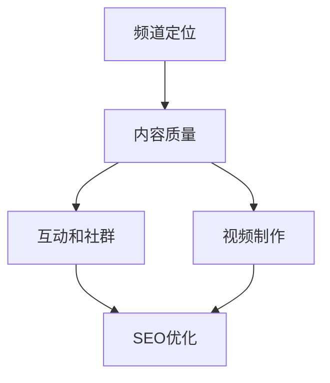

                 

# 技术分享：打造百万粉丝的技术类YouTube频道

## 1. 背景介绍

在互联网内容爆炸的今天，技术类YouTube频道成为了传播技术知识、吸引技术爱好者、甚至是培养新一代技术人才的重要平台。无论你是技术爱好者、开发者、创业者，还是希望跨入技术领域的新手，都可以通过这个平台分享和获取技术知识。如何打造一个受欢迎的技术类YouTube频道，吸引百万粉丝？本文将深入探讨这一问题，从核心概念、算法原理、具体操作步骤、实际应用场景等多个角度进行分析，给出详细的指导方案。

## 2. 核心概念与联系

### 2.1 核心概念概述

技术类YouTube频道的核心在于分享和传播技术知识。这些知识可以包括但不限于编程技巧、算法原理、软件架构、系统设计、项目实践等。要打造一个受欢迎的技术类频道，首先需要明确以下几个核心概念：

- **频道定位**：明确频道的主要受众、分享内容、以及差异化定位。
- **内容质量**：高质量、有价值、易于理解是吸引粉丝的关键。
- **视频制作**：视频质量、编辑、字幕、配音等都影响观众体验。
- **互动和社群**：与观众互动、建立社群可以增加粉丝粘性。
- **SEO优化**：通过SEO优化，提高频道在搜索结果中的排名，吸引更多观众。

这些核心概念之间的逻辑关系可以通过以下Mermaid流程图来展示：



## 3. 核心算法原理 & 具体操作步骤

### 3.1 算法原理概述

创建一个受欢迎的技术类YouTube频道，可以理解为一种内容推荐系统。系统通过分析用户的行为和偏好，推荐最适合的内容给用户。这其中涉及到了用户画像构建、内容匹配、互动优化等多个算法原理。

1. **用户画像构建**：通过分析用户观看历史、点赞、评论等行为，构建用户的兴趣画像。
2. **内容匹配**：根据用户的兴趣画像，匹配最相关、最有价值的内容。
3. **互动优化**：分析用户对内容的反馈，优化推荐算法，提升用户体验。
4. **SEO优化**：通过关键词优化、标题优化等手段，提高频道在搜索引擎中的排名。

### 3.2 算法步骤详解

**Step 1: 确定频道定位**
- 确定频道的目标受众（如Python开发者、机器学习爱好者等）
- 明确分享的内容主题（如算法原理、数据结构、项目实战等）

**Step 2: 构建高质量内容**
- 制作高清晰度的视频，确保视频的可观看性
- 提供详尽的字幕和翻译，增强内容的可访问性
- 引入动画和图表，帮助观众更好地理解复杂内容

**Step 3: 优化视频制作**
- 使用专业的视频编辑软件，如Adobe Premiere、Final Cut Pro等
- 加入动态文字和动画，提高观众的参与感
- 合理使用背景音乐和特效，增强视频的吸引力

**Step 4: 增加互动和社群**
- 定期在视频下回复观众评论，增强互动
- 加入社交媒体和社群平台，如Discord、Reddit等，建立观众社群
- 举办线上线下活动，如技术分享会、直播编程等，增加粉丝粘性

**Step 5: SEO优化**
- 分析热门关键词，优化视频标题和描述
- 定期更新频道内容，确保搜索结果中的新鲜感
- 加入YouTube和社交媒体的推荐程序，提升频道曝光率

### 3.3 算法优缺点

**优点**：
- 高定制性：可以根据用户兴趣推荐内容，提高用户满意度。
- 低成本：相比于线下活动，线上互动和内容分发成本较低。
- 高扩展性：可以通过优化算法，持续提升频道表现。

**缺点**：
- 内容制作难度大：需要专业视频制作技能和知识储备。
- 互动效果有限：线上互动无法完全替代线下面对面的交流。
- 容易被盗版：优质内容容易被盗版，影响收益。

### 3.4 算法应用领域

技术类YouTube频道可以应用于各种技术主题，如编程语言（Python、Java、C++等）、软件框架（React、Vue.js、Angular等）、算法和数据结构、人工智能和机器学习等。无论选择哪个领域，都需要遵循上述步骤，通过高质量内容和互动提升频道的吸引力。

## 4. 数学模型和公式 & 详细讲解 & 举例说明

### 4.1 数学模型构建

视频推荐系统的核心是用户画像构建和内容匹配。假设用户画像为 $U=\{u_1, u_2, ..., u_N\}$，每个用户 $u_i$ 的兴趣向量为 $\mathbf{v}_i \in \mathbb{R}^D$，其中 $D$ 为特征维度。内容库为 $C=\{c_1, c_2, ..., c_M\}$，每个内容 $c_j$ 的特征向量为 $\mathbf{w}_j \in \mathbb{R}^D$。内容与用户之间的匹配度可以用余弦相似度表示为：

$$
\cos(\theta_{i,j}) = \mathbf{v}_i \cdot \mathbf{w}_j / (\|\mathbf{v}_i\| \cdot \|\mathbf{w}_j\|)
$$

### 4.2 公式推导过程

通过余弦相似度计算用户与内容的匹配度，可以进一步使用排序算法（如Top K排序）来推荐给用户最相关的内容。在实际应用中，可能需要引入更多因素，如内容的热门度、用户观看历史、互动反馈等，以增强推荐效果。

### 4.3 案例分析与讲解

假设我们有一个Python编程实战频道，针对初学者的内容。用户画像 $U$ 包含200个Python爱好者，每个用户 $u_i$ 的兴趣向量 $\mathbf{v}_i$ 由观看历史、点赞和评论组成。内容库 $C$ 包含100个视频，每个视频 $c_j$ 的特征向量 $\mathbf{w}_j$ 由视频标题、摘要、标签组成。通过余弦相似度计算，可以计算出每个用户 $u_i$ 对每个视频 $c_j$ 的匹配度，然后选取Top 5推荐给用户。

## 5. 项目实践：代码实例和详细解释说明

### 5.1 开发环境搭建

要开始视频推荐系统的开发，需要搭建一个完整的开发环境。以下是一个基本的Python开发环境搭建步骤：

1. 安装Python和pip
2. 安装Django，用于搭建网站后端
3. 安装Flask，用于搭建API服务
4. 安装NumPy、Pandas等数据处理库
5. 安装TensorFlow或PyTorch，用于机器学习模型训练

### 5.2 源代码详细实现

以下是一个简单的Python推荐系统代码实现，用于演示如何计算用户与内容的匹配度：

```python
import numpy as np

# 用户画像
user_interests = np.array([[0.2, 0.3, 0.1],
                         [0.1, 0.5, 0.4],
                         [0.5, 0.1, 0.4]])

# 内容特征
content_features = np.array([[0.1, 0.4, 0.5],
                           [0.2, 0.3, 0.5],
                           [0.4, 0.3, 0.2]])

# 计算余弦相似度
similarities = np.dot(user_interests, content_features.T) / (np.linalg.norm(user_interests, axis=1) * np.linalg.norm(content_features, axis=1))

# 选取Top 3推荐
top3_idx = np.argsort(similarities, axis=1)[:, :3]
print(top3_idx)
```

### 5.3 代码解读与分析

以上代码实现了一个简单的余弦相似度计算过程，用于推荐系统。`user_interests` 和 `content_features` 分别代表用户兴趣向量和内容特征向量，`np.dot` 用于计算点积，`np.linalg.norm` 用于计算向量范数。最终输出的 `top3_idx` 数组中，每行包含用户 $u_i$ 的Top 3推荐内容索引。

## 6. 实际应用场景

### 6.1 智能搜索

智能搜索可以帮助用户快速找到感兴趣的内容。例如，在YouTube搜索框中输入关键词，系统可以根据用户的搜索历史和行为，推荐最相关的视频。这可以大大提高用户的搜索体验。

### 6.2 个性化推荐

个性化推荐可以根据用户的观看历史和反馈，推荐最相关的内容。例如，在视频播放结束后，向用户推荐其他相关视频。

### 6.3 社交互动

社交互动可以增强用户粘性。例如，在视频下方评论区中，让用户与其他用户互动，增加互动反馈，提升频道活跃度。

### 6.4 未来应用展望

随着技术的不断发展，未来视频推荐系统将会更加智能和个性化。例如，通过引入多模态数据（如语音、图像、文本等），提升推荐效果。同时，结合自然语言处理技术，增强内容理解和匹配度。

## 7. 工具和资源推荐

### 7.1 学习资源推荐

1. **Django官方文档**：Django是一个流行的Python Web框架，官方文档详细介绍了如何使用Django搭建网站后端。
2. **TensorFlow官方文档**：TensorFlow是一个强大的机器学习框架，官方文档提供了丰富的示例代码和教程。
3. **Flask官方文档**：Flask是一个轻量级Web框架，官方文档详细介绍了如何使用Flask搭建API服务。
4. **Python机器学习书籍**：如《Python机器学习实战》等书籍，提供了丰富的机器学习算法和应用案例。

### 7.2 开发工具推荐

1. **Visual Studio Code**：一个流行的开源代码编辑器，支持Python等编程语言。
2. **Jupyter Notebook**：一个交互式编程环境，支持Python等编程语言。
3. **PyCharm**：一个功能强大的Python IDE，支持代码自动补全、调试等功能。
4. **Git和GitHub**：版本控制和代码托管工具，方便团队协作开发。

### 7.3 相关论文推荐

1. **《深度学习推荐系统》**：介绍了推荐系统的发展历程和基本算法。
2. **《基于协同过滤的推荐系统》**：介绍了协同过滤算法的原理和应用。
3. **《内容推荐算法综述》**：综述了内容推荐算法的分类和应用。

## 8. 总结：未来发展趋势与挑战

### 8.1 总结

本文详细探讨了如何通过算法和步骤，打造一个受欢迎的技术类YouTube频道。通过明确频道定位、构建高质量内容、优化视频制作、增加互动和社群、进行SEO优化等步骤，可以显著提升频道的吸引力和影响力。

### 8.2 未来发展趋势

未来的视频推荐系统将更加智能和个性化，结合自然语言处理、多模态数据等技术，提供更精准、更丰富的推荐内容。同时，结合社交媒体和社区平台，增强用户互动和粘性。

### 8.3 面临的挑战

视频推荐系统面临的主要挑战包括：
1. 高质量内容的获取和制作成本高
2. 用户画像构建的准确性和多样性不足
3. 推荐算法复杂度高，需要持续优化
4. 用户反馈和互动效果的获取难度大

### 8.4 研究展望

未来的研究方向包括：
1. 结合人工智能和机器学习技术，提升推荐系统的准确性和个性化
2. 引入多模态数据，提高推荐系统的多样性和丰富度
3. 增强用户画像的构建和更新，提高推荐系统的准确性
4. 结合社交媒体和社区平台，增强用户互动和粘性

## 9. 附录：常见问题与解答

**Q1：如何提升频道的视频质量？**

A: 提升视频质量的关键在于制作高质量的视频内容。可以请专业的视频制作团队进行制作，确保视频的清晰度和可观看性。同时，引入动画和图表，增强内容的可理解性。

**Q2：如何增加互动和社群？**

A: 增加互动和社群的关键在于积极回应观众的评论和反馈，定期举办线上线下活动，如技术分享会、直播编程等，增强观众的参与感。

**Q3：如何进行SEO优化？**

A: 进行SEO优化的关键在于分析热门关键词，优化视频标题和描述。同时，定期更新频道内容，确保搜索结果中的新鲜感。

---

作者：禅与计算机程序设计艺术 / Zen and the Art of Computer Programming

