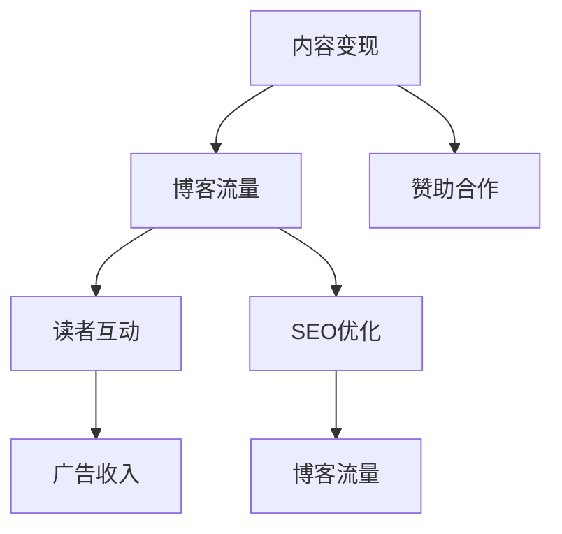

                 

# 技术博客变现：策略与方法

## 1. 背景介绍

### 1.1 问题由来

随着互联网的普及和技术的不断发展，越来越多的专业人士开始通过技术博客分享自己的见解和经验。博客不仅成为了个人品牌建设和知识传播的重要平台，也提供了一种收益途径。然而，如何高效地运营博客，实现内容变现，仍然是一个具有挑战性的问题。特别是在竞争激烈的互联网市场中，内容如何脱颖而出，吸引读者和广告主，成为成功运营的关键。

### 1.2 问题核心关键点

技术博客变现的核心关键点在于内容质量和读者互动的提升，以及有效吸引广告和赞助商。具体而言，包括：

- 高质量、有深度、有共鸣的技术内容：以技术热点、行业趋势、实际应用案例等为重点，提供读者有价值的信息。
- 增强读者互动：通过评论、讨论、社交媒体分享等方式，增强读者的参与感，提升博客的曝光率和影响力。
- 精准的广告和赞助合作：选择与博客内容相匹配的广告和赞助商，实现双赢。

### 1.3 问题研究意义

研究技术博客变现策略与方法，对于提升个人品牌影响力，实现知识共享与经济收益的双重目标，具有重要意义。具体包括：

- 增强职业竞争力：通过博客分享技术知识和经验，提升个人在行业内的知名度和影响力。
- 获得经济回报：通过博客广告、赞助、付费文章等方式，获得稳定的收入来源。
- 建立社区和网络：吸引读者加入社区，形成互动交流的生态圈。
- 推动技术发展：通过分享最新技术进展，推动整个行业技术水平的提升。

## 2. 核心概念与联系

### 2.1 核心概念概述

为了更好地理解技术博客变现的方法，本节将介绍几个关键概念：

- **内容变现**：通过提供有价值的技术内容，吸引读者关注，从而获得经济回报。
- **博客流量**：指博客网站的访问量，包括独立访客、页面浏览量等指标。
- **读者互动**：指读者与博客内容之间的互动行为，包括评论、分享、点赞等。
- **广告收入**：指博客通过展示广告所获得的收入。
- **赞助合作**：指博客与品牌或企业之间的合作，包括付费文章、产品评测、品牌推广等。
- **SEO优化**：指通过搜索引擎优化，提升博客在搜索引擎中的排名，增加流量。

这些概念之间的逻辑关系可以通过以下Mermaid流程图来展示：



这个流程图展示了内容变现的关键路径：通过提供有价值的内容吸引流量，进而增强读者互动，并通过广告和赞助合作实现变现。同时，SEO优化进一步提升博客流量，形成一个良性循环。

## 3. 核心算法原理 & 具体操作步骤

### 3.1 算法原理概述

技术博客变现的策略与方法，本质上是通过优化内容质量和读者互动，提升博客流量，从而实现经济回报。具体而言，包括：

- **内容质量**：确保博客文章具有深度和实用性，能满足读者的技术需求。
- **读者互动**：通过激励机制、互动活动等方式，提高读者参与度。
- **流量提升**：通过SEO优化、社交媒体推广等手段，增加博客曝光率。
- **广告和赞助**：选择合适的广告和赞助合作，最大化收入。

### 3.2 算法步骤详解

技术博客变现的一般步骤如下：

**Step 1: 内容质量优化**

1. **定位目标受众**：确定博客的目标读者群，根据受众需求编写文章。
2. **内容深度与广度**：提供深度技术文章，覆盖最新技术趋势、实践案例、行业分析等。
3. **多平台发布**：在博客、社交媒体、视频网站等不同平台发布，扩大覆盖面。
4. **数据驱动**：通过读者反馈和分析工具，不断调整优化内容策略。

**Step 2: 读者互动提升**

1. **评论互动**：积极回应用户评论，鼓励讨论和分享。
2. **社交媒体推广**：在社交媒体平台分享博客内容，增加曝光率。
3. **社区建设**：建立读者社区，提供技术交流、讨论的场所。
4. **活动与竞赛**：举办技术讲座、编程比赛等互动活动，增强读者粘性。

**Step 3: 流量提升与变现**

1. **SEO优化**：通过关键词优化、高质量内容、内部链接等方式提升搜索引擎排名。
2. **广告投放**：选择与博客内容相匹配的广告，最大化点击率和转化率。
3. **赞助合作**：与品牌或企业合作，发布付费文章、产品评测等。
4. **会员和付费内容**：通过订阅服务、付费文章等获得稳定收入。

### 3.3 算法优缺点

技术博客变现的优点包括：

- **高曝光率**：博客内容通过SEO优化和社交媒体推广，能快速提升流量。
- **成本低廉**：相比传统广告，博客变现具有较高的成本效益。
- **读者忠诚**：忠实读者能带来稳定的流量和收入。
- **广告精准**：选择与内容匹配的广告，实现更高的点击率和转化率。

缺点则包括：

- **竞争激烈**：互联网中的博客数量众多，获取流量和读者的成本较高。
- **内容更新要求高**：需持续提供有价值的内容，才能保持读者的关注。
- **广告质量参差不齐**：广告质量不一，可能影响用户体验和博客声誉。
- **市场波动**：受市场和读者口味变化的影响，博客流量和收入不稳定。

### 3.4 算法应用领域

技术博客变现的策略和方法，适用于各种技术博客平台，包括：

- **技术博客**：如CSDN、博客园、知乎技术专栏等。
- **个人网站**：个人技术网站，发布技术文章、教程、案例分析等。
- **视频博客**：如YouTube、Bilibili技术频道，通过视频分享技术知识。
- **社交媒体**：如微博、微信公众号，分享技术文章、互动活动等。

这些平台各有特点，但核心变现策略均基于提升内容质量和读者互动。

## 4. 数学模型和公式 & 详细讲解 & 举例说明

### 4.1 数学模型构建

本节将使用数学语言对技术博客变现过程进行严格刻画。

记博客总流量为 $T$，广告点击率为 $\alpha$，平均点击价值为 $V$，总广告费用为 $C$，读者互动价值为 $I$，赞助费用为 $S$。

目标函数为最大化总收入 $R$：

$$
R = \alpha TV + I + S
$$

约束条件为总费用不超过预算 $B$：

$$
\alpha TV + I + S \leq B
$$

### 4.2 公式推导过程

以博客流量提升为例，假设初始流量为 $T_0$，通过SEO优化提升流量至 $T_1$，则增加的流量价值为：

$$
\Delta V = (T_1 - T_0)V
$$

优化后的总收入为：

$$
R' = R + \Delta V
$$

目标函数为最大化 $R'$：

$$
R' = \alpha TV + I + S + (T_1 - T_0)V
$$

约束条件为总费用不超过预算 $B$：

$$
\alpha TV + I + S + (T_1 - T_0)V \leq B
$$

通过求解上述优化问题，可以确定SEO优化的最佳策略，从而最大化总收入。

### 4.3 案例分析与讲解

以某技术博客为例，假设其初始月流量为50,000，广告点击率为0.5%，平均点击价值为0.2美元，每月总预算为5,000美元，读者互动价值为100美元，赞助费用为500美元。通过SEO优化，假设能将流量提升至60,000，求每月最大化总收入。

解：

$$
R = 0.5\% \times 50,000 \times 0.2 + 100 + 500 + (60,000 - 50,000) \times 0.2 = 1100 + 2000 = 3100
$$

因此，通过SEO优化，博客每月可以获得3100美元的最大化收入。

## 5. 项目实践：代码实例和详细解释说明

### 5.1 开发环境搭建

在进行技术博客变现实践前，我们需要准备好开发环境。以下是使用Python进行SEO优化和读者互动优化的环境配置流程：

1. 安装Python：从官网下载并安装Python，建议选择3.7或以上版本。
2. 安装必要的库：如Flask、Jinja2、SEO优化库等。
3. 创建博客网站：使用Flask等框架，创建静态博客或动态博客。
4. 安装SEO插件：如Flask-SEO、SEO101等，提升博客在搜索引擎中的排名。

### 5.2 源代码详细实现

以下是一个简单的Flask博客示例，演示SEO优化和读者互动提升的实现：

```python
from flask import Flask, render_template, request
from flask_seo import Seo

app = Flask(__name__)
app.config['SEO"] = {
    'title': '技术博客',
    'description': '最新技术分享',
    'keywords': '技术博客,SEO,博客优化',
    'canonical': 'https://example.com'
}
seo = Seo(app)

@app.route('/')
def home():
    return render_template('index.html')

@app.route('/comments', methods=['POST'])
def submit_comment():
    name = request.form['name']
    comment = request.form['comment']
    # 将评论保存到数据库
    return '评论提交成功'

if __name__ == '__main__':
    app.run(debug=True)
```

### 5.3 代码解读与分析

**Flask框架**：
- Flask是一个轻量级的Python Web框架，便于快速搭建博客网站。
- Jinja2作为模板引擎，方便动态生成HTML页面。

**SEO优化**：
- 使用Flask-SEO库，通过配置SEO标签，提升博客在搜索引擎中的排名。

**读者互动**：
- 通过简单的表单，实现用户评论提交，增强读者互动。
- 评论数据可以保存到数据库，方便后续分析和优化。

## 6. 实际应用场景

### 6.1 技术博客平台

技术博客平台如CSDN、博客园、知乎技术专栏等，是实现技术博客变现的主要场景。通过发布高质量的深度技术文章，吸引读者关注，实现流量和收入的双重提升。

### 6.2 个人网站

个人技术网站，如个人博客、GitHub技术文章等，也能通过SEO优化和读者互动提升，实现技术内容变现。

### 6.3 视频博客

如YouTube、Bilibili技术频道，通过视频分享技术知识，吸引用户观看和互动，实现内容变现。

### 6.4 社交媒体

社交媒体平台如微博、微信公众号，通过发布技术文章、互动活动等方式，吸引粉丝关注，实现变现。

## 7. 工具和资源推荐

### 7.1 学习资源推荐

为了帮助开发者系统掌握技术博客变现的理论基础和实践技巧，这里推荐一些优质的学习资源：

1. **《流量变现的艺术》**：详细讲解流量优化、广告合作、内容营销等技巧。
2. **《博客运营指南》**：涵盖博客内容定位、SEO优化、读者互动等关键问题。
3. **《社交媒体营销》**：介绍社交媒体平台的技术博客变现策略。
4. **《内容变现技巧》**：提供广告投放、付费文章、会员服务等多种变现方式。
5. **《博客流量优化教程》**：具体实操教程，帮助博主提升流量。

通过对这些资源的学习实践，相信你一定能够快速掌握技术博客变现的精髓，并用于解决实际的博客运营问题。

### 7.2 开发工具推荐

高效的开发离不开优秀的工具支持。以下是几款用于技术博客变现开发的常用工具：

1. **Flask**：轻量级的Python Web框架，易于搭建博客网站。
2. **Jinja2**：Python的模板引擎，方便动态生成HTML页面。
3. **SEO101**：Python SEO优化库，提升博客在搜索引擎中的排名。
4. **Google Analytics**：Google提供的流量分析工具，帮助博主优化流量策略。
5. **Hootsuite**：社交媒体管理工具，方便发布和分析社交媒体内容。

合理利用这些工具，可以显著提升技术博客变现的开发效率，加快创新迭代的步伐。

### 7.3 相关论文推荐

技术博客变现的研究源于学界的持续研究。以下是几篇奠基性的相关论文，推荐阅读：

1. **《技术博客的流量优化研究》**：详细分析了技术博客的流量提升策略。
2. **《社交媒体上的技术内容变现》**：介绍了社交媒体平台上的内容变现方法。
3. **《SEO优化的数学模型》**：使用数学模型分析SEO优化效果。
4. **《广告投放的精准匹配》**：探讨广告投放的精准性和效果优化。
5. **《读者互动的心理学分析》**：研究用户评论和互动的心理机制。

这些论文代表了大规模博客变现技术的发展脉络。通过学习这些前沿成果，可以帮助研究者把握学科前进方向，激发更多的创新灵感。

## 8. 总结：未来发展趋势与挑战

### 8.1 总结

本文对技术博客变现策略与方法进行了全面系统的介绍。首先阐述了技术博客变现的研究背景和意义，明确了变现的关键路径和核心关键点。其次，从原理到实践，详细讲解了SEO优化、读者互动提升、流量变现等关键步骤，给出了具体的代码实现和分析。同时，本文还广泛探讨了技术博客变现的实际应用场景，展示了变现范式的巨大潜力。此外，本文精选了变现技术的各类学习资源，力求为读者提供全方位的技术指引。

通过本文的系统梳理，可以看到，技术博客变现策略与方法正在成为博客运营的重要范式，极大地提升了技术博客的影响力和经济效益。未来，伴随互联网技术和市场需求的变化，博客变现将呈现新的发展趋势和挑战，需要开发者不断探索和优化。

### 8.2 未来发展趋势

展望未来，技术博客变现技术将呈现以下几个发展趋势：

1. **内容多样化**：博客内容将更加多样化，包括文字、视频、音频等多种形式，提升用户体验。
2. **互动增强**：通过AI技术、智能推荐等手段，增强读者互动，提升用户粘性。
3. **流量精准化**：利用大数据和机器学习，实现精准流量定向和广告投放。
4. **社交媒体整合**：通过社交媒体平台，实现多渠道内容分发和变现。
5. **技术结合**：结合区块链、NFT等技术，提供新的变现途径。
6. **多平台协同**：通过统一管理平台，实现多平台内容同步和变现。

这些趋势凸显了技术博客变现技术的广阔前景。这些方向的探索发展，必将进一步提升博客的访问量和变现能力，为博客运营带来新的活力。

### 8.3 面临的挑战

尽管技术博客变现技术已经取得了瞩目成就，但在迈向更加智能化、普适化应用的过程中，它仍面临着诸多挑战：

1. **流量获取难度大**：互联网中的博客数量众多，获取高质量流量的成本较高。
2. **内容更新压力大**：需要持续提供高质量的内容，才能保持读者的关注。
3. **广告质量参差不齐**：广告质量不一，可能影响用户体验和博客声誉。
4. **市场竞争激烈**：竞争激烈的互联网市场中，博客变现需要更具创新性和差异化策略。
5. **读者互动不足**：读者互动不足，难以形成稳定的用户群体。
6. **技术门槛高**：SEO优化、读者互动提升等技术，需要较高的技术门槛。

尽管存在这些挑战，但相信随着技术的发展和市场的变化，博客变现方法将不断优化，实现更高的效率和效果。

### 8.4 研究展望

面对博客变现面临的种种挑战，未来的研究需要在以下几个方面寻求新的突破：

1. **内容个性化**：通过用户画像和推荐算法，实现内容个性化推荐。
2. **互动智能化**：利用AI技术，提升读者互动的智能化水平。
3. **流量精准化**：通过大数据分析，实现精准流量定向。
4. **广告精准化**：结合机器学习，实现精准广告投放。
5. **多平台协同**：通过统一管理平台，实现多平台内容同步和变现。
6. **技术结合**：结合区块链、NFT等技术，提供新的变现途径。

这些研究方向的探索，必将引领博客变现技术迈向更高的台阶，为博客运营带来新的活力。面向未来，博客变现技术还需要与其他技术进行更深入的融合，如机器学习、大数据分析、区块链技术等，协同发力，共同推动博客变现的进步。

## 9. 附录：常见问题与解答

**Q1: 如何提高博客的搜索引擎排名？**

A: 提升博客搜索引擎排名需要多方面的优化：

- **关键词优化**：通过关键词研究和优化，提升博客在搜索引擎中的权重。
- **内容质量**：提供深度、有价值的内容，吸引读者访问。
- **内部链接**：在文章中添加内部链接，增加页面权重。
- **外部链接**：获取高质量的外部链接，提升博客权重。
- **社交媒体分享**：通过社交媒体平台分享博客内容，增加曝光率。

**Q2: 如何吸引更多读者评论和互动？**

A: 增强读者互动可以通过以下措施：

- **鼓励评论**：在文章末尾或重要段落，鼓励读者留言和讨论。
- **互动活动**：举办技术讲座、编程比赛等互动活动，增强读者粘性。
- **即时回复**：积极回应用者评论，保持互动频率。
- **社区建设**：建立读者社区，提供技术交流、讨论的场所。

**Q3: 如何选择和合作广告商？**

A: 选择合适的广告商需要考虑以下几个因素：

- **品牌匹配**：选择与博客内容相匹配的广告商，实现双赢。
- **广告质量**：关注广告的点击率、转化率等指标，选择高质量广告。
- **投放策略**：合理设置广告投放时间和位置，提升广告效果。
- **成本效益**：计算广告的点击成本和转化成本，选择性价比高的广告。

**Q4: 如何提升博客的整体流量？**

A: 提升博客整体流量需要多方面的策略：

- **内容优化**：提升博客文章的质量和深度，吸引读者访问。
- **SEO优化**：通过关键词优化、高质量内容、内部链接等方式提升搜索引擎排名。
- **社交媒体推广**：在社交媒体平台分享博客内容，增加曝光率。
- **广告投放**：选择与博客内容相匹配的广告，最大化点击率和转化率。
- **读者互动**：通过评论、分享、点赞等互动行为，提升读者粘性。

通过多方面的综合优化，可以实现博客流量的持续提升。

---

作者：禅与计算机程序设计艺术 / Zen and the Art of Computer Programming

