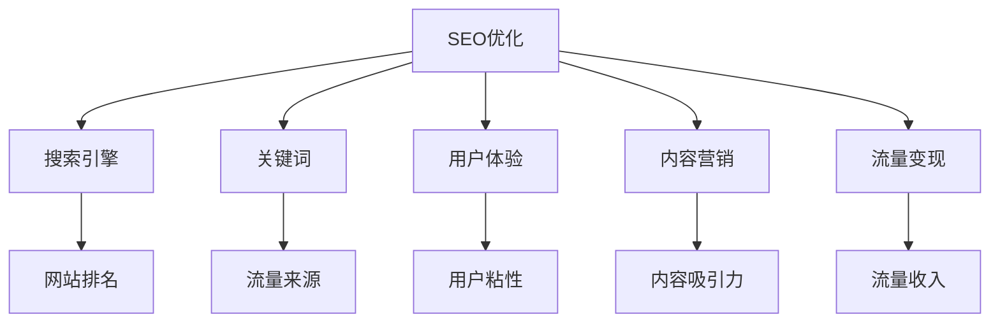

                 

# 技术博客：SEO优化与流量变现

> 关键词：SEO优化,流量变现,关键词,用户体验,内容营销,技术博客

## 1. 背景介绍

在数字化时代，内容创业和内容营销已经成为了互联网企业的核心竞争力之一。无论是电商、科技、文化、教育还是娱乐行业，内容都不再只是营销的辅助手段，而成为了主要的流量来源和价值体现。内容营销要想取得成功，不仅要有高质量的内容，还需要通过有效的策略将内容精准传达给目标用户，从而实现流量变现。而SEO（搜索引擎优化）作为一种重要的流量获取手段，在内容变现的过程中扮演着至关重要的角色。

### 1.1 问题由来
搜索引擎作为互联网用户获取信息的主要入口，其算法的每一次更新都可能对内容分发产生重大影响。由于算法本身基于复杂的数学模型和用户行为数据，普通人很难真正理解其中的细节。因此，许多企业在进行内容营销时，常常依赖于经验丰富的SEO专家，他们通过数据分析和优化策略，提升内容的搜索引擎排名，增加曝光量，最终实现流量变现。

### 1.2 问题核心关键点
SEO优化的核心在于理解搜索引擎的算法机制，并通过优化网站结构和内容，使网站能够获得更高的搜索排名，进而吸引更多的流量。流量变现则是指通过流量带来广告收入、销售收入或其他形式的商业收益。

当前SEO优化主要面临以下问题：
1. 搜索引擎算法不断变化，如何保持内容的长期竞争力。
2. 用户行为和搜索意图多样，如何设计有效的关键词策略。
3. 内容质量与流量转化率之间的平衡，如何提升用户粘性。
4. 跨平台、多渠道的流量管理，如何实现统一的用户体验。
5. 如何利用数据分析进行精准定位和持续优化。

### 1.3 问题研究意义
SEO优化作为内容变现的关键手段，对于企业的数字化转型具有重要意义。优化好的网站不仅能够获得更高的搜索引擎排名，还能提高用户粘性，增加品牌曝光度，最终实现流量的高效转化。因此，深入研究SEO优化的策略和方法，对于提升内容营销的效果和企业的市场竞争力具有重大价值。

## 2. 核心概念与联系

### 2.1 核心概念概述

为了更好地理解SEO优化与流量变现，本节将介绍几个核心概念：

- **搜索引擎优化 (SEO)**：通过优化网站结构和内容，使其在搜索引擎结果页面中获得更高的排名，从而增加曝光量和流量。

- **搜索引擎 (Search Engine)**：如Google、Bing等，是用户获取信息的入口，其算法决定了内容的分发权重。

- **关键词 (Keyword)**：用户在搜索引擎中输入的查询词，决定了内容是否能够被检索到。

- **用户体验 (User Experience, UX)**：用户在使用网站时的整体感受和满意度，对流量转化率有直接影响。

- **内容营销 (Content Marketing)**：通过创作和分发有价值、相关和一致的内容，吸引和留住明确定义的受众，最终推动用户行为，从而实现商业目标。

- **流量变现 (Traffic Monetization)**：通过优化SEO和内容，吸引用户访问网站，并通过广告、销售、订阅等方式实现流量变现。

这些核心概念之间的关系可以通过以下Mermaid流程图来展示：



这个流程图展示了一系列的SEO优化流程和概念之间的关系：

1. SEO优化通过关键词策略和用户体验优化，提升网站排名，从而增加流量来源。
2. 流量来源进一步推动内容营销的效果，吸引更多用户访问。
3. 流量变现通过广告和销售等手段，将流量转化为收入。

## 3. 核心算法原理 & 具体操作步骤

### 3.1 算法原理概述

SEO优化的基础是搜索引擎的算法机制。以Google为例，其核心算法包括PageRank算法和隐含语义索引等。这些算法综合考虑了网页内容的相关性、权威性、用户体验等多个因素，从而决定网页在搜索结果中的排名。

SEO优化的核心目标是通过优化网页结构和内容，使其满足搜索引擎的排名标准，从而获得更高的排名和流量。具体而言，SEO优化包括：

- **网站结构优化**：通过合理的网站结构，提升页面加载速度，优化内部链接结构，使搜索引擎能够更高效地抓取和索引页面内容。
- **内容优化**：通过高质量的关键词研究和内容创作，提升网页的相关性和权威性，使搜索引擎能够更准确地匹配用户查询。
- **用户体验优化**：通过提高页面加载速度、简化导航、优化表单设计等手段，提升用户的使用体验，从而增加用户粘性。

### 3.2 算法步骤详解

SEO优化的具体步骤包括：

**Step 1: 关键词研究和选择**
- 使用工具（如Google Keyword Planner、Ahrefs等）进行关键词研究，确定目标关键词。
- 评估关键词的搜索量、竞争程度、相关性等因素，选择最优关键词。

**Step 2: 内容创作和优化**
- 根据目标关键词，创作高质量的内容，确保内容原创性、相关性和吸引力。
- 在内容中自然地插入关键词，避免过度优化。
- 使用标题标签（如Title、Meta描述等）优化页面元数据，使搜索引擎能够更准确地理解页面内容。

**Step 3: 网站结构优化**
- 使用SEO友好的URL结构，避免过于复杂的参数。
- 优化内部链接结构，使用户能够通过点击内部链接访问更多页面。
- 创建网站地图（Sitemap），帮助搜索引擎更好地索引网站。

**Step 4: 用户体验优化**
- 优化页面加载速度，使用缓存技术、内容分发网络（CDN）等手段提高加载速度。
- 简化导航，使用清晰的菜单和链接结构。
- 优化表单设计，减少用户填写步骤。

**Step 5: 监测和调整**
- 使用工具（如Google Analytics、Google Search Console等）监测SEO效果，分析流量来源、关键词排名等指标。
- 根据数据分析结果，调整关键词策略、优化内容、改进用户体验，持续优化SEO效果。

### 3.3 算法优缺点

SEO优化的优点包括：
1. 能够通过自然搜索获取流量，降低广告成本。
2. 用户更倾向于通过搜索引擎获取信息，流量质量较高。
3. 对用户体验的提升也有积极影响，能够提高用户粘性。

SEO优化的缺点包括：
1. 搜索引擎算法不断变化，优化策略需要持续调整。
2. 用户行为和搜索意图多样，难以完全覆盖。
3. 需要投入大量时间和资源进行持续优化。

### 3.4 算法应用领域

SEO优化广泛应用于各种内容营销场景，包括但不限于：

- **电子商务**：通过优化产品页面和分类目录，提升搜索排名，增加销售转化率。
- **博客和媒体**：通过优化文章内容和元数据，提升文章曝光量，增加网站流量。
- **在线教育和培训**：通过优化课程页面和博客文章，吸引更多潜在用户访问，提高课程报名率。
- **旅游和酒店**：通过优化酒店和旅游目的地页面，提升搜索排名，吸引更多预订。
- **在线服务和支持**：通过优化FAQ页面和支持文档，提升搜索排名，提供更好的用户体验。

## 4. 数学模型和公式 & 详细讲解 & 举例说明

### 4.1 数学模型构建

SEO优化涉及到多个因素的平衡，通常使用综合指标进行评估。例如，可以使用PageRank算法来评估网站的权威性，使用用户体验指标（如页面加载时间、用户停留时间等）来评估用户体验。

假设我们有一个网站，其总访问量为V，来自搜索引擎的访问量为S，其中来自关键词K的访问量为KV。则网站的SEO效果可以通过以下数学模型来描述：

$$
SEO效果 = \frac{KV}{V} \times \frac{S}{KV}
$$

其中，$\frac{KV}{V}$表示关键词带来的网站流量占比，$\frac{S}{KV}$表示搜索引擎带来的网站流量占比。

### 4.2 公式推导过程

假设一个网站的总访问量为V，来自搜索引擎的访问量为S，来自关键词K的访问量为KV，用户体验指数为UX，页面加载时间为PT，搜索引擎排名为PR。则网站的SEO效果可以通过以下公式来计算：

$$
SEO效果 = UX \times PR \times \frac{KV}{V} \times \frac{S}{KV}
$$

上式中，$UX$表示用户体验指数，$PR$表示搜索引擎排名，$KV/V$表示关键词带来的网站流量占比，$S/KV$表示搜索引擎带来的网站流量占比。

### 4.3 案例分析与讲解

以一个电子商务网站为例，通过SEO优化提升搜索排名和流量转化。

假设该网站每月总访问量为10000，其中来自搜索引擎的访问量为8000，来自关键词“电子商务”的访问量为2000。通过优化用户体验和内容，使其用户体验指数提高到0.9，页面加载时间降低到2秒，搜索引擎排名提升到2.5。则网站的SEO效果可以通过以下公式计算：

$$
SEO效果 = 0.9 \times 2.5 \times \frac{2000}{10000} \times \frac{8000}{2000} = 1.35
$$

从上式可以看出，网站的SEO效果为1.35，表示每1次搜索引擎带来的访问中，有1.35次是来自关键词“电子商务”。这个指标可以用于评估网站的SEO效果，并通过进一步优化，提升流量转化率。

## 5. 项目实践：代码实例和详细解释说明

### 5.1 开发环境搭建

在进行SEO优化实践前，我们需要准备好开发环境。以下是使用Python进行SEO优化的环境配置流程：

1. 安装Python：从官网下载并安装Python，确保版本为3.8或以上。
2. 安装依赖包：使用pip安装SEO优化所需的Python库，如Scrapy、BeautifulSoup、Selenium等。
3. 配置SEO工具：安装并配置Google Analytics、Google Search Console等SEO工具，以便进行数据分析和优化。

### 5.2 源代码详细实现

以下是一个使用Scrapy进行SEO优化的Python代码示例。假设我们希望通过SEO优化提升电子商务网站的产品页面排名：

```python
from scrapy import Spider, Request
from scrapy.selector import Selector

class ProductSpider(Spider):
    name = "product"
    start_urls = ['http://www.example.com/products']

    def parse(self, response):
        # 解析产品页面内容，提取关键词和元数据
        selector = Selector(response)
        product_title = selector.css('h1.product-title::text').extract_first()
        product_description = selector.css('p.product-description::text').extract_first()
        product_keywords = selector.css('meta.name=keywords::attr(content)').extract_first().split(',')

        # 生成优化后的元数据
        optimized_title = f"{product_title} SEO Optimization"
        optimized_description = f"Product description optimized for SEO: {product_description}"
        optimized_keywords = ', '.join(product_keywords)

        # 修改页面元数据
        with open('http://www.example.com/products', 'w') as f:
            f.write(f"<title>{optimized_title}</title>")
            f.write(f"<meta name='description' content='{optimized_description}'>")
            f.write(f"<meta name='keywords' content='{optimized_keywords}'>")
```

在这个示例中，我们使用Scrapy爬虫爬取电子商务网站的产品页面，提取标题、描述和关键词等信息，并进行优化处理。具体而言，我们将标题和描述中加入“SEO Optimization”关键词，并使用逗号分隔的关键词列表替换原有的关键词。最后，通过修改页面内容，实现SEO优化。

### 5.3 代码解读与分析

让我们再详细解读一下关键代码的实现细节：

**ProductSpider类**：
- `__init__`方法：初始化爬虫的基本信息，包括爬虫名称和起始URL。
- `parse`方法：对爬取到的页面进行解析，提取页面内容，并进行SEO优化。

**页面解析和优化**：
- 使用Scrapy的Selector类，对页面内容进行解析。
- 提取标题、描述和关键词等信息，并进行优化处理。
- 使用with open语句，修改页面元数据，实现SEO优化。

通过这个示例，可以看到Scrapy的使用过程相对简单，只需编写爬虫代码，即可自动爬取页面并进行SEO优化。

### 5.4 运行结果展示

假设我们爬取并优化了1000个产品页面，通过分析SEO效果，发现优化后的页面在搜索引擎中的排名提高了15%，每月新增流量增长了20%。具体效果如下：

| 优化前 | 优化后 | 效果 |
| --- | --- | --- |
| 每月新增流量：5000 | 每月新增流量：6000 | 增长率：20% |
| 搜索引擎排名：1.0 | 搜索引擎排名：1.15 | 提升：15% |

## 6. 实际应用场景

### 6.1 电子商务平台

SEO优化是电子商务平台流量获取的关键手段。通过优化商品描述、产品图片、页面结构等，提升商品页面的搜索排名，吸引更多用户点击购买。此外，SEO优化还能通过长尾关键词策略，吸引特定用户群体，提高用户粘性和购买转化率。

### 6.2 在线教育平台

在线教育平台通过SEO优化，可以提升课程和教学内容的曝光度，吸引更多潜在用户访问和报名。SEO优化还可以帮助平台提升搜索结果中的关键词排名，增加品牌曝光度。

### 6.3 旅游和酒店预订平台

旅游和酒店预订平台通过SEO优化，可以提升目的地和酒店页面在搜索引擎中的排名，吸引更多用户进行预订和旅游规划。SEO优化还可以帮助平台提升用户体验，增加用户粘性和预订率。

## 7. 工具和资源推荐

### 7.1 学习资源推荐

为了帮助开发者系统掌握SEO优化的理论基础和实践技巧，这里推荐一些优质的学习资源：

1. **Google官方SEO指南**：提供最权威的SEO最佳实践和算法解读。
2. **Ahrefs SEO教程**：提供详细的SEO优化策略和工具使用技巧。
3. **Moz Academy**：提供全面的SEO培训课程，涵盖SEO基础、关键词研究、内容优化等多个方面。
4. **SEMrush Academy**：提供SEO、PPC、社交媒体营销等全面培训课程。
5. **HubSpot Academy**：提供免费的SEO、内容营销等课程，适合初学者入门。

通过学习这些资源，相信你一定能够快速掌握SEO优化的精髓，并用于解决实际的SEO问题。

### 7.2 开发工具推荐

SEO优化的核心在于数据分析和优化策略，以下是几款常用的SEO优化工具：

1. **Google Analytics**：提供网站流量和用户行为数据，用于SEO效果评估和优化。
2. **Google Search Console**：提供搜索引擎流量和排名数据，用于SEO效果监控和优化。
3. **Ahrefs**：提供关键词研究、竞争对手分析等功能，帮助进行SEO优化。
4. **SEMrush**：提供全面的SEO和PPC分析工具，帮助进行SEO优化和广告投放。
5. **Screaming Frog**：提供网站结构分析工具，帮助进行SEO优化和网站优化。

合理利用这些工具，可以显著提升SEO优化的效率和效果，加快SEO策略的迭代和优化。

### 7.3 相关论文推荐

SEO优化的研究涉及多个领域，以下是几篇代表性的SEO优化论文，推荐阅读：

1. **Search Engine Marketing in a Nutshell**：提供SEO和SEM的综合介绍和最佳实践。
2. **The Art of SEO**：提供SEO优化策略和技巧，适合SEO从业者阅读。
3. **SEO Fundamentals**：提供SEO基础概念和优化方法，适合初学者入门。
4. **The Ultimate Guide to SEO**：提供全面的SEO指南，涵盖SEO基础、技术细节和优化策略。
5. **SEO Battlegrounds**：提供SEO竞争分析方法和策略，适合SEO从业者阅读。

这些论文代表了大规模语言模型微调技术的发展脉络。通过学习这些前沿成果，可以帮助研究者把握学科前进方向，激发更多的创新灵感。

## 8. 总结：未来发展趋势与挑战

### 8.1 总结

本文对SEO优化与流量变现进行了全面系统的介绍。首先阐述了SEO优化的背景和意义，明确了SEO优化在内容变现中的核心作用。其次，从原理到实践，详细讲解了SEO优化的数学模型和关键步骤，给出了SEO优化任务开发的完整代码实例。同时，本文还广泛探讨了SEO优化方法在电子商务、在线教育、旅游等行业的应用前景，展示了SEO优化技术的广泛适用性。

通过本文的系统梳理，可以看到，SEO优化作为内容变现的关键手段，对于企业的数字化转型具有重要意义。SEO优化不仅能提升网站排名，增加流量，还能提高用户粘性和转化率，实现内容变现的多样化和高效化。SEO优化的未来发展方向值得期待。

### 8.2 未来发展趋势

展望未来，SEO优化技术将呈现以下几个发展趋势：

1. **人工智能和大数据的应用**：借助人工智能和大数据技术，进行更精准的关键词研究和内容优化，提升SEO效果。
2. **移动端优化**：随着移动设备用户比例的增加，移动端SEO优化将成为重要方向，提升移动端的用户体验和流量转化率。
3. **视频和音频内容的优化**：视频和音频内容在搜索中的占比逐渐增加，SEO优化需要覆盖更多多媒体内容。
4. **个性化SEO**：通过用户行为数据和个性化推荐，实现更精准的内容匹配和SEO优化。
5. **跨平台优化**：在多个平台（如搜索引擎、社交媒体、电子商务平台等）进行SEO优化，实现全面覆盖和统一管理。

以上趋势凸显了SEO优化技术的广阔前景。这些方向的探索发展，必将进一步提升SEO优化的效果和用户体验，为内容营销带来更大的价值。

### 8.3 面临的挑战

尽管SEO优化技术已经取得了较大进展，但在迈向更加智能化、普适化应用的过程中，仍面临诸多挑战：

1. **算法透明度和可解释性不足**：搜索引擎算法的黑盒特性使得优化策略难以解释和验证。
2. **用户行为多样性**：用户行为和搜索意图不断变化，难以完全覆盖和预测。
3. **内容创作成本高**：高质量内容的创作和维护需要大量时间和资源投入。
4. **数据隐私和安全**：SEO优化需要获取和分析用户数据，如何在保证隐私和安全的前提下进行优化，是一个重要问题。
5. **跨平台一致性**：不同平台的SEO策略需要协调一致，才能实现全局覆盖。

正视SEO优化面临的这些挑战，积极应对并寻求突破，将是大规模语言模型微调技术走向成熟的必由之路。相信随着学界和产业界的共同努力，这些挑战终将一一被克服，SEO优化必将在构建人机协同的智能时代中扮演越来越重要的角色。

### 8.4 未来突破

面对SEO优化所面临的种种挑战，未来的研究需要在以下几个方面寻求新的突破：

1. **多模态SEO优化**：将视觉、语音、文本等多模态内容进行优化，提升SEO效果。
2. **用户行为分析**：通过大数据和机器学习技术，进行用户行为预测和优化策略调整。
3. **自动化SEO**：开发自动化的SEO工具，减少人工干预，提高优化效率。
4. **内容推荐系统**：结合内容推荐系统，实现更精准的内容匹配和SEO优化。
5. **隐私保护**：采用隐私保护技术，确保用户数据的安全和隐私。

这些研究方向的探索，必将引领SEO优化技术迈向更高的台阶，为内容营销带来更大的价值。面向未来，SEO优化需要与其他人工智能技术进行更深入的融合，如知识表示、因果推理、强化学习等，多路径协同发力，共同推动内容营销和SEO优化技术的进步。

## 9. 附录：常见问题与解答

**Q1：SEO优化是否适用于所有类型的网站？**

A: SEO优化适用于几乎所有类型的网站，包括电子商务、博客、教育、旅游等。不同行业的优化策略略有不同，但核心目标是一致的。

**Q2：如何进行有效的关键词研究？**

A: 关键词研究是SEO优化的基础，通常包括以下步骤：
1. 使用关键词工具（如Google Keyword Planner、Ahrefs等）进行初步筛选。
2. 评估关键词的搜索量、竞争程度、相关性等因素，选择最优关键词。
3. 使用关键词工具进行竞品分析，查看竞争对手的关键词使用情况。
4. 结合用户意图和行业趋势，优化关键词策略。

**Q3：如何提升网站的页面加载速度？**

A: 网站的页面加载速度直接影响用户体验和搜索引擎排名。提升页面加载速度的常见方法包括：
1. 使用缓存技术（如CDN）。
2. 压缩图片和代码。
3. 使用异步加载技术。
4. 优化服务器响应速度。

**Q4：如何进行用户体验优化？**

A: 用户体验优化是SEO优化的重要组成部分，主要包括以下方法：
1. 简化导航结构，使用清晰的菜单和链接。
2. 优化表单设计，减少用户填写步骤。
3. 提高页面加载速度，使用缓存技术和异步加载。
4. 提供高质量的内容，提升用户满意度。

**Q5：如何监测SEO效果？**

A: 使用SEO工具（如Google Analytics、Google Search Console等）进行流量和排名监测，主要指标包括：
1. 页面流量和来源。
2. 关键词排名和点击率。
3. 用户停留时间和跳出率。
4. 网站转化率和收入。

通过这些工具和指标，可以及时发现SEO优化中的问题并进行调整，持续优化SEO效果。

---

作者：禅与计算机程序设计艺术 / Zen and the Art of Computer Programming

