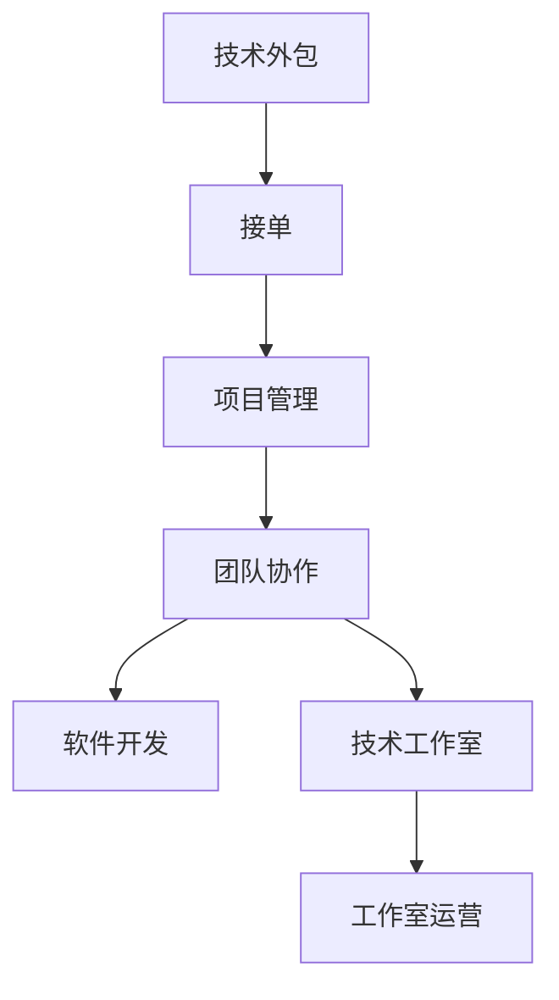

                 

# 技术外包：从接单到建立工作室

> 关键词：技术外包, 接单, 项目管理, 团队协作, 软件开发, 技术工作室, 工作室运营

## 1. 背景介绍

### 1.1 问题由来

在当前这个竞争激烈的数字化时代，许多企业或个人都需要依赖专业的技术力量来提升其业务能力和市场竞争力。然而，并非所有企业或个人都有足够的技术实力和资源来构建或维护自己的技术团队。因此，技术外包应运而生，成为了一个颇具潜力的新兴行业。

技术外包，简而言之，就是企业或个人将软件开发、网站设计、数据处理、系统维护等技术工作外包给专业的技术团队或个人。这种模式不仅能有效降低企业成本，还能确保项目高质量的完成。

### 1.2 问题核心关键点

技术外包的核心在于以下几个方面：

- **资源优化**：企业通过外包，将资源集中在核心业务上，避免在技术开发和维护上的投入。
- **专业能力提升**：外包团队通常具备丰富的技术经验，能为企业提供专业化、高效率的解决方案。
- **项目管理**：外包模式通常采用项目管理方式，能够保证项目按时、按质完成。
- **成本效益**：外包模式能有效地控制项目成本，降低企业的运营风险。
- **灵活性**：外包团队可以根据企业的实际需求灵活调配资源，确保项目按时交付。

这些关键点使得技术外包在现代企业中扮演着越来越重要的角色。然而，从接单到建立工作室，技术外包涉及到的环节和复杂性，也值得深入探讨。

## 2. 核心概念与联系

### 2.1 核心概念概述

为了更好地理解技术外包的运作机制，我们需要对以下几个核心概念有清晰的认识：

- **技术外包**：指企业或个人将某些技术项目或任务委托给第三方技术团队或个人来完成的一种模式。
- **接单**：指的是技术外包公司接收到客户提出的技术需求，并进行初步的技术评估。
- **项目管理**：通过一系列的计划、执行、监控、调整等过程，确保项目按时、按质完成的管理方式。
- **团队协作**：多个技术团队或个人共同合作完成一个项目或任务的过程。
- **软件开发**：涉及编程、测试、维护等多个环节的软件工程活动。
- **技术工作室**：由若干技术人才组成的，专门提供技术解决方案的团队或公司。
- **工作室运营**：技术工作室的日常运营、客户管理、财务核算等活动。

这些概念之间的联系通过以下Mermaid流程图展示：



这个流程图展示了技术外包从接单到工作室运营的完整流程。企业或个人通过接单获取技术需求，再通过项目管理确保项目顺利推进，团队协作确保项目质量，软件开发完成实际任务，最后通过工作室运营实现公司运营和财务管理。

## 3. 核心算法原理 & 具体操作步骤

### 3.1 算法原理概述

技术外包的运作原理主要包括以下几个方面：

1. **需求分析**：通过与客户沟通，了解项目需求和预期结果，并评估项目的可行性。
2. **项目规划**：根据项目需求制定详细的时间表和资源分配计划，确保项目按时完成。
3. **任务分配**：根据团队成员的技术特长和项目需求，合理分配任务。
4. **项目管理**：通过项目管理工具跟踪项目进度，确保项目按计划推进。
5. **质量控制**：通过代码审查、测试等手段保证项目质量。
6. **沟通协调**：确保客户与外包团队之间的有效沟通，及时解决问题。

### 3.2 算法步骤详解

以下详细讲解技术外包的各个步骤：

#### 接单

接单是技术外包的第一步，也是最重要的环节。以下是具体的接单步骤：

1. **客户需求分析**：通过问卷调查、访谈等方式，了解客户的业务背景、技术需求、预期结果等信息。
2. **需求确认**：与客户达成共识，确认项目需求和范围。
3. **报价和合同签订**：根据项目需求和预估的工作量，提供报价，并与客户签订合同。

#### 项目管理

项目管理是技术外包的核心环节，通过有效的项目管理，可以确保项目按时、按质完成。以下是项目管理的主要步骤：

1. **项目规划**：制定详细的项目时间表和资源分配计划，明确项目目标和里程碑。
2. **任务分配**：根据团队成员的技术特长和项目需求，合理分配任务，明确任务优先级和时间节点。
3. **进度跟踪**：通过项目管理工具（如JIRA、Trello等）跟踪项目进度，确保项目按计划推进。
4. **风险管理**：识别项目风险，制定应对措施，确保项目顺利进行。

#### 团队协作

团队协作是技术外包成功的关键。以下是团队协作的主要步骤：

1. **沟通渠道**：建立有效的沟通渠道，确保团队成员之间的信息流通。
2. **协作平台**：使用协作工具（如Slack、Confluence等），确保项目文档共享和协作顺畅。
3. **代码版本控制**：使用代码版本控制工具（如Git、SVN等），确保代码的安全性和可追溯性。
4. **代码审查**：通过代码审查确保代码质量和规范性。

#### 软件开发

软件开发是技术外包的实际执行环节，以下是软件开发的主要步骤：

1. **需求分析**：对客户需求进行详细分析，明确功能需求和业务逻辑。
2. **系统设计**：根据需求分析结果，设计系统架构和技术方案。
3. **编码实现**：根据设计方案进行编码实现，确保代码质量和规范性。
4. **测试**：通过单元测试、集成测试、系统测试等手段确保代码质量。

#### 技术工作室运营

技术工作室的运营是技术外包的重要环节，以下是工作室运营的主要步骤：

1. **财务管理**：确保工作室的财务收支平衡，合理控制成本。
2. **客户关系管理**：通过CRM系统管理客户信息，维护客户关系。
3. **质量管理**：通过质量控制和持续改进，确保工作室的服务质量。
4. **技术培训**：定期进行技术培训，提升团队技术水平。

### 3.3 算法优缺点

技术外包具有以下优点：

- **资源优化**：企业可以将有限的资源集中在核心业务上，避免在技术开发和维护上的投入。
- **专业能力提升**：外包团队通常具备丰富的技术经验，能为企业提供专业化、高效率的解决方案。
- **项目管理**：外包模式通常采用项目管理方式，能够保证项目按时、按质完成。
- **成本效益**：外包模式能有效地控制项目成本，降低企业的运营风险。
- **灵活性**：外包团队可以根据企业的实际需求灵活调配资源，确保项目按时交付。

同时，技术外包也存在以下缺点：

- **信任问题**：客户对外包团队的技术能力和可靠性存在一定的疑虑。
- **沟通障碍**：客户与外包团队之间的沟通可能存在一定的障碍，影响项目进度。
- **时间延误**：由于外包团队需要跨地域协作，可能导致项目进度延误。
- **成本风险**：外包团队如果管理不当，可能导致项目成本失控。

### 3.4 算法应用领域

技术外包的应用领域非常广泛，包括但不限于以下几个方面：

- **软件开发**：提供定制软件开发、系统维护、软件测试等技术服务。
- **网站设计**：提供网站开发、UI/UX设计、网站优化等技术服务。
- **数据分析**：提供数据分析、数据清洗、数据可视化等技术服务。
- **人工智能**：提供机器学习、深度学习、自然语言处理等技术服务。
- **物联网**：提供物联网设备开发、智能家居解决方案等技术服务。
- **云计算**：提供云服务部署、云平台维护等技术服务。
- **系统集成**：提供企业级系统集成、业务流程自动化等技术服务。

## 4. 数学模型和公式 & 详细讲解 & 举例说明

### 4.1 数学模型构建

为了更准确地评估技术外包的成本和效益，我们可以构建一个简单的数学模型。假设外包项目的成本和效益分别为 $C$ 和 $B$，项目的预期时间、实际时间和偏差时间分别为 $T_{\text{expect}}$、$T_{\text{actual}}$ 和 $\Delta T$，则成本和效益的计算公式分别为：

$$ C = L \times T_{\text{actual}} + F \times \Delta T $$

$$ B = \frac{V}{T_{\text{actual}}} \times T_{\text{actual}} $$

其中 $L$ 为固定成本（如团队工资、设备折旧等），$F$ 为固定费用（如办公室租金、设备购置等），$V$ 为项目价值（如新增收入、节约成本等）。

### 4.2 公式推导过程

根据以上公式，我们可以推导出成本和效益的关系：

$$ \frac{B}{C} = \frac{V}{T_{\text{actual}}} \times \frac{T_{\text{actual}}}{T_{\text{actual}}+ \Delta T} $$

通过简化，我们得到：

$$ \frac{B}{C} = \frac{V}{T_{\text{actual}}} \times (1 - \frac{\Delta T}{T_{\text{actual}}}) $$

这表明，外包项目的效益与实际完成时间正相关，与偏差时间负相关。因此，确保项目按时完成是外包成功的关键。

### 4.3 案例分析与讲解

假设某企业外包一个需要6个月完成的网站开发项目，项目预算为50万人民币。根据以上公式，如果实际完成时间为6个月，偏差时间为0，则成本和效益分别为：

$$ C = 10 \times 6 + 5 \times 0 = 60 $$

$$ B = \frac{30}{6} \times 6 = 30 $$

$$ \frac{B}{C} = \frac{30}{60} = 0.5 $$

如果实际完成时间为8个月，偏差时间为2个月，则成本和效益分别为：

$$ C = 10 \times 8 + 5 \times 2 = 80 $$

$$ B = \frac{30}{8} \times 8 = 30 $$

$$ \frac{B}{C} = \frac{30}{80} = 0.375 $$

通过对比可以发现，实际完成时间越长，成本效益越低。因此，在技术外包中，确保项目按时完成是至关重要的。

## 5. 项目实践：代码实例和详细解释说明

### 5.1 开发环境搭建

要进行技术外包的接单和项目管理，需要一个功能完备的平台作为支撑。以下是一个基本的接单和项目管理系统的开发环境搭建流程：

1. **服务器环境**：
   - 服务器操作系统：选择Linux系统，如Ubuntu、CentOS等。
   - 数据库：选择MySQL或PostgreSQL等关系型数据库。
   - Web服务器：选择Nginx或Apache等Web服务器。

2. **开发环境**：
   - 编程语言：选择Python或Java等主流编程语言。
   - 框架：选择Flask或Spring Boot等Web框架。
   - 数据库访问：使用ORM框架（如SQLAlchemy、JPA等）进行数据库操作。

3. **项目管理工具**：
   - 项目管理工具：选择JIRA、Trello等项目管理工具。
   - 协作平台：选择Slack、Confluence等协作平台。

### 5.2 源代码详细实现

以下是一个简单的接单和项目管理系统的开发示例，主要使用Python和Flask框架：

1. **需求分析界面**：
   - 功能：展示客户需求分析表单，包括需求描述、功能需求、预算等信息。
   - 代码示例：

```python
from flask import Flask, render_template, request
from flask_sqlalchemy import SQLAlchemy

app = Flask(__name__)
app.config['SQLALCHEMY_DATABASE_URI'] = 'sqlite:///test.db'
db = SQLAlchemy(app)

class Demand(db.Model):
    id = db.Column(db.Integer, primary_key=True)
    title = db.Column(db.String(100))
    description = db.Column(db.Text)
    budget = db.Column(db.Float)

@app.route('/')
def index():
    demands = Demand.query.all()
    return render_template('demand.html', demands=demands)

@app.route('/add', methods=['GET', 'POST'])
def add():
    if request.method == 'POST':
        demand = Demand(title=request.form['title'], description=request.form['description'], budget=request.form['budget'])
        db.session.add(demand)
        db.session.commit()
        return redirect('/')
    return render_template('add.html')

if __name__ == '__main__':
    app.run(debug=True)
```

2. **项目管理界面**：
   - 功能：展示项目管理表单，包括项目规划、任务分配、进度跟踪等信息。
   - 代码示例：

```python
from flask import Flask, render_template, request
from flask_sqlalchemy import SQLAlchemy

app = Flask(__name__)
app.config['SQLALCHEMY_DATABASE_URI'] = 'sqlite:///test.db'
db = SQLAlchemy(app)

class Project(db.Model):
    id = db.Column(db.Integer, primary_key=True)
    title = db.Column(db.String(100))
    plan = db.Column(db.Text)
    tasks = db.relationship('Task', backref='project', lazy=True)
    members = db.relationship('Member', backref='project', lazy=True)

class Task(db.Model):
    id = db.Column(db.Integer, primary_key=True)
    title = db.Column(db.String(100))
    description = db.Column(db.Text)
    due_date = db.Column(db.DateTime)
    completed = db.Column(db.Boolean)
    project_id = db.Column(db.Integer, db.ForeignKey('project.id'))

class Member(db.Model):
    id = db.Column(db.Integer, primary_key=True)
    name = db.Column(db.String(100))
    email = db.Column(db.String(100))
    project_id = db.Column(db.Integer, db.ForeignKey('project.id'))

@app.route('/')
def index():
    projects = Project.query.all()
    return render_template('project.html', projects=projects)

@app.route('/add', methods=['GET', 'POST'])
def add():
    if request.method == 'POST':
        project = Project(title=request.form['title'], plan=request.form['plan'])
        db.session.add(project)
        db.session.commit()
        return redirect('/')
    return render_template('add.html')

if __name__ == '__main__':
    app.run(debug=True)
```

### 5.3 代码解读与分析

在以上示例中，我们使用了Flask框架和SQLAlchemy进行数据库操作，实现了需求分析和项目管理的基本功能。通过Flask的路由机制，用户可以通过Web界面访问需求分析和项目管理界面，进行数据的输入和展示。SQLAlchemy则提供了便捷的数据库操作方式，简化了数据库的管理和维护。

## 6. 实际应用场景

### 6.1 智能制造系统

智能制造系统是技术外包的重要应用场景之一。通过技术外包，制造企业可以迅速获取高端软件解决方案，提升生产效率和产品质量。例如，某制造企业需要开发一套生产管理系统，可以通过技术外包获得完整的系统设计和实现。在项目实施过程中，外包团队会根据企业需求灵活调配资源，确保系统按时交付。

### 6.2 医疗数据分析

医疗数据分析是技术外包的另一个重要应用场景。医疗数据分析涉及到大量的数据处理和复杂算法，普通企业难以独立完成。通过技术外包，医疗企业可以获取专业的数据分析服务，提升医疗服务质量。例如，某医疗企业需要开发一套基于大数据的疾病预测系统，可以通过技术外包获得高效的数据分析和模型构建服务。

### 6.3 金融风险管理

金融风险管理是技术外包的重要应用场景之一。金融企业需要实时监控市场风险，及时发现潜在问题，保障业务安全。通过技术外包，金融企业可以获取专业的风险管理解决方案，提升风险控制能力。例如，某金融企业需要开发一套实时风险监控系统，可以通过技术外包获得高效的数据处理和分析服务。

### 6.4 未来应用展望

随着技术外包的不断发展，未来的应用场景将会更加广泛。以下是几个可能的应用场景：

- **智慧城市**：通过技术外包，智慧城市项目可以快速实现。例如，某智慧城市项目需要开发一套智能交通管理系统，可以通过技术外包获得高效的系统和数据分析服务。
- **教育培训**：通过技术外包，教育培训行业可以获得高质量的在线课程和教育资源。例如，某在线教育平台需要开发一套高质量的课程平台，可以通过技术外包获得高效的软件开发和系统集成服务。
- **能源管理**：通过技术外包，能源企业可以获得高效的数据分析和能源管理解决方案。例如，某能源企业需要开发一套智能能源管理系统，可以通过技术外包获得高效的数据分析和系统集成服务。

## 7. 工具和资源推荐

### 7.1 学习资源推荐

为了帮助开发者更好地掌握技术外包的原理和实践，以下推荐一些优质的学习资源：

1. **《技术外包：从接单到建立工作室》一书**：深入浅出地介绍了技术外包的各个环节和关键点，适合初学者和专业人士。
2. **《项目管理》课程**：通过在线课程学习项目管理的方法和技巧，帮助技术外包公司更好地管理项目。
3. **《软件开发实践》课程**：通过在线课程学习软件开发的最佳实践，帮助技术外包团队提高开发效率和代码质量。
4. **《团队协作》课程**：通过在线课程学习团队协作的方法和技巧，帮助技术外包团队提高合作效率。

### 7.2 开发工具推荐

技术外包的开发离不开高效的开发工具支持。以下是几款推荐的工具：

1. **Git**：代码版本控制系统，支持多人协作和代码追踪。
2. **JIRA**：项目管理工具，支持任务分配、进度跟踪和风险管理。
3. **Slack**：协作平台，支持实时沟通和信息共享。
4. **Confluence**：文档协作工具，支持知识共享和文档管理。
5. **Flask**：Web框架，支持快速开发Web应用。
6. **SQLAlchemy**：数据库访问框架，支持便捷的数据库操作。

### 7.3 相关论文推荐

技术外包的研究涉及多个领域，以下是几篇经典的论文，推荐阅读：

1. **《技术外包：一种新型的业务外包模式》**：介绍技术外包的定义、优势和实际应用。
2. **《基于项目管理的技术外包系统设计》**：探讨技术外包项目管理的关键问题和解决方法。
3. **《团队协作在技术外包中的重要性》**：分析团队协作在技术外包中的作用和影响。
4. **《技术外包中的成本控制和效益评估》**：研究技术外包的成本和效益，提供量化评估方法。

## 8. 总结：未来发展趋势与挑战

### 8.1 研究成果总结

技术外包的研究已经取得了一定的成果，主要集中在以下几个方面：

1. **需求分析**：通过问卷调查和访谈等方式，了解客户需求和预期结果。
2. **项目规划**：制定详细的时间表和资源分配计划，明确项目目标和里程碑。
3. **任务分配**：根据团队成员的技术特长和项目需求，合理分配任务，明确任务优先级和时间节点。
4. **项目管理**：通过项目管理工具跟踪项目进度，确保项目按计划推进。
5. **团队协作**：建立有效的沟通渠道，确保团队成员之间的信息流通。
6. **代码版本控制**：使用代码版本控制工具，确保代码的安全性和可追溯性。
7. **质量控制**：通过代码审查、测试等手段保证代码质量。
8. **成本和效益评估**：通过数学模型评估技术外包的成本和效益，提供量化评估方法。

### 8.2 未来发展趋势

技术外包的未来发展趋势主要包括以下几个方面：

1. **智能化**：通过人工智能和大数据分析，提高技术外包的效率和精度。例如，通过自然语言处理技术，自动分析客户需求和项目描述，减少人工干预。
2. **定制化**：根据客户的具体需求，提供量身定制的技术解决方案。例如，通过敏捷开发方法，快速响应客户需求变化。
3. **平台化**：通过技术外包平台，整合多种技术资源和服务，提供一站式解决方案。例如，通过在线平台，连接客户和技术团队，实现高效对接。
4. **全球化**：通过技术外包，连接全球的技术资源和服务，提升项目的国际竞争力。例如，通过全球化外包，获取高质量的软件开发和系统集成服务。

### 8.3 面临的挑战

尽管技术外包已经取得了一定的成果，但在迈向更加智能化、普适化应用的过程中，它仍面临诸多挑战：

1. **信任问题**：客户对外包团队的技术能力和可靠性存在一定的疑虑。
2. **沟通障碍**：客户与外包团队之间的沟通可能存在一定的障碍，影响项目进度。
3. **时间延误**：由于外包团队需要跨地域协作，可能导致项目进度延误。
4. **成本风险**：外包团队如果管理不当，可能导致项目成本失控。
5. **质量控制**：技术外包过程中，质量控制是一个重要环节，需要采取有效措施确保项目质量。

### 8.4 研究展望

未来的技术外包研究需要在以下几个方面寻求新的突破：

1. **需求分析**：通过自然语言处理和机器学习技术，自动分析客户需求和项目描述，减少人工干预。
2. **项目管理**：通过敏捷开发和持续集成方法，快速响应客户需求变化，提升项目效率。
3. **团队协作**：通过协作平台和沟通工具，确保团队成员之间的信息流通，提升合作效率。
4. **代码质量控制**：通过代码审查和测试工具，确保代码质量和规范性，提升项目质量。
5. **成本控制**：通过成本评估和预算管理工具，合理控制项目成本，提升成本效益。

## 9. 附录：常见问题与解答

**Q1：技术外包的接单流程是怎样的？**

A: 技术外包的接单流程一般包括以下几个步骤：

1. **需求分析**：通过问卷调查和访谈等方式，了解客户需求和预期结果。
2. **需求确认**：与客户达成共识，确认项目需求和范围。
3. **报价和合同签订**：根据项目需求和预估的工作量，提供报价，并与客户签订合同。

**Q2：技术外包过程中如何进行项目管理？**

A: 技术外包中的项目管理主要包括以下几个步骤：

1. **项目规划**：制定详细的时间表和资源分配计划，明确项目目标和里程碑。
2. **任务分配**：根据团队成员的技术特长和项目需求，合理分配任务，明确任务优先级和时间节点。
3. **进度跟踪**：通过项目管理工具（如JIRA、Trello等）跟踪项目进度，确保项目按计划推进。
4. **风险管理**：识别项目风险，制定应对措施，确保项目顺利进行。

**Q3：技术外包过程中如何进行团队协作？**

A: 技术外包中的团队协作主要包括以下几个步骤：

1. **沟通渠道**：建立有效的沟通渠道，确保团队成员之间的信息流通。
2. **协作平台**：使用协作工具（如Slack、Confluence等），确保项目文档共享和协作顺畅。
3. **代码版本控制**：使用代码版本控制工具（如Git、SVN等），确保代码的安全性和可追溯性。
4. **代码审查**：通过代码审查确保代码质量和规范性。

**Q4：技术外包过程中如何进行成本和效益评估？**

A: 技术外包中的成本和效益评估主要包括以下几个步骤：

1. **成本评估**：根据固定成本和固定费用，计算项目的总成本。
2. **效益评估**：根据项目价值和实际完成时间，计算项目的总效益。
3. **成本效益比**：计算成本效益比，评估项目的收益和成本。

通过以上问题与解答，希望能帮助读者更好地理解技术外包的原理和实践，提升技术外包的效率和效果。

---

作者：禅与计算机程序设计艺术 / Zen and the Art of Computer Programming

