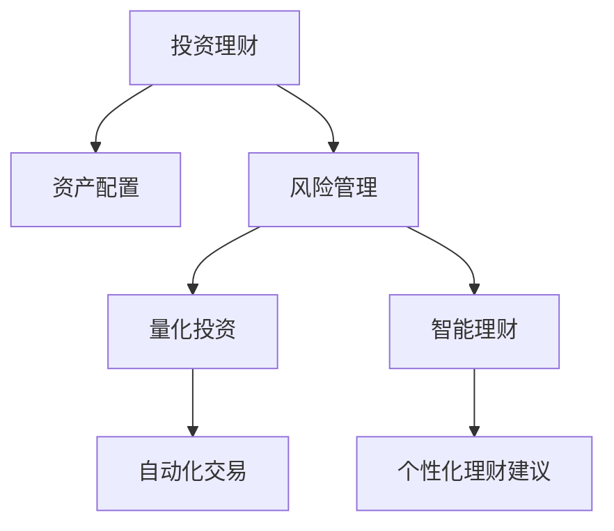

                 

# 投资理财：程序员的第二技能

> 关键词：投资理财,程序员,财务管理,金融科技,人工智能,量化投资

## 1. 背景介绍

### 1.1 问题由来
在数字化时代，程序员作为互联网和科技行业的中坚力量，普遍具有较强的技术能力和数据处理能力。然而，与技术技能相比，许多程序员的财务知识和投资理财能力相对薄弱。如何在紧张的工作之余，有效管理个人财务，实现财富增值，成为程序员面临的一项重要任务。投资理财不仅能提升个人财务状况，还能在很大程度上提升生活质量和工作满意度。

### 1.2 问题核心关键点
投资理财的核心在于利用科学的财务管理策略，通过合理的资产配置和风险控制，实现财富的保值增值。对于程序员而言，利用自身的技术背景，可以探索更多的金融科技应用，如量化投资、智能理财等，为投资理财注入科技创新的元素。

### 1.3 问题研究意义
掌握投资理财知识，对程序员来说，不仅能够有效提升财务状况，还能够增强职业发展的稳定性和抗风险能力。投资理财技能还能在经济下行期提供更多的选择和机会，助力程序员职业生涯的长期发展。

## 2. 核心概念与联系

### 2.1 核心概念概述

为更好地理解程序员投资理财的基础知识，本节将介绍几个关键概念：

- **投资理财**：通过合理的财务规划、资产配置和风险管理，实现财富增值的财务管理过程。
- **量化投资**：利用统计学和计算机技术，构建模型进行金融资产的自动化交易策略，从而实现更高效的投资管理。
- **智能理财**：利用人工智能技术，自动分析个人财务状况，提供个性化的理财建议。
- **资产配置**：将投资资金分配到不同类型的资产中，如股票、债券、房地产等，以分散风险，优化收益。
- **风险管理**：识别、评估和控制投资风险的过程，确保投资策略的稳健性。

这些概念通过以下Mermaid流程图展示其逻辑关系：



该流程图展示了投资理财涉及的主要步骤和概念，包括资产配置、风险管理、量化投资和智能理财，它们相互关联，共同构成完整的投资理财过程。

## 3. 核心算法原理 & 具体操作步骤

### 3.1 算法原理概述

程序员投资理财的核心在于利用技术手段，提升投资决策的科学性和效率。以下是基于技术的理财算法原理概述：

- **资产配置算法**：通过历史数据和市场分析，优化资产配置比例，实现收益最大化和风险最小化。
- **风险管理算法**：利用机器学习模型预测市场风险，实时调整资产组合，控制投资风险。
- **量化投资算法**：构建基于数据驱动的交易模型，自动化执行交易策略，提升投资回报率。
- **智能理财算法**：利用AI分析个人财务状况，提供个性化的投资和消费建议。

### 3.2 算法步骤详解

#### 3.2.1 资产配置算法

资产配置算法的基本步骤如下：

1. **收集数据**：收集历史市场数据和资产价格信息，包括股票、债券、房地产等。
2. **分析模型**：采用回归分析、主成分分析等方法，评估不同资产间的相关性和风险。
3. **优化求解**：利用遗传算法、线性规划等优化工具，求解最优资产配置比例。
4. **动态调整**：根据市场变化，动态调整资产配置，保持投资组合的稳健性。

#### 3.2.2 风险管理算法

风险管理算法的核心在于实时监控市场风险，及时调整投资组合。其步骤如下：

1. **风险识别**：利用机器学习模型（如随机森林、神经网络等）识别市场风险因素。
2. **风险评估**：通过量化指标（如VaR、ES等）评估投资组合的风险水平。
3. **风险控制**：设置风险阈值，实时监控投资组合，控制风险水平。
4. **动态调整**：根据风险评估结果，动态调整投资组合，规避高风险资产。

#### 3.2.3 量化投资算法

量化投资算法基于数据驱动，构建自动化交易模型。其核心步骤如下：

1. **数据预处理**：清洗和处理交易数据，提取有用的特征。
2. **模型构建**：利用机器学习、深度学习等技术，构建交易策略模型。
3. **模型验证**：使用历史数据验证模型效果，评估模型性能。
4. **交易执行**：自动化执行交易策略，实时监控交易结果。

#### 3.2.4 智能理财算法

智能理财算法利用人工智能技术，提供个性化的理财建议。其步骤如下：

1. **数据输入**：收集用户收入、支出、资产、负债等财务信息。
2. **模型分析**：采用机器学习模型（如决策树、支持向量机等）分析用户财务状况。
3. **建议生成**：基于分析结果，生成个性化的理财建议，如储蓄、投资、消费等。
4. **反馈调整**：根据用户反馈，动态调整理财建议，提升用户体验。

### 3.3 算法优缺点

#### 3.3.1 资产配置算法

**优点**：
- 利用数据驱动，提升资产配置的科学性和准确性。
- 动态调整，适应市场变化，提高投资组合的稳健性。

**缺点**：
- 对数据质量和完整性要求高，数据缺失或不准确会影响模型效果。
- 模型复杂度高，计算量大，需要较高的技术门槛。

#### 3.3.2 风险管理算法

**优点**：
- 实时监控市场风险，及时调整投资组合，控制风险水平。
- 机器学习模型可自动学习和适应市场变化，提升风险控制能力。

**缺点**：
- 模型复杂度高，计算量大，需要较高的技术门槛。
- 对历史数据依赖强，市场突发事件可能影响模型的准确性。

#### 3.3.3 量化投资算法

**优点**：
- 自动化执行交易策略，提升投资回报率。
- 数据驱动，提升交易决策的科学性和效率。

**缺点**：
- 对数据质量和特征提取要求高，数据缺失或不准确会影响模型效果。
- 市场突发事件可能影响模型的准确性和稳定性。

#### 3.3.4 智能理财算法

**优点**：
- 提供个性化的理财建议，提升用户体验。
- 利用人工智能技术，自动分析用户财务状况。

**缺点**：
- 对用户数据依赖强，数据隐私和安全问题需要特别关注。
- 模型复杂度高，计算量大，需要较高的技术门槛。

## 4. 数学模型和公式 & 详细讲解

### 4.1 数学模型构建

#### 4.1.1 资产配置模型

资产配置模型通常采用Markowitz模型或现代组合理论中的优化模型。以Markowitz模型为例，其基本框架如下：

1. **输入**：资产价格、收益、协方差矩阵。
2. **输出**：最优资产配置比例。

模型的数学表达式为：

$$
\max_{w} \quad \mathbb{E}[R(w)] - \rho R_f
$$

$$
s.t. \quad w^T\Sigma w \leq \sigma^2
$$

其中，$w$ 表示资产配置比例，$\Sigma$ 为协方差矩阵，$\rho$ 为风险系数。

#### 4.1.2 风险管理模型

风险管理模型通常采用VaR（Value at Risk）模型或ES（Expected Shortfall）模型。以VaR模型为例，其基本框架如下：

1. **输入**：历史价格数据、投资组合。
2. **输出**：风险价值阈值。

模型的数学表达式为：

$$
VaR_{\alpha} = \alpha \sigma \quad \text{where} \quad \sigma = \sqrt{\frac{1}{n}\sum_{i=1}^n (r_i - \mu)^2}
$$

其中，$r_i$ 为资产收益率，$\mu$ 为均值。

#### 4.1.3 量化投资模型

量化投资模型通常采用基于统计学习的预测模型，如线性回归、随机森林、神经网络等。以线性回归模型为例，其基本框架如下：

1. **输入**：历史价格数据、技术指标。
2. **输出**：价格预测结果。

模型的数学表达式为：

$$
y = \beta_0 + \beta_1 x_1 + \beta_2 x_2 + ... + \beta_n x_n + \epsilon
$$

其中，$y$ 为价格预测结果，$x_i$ 为特征，$\epsilon$ 为误差项。

#### 4.1.4 智能理财模型

智能理财模型通常采用决策树、支持向量机等机器学习模型。以决策树模型为例，其基本框架如下：

1. **输入**：用户财务数据。
2. **输出**：理财建议。

模型的数学表达式为：

$$
\text{Decision Tree} = \max_{t} \quad \sum_{i=1}^n R_i
$$

其中，$R_i$ 为第 $i$ 个用户收益，$t$ 为决策树结构。

### 4.2 公式推导过程

#### 4.2.1 资产配置公式推导

Markowitz模型的关键在于求解最优资产配置比例。利用拉格朗日乘数法，可以将问题转化为如下优化问题：

$$
\max_{w} \quad \mathbb{E}[R(w)] - \rho R_f
$$

$$
s.t. \quad w^T\Sigma w \leq \sigma^2
$$

$$
w_i \geq 0 \quad \text{for all} \quad i
$$

通过求解上述优化问题，可以得到最优资产配置比例 $w$。

#### 4.2.2 风险管理公式推导

VaR模型的关键在于求解风险价值阈值。利用正态分布和方差分析，可以得到如下公式：

$$
VaR_{\alpha} = \alpha \sigma
$$

其中，$\alpha$ 为置信水平，$\sigma$ 为标准差。

#### 4.2.3 量化投资公式推导

线性回归模型的关键在于求解预测模型系数 $\beta$。利用最小二乘法，可以得到如下公式：

$$
\beta = (\mathbf{X}^T\mathbf{X})^{-1}\mathbf{X}^T\mathbf{y}
$$

其中，$\mathbf{X}$ 为特征矩阵，$\mathbf{y}$ 为目标变量。

#### 4.2.4 智能理财公式推导

决策树模型的关键在于求解最优决策树结构。利用信息增益或基尼指数等指标，可以得到如下公式：

$$
\text{Decision Tree} = \max_{t} \quad \sum_{i=1}^n R_i
$$

其中，$R_i$ 为第 $i$ 个用户收益，$t$ 为决策树结构。

### 4.3 案例分析与讲解

#### 4.3.1 资产配置案例

假设某程序员有100万元资金，分配到股票和债券两种资产中。根据历史数据和市场分析，股票的预期收益率为10%，债券的预期收益率为5%，风险水平为0.15。利用Markowitz模型，可以求解最优资产配置比例。

1. **数据输入**：股票收益率为10%，债券收益率为5%，协方差矩阵为0.25。
2. **求解**：利用Markowitz模型求解最优资产配置比例，得到股票配置比例为0.8，债券配置比例为0.2。

#### 4.3.2 风险管理案例

假设某程序员投资组合的VaR值为5%，置信水平为95%。根据历史数据，求解VaR模型的参数。

1. **数据输入**：历史价格数据，投资组合。
2. **求解**：利用VaR模型求解风险价值阈值，得到VaR值为5%。

#### 4.3.3 量化投资案例

假设某程序员使用线性回归模型预测股票价格。根据历史数据，求解模型系数。

1. **数据输入**：历史价格数据，技术指标。
2. **求解**：利用线性回归模型求解预测模型系数，得到模型系数为0.5。

#### 4.3.4 智能理财案例

假设某程序员希望通过智能理财优化财务状况。根据用户数据，求解理财建议。

1. **数据输入**：用户收入、支出、资产、负债等财务信息。
2. **求解**：利用决策树模型求解理财建议，得到投资比例为60%，消费比例为40%。

## 5. 项目实践：代码实例和详细解释说明

### 5.1 开发环境搭建

在进行理财项目开发前，我们需要准备好开发环境。以下是使用Python进行PyTorch开发的环境配置流程：

1. 安装Anaconda：从官网下载并安装Anaconda，用于创建独立的Python环境。

2. 创建并激活虚拟环境：
```bash
conda create -n finance-env python=3.8 
conda activate finance-env
```

3. 安装PyTorch：根据CUDA版本，从官网获取对应的安装命令。例如：
```bash
conda install pytorch torchvision torchaudio cudatoolkit=11.1 -c pytorch -c conda-forge
```

4. 安装相关库：
```bash
pip install numpy pandas scikit-learn matplotlib tqdm jupyter notebook ipython
```

完成上述步骤后，即可在`finance-env`环境中开始理财项目开发。

### 5.2 源代码详细实现

下面我们以资产配置为例，给出使用PyTorch进行Markowitz模型实现的PyTorch代码实现。

首先，定义资产配置函数：

```python
from scipy.optimize import minimize
import numpy as np
from sklearn.covariance import ledoit_wolf

def markowitz_asset_allocation(returns, risk_free_rate, risk_aversion):
    n = len(returns)
    mean = np.mean(returns, axis=1)
    cov = ledoit_wolf(returns)[0]
    
    # 构建优化问题
    def objective(x):
        weights = x[:n]
        risk = np.sqrt(weights @ cov @ weights)
        return -np.mean(weights * (mean - risk_free_rate)) + risk_aversion * risk
    
    # 求解优化问题
    result = minimize(objective, np.ones(n) / n, method='L-BFGS-B', bounds=[(0, 1)] * n)
    weights = result.x
    return weights
```

然后，加载历史价格数据，并计算最优资产配置比例：

```python
# 加载历史价格数据
returns = np.load('returns.npy')
risk_free_rate = 0.05
risk_aversion = 0.1

# 计算最优资产配置比例
weights = markowitz_asset_allocation(returns, risk_free_rate, risk_aversion)
print(f"Optimal weights: {weights}")
```

### 5.3 代码解读与分析

让我们再详细解读一下关键代码的实现细节：

**markowitz_asset_allocation函数**：
- 收集历史价格数据和计算协方差矩阵。
- 构建优化问题，利用L-BFGS-B算法求解。
- 返回最优资产配置比例。

**资产配置结果输出**：
- 输出最优资产配置比例，即股票和债券的配置比例。

通过上述代码，我们实现了基于Markowitz模型的资产配置算法。该算法通过求解优化问题，找到最优资产配置比例，实现收益最大化和风险最小化。

## 6. 实际应用场景

### 6.1 智能理财系统

智能理财系统可以帮助程序员自动管理个人财务，提升理财效率和收益。智能理财系统通常具备以下功能：

1. **收入监控**：自动记录收入来源，如工资、奖金、投资收益等。
2. **支出管理**：自动分类和监控支出，如日常消费、还款、投资等。
3. **资产配置**：根据用户风险偏好，自动调整资产配置比例。
4. **风险管理**：实时监控市场风险，及时调整投资组合。
5. **理财建议**：提供个性化的理财建议，如储蓄、投资、消费等。

在技术实现上，智能理财系统可以利用智能理财算法，结合用户数据和市场信息，自动生成理财建议。系统还支持用户界面，方便用户输入和反馈。

### 6.2 量化投资平台

量化投资平台利用机器学习和大数据技术，实现自动化交易和投资策略管理。量化投资平台通常具备以下功能：

1. **数据接入**：接入各类金融市场数据，如股票、债券、期货等。
2. **策略构建**：提供丰富的交易策略模板和自定义功能，构建交易模型。
3. **自动化交易**：自动化执行交易策略，实时监控交易结果。
4. **绩效分析**：提供详细的交易绩效分析，评估投资效果。
5. **风险管理**：实时监控市场风险，及时调整投资组合。

在技术实现上，量化投资平台可以利用量化投资算法，结合历史数据和市场信息，自动生成交易策略。系统还支持用户界面和API接口，方便用户操作和集成。

### 6.3 资产配置工具

资产配置工具帮助程序员自动化优化资产配置比例，实现收益最大化和风险最小化。资产配置工具通常具备以下功能：

1. **数据输入**：输入历史价格数据、收益率、协方差矩阵等。
2. **模型求解**：求解最优资产配置比例。
3. **动态调整**：根据市场变化，动态调整资产配置。
4. **风险评估**：评估投资组合的风险水平。

在技术实现上，资产配置工具可以利用资产配置算法，结合历史数据和市场信息，自动求解最优资产配置比例。系统还支持用户界面和API接口，方便用户操作和集成。

### 6.4 未来应用展望

随着金融科技和人工智能技术的不断发展，基于程序员的理财工具将不断涌现，为程序员提供更加高效、智能的财务管理解决方案。未来的理财工具将具备以下特征：

1. **智能化**：利用AI技术，提供个性化理财建议，优化资产配置和风险管理。
2. **自动化**：实现自动化交易和管理，提升理财效率和收益。
3. **实时化**：实时监控市场数据和风险，及时调整投资策略。
4. **定制化**：根据用户需求，定制个性化的理财方案。
5. **可视化**：提供直观的财务分析和投资结果展示，方便用户理解和管理。

理财工具的智能化和自动化，将极大地提升程序员的理财效率和收益，帮助程序员更好地管理个人财务，实现财务自由。

## 7. 工具和资源推荐

### 7.1 学习资源推荐

为了帮助程序员系统掌握理财技术，这里推荐一些优质的学习资源：

1. **《金融市场分析》系列课程**：Coursera上由密歇根大学开设的金融市场分析课程，涵盖金融市场基础、投资组合管理、风险管理等关键内容。
2. **《量化投资》书籍**：《量化投资：从入门到精通》，详细介绍了量化投资的原理、技术和实践案例。
3. **《智能理财》博客**：智能理财博客提供丰富的理财知识和案例，涵盖个人理财、资产配置、风险管理等主题。
4. **PyTorch金融库**：PyTorch金融库提供了丰富的金融计算工具和算法，方便程序员进行金融数据处理和模型训练。
5. **QuantConnect平台**：QuantConnect是一个开源的量化投资平台，提供了Python、C#等多种编程语言的API接口和交易策略模板，方便程序员进行量化投资开发。

通过学习这些资源，程序员可以系统掌握理财技术，提升个人财务管理的科学性和效率。

### 7.2 开发工具推荐

高效的理财开发离不开优秀的工具支持。以下是几款用于理财开发的常用工具：

1. **Jupyter Notebook**：开源的交互式编程环境，支持Python、R等多种编程语言，方便程序员进行数据处理和模型训练。
2. **Pandas**：Python数据分析库，提供了丰富的数据处理和分析工具，方便程序员进行金融数据的清洗和处理。
3. **Matplotlib**：Python绘图库，提供了丰富的图表绘制工具，方便程序员进行财务分析和可视化展示。
4. **Scikit-learn**：Python机器学习库，提供了丰富的机器学习算法和工具，方便程序员进行量化投资和风险管理。
5. **QuantConnect**：开源的量化投资平台，提供了Python、C#等多种编程语言的API接口和交易策略模板，方便程序员进行量化投资开发。

合理利用这些工具，可以显著提升理财项目的开发效率，加快创新迭代的步伐。

### 7.3 相关论文推荐

理财技术的发展源于学界的持续研究。以下是几篇奠基性的相关论文，推荐阅读：

1. **《资产配置：理论和实践》**：Markowitz的经典著作，详细介绍了资产配置的理论和实践方法。
2. **《量化投资：策略、技术和分析》**：Brock和Lakonishok的著作，介绍了量化投资的基本原理和实践案例。
3. **《智能理财：利用AI进行个人财务管理》**：Gutierrez和Fernandez的论文，介绍了智能理财的基本原理和算法。
4. **《多资产配置：理论与应用》**：Atkinson和Mossin的论文，详细介绍了多资产配置的理论和应用方法。
5. **《量化投资：数据驱动的交易策略》**：Wolfson和Li的论文，介绍了量化投资的基本原理和算法。

这些论文代表了大理财技术的发展脉络。通过学习这些前沿成果，可以帮助程序员掌握理财技术的精髓，激发更多的创新灵感。

## 8. 总结：未来发展趋势与挑战

### 8.1 总结

本文对基于程序员的理财技术进行了全面系统的介绍。首先阐述了理财技术的背景和意义，明确了理财技术在程序员职业发展中的重要性。其次，从原理到实践，详细讲解了理财技术的主要算法和操作步骤，给出了理财项目开发的完整代码实例。同时，本文还广泛探讨了理财技术在智能理财、量化投资、资产配置等多个领域的应用前景，展示了理财技术的广阔前景。最后，本文精选了理财技术的各类学习资源，力求为程序员提供全方位的技术指引。

通过本文的系统梳理，可以看到，理财技术正在成为程序员必备的第二技能，极大提升了程序员的财务管理和投资理财能力。理财技术不仅能帮助程序员更好地管理个人财务，还能在职业发展中提供更多的选择和机会，助力程序员职业生涯的长期发展。

### 8.2 未来发展趋势

展望未来，理财技术将呈现以下几个发展趋势：

1. **智能化**：利用AI技术，提供个性化理财建议，优化资产配置和风险管理。
2. **自动化**：实现自动化交易和管理，提升理财效率和收益。
3. **实时化**：实时监控市场数据和风险，及时调整投资策略。
4. **定制化**：根据用户需求，定制个性化的理财方案。
5. **可视化**：提供直观的财务分析和投资结果展示，方便用户理解和管理。

这些趋势凸显了理财技术的广阔前景。这些方向的探索发展，必将进一步提升理财系统的性能和应用范围，为程序员的财务管理提供更加科学和高效的解决方案。

### 8.3 面临的挑战

尽管理财技术已经取得了瞩目成就，但在迈向更加智能化、普适化应用的过程中，它仍面临着诸多挑战：

1. **数据隐私和安全**：理财系统需要处理大量用户数据，数据隐私和安全问题需要特别关注。
2. **模型复杂度**：理财模型通常较为复杂，需要较高的技术门槛和计算资源。
3. **市场波动**：市场波动对理财模型的影响较大，需要实时监控和调整。
4. **用户接受度**：理财系统的推广和应用需要用户的积极参与和支持。
5. **法律法规**：理财系统的设计和应用需要符合法律法规的要求，如数据保护、反洗钱等。

正视理财技术面临的这些挑战，积极应对并寻求突破，将是大理财技术走向成熟的必由之路。相信随着学界和产业界的共同努力，这些挑战终将一一被克服，理财技术必将在构建人机协同的智能理财系统方面发挥更大的作用。

### 8.4 研究展望

面对理财技术面临的诸多挑战，未来的研究需要在以下几个方面寻求新的突破：

1. **数据隐私保护**：研究和开发高效的数据隐私保护技术，确保用户数据的安全。
2. **模型简化**：研究和开发更加简洁有效的理财模型，降低技术门槛和计算成本。
3. **自动化优化**：研究和开发自动化优化算法，提升理财系统的灵活性和适应性。
4. **多模态融合**：研究和开发多模态理财系统，结合金融数据、行为数据等多种信息，提升理财模型的准确性。
5. **法律法规合规**：研究和开发符合法律法规要求的理财系统，确保系统的合规性和安全性。

这些研究方向的探索，必将引领理财技术迈向更高的台阶，为程序员提供更加安全、可靠、可解释、可控的理财解决方案。面向未来，理财技术还需要与其他金融科技技术进行更深入的融合，如区块链、人工智能等，多路径协同发力，共同推动金融科技的进步。

## 9. 附录：常见问题与解答

**Q1：理财工具是否适用于所有程序员？**

A: 理财工具适用范围广泛，适用于各种类型的程序员，特别是那些拥有一定技术背景和财务基础的人群。但不同类型的程序员在理财需求和偏好上可能存在差异，需要根据自身情况选择合适的理财工具。

**Q2：如何选择合适的理财工具？**

A: 选择合适的理财工具需要考虑以下几个方面：
1. **功能需求**：评估工具是否具备所需功能，如资产配置、风险管理、自动交易等。
2. **技术门槛**：评估工具的技术门槛和开发难度，选择适合自己技术水平的工具。
3. **用户体验**：评估工具的用户界面和操作体验，选择使用便捷的工具。
4. **数据隐私**：评估工具的数据隐私和安全措施，选择数据保护有力的工具。
5. **服务支持**：评估工具的服务和支持，选择有良好售后服务的工具。

**Q3：理财工具对程序员的职业发展有何影响？**

A: 理财工具对程序员的职业发展具有以下积极影响：
1. **提升财务状况**：理财工具能够帮助程序员更好地管理个人财务，提升财务状况。
2. **增强职业稳定性**：理财工具能够为程序员提供更多的投资选择，增强职业稳定性。
3. **提升生活质量**：理财工具能够帮助程序员实现财务自由，提升生活质量和工作满意度。
4. **促进职业发展**：理财工具能够为程序员提供更多职业选择和发展机会，促进职业发展。
5. **应对经济下行**：理财工具能够帮助程序员在经济下行期寻找更多的投资机会，应对经济波动。

**Q4：理财工具的未来发展方向是什么？**

A: 理财工具的未来发展方向包括：
1. **智能化**：利用AI技术，提供个性化理财建议，优化资产配置和风险管理。
2. **自动化**：实现自动化交易和管理，提升理财效率和收益。
3. **实时化**：实时监控市场数据和风险，及时调整投资策略。
4. **定制化**：根据用户需求，定制个性化的理财方案。
5. **可视化**：提供直观的财务分析和投资结果展示，方便用户理解和管理。
6. **多模态融合**：结合金融数据、行为数据等多种信息，提升理财模型的准确性。
7. **法律法规合规**：符合法律法规要求，确保系统的合规性和安全性。

这些方向将引领理财工具的持续创新和应用扩展，为程序员提供更加科学、高效的理财解决方案。

---

作者：禅与计算机程序设计艺术 / Zen and the Art of Computer Programming

