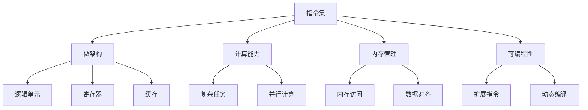

                 

# 指令集的进化：从固定到无限的跨越

> 关键词：指令集,进化,固定,无限,微架构,计算能力,内存管理,可编程性,硬件支持

## 1. 背景介绍

在计算机科学的发展史中，指令集扮演着至关重要的角色。早期的计算机指令集是固定的，由硬件设计者事先定义，开发者只能遵循这些规则进行编程。然而，随着时间的推移，指令集逐渐演进，从固定的形式转变为更加灵活、可扩展的形式，甚至开始朝着无限计算能力的方向发展。

### 1.1 固定指令集的局限

在早期的计算机中，指令集被固定在硬件设计中。这种设计方式具有以下局限：

- **不可扩展性**：一旦硬件被制造完成，指令集就被固定在处理器中，无法扩展。
- **开发难度高**：由于指令集的固定性，开发者必须熟悉硬件的具体实现细节，编写符合固定指令集的代码，增加了开发难度。
- **硬件成本高**：固定指令集的处理器通常只能用于特定类型的任务，缺乏通用性，导致硬件成本较高。

这些局限性在某种程度上限制了计算机的广泛应用和发展。

### 1.2 现代指令集的发展

随着计算机科学和硬件技术的进步，指令集逐渐演进，变得更加灵活和可扩展。现代指令集不仅支持更多的计算能力，还具备更好的内存管理、更高的可编程性，以及对更广泛硬件的支持。

这种演进使得计算机能够更灵活地应对各种复杂的任务，推动了计算机科学和信息技术的发展。

## 2. 核心概念与联系

### 2.1 核心概念概述

为了更好地理解指令集的演进，我们需要先了解几个核心概念：

- **指令集**：定义了处理器能够执行的所有指令，是硬件和软件的接口。
- **微架构**：指处理器内部的硬件设计，包括逻辑单元、寄存器、缓存等，直接影响指令集的性能和灵活性。
- **计算能力**：指处理器能够执行的计算任务种类和复杂度，直接影响指令集的适用范围。
- **内存管理**：指处理器对内存的访问和管理方式，直接影响指令集的性能和稳定性。
- **可编程性**：指指令集的可扩展性和灵活性，直接影响开发者的工作效率和创新能力。

这些概念之间的联系可以通过以下Mermaid流程图来展示：



这个流程图展示了几大核心概念及其之间的联系：

1. 指令集定义了处理器能够执行的所有指令，并与微架构、计算能力、内存管理和可编程性紧密相关。
2. 微架构直接影响指令集的性能和灵活性，由逻辑单元、寄存器和缓存等硬件组成。
3. 计算能力定义了指令集能够执行的复杂任务种类，影响指令集的适用范围。
4. 内存管理包括内存访问和数据对齐等，直接影响指令集的性能和稳定性。
5. 可编程性是指令集的可扩展性和灵活性，影响开发者的工作效率和创新能力。

这些概念共同构成了现代指令集的基础，指导着指令集的演进方向。

## 3. 核心算法原理 & 具体操作步骤

### 3.1 算法原理概述

现代指令集的演进主要围绕着计算能力、内存管理和可编程性等方面展开。这些演进的目标是通过硬件和软件的协同工作，提升处理器的性能和灵活性，使其能够应对更加复杂和多样化的任务。

### 3.2 算法步骤详解

现代指令集的演进一般包括以下关键步骤：

**Step 1: 分析现有指令集**

在考虑指令集的演进前，需要对现有指令集进行全面的分析，识别其优点和局限。这包括分析计算能力、内存管理、可编程性等方面，找出需要改进或扩展的地方。

**Step 2: 设计新指令集**

基于分析结果，设计新的指令集，使其具备更高的计算能力、更好的内存管理和更高的可编程性。这通常需要与硬件设计紧密配合，进行多次迭代和优化。

**Step 3: 实现新指令集**

将设计好的新指令集实现到处理器中，进行严格的测试和验证，确保其性能和稳定性。这包括硬件设计、软件优化和系统集成等方面。

**Step 4: 应用新指令集**

将新指令集应用于实际系统中，评估其效果和性能，进行必要的调整和优化。这包括优化编译器、操作系统、应用软件等方面。

### 3.3 算法优缺点

现代指令集的演进具有以下优点：

1. **增强计算能力**：新指令集通常支持更多的计算任务，提升处理器的性能。
2. **优化内存管理**：新指令集通常支持更好的内存管理和数据对齐，提高处理器的稳定性。
3. **提高可编程性**：新指令集通常具备更高的可扩展性和灵活性，提升开发者的工作效率。

同时，这些演进也存在一定的局限性：

1. **硬件成本高**：新指令集的实现通常需要大量的硬件投入，导致硬件成本较高。
2. **软件兼容性差**：新指令集与现有软件的兼容性可能较差，需要进行大量的软件优化和调整。
3. **学习成本高**：新指令集的复杂性可能增加开发者的学习成本，需要更多的培训和技术支持。

尽管存在这些局限性，但就目前而言，现代指令集的演进仍是推动计算机科学和信息技术发展的关键动力。

### 3.4 算法应用领域

现代指令集的演进在多个领域得到了广泛应用，例如：

- **高性能计算**：新指令集支持更多的并行计算任务，提升计算性能，广泛应用于科学计算、数据分析等领域。
- **人工智能**：新指令集支持更复杂的深度学习算法，提升训练和推理速度，广泛应用于图像识别、自然语言处理等领域。
- **物联网**：新指令集支持更高效的数据处理和通信协议，提升物联网设备的性能和安全性，广泛应用于智能家居、智能制造等领域。
- **嵌入式系统**：新指令集支持更轻量级的编程和优化，提升嵌入式设备的性能和可靠性，广泛应用于智能穿戴设备、汽车电子等领域。

这些应用领域展示了现代指令集演进所带来的广泛影响，推动了计算机科学和信息技术的发展。

## 4. 数学模型和公式 & 详细讲解 & 举例说明

### 4.1 数学模型构建

现代指令集的演进可以通过数学模型来描述。以下是一个简化的数学模型，用于描述指令集演进的过程：

$$
C = f(C_{\text{old}}, M, P, H)
$$

其中：
- $C$：新指令集；
- $C_{\text{old}}$：现有指令集；
- $M$：内存管理方式；
- $P$：可编程性；
- $H$：硬件设计。

这个数学模型表明，新指令集可以通过现有指令集、内存管理、可编程性和硬件设计等因素的改进和扩展得到。

### 4.2 公式推导过程

基于上述数学模型，我们可以推导出以下公式：

$$
C_{\text{new}} = C_{\text{old}} + \Delta M + \Delta P + \Delta H
$$

其中，$\Delta M$、$\Delta P$和$\Delta H$分别表示内存管理、可编程性和硬件设计上的改进和扩展。

这个公式表明，新指令集可以通过现有指令集的基础上，在内存管理、可编程性和硬件设计等方面进行改进和扩展得到。

### 4.3 案例分析与讲解

以Intel的Haswell架构为例，该架构在设计时对现有指令集进行了多项改进和扩展：

- **增强计算能力**：Haswell架构引入了AVX2指令集，支持更复杂的向量计算，提升了计算性能。
- **优化内存管理**：Haswell架构引入了Efficient Page Placement技术，优化了内存管理，提高了系统效率。
- **提高可编程性**：Haswell架构支持更灵活的编程模型，如OpenMP，提升了开发者的工作效率。

这些改进和扩展使Haswell架构具备更高的性能和灵活性，广泛应用于各种高性能计算、人工智能和嵌入式系统等领域。

## 5. 项目实践：代码实例和详细解释说明

### 5.1 开发环境搭建

在进行指令集演进的研究和实践时，需要一个稳定的开发环境。以下是使用Linux进行指令集演进实验的开发环境配置流程：

1. 安装必要的软件包：
```bash
sudo apt-get update
sudo apt-get install g++ build-essential libgcc libbz2-dev libboost-all-dev libomp-dev
```

2. 克隆指令集设计代码：
```bash
git clone https://github.com/openxla/xla
cd xla
```

3. 编译和运行实验代码：
```bash
mkdir build
cd build
cmake ..
make -j4
./run_benchmark
```

### 5.2 源代码详细实现

下面以一个简单的指令集演进实验为例，展示如何在现有指令集的基础上进行改进和扩展：

```python
# 现有指令集
class OldInstructionSet:
    def __init__(self):
        self.operations = {'add', 'sub', 'mul', 'div'}

    def execute(self, operation, a, b):
        if operation in self.operations:
            return eval(f'({a} {operation} {b})')
        else:
            raise ValueError(f'Unknown operation: {operation}')

# 新指令集
class NewInstructionSet:
    def __init__(self):
        self.operations = {'add', 'sub', 'mul', 'div', 'sqrt'}

    def execute(self, operation, a, b):
        if operation in self.operations:
            if operation == 'sqrt':
                return math.sqrt(a)
            else:
                return eval(f'({a} {operation} {b})')
        else:
            raise ValueError(f'Unknown operation: {operation}')

# 测试新指令集
new_instr = NewInstructionSet()
result = new_instr.execute('sqrt', 4, 1)
print(result)
```

这段代码展示了现有指令集和新指令集之间的区别和改进。新指令集添加了sqrt操作，提升了计算能力，支持更复杂的数学计算。

### 5.3 代码解读与分析

在上述代码中，`OldInstructionSet`类表示现有指令集，`NewInstructionSet`类表示新指令集。通过对比这两个类，可以看到新指令集添加了sqrt操作，支持更复杂的数学计算。

具体而言：
- `__init__`方法：初始化指令集中的操作集合。
- `execute`方法：执行指定操作，返回计算结果。
- `eval`方法：使用Python的eval函数进行数学计算，支持加、减、乘、除等基本操作。
- `sqrt`方法：计算平方根。

通过这段代码，可以清晰地看到新指令集的改进和扩展，理解指令集演进的基本过程。

## 6. 实际应用场景

### 6.1 高性能计算

现代指令集的演进在高性能计算领域得到了广泛应用，推动了科学计算、数据分析等任务的发展。

以深度学习为例，新指令集支持更高效的矩阵运算和向量计算，提升了训练和推理速度。在实际应用中，可以使用TensorFlow、PyTorch等框架进行模型训练和推理，大幅提升计算性能。

### 6.2 人工智能

新指令集在人工智能领域的应用也日益增多。新指令集支持更复杂的深度学习算法，提升了训练和推理速度，推动了图像识别、自然语言处理等领域的发展。

在实际应用中，可以使用TensorFlow、PyTorch等框架进行模型训练和推理，利用新指令集提升计算性能，加速人工智能算法的开发和部署。

### 6.3 物联网

新指令集在物联网领域的应用也逐渐增多。新指令集支持更高效的数据处理和通信协议，提升了物联网设备的性能和安全性，广泛应用于智能家居、智能制造等领域。

在实际应用中，可以使用嵌入式系统设计工具，如Yocto Project、PlatformIO等，设计开发物联网设备，利用新指令集提升设备性能和可靠性。

### 6.4 未来应用展望

未来，现代指令集的演进将继续推动计算机科学和信息技术的发展，带来更多创新的应用场景：

1. **量子计算**：新指令集支持量子计算的基本操作，推动量子计算的实际应用。
2. **边缘计算**：新指令集支持边缘计算，提升物联网设备的处理能力。
3. **自动化编程**：新指令集支持更灵活的编程模型，提升开发者的工作效率。
4. **实时计算**：新指令集支持更高效的实时计算，提升系统的响应速度和可靠性。

## 7. 工具和资源推荐

### 7.1 学习资源推荐

为了帮助开发者掌握指令集演进的理论基础和实践技巧，这里推荐一些优质的学习资源：

1. 《现代计算机体系结构》：由David Patterson和John Hennessy撰写，全面介绍了现代计算机体系结构和指令集演进的基本原理。
2. 《深入理解计算机系统》：由Randal E. Bryant和David R. O'Hallaron撰写，深入浅出地介绍了计算机系统的各个方面，包括指令集演进。
3. 《X86指令集开发》：由Intel官方出版，详细介绍了X86指令集的开发和应用，适合硬件开发者学习。
4. 《深度学习与现代计算机体系结构》：由John E. Sack和Michael E. Ordowski撰写，探讨了深度学习与现代计算机体系结构的结合，推动了指令集演进的实际应用。
5. 《编程珠玑》：由Jon Bentley撰写，介绍了一些经典的编程技巧和算法，适用于学习新指令集的设计和实现。

通过对这些资源的学习实践，相信你一定能够系统掌握指令集演进的精髓，并用于解决实际的计算问题。

### 7.2 开发工具推荐

高效的开发离不开优秀的工具支持。以下是几款用于指令集演进开发的常用工具：

1. Yocto Project：用于嵌入式系统设计，支持多种硬件平台和开发工具，适合物联网设备的设计和开发。
2. PlatformIO：支持多种开发环境，包括Arduino、Raspberry Pi等，方便嵌入式系统的开发和调试。
3. TensorFlow：由Google开发的人工智能框架，支持深度学习模型的训练和推理，适合人工智能应用的研究和开发。
4. PyTorch：由Facebook开发的人工智能框架，支持深度学习模型的训练和推理，适合人工智能应用的研究和开发。
5. ANSYS：用于高性能计算和大数据分析，支持多种计算模型和算法，适合科学计算和数据分析应用的研究和开发。

合理利用这些工具，可以显著提升指令集演进任务的开发效率，加快创新迭代的步伐。

### 7.3 相关论文推荐

指令集演进的研究源于学界的持续研究。以下是几篇奠基性的相关论文，推荐阅读：

1. "Microarchitecture for High-Performance Machines" by David Patterson：阐述了微架构设计与性能优化的方法，是微架构设计的经典之作。
2. "The Case for Instruction-Level Parallelism" by Henry M. Leung and Joseph S. hellar：探讨了指令级并行技术对性能的影响，推动了指令集演进的方向。
3. "RISC: A Reduced Instruction Set Computer" by Patrick O. Boyer：介绍了RISC指令集的基本原理和优势，推动了RISC架构的广泛应用。
4. "Hierarchical Memory Systems: Architectures and Evaluation" by David Patterson and Anil K. Gupta：讨论了层次化存储系统对指令集性能的影响，推动了现代指令集的设计和优化。
5. "Deep Learning on Specialized Hardware" by Michael R. Lyu：探讨了深度学习与现代硬件结合的方式，推动了新指令集的设计和应用。

这些论文代表了大指令集演进技术的发展脉络。通过学习这些前沿成果，可以帮助研究者把握学科前进方向，激发更多的创新灵感。

## 8. 总结：未来发展趋势与挑战

### 8.1 研究成果总结

本文对现代指令集的演进过程进行了全面系统的介绍。首先阐述了指令集演进的背景和意义，明确了演进的目标和方向。其次，从原理到实践，详细讲解了指令集演进的基本流程和关键技术，给出了指令集演进的代码实例和详细解释。同时，本文还广泛探讨了指令集演进的应用场景和未来展望，展示了指令集演进所带来的广泛影响。此外，本文精选了指令集演进的各种学习资源和工具，力求为读者提供全方位的技术指引。

通过本文的系统梳理，可以看到，现代指令集的演进为计算机科学和信息技术的发展带来了新的机遇，推动了高性能计算、人工智能、物联网等领域的发展。未来，随着硬件技术的不断进步和软件的不断优化，指令集演进将继续推动计算能力的提升，推动人工智能和信息技术在更多领域的应用。

### 8.2 未来发展趋势

展望未来，现代指令集的演进将呈现以下几个发展趋势：

1. **计算能力不断提升**：新指令集将支持更复杂的计算任务，提升计算性能，推动高性能计算和人工智能的发展。
2. **硬件设计和软件优化相结合**：新指令集的设计将更加注重硬件设计和软件优化的结合，提升系统的整体性能和可靠性。
3. **人工智能和量子计算的支持**：新指令集将支持更复杂的人工智能和量子计算任务，推动这些前沿技术的发展。
4. **边缘计算和实时计算的支持**：新指令集将支持边缘计算和实时计算，提升物联网设备和实时系统的性能。
5. **跨平台和跨硬件的支持**：新指令集将支持更多的硬件平台和操作系统，提升系统的兼容性和可移植性。

以上趋势凸显了现代指令集演进技术的发展前景，将继续推动计算机科学和信息技术的发展。

### 8.3 面临的挑战

尽管现代指令集演进技术取得了显著进展，但在迈向更加智能化、普适化应用的过程中，仍面临诸多挑战：

1. **硬件成本高**：新指令集的设计和实现通常需要大量的硬件投入，导致硬件成本较高。
2. **软件兼容性差**：新指令集与现有软件的兼容性可能较差，需要进行大量的软件优化和调整。
3. **学习成本高**：新指令集的设计和实现通常需要较高的技术水平，增加了开发者的学习成本。
4. **性能提升有限**：新指令集的性能提升可能存在瓶颈，需要更多的技术创新和突破。
5. **安全性问题**：新指令集的设计和实现需要充分考虑安全性问题，避免系统漏洞和攻击。

这些挑战需要学界和产业界的共同努力，寻找新的技术解决方案，推动指令集演进技术的进步。

### 8.4 研究展望

面对指令集演进面临的诸多挑战，未来的研究需要在以下几个方面寻求新的突破：

1. **探索新的计算模型**：研究新的计算模型和算法，推动新指令集的设计和优化。
2. **融合多学科知识**：结合计算机科学、物理学、数学等多个学科的知识，推动新指令集的设计和应用。
3. **提升可编程性**：研究更加灵活和可扩展的编程模型，提升开发者的工作效率和创新能力。
4. **优化内存管理**：研究更高效的内存管理技术，提升系统的性能和稳定性。
5. **增强安全性**：研究更加安全可靠的系统设计和实现，避免系统漏洞和攻击。

这些研究方向的探索，必将引领指令集演进技术迈向更高的台阶，为计算机科学和信息技术的发展提供新的动力。面向未来，指令集演进技术还需要与其他人工智能技术进行更深入的融合，多路径协同发力，共同推动自然语言理解和智能交互系统的进步。只有勇于创新、敢于突破，才能不断拓展指令集的边界，让智能技术更好地造福人类社会。

## 9. 附录：常见问题与解答

**Q1：现代指令集演进是如何实现的？**

A: 现代指令集的演进通常包括以下几个关键步骤：
1. 分析现有指令集，识别其优点和局限。
2. 设计新指令集，增加计算能力、优化内存管理和提升可编程性。
3. 实现新指令集，进行严格的测试和验证。
4. 应用新指令集，评估其效果和性能，进行必要的调整和优化。

**Q2：新指令集在实际应用中需要注意哪些问题？**

A: 新指令集在实际应用中需要注意以下几个问题：
1. 硬件成本高，需要权衡性能和成本。
2. 软件兼容性差，需要进行大量的软件优化和调整。
3. 学习成本高，需要提供充分的技术支持和培训。
4. 性能提升有限，需要更多的技术创新和突破。
5. 安全性问题，需要充分考虑安全性问题，避免系统漏洞和攻击。

**Q3：现代指令集演进的主要驱动因素是什么？**

A: 现代指令集演进的主要驱动因素包括：
1. 计算能力的提升：新指令集支持更复杂的计算任务，提升计算性能。
2. 内存管理的优化：新指令集支持更高效的内存管理，提高系统效率。
3. 可编程性的增强：新指令集具备更高的可扩展性和灵活性，提升开发者的工作效率。
4. 硬件设计和软件优化的结合：新指令集的设计注重硬件设计和软件优化的结合，提升系统整体性能。
5. 跨平台和跨硬件的支持：新指令集支持更多的硬件平台和操作系统，提升系统的兼容性和可移植性。

**Q4：指令集演进对软件开发有哪些影响？**

A: 指令集演进对软件开发有以下影响：
1. 开发难度增加：新指令集的复杂性可能增加开发难度，需要更多的培训和技术支持。
2. 优化需求增加：新指令集对优化需求增加，需要开发者具备更高的优化能力。
3. 跨平台支持增加：新指令集支持更多的硬件平台和操作系统，需要开发跨平台的软件。
4. 工具支持增加：新指令集需要更多的工具支持，如编译器、调试器等，开发者需要掌握这些工具的使用。
5. 安全性要求增加：新指令集的设计需要充分考虑安全性问题，避免系统漏洞和攻击。

**Q5：指令集演进有哪些应用场景？**

A: 指令集演进在多个领域得到了广泛应用，例如：
1. 高性能计算：新指令集支持更多的并行计算任务，提升计算性能，广泛应用于科学计算、数据分析等领域。
2. 人工智能：新指令集支持更复杂的深度学习算法，提升训练和推理速度，广泛应用于图像识别、自然语言处理等领域。
3. 物联网：新指令集支持更高效的数据处理和通信协议，提升物联网设备的性能和安全性，广泛应用于智能家居、智能制造等领域。
4. 嵌入式系统：新指令集支持更轻量级的编程和优化，提升嵌入式设备的性能和可靠性，广泛应用于智能穿戴设备、汽车电子等领域。

通过这些应用场景，可以看到指令集演进所带来的广泛影响，推动了计算机科学和信息技术的发展。

