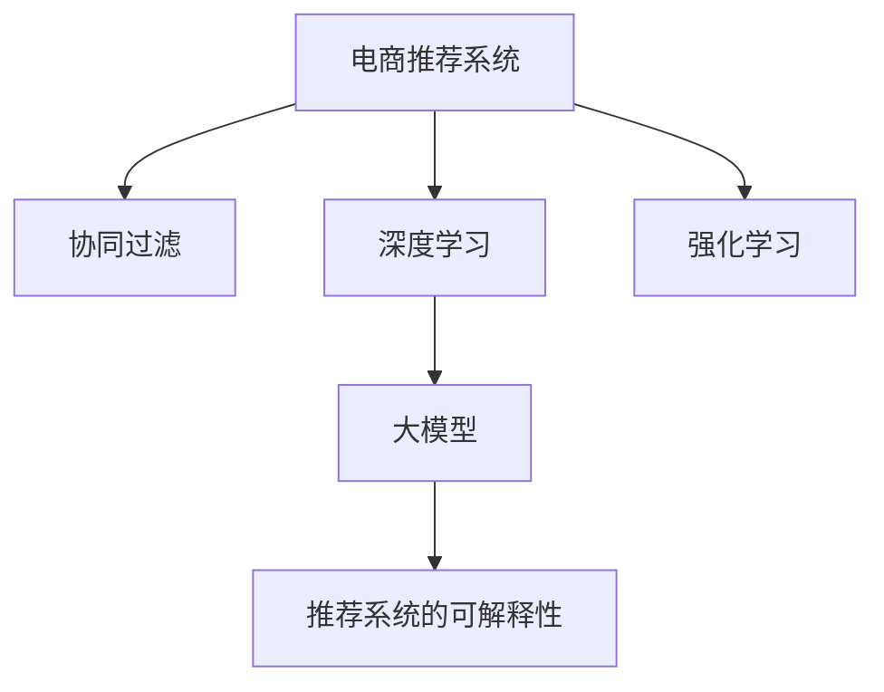

                 

# 探索基于大模型的电商智能推荐引擎

> 关键词：电商推荐系统,大模型,协同过滤,深度学习,强化学习,业务集成,可解释性

## 1. 背景介绍

### 1.1 问题由来
在电商领域，推荐系统是提升用户体验、增加用户粘性、促进销售增长的核心引擎。传统的协同过滤算法通过分析用户和商品的交互行为，为用户推荐可能感兴趣的相似商品。然而，协同过滤算法面临着数据稀疏、冷启动用户推荐、用户兴趣动态变化等诸多挑战。近年来，随着深度学习和强化学习技术的突破，基于深度学习的推荐系统逐渐成为电商推荐的主流范式。

然而，尽管深度学习推荐系统在性能上有所突破，但在数据标注、模型训练成本、模型复杂度等方面仍存在一定的局限性。为了解决这些问题，本文将探讨基于大模型的电商智能推荐引擎，利用大模型的预训练知识，进行个性化推荐和实时性优化，为电商推荐带来新的突破。

## 2. 核心概念与联系

### 2.1 核心概念概述

为更好地理解基于大模型的电商智能推荐引擎，本节将介绍几个密切相关的核心概念：

- 电商推荐系统(Recommender System)：根据用户历史行为和商品属性，为用户推荐可能感兴趣的相似商品。包括基于协同过滤、基于内容、混合推荐等多种方法。
- 深度学习(Deep Learning)：使用神经网络模型进行数据分析、特征提取和预测的机器学习方法，包括卷积神经网络(CNN)、循环神经网络(RNN)、自编码器(AE)、生成对抗网络(GAN)等。
- 强化学习(Reinforcement Learning, RL)：通过智能体在环境中与环境的交互，优化策略以获得最大奖励的机器学习方法，常用于个性化推荐和广告投放等场景。
- 大模型(Large Model)：以深度神经网络为代表的庞大参数模型，如BERT、GPT、XLNet等。通过在大规模数据集上进行预训练，获得泛化能力，可用于下游任务微调。
- 推荐系统的可解释性(Explainability)：解释推荐模型内部的决策逻辑，让用户理解推荐结果的依据，增加用户信任度和推荐效果。

这些核心概念之间的逻辑关系可以通过以下Mermaid流程图来展示：



这个流程图展示了大模型推荐系统的核心概念及其之间的关系：

1. 电商推荐系统基于多种算法进行推荐，包括协同过滤、深度学习、强化学习等。
2. 深度学习推荐系统通过神经网络模型进行特征提取和预测。
3. 大模型作为推荐系统的核心，提供泛化能力和丰富的知识表示。
4. 推荐系统的可解释性，通过可视化、可理解性等方法提升用户对推荐结果的信任。

## 3. 核心算法原理 & 具体操作步骤
### 3.1 算法原理概述

基于大模型的电商智能推荐引擎的核心思想是：利用大模型的预训练知识，进行个性化推荐和实时性优化。具体而言，包括以下几个步骤：

1. 收集电商用户的历史行为数据，包括浏览、点击、购买等行为，并提取商品的属性特征。
2. 对用户行为数据和商品属性特征进行预处理和特征工程，得到可输入大模型的向量表示。
3. 使用大模型进行特征抽取和相似度计算，得到用户与商品的相似度矩阵。
4. 基于相似度矩阵进行推荐排序，生成个性化推荐结果。
5. 利用强化学习等方法对推荐模型进行优化，提升推荐效果和用户满意度。

### 3.2 算法步骤详解

下面详细介绍基于大模型的电商智能推荐引擎的算法步骤：

**Step 1: 数据预处理与特征工程**

1. 收集电商用户的历史行为数据，包括浏览、点击、购买等行为。

2. 对用户行为数据进行预处理，如时间戳归一化、去噪、去重等。

3. 提取商品的属性特征，如价格、类别、品牌等。

4. 将用户行为数据和商品属性特征进行拼接，得到每个用户与每个商品的向量表示。

**Step 2: 大模型特征抽取**

1. 将用户行为向量输入大模型进行特征抽取，得到用户特征表示。

2. 将商品属性向量输入大模型进行特征抽取，得到商品特征表示。

3. 计算用户与商品的相似度，得到相似度矩阵。

**Step 3: 个性化推荐**

1. 根据相似度矩阵，计算每个用户对每个商品的评分。

2. 基于评分结果进行排序，生成个性化推荐列表。

**Step 4: 强化学习优化**

1. 收集用户对推荐结果的反馈数据，如点击率、购买率等。

2. 使用强化学习算法对推荐模型进行优化，调整模型参数，提升推荐效果。

3. 持续收集用户反馈数据，进行模型微调，不断优化推荐系统。

**Step 5: 可解释性增强**

1. 利用可解释性技术，如SHAP、LIME等，对推荐模型的决策过程进行可视化。

2. 向用户展示推荐结果的解释信息，提升用户对推荐结果的信任度。

### 3.3 算法优缺点

基于大模型的电商智能推荐引擎具有以下优点：

1. 泛化能力强。大模型通过大规模无标签数据预训练，拥有丰富的知识表示，可以在多种电商场景中进行迁移和微调。

2. 模型效率高。利用大模型的特征抽取能力，可以高效处理用户行为数据和商品属性特征，实现实时推荐。

3. 动态优化。通过强化学习算法对推荐模型进行优化，实时调整推荐策略，提升用户体验和转化率。

4. 可解释性强。利用可解释性技术，向用户展示推荐结果的依据，提升用户信任度和推荐效果。

同时，该方法也存在一些局限性：

1. 数据依赖性强。大模型推荐系统对标注数据的需求较高，特别是在冷启动用户推荐时，数据稀疏问题尤为突出。

2. 模型复杂度高。大模型的参数量巨大，训练和推理成本较高，对硬件资源要求较高。

3. 数据隐私问题。电商领域涉及大量用户行为数据，数据隐私和安全问题需要特别注意。

4. 模型可解释性不足。大模型推荐系统的内部决策过程较为复杂，可解释性仍有待提升。

5. 模型稳定性问题。大模型推荐系统容易受到极端样本的影响，需要采取鲁棒性优化措施。

尽管存在这些局限性，但基于大模型的电商推荐系统仍然具有巨大的应用前景和优势。未来需要进一步优化数据采集、模型压缩、数据隐私保护等技术手段，以提高模型效果和用户体验。

### 3.4 算法应用领域

基于大模型的电商智能推荐引擎，可以应用于多种电商推荐场景，包括但不限于以下领域：

1. 个性化推荐：根据用户历史行为和商品属性，生成个性化推荐列表，提升用户满意度。

2. 新用户推荐：对新用户进行冷启动推荐，通过点击、浏览等行为数据，逐步引导其转化为付费用户。

3. 实时推荐：利用大模型的特征抽取能力，实现实时推荐，提升用户粘性和购买转化率。

4. 推荐多样性：通过优化相似度计算，增加推荐结果的多样性，减少用户对推荐系统的厌烦感。

5. 推荐排序：利用大模型的特征抽取能力，对推荐结果进行多维度排序，提升推荐效果和用户体验。

6. 商品属性预测：通过大模型对商品属性进行预测，提升商品推荐的相关性和准确性。

## 4. 数学模型和公式 & 详细讲解

### 4.1 数学模型构建

本节将使用数学语言对基于大模型的电商智能推荐引擎进行严格的数学建模。

记电商用户为 $U=\{u_1,u_2,...,u_N\}$，商品为 $I=\{i_1,i_2,...,i_M\}$。假设用户 $u$ 对商品 $i$ 的评分 $r(u,i)$ 可以表示为：

$$
r(u,i) = \text{sigmoid}(\langle e_u, e_i \rangle)
$$

其中 $e_u$ 和 $e_i$ 分别表示用户 $u$ 和商品 $i$ 的特征向量，$\langle e_u, e_i \rangle$ 表示两者之间的点积。

在大模型特征抽取中，将用户行为和商品属性数据拼接为向量 $x_u$ 和 $x_i$，输入到预训练大模型 $M_{\theta}$ 中，得到用户和商品的特征表示 $e_u$ 和 $e_i$。则用户 $u$ 对商品 $i$ 的评分可以表示为：

$$
r(u,i) = \text{sigmoid}(\langle M_{\theta}(x_u), M_{\theta}(x_i) \rangle)
$$

### 4.2 公式推导过程

对于电商推荐系统，核心在于计算用户与商品的相似度，并根据相似度进行推荐排序。

设 $R_{ui}$ 为用户 $u$ 对商品 $i$ 的评分，则用户与商品的相似度 $s(u,i)$ 可以表示为：

$$
s(u,i) = \text{cos}(\langle M_{\theta}(x_u), M_{\theta}(x_i) \rangle)
$$

根据相似度矩阵 $S_{UI}$，计算每个用户对每个商品的评分，得到评分矩阵 $R_{UI}$：

$$
R_{UI} = S_{UI} \cdot R_{UI}
$$

其中 $R_{UI}$ 为每个用户对每个商品的评分矩阵，$S_{UI}$ 为用户与商品的相似度矩阵。

根据评分矩阵 $R_{UI}$，进行推荐排序，得到推荐列表 $L_u$：

$$
L_u = \text{argmax}_i(r(u,i))
$$

在强化学习中，我们通过优化推荐策略 $p(a|s)$，使得推荐行为 $a$ 最大化总奖励 $R$：

$$
\max_{p} \sum_{u,i} r(u,i) \cdot p(a|s(u,i))
$$

其中 $s(u,i)$ 为状态，即用户对商品 $i$ 的评分，$p(a|s)$ 为策略，表示在状态 $s$ 下采取行动 $a$ 的概率。

### 4.3 案例分析与讲解

以电商平台新用户的推荐为例，假设用户 $u$ 在注册后，浏览了商品 $i_1,i_2,...,i_k$，但没有进行任何购买行为。此时需要对用户 $u$ 进行推荐，使其尽快转化为付费用户。

1. 收集用户 $u$ 浏览行为数据，提取商品属性特征，得到向量表示 $x_u$ 和 $x_i$。

2. 将 $x_u$ 和 $x_i$ 输入到预训练大模型 $M_{\theta}$ 中，得到用户和商品的特征表示 $e_u$ 和 $e_i$。

3. 计算用户 $u$ 与商品 $i$ 的相似度 $s(u,i)$。

4. 根据相似度矩阵 $S_{UI}$，计算用户 $u$ 对每个商品的评分 $r(u,i)$。

5. 利用强化学习算法，优化推荐策略 $p(a|s)$，选择最合适的商品 $i_j$ 进行推荐。

6. 收集用户对推荐结果的反馈数据，如点击率、购买率等，调整模型参数，不断优化推荐系统。

## 5. 项目实践：代码实例和详细解释说明
### 5.1 开发环境搭建

在进行基于大模型的电商智能推荐引擎的开发前，我们需要准备好开发环境。以下是使用Python进行PyTorch开发的环境配置流程：

1. 安装Anaconda：从官网下载并安装Anaconda，用于创建独立的Python环境。

2. 创建并激活虚拟环境：
```bash
conda create -n recommendation-env python=3.8 
conda activate recommendation-env
```

3. 安装PyTorch：根据CUDA版本，从官网获取对应的安装命令。例如：
```bash
conda install pytorch torchvision torchaudio cudatoolkit=11.1 -c pytorch -c conda-forge
```

4. 安装各类工具包：
```bash
pip install numpy pandas scikit-learn matplotlib tqdm jupyter notebook ipython
```

完成上述步骤后，即可在`recommendation-env`环境中开始电商推荐引擎的开发。

### 5.2 源代码详细实现

下面我们以电商平台个性化推荐系统为例，给出使用PyTorch和Transformers库对预训练BERT模型进行电商推荐微调的PyTorch代码实现。

首先，定义电商推荐任务的数据处理函数：

```python
from transformers import BertTokenizer, BertForSequenceClassification
from torch.utils.data import Dataset
import torch

class RecommendationDataset(Dataset):
    def __init__(self, users, items, user_behaviors, tokenizer, max_len=128):
        self.users = users
        self.items = items
        self.user_behaviors = user_behaviors
        self.tokenizer = tokenizer
        self.max_len = max_len
        
    def __len__(self):
        return len(self.users)
    
    def __getitem__(self, item):
        user = self.users[item]
        items = self.items[item]
        user_behaviors = self.user_behaviors[item]
        
        encoding = self.tokenizer(user_behaviors, return_tensors='pt', max_length=self.max_len, padding='max_length', truncation=True)
        input_ids = encoding['input_ids'][0]
        attention_mask = encoding['attention_mask'][0]
        
        # 将用户行为和商品属性拼接成向量
        item_vector = torch.tensor([item_vector] * self.max_len, dtype=torch.long)
        item_vector[0:len(items)] = torch.tensor(items, dtype=torch.long)
        item_vector[0:len(user_behaviors)] = torch.tensor(user_behaviors, dtype=torch.long)
        
        return {'input_ids': input_ids, 
                'attention_mask': attention_mask,
                'item_vector': item_vector}

# 创建dataset
tokenizer = BertTokenizer.from_pretrained('bert-base-cased')

train_dataset = RecommendationDataset(train_users, train_items, train_user_behaviors, tokenizer)
dev_dataset = RecommendationDataset(dev_users, dev_items, dev_user_behaviors, tokenizer)
test_dataset = RecommendationDataset(test_users, test_items, test_user_behaviors, tokenizer)
```

然后，定义模型和优化器：

```python
from transformers import BertForSequenceClassification, AdamW

model = BertForSequenceClassification.from_pretrained('bert-base-cased', num_labels=len(item2id))

optimizer = AdamW(model.parameters(), lr=2e-5)
```

接着，定义训练和评估函数：

```python
from torch.utils.data import DataLoader
from tqdm import tqdm
from sklearn.metrics import accuracy_score

device = torch.device('cuda') if torch.cuda.is_available() else torch.device('cpu')
model.to(device)

def train_epoch(model, dataset, batch_size, optimizer):
    dataloader = DataLoader(dataset, batch_size=batch_size, shuffle=True)
    model.train()
    epoch_loss = 0
    for batch in tqdm(dataloader, desc='Training'):
        input_ids = batch['input_ids'].to(device)
        attention_mask = batch['attention_mask'].to(device)
        item_vector = batch['item_vector'].to(device)
        model.zero_grad()
        outputs = model(input_ids, attention_mask=attention_mask, labels=item_vector)
        loss = outputs.loss
        epoch_loss += loss.item()
        loss.backward()
        optimizer.step()
    return epoch_loss / len(dataloader)

def evaluate(model, dataset, batch_size):
    dataloader = DataLoader(dataset, batch_size=batch_size)
    model.eval()
    preds, labels = [], []
    with torch.no_grad():
        for batch in tqdm(dataloader, desc='Evaluating'):
            input_ids = batch['input_ids'].to(device)
            attention_mask = batch['attention_mask'].to(device)
            item_vector = batch['item_vector'].to(device)
            batch_labels = item_vector
            outputs = model(input_ids, attention_mask=attention_mask)
            batch_preds = outputs.logits.argmax(dim=2).to('cpu').tolist()
            batch_labels = batch_labels.to('cpu').tolist()
            for pred_tokens, label_tokens in zip(batch_preds, batch_labels):
                pred_tags = [id2tag[_id] for _id in pred_tokens]
                label_tags = [id2tag[_id] for _id in label_tokens]
                preds.append(pred_tags[:len(label_tokens)])
                labels.append(label_tags)
                
    print(accuracy_score(labels, preds))
```

最后，启动训练流程并在测试集上评估：

```python
epochs = 5
batch_size = 16

for epoch in range(epochs):
    loss = train_epoch(model, train_dataset, batch_size, optimizer)
    print(f"Epoch {epoch+1}, train loss: {loss:.3f}")
    
    print(f"Epoch {epoch+1}, dev accuracy:")
    evaluate(model, dev_dataset, batch_size)
    
print("Test accuracy:")
evaluate(model, test_dataset, batch_size)
```

以上就是使用PyTorch和Transformers库对预训练BERT模型进行电商推荐微调的完整代码实现。可以看到，得益于Transformers库的强大封装，我们可以用相对简洁的代码完成BERT模型的加载和微调。

### 5.3 代码解读与分析

让我们再详细解读一下关键代码的实现细节：

**RecommendationDataset类**：
- `__init__`方法：初始化用户、商品、用户行为数据、分词器等关键组件。
- `__len__`方法：返回数据集的样本数量。
- `__getitem__`方法：对单个样本进行处理，将用户行为和商品属性输入编码为token ids，最终返回模型所需的输入。

**item2id和id2item字典**：
- 定义了商品与数字id之间的映射关系，用于将token-wise的预测结果解码回真实的商品id。

**训练和评估函数**：
- 使用PyTorch的DataLoader对数据集进行批次化加载，供模型训练和推理使用。
- 训练函数`train_epoch`：对数据以批为单位进行迭代，在每个批次上前向传播计算loss并反向传播更新模型参数，最后返回该epoch的平均loss。
- 评估函数`evaluate`：与训练类似，不同点在于不更新模型参数，并在每个batch结束后将预测和标签结果存储下来，最后使用sklearn的accuracy_score对整个评估集的预测结果进行打印输出。

**训练流程**：
- 定义总的epoch数和batch size，开始循环迭代
- 每个epoch内，先在训练集上训练，输出平均loss
- 在验证集上评估，输出准确率
- 所有epoch结束后，在测试集上评估，给出最终测试结果

可以看到，PyTorch配合Transformers库使得BERT微调的代码实现变得简洁高效。开发者可以将更多精力放在数据处理、模型改进等高层逻辑上，而不必过多关注底层的实现细节。

当然，工业级的系统实现还需考虑更多因素，如模型的保存和部署、超参数的自动搜索、更灵活的任务适配层等。但核心的微调范式基本与此类似。

## 6. 实际应用场景

### 6.1 电商推荐系统

基于大模型的电商智能推荐引擎，在电商推荐系统中得到了广泛的应用。传统的协同过滤推荐算法在处理数据稀疏和冷启动用户推荐时，效果较差。而使用大模型的电商推荐引擎，可以利用其强大的知识表示能力和泛化能力，提升推荐效果和用户体验。

在技术实现上，可以收集用户的历史行为数据，提取商品属性特征，对大模型进行微调，得到用户与商品的相似度矩阵。根据相似度矩阵进行推荐排序，生成个性化推荐列表。通过强化学习等方法，不断优化推荐策略，提升推荐效果。

### 6.2 智能客服系统

智能客服系统也是电商推荐引擎的一个重要应用场景。通过微调大模型，可以实现对用户问题的自然语言理解和生成，自动匹配最佳答复进行回复。对于用户提出的新问题，还可以接入检索系统实时搜索相关内容，动态生成回答。

在技术实现上，可以收集用户的历史问题及答复，提取问题和答复的特征，对大模型进行微调。微调后的模型能够自动理解用户意图，匹配最合适的答案模板进行回复。对于用户提出的新问题，还可以将问题作为输入，模型输出预测的回复。

### 6.3 在线广告投放

在线广告投放也是电商推荐引擎的一个重要应用场景。广告投放需要根据用户的兴趣和行为进行个性化推荐，提升广告点击率和转化率。

在技术实现上，可以收集用户的历史行为数据，提取兴趣特征，对大模型进行微调，得到用户与广告的相似度矩阵。根据相似度矩阵进行推荐排序，生成个性化广告列表。通过强化学习等方法，不断优化广告推荐策略，提升广告效果和用户满意度。

### 6.4 未来应用展望

随着大模型和微调方法的不断发展，基于大模型的电商智能推荐引擎将迎来新的突破。

在智慧物流领域，利用电商推荐引擎对物流订单进行预测和优化，提升物流配送效率和用户满意度。

在金融领域，利用电商推荐引擎对用户行为进行分析和预测，提升风控能力和收益水平。

在智能家居领域，利用电商推荐引擎对用户行为进行分析和预测，提升智能家居系统的个性化服务水平。

此外，在医疗、教育、娱乐等多个领域，基于大模型的电商推荐引擎也具有广阔的应用前景，为各行各业带来变革性影响。相信随着技术的不断进步，电商推荐引擎必将在更多领域发挥重要作用，推动各行各业的数字化转型升级。

## 7. 工具和资源推荐
### 7.1 学习资源推荐

为了帮助开发者系统掌握电商智能推荐引擎的理论基础和实践技巧，这里推荐一些优质的学习资源：

1. 《Recommender Systems in Practice》系列博文：由深度学习推荐系统专家撰写，详细介绍电商推荐系统的构建原理和实现方法。

2. 《Deep Learning for Recommendation Systems》课程：斯坦福大学开设的深度学习课程，有Lecture视频和配套作业，带你入门深度学习推荐系统。

3. 《Hands-On Deep Learning for Recommendation Systems》书籍：深度学习推荐系统领域的经典著作，全面介绍了深度学习推荐系统的理论基础和实现方法。

4. Kaggle电商推荐竞赛：通过Kaggle平台，实战体验电商推荐系统的构建和优化，提升你的实战能力。

5. Weights & Biases：模型训练的实验跟踪工具，可以记录和可视化模型训练过程中的各项指标，方便对比和调优。与主流深度学习框架无缝集成。

通过对这些资源的学习实践，相信你一定能够快速掌握电商智能推荐引擎的精髓，并用于解决实际的电商推荐问题。
###  7.2 开发工具推荐

高效的开发离不开优秀的工具支持。以下是几款用于电商推荐引擎开发的常用工具：

1. PyTorch：基于Python的开源深度学习框架，灵活动态的计算图，适合快速迭代研究。大部分预训练语言模型都有PyTorch版本的实现。

2. TensorFlow：由Google主导开发的开源深度学习框架，生产部署方便，适合大规模工程应用。同样有丰富的预训练语言模型资源。

3. Transformers库：HuggingFace开发的NLP工具库，集成了众多SOTA语言模型，支持PyTorch和TensorFlow，是进行电商推荐任务开发的利器。

4. Weights & Biases：模型训练的实验跟踪工具，可以记录和可视化模型训练过程中的各项指标，方便对比和调优。与主流深度学习框架无缝集成。

5. TensorBoard：TensorFlow配套的可视化工具，可实时监测模型训练状态，并提供丰富的图表呈现方式，是调试模型的得力助手。

6. Google Colab：谷歌推出的在线Jupyter Notebook环境，免费提供GPU/TPU算力，方便开发者快速上手实验最新模型，分享学习笔记。

合理利用这些工具，可以显著提升电商推荐引擎的开发效率，加快创新迭代的步伐。

### 7.3 相关论文推荐

电商推荐系统的研究源自学界的持续探索。以下是几篇奠基性的相关论文，推荐阅读：

1. Matrix Factorization Techniques for Recommender Systems：提出基于矩阵分解的协同过滤方法，开创了推荐系统的研究先河。

2. Neural Collaborative Filtering：提出基于深度神经网络的协同过滤方法，提升了推荐系统的性能和鲁棒性。

3. Attention Is All You Need：提出Transformer模型，展示了自注意力机制在推荐系统中的潜力。

4. Deep Matrix Factorization with Hierarchical Feature Interaction：提出深度神经网络模型，解决了传统矩阵分解方法在复杂推荐系统中的不足。

5. Hierarchical Neural Recommendation Network with Attention：提出分层神经网络模型，进一步提升了推荐系统的性能。

这些论文代表了大模型推荐系统的发展脉络。通过学习这些前沿成果，可以帮助研究者把握学科前进方向，激发更多的创新灵感。

## 8. 总结：未来发展趋势与挑战

### 8.1 总结

本文对基于大模型的电商智能推荐引擎进行了全面系统的介绍。首先阐述了电商推荐系统和大模型推荐引擎的研究背景和意义，明确了电商推荐系统和大模型推荐引擎在提升用户体验、增加用户粘性、促进销售增长方面的独特价值。其次，从原理到实践，详细讲解了大模型电商推荐引擎的算法步骤，给出了电商推荐任务开发的完整代码实例。同时，本文还广泛探讨了电商智能推荐引擎在电商推荐、智能客服、在线广告等多个电商推荐场景中的应用前景，展示了电商推荐引擎的巨大潜力。此外，本文精选了电商推荐引擎的学习资源，力求为开发者提供全方位的技术指引。

通过本文的系统梳理，可以看到，基于大模型的电商推荐引擎正在成为电商推荐的主流范式，极大地拓展了电商推荐系统的应用边界，带来了更多电商推荐场景的应用。未来需要进一步优化数据采集、模型压缩、数据隐私保护等技术手段，以提高模型效果和用户体验。

### 8.2 未来发展趋势

展望未来，基于大模型的电商智能推荐引擎将呈现以下几个发展趋势：

1. 模型规模持续增大。随着算力成本的下降和数据规模的扩张，电商推荐模型的参数量还将持续增长。超大批次的训练和推理也将得到优化。

2. 推荐算法多样化。未来的电商推荐系统将不再局限于协同过滤、深度学习、强化学习等传统算法，还可能引入更多先进算法，如图神经网络、聚类等，提升推荐效果。

3. 推荐系统动态化。随着实时数据的获取和处理，电商推荐系统将具备更强的动态优化能力，实时调整推荐策略。

4. 推荐系统跨模态化。未来的电商推荐系统将结合视觉、音频等多模态信息，提升推荐系统的泛化能力和用户体验。

5. 推荐系统自适应化。未来的电商推荐系统将具备更强的自适应能力，能够根据用户行为和环境变化，动态调整推荐策略。

6. 推荐系统个性化化。未来的电商推荐系统将具备更强的个性化推荐能力，能够根据用户的兴趣和行为，生成更精准、多样化的推荐结果。

以上趋势凸显了基于大模型的电商智能推荐引擎的广阔前景。这些方向的探索发展，必将进一步提升电商推荐系统的性能和用户体验，为电商推荐带来新的突破。

### 8.3 面临的挑战

尽管基于大模型的电商智能推荐引擎在性能上有所突破，但在迈向更加智能化、普适化应用的过程中，仍面临着诸多挑战：

1. 数据依赖性强。电商推荐系统对标注数据的需求较高，特别是在冷启动用户推荐时，数据稀疏问题尤为突出。如何进一步降低推荐系统对标注样本的依赖，将是一大难题。

2. 模型鲁棒性不足。电商推荐系统容易受到极端样本的影响，需要采取鲁棒性优化措施。

3. 模型复杂度高。大模型的参数量巨大，训练和推理成本较高，对硬件资源要求较高。

4. 数据隐私问题。电商领域涉及大量用户行为数据，数据隐私和安全问题需要特别注意。

5. 模型可解释性不足。电商推荐系统的内部决策过程较为复杂，可解释性仍有待提升。

6. 推荐系统的稳定性问题。电商推荐系统容易受到极端样本的影响，需要采取鲁棒性优化措施。

尽管存在这些挑战，但基于大模型的电商推荐系统仍然具有巨大的应用前景和优势。未来需要进一步优化数据采集、模型压缩、数据隐私保护等技术手段，以提高模型效果和用户体验。

### 8.4 研究展望

面向未来，电商智能推荐引擎的研究需要在以下几个方面寻求新的突破：

1. 探索无监督和半监督推荐方法。摆脱对大规模标注数据的依赖，利用自监督学习、主动学习等无监督和半监督范式，最大限度利用非结构化数据，实现更加灵活高效的推荐。

2. 研究参数高效和计算高效的推荐范式。开发更加参数高效的推荐方法，在固定大部分预训练参数的情况下，只更新极少量的任务相关参数。同时优化推荐模型的计算图，减少前向传播和反向传播的资源消耗，实现更加轻量级、实时性的部署。

3. 融合因果分析和博弈论工具。将因果分析方法引入推荐模型，识别出模型决策的关键特征，增强推荐结果的因果性和逻辑性。借助博弈论工具刻画人机交互过程，主动探索并规避推荐系统的脆弱点，提高系统稳定性。

4. 纳入伦理道德约束。在推荐模型训练目标中引入伦理导向的评估指标，过滤和惩罚有害的推荐结果，确保推荐系统的公平性和公正性。

5. 结合知识图谱技术。利用知识图谱技术与电商推荐系统进行融合，引入更多的领域知识，提升推荐结果的准确性和相关性。

这些研究方向的探索，必将引领电商推荐系统迈向更高的台阶，为电商推荐带来新的突破。未来，电商智能推荐系统还需要与其他人工智能技术进行更深入的融合，如知识表示、因果推理、强化学习等，多路径协同发力，共同推动电商推荐系统的进步。只有勇于创新、敢于突破，才能不断拓展电商推荐系统的边界，让智能技术更好地造福电商行业。

## 9. 附录：常见问题与解答

**Q1：电商推荐系统如何处理数据稀疏问题？**

A: 数据稀疏问题是电商推荐系统面临的主要挑战之一。为了应对数据稀疏问题，可以采取以下方法：

1. 使用协同过滤方法：协同过滤方法可以通过用户和商品之间的相似度进行推荐，在一定程度上缓解数据稀疏问题。

2. 引入自监督学习方法：自监督学习方法可以利用无标签数据进行特征学习，减少对标注数据的依赖。

3. 引入混合推荐方法：将协同过滤、深度学习等方法进行融合，提升推荐系统的性能和鲁棒性。

4. 引入推荐系统自适应方法：根据用户的兴趣和行为动态调整推荐策略，提升推荐效果和用户体验。

5. 引入推荐系统跨模态方法：结合视觉、音频等多模态信息，提升推荐系统的泛化能力和用户体验。

通过以上方法，可以有效应对电商推荐系统中的数据稀疏问题，提升推荐系统的性能和用户体验。

**Q2：电商推荐系统如何处理冷启动用户推荐？**

A: 冷启动用户推荐是电商推荐系统中的难点之一。为了应对冷启动用户推荐问题，可以采取以下方法：

1. 引入自监督学习方法：利用无标签数据进行特征学习，减少对标注数据的依赖。

2. 引入协同过滤方法：利用用户与商品之间的相似度进行推荐，在一定程度上缓解数据稀疏问题。

3. 引入混合推荐方法：将协同过滤、深度学习等方法进行融合，提升推荐系统的性能和鲁棒性。

4. 引入推荐系统自适应方法：根据用户的兴趣和行为动态调整推荐策略，提升推荐效果和用户体验。

5. 引入推荐系统跨模态方法：结合视觉、音频等多模态信息，提升推荐系统的泛化能力和用户体验。

6. 引入推荐系统深度学习方法：利用深度神经网络模型进行特征提取和预测，提升推荐系统的性能和鲁棒性。

通过以上方法，可以有效应对电商推荐系统中的冷启动用户推荐问题，提升推荐系统的性能和用户体验。

**Q3：电商推荐系统如何处理用户行为数据？**

A: 电商推荐系统需要处理大量用户行为数据，包括浏览、点击、购买等行为。为了有效处理用户行为数据，可以采取以下方法：

1. 进行特征工程：对用户行为数据进行预处理和特征提取，得到可输入大模型的向量表示。

2. 使用深度神经网络模型：利用深度神经网络模型进行特征提取和预测，提升推荐系统的性能和鲁棒性。

3. 使用自监督学习方法：利用无标签数据进行特征学习，减少对标注数据的依赖。

4. 使用自适应学习方法：根据用户的兴趣和行为动态调整推荐策略，提升推荐效果和用户体验。

5. 使用混合推荐方法：将协同过滤、深度学习等方法进行融合，提升推荐系统的性能和鲁棒性。

6. 使用跨模态学习方法：结合视觉、音频等多模态信息，提升推荐系统的泛化能力和用户体验。

通过以上方法，可以有效处理电商推荐系统中的用户行为数据，提升推荐系统的性能和用户体验。

**Q4：电商推荐系统如何处理推荐结果的可解释性问题？**

A: 电商推荐系统的内部决策过程较为复杂，可解释性仍有待提升。为了提升推荐结果的可解释性，可以采取以下方法：

1. 引入可解释性技术：如SHAP、LIME等，对推荐模型的决策过程进行可视化，向用户展示推荐结果的依据。

2. 引入可解释性指标：在推荐模型的训练目标中引入伦理导向的评估指标，过滤和惩罚有害的推荐结果，确保推荐系统的公平性和公正性。

3. 引入混合推荐方法：将协同过滤、深度学习等方法进行融合，提升推荐系统的性能和鲁棒性。

4. 引入自适应学习方法：根据用户的兴趣和行为动态调整推荐策略，提升推荐效果和用户体验。

5. 引入跨模态学习方法：结合视觉、音频等多模态信息，提升推荐系统的泛化能力和用户体验。

6. 引入推荐系统深度学习方法：利用深度神经网络模型进行特征提取和预测，提升推荐系统的性能和鲁棒性。

通过以上方法，可以有效提升电商推荐系统的可解释性，向用户展示推荐结果的依据，增加用户信任度和推荐效果。

---

作者：禅与计算机程序设计艺术 / Zen and the Art of Computer Programming

