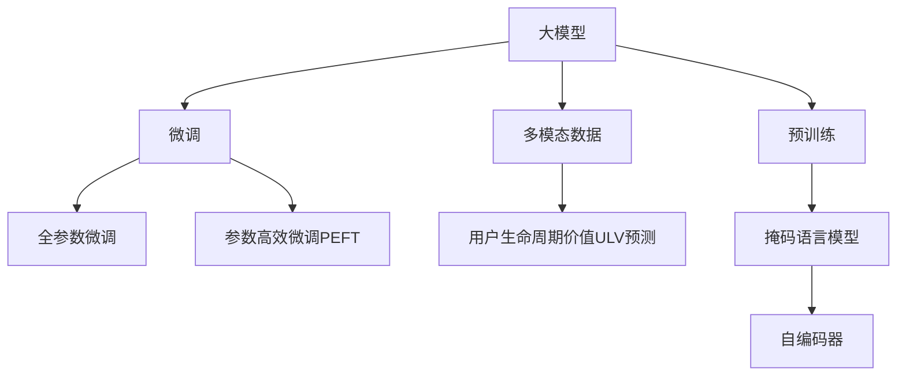

                 

# 探讨大模型在电商平台用户生命周期价值预测中的潜力

## 1. 背景介绍

### 1.1 问题由来
电商平台作为一个典型的网络交易平台，其用户生命周期价值(User Lifetime Value, ULV)预测是商家制定精准营销策略和用户画像分析的重要工具。通过准确预测用户未来的消费行为和购买潜力，商家可以设计更为个性化的营销方案，从而提升平台转化率，增加用户粘性，最终实现更高的收入。传统的ULV预测方法通常基于统计学方法，如回归模型、决策树等，但这些方法存在以下缺点：
1. 对数据量要求高：统计方法往往需要大量标注数据来训练模型，而标注数据的获取成本较高。
2. 泛化能力有限：统计模型基于历史数据进行训练，对于新用户和老用户之间的行为模式转换，往往难以很好地适应。
3. 无法处理非结构化数据：电商平台用户数据包含大量的文本、图像等多模态数据，传统的统计方法难以高效处理。

相比之下，深度学习方法如大模型，因其强大的特征提取和泛化能力，已经在NLP、计算机视觉等诸多领域取得了显著成果。在电商平台用户生命周期价值预测中，深度学习方法有望提供更为准确和高效的解决方案。

### 1.2 问题核心关键点
大模型在电商平台用户生命周期价值预测中的核心关键点在于：

1. 海量数据：电商平台拥有海量的用户行为数据，包括点击、浏览、购买记录、评论等，为大模型的训练提供了丰富的数据源。
2. 多模态数据：用户行为数据不仅包含文本信息，还有图像、视频等非结构化数据，大模型可以高效处理多模态信息。
3. 迁移学习能力：大模型在预训练阶段已经学习了通用的语言和视觉表示，能够在新任务上快速迁移。
4. 低标注成本：大模型通常能够在小样本情况下通过迁移学习快速适应特定任务，显著降低标注成本。
5. 预训练和微调：大模型可以通过预训练和微调两个步骤实现快速、高效的模型构建和优化，进一步提升预测性能。

## 2. 核心概念与联系

### 2.1 核心概念概述

为更好地理解大模型在电商平台用户生命周期价值预测中的应用，本节将介绍几个密切相关的核心概念：

- 大模型（Large Model）：通常指基于Transformer架构，拥有大量参数的深度学习模型，如BERT、GPT等。这些模型通过在大量无标签数据上进行预训练，学习到丰富的语言和视觉表示，具备强大的特征提取能力。
- 预训练（Pre-training）：指在大规模无标签数据上，通过自监督学习任务训练通用模型的过程。常见的预训练任务包括掩码语言模型、自编码器等。预训练使得模型学习到通用的特征表示。
- 迁移学习（Transfer Learning）：指将一个领域学习到的知识，迁移到另一个不同但相关的领域进行学习。大模型在预训练阶段学习到丰富的语言和视觉表示，能够在新任务上快速迁移。
- 微调（Fine-tuning）：指在预训练模型的基础上，使用下游任务的少量标注数据，通过有监督学习优化模型在特定任务上的性能。通常在顶层进行微调，以提高模型预测的准确性。
- 多模态数据（Multimodal Data）：指包含文本、图像、音频等多类型数据的数据集。电商平台用户数据往往包含多种类型的信息，大模型可以高效处理和融合多模态数据。
- 用户生命周期价值（User Lifetime Value, ULV）：指用户在电商平台上产生总价值的预期。通过预测ULV，商家可以制定更加精准的营销策略，提升用户留存和消费潜力。

这些核心概念之间的逻辑关系可以通过以下Mermaid流程图来展示：



这个流程图展示了大模型在电商平台用户生命周期价值预测中的核心概念及其之间的关系：

1. 大模型通过预训练获得基础能力。
2. 微调是对预训练模型进行任务特定的优化，可以快速适应新任务。
3. 多模态数据为预测提供全面的用户行为信息，有利于提升预测准确性。
4. 用户生命周期价值预测通过微调模型进行，旨在最大化预测精度。

## 3. 核心算法原理 & 具体操作步骤

### 3.1 算法原理概述

基于深度学习的大模型在电商平台用户生命周期价值预测中，通过预训练和微调两个步骤进行。其核心思想是：

1. **预训练**：在大规模无标签电商数据上，通过自监督学习任务（如掩码语言模型、自编码器等）训练大模型，学习通用的语言和视觉表示。
2. **微调**：在特定电商数据集上进行微调，通过有监督学习优化模型，使其能够准确预测用户生命周期价值。

具体步骤如下：

- 第一步：收集电商平台的标注数据集，包括用户的历史行为记录（点击、浏览、购买等）、用户画像、产品信息等。
- 第二步：选择合适的预训练大模型，如BERT、GPT等。
- 第三步：在大模型上添加特定的输出层和损失函数，如对于分类任务，添加线性分类器和交叉熵损失。
- 第四步：设置微调超参数，如学习率、批大小、迭代轮数等。
- 第五步：使用标注数据集对模型进行微调，更新模型参数以提高预测精度。
- 第六步：在测试集上评估微调后模型的性能，对比微调前后的精度提升。

### 3.2 算法步骤详解

**Step 1: 准备预训练模型和数据集**

- 收集电商平台的标注数据集，包括用户的历史行为记录、用户画像、产品信息等，划分为训练集、验证集和测试集。标注数据集需要覆盖多种用户行为类型，如点击、浏览、购买、评价等。
- 选择合适的预训练大模型，如BERT、GPT等。大模型通常具有较强的通用表示能力，能够高效处理多模态数据。
- 添加特定任务的输出层和损失函数。对于用户生命周期价值预测，通常使用分类任务，添加线性分类器和交叉熵损失。

**Step 2: 设置微调超参数**

- 选择合适的优化算法及其参数，如AdamW、SGD等，设置学习率、批大小、迭代轮数等。
- 设置正则化技术及强度，包括权重衰减、Dropout、Early Stopping等。
- 确定冻结预训练参数的策略，如仅微调顶层，或全部参数都参与微调。

**Step 3: 执行梯度训练**

- 将训练集数据分批次输入模型，前向传播计算损失函数。
- 反向传播计算参数梯度，根据设定的优化算法和学习率更新模型参数。
- 周期性在验证集上评估模型性能，根据性能指标决定是否触发 Early Stopping。
- 重复上述步骤直到满足预设的迭代轮数或 Early Stopping 条件。

**Step 4: 测试和部署**

- 在测试集上评估微调后模型的性能，对比微调前后的精度提升。
- 使用微调后的模型对新样本进行推理预测，集成到实际的应用系统中。
- 持续收集新的数据，定期重新微调模型，以适应数据分布的变化。

### 3.3 算法优缺点

基于深度学习的大模型在电商平台用户生命周期价值预测中，具有以下优点：

- **高效特征提取**：大模型通过预训练学习到通用的语言和视觉表示，能够高效提取多模态数据中的关键信息。
- **低标注成本**：通过迁移学习，大模型可以在少量标注数据上快速适应特定任务，显著降低标注成本。
- **泛化能力**：大模型具备较强的泛化能力，能够在新用户和老用户之间快速迁移，适应多种行为模式。
- **可解释性**：大模型的内部表示可被解释，能够理解其推理过程，有助于提升模型的可信度。

同时，该方法也存在以下缺点：

- **数据隐私问题**：电商平台用户数据涉及隐私，在数据采集和处理过程中需要遵守相关法律法规。
- **计算资源需求高**：大模型的训练和推理需要高性能的计算资源，可能对硬件设备提出较高要求。
- **模型复杂度高**：大模型的参数量较大，导致模型结构复杂，推理速度较慢。

## 4. 数学模型和公式 & 详细讲解 & 举例说明

### 4.1 数学模型构建

在大模型进行电商平台用户生命周期价值预测时，通常使用分类任务。假设模型 $M_{\theta}$ 的输出为概率分布 $p(y|x)$，其中 $x$ 为输入的用户行为数据，$y$ 为分类标签（如高价值用户、中价值用户、低价值用户等）。分类任务的损失函数通常为交叉熵损失：

$$
\mathcal{L}(\theta) = -\frac{1}{N}\sum_{i=1}^N \sum_{j=1}^K y_{ij}\log p(y_j|x_i)
$$

其中 $N$ 为训练样本数，$K$ 为分类类别数。

### 4.2 公式推导过程

以下我们以分类任务为例，推导交叉熵损失函数及其梯度的计算公式。

假设模型 $M_{\theta}$ 在输入 $x$ 上的输出为 $\hat{y}=M_{\theta}(x) \in [0,1]$，表示样本属于正类的概率。真实标签 $y \in \{0,1\}$。则二分类交叉熵损失函数定义为：

$$
\ell(M_{\theta}(x),y) = -[y\log \hat{y} + (1-y)\log (1-\hat{y})]
$$

将其代入经验风险公式，得：

$$
\mathcal{L}(\theta) = -\frac{1}{N}\sum_{i=1}^N [y_i\log M_{\theta}(x_i)+(1-y_i)\log(1-M_{\theta}(x_i))]
$$

根据链式法则，损失函数对参数 $\theta_k$ 的梯度为：

$$
\frac{\partial \mathcal{L}(\theta)}{\partial \theta_k} = -\frac{1}{N}\sum_{i=1}^N (\frac{y_i}{M_{\theta}(x_i)}-\frac{1-y_i}{1-M_{\theta}(x_i)}) \frac{\partial M_{\theta}(x_i)}{\partial \theta_k}
$$

其中 $\frac{\partial M_{\theta}(x_i)}{\partial \theta_k}$ 可进一步递归展开，利用自动微分技术完成计算。

### 4.3 案例分析与讲解

以下我们以电商平台用户生命周期价值预测为例，展示如何使用BERT模型进行微调。

假设电商平台标注数据集为 $D=\{(x_i,y_i)\}_{i=1}^N$，其中 $x_i$ 为用户行为数据，$y_i$ 为用户生命周期价值标签。

**Step 1: 准备数据**

- 收集电商平台用户的历史行为记录、用户画像、产品信息等，划分为训练集、验证集和测试集。
- 使用BERT分词器对用户行为数据进行分词处理，形成输入序列。
- 使用BERT的Position Embedding和Segment Embedding初始化模型。

**Step 2: 准备模型**

- 选择预训练的BERT模型，如BERT-base。
- 在模型顶部添加线性分类器，设置输出维度为2，对应高价值用户和中价值用户。
- 设置学习率、批大小、迭代轮数等超参数。

**Step 3: 微调模型**

- 使用训练集数据进行前向传播和损失计算。
- 反向传播计算梯度，更新模型参数。
- 周期性在验证集上评估模型性能，根据性能指标决定是否触发 Early Stopping。
- 重复上述步骤直到满足预设的迭代轮数或 Early Stopping 条件。

**Step 4: 测试和部署**

- 在测试集上评估微调后模型的性能，对比微调前后的精度提升。
- 使用微调后的模型对新样本进行推理预测，集成到实际的应用系统中。
- 持续收集新的数据，定期重新微调模型，以适应数据分布的变化。

## 5. 项目实践：代码实例和详细解释说明

### 5.1 开发环境搭建

在进行电商平台用户生命周期价值预测的微调实践前，我们需要准备好开发环境。以下是使用Python进行PyTorch开发的环境配置流程：

1. 安装Anaconda：从官网下载并安装Anaconda，用于创建独立的Python环境。

2. 创建并激活虚拟环境：
```bash
conda create -n pytorch-env python=3.8 
conda activate pytorch-env
```

3. 安装PyTorch：根据CUDA版本，从官网获取对应的安装命令。例如：
```bash
conda install pytorch torchvision torchaudio cudatoolkit=11.1 -c pytorch -c conda-forge
```

4. 安装Transformers库：
```bash
pip install transformers
```

5. 安装各类工具包：
```bash
pip install numpy pandas scikit-learn matplotlib tqdm jupyter notebook ipython
```

完成上述步骤后，即可在`pytorch-env`环境中开始微调实践。

### 5.2 源代码详细实现

下面我以电商平台用户生命周期价值预测为例，给出使用Transformers库对BERT模型进行微调的PyTorch代码实现。

首先，定义模型和损失函数：

```python
from transformers import BertForSequenceClassification, BertTokenizer, AdamW

model = BertForSequenceClassification.from_pretrained('bert-base-cased', num_labels=2)
tokenizer = BertTokenizer.from_pretrained('bert-base-cased')

# 自定义损失函数
class CrossEntropyLoss(nn.Module):
    def __init__(self):
        super(CrossEntropyLoss, self).__init__()
        
    def forward(self, outputs, labels):
        return F.cross_entropy(outputs, labels)

# 创建损失函数
loss_fn = CrossEntropyLoss()

# 设置优化器
optimizer = AdamW(model.parameters(), lr=2e-5)
```

然后，定义训练和评估函数：

```python
from torch.utils.data import DataLoader
from tqdm import tqdm
import torch

device = torch.device('cuda') if torch.cuda.is_available() else torch.device('cpu')
model.to(device)

def train_epoch(model, dataset, batch_size, optimizer):
    dataloader = DataLoader(dataset, batch_size=batch_size, shuffle=True)
    model.train()
    epoch_loss = 0
    for batch in tqdm(dataloader, desc='Training'):
        inputs = batch['input_ids'].to(device)
        attention_mask = batch['attention_mask'].to(device)
        labels = batch['labels'].to(device)
        model.zero_grad()
        outputs = model(inputs, attention_mask=attention_mask)
        loss = loss_fn(outputs, labels)
        epoch_loss += loss.item()
        loss.backward()
        optimizer.step()
    return epoch_loss / len(dataloader)

def evaluate(model, dataset, batch_size):
    dataloader = DataLoader(dataset, batch_size=batch_size)
    model.eval()
    preds, labels = [], []
    with torch.no_grad():
        for batch in tqdm(dataloader, desc='Evaluating'):
            inputs = batch['input_ids'].to(device)
            attention_mask = batch['attention_mask'].to(device)
            labels = batch['labels']
            outputs = model(inputs, attention_mask=attention_mask)
            batch_preds = outputs.argmax(dim=1).to('cpu').tolist()
            batch_labels = labels.to('cpu').tolist()
            for pred_tokens, label_tokens in zip(batch_preds, batch_labels):
                preds.append(pred_tokens)
                labels.append(label_tokens)
                
    print('Accuracy: {}'.format(np.mean(preds == labels)))
```

最后，启动训练流程并在测试集上评估：

```python
epochs = 5
batch_size = 16

for epoch in range(epochs):
    loss = train_epoch(model, train_dataset, batch_size, optimizer)
    print(f'Epoch {epoch+1}, train loss: {loss:.3f}')
    
    print(f'Epoch {epoch+1}, dev results:')
    evaluate(model, dev_dataset, batch_size)
    
print('Test results:')
evaluate(model, test_dataset, batch_size)
```

以上就是使用PyTorch对BERT进行电商平台用户生命周期价值预测的完整代码实现。可以看到，得益于Transformers库的强大封装，我们可以用相对简洁的代码完成BERT模型的加载和微调。

### 5.3 代码解读与分析

让我们再详细解读一下关键代码的实现细节：

**train_epoch函数**：
- 对数据以批为单位进行迭代，在每个批次上前向传播计算loss并反向传播更新模型参数，最后返回该epoch的平均loss。

**evaluate函数**：
- 与训练类似，不同点在于不更新模型参数，并在每个batch结束后将预测和标签结果存储下来，最后使用np.mean函数计算预测准确率。

**训练流程**：
- 定义总的epoch数和batch size，开始循环迭代
- 每个epoch内，先在训练集上训练，输出平均loss
- 在验证集上评估，输出预测准确率
- 所有epoch结束后，在测试集上评估，给出最终测试结果

可以看到，PyTorch配合Transformers库使得BERT微调的代码实现变得简洁高效。开发者可以将更多精力放在数据处理、模型改进等高层逻辑上，而不必过多关注底层的实现细节。

当然，工业级的系统实现还需考虑更多因素，如模型的保存和部署、超参数的自动搜索、更灵活的任务适配层等。但核心的微调范式基本与此类似。

## 6. 实际应用场景

### 6.1 智能推荐系统

电商平台用户生命周期价值预测的应用之一是智能推荐系统。通过预测用户的ULV，商家可以更好地了解用户的消费潜力和行为模式，从而设计更加精准的推荐策略。

具体而言，可以使用用户历史行为数据（如浏览记录、购买记录等）训练大模型，预测其未来购买行为。对于高价值用户，可以设计专属优惠，提升其购买意愿；对于中价值用户，则推送相关产品，促使其转化；对于低价值用户，则考虑通过促销活动进行挽留。如此构建的智能推荐系统，能大幅提升用户留存率和购买转化率，提升平台整体收入。

### 6.2 用户流失预测

电商平台用户流失预测是商家运营中的重要环节。通过预测用户的流失风险，商家可以及时采取措施，降低用户流失率，提高客户满意度和平台忠诚度。

大模型可以通过学习用户历史行为数据（如点击率、购买率、评论情绪等）预测其流失概率。对于流失风险较高的用户，商家可以提供个性化的挽留策略，如优惠活动、推荐产品等。对于流失风险较低的用户，则无需过多干预，避免不必要的资源浪费。

### 6.3 个性化定价策略

电商平台个性化定价策略是提升用户满意度和平台利润的重要手段。通过预测用户对不同价格区间的需求量，商家可以制定更加精准的价格策略。

大模型可以通过预测用户对不同价格区间的反应（如点击率、购买率等），帮助商家制定价格区间和促销方案。对于价格敏感型用户，可以设计低价促销活动；对于价格不敏感型用户，则可以考虑采用高价策略，提升整体平均订单价值。

### 6.4 未来应用展望

随着深度学习技术的发展，大模型在电商平台用户生命周期价值预测中的应用将越来越广泛。未来，以下方向值得关注：

1. 多模态数据融合：电商平台用户数据不仅包含文本信息，还有图像、视频等非结构化数据。融合多模态信息能够提供更全面的用户画像，提升预测精度。
2. 可解释性增强：大模型的内部表示可被解释，能够理解其推理过程。提升模型的可解释性有助于增加用户信任，促进系统应用。
3. 持续学习：电商平台用户行为模式不断变化，大模型需要持续学习新数据，保持预测模型的最新性。
4. 迁移学习：不同电商平台的业务模式和用户行为模式存在差异。通过迁移学习，大模型能够快速适应新平台，提升跨平台预测性能。

## 7. 工具和资源推荐

### 7.1 学习资源推荐

为了帮助开发者系统掌握大模型在电商平台用户生命周期价值预测中的应用，这里推荐一些优质的学习资源：

1. 《Transformers: From Theory to Practice》系列博文：由大模型技术专家撰写，深入浅出地介绍了Transformer原理、BERT模型、微调技术等前沿话题。

2. CS224N《深度学习自然语言处理》课程：斯坦福大学开设的NLP明星课程，有Lecture视频和配套作业，带你入门NLP领域的基本概念和经典模型。

3. 《Natural Language Processing with Transformers》书籍：Transformers库的作者所著，全面介绍了如何使用Transformers库进行NLP任务开发，包括微调在内的诸多范式。

4. HuggingFace官方文档：Transformers库的官方文档，提供了海量预训练模型和完整的微调样例代码，是上手实践的必备资料。

5. Kaggle平台：提供丰富的电商数据集和竞赛任务，让你在实战中提升大模型微调技能。

通过对这些资源的学习实践，相信你一定能够快速掌握大模型在电商平台用户生命周期价值预测中的应用，并用于解决实际的NLP问题。

### 7.2 开发工具推荐

高效的开发离不开优秀的工具支持。以下是几款用于大模型微调开发的常用工具：

1. PyTorch：基于Python的开源深度学习框架，灵活动态的计算图，适合快速迭代研究。大部分预训练语言模型都有PyTorch版本的实现。

2. TensorFlow：由Google主导开发的开源深度学习框架，生产部署方便，适合大规模工程应用。同样有丰富的预训练语言模型资源。

3. Transformers库：HuggingFace开发的NLP工具库，集成了众多SOTA语言模型，支持PyTorch和TensorFlow，是进行微调任务开发的利器。

4. Weights & Biases：模型训练的实验跟踪工具，可以记录和可视化模型训练过程中的各项指标，方便对比和调优。与主流深度学习框架无缝集成。

5. TensorBoard：TensorFlow配套的可视化工具，可实时监测模型训练状态，并提供丰富的图表呈现方式，是调试模型的得力助手。

6. Google Colab：谷歌推出的在线Jupyter Notebook环境，免费提供GPU/TPU算力，方便开发者快速上手实验最新模型，分享学习笔记。

合理利用这些工具，可以显著提升大模型微调任务的开发效率，加快创新迭代的步伐。

### 7.3 相关论文推荐

大模型在电商平台用户生命周期价值预测中的应用源于学界的持续研究。以下是几篇奠基性的相关论文，推荐阅读：

1. Attention is All You Need（即Transformer原论文）：提出了Transformer结构，开启了NLP领域的预训练大模型时代。

2. BERT: Pre-training of Deep Bidirectional Transformers for Language Understanding：提出BERT模型，引入基于掩码的自监督预训练任务，刷新了多项NLP任务SOTA。

3. Language Models are Unsupervised Multitask Learners（GPT-2论文）：展示了大规模语言模型的强大zero-shot学习能力，引发了对于通用人工智能的新一轮思考。

4. Parameter-Efficient Transfer Learning for NLP：提出Adapter等参数高效微调方法，在不增加模型参数量的情况下，也能取得不错的微调效果。

5. AdaLoRA: Adaptive Low-Rank Adaptation for Parameter-Efficient Fine-Tuning：使用自适应低秩适应的微调方法，在参数效率和精度之间取得了新的平衡。

这些论文代表了大模型在电商平台用户生命周期价值预测中的应用方向。通过学习这些前沿成果，可以帮助研究者把握学科前进方向，激发更多的创新灵感。

## 8. 总结：未来发展趋势与挑战

### 8.1 总结

本文对基于深度学习的大模型在电商平台用户生命周期价值预测中的应用进行了全面系统的介绍。首先阐述了电商平台的业务背景和需求，明确了大模型微调在该场景下的优势和应用方向。其次，从原理到实践，详细讲解了微调方法的数学模型、核心算法和具体操作步骤，给出了微调任务开发的完整代码实例。同时，本文还广泛探讨了微调方法在智能推荐、用户流失预测、个性化定价等多个电商场景中的应用，展示了微调技术的强大潜力。此外，本文精选了微调技术的各类学习资源，力求为读者提供全方位的技术指引。

通过本文的系统梳理，可以看到，基于大模型的微调方法在电商平台用户生命周期价值预测中具有重要的应用价值，能够帮助商家设计更加精准、高效的营销策略，提升平台收益。未来，随着大模型和微调技术的不断演进，相信电商平台的用户生命周期价值预测将变得更加智能、高效，为商家的经营决策提供更有力的数据支撑。

### 8.2 未来发展趋势

展望未来，大模型在电商平台用户生命周期价值预测中，将呈现以下几个发展趋势：

1. 模型规模持续增大。随着算力成本的下降和数据规模的扩张，大模型的参数量还将持续增长。超大规模语言模型蕴含的丰富语言知识，有望支撑更加复杂多变的预测任务。

2. 微调方法日趋多样。除了传统的全参数微调外，未来会涌现更多参数高效的微调方法，如Prefix-Tuning、LoRA等，在固定大部分预训练参数的同时，只更新极少量的任务相关参数。

3. 多模态融合能力增强。融合多模态信息能够提供更全面的用户画像，提升预测精度。电商平台用户数据不仅包含文本信息，还有图像、视频等非结构化数据，大模型需要提升对多模态数据的处理能力。

4. 持续学习成为常态。电商平台用户行为模式不断变化，大模型需要持续学习新数据，保持预测模型的最新性。

5. 迁移学习提升跨平台适应能力。不同电商平台的业务模式和用户行为模式存在差异。通过迁移学习，大模型能够快速适应新平台，提升跨平台预测性能。

6. 可解释性增强。大模型的内部表示可被解释，能够理解其推理过程。提升模型的可解释性有助于增加用户信任，促进系统应用。

7. 低标注成本。通过迁移学习和提示学习等技术，大模型可以在少量标注数据上快速适应特定任务，显著降低标注成本。

### 8.3 面临的挑战

尽管大模型在电商平台用户生命周期价值预测中取得了显著成效，但在迈向更加智能化、普适化应用的过程中，仍面临诸多挑战：

1. 数据隐私问题。电商平台用户数据涉及隐私，在数据采集和处理过程中需要遵守相关法律法规。

2. 计算资源需求高。大模型的训练和推理需要高性能的计算资源，可能对硬件设备提出较高要求。

3. 模型复杂度高。大模型的参数量较大，导致模型结构复杂，推理速度较慢。

4. 可解释性不足。大模型的内部表示复杂，难以解释其推理过程。对于电商平台的业务决策，可解释性尤为重要。

5. 持续学习面临新老数据融合问题。电商平台用户行为模式不断变化，大模型需要持续学习新数据，同时保持对老数据的记忆。

6. 跨平台预测性能。不同电商平台的业务模式和用户行为模式存在差异，大模型在跨平台迁移时需要重新微调，效率较低。

### 8.4 研究展望

面对大模型在电商平台用户生命周期价值预测中面临的挑战，未来的研究需要在以下几个方向寻求新的突破：

1. 开发高效的多模态融合方法。针对电商平台用户数据的特性，设计高效的多模态融合方法，提升预测精度。

2. 提升模型的可解释性。通过引入可解释性技术，如特征可视化、决策树等，提升大模型的可解释性，增加用户信任。

3. 研究参数高效的微调方法。开发更加参数高效的微调方法，在固定大部分预训练参数的同时，只更新极少量的任务相关参数。

4. 引入持续学习的算法。设计能够有效融合新老数据的持续学习算法，保持大模型的最新性。

5. 提升跨平台预测性能。通过迁移学习、微调等技术，提升大模型在跨平台预测中的适应能力。

6. 增强低标注成本的微调方法。探索无需大量标注数据的情况下，如何通过迁移学习和提示学习等技术，快速适应特定任务。

这些研究方向的探索，必将引领大模型在电商平台用户生命周期价值预测中的技术进步，提升电商平台的智能化水平，创造更多商业价值。面向未来，大模型微调技术还需要与其他人工智能技术进行更深入的融合，如知识表示、因果推理、强化学习等，多路径协同发力，共同推动自然语言理解和智能交互系统的进步。只有勇于创新、敢于突破，才能不断拓展大模型的边界，让智能技术更好地造福电商行业和用户。

## 9. 附录：常见问题与解答

**Q1：大模型在电商平台用户生命周期价值预测中是否适用于所有电商平台？**

A: 大模型在电商平台用户生命周期价值预测中具有较强的通用性，但不同电商平台的业务模式和用户行为模式存在差异。需要针对具体平台进行微调，才能取得最佳效果。

**Q2：大模型在电商平台用户生命周期价值预测中，是否需要引入外部知识库？**

A: 电商平台用户数据包含丰富的行为信息，大模型通常能够从中学习到有用的知识。但引入外部知识库可以进一步增强模型的泛化能力，如利用知识图谱进行实体关系抽取，提升预测准确性。

**Q3：大模型在电商平台用户生命周期价值预测中，是否需要频繁重新训练？**

A: 电商平台用户行为模式不断变化，大模型需要持续学习新数据，保持预测模型的最新性。但频繁重新训练成本较高，可以通过微调和定期更新策略来平衡。

**Q4：大模型在电商平台用户生命周期价值预测中，是否需要考虑数据隐私问题？**

A: 电商平台用户数据涉及隐私，在数据采集和处理过程中需要遵守相关法律法规，如GDPR等。确保数据安全和用户隐私是电商平台的责任和义务。

**Q5：大模型在电商平台用户生命周期价值预测中，是否需要考虑数据标注成本？**

A: 通过迁移学习和提示学习等技术，大模型可以在少量标注数据上快速适应特定任务，显著降低标注成本。但当任务数据量较小时，仍需考虑人工标注成本。

这些问题的回答，旨在帮助开发者更好地理解大模型在电商平台用户生命周期价值预测中的应用，以及如何克服其中存在的挑战。大模型的潜力巨大，但需要结合实际业务场景，不断优化和改进，才能充分发挥其在电商平台中的作用。

