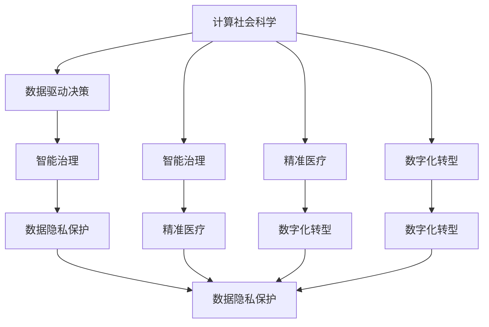

                 

# 推动社会进步的催化剂：人类计算的积极影响

> 关键词：计算社会科学, 数据驱动决策, 智能治理, 精准医疗, 数字化转型

## 1. 背景介绍

### 1.1 问题由来
随着信息技术的飞速发展，人类社会正在经历前所未有的数字化转型。计算社会科学（Computational Social Science, CSS）作为连接社会科学和计算机科学的桥梁，正在引发一场颠覆性变革。通过大规模数据采集、计算和分析，社会科学研究变得更加精确、高效、可解释。

计算社会科学的应用范围广泛，涵盖社会结构分析、群体行为研究、公共卫生预警、政治选举预测等多个领域。数据驱动的决策模式正在改变政府、企业和公众的决策方式，推动了智能治理和精准医疗的快速崛起。

### 1.2 问题核心关键点
计算社会科学的核心在于利用先进计算技术和数据科学方法，揭示社会现象背后的复杂规律。其核心问题包括：
1. 如何从海量社会数据中提取有效信息？
2. 如何构建可解释的社会计算模型？
3. 如何设计高效的计算社会科学系统？
4. 如何应对数据隐私和安全挑战？
5. 如何确保计算社会科学研究的伦理规范？

这些问题的解决，对于推动社会进步具有重要意义。

## 2. 核心概念与联系

### 2.1 核心概念概述

为更好地理解计算社会科学的应用，本节将介绍几个密切相关的核心概念：

- 计算社会科学(Computational Social Science, CSS)：利用计算技术和数据科学方法，对社会科学问题进行定量、可重复、可扩展的研究，揭示社会现象背后的规律。

- 数据驱动决策(Data-Driven Decision Making, D3M)：基于数据科学原理和技术，自动分析和辅助人类做出更科学、合理的决策。

- 智能治理(Smart Governance)：利用智能算法和大数据技术，提升政府决策和治理的科学性和精确性，优化公共资源配置。

- 精准医疗(Precision Medicine)：利用基因组数据、电子健康记录等个性化信息，对疾病进行精准诊断和治疗。

- 数字化转型(Digital Transformation)：通过信息技术手段，重构组织、流程和业务模式，提升效率和竞争力。

- 数据隐私保护(Data Privacy)：保护个人隐私信息免受不当使用，确保数据使用的合法性和安全性。

- 伦理规范(Ethical Standards)：在数据采集、处理和应用中遵循伦理准则，保护数据主体的权益，确保计算社会科学研究的公正性和透明性。

这些核心概念之间的逻辑关系可以通过以下Mermaid流程图来展示：



这个流程图展示了几大核心概念之间的逻辑联系：

1. 计算社会科学利用数据驱动决策，智能治理和精准医疗依赖于数据驱动决策，进而推动数字化转型。
2. 智能治理和精准医疗都与数据隐私保护紧密相关。
3. 数据驱动决策和数字化转型也需遵循伦理规范。

## 3. 核心算法原理 & 具体操作步骤
### 3.1 算法原理概述

计算社会科学的核心算法包括以下几个关键步骤：

1. **数据采集**：从各类传感器、社交媒体、公共数据库等渠道收集社会数据。
2. **数据预处理**：清洗、归一化、缺失值处理等数据预处理工作。
3. **特征提取**：从原始数据中提取有意义的特征。
4. **模型构建**：利用机器学习、深度学习等算法，构建社会计算模型。
5. **模型评估**：评估模型的性能和可靠性，优化模型参数。
6. **结果应用**：将模型应用到实际的社会决策和治理过程中，如公共卫生预警、选举预测等。

这些步骤通常依赖于复杂的软件和算法框架，需要专业的知识和技能才能有效执行。

### 3.2 算法步骤详解

以公共卫生预警系统为例，详细讲解计算社会科学的核心算法步骤：

1. **数据采集**：从医院、诊所、公共卫生部门等收集疫情数据，包括病例数、死亡率、地理位置等。同时利用社交媒体和新闻报道收集公众舆情数据。

2. **数据预处理**：清洗缺失值，去除异常值，将数据归一化到同一尺度。

3. **特征提取**：提取关键特征，如疫情爆发速度、人口密度、医疗资源分布等。

4. **模型构建**：利用时间序列分析、回归模型、深度学习模型等算法，构建预警模型。

5. **模型评估**：使用历史数据验证模型预测准确度，调整模型参数。

6. **结果应用**：将模型集成到公共卫生预警系统中，实时监测疫情动态，及时发布预警信息。

### 3.3 算法优缺点

计算社会科学具有以下优点：
1. 数据驱动：利用海量数据进行建模和预测，提升决策的科学性和准确性。
2. 高效计算：利用先进算法快速处理大规模数据，降低人力成本。
3. 可重复性：数据和模型可重复使用，提升研究结果的可验证性。
4. 可扩展性：算法和模型易于扩展，支持多种任务和场景。

同时，也存在一些局限性：
1. 数据隐私：大规模数据采集和使用可能侵犯隐私。
2. 模型解释性：复杂模型难以解释其内部逻辑。
3. 数据质量：数据噪声和异常值可能影响模型性能。
4. 伦理问题：数据使用和算法决策需遵循伦理规范。

尽管存在这些局限性，但计算社会科学在大数据时代的崛起已成定势，其应用前景广阔，必将深刻影响社会决策和发展。

### 3.4 算法应用领域

计算社会科学的应用范围非常广泛，涵盖以下几个主要领域：

1. **社会结构分析**：利用网络分析、社会网络模型等方法，揭示社会关系和网络结构，如社区互动、网络舆论等。
2. **群体行为研究**：研究群体在特定情境下的行为模式，如社会运动、市场行为等。
3. **公共卫生预警**：利用数据挖掘和大数据分析，预测和预警公共卫生事件，如疫情爆发、食物中毒等。
4. **政治选举预测**：利用社交媒体和新闻数据，预测选举结果和公众情绪，优化选举策略。
5. **经济预测**：利用宏观经济数据，构建经济模型，预测经济增长、失业率等指标。
6. **精准医疗**：利用基因组数据、电子健康记录等，对疾病进行精准诊断和治疗，提升医疗效果。

以上领域只是计算社会科学应用的冰山一角，未来随着技术的发展和应用的深入，将会有更多新的应用场景不断涌现。

## 4. 数学模型和公式 & 详细讲解 & 举例说明
### 4.1 数学模型构建

本节将使用数学语言对计算社会科学的主要算法进行详细描述。

假设社会数据集为 $D=\{(x_i,y_i)\}_{i=1}^N$，其中 $x_i$ 为特征向量，$y_i$ 为标签。假设社会计算模型的参数为 $\theta$，目标为最小化经验风险：

$$
\min_{\theta} \frac{1}{N} \sum_{i=1}^N \ell(M_{\theta}(x_i),y_i)
$$

其中 $\ell$ 为损失函数，$M_{\theta}$ 为模型函数。

### 4.2 公式推导过程

以线性回归为例，推导其最小二乘法公式。

假设线性回归模型为 $y_i = \beta_0 + \sum_{j=1}^p \beta_j x_{ij}$，其中 $\beta_0,\beta_j$ 为模型参数，$x_{ij}$ 为特征向量。则经验风险为：

$$
\mathcal{L}(\beta) = \frac{1}{N} \sum_{i=1}^N (y_i - \beta_0 - \sum_{j=1}^p \beta_j x_{ij})^2
$$

利用微积分知识，对上式求偏导并令其为0，得到模型参数估计公式：

$$
\beta = (\sum_{i=1}^N x_{i} x_{i}^T)^{-1} \sum_{i=1}^N x_{i} y_{i}
$$

将上述公式应用到实际的社会计算模型中，可以解决许多复杂的社会问题。

### 4.3 案例分析与讲解

以公共卫生预警系统为例，分析计算社会科学模型的应用效果。

1. **数据集准备**：收集医院、诊所等疫情数据和社交媒体舆情数据，清洗并预处理数据。

2. **特征提取**：提取关键特征，如疫情爆发速度、人口密度、医疗资源分布等。

3. **模型构建**：构建时间序列分析模型，利用历史疫情数据训练模型。

4. **模型评估**：使用历史疫情数据验证模型预测准确度，调整模型参数。

5. **结果应用**：将模型集成到公共卫生预警系统中，实时监测疫情动态，及时发布预警信息。

最终，模型在公共卫生预警系统中表现良好，实现了疫情的早期预测和快速应对，减少了公共健康风险。

## 5. 项目实践：代码实例和详细解释说明
### 5.1 开发环境搭建

在进行计算社会科学应用开发前，需要准备好开发环境。以下是使用Python进行Scikit-learn开发的环境配置流程：

1. 安装Anaconda：从官网下载并安装Anaconda，用于创建独立的Python环境。

2. 创建并激活虚拟环境：
```bash
conda create -n scikit-learn-env python=3.8 
conda activate scikit-learn-env
```

3. 安装Scikit-learn：
```bash
pip install -U scikit-learn
```

4. 安装各类工具包：
```bash
pip install numpy pandas matplotlib scikit-learn
```

完成上述步骤后，即可在`scikit-learn-env`环境中开始计算社会科学应用开发。

### 5.2 源代码详细实现

我们以公共卫生预警系统为例，给出使用Scikit-learn进行社会计算模型训练的Python代码实现。

首先，定义数据处理函数：

```python
import pandas as pd
import numpy as np
from sklearn.model_selection import train_test_split
from sklearn.linear_model import LinearRegression
from sklearn.metrics import mean_squared_error

# 加载数据
data = pd.read_csv('disease.csv', header=None)

# 特征提取
X = data.iloc[:, 1:]
y = data.iloc[:, 0]

# 划分训练集和测试集
X_train, X_test, y_train, y_test = train_test_split(X, y, test_size=0.2, random_state=42)

# 模型训练和预测
model = LinearRegression()
model.fit(X_train, y_train)
y_pred = model.predict(X_test)

# 模型评估
mse = mean_squared_error(y_test, y_pred)
print(f'Mean Squared Error: {mse:.3f}')
```

然后，定义模型评估函数：

```python
def evaluate(model, X, y, test_size=0.2):
    X_train, X_test, y_train, y_test = train_test_split(X, y, test_size=test_size, random_state=42)
    model.fit(X_train, y_train)
    y_pred = model.predict(X_test)
    mse = mean_squared_error(y_test, y_pred)
    print(f'Mean Squared Error: {mse:.3f}')
```

最后，启动模型训练和评估流程：

```python
X = data.iloc[:, 1:]
y = data.iloc[:, 0]
evaluate(LinearRegression(), X, y)
```

以上就是使用Scikit-learn对公共卫生预警系统进行建模和评估的完整代码实现。可以看到，Scikit-learn提供了丰富的算法库和评估工具，极大地方便了模型的开发和调优。

### 5.3 代码解读与分析

让我们再详细解读一下关键代码的实现细节：

**数据处理函数**：
- `pd.read_csv`：从CSV文件中读取数据，并解析为Pandas DataFrame格式。
- `iloc`：通过索引获取DataFrame中的数据，`[:, 1:]`获取特征矩阵，`.iloc[:, 0]`获取标签向量。

**模型训练函数**：
- `train_test_split`：将数据集划分为训练集和测试集。
- `LinearRegression`：利用线性回归模型进行训练。
- `fit`：使用训练集数据训练模型。
- `predict`：对测试集数据进行预测。
- `mean_squared_error`：计算预测值和真实值之间的均方误差。

**模型评估函数**：
- `train_test_split`：划分训练集和测试集。
- `fit`：使用训练集数据训练模型。
- `predict`：对测试集数据进行预测。
- `mean_squared_error`：计算预测值和真实值之间的均方误差。

**训练流程**：
- `X = data.iloc[:, 1:]`：提取特征矩阵。
- `y = data.iloc[:, 0]`：提取标签向量。
- `evaluate(LinearRegression(), X, y)`：调用模型评估函数进行模型训练和评估。

可以看出，Scikit-learn的代码实现简洁高效，极大地简化了模型开发和评估的过程。开发者可以将更多精力放在特征工程和模型选择上，而不必过多关注底层的实现细节。

当然，工业级的系统实现还需考虑更多因素，如模型的保存和部署、超参数的自动搜索、更灵活的任务适配层等。但核心的计算社会科学算法基本与此类似。

## 6. 实际应用场景
### 6.1 智能治理

计算社会科学在智能治理中具有广泛应用，如图书馆借阅管理、城市交通规划、公共安全监控等。通过数据分析和建模，可以有效提升治理效率和决策准确性。

例如，在图书馆借阅管理中，利用借阅数据和用户行为数据，构建用户画像模型。通过模型预测用户借阅行为，可以优化图书馆资源配置，提升用户满意度。

### 6.2 精准医疗

计算社会科学在精准医疗中也发挥着重要作用。通过分析患者基因组数据和电子健康记录，构建个体化医疗模型。模型可以对疾病进行精准诊断和治疗，提升医疗效果。

例如，在癌症治疗中，利用患者基因组数据和临床数据，构建个体化治疗方案。通过模型预测患者的治疗效果和副作用，制定个性化治疗方案，提高治疗成功率。

### 6.3 数字化转型

计算社会科学在数字化转型中也具有重要应用，如供应链管理、客户关系管理、市场营销等。通过数据分析和建模，可以有效提升企业运营效率和市场竞争力。

例如，在供应链管理中，利用历史订单数据和市场数据，构建需求预测模型。通过模型预测市场需求和供应链瓶颈，优化供应链管理，提升运营效率。

### 6.4 未来应用展望

随着计算社会科学技术的不断发展，未来将会有更多创新应用场景不断涌现。

在智慧城市治理中，利用智能算法和大数据技术，提升城市管理的自动化和智能化水平，构建更安全、高效的未来城市。

在智慧医疗中，通过计算社会科学方法，构建精确的疾病预测和个性化治疗模型，提高医疗服务的质量和效率。

在智慧教育中，利用计算社会科学方法，分析学生学习行为和教育资源配置，提升教育质量和公平性。

总之，计算社会科学技术将在更多领域得到应用，为人类社会带来深刻变革。

## 7. 工具和资源推荐
### 7.1 学习资源推荐

为了帮助开发者系统掌握计算社会科学的应用方法，这里推荐一些优质的学习资源：

1. 《Python数据科学手册》：详细介绍了Python在数据科学中的应用，包括数据采集、数据处理、模型构建和评估等。

2. 《机器学习实战》：提供丰富的机器学习算法实现，帮助开发者理解和实践机器学习算法。

3. 《深度学习》（Ian Goodfellow等）：深入介绍了深度学习的基本原理和应用，涵盖模型构建、训练和评估等。

4. 《大规模数据科学》：介绍了大规模数据处理和分析的技术和方法，涵盖数据采集、数据清洗、特征提取等。

5. 《计算社会科学》（J.D. Johnson-Webb）：介绍了计算社会科学的基本概念和方法，涵盖社会计算、数据驱动决策等。

通过对这些资源的学习实践，相信你一定能够快速掌握计算社会科学的应用方法，并用于解决实际的决策问题。

### 7.2 开发工具推荐

高效的开发离不开优秀的工具支持。以下是几款用于计算社会科学应用的常用工具：

1. Python：基于Python的开源编程语言，具有丰富的数据科学和机器学习库，适合数据处理和建模。

2. Scikit-learn：基于Python的机器学习库，提供了丰富的算法实现，适合模型构建和评估。

3. TensorFlow：由Google主导开发的深度学习框架，生产部署方便，适合大规模模型训练和部署。

4. PyTorch：基于Python的深度学习框架，动态计算图，适合快速迭代研究。

5. Jupyter Notebook：交互式笔记本环境，方便代码编写和可视化展示，适合数据科学和机器学习任务。

6. Tableau：数据可视化工具，支持复杂数据可视化，适合数据探索和可视化分析。

合理利用这些工具，可以显著提升计算社会科学应用的开发效率，加快创新迭代的步伐。

### 7.3 相关论文推荐

计算社会科学的研究源于学界的持续研究。以下是几篇奠基性的相关论文，推荐阅读：

1. 《网络科学的定量方法》：提出了网络分析的基本方法，为计算社会科学提供了重要工具。

2. 《机器学习》（Tom Mitchell）：介绍了机器学习的基本原理和算法，涵盖监督学习、无监督学习等。

3. 《社会计算》（Joachim Sander等）：介绍了社会计算的基本概念和方法，涵盖社交网络分析、情感分析等。

4. 《大规模数据处理》（Jeffrey Dean等）：介绍了大规模数据处理的技术和方法，涵盖数据采集、数据清洗、特征提取等。

5. 《社会计算和网络科学》（Pentland等）：介绍了社会计算和网络科学的基本概念和方法，涵盖社会网络分析、社会动态分析等。

这些论文代表了大规模数据科学的研究脉络。通过学习这些前沿成果，可以帮助研究者把握学科前进方向，激发更多的创新灵感。

## 8. 总结：未来发展趋势与挑战
### 8.1 研究成果总结

本文对计算社会科学的应用进行了全面系统的介绍。首先阐述了计算社会科学在推动社会进步中的重要作用，明确了其在数据驱动决策、智能治理、精准医疗等领域的广泛应用。其次，从原理到实践，详细讲解了计算社会科学的核心算法步骤，给出了计算社会科学应用开发的完整代码实例。同时，本文还广泛探讨了计算社会科学在实际应用中的各种应用场景，展示了其巨大的应用前景。

通过本文的系统梳理，可以看到，计算社会科学技术正在成为现代社会的重要工具，极大地提升了决策和治理的科学性和效率。未来，伴随计算社会科学技术的不断演进，其在社会各个领域的应用前景将更加广阔。

### 8.2 未来发展趋势

展望未来，计算社会科学技术将呈现以下几个发展趋势：

1. 数据融合与协同计算：通过多源数据融合和协同计算，提升数据的完整性和可靠性，增强计算社会科学模型的泛化能力。

2. 因果推断与可解释性：引入因果推断思想，增强计算社会科学模型的可解释性和透明性，确保结果的科学性和可信度。

3. 动态更新与持续学习：构建动态更新机制，确保计算社会科学模型能够持续学习和适应数据变化，避免模型过时。

4. 联邦学习与隐私保护：利用联邦学习等技术，保护数据隐私和安全，确保数据使用的合法性和规范性。

5. 跨领域知识整合：引入更多先验知识，如知识图谱、逻辑规则等，与计算社会科学模型进行融合，提升模型的全面性和准确性。

以上趋势凸显了计算社会科学技术的广阔前景。这些方向的探索发展，必将进一步提升计算社会科学应用的广泛性和深度，为社会决策和治理带来更科学、更高效的支持。

### 8.3 面临的挑战

尽管计算社会科学技术已经取得了显著成就，但在迈向更加智能化、普适化应用的过程中，它仍面临诸多挑战：

1. 数据隐私与安全：大规模数据采集和使用可能侵犯隐私，需确保数据使用的合法性和规范性。

2. 数据质量与可靠性：数据噪声和异常值可能影响模型性能，需确保数据的完整性和准确性。

3. 模型解释性与可解释性：复杂模型难以解释其内部逻辑，需增强模型的透明性和可解释性。

4. 跨领域整合与协同：不同领域的数据和模型难以整合，需构建跨领域知识库和协同计算平台。

5. 数据伦理与安全：数据使用和算法决策需遵循伦理规范，避免算法偏见和有害影响。

尽管存在这些挑战，但计算社会科学技术正在逐步走向成熟，其应用前景广阔，必将为社会决策和治理带来深刻变革。

### 8.4 研究展望

面对计算社会科学技术面临的诸多挑战，未来的研究需要在以下几个方面寻求新的突破：

1. 数据隐私与安全：研究隐私保护技术，确保数据使用的合法性和规范性。

2. 数据质量与可靠性：研究数据清洗和特征提取技术，提高数据完整性和准确性。

3. 模型解释性与可解释性：研究模型解释性技术，增强计算社会科学模型的透明性和可解释性。

4. 跨领域整合与协同：研究跨领域数据整合与协同计算技术，构建全面的计算社会科学知识库。

5. 数据伦理与安全：研究数据伦理和安全规范，确保计算社会科学研究的公正性和透明性。

这些研究方向的探索，必将引领计算社会科学技术迈向更高的台阶，为社会决策和治理带来更科学、更高效的支持。

## 9. 附录：常见问题与解答

**Q1：计算社会科学和机器学习有什么区别？**

A: 计算社会科学和机器学习都是利用数据科学方法进行数据分析和建模，但侧重点不同。计算社会科学更侧重于社会现象的定量分析，而机器学习更侧重于数据建模和预测。

**Q2：如何提高计算社会科学模型的泛化能力？**

A: 提高计算社会科学模型的泛化能力，需要从以下几个方面入手：
1. 数据融合与协同计算：通过多源数据融合和协同计算，提升数据的完整性和可靠性。
2. 因果推断与可解释性：引入因果推断思想，增强模型的透明性和可解释性。
3. 动态更新与持续学习：构建动态更新机制，确保模型能够持续学习和适应数据变化。

**Q3：计算社会科学在实际应用中需要注意哪些问题？**

A: 计算社会科学在实际应用中需要注意以下几个问题：
1. 数据隐私与安全：确保数据使用的合法性和规范性。
2. 数据质量与可靠性：提高数据完整性和准确性。
3. 模型解释性与可解释性：增强模型的透明性和可解释性。
4. 跨领域整合与协同：构建跨领域知识库和协同计算平台。
5. 数据伦理与安全：遵循伦理规范，避免算法偏见和有害影响。

这些问题的解决，是计算社会科学技术走向成熟的必要条件。只有从数据、算法、工程、伦理等多个维度协同发力，才能真正实现计算社会科学技术在社会各领域的广泛应用。

---

作者：禅与计算机程序设计艺术 / Zen and the Art of Computer Programming

