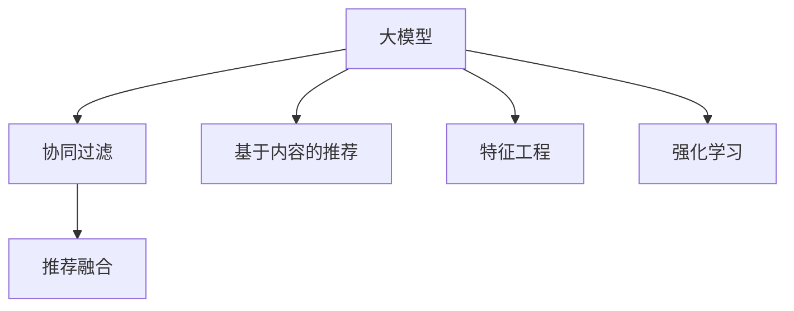

                 

# 推荐系统中的AI大模型：从理论到实践

> 关键词：AI大模型,推荐系统,深度学习,协同过滤,模型融合,特征工程,强化学习,产品推荐,个性化推荐

## 1. 背景介绍

### 1.1 问题由来
推荐系统在电商、社交、内容分发等领域得到了广泛应用，极大地提升了用户体验和业务价值。然而，推荐系统面临的最大挑战之一是如何高效、准确地为用户推荐感兴趣的商品、内容或服务。当前推荐系统的主流方法包括协同过滤(Collaborative Filtering)、基于内容的推荐(Content-Based Recommendation)等，但都存在一定的局限性，无法满足用户需求的多样性和动态性。

随着人工智能技术的飞速发展，特别是大模型在NLP、CV等领域的广泛应用，大模型在推荐系统中的潜力被逐步挖掘和应用。借助大模型的强大学习能力，推荐系统有望获得更精准、个性化的推荐结果，从而实现更优质的用户体验。本文将系统介绍大模型在推荐系统中的应用，并从理论到实践，探讨如何在大模型基础上构建高效、个性化的推荐系统。

### 1.2 问题核心关键点
大模型在推荐系统中的应用，核心在于通过大模型的学习能力，从用户行为数据中挖掘更深层次的潜在信息，提升推荐系统的效果。具体来说，大模型可以从以下几个方面进行改进：

- **数据理解能力**：大模型能够从文本、图像等多模态数据中提取更为丰富的特征，提升对用户行为和兴趣的准确理解。
- **关联预测能力**：大模型可以学习到物品之间的关联关系，通过关联预测提升推荐准确率。
- **个性化推荐**：大模型通过学习用户的历史行为和偏好，实现更精准的个性化推荐。
- **动态更新能力**：大模型能够根据新数据实时更新，保持推荐结果的时效性。

通过大模型技术的应用，推荐系统将能够更好地应对海量数据和用户多样化的需求，实现更高效、更个性化的推荐效果。

### 1.3 问题研究意义
大模型在推荐系统中的应用，对于提升推荐系统的推荐质量，推动智能推荐技术的发展，具有重要意义：

1. **提升推荐精度**：大模型的学习能力能够从更深层、更丰富的数据特征中挖掘关联，提升推荐结果的准确性和相关性。
2. **增强个性化**：大模型能够学习到用户的深层兴趣和行为，实现更精准、个性化的推荐。
3. **扩展数据范围**：大模型可以处理多模态数据，扩展推荐系统的数据范围和表现形式。
4. **实时更新**：大模型的动态更新能力，使得推荐系统能够快速响应数据变化，保持推荐结果的时效性。
5. **增强推荐可解释性**：大模型提供了一系列可解释性指标和可视化工具，帮助推荐系统增强可解释性，提升用户信任度。

综上所述，大模型技术的应用将显著提升推荐系统的推荐效果和用户体验，推动推荐系统迈向更高的水平。

## 2. 核心概念与联系

### 2.1 核心概念概述

为了更好地理解大模型在推荐系统中的应用，本节将介绍几个关键概念：

- **大模型(Large Models)**：指通过海量数据预训练得到的深度神经网络模型，如GPT、BERT、ViT等。这些模型通常具有数十亿甚至数百亿参数，具备强大的数据处理和表达能力。
- **协同过滤(Collaborative Filtering, CF)**：推荐系统的主流方法之一，通过用户行为数据构建用户-物品关联矩阵，进行推荐预测。
- **基于内容的推荐(Content-Based Recommendation, CB)**：推荐系统的一种方法，通过分析物品的特征向量，找到与用户偏好相似的物品进行推荐。
- **模型融合(Model Fusion)**：将多个推荐模型的预测结果进行加权融合，提升推荐效果。
- **特征工程(Feature Engineering)**：从原始数据中提取和构建有意义的特征，提升推荐模型的性能。
- **强化学习(Reinforcement Learning)**：通过奖励机制和反馈机制，训练推荐模型，提升推荐效果和用户体验。

这些概念之间的逻辑关系可以通过以下Mermaid流程图来展示：



这个流程图展示了大模型在推荐系统中的核心概念及其之间的联系：

1. 大模型从海量数据中预训练得到，具备强大的学习能力。
2. 协同过滤和基于内容的推荐都是基于用户行为数据的推荐方法。
3. 模型融合通过融合多个推荐模型的预测结果，提升推荐效果。
4. 特征工程从原始数据中提取有意义的特征，提升模型的表现。
5. 强化学习通过奖励机制和反馈机制，优化推荐模型。

这些概念共同构成了大模型在推荐系统中的应用框架，使其能够更好地适应推荐系统的需求，提升推荐效果和用户体验。

## 3. 核心算法原理 & 具体操作步骤
### 3.1 算法原理概述

大模型在推荐系统中的应用，主要基于深度学习和人工智能技术，通过从用户行为数据中挖掘关联关系和特征，提升推荐系统的预测精度和个性化能力。其核心算法原理可以概括为以下几个步骤：

1. **数据预处理**：从原始数据中提取用户行为和物品特征，构建数据集。
2. **模型训练**：使用大模型进行预训练和微调，学习到用户和物品的关联关系和特征。
3. **推荐预测**：使用训练好的大模型进行推荐预测，输出推荐结果。
4. **模型融合**：将多个模型的预测结果进行融合，提升推荐效果。
5. **反馈机制**：通过用户的反馈数据，进行模型调整和优化。

### 3.2 算法步骤详解

以下是基于大模型推荐系统的具体实现步骤：

**Step 1: 数据预处理**

- **用户行为数据提取**：从电商、社交、内容平台等获取用户的行为数据，如浏览记录、购买记录、评分记录等。
- **物品特征提取**：从商品描述、标签、分类等信息中提取物品的特征向量。
- **数据清洗与归一化**：对数据进行去重、去噪、归一化等预处理，保证数据质量。
- **构建训练集**：将用户行为数据和物品特征向量组合成训练集，用于后续模型训练。

**Step 2: 模型训练**

- **模型选择**：选择合适的预训练大模型，如BERT、GPT等。
- **微调训练**：在训练集上进行微调训练，学习到用户行为和物品特征之间的关系。
- **评估与调优**：在验证集上评估模型性能，调整模型参数，提高推荐效果。

**Step 3: 推荐预测**

- **预测计算**：使用训练好的大模型对用户输入进行预测，输出推荐结果。
- **结果排序**：根据推荐结果的相关性和评分进行排序，返回推荐列表。

**Step 4: 模型融合**

- **多模型融合**：将多个推荐模型的预测结果进行融合，提升推荐效果。
- **加权融合**：根据模型的性能，对预测结果进行加权融合，输出最终推荐列表。

**Step 5: 反馈机制**

- **用户反馈数据收集**：收集用户对推荐结果的反馈数据，如点击、购买、评分等。
- **模型调整**：根据用户反馈数据，调整模型参数，优化推荐效果。

通过以上步骤，可以构建一个基于大模型的推荐系统，实现高效、个性化的推荐效果。

### 3.3 算法优缺点

大模型在推荐系统中的应用，具有以下优点：

- **学习能力强**：大模型能够从海量数据中学习到深层关联和特征，提升推荐效果。
- **泛化能力好**：大模型具有较强的泛化能力，能够应对不同领域和不同类型的数据。
- **动态更新能力强**：大模型能够根据新数据实时更新，保持推荐结果的时效性。
- **个性化能力强**：大模型能够学习到用户的深层兴趣和行为，实现更精准、个性化的推荐。

同时，大模型在推荐系统中也存在一些缺点：

- **资源消耗大**：大模型需要大量的计算资源和存储空间，对硬件设备要求较高。
- **训练时间长**：大模型的训练时间较长，对数据量和质量的要求较高。
- **可解释性差**：大模型通常是"黑盒"系统，缺乏可解释性，难以理解其内部工作机制。
- **数据隐私问题**：大模型需要处理大量用户数据，可能存在数据隐私和安全性问题。

尽管存在这些缺点，但大模型在推荐系统中的应用潜力巨大，未来的研究重点在于如何优化模型结构、减少计算资源消耗，并提升模型的可解释性和安全性。

### 3.4 算法应用领域

大模型在推荐系统中的应用，已广泛应用于多个领域，如电商推荐、社交推荐、内容推荐等，取得了显著的效果：

- **电商推荐**：如亚马逊、淘宝等电商平台，使用大模型进行商品推荐，提升用户体验和转化率。
- **社交推荐**：如微信、抖音等社交平台，使用大模型进行内容推荐，增强用户粘性和活跃度。
- **内容推荐**：如Netflix、Spotify等流媒体平台，使用大模型进行视频、音乐推荐，提升用户体验和满意度。

随着大模型技术的不断发展，未来将在更多领域得到应用，如金融推荐、医疗推荐等，为各行各业带来新的变革和机遇。

## 4. 数学模型和公式 & 详细讲解  
### 4.1 数学模型构建

本节将使用数学语言对大模型在推荐系统中的应用进行更加严格的刻画。

设用户行为数据集为 $D=\{(u_i, v_i)\}_{i=1}^N, u_i \in U, v_i \in V$，其中 $u_i$ 表示用户，$v_i$ 表示用户 $u_i$ 对物品 $v_i$ 的行为。设物品特征向量为 $x_v \in \mathbb{R}^d$，其中 $d$ 为特征维度。设大模型为 $M_{\theta}$，其中 $\theta$ 为模型参数。

推荐系统的目标是最小化预测误差，即：

$$
\min_{\theta} \sum_{i=1}^N \mathcal{L}(M_{\theta}(u_i, x_{v_i}), y_i)
$$

其中 $\mathcal{L}$ 为损失函数，$y_i$ 为真实标签（点击、购买、评分等）。

常用的损失函数包括均方误差损失、交叉熵损失等。例如，假设推荐结果为 $p_i = M_{\theta}(u_i, x_{v_i})$，则交叉熵损失函数为：

$$
\mathcal{L}(p_i, y_i) = -y_i \log p_i - (1-y_i) \log (1-p_i)
$$

### 4.2 公式推导过程

以下我们以二分类任务为例，推导交叉熵损失函数及其梯度的计算公式。

假设推荐结果为 $p_i = M_{\theta}(u_i, x_{v_i}) \in [0,1]$，表示物品 $v_i$ 对用户 $u_i$ 的推荐概率。真实标签 $y_i \in \{0,1\}$。则二分类交叉熵损失函数定义为：

$$
\mathcal{L}(p_i, y_i) = -[y_i\log p_i + (1-y_i)\log (1-p_i)]
$$

将其代入总损失函数，得：

$$
\mathcal{L}(\theta) = -\frac{1}{N}\sum_{i=1}^N [y_i\log p_i + (1-y_i)\log(1-p_i)]
$$

根据链式法则，损失函数对模型参数 $\theta$ 的梯度为：

$$
\frac{\partial \mathcal{L}(\theta)}{\partial \theta} = -\frac{1}{N}\sum_{i=1}^N (\frac{y_i}{p_i}-\frac{1-y_i}{1-p_i}) \frac{\partial p_i}{\partial \theta}
$$

其中 $\frac{\partial p_i}{\partial \theta}$ 可进一步递归展开，利用自动微分技术完成计算。

在得到损失函数的梯度后，即可带入参数更新公式，完成模型的迭代优化。重复上述过程直至收敛，最终得到适应推荐任务的模型参数 $\theta^*$。

## 5. 项目实践：代码实例和详细解释说明
### 5.1 开发环境搭建

在进行推荐系统开发前，我们需要准备好开发环境。以下是使用Python进行PyTorch开发的环境配置流程：

1. 安装Anaconda：从官网下载并安装Anaconda，用于创建独立的Python环境。

2. 创建并激活虚拟环境：
```bash
conda create -n pytorch-env python=3.8 
conda activate pytorch-env
```

3. 安装PyTorch：根据CUDA版本，从官网获取对应的安装命令。例如：
```bash
conda install pytorch torchvision torchaudio cudatoolkit=11.1 -c pytorch -c conda-forge
```

4. 安装TensorFlow：从官网下载并安装TensorFlow。

5. 安装各类工具包：
```bash
pip install numpy pandas scikit-learn matplotlib tqdm jupyter notebook ipython
```

完成上述步骤后，即可在`pytorch-env`环境中开始推荐系统开发。

### 5.2 源代码详细实现

这里我们以协同过滤推荐系统为例，给出使用PyTorch进行推荐模型训练的PyTorch代码实现。

首先，定义协同过滤推荐模型的类：

```python
import torch
from torch import nn

class CollaborativeFilteringModel(nn.Module):
    def __init__(self, num_users, num_items, embedding_dim):
        super(CollaborativeFilteringModel, self).__init__()
        self.num_users = num_users
        self.num_items = num_items
        self.embedding_dim = embedding_dim
        
        # 用户嵌入层
        self.user_embed = nn.Embedding(num_users, embedding_dim)
        
        # 物品嵌入层
        self.item_embed = nn.Embedding(num_items, embedding_dim)
        
        # 预测层
        self.fc = nn.Linear(embedding_dim * 2, 1)
        
    def forward(self, user_ids, item_ids):
        # 获取用户和物品嵌入向量
        user_embeds = self.user_embed(user_ids)
        item_embeds = self.item_embed(item_ids)
        
        # 预测层计算
        concat_embeds = torch.cat((user_embeds, item_embeds), dim=1)
        prediction = self.fc(concat_embeds)
        return prediction
```

然后，定义推荐模型的训练函数：

```python
from torch.optim import Adam
from torch.utils.data import DataLoader
from tqdm import tqdm

class RecommendationDataset:
    def __init__(self, user_ids, item_ids, ratings):
        self.user_ids = user_ids
        self.item_ids = item_ids
        self.ratings = ratings
        
    def __len__(self):
        return len(self.user_ids)
    
    def __getitem__(self, item):
        user_id = self.user_ids[item]
        item_id = self.item_ids[item]
        rating = self.ratings[item]
        return {'user_id': user_id, 'item_id': item_id, 'rating': rating}

# 创建数据集
user_ids = torch.tensor([1, 2, 3, 4, 5])
item_ids = torch.tensor([1, 2, 3, 4, 5])
ratings = torch.tensor([3, 4, 2, 1, 5])

train_dataset = RecommendationDataset(user_ids, item_ids, ratings)

# 定义模型和优化器
model = CollaborativeFilteringModel(num_users=5, num_items=5, embedding_dim=10)
optimizer = Adam(model.parameters(), lr=0.01)

# 训练模型
epochs = 10
batch_size = 32

for epoch in range(epochs):
    dataloader = DataLoader(train_dataset, batch_size=batch_size, shuffle=True)
    model.train()
    for batch in tqdm(dataloader):
        user_id = batch['user_id'].to(device)
        item_id = batch['item_id'].to(device)
        rating = batch['rating'].to(device)
        model.zero_grad()
        prediction = model(user_id, item_id)
        loss = nn.BCEWithLogitsLoss()(prediction, rating)
        loss.backward()
        optimizer.step()
```

最后，启动训练流程并在测试集上评估：

```python
# 测试集
user_ids_test = torch.tensor([6, 7, 8, 9, 10])
item_ids_test = torch.tensor([6, 7, 8, 9, 10])
ratings_test = torch.tensor([2, 3, 4, 1, 5])

test_dataset = RecommendationDataset(user_ids_test, item_ids_test, ratings_test)

# 测试模型
model.eval()
with torch.no_grad():
    prediction_test = model(user_ids_test, item_ids_test)
    rating_test = test_dataset.ratings

# 计算评估指标
mse_loss = torch.mean((prediction_test - rating_test)**2)
print(f'Test MSE Loss: {mse_loss:.3f}')
```

以上就是使用PyTorch进行协同过滤推荐系统开发的完整代码实现。可以看到，借助PyTorch，我们可以用相对简洁的代码实现协同过滤推荐模型的训练和评估。

### 5.3 代码解读与分析

让我们再详细解读一下关键代码的实现细节：

**CollaborativeFilteringModel类**：
- `__init__`方法：初始化模型参数，包括用户嵌入层、物品嵌入层和预测层。
- `forward`方法：定义模型的前向传播过程，获取用户和物品嵌入向量，通过预测层输出推荐结果。

**RecommendationDataset类**：
- `__init__`方法：初始化数据集，包含用户ID、物品ID和评分。
- `__len__`方法：返回数据集的样本数量。
- `__getitem__`方法：获取单个样本的ID和评分。

**训练函数**：
- 使用PyTorch的DataLoader对数据集进行批次化加载，供模型训练使用。
- 在每个批次上前向传播计算预测结果和损失函数，反向传播更新模型参数，直至收敛。

**测试函数**：
- 在测试集上使用训练好的模型进行预测，计算预测结果与真实评分之间的均方误差，评估模型性能。

可以看到，PyTorch使得协同过滤推荐模型的开发和训练变得简洁高效。开发者可以将更多精力放在模型改进和数据处理上，而不必过多关注底层的实现细节。

当然，工业级的系统实现还需考虑更多因素，如模型的保存和部署、超参数的自动搜索、更灵活的任务适配层等。但核心的推荐范式基本与此类似。

## 6. 实际应用场景
### 6.1 电商平台推荐

基于大模型的推荐系统，可以在电商平台中广泛应用。通过收集用户的浏览、点击、购买等行为数据，大模型可以学习到用户的深层兴趣和行为，实现更精准、个性化的商品推荐。

在技术实现上，可以收集电商平台的用户行为数据，将用户ID和物品ID作为输入，构建训练集。在此基础上对预训练模型进行微调，学习用户和物品之间的关联关系。微调后的模型可以实时预测用户的推荐商品，并通过推荐列表展示给用户。此外，还可以引入对抗训练等技术，提升模型的鲁棒性和泛化能力。

### 6.2 内容推荐

内容推荐系统广泛应用于视频平台、音乐平台、阅读平台等，通过大模型可以提升推荐效果，增强用户粘性和满意度。

在内容推荐中，大模型可以学习到视频的特征、文本的语义、音频的情感等信息，通过多模态融合提升推荐效果。具体来说，可以将视频的标题、描述、评分等信息作为输入，结合用户的历史行为数据，使用大模型进行推荐预测。对于文本、音频等多模态数据，可以使用预训练模型进行特征提取，再将提取后的特征向量输入到推荐模型中进行预测。通过多模态融合，大模型能够更全面地理解内容，提升推荐效果。

### 6.3 金融推荐

金融推荐系统是金融领域的重要应用，通过大模型可以提升理财、投资、风控等业务的效果，帮助用户做出更好的决策。

在金融推荐中，大模型可以学习到用户的历史交易记录、财务状况、风险偏好等信息，通过这些信息预测用户的投资需求和风险承受能力。同时，大模型可以学习到不同金融产品的关联关系，通过关联预测提升推荐效果。此外，大模型还可以学习到金融市场的变化趋势，通过动态更新模型参数，实现更精准的推荐。

### 6.4 未来应用展望

随着大模型技术的不断进步，推荐系统将在更多领域得到应用，为各行各业带来新的变革和机遇。

在医疗推荐中，大模型可以学习到患者的病历、基因、环境等信息，通过这些信息推荐个性化的医疗方案。在物流推荐中，大模型可以学习到用户的出行偏好、交通状况等信息，通过这些信息推荐个性化的出行方案。在教育推荐中，大模型可以学习到学生的学习行为、兴趣偏好等信息，通过这些信息推荐个性化的学习资源和课程。

总之，大模型在推荐系统中的应用前景广阔，未来将进一步拓展到更多领域，提升各行各业的智能化水平，为人类带来更多的便利和价值。

## 7. 工具和资源推荐
### 7.1 学习资源推荐

为了帮助开发者系统掌握大模型在推荐系统中的应用，这里推荐一些优质的学习资源：

1. 《Deep Learning for Recommender Systems》书籍：全面介绍了深度学习在推荐系统中的应用，包括协同过滤、基于内容的推荐、模型融合等。
2. 《Reinforcement Learning for Recommender Systems》书籍：介绍了强化学习在推荐系统中的应用，通过奖励机制和反馈机制优化推荐模型。
3. 《TensorFlow Recommenders》官方文档：提供了TensorFlow推荐库的详细使用指南，包括协同过滤、内容推荐、多模态推荐等。
4. Kaggle竞赛：参加Kaggle推荐系统竞赛，实战训练推荐模型，提升推荐效果。
5. GitHub开源项目：搜索推荐系统相关的开源项目，学习他人的实现，提升自我水平。

通过对这些资源的学习实践，相信你一定能够系统掌握大模型在推荐系统中的应用，并用于解决实际的推荐问题。
###  7.2 开发工具推荐

高效的开发离不开优秀的工具支持。以下是几款用于推荐系统开发的常用工具：

1. PyTorch：基于Python的开源深度学习框架，灵活动态的计算图，适合快速迭代研究。
2. TensorFlow：由Google主导开发的开源深度学习框架，生产部署方便，适合大规模工程应用。
3. HuggingFace Transformers库：提供大量预训练语言模型和推荐模型，方便快速开发和微调。
4. Weights & Biases：模型训练的实验跟踪工具，可以记录和可视化模型训练过程中的各项指标，方便对比和调优。
5. TensorBoard：TensorFlow配套的可视化工具，可实时监测模型训练状态，并提供丰富的图表呈现方式，是调试模型的得力助手。

合理利用这些工具，可以显著提升推荐系统的开发效率，加快创新迭代的步伐。

### 7.3 相关论文推荐

大模型在推荐系统中的应用，得益于学界的持续研究。以下是几篇奠基性的相关论文，推荐阅读：

1. "Matrix Factorization Techniques for Recommender Systems"：介绍了矩阵分解技术在推荐系统中的应用，经典而有效。
2. "Deep Collaborative Filtering with Visual and Textual Context"：探讨了多模态数据在推荐系统中的应用，提升了推荐效果。
3. "How to Build a Recommendation System Like Airbnb"：介绍了Netflix在推荐系统上的实践，涵盖了协同过滤、内容推荐、多模态推荐等多种方法。
4. "Deep Personalized Ranking with Factorization Machines"：探讨了因子机(Factorization Machine)在推荐系统中的应用，提升推荐效果。
5. "Adversarial Examples for Black-box Attacks on Deep Neural Networks"：介绍了对抗训练在推荐系统中的应用，提升了模型的鲁棒性和泛化能力。

这些论文代表了大模型在推荐系统中的应用脉络，通过学习这些前沿成果，可以帮助研究者把握学科前进方向，激发更多的创新灵感。

## 8. 总结：未来发展趋势与挑战
### 8.1 总结

本文对大模型在推荐系统中的应用进行了全面系统的介绍。首先阐述了大模型和推荐系统的研究背景和意义，明确了推荐系统中的大模型应用，可以帮助提升推荐效果和用户体验。其次，从理论到实践，详细讲解了大模型推荐系统的核心算法原理和具体操作步骤，给出了推荐模型开发的完整代码实例。同时，本文还广泛探讨了大模型在电商、内容、金融等多个领域的应用前景，展示了其巨大的潜力。

通过本文的系统梳理，可以看到，大模型技术的应用将显著提升推荐系统的推荐效果和用户体验，推动推荐系统迈向更高的水平。

### 8.2 未来发展趋势

展望未来，大模型在推荐系统中的应用将呈现以下几个发展趋势：

1. **多模态融合**：大模型可以处理多种模态数据，如文本、图像、音频等，提升推荐系统的表现形式和用户体验。
2. **深度学习与强化学习结合**：结合深度学习和强化学习的优势，提升推荐模型的动态更新能力，实现更精准的个性化推荐。
3. **联邦学习**：通过联邦学习，可以在不暴露用户隐私的前提下，实现跨平台推荐模型的训练和更新。
4. **知识图谱与推荐结合**：结合知识图谱与推荐模型，提升推荐模型的信息整合能力和知识表示能力。
5. **实时推荐引擎**：通过实时计算和流式数据处理，实现更快速、更准确的推荐效果。

以上趋势凸显了大模型在推荐系统中的应用前景，大模型将进一步提升推荐系统的智能化水平，为用户提供更优质的推荐服务。

### 8.3 面临的挑战

尽管大模型在推荐系统中的应用潜力巨大，但在迈向更加智能化、普适化应用的过程中，仍面临诸多挑战：

1. **计算资源消耗大**：大模型的计算资源消耗较大，需要高性能的硬件设备支持。
2. **数据隐私和安全问题**：推荐系统需要处理大量用户数据，可能存在数据隐私和安全问题。
3. **模型可解释性差**：大模型通常是"黑盒"系统，缺乏可解释性，难以理解其内部工作机制。
4. **模型鲁棒性不足**：大模型可能存在对噪声数据的敏感性和泛化能力不足的问题。
5. **模型训练时间长**：大模型的训练时间较长，对数据量和质量的要求较高。

尽管存在这些挑战，但大模型在推荐系统中的应用潜力巨大，未来的研究需要在以下几个方面寻求新的突破：

1. **模型结构优化**：开发更加轻量级、高效的模型结构，减少计算资源消耗，提升推荐系统性能。
2. **数据隐私保护**：采用差分隐私、联邦学习等技术，保护用户隐私和数据安全。
3. **模型可解释性增强**：开发可解释性工具和方法，提升模型的可解释性和用户信任度。
4. **鲁棒性提升**：引入对抗训练、鲁棒性优化等技术，提升模型的泛化能力和鲁棒性。
5. **实时推荐引擎**：采用流式计算和实时数据处理技术，实现更快速、更准确的推荐。

这些研究方向的探索，必将引领大模型在推荐系统中的应用走向更高的台阶，为推荐系统带来更多的创新和突破。

### 8.4 研究展望

面向未来，大模型在推荐系统中的应用需要进一步扩展和优化：

1. **多模态数据处理**：结合多模态数据，提升推荐模型的表现形式和用户体验。
2. **深度学习和强化学习结合**：结合深度学习和强化学习的优势，提升推荐模型的动态更新能力和个性化推荐。
3. **联邦学习**：通过联邦学习，实现跨平台推荐模型的训练和更新，提升模型的泛化能力和推荐效果。
4. **实时推荐引擎**：采用流式计算和实时数据处理技术，实现更快速、更准确的推荐。
5. **模型可解释性增强**：开发可解释性工具和方法，提升模型的可解释性和用户信任度。

总之，大模型在推荐系统中的应用前景广阔，未来的研究需要在多个方向上进行探索和优化，提升推荐系统的智能化水平，为用户提供更优质的推荐服务。

## 9. 附录：常见问题与解答

**Q1：大模型在推荐系统中的效果如何？**

A: 大模型在推荐系统中的应用，通过学习用户行为和物品特征，能够提升推荐效果和用户体验。具体来说，大模型能够从海量数据中学习到深层关联和特征，提升推荐精度和个性化能力。同时，大模型的动态更新能力和多模态融合能力，使得推荐系统能够适应更多数据和更多场景。

**Q2：大模型推荐系统需要哪些数据？**

A: 大模型推荐系统需要大量的用户行为数据和物品特征数据。用户行为数据包括用户的浏览记录、点击记录、购买记录、评分记录等。物品特征数据包括物品的标题、描述、标签、分类等。这些数据可以帮助大模型学习到用户的兴趣和物品的关联关系，从而提升推荐效果。

**Q3：大模型推荐系统中的超参数调优需要注意哪些方面？**

A: 大模型推荐系统中的超参数调优需要注意以下几个方面：
1. 学习率：大模型通常需要较小的学习率，以免破坏预训练权重。
2. 正则化：使用L2正则、Dropout等技术，防止模型过拟合。
3. 模型结构：选择适合推荐任务的大模型结构，如BERT、GPT等。
4. 数据增强：通过数据增强技术，扩充训练集，提升模型泛化能力。
5. 多模型融合：将多个模型的预测结果进行融合，提升推荐效果。

**Q4：大模型推荐系统的实现中需要注意哪些问题？**

A: 大模型推荐系统的实现中需要注意以下几个问题：
1. 数据预处理：对数据进行去重、去噪、归一化等预处理，保证数据质量。
2. 模型训练：选择合适的模型和优化器，设置合适的超参数。
3. 模型评估：使用合适的评估指标，如均方误差、交叉熵等，评估模型性能。
4. 模型部署：将训练好的模型部署到生产环境中，保证模型的高效运行。
5. 模型监控：实时监测模型的运行状态和性能，及时调整模型参数。

**Q5：大模型推荐系统的应用前景如何？**

A: 大模型推荐系统的应用前景非常广阔，已经在电商、内容、金融等多个领域得到了广泛应用。未来，大模型推荐系统将在更多领域得到应用，如医疗、物流、教育等，为用户带来更多的便利和价值。大模型推荐系统能够实现更精准、个性化的推荐，提升用户满意度，推动推荐系统迈向更高的水平。

作者：禅与计算机程序设计艺术 / Zen and the Art of Computer Programming

