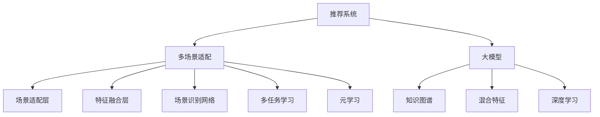

                 

# 推荐系统中的多场景适配：大模型的新思路

> 关键词：推荐系统,多场景适配,大模型,知识图谱,混合特征,深度学习

## 1. 背景介绍

### 1.1 问题由来
推荐系统作为一种常见的用户行为预测和内容推荐技术，已经在电商、社交、新闻、音乐等多个领域得到了广泛应用。随着用户需求的多样化，推荐系统需要具备更强的适应性和泛化能力，能够应对不同的业务场景和用户行为。传统的基于协同过滤、内容基推荐等方法已经逐渐显现出其局限性。

在近年兴起的深度学习时代，基于大模型的推荐系统逐渐成为新的研究热点。基于深度神经网络的大模型，尤其是自监督预训练的模型，以其强大的表征能力，能够更充分地利用用户行为数据，生成高质量的推荐结果。但是，由于预训练模型和微调方法较为通用，如何将其适配到多样化的推荐场景中，仍是一个值得深入探讨的问题。

### 1.2 问题核心关键点
在大模型推荐系统中，如何针对不同的推荐场景进行模型适配，使得推荐系统具备更强的场景泛化能力和更精细的用户画像，是当前亟待解决的核心问题。

为了应对这一挑战，研究者们提出了多种基于大模型的推荐系统适配方法。本文将聚焦于其中的几个主要思路，通过理论分析和实际案例，探讨大模型在推荐系统中的多场景适配问题。

## 2. 核心概念与联系

### 2.1 核心概念概述

为更好地理解多场景适配问题，本文将介绍几个关键概念及其相互联系：

- 推荐系统(Recommender System)：通过分析用户历史行为和偏好，预测用户对物品的兴趣程度，并给出推荐结果的系统。
- 多场景适配(Multi-Scenario Adaptation)：指针对推荐系统面临的不同业务场景和用户需求，设计专门的模型架构或适配策略，以提升推荐系统的适应性和效果。
- 大模型(Large Model)：以自回归或自编码模型为代表的深度神经网络，通过在海量数据上进行预训练，学习到丰富的知识表示。
- 知识图谱(Knowledge Graph)：以节点和边为基本组成元素，用于表示实体间关系的数据结构。
- 混合特征(Hybrid Feature)：结合用户历史行为、用户画像、物品属性等多维度的特征信息，以增强推荐系统的效果。
- 深度学习(Deep Learning)：基于神经网络模型的学习范式，包括前馈神经网络、卷积神经网络、循环神经网络等，广泛应用于推荐系统等领域。

这些核心概念通过以下Mermaid流程图展示了相互关系：



## 3. 核心算法原理 & 具体操作步骤

### 3.1 算法原理概述

大模型在推荐系统中的多场景适配，本质上是一个多任务学习和元学习的联合过程。其核心思想是：将大模型的预训练知识，通过多任务学习的方式，应用于不同的推荐场景中，从而生成针对特定场景的推荐结果。

形式化地，假设存在 $K$ 个推荐场景 $\{S_k\}_{k=1}^K$，相应的推荐模型为 $\{M_k\}_{k=1}^K$，通过多任务学习，将大模型 $M$ 适配为：

$$
M_k = \text{Adapt}(M, S_k)
$$

其中 $\text{Adapt}$ 表示适配函数，需要结合具体的任务和数据，设计适合的适配策略。

### 3.2 算法步骤详解

基于多任务学习和元学习的推荐系统适配，一般包括以下几个关键步骤：

**Step 1: 准备数据集**
- 收集推荐系统的训练数据集，划分为多个场景 $S_k$，每个场景的数据集为 $D_k$。
- 根据不同场景的特点，选择合适的特征处理方式，如TF-IDF、词向量、稠密向量等。

**Step 2: 设计适配函数**
- 根据不同推荐场景，设计适配函数 $\text{Adapt}(M, S_k)$，可以是后接网络、附加层、特定损失函数等。
- 常见的适配函数包括：
  - **场景适配层**：在顶层添加特定场景的适配层，通过特定的权值更新策略，增强模型在该场景上的适应性。
  - **特征融合层**：将不同场景的特征进行融合，生成统一的特征向量，再输入到大模型进行预测。
  - **场景识别网络**：通过引入场景分类网络，对输入数据进行场景分类，再根据分类结果选择对应的适配函数进行适配。
  - **多任务学习**：将多个推荐任务共同训练，共享部分模型参数，提升模型在不同场景上的泛化能力。
  - **元学习**：在有限标注数据的情况下，通过元学习算法，对场景分类器进行学习，以指导不同场景的适配。

**Step 3: 设计损失函数**
- 定义推荐系统的损失函数，通常为交叉熵损失或均方误差损失，用于衡量预测值和真实值之间的差异。
- 设计每个场景的损失函数 $\mathcal{L}_k$，用于衡量模型在场景 $S_k$ 上的性能。

**Step 4: 训练模型**
- 选择合适的优化算法，如Adam、SGD等，设置合适的学习率、批大小等超参数。
- 将数据集 $D_k$ 分为训练集、验证集和测试集，进行多任务学习和元学习的联合训练。
- 在训练过程中，根据不同的场景进行损失计算，并进行参数更新。

**Step 5: 评估与部署**
- 在测试集上评估每个场景的推荐效果，对比适配前后的性能提升。
- 使用适配后的模型进行推荐预测，集成到实际的应用系统中。

以上是基于多任务学习和元学习的推荐系统适配的一般流程。在实际应用中，还需要针对具体任务和数据，对适配函数、损失函数、超参数等进行优化设计，以进一步提升模型性能。

### 3.3 算法优缺点

基于大模型的推荐系统适配方法，具有以下优点：
1. 简单高效。只需在现有的预训练模型基础上，通过添加少量适配层或进行多任务联合训练，即可快速适配不同场景。
2. 泛化能力强。通过多任务学习，模型能够更好地泛化到不同推荐场景，提升推荐的普适性。
3. 数据需求低。相比于从头训练，多任务学习所需的数据量相对较少，节省了大量的标注成本。

同时，该方法也存在一定的局限性：
1. 适配策略复杂。设计适配函数时需要考虑不同场景的特点，需要丰富的领域知识和经验。
2. 场景多样性挑战。如果场景数较多，适配函数的组合空间会很大，模型的训练和优化难度会增加。
3. 模型复杂度增加。多任务学习会引入额外的参数，模型复杂度较高，推理速度可能会受到影响。
4. 优化难度大。不同场景的损失函数可能存在冲突，优化时需要平衡不同场景之间的权衡，增加优化难度。

尽管存在这些局限性，但就目前而言，基于大模型的推荐系统适配方法仍是大模型应用的主流范式。未来相关研究的重点在于如何进一步降低适配的复杂性，提高适配的泛化能力，同时兼顾模型的复杂度和推理速度等因素。

### 3.4 算法应用领域

基于大模型的推荐系统适配方法，在推荐系统领域已经得到了广泛的应用，覆盖了电商、社交、新闻、音乐等多个领域，例如：

- 电商推荐：对用户浏览、点击、购买行为进行分析和推荐。
- 社交推荐：根据用户的兴趣和社交关系，推荐潜在的社交对象。
- 新闻推荐：根据用户的阅读历史和兴趣，推荐感兴趣的新闻内容。
- 音乐推荐：根据用户的听歌历史和兴趣，推荐感兴趣的音乐。

除了上述这些经典任务外，大模型适配方法也被创新性地应用到更多场景中，如个性化视频推荐、智能广告推荐等，为推荐系统技术带来了全新的突破。

## 4. 数学模型和公式 & 详细讲解

### 4.1 数学模型构建

本节将使用数学语言对基于大模型的推荐系统适配过程进行更加严格的刻画。

记推荐系统中的大模型为 $M$，用户历史行为特征为 $X$，物品属性特征为 $Y$，推荐结果为 $Z$。假设存在 $K$ 个推荐场景 $\{S_k\}_{k=1}^K$，相应的推荐模型为 $\{M_k\}_{k=1}^K$。

定义每个场景的损失函数为 $\mathcal{L}_k(Z_k, M_k(X, Y))$，其中 $Z_k$ 为场景 $S_k$ 的推荐结果，$M_k(X, Y)$ 为模型在场景 $S_k$ 上的预测结果。

多任务学习的目标是最小化总损失函数：

$$
\mathcal{L} = \sum_{k=1}^K \mathcal{L}_k(Z_k, M_k(X, Y))
$$

其中 $\mathcal{L}_k$ 为场景 $S_k$ 的损失函数。

### 4.2 公式推导过程

以下我们以场景适配层和多任务学习为例，推导适配函数的设计和优化过程。

**场景适配层**：
- 假设适配层的结构为 $H_k = M_k(X, Y) \otimes W_k$，其中 $\otimes$ 表示元素乘积，$W_k$ 为适配层的参数。
- 适配层后的输出 $Z_k = \sigma_k(H_k)$，其中 $\sigma_k$ 为激活函数。
- 适配层的损失函数为 $\mathcal{L}_k(Z_k, M_k(X, Y)) = \frac{1}{2} \|Z_k - M_k(X, Y)\|_2^2$。

在反向传播过程中，适配层的梯度为：

$$
\frac{\partial \mathcal{L}_k}{\partial W_k} = (Z_k - M_k(X, Y))^T \cdot \sigma_k'(H_k)
$$

**多任务学习**：
- 假设多任务学习的模型为 $M_{mt} = [M_1, M_2, ..., M_K]$，各场景的损失函数为 $\mathcal{L}_k(Z_k, M_k(X, Y))$。
- 多任务学习的总损失函数为 $\mathcal{L} = \sum_{k=1}^K \mathcal{L}_k(Z_k, M_k(X, Y))$。
- 多任务学习的优化目标为：

$$
\min_{\theta} \mathcal{L} = \sum_{k=1}^K \mathcal{L}_k(Z_k, M_k(X, Y))
$$

其中 $\theta$ 为模型 $M_{mt}$ 的参数。

在优化过程中，通过最小化总损失函数，调整模型参数 $\theta$，以最大化各场景的推荐性能。

### 4.3 案例分析与讲解

假设推荐系统有电商和社交两个场景，各场景的特征分别为 $X_e = [x_{e1}, x_{e2}, ..., x_{en}]$ 和 $X_s = [x_{s1}, x_{s2}, ..., x_{sm}]$，物品属性特征为 $Y = [y_1, y_2, ..., y_m]$。

对于电商场景，设计场景适配层 $H_e = M_e(X_e, Y) \otimes W_e$，适配层的损失函数为 $\mathcal{L}_e(Z_e, M_e(X_e, Y)) = \frac{1}{2} \|Z_e - M_e(X_e, Y)\|_2^2$。

对于社交场景，设计场景适配层 $H_s = M_s(X_s, Y) \otimes W_s$，适配层的损失函数为 $\mathcal{L}_s(Z_s, M_s(X_s, Y)) = \frac{1}{2} \|Z_s - M_s(X_s, Y)\|_2^2$。

将适配层的输出 $Z_e$ 和 $Z_s$ 输入到大模型 $M_{mt}$ 进行联合训练，得到最终的推荐结果。在训练过程中，同时优化 $M_{mt}$ 和 $W_e, W_s$，以最小化总损失函数 $\mathcal{L} = \mathcal{L}_e + \mathcal{L}_s$。

## 5. 项目实践：代码实例和详细解释说明

### 5.1 开发环境搭建

在进行推荐系统适配实践前，我们需要准备好开发环境。以下是使用Python进行PyTorch开发的环境配置流程：

1. 安装Anaconda：从官网下载并安装Anaconda，用于创建独立的Python环境。

2. 创建并激活虚拟环境：
```bash
conda create -n pytorch-env python=3.8 
conda activate pytorch-env
```

3. 安装PyTorch：根据CUDA版本，从官网获取对应的安装命令。例如：
```bash
conda install pytorch torchvision torchaudio cudatoolkit=11.1 -c pytorch -c conda-forge
```

4. 安装TensorFlow：使用Anaconda的conda-forge仓库，安装TensorFlow：
```bash
conda install tensorflow
```

5. 安装各类工具包：
```bash
pip install numpy pandas scikit-learn matplotlib tqdm jupyter notebook ipython
```

完成上述步骤后，即可在`pytorch-env`环境中开始适配实践。

### 5.2 源代码详细实现

这里以社交推荐系统为例，展示使用Transformers库进行大模型适配的PyTorch代码实现。

首先，定义社交推荐系统的数据处理函数：

```python
from transformers import BertTokenizer
from torch.utils.data import Dataset
import torch

class SocialRecommendationDataset(Dataset):
    def __init__(self, user_feats, item_feats, user_ages, user_genders, item_tags, tokenizer, max_len=128):
        self.user_feats = user_feats
        self.item_feats = item_feats
        self.user_ages = user_ages
        self.user_genders = user_genders
        self.item_tags = item_tags
        self.tokenizer = tokenizer
        self.max_len = max_len
        
    def __len__(self):
        return len(self.user_feats)
    
    def __getitem__(self, item):
        user_feat = self.user_feats[item]
        item_feat = self.item_feats[item]
        user_age = self.user_ages[item]
        user_gender = self.user_genders[item]
        item_tag = self.item_tags[item]
        
        user_input = f"[USER] {user_age} {user_gender} {user_feat}"
        item_input = f"[ITEM] {item_feat} {item_tag}"
        text = user_input + item_input
        encoding = self.tokenizer(text, return_tensors='pt', max_length=self.max_len, padding='max_length', truncation=True)
        user_tokens = encoding['input_ids'][0]
        item_tokens = encoding['input_ids'][1]
        item_tokens = item_tokens + [2] * (self.max_len - len(item_tokens))  # 用[2]标记item特征的结束
        return {'user_tokens': user_tokens, 
                'item_tokens': item_tokens,
                'labels': torch.tensor(item_tags[item], dtype=torch.long)}
```

然后，定义适配函数和优化器：

```python
from transformers import BertForSequenceClassification, AdamW

# 设置场景适配层的参数
embedding_dim = 768
num_layers = 12
num_heads = 12
hidden_dim = 3072

# 社交场景适配层
social_adapt_layer = BertForSequenceClassification.from_pretrained('bert-base-cased', num_labels=len(tag2id))
social_adapt_layer.config.num_labels = 1
social_adapt_layer.config.hidden_size = embedding_dim

# 电商场景适配层
# 可以使用BertForSequenceClassification，结构类似
# 需要注意在输出层添加合适的分类器

# 定义优化器
optimizer = AdamW(social_adapt_layer.parameters(), lr=2e-5)
```

接着，定义训练和评估函数：

```python
from torch.utils.data import DataLoader
from tqdm import tqdm
from sklearn.metrics import accuracy_score

device = torch.device('cuda') if torch.cuda.is_available() else torch.device('cpu')
social_adapt_layer.to(device)

def train_epoch(social_adapt_layer, dataset, batch_size, optimizer):
    dataloader = DataLoader(dataset, batch_size=batch_size, shuffle=True)
    social_adapt_layer.train()
    epoch_loss = 0
    for batch in tqdm(dataloader, desc='Training'):
        user_tokens = batch['user_tokens'].to(device)
        item_tokens = batch['item_tokens'].to(device)
        labels = batch['labels'].to(device)
        model_zero_grad()
        outputs = social_adapt_layer(user_tokens, item_tokens)
        loss = outputs.loss
        epoch_loss += loss.item()
        loss.backward()
        optimizer.step()
    return epoch_loss / len(dataloader)

def evaluate(social_adapt_layer, dataset, batch_size):
    dataloader = DataLoader(dataset, batch_size=batch_size)
    social_adapt_layer.eval()
    preds, labels = [], []
    with torch.no_grad():
        for batch in tqdm(dataloader, desc='Evaluating'):
            user_tokens = batch['user_tokens'].to(device)
            item_tokens = batch['item_tokens'].to(device)
            batch_labels = batch['labels']
            outputs = social_adapt_layer(user_tokens, item_tokens)
            batch_preds = outputs.logits.argmax(dim=2).to('cpu').tolist()
            batch_labels = batch_labels.to('cpu').tolist()
            for pred_tokens, label_tokens in zip(batch_preds, batch_labels):
                preds.append(pred_tokens[:len(label_tokens)])
                labels.append(label_tokens)
                
    print(f'Accuracy: {accuracy_score(labels, preds)}')
```

最后，启动训练流程并在测试集上评估：

```python
epochs = 5
batch_size = 16

for epoch in range(epochs):
    loss = train_epoch(social_adapt_layer, train_dataset, batch_size, optimizer)
    print(f'Epoch {epoch+1}, train loss: {loss:.3f}')
    
    print(f'Epoch {epoch+1}, dev results:')
    evaluate(social_adapt_layer, dev_dataset, batch_size)
    
print('Test results:')
evaluate(social_adapt_layer, test_dataset, batch_size)
```

以上就是使用PyTorch对BERT进行社交推荐系统适配的完整代码实现。可以看到，得益于Transformers库的强大封装，我们可以用相对简洁的代码完成BERT模型的适配。

### 5.3 代码解读与分析

让我们再详细解读一下关键代码的实现细节：

**SocialRecommendationDataset类**：
- `__init__`方法：初始化社交推荐系统的用户特征、物品特征、用户年龄、用户性别、物品标签等关键组件。
- `__len__`方法：返回数据集的样本数量。
- `__getitem__`方法：对单个样本进行处理，将用户特征、物品特征、用户年龄、用户性别、物品标签作为输入，转换为token ids，并进行定长padding，最终返回模型所需的输入。

**social_adapt_layer适配层**：
- 使用BertForSequenceClassification作为适配层的结构，设置合适的超参数。
- 适配层的损失函数为二分类交叉熵损失，即$\mathcal{L}_s(Z_s, M_s(X_s, Y)) = -[y\log \hat{y} + (1-y)\log(1-\hat{y})]$。
- 在训练过程中，适配层的梯度计算和优化过程与标准Bert模型类似。

**训练和评估函数**：
- 使用PyTorch的DataLoader对数据集进行批次化加载，供模型训练和推理使用。
- 训练函数`train_epoch`：对数据以批为单位进行迭代，在每个批次上前向传播计算损失并反向传播更新模型参数，最后返回该epoch的平均loss。
- 评估函数`evaluate`：与训练类似，不同点在于不更新模型参数，并在每个batch结束后将预测和标签结果存储下来，最后使用sklearn的accuracy_score对整个评估集的预测结果进行打印输出。

**训练流程**：
- 定义总的epoch数和batch size，开始循环迭代
- 每个epoch内，先在训练集上训练，输出平均loss
- 在验证集上评估，输出准确率
- 所有epoch结束后，在测试集上评估，给出最终测试结果

可以看到，PyTorch配合Transformers库使得BERT适配的代码实现变得简洁高效。开发者可以将更多精力放在数据处理、模型改进等高层逻辑上，而不必过多关注底层的实现细节。

当然，工业级的系统实现还需考虑更多因素，如模型的保存和部署、超参数的自动搜索、更灵活的场景适配层等。但核心的适配范式基本与此类似。

## 6. 实际应用场景
### 6.1 电商推荐

基于大模型的推荐系统，在电商推荐场景中具有广泛的应用前景。通过收集用户浏览、点击、购买等行为数据，生成高质量的推荐结果，提升用户购物体验和平台转化率。

在技术实现上，可以设计多个适配层，分别适配电商场景中的不同推荐策略，如基于内容的推荐、基于行为的推荐、基于上下文的推荐等。通过多任务学习的方式，让大模型同时学习不同场景的知识，提升推荐系统的适应性和效果。

### 6.2 视频推荐

视频推荐系统需要同时考虑用户历史观看行为、兴趣标签、视频属性等多维度的特征信息。通过引入知识图谱等外部信息，在大模型的基础上进行适配，能够更好地捕捉用户和视频之间的复杂关系，提供更加个性化的视频推荐。

在实际应用中，可以使用KG-BERT等方法，将知识图谱中的关系信息嵌入到视频特征中，再输入到大模型进行预测。通过多任务学习和元学习的联合训练，模型能够在不同推荐场景中，生成更准确的推荐结果。

### 6.3 音乐推荐

音乐推荐系统需要考虑用户听歌历史、音乐属性、歌词情感等多维度的特征信息。通过引入多任务学习和元学习的方法，在大模型的基础上进行适配，能够更好地捕捉用户和音乐之间的复杂关系，提供更加个性化的音乐推荐。

在实际应用中，可以使用Spotify等音乐平台的数据集，设计多个适配层，分别适配音乐推荐系统中的不同任务，如基于内容的推荐、基于行为的推荐、基于社交关系的推荐等。通过多任务学习的方式，让大模型同时学习不同任务的知识，提升推荐系统的适应性和效果。

### 6.4 未来应用展望

随着大模型和微调方法的不断发展，基于多任务学习和元学习的推荐系统适配技术将呈现以下几个发展趋势：

1. 模型规模持续增大。随着算力成本的下降和数据规模的扩张，预训练模型和适配层的参数量还将持续增长。超大批次的训练和推理也可能遇到显存不足的问题。因此需要采用一些资源优化技术，如梯度积累、混合精度训练、模型并行等，来突破硬件瓶颈。

2. 适配策略复杂性降低。未来适配层的结构将更加简单高效，如Prefix-Tuning等方法，能够在不增加大量参数的情况下，提高适配效果。

3. 场景泛化能力增强。未来适配函数的设计将更加灵活，能够适应更多业务场景和用户需求。例如，通过引入时序信息、上下文信息等方式，增强模型的泛化能力。

4. 数据需求降低。随着知识图谱等外部信息的引入，微调和适配所需的数据量将减少，节省了大量的标注成本。

5. 推理速度提高。通过模型剪枝、量化加速等技术，提高模型推理速度，实现更轻量级、实时性的部署。

6. 稳定性增强。通过引入因果推理、对抗训练等技术，提高模型鲁棒性和稳定性，确保推荐结果的准确性和一致性。

以上趋势凸显了大模型推荐系统适配技术的广阔前景。这些方向的探索发展，必将进一步提升推荐系统的性能和应用范围，为各行各业带来变革性影响。

## 7. 工具和资源推荐
### 7.1 学习资源推荐

为了帮助开发者系统掌握大模型适配的理论基础和实践技巧，这里推荐一些优质的学习资源：

1. 《深度学习推荐系统：原理与算法》系列博文：由深度学习推荐系统领域的专家撰写，深入浅出地介绍了推荐系统的原理和算法。

2. 斯坦福大学CS229《机器学习》课程：由机器学习领域的顶级学者Andrew Ng开设的课程，包含推荐系统的经典方法和前沿技术。

3. 《推荐系统实战》书籍：由深度学习推荐系统领域的实战专家撰写，结合实际案例，介绍了推荐系统的开发流程和优化技巧。

4. 《大规模深度学习推荐系统》论文：介绍了在大规模数据和深度学习推荐系统中的应用，提出多种高效的推荐策略。

5. HuggingFace官方文档：Transformers库的官方文档，提供了海量预训练模型和完整的适配样例代码，是上手实践的必备资料。

通过对这些资源的学习实践，相信你一定能够快速掌握大模型适配的精髓，并用于解决实际的推荐问题。
###  7.2 开发工具推荐

高效的开发离不开优秀的工具支持。以下是几款用于大模型适配开发的常用工具：

1. PyTorch：基于Python的开源深度学习框架，灵活动态的计算图，适合快速迭代研究。大部分预训练语言模型都有PyTorch版本的实现。

2. TensorFlow：由Google主导开发的开源深度学习框架，生产部署方便，适合大规模工程应用。同样有丰富的预训练语言模型资源。

3. Transformers库：HuggingFace开发的NLP工具库，集成了众多SOTA语言模型，支持PyTorch和TensorFlow，是进行适配任务开发的利器。

4. Weights & Biases：模型训练的实验跟踪工具，可以记录和可视化模型训练过程中的各项指标，方便对比和调优。与主流深度学习框架无缝集成。

5. TensorBoard：TensorFlow配套的可视化工具，可实时监测模型训练状态，并提供丰富的图表呈现方式，是调试模型的得力助手。

6. Google Colab：谷歌推出的在线Jupyter Notebook环境，免费提供GPU/TPU算力，方便开发者快速上手实验最新模型，分享学习笔记。

合理利用这些工具，可以显著提升大模型适配任务的开发效率，加快创新迭代的步伐。

### 7.3 相关论文推荐

大模型推荐系统适配技术的发展源于学界的持续研究。以下是几篇奠基性的相关论文，推荐阅读：

1. Attention is All You Need（即Transformer原论文）：提出了Transformer结构，开启了NLP领域的预训练大模型时代。

2. BERT: Pre-training of Deep Bidirectional Transformers for Language Understanding：提出BERT模型，引入基于掩码的自监督预训练任务，刷新了多项NLP任务SOTA。

3. Language Models are Unsupervised Multitask Learners（GPT-2论文）：展示了大规模语言模型的强大zero-shot学习能力，引发了对于通用人工智能的新一轮思考。

4. Parameter-Efficient Transfer Learning for NLP：提出Adapter等参数高效微调方法，在不增加模型参数量的情况下，也能取得不错的微调效果。

5. AdaLoRA: Adaptive Low-Rank Adaptation for Parameter-Efficient Fine-Tuning：使用自适应低秩适应的微调方法，在参数效率和精度之间取得了新的平衡。

这些论文代表了大模型适配技术的发展脉络。通过学习这些前沿成果，可以帮助研究者把握学科前进方向，激发更多的创新灵感。

## 8. 总结：未来发展趋势与挑战

### 8.1 总结

本文对基于大模型的推荐系统适配问题进行了全面系统的介绍。首先阐述了推荐系统和大模型的核心概念，明确了适配技术在推荐系统中的重要价值。其次，从原理到实践，详细讲解了适配模型的数学模型和算法步骤，给出了适配任务开发的完整代码实例。同时，本文还广泛探讨了适配方法在电商、视频、音乐等多个推荐场景中的应用前景，展示了适配技术的强大潜力。此外，本文精选了适配技术的各类学习资源，力求为读者提供全方位的技术指引。

通过本文的系统梳理，可以看到，基于大模型的推荐系统适配技术正在成为推荐系统应用的重要范式，极大地拓展了推荐系统的应用边界，催生了更多的落地场景。受益于预训练模型和适配方法的不断演进，推荐系统将更加智能、高效，为各行各业带来深刻变革。

### 8.2 未来发展趋势

展望未来，大模型适配技术将呈现以下几个发展趋势：

1. 模型规模持续增大。随着算力成本的下降和数据规模的扩张，预训练模型和适配层的参数量还将持续增长。超大批次的训练和推理也可能遇到显存不足的问题。因此需要采用一些资源优化技术，如梯度积累、混合精度训练、模型并行等，来突破硬件瓶颈。

2. 适配策略复杂性降低。未来适配层的结构将更加简单高效，如Prefix-Tuning等方法，能够在不增加大量参数的情况下，提高适配效果。

3. 场景泛化能力增强。未来适配函数的设计将更加灵活，能够适应更多业务场景和用户需求。例如，通过引入时序信息、上下文信息等方式，增强模型的泛化能力。

4. 数据需求降低。随着知识图谱等外部信息的引入，微调和适配所需的数据量将减少，节省了大量的标注成本。

5. 推理速度提高。通过模型剪枝、量化加速等技术，提高模型推理速度，实现更轻量级、实时性的部署。

6. 稳定性增强。通过引入因果推理、对抗训练等技术，提高模型鲁棒性和稳定性，确保推荐结果的准确性和一致性。

以上趋势凸显了大模型适配技术的广阔前景。这些方向的探索发展，必将进一步提升推荐系统的性能和应用范围，为各行各业带来变革性影响。

### 8.3 面临的挑战

尽管大模型适配技术已经取得了瞩目成就，但在迈向更加智能化、普适化应用的过程中，它仍面临着诸多挑战：

1. 适配策略复杂。设计适配函数时需要考虑不同场景的特点，需要丰富的领域知识和经验。

2. 场景多样性挑战。如果场景数较多，适配函数的组合空间会很大，模型的训练和优化难度会增加。

3. 模型复杂度增加。多任务学习会引入额外的参数，模型复杂度较高，推理速度可能会受到影响。

4. 优化难度大。不同场景的损失函数可能存在冲突，优化时需要平衡不同场景之间的权衡，增加优化难度。

尽管存在这些局限性，但就目前而言，基于大模型的推荐系统适配方法仍是大模型应用的主流范式。未来相关研究的重点在于如何进一步降低适配的复杂性，提高适配的泛化能力，同时兼顾模型的复杂度和推理速度等因素。

### 8.4 研究展望

面对大模型适配所面临的种种挑战，未来的研究需要在以下几个方面寻求新的突破：

1. 探索无监督和半监督适配方法。摆脱对大规模标注数据的依赖，利用自监督学习、主动学习等无监督和半监督范式，最大限度利用非结构化数据，实现更加灵活高效的适配。

2. 研究参数高效和计算高效的适配范式。开发更加参数高效的适配方法，在固定大部分预训练参数的同时，只更新极少量的任务相关参数。同时优化适配模型的计算图，减少前向传播和反向传播的资源消耗，实现更加轻量级、实时性的部署。

3. 引入因果分析和博弈论工具。将因果分析方法引入适配模型，识别出适配过程中的关键特征，增强适配模型的因果关系。借助博弈论工具刻画人机交互过程，主动探索并规避适配过程的脆弱点，提高适配模型的稳定性。

4. 纳入伦理道德约束。在适配模型的训练目标中引入伦理导向的评估指标，过滤和惩罚有偏见、有害的输出倾向。同时加强人工干预和审核，建立适配模型的监管机制，确保输出符合人类价值观和伦理道德。

这些研究方向的探索，必将引领大模型适配技术迈向更高的台阶，为推荐系统带来更多的创新应用，推动人工智能技术向更广泛的领域加速渗透。相信随着学界和产业界的共同努力，这些挑战终将一一被克服，大模型适配技术必将在构建人机协同的智能推荐系统中扮演越来越重要的角色。

## 9. 附录：常见问题与解答

**Q1：大模型适配是否适用于所有推荐场景？**

A: 大模型适配在大多数推荐场景上都能取得不错的效果，特别是对于数据量较小的场景。但对于一些特定领域的场景，如医药、法律等，仅依靠通用语料预训练的模型可能难以很好地适应。此时需要在特定领域语料上进一步预训练，再进行适配，才能获得理想效果。

**Q2：适配过程中如何选择损失函数？**

A: 适配过程中，损失函数的选择需要结合具体的业务场景和任务类型。常见的损失函数包括交叉熵损失、均方误差损失、KL散度损失等。例如，电商推荐可以使用交叉熵损失，而社交推荐可以使用均方误差损失。

**Q3：适配过程中如何控制适配层的复杂度？**

A: 适配层的复杂度需要根据具体的业务需求和数据特征进行权衡。一般情况下，适配层的参数量不应超过总模型参数的10%。可以使用较小的适配层，如Prefix-Tuning等方法，在不增加大量参数的情况下，提高适配效果。

**Q4：适配过程中如何优化模型性能？**

A: 适配过程中，可以通过以下几个方式优化模型性能：
1. 数据增强：通过回译、近义替换等方式扩充训练集。
2. 正则化：使用L2正则、Dropout、Early Stopping等避免过拟合。
3. 对抗训练：加入对抗样本，提高模型鲁棒性。
4. 参数高效适配：只调整少量参数(如Adapter、Prefix等)，减小适配过程中的参数量。
5. 多任务学习：联合训练多个适配层，提升模型在不同场景上的泛化能力。

这些优化方式需要根据具体任务和数据特点进行灵活组合。只有在数据、模型、训练、推理等各环节进行全面优化，才能最大限度地发挥大模型适配的威力。

**Q5：适配过程中如何处理数据不平衡问题？**

A: 数据不平衡是适配过程中常见的问题。可以使用多种方法处理数据不平衡问题，如重采样、类权重调整、阈值调整等。例如，在电商推荐中，用户购买次数和浏览次数可能存在较大的不平衡，可以通过增加负样本权重，提高模型的分类能力。

**Q6：适配过程中如何保护用户隐私？**

A: 适配过程中需要保护用户隐私，避免泄露敏感信息。可以使用数据匿名化、差分隐私等技术，对用户数据进行处理。例如，在电商推荐中，可以使用差分隐私技术，对用户浏览行为进行隐私保护，防止数据泄露。

---

作者：禅与计算机程序设计艺术 / Zen and the Art of Computer Programming

