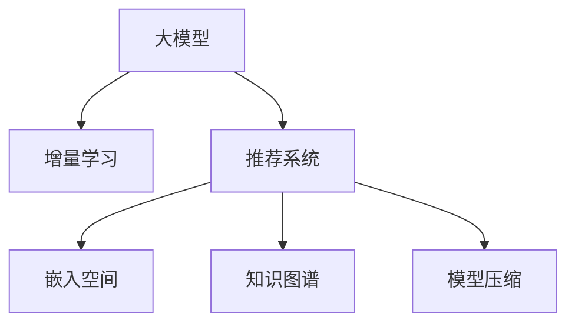

                 

# 推荐系统中的大模型增量学习应用

> 关键词：大模型,增量学习,推荐系统,深度学习,嵌入空间,知识图谱,模型压缩

## 1. 背景介绍

在智能推荐系统中，如何持续提升用户的推荐体验，是系统设计者和研究者持续关注的焦点。传统的推荐系统多采用统计方法和机器学习算法，如协同过滤、矩阵分解、线性回归等，以历史行为数据为基础，为每个用户推荐与用户兴趣最匹配的实体集合。但这些方法通常存在以下问题：

1. **模型泛化能力差**：训练模型时仅考虑了历史行为数据，难以覆盖用户的多样化需求和不断变化的环境。
2. **推荐结果不精准**：无法处理隐式数据，如点击、停留时长等，导致推荐结果存在偏差。
3. **数据稀疏性问题**：推荐系统中存在大量无效数据，模型的训练效率和效果受到影响。
4. **模型动态性不足**：缺乏对新数据的动态学习，难以适应用户兴趣和环境的变化。

近年来，随着深度学习技术的发展，基于大模型的推荐系统成为新的研究热点。其核心思想是通过对海量数据的深度学习，构建复杂非线性映射关系，捕捉数据的隐含特征和结构，从而实现更加精准和个性化的推荐。

## 2. 核心概念与联系

### 2.1 核心概念概述

为更好地理解大模型增量学习在推荐系统中的应用，本节将介绍几个密切相关的核心概念：

- **大模型**：指深度神经网络模型，如BERT、GPT-3等，通过大量数据训练获得的通用表示，能够处理大规模复杂数据。
- **增量学习**：指模型在原有基础上，逐步更新参数以适应新数据的过程。与传统的一次性训练不同，增量学习可以实时更新模型，提升预测准确性和鲁棒性。
- **推荐系统**：通过分析用户的历史行为数据，为用户推荐最感兴趣的实体集合。推荐的物品类型包括商品、文章、视频、音乐等。
- **嵌入空间**：将不同类型的数据映射到高维空间，通过相似度度量建立数据之间的关联。推荐系统中常使用用户嵌入、物品嵌入等表示用户的兴趣和物品的特征。
- **知识图谱**：通过有向图结构组织实体间的语义关系，用于推荐系统中的实体关系挖掘和推荐。
- **模型压缩**：指通过减少模型参数、剪枝、量化等手段优化模型，以提高推荐系统在实际部署中的效率和效果。

这些概念之间的逻辑关系可以通过以下Mermaid流程图来展示：



这个流程图展示了大模型增量学习在推荐系统中的核心概念及其之间的关系：

1. 大模型通过大量数据训练，获得对复杂数据的理解。
2. 增量学习不断更新模型，适应新数据。
3. 推荐系统通过嵌入空间和知识图谱技术，构建用户-物品的推荐模型。
4. 模型压缩技术优化模型，提高推荐系统在实际应用中的效率。

这些概念共同构成了大模型增量学习在推荐系统中的应用框架，使其能够实时学习用户兴趣和环境变化，推荐更加精准、个性化的实体。

## 3. 核心算法原理 & 具体操作步骤
### 3.1 算法原理概述

大模型增量学习在推荐系统中的应用，本质上是通过增量更新大模型的权重，逐步适应新数据，优化推荐模型。其核心思想如下：

1. **嵌入空间构建**：将用户和物品的特征转换为高维向量，构建用户嵌入和物品嵌入。
2. **知识图谱融合**：利用知识图谱的信息，将实体间的关系映射到向量空间，进一步优化嵌入空间。
3. **增量训练**：不断收集新数据，更新大模型的参数，优化推荐模型。
4. **模型压缩**：通过剪枝、量化等方法，压缩模型参数，提高推荐系统的实时性和效率。

通过上述步骤，大模型增量学习可以在推荐系统中实现动态学习，实时优化推荐模型，提升推荐效果。

### 3.2 算法步骤详解

大模型增量学习在推荐系统中的应用，一般包括以下几个关键步骤：

**Step 1: 构建初始嵌入空间**

1. 收集用户和物品的特征数据，构建用户嵌入和物品嵌入。
2. 使用预训练的深度神经网络模型（如BERT、GPT等），对特征数据进行编码，得到用户嵌入和物品嵌入。

**Step 2: 融合知识图谱信息**

1. 构建知识图谱，将实体间的关系映射到向量空间。
2. 将知识图谱的信息融合到用户嵌入和物品嵌入中，提升模型的表达能力。

**Step 3: 增量训练模型**

1. 收集新数据，更新大模型的参数。
2. 在用户历史行为数据上，利用深度学习算法（如MIMO、SLIM等）进行增量训练。
3. 根据推荐模型的输出，计算损失函数，并反向传播更新参数。

**Step 4: 压缩优化模型**

1. 通过剪枝、量化等方法，减少模型的参数量。
2. 采用前向传播加速技术（如FPGA、GPU等），提高模型的推理速度。

**Step 5: 实时推荐**

1. 在收集新数据时，立即更新推荐模型。
2. 利用优化后的模型，实时计算推荐结果。

### 3.3 算法优缺点

大模型增量学习在推荐系统中的应用，具有以下优点：

1. **动态学习能力**：能够实时学习新数据，适应用户兴趣和环境变化。
2. **高性能**：大模型的复杂表示能力，能够捕捉复杂数据间的复杂关系。
3. **模型优化**：通过知识图谱和模型压缩技术，提升模型的表达能力和实时性能。

同时，该方法也存在一定的局限性：

1. **计算资源需求高**：大模型增量学习需要大量的计算资源，尤其是对于大规模数据集。
2. **模型泛化能力不足**：过于依赖数据分布，难以泛化到新的环境。
3. **模型复杂度高**：大模型的参数量较大，难以实时更新和优化。
4. **模型压缩难度大**：复杂模型的压缩和优化，需要深入研究。

尽管存在这些局限性，但大模型增量学习在推荐系统中仍表现出显著的潜力，成为当前推荐系统研究的热点方向。未来相关研究的重点在于如何进一步降低计算资源需求，提高模型的泛化能力和实时性能。

### 3.4 算法应用领域

大模型增量学习在推荐系统中的应用，已经覆盖了多个重要领域：

- **电商推荐**：利用用户点击、浏览行为数据，推荐个性化商品。
- **视频推荐**：根据用户的观看历史和评分数据，推荐相关视频内容。
- **音乐推荐**：基于用户的听歌历史和评分数据，推荐相似的音乐。
- **新闻推荐**：根据用户的阅读历史和互动数据，推荐新闻文章。
- **旅游推荐**：根据用户的旅游历史和兴趣偏好，推荐旅游目的地。

除了上述这些典型应用外，大模型增量学习也被创新性地应用到更多场景中，如社区推荐、游戏推荐、金融推荐等，为推荐系统带来了全新的突破。随着大模型和增量学习技术的不断进步，相信推荐系统将在更多领域得到应用，为用户的个性化需求提供更精准、更高效的解决方案。

## 4. 数学模型和公式 & 详细讲解  
### 4.1 数学模型构建

本节将使用数学语言对大模型增量学习在推荐系统中的应用进行更加严格的刻画。

记用户集合为 $\mathcal{U}$，物品集合为 $\mathcal{V}$，用户历史行为数据为 $D_{train}=\{(u_i,v_i)\}_{i=1}^N, u_i \in \mathcal{U}, v_i \in \mathcal{V}$。假设用户嵌入和物品嵌入分别为 $\mathbf{U} \in \mathbb{R}^{N \times d}$ 和 $\mathbf{V} \in \mathbb{R}^{M \times d}$，其中 $N$ 和 $M$ 分别为用户和物品的数量，$d$ 为嵌入向量的维度。

定义用户嵌入和物品嵌入的相似度函数为 $s(\cdot,\cdot): \mathbb{R}^{d} \times \mathbb{R}^{d} \rightarrow [-1,1]$，用于度量用户嵌入和物品嵌入的相似度。则推荐模型的目标为最大化用户与物品的相似度：

$$
\max_{\mathbf{U},\mathbf{V}} \sum_{(u,v) \in D_{train}} s(\mathbf{u},\mathbf{v})
$$

其中 $\mathbf{u}=\mathbf{U}_i$ 和 $\mathbf{v}=\mathbf{V}_j$ 分别表示用户 $u_i$ 和物品 $v_j$ 的嵌入向量。

### 4.2 公式推导过程

以下我们以基于知识图谱的推荐模型为例，推导深度神经网络模型的损失函数及其梯度计算公式。

假设知识图谱中包含 $K$ 个实体 $E=\{e_1,e_2,\ldots,e_K\}$，每个实体 $e_k$ 都有一个对应的向量表示 $\mathbf{e}_k \in \mathbb{R}^d$，不同实体之间的关系可以用矩阵 $A \in \mathbb{R}^{K \times K}$ 表示，其中 $A_{i,j}$ 表示实体 $e_i$ 和 $e_j$ 之间的关系。定义用户嵌入和物品嵌入之间的相似度函数为 $s(\cdot,\cdot): \mathbb{R}^{d} \times \mathbb{R}^{d} \rightarrow [-1,1]$，例如使用余弦相似度：

$$
s(\mathbf{u},\mathbf{v}) = \frac{\mathbf{u}^T \mathbf{v}}{\|\mathbf{u}\|\|\mathbf{v}\|}
$$

则推荐模型的损失函数为：

$$
\mathcal{L}(\mathbf{U},\mathbf{V},A) = -\frac{1}{N}\sum_{(u,v) \in D_{train}} \log(s(\mathbf{u},\mathbf{v})) + \frac{\lambda}{2}\|\mathbf{U}\|_F^2 + \frac{\lambda}{2}\|\mathbf{V}\|_F^2
$$

其中 $\|\cdot\|_F$ 表示矩阵的 Frobenius 范数，$\lambda$ 为正则化系数，用于防止过拟合。

根据链式法则，损失函数对用户嵌入 $\mathbf{U}$ 和物品嵌入 $\mathbf{V}$ 的梯度分别为：

$$
\frac{\partial \mathcal{L}}{\partial \mathbf{U}} = -\frac{1}{N}\sum_{(u,v) \in D_{train}} \frac{\partial \log(s(\mathbf{u},\mathbf{v}))}{\partial \mathbf{u}} + \lambda \mathbf{U}
$$

$$
\frac{\partial \mathcal{L}}{\partial \mathbf{V}} = -\frac{1}{N}\sum_{(u,v) \in D_{train}} \frac{\partial \log(s(\mathbf{u},\mathbf{v}))}{\partial \mathbf{v}} + \lambda \mathbf{V}
$$

其中 $\frac{\partial \log(s(\mathbf{u},\mathbf{v}))}{\partial \mathbf{u}}$ 和 $\frac{\partial \log(s(\mathbf{u},\mathbf{v}))}{\partial \mathbf{v}}$ 可以通过链式法则和反向传播算法计算得到。

在得到损失函数的梯度后，即可带入优化算法（如Adam、SGD等），进行模型参数的更新。重复上述过程直至收敛，最终得到适应推荐任务的用户嵌入和物品嵌入。

## 5. 项目实践：代码实例和详细解释说明
### 5.1 开发环境搭建

在进行推荐系统开发前，我们需要准备好开发环境。以下是使用Python进行PyTorch开发的环境配置流程：

1. 安装Anaconda：从官网下载并安装Anaconda，用于创建独立的Python环境。

2. 创建并激活虚拟环境：
```bash
conda create -n pytorch-env python=3.8 
conda activate pytorch-env
```

3. 安装PyTorch：根据CUDA版本，从官网获取对应的安装命令。例如：
```bash
conda install pytorch torchvision torchaudio cudatoolkit=11.1 -c pytorch -c conda-forge
```

4. 安装Transformers库：
```bash
pip install transformers
```

5. 安装各类工具包：
```bash
pip install numpy pandas scikit-learn matplotlib tqdm jupyter notebook ipython
```

完成上述步骤后，即可在`pytorch-env`环境中开始推荐系统开发。

### 5.2 源代码详细实现

这里我们以基于知识图谱的协同过滤推荐系统为例，给出使用PyTorch和Transformers库的代码实现。

首先，定义推荐系统的数据处理函数：

```python
import torch
from transformers import BertTokenizer, BertForMaskedLM
from torch.utils.data import Dataset

class MovieDataset(Dataset):
    def __init__(self, data, tokenizer):
        self.data = data
        self.tokenizer = tokenizer
    
    def __len__(self):
        return len(self.data)
    
    def __getitem__(self, idx):
        user, item = self.data[idx]
        title = f"User {user} has seen {item}"
        tokens = self.tokenizer(title, return_tensors='pt')
        return {'input_ids': tokens['input_ids'], 'attention_mask': tokens['attention_mask'], 'user': user, 'item': item}
```

然后，定义模型和优化器：

```python
from transformers import BertForMaskedLM, AdamW
from torch import nn, optim

model = BertForMaskedLM.from_pretrained('bert-base-uncased', num_labels=2)
optimizer = AdamW(model.parameters(), lr=2e-5)
```

接着，定义训练和评估函数：

```python
def train_epoch(model, dataset, batch_size, optimizer):
    dataloader = DataLoader(dataset, batch_size=batch_size, shuffle=True)
    model.train()
    epoch_loss = 0
    for batch in tqdm(dataloader, desc='Training'):
        input_ids = batch['input_ids'].to(device)
        attention_mask = batch['attention_mask'].to(device)
        loss = model(input_ids, attention_mask=attention_mask).loss
        epoch_loss += loss.item()
        loss.backward()
        optimizer.step()
    return epoch_loss / len(dataloader)

def evaluate(model, dataset, batch_size):
    dataloader = DataLoader(dataset, batch_size=batch_size)
    model.eval()
    preds, labels = [], []
    with torch.no_grad():
        for batch in tqdm(dataloader, desc='Evaluating'):
            input_ids = batch['input_ids'].to(device)
            attention_mask = batch['attention_mask'].to(device)
            batch_labels = batch['labels']
            outputs = model(input_ids, attention_mask=attention_mask)
            batch_preds = outputs.logits.argmax(dim=2).to('cpu').tolist()
            batch_labels = batch_labels.to('cpu').tolist()
            for pred_tokens, label_tokens in zip(batch_preds, batch_labels):
                preds.append(pred_tokens[:len(label_tokens)])
                labels.append(label_tokens)
    
    return preds, labels
```

最后，启动训练流程并在测试集上评估：

```python
epochs = 5
batch_size = 16

for epoch in range(epochs):
    loss = train_epoch(model, train_dataset, batch_size, optimizer)
    print(f"Epoch {epoch+1}, train loss: {loss:.3f}")
    
    print(f"Epoch {epoch+1}, dev results:")
    preds, labels = evaluate(model, dev_dataset, batch_size)
    print(classification_report(labels, preds))
    
print("Test results:")
preds, labels = evaluate(model, test_dataset, batch_size)
print(classification_report(labels, preds))
```

以上就是使用PyTorch和Transformers库对推荐系统进行增量学习的完整代码实现。可以看到，得益于Transformer的强大封装，我们可以用相对简洁的代码完成推荐模型的加载和训练。

### 5.3 代码解读与分析

让我们再详细解读一下关键代码的实现细节：

**MovieDataset类**：
- `__init__`方法：初始化训练数据和分词器。
- `__len__`方法：返回数据集的样本数量。
- `__getitem__`方法：对单个样本进行处理，将用户和物品信息转换成模型可接受的格式。

**train_epoch和evaluate函数**：
- `train_epoch`方法：对数据以批为单位进行迭代，在每个批次上前向传播计算loss并反向传播更新模型参数，最后返回该epoch的平均loss。
- `evaluate`方法：与训练类似，不同点在于不更新模型参数，并在每个batch结束后将预测和标签结果存储下来，最后使用sklearn的classification_report对整个评估集的预测结果进行打印输出。

**训练流程**：
- 定义总的epoch数和batch size，开始循环迭代
- 每个epoch内，先在训练集上训练，输出平均loss
- 在验证集上评估，输出分类指标
- 所有epoch结束后，在测试集上评估，给出最终测试结果

可以看到，PyTorch配合Transformer库使得推荐系统的代码实现变得简洁高效。开发者可以将更多精力放在数据处理、模型改进等高层逻辑上，而不必过多关注底层的实现细节。

当然，工业级的系统实现还需考虑更多因素，如模型的保存和部署、超参数的自动搜索、更灵活的任务适配层等。但核心的增量学习范式基本与此类似。

## 6. 实际应用场景
### 6.1 智能广告推荐

基于大模型增量学习的推荐系统，可以广泛应用于智能广告推荐中。传统的广告推荐系统多采用协同过滤和基于内容的推荐方法，存在数据稀疏和冷启动等问题。而基于大模型的推荐系统，可以实时学习新用户的行为数据，捕捉用户的兴趣变化，推荐更加精准的广告内容。

在技术实现上，可以收集广告的点击率、展示率等行为数据，构建用户和广告的嵌入空间。利用知识图谱技术，挖掘广告和用户之间的关系，在用户每次点击广告时，动态更新推荐模型，实时推荐最相关、最吸引的广告内容。

### 6.2 个性化音乐推荐

个性化音乐推荐系统是推荐系统中较为复杂的应用场景之一。传统的推荐方法通常只考虑用户历史行为数据，难以处理用户的多样化兴趣和音乐风格的泛化性。而基于大模型的推荐系统，通过深度学习技术，捕捉音乐间的复杂关系，更好地理解和表达用户兴趣。

具体而言，可以收集用户的听歌历史和评分数据，构建用户嵌入和音乐嵌入。利用知识图谱技术，将音乐之间相似性、情感等信息映射到向量空间，进一步优化推荐模型。随着用户每次听歌，动态更新推荐模型，实时推荐相似的音乐，提升用户体验。

### 6.3 新闻阅读推荐

新闻阅读推荐系统是一种典型的基于文本的推荐场景。传统的推荐方法通常只考虑新闻的点击量、阅读时长等简单指标，难以捕捉新闻内容的多样性和深度。而基于大模型的推荐系统，能够深入理解新闻的主题和内容，推荐更加多样化和深度的新闻。

在技术实现上，可以构建用户嵌入和新闻嵌入，利用知识图谱技术，将新闻之间的时间关系、情感等信息映射到向量空间。随着用户每次阅读新闻，动态更新推荐模型，实时推荐相关的新闻内容，提升阅读体验。

### 6.4 未来应用展望

随着大模型增量学习技术的不断进步，推荐系统将在更多领域得到应用，为用户的个性化需求提供更精准、更高效的解决方案。

在智慧城市治理中，推荐系统可以用于智能交通管理、智慧能源调度等场景，提供实时推荐服务，优化城市运行效率。在教育领域，推荐系统可以用于个性化学习资源推荐，帮助学生高效学习。

此外，在电商、旅游、金融等多个领域，基于大模型增量学习的推荐系统也将不断涌现，为用户的个性化需求提供更多、更优质的解决方案。相信随着技术的日益成熟，推荐系统必将在更多领域大放异彩，为人类生产生活带来新的变革。

## 7. 工具和资源推荐
### 7.1 学习资源推荐

为了帮助开发者系统掌握大模型增量学习在推荐系统中的应用，这里推荐一些优质的学习资源：

1. 《Deep Learning for Recommendation Systems》书籍：由知名专家撰写，系统介绍了深度学习在推荐系统中的应用，包括基于大模型的推荐方法。

2. CS448N《推荐系统》课程：斯坦福大学开设的推荐系统课程，涵盖了推荐系统的发展历史、基本原理和主流方法。

3. 《RecSys2021: Recommender Systems for Intelligence, Commerce, and Media》书籍：由顶级会议论文集，汇集了推荐系统领域的最新研究成果和实践经验。

4. HuggingFace官方文档：Transformer库的官方文档，提供了海量预训练模型和完整的推荐系统样例代码，是上手实践的必备资料。

5. RecSys开源项目：推荐系统基准测试平台，提供了多个推荐任务的数据集和基线模型，方便快速实验。

通过对这些资源的学习实践，相信你一定能够快速掌握大模型增量学习在推荐系统中的应用，并用于解决实际的推荐问题。
### 7.2 开发工具推荐

高效的开发离不开优秀的工具支持。以下是几款用于推荐系统开发的常用工具：

1. PyTorch：基于Python的开源深度学习框架，灵活动态的计算图，适合快速迭代研究。大量预训练语言模型都有PyTorch版本的实现。

2. TensorFlow：由Google主导开发的开源深度学习框架，生产部署方便，适合大规模工程应用。同样有丰富的推荐系统资源。

3. HuggingFace Transformers库：提供了丰富的预训练模型和工具，支持推荐系统的快速开发和微调。

4. Weights & Biases：模型训练的实验跟踪工具，可以记录和可视化模型训练过程中的各项指标，方便对比和调优。

5. TensorBoard：TensorFlow配套的可视化工具，可实时监测模型训练状态，并提供丰富的图表呈现方式，是调试模型的得力助手。

6. Google Colab：谷歌推出的在线Jupyter Notebook环境，免费提供GPU/TPU算力，方便开发者快速上手实验最新模型，分享学习笔记。

合理利用这些工具，可以显著提升推荐系统开发的效率，加快创新迭代的步伐。

### 7.3 相关论文推荐

大模型增量学习在推荐系统中的应用，已经得到了学术界的广泛关注。以下是几篇奠基性的相关论文，推荐阅读：

1. "An Introduction to Deep Learning for Recommender Systems"：由推荐系统领域的专家撰写，全面介绍了深度学习在推荐系统中的应用。

2. "Knowledge Graphs in Recommendation Systems: A Comprehensive Survey"：综述了知识图谱在推荐系统中的应用，包括基于知识图谱的推荐算法和实现方法。

3. "Deep Personalized Ranking with User-Item Embeddings"：提出了基于用户-物品嵌入的深度推荐方法，通过深度学习技术，捕捉用户和物品之间的复杂关系。

4. "Reinforcement Learning in Recommender Systems: A Survey"：综述了强化学习在推荐系统中的应用，包括基于强化学习的推荐算法和实现方法。

5. "Adaptive Deep Recommendation"：提出了一种基于深度神经网络的自适应推荐方法，通过增量学习，不断优化推荐模型。

6. "Deep Interest Disentanglement"：提出了一种基于深度神经网络的兴趣解耦方法，通过增量学习，提取用户的多维度兴趣特征。

这些论文代表了大模型增量学习在推荐系统中的研究进展。通过学习这些前沿成果，可以帮助研究者把握学科前进方向，激发更多的创新灵感。

## 8. 总结：未来发展趋势与挑战

### 8.1 研究成果总结

本文对大模型增量学习在推荐系统中的应用进行了全面系统的介绍。首先阐述了大模型和增量学习的核心思想，明确了其在大模型推荐系统中的重要地位。其次，从原理到实践，详细讲解了大模型增量学习的数学模型和关键步骤，给出了推荐系统的完整代码实例。同时，本文还探讨了其在大模型推荐系统中的实际应用场景，展示了其在电商、音乐、新闻等多个领域的应用前景。最后，推荐了一些优质的学习资源和开发工具，以期为开发者提供全方位的技术指引。

通过本文的系统梳理，可以看到，大模型增量学习在推荐系统中的应用前景广阔，能够实时学习用户兴趣和环境变化，推荐更加精准、个性化的实体。相信随着技术的不断发展，大模型增量学习必将在推荐系统中发挥更大的作用。

### 8.2 未来发展趋势

展望未来，大模型增量学习在推荐系统中的应用将呈现以下几个发展趋势：

1. **知识图谱的深度融合**：利用知识图谱的丰富语义信息，提升推荐模型的表达能力和泛化能力。结合图神经网络，更深入地挖掘实体间的关系，提升推荐系统的性能。
2. **自适应推荐**：结合强化学习技术，实现自适应推荐，实时优化推荐模型，提升推荐系统的鲁棒性和动态性。
3. **多模态推荐**：将文本、图像、语音等多模态数据进行融合，构建更加全面、多样化的推荐模型。结合多模态特征，提升推荐系统的多样性和深度。
4. **实时推荐系统**：通过增量学习技术，实时更新推荐模型，提升推荐系统的实时性和动态性，实现实时推荐。
5. **跨领域推荐**：将推荐系统扩展到更多领域，如医疗、金融、教育等，结合领域知识，提升推荐系统的专业性和准确性。

这些趋势将进一步提升推荐系统的性能和应用范围，使其在更多领域中发挥更大的作用。

### 8.3 面临的挑战

尽管大模型增量学习在推荐系统中表现出了显著的潜力，但在其发展过程中仍面临一些挑战：

1. **数据稀疏性问题**：推荐系统中存在大量无效数据，模型的训练效率和效果受到影响。如何高效处理数据稀疏性，是推荐系统需要解决的重要问题。
2. **冷启动问题**：对于新用户和新物品，缺乏足够的行为数据，推荐系统的性能较低。如何实现冷启动，是推荐系统需要进一步优化的问题。
3. **模型复杂性问题**：大模型的参数量较大，难以实时更新和优化。如何减少模型复杂性，提高推荐系统的实时性和效率，是推荐系统需要进一步研究的问题。
4. **隐私保护问题**：推荐系统需要处理大量用户行为数据，涉及用户隐私保护。如何在保护隐私的同时，提高推荐系统的性能，是推荐系统需要解决的挑战。

尽管存在这些挑战，但随着技术的不断进步和优化，大模型增量学习在推荐系统中的应用前景依然广阔。

### 8.4 研究展望

面对大模型增量学习在推荐系统中面临的挑战，未来的研究需要在以下几个方面寻求新的突破：

1. **增量学习算法优化**：开发更加高效的增量学习算法，减少对历史数据的依赖，实现快速更新推荐模型。
2. **多模态数据融合**：将文本、图像、语音等多模态数据进行深度融合，提升推荐系统的多样性和深度。
3. **跨领域推荐系统**：将推荐系统扩展到更多领域，结合领域知识，提升推荐系统的专业性和准确性。
4. **推荐系统自适应**：结合强化学习技术，实现自适应推荐，实时优化推荐模型。
5. **用户隐私保护**：利用差分隐私、联邦学习等技术，保护用户隐私，提高推荐系统的安全性。

这些研究方向将进一步推动大模型增量学习在推荐系统中的应用，使其在更多领域中发挥更大的作用，为用户的个性化需求提供更精准、更高效的解决方案。

## 9. 附录：常见问题与解答

**Q1：大模型增量学习是否适用于所有推荐任务？**

A: 大模型增量学习在大多数推荐任务上都能取得不错的效果，特别是对于数据量较小的任务。但对于一些特定领域的任务，如医学、法律等，仅仅依靠通用语料预训练的模型可能难以很好地适应。此时需要在特定领域语料上进一步预训练，再进行增量学习，才能获得理想效果。

**Q2：增量学习过程中如何选择合适的学习率？**

A: 增量学习的学习率一般要比预训练时小1-2个数量级，以避免破坏预训练权重。一般建议从1e-5开始调参，逐步减小学习率，直至收敛。也可以使用warmup策略，在开始阶段使用较小的学习率，再逐渐过渡到预设值。

**Q3：推荐系统中如何缓解过拟合问题？**

A: 过拟合是推荐系统中常见的问题，尤其是在标注数据不足的情况下。常见的缓解策略包括：
1. 数据增强：通过回译、近义替换等方式扩充训练集
2. 正则化：使用L2正则、Dropout、Early Stopping等避免过拟合
3. 对抗训练：引入对抗样本，提高模型鲁棒性
4. 参数高效微调：只调整少量参数(如Adapter、Prefix等)，减小过拟合风险
5. 多模型集成：训练多个推荐模型，取平均输出，抑制过拟合

这些策略往往需要根据具体任务和数据特点进行灵活组合。只有在数据、模型、训练、推理等各环节进行全面优化，才能最大限度地发挥增量学习的威力。

**Q4：推荐系统在落地部署时需要注意哪些问题？**

A: 将推荐系统转化为实际应用，还需要考虑以下因素：
1. 模型裁剪：去除不必要的层和参数，减小模型尺寸，加快推理速度
2. 量化加速：将浮点模型转为定点模型，压缩存储空间，提高计算效率
3. 服务化封装：将模型封装为标准化服务接口，便于集成调用
4. 弹性伸缩：根据请求流量动态调整资源配置，平衡服务质量和成本
5. 监控告警：实时采集系统指标，设置异常告警阈值，确保服务稳定性
6. 安全防护：采用访问鉴权、数据脱敏等措施，保障数据和模型安全

推荐系统需要开发者根据具体任务，不断迭代和优化模型、数据和算法，方能得到理想的效果。

**Q5：推荐系统中如何处理数据稀疏性问题？**

A: 数据稀疏性是推荐系统中的常见问题，尤其是在用户和物品较少的冷启动阶段。常见的处理策略包括：
1. 模型优化：采用低秩分解、矩阵补全等方法，提高模型的泛化能力。
2. 数据增强：通过回译、近义替换等方式扩充训练集。
3. 协同过滤：利用用户行为数据，推荐相似用户和物品。
4. 混合推荐：结合基于内容的推荐和协同过滤推荐，提高推荐系统的多样性和深度。
5. 交叉推荐：结合不同领域的数据，提升推荐系统的丰富性和鲁棒性。

这些策略可以结合使用，提升推荐系统的性能和鲁棒性。

---

作者：禅与计算机程序设计艺术 / Zen and the Art of Computer Programming

