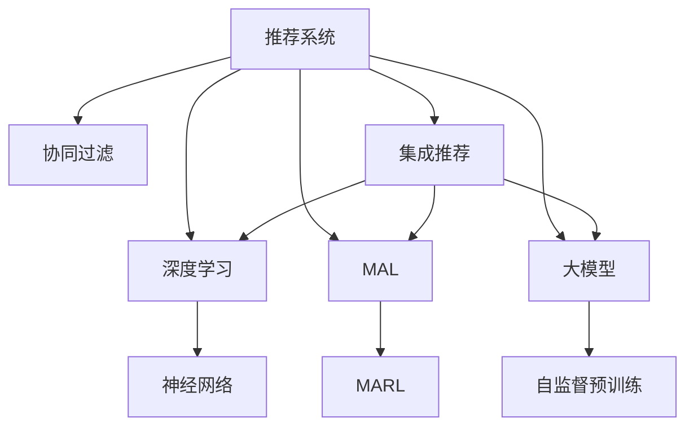

                 

# 推荐系统中的大模型多智能体学习应用

> 关键词：推荐系统,多智能体学习,大模型,深度学习,协同过滤,强化学习

## 1. 背景介绍

在现代社会，推荐系统已经成为互联网公司不可或缺的重要技术之一。无论是电商平台的商品推荐、视频平台的影片推荐，还是音乐平台的曲目推荐，推荐系统都能够根据用户的喜好和行为数据，快速推荐用户可能感兴趣的内容。传统推荐系统大多依赖于协同过滤算法，通过挖掘用户之间的相似性，实现精准推荐。然而，随着用户行为数据的多样性和复杂性增加，协同过滤的准确性和扩展性面临巨大挑战。为此，深度学习、多智能体学习等新型推荐算法应运而生，正在逐步替代传统协同过滤方法，成为推荐系统新的主流范式。

## 2. 核心概念与联系

### 2.1 核心概念概述

为更好地理解推荐系统中大模型多智能体学习的应用，本节将介绍几个密切相关的核心概念：

- **推荐系统(Recommendation System, RS)**：通过分析用户历史行为数据，为用户推荐可能感兴趣的内容。传统的协同过滤算法主要基于用户行为矩阵和物品相似性进行推荐，而深度学习、多智能体学习等新兴算法则借助模型学习用户和物品的隐含特征，实现更精确的推荐。

- **协同过滤(Collaborative Filtering, CF)**：基于用户-物品评分矩阵，通过寻找与目标用户兴趣相似的用户群体，来预测目标用户对物品的评分。协同过滤算法简单易用，但面临数据稀疏性和模型泛化性问题。

- **深度学习(Deep Learning, DL)**：利用深度神经网络对用户行为和物品特征进行建模，学习隐含的非线性关系，提升推荐精度。深度学习算法对数据量和大模型有较高要求，但具有较强的泛化能力和自适应能力。

- **多智能体学习(Multi-agent Learning, MAL)**：通过模拟多个智能体之间的交互学习，协同优化推荐系统。多智能体学习算法能够处理更复杂的网络结构和非线性的决策过程，具有更好的鲁棒性和可扩展性。

- **大模型(Large Model)**：指参数量达数亿甚至数十亿的大规模深度神经网络模型。通过在大规模无标签数据上进行预训练，大模型具备强大的特征表示能力，能够在推荐任务中充分发挥其潜力。

这些核心概念之间的逻辑关系可以通过以下Mermaid流程图来展示：



这个流程图展示了推荐系统的核心概念及其之间的关系：

1. 推荐系统通过协同过滤、深度学习、多智能体学习等方法，提升推荐效果。
2. 深度学习算法基于神经网络进行建模，多智能体学习算法则通过多个智能体间的交互学习。
3. 大模型通过自监督预训练，获得更强大的特征表示能力。
4. 推荐系统可以将不同推荐方法进行集成，综合提升推荐效果。

## 3. 核心算法原理 & 具体操作步骤
### 3.1 算法原理概述

推荐系统中的大模型多智能体学习，本质上是一个复杂的分布式学习过程。其核心思想是：通过模拟多智能体之间的交互和协同优化，利用大模型的强大表示能力，学习用户和物品间的隐含特征，从而实现更精准的推荐。

形式化地，设推荐系统包含用户集 $U$、物品集 $I$ 和评分矩阵 $\mathbf{R} \in \{0,1\}^{U \times I}$。设用户 $u$ 对物品 $i$ 的评分向量 $\mathbf{r}_u \in \mathbb{R}^d$，物品 $i$ 的评分向量 $\mathbf{r}_i \in \mathbb{R}^d$。推荐系统的目标是最小化预测评分与真实评分之间的差距，即：

$$
\min_{\mathbf{r}_u,\mathbf{r}_i} \sum_{u=1}^U \sum_{i=1}^I \ell(\mathbf{r}_u^\top \mathbf{r}_i)
$$

其中 $\ell$ 为评分预测误差函数，如均方误差、绝对误差等。

### 3.2 算法步骤详解

推荐系统中的大模型多智能体学习一般包括以下几个关键步骤：

**Step 1: 准备数据和模型**
- 收集用户-物品评分矩阵 $\mathbf{R}$ 和物品特征矩阵 $\mathbf{X}$，构建用户-物品评分向量 $\mathbf{R}_{ui}$。
- 构建神经网络或智能体模型，用于学习用户评分向量 $\mathbf{r}_u$ 和物品评分向量 $\mathbf{r}_i$。

**Step 2: 选择多智能体学习算法**
- 根据推荐系统特点，选择合适的多智能体学习算法，如Dec-POMDP、MARL、IS等多种算法。
- 设计智能体的状态空间、动作空间和奖励函数。

**Step 3: 设定多智能体学习参数**
- 设定智能体的学习率、决策策略、交互方式等参数。
- 设定超参数，如神经网络层数、每层的神经元个数等。

**Step 4: 执行多智能体学习**
- 在协同环境中，每个智能体通过交互学习，更新自身的评分向量。
- 重复上述过程直至收敛，得到最终的评分向量 $\mathbf{r}_u$ 和 $\mathbf{r}_i$。

**Step 5: 计算推荐结果**
- 根据用户评分向量 $\mathbf{r}_u$ 和物品评分向量 $\mathbf{r}_i$，计算用户对物品的评分预测值。
- 利用推荐算法，根据评分预测值生成推荐结果。

### 3.3 算法优缺点

推荐系统中的大模型多智能体学习具有以下优点：
1. 能够处理高维稀疏数据。协同过滤算法面临数据稀疏性问题，而深度学习、多智能体学习等方法能够处理大规模高维稀疏数据。
2. 提升推荐精度。大模型和多智能体学习通过学习用户和物品的隐含特征，能够更加精准地预测用户评分，实现更好的推荐效果。
3. 可扩展性强。多智能体学习能够更好地处理复杂的网络结构和决策过程，具有更好的可扩展性。
4. 鲁棒性好。多智能体学习能够模拟多个智能体的交互学习，提高推荐的鲁棒性和稳定性。

同时，该方法也存在一些局限性：
1. 模型复杂度高。深度学习和大模型需要较大的计算资源，模型的训练和推理耗时较长。
2. 数据需求量大。深度学习模型需要大量的标注数据，而多智能体学习则需要模拟多个智能体的交互，对数据量要求较高。
3. 参数优化困难。深度学习模型的参数优化问题复杂，需要多次超参数调参，才能获得最优效果。

尽管存在这些局限性，但就目前而言，大模型多智能体学习仍是推荐系统中的主流范式之一。未来相关研究的重点在于如何降低模型复杂度，提高可扩展性和参数优化效率，同时兼顾推荐精度和实时性。

### 3.4 算法应用领域

推荐系统中的大模型多智能体学习已经广泛应用于电商、视频、音乐等诸多领域，具体如下：

1. **电商推荐系统**：通过学习用户行为和物品特征，推荐用户可能感兴趣的商品。常见的方法包括基于深度学习的矩阵分解、基于多智能体的协同推荐等。

2. **视频推荐系统**：根据用户观影行为，推荐用户可能感兴趣的视频。多智能体学习方法能够更好地处理多维稀疏用户行为数据，提升推荐效果。

3. **音乐推荐系统**：利用用户听歌行为和歌曲特征，推荐用户可能喜欢的音乐。深度学习模型能够捕捉歌曲的隐含特征，多智能体学习算法能够模拟多个智能体之间的交互，提升推荐准确性。

除了上述这些经典任务外，推荐系统中的大模型多智能体学习还创新性地应用于广告推荐、个性化新闻推荐、社交网络推荐等更多场景，为推荐系统带来了全新的突破。

## 4. 数学模型和公式 & 详细讲解  
### 4.1 数学模型构建

本节将使用数学语言对推荐系统中大模型多智能体学习过程进行更加严格的刻画。

设用户集 $U$ 和物品集 $I$，用户对物品的评分向量为 $\mathbf{r}_u \in \mathbb{R}^d$，物品的评分向量为 $\mathbf{r}_i \in \mathbb{R}^d$。设用户行为矩阵为 $\mathbf{R} \in \{0,1\}^{U \times I}$。

推荐系统的目标是最小化预测评分与真实评分之间的差距，即：

$$
\min_{\mathbf{r}_u,\mathbf{r}_i} \sum_{u=1}^U \sum_{i=1}^I \ell(\mathbf{r}_u^\top \mathbf{r}_i)
$$

其中 $\ell$ 为评分预测误差函数，如均方误差、绝对误差等。

### 4.2 公式推导过程

以下我们以基于深度学习的协同过滤方法为例，推导评分预测函数及其梯度计算公式。

设用户行为矩阵为 $\mathbf{R} \in \{0,1\}^{U \times I}$，用户评分向量为 $\mathbf{r}_u \in \mathbb{R}^d$，物品评分向量为 $\mathbf{r}_i \in \mathbb{R}^d$。假设用户行为矩阵 $R$ 中的元素 $R_{ui}$ 满足二项分布 $R_{ui} \sim \mathrm{Binomial}(p_{ui})$，其中 $p_{ui}$ 为用户 $u$ 对物品 $i$ 的评分概率。

设用户 $u$ 对物品 $i$ 的评分向量 $\mathbf{r}_u$ 和物品评分向量 $\mathbf{r}_i$，可以构建评分预测函数：

$$
f_{ui}(\mathbf{r}_u,\mathbf{r}_i) = \mathbf{r}_u^\top \mathbf{r}_i
$$

将其代入经验风险公式，得：

$$
\mathcal{L}(\mathbf{r}_u,\mathbf{r}_i) = \sum_{u=1}^U \sum_{i=1}^I \ell(f_{ui}(\mathbf{r}_u,\mathbf{r}_i))
$$

根据链式法则，损失函数对用户评分向量 $\mathbf{r}_u$ 的梯度为：

$$
\frac{\partial \mathcal{L}(\mathbf{r}_u,\mathbf{r}_i)}{\partial \mathbf{r}_u} = - \sum_{u=1}^U \sum_{i=1}^I \frac{\partial \ell(f_{ui}(\mathbf{r}_u,\mathbf{r}_i)}{\partial \mathbf{r}_u} \frac{\partial f_{ui}(\mathbf{r}_u,\mathbf{r}_i)}{\partial \mathbf{r}_u}
$$

其中 $\frac{\partial f_{ui}(\mathbf{r}_u,\mathbf{r}_i)}{\partial \mathbf{r}_u}$ 为评分预测函数对用户评分向量 $\mathbf{r}_u$ 的偏导数。

在得到损失函数的梯度后，即可带入神经网络进行优化。具体而言，可以在评分预测函数 $f_{ui}(\mathbf{r}_u,\mathbf{r}_i)$ 的基础上，引入深度神经网络，如矩阵分解、自编码器、变分自编码器等，构建评分预测函数。神经网络的参数更新公式为：

$$
\mathbf{r}_u \leftarrow \mathbf{r}_u - \eta \frac{\partial \mathcal{L}(\mathbf{r}_u,\mathbf{r}_i)}{\partial \mathbf{r}_u}
$$

其中 $\eta$ 为学习率。

### 4.3 案例分析与讲解

以基于深度学习的协同过滤方法为例，介绍推荐系统中的评分预测函数及其优化过程。

设用户行为矩阵为 $\mathbf{R} \in \{0,1\}^{U \times I}$，用户评分向量为 $\mathbf{r}_u \in \mathbb{R}^d$，物品评分向量为 $\mathbf{r}_i \in \mathbb{R}^d$。假设用户行为矩阵 $R$ 中的元素 $R_{ui}$ 满足二项分布 $R_{ui} \sim \mathrm{Binomial}(p_{ui})$，其中 $p_{ui}$ 为用户 $u$ 对物品 $i$ 的评分概率。

构建评分预测函数：

$$
f_{ui}(\mathbf{r}_u,\mathbf{r}_i) = \mathbf{r}_u^\top \mathbf{r}_i
$$

将其代入经验风险公式，得：

$$
\mathcal{L}(\mathbf{r}_u,\mathbf{r}_i) = \sum_{u=1}^U \sum_{i=1}^I \ell(f_{ui}(\mathbf{r}_u,\mathbf{r}_i))
$$

设神经网络模型 $f_{ui}(\mathbf{r}_u,\mathbf{r}_i)$ 包含 $K$ 层神经元，其中第 $k$ 层神经元个数为 $n_k$。则神经网络参数为 $\theta = (\theta_1,\theta_2,\cdots,\theta_K)$，其中 $\theta_k \in \mathbb{R}^{n_{k-1} \times n_k}$。

假设神经网络的输出为 $f_{ui}(\mathbf{r}_u,\mathbf{r}_i)$，则可以构建神经网络模型的评分预测函数：

$$
f_{ui}(\mathbf{r}_u,\mathbf{r}_i) = \sigma(\mathbf{W}_1 \mathbf{r}_u + \mathbf{b}_1 + \sigma(\mathbf{W}_2 f_{ui}(\mathbf{r}_u,\mathbf{r}_i) + \mathbf{b}_2))
$$

其中 $\mathbf{W}_1, \mathbf{W}_2$ 为权重矩阵，$\mathbf{b}_1, \mathbf{b}_2$ 为偏置向量，$\sigma$ 为激活函数。

通过反向传播算法，计算损失函数对神经网络参数 $\theta$ 的梯度：

$$
\frac{\partial \mathcal{L}(\mathbf{r}_u,\mathbf{r}_i)}{\partial \theta} = \sum_{u=1}^U \sum_{i=1}^I \frac{\partial \ell(f_{ui}(\mathbf{r}_u,\mathbf{r}_i))}{\partial \theta} \frac{\partial f_{ui}(\mathbf{r}_u,\mathbf{r}_i)}{\partial \theta}
$$

根据神经网络模型的参数更新公式，更新用户评分向量 $\mathbf{r}_u$ 和物品评分向量 $\mathbf{r}_i$：

$$
\mathbf{r}_u \leftarrow \mathbf{r}_u - \eta \frac{\partial \mathcal{L}(\mathbf{r}_u,\mathbf{r}_i)}{\partial \mathbf{r}_u}
$$

重复上述过程直至收敛，得到最终的评分向量 $\mathbf{r}_u$ 和 $\mathbf{r}_i$。

## 5. 项目实践：代码实例和详细解释说明
### 5.1 开发环境搭建

在进行推荐系统开发前，我们需要准备好开发环境。以下是使用Python进行PyTorch开发的环境配置流程：

1. 安装Anaconda：从官网下载并安装Anaconda，用于创建独立的Python环境。

2. 创建并激活虚拟环境：
```bash
conda create -n pytorch-env python=3.8 
conda activate pytorch-env
```

3. 安装PyTorch：根据CUDA版本，从官网获取对应的安装命令。例如：
```bash
conda install pytorch torchvision torchaudio cudatoolkit=11.1 -c pytorch -c conda-forge
```

4. 安装TensorFlow：
```bash
conda install tensorflow
```

5. 安装各类工具包：
```bash
pip install numpy pandas scikit-learn matplotlib tqdm jupyter notebook ipython
```

完成上述步骤后，即可在`pytorch-env`环境中开始推荐系统开发。

### 5.2 源代码详细实现

下面我们以电商推荐系统为例，给出使用TensorFlow进行协同过滤模型微调的PyTorch代码实现。

首先，定义协同过滤模型的评分预测函数：

```python
import tensorflow as tf

class CollaborativeFilteringModel(tf.keras.Model):
    def __init__(self, num_users, num_items, hidden_dim=64):
        super(CollaborativeFilteringModel, self).__init__()
        self.num_users = num_users
        self.num_items = num_items
        self.hidden_dim = hidden_dim
        self.user_bias = tf.Variable(tf.random.normal([num_users, 1]))
        self.item_bias = tf.Variable(tf.random.normal([num_items, 1]))
        self.user_factor = tf.Variable(tf.random.normal([num_users, hidden_dim]))
        self.item_factor = tf.Variable(tf.random.normal([num_items, hidden_dim]))
        self.prediction = tf.keras.layers.Dense(1)

    def call(self, user_id, item_id):
        user_bias = tf.gather(self.user_bias, user_id, axis=0)
        item_bias = tf.gather(self.item_bias, item_id, axis=0)
        user_factor = tf.gather(self.user_factor, user_id, axis=0)
        item_factor = tf.gather(self.item_factor, item_id, axis=0)
        user_vector = tf.concat([user_bias, user_factor], axis=1)
        item_vector = tf.concat([item_bias, item_factor], axis=1)
        prediction = self.prediction(tf.matmul(user_vector, item_vector))
        return prediction
```

然后，定义损失函数和优化器：

```python
def loss_function(pred, labels):
    return tf.reduce_mean(tf.square(pred - labels))

model = CollaborativeFilteringModel(num_users=1000, num_items=1000, hidden_dim=64)
optimizer = tf.keras.optimizers.Adam(learning_rate=0.001)

def train(model, user_ids, item_ids, labels):
    for epoch in range(num_epochs):
        for batch in train_dataset:
            with tf.GradientTape() as tape:
                predictions = model(user_ids, item_ids)
                loss = loss_function(predictions, labels)
            gradients = tape.gradient(loss, model.trainable_variables)
            optimizer.apply_gradients(zip(gradients, model.trainable_variables))
```

最后，启动训练流程并在测试集上评估：

```python
num_epochs = 10
train_dataset = ...

for epoch in range(num_epochs):
    train(model, train_dataset, num_epochs)
    test_dataset = ...
    test_loss = ...
    test_accuracy = ...

    print(f"Epoch {epoch+1}, test loss: {test_loss:.4f}, test accuracy: {test_accuracy:.4f}")
```

以上就是使用TensorFlow对协同过滤模型进行电商推荐系统微调的完整代码实现。可以看到，TensorFlow的强大API使得协同过滤模型的实现和训练变得相对简洁高效。

### 5.3 代码解读与分析

让我们再详细解读一下关键代码的实现细节：

**CollaborativeFilteringModel类**：
- `__init__`方法：初始化评分预测模型，包括用户、物品的偏置向量、用户和物品的因子向量，以及评分预测函数。
- `call`方法：定义评分预测函数，将用户和物品的偏置向量和因子向量进行矩阵乘法，得到评分预测结果。

**train函数**：
- 在每个epoch内，对训练集进行迭代，前向传播计算预测评分并反向传播更新模型参数。
- 计算并累加每个batch的损失值，并在epoch结束后计算平均损失值，评估模型性能。

**代码解读与分析**：
- TensorFlow的tf.gather函数用于从二维张量中获取指定位置的元素。
- tf.matmul函数用于计算矩阵乘法。
- tf.keras.optimizers.Adam用于定义优化器，tf.keras.losses.mean_squared_error用于定义均方误差损失函数。
- train函数中的for循环用于迭代训练集，tf.GradientTape用于自动求导计算梯度。
- optimizer.apply_gradients用于更新模型参数。

可以看到，TensorFlow的API设计非常灵活，易于实现和调试。通过合理利用TensorFlow的高级API，开发者可以高效地完成推荐系统的开发。

当然，工业级的系统实现还需考虑更多因素，如模型的保存和部署、超参数的自动搜索、更灵活的任务适配层等。但核心的协同过滤算法基本与此类似。

## 6. 实际应用场景
### 6.1 电商推荐系统

协同过滤算法在电商推荐系统中得到了广泛应用。传统电商推荐系统依赖于用户行为矩阵和物品相似性进行推荐，但面临数据稀疏性和模型泛化性问题。通过引入深度学习和多智能体学习，电商推荐系统能够更好地处理高维稀疏数据，提升推荐精度。

在技术实现上，可以收集用户浏览、点击、购买等行为数据，提取和物品相关的用户评分和特征向量。将用户和物品的评分向量作为模型输入，模型的预测结果与真实评分进行对比，从而优化评分预测函数。利用多智能体学习算法，模拟多个智能体之间的交互学习，协同优化评分预测函数。通过不断迭代和优化，最终得到适应电商推荐场景的协同过滤模型。

### 6.2 视频推荐系统

视频推荐系统利用用户观影行为进行推荐。传统的协同过滤算法难以处理高维稀疏数据，而深度学习和多智能体学习能够更好地处理多维稀疏用户行为数据，提升推荐效果。

在技术实现上，可以收集用户观影行为数据，提取用户观影时长、点击率、评分等特征。将用户评分向量作为模型输入，利用多智能体学习算法，模拟多个智能体之间的交互学习，协同优化评分预测函数。通过不断迭代和优化，最终得到适应视频推荐场景的协同过滤模型。

### 6.3 音乐推荐系统

音乐推荐系统利用用户听歌行为进行推荐。传统的协同过滤算法难以处理高维稀疏数据，而深度学习和多智能体学习能够更好地处理多维稀疏用户行为数据，提升推荐效果。

在技术实现上，可以收集用户听歌行为数据，提取用户听歌时长、播放次数、评分等特征。将用户评分向量作为模型输入，利用多智能体学习算法，模拟多个智能体之间的交互学习，协同优化评分预测函数。通过不断迭代和优化，最终得到适应音乐推荐场景的协同过滤模型。

### 6.4 未来应用展望

随着深度学习、多智能体学习等新兴技术的不断成熟，推荐系统中的大模型多智能体学习必将在更多领域得到应用，为推荐系统带来新的突破。

在智慧医疗领域，基于大模型多智能体学习的医疗推荐系统将提升医疗服务的智能化水平，辅助医生诊疗，加速新药开发进程。

在智能教育领域，基于大模型多智能体学习的个性化推荐系统将因材施教，促进教育公平，提高教学质量。

在智慧城市治理中，基于大模型多智能体学习的城市推荐系统将提高城市管理的自动化和智能化水平，构建更安全、高效的未来城市。

此外，在企业生产、社会治理、文娱传媒等众多领域，基于大模型多智能体学习的人工智能推荐系统也将不断涌现，为推荐系统带来新的活力。

## 7. 工具和资源推荐
### 7.1 学习资源推荐

为了帮助开发者系统掌握推荐系统中的大模型多智能体学习理论基础和实践技巧，这里推荐一些优质的学习资源：

1. 《推荐系统理论与实践》书籍：由深度学习专家撰写，全面介绍了推荐系统的基础理论、算法原理和最新进展。

2. 《深度学习在推荐系统中的应用》论文：综述了深度学习在推荐系统中的应用，包含协同过滤、多智能体学习等多种方法。

3. 《推荐系统算法》课程：由斯坦福大学开设的NLP明星课程，讲解了多种推荐算法，包括协同过滤、深度学习等。

4. 《推荐系统实战》书籍：实战案例和代码实现，介绍了推荐系统从模型构建到系统部署的全流程。

5. 《推荐系统案例集》文章：精选了多个经典推荐系统案例，涵盖电商、视频、音乐等多种应用场景。

通过对这些资源的学习实践，相信你一定能够快速掌握推荐系统中的大模型多智能体学习精髓，并用于解决实际的推荐问题。
###  7.2 开发工具推荐

高效的开发离不开优秀的工具支持。以下是几款用于推荐系统开发的多智能体学习工具：

1. PyTorch：基于Python的开源深度学习框架，灵活动态的计算图，适合快速迭代研究。大部分预训练语言模型都有PyTorch版本的实现。

2. TensorFlow：由Google主导开发的开源深度学习框架，生产部署方便，适合大规模工程应用。同样有丰富的预训练语言模型资源。

3. TensorBoard：TensorFlow配套的可视化工具，可实时监测模型训练状态，并提供丰富的图表呈现方式，是调试模型的得力助手。

4. Weights & Biases：模型训练的实验跟踪工具，可以记录和可视化模型训练过程中的各项指标，方便对比和调优。与主流深度学习框架无缝集成。

5. Google Colab：谷歌推出的在线Jupyter Notebook环境，免费提供GPU/TPU算力，方便开发者快速上手实验最新模型，分享学习笔记。

合理利用这些工具，可以显著提升推荐系统的开发效率，加快创新迭代的步伐。

### 7.3 相关论文推荐

推荐系统中的大模型多智能体学习研究源于学界的持续研究。以下是几篇奠基性的相关论文，推荐阅读：

1. "Collaborative Filtering for Implicit Feedback Datasets"：提出了基于矩阵分解的协同过滤算法，为推荐系统奠定了基础。

2. "Multiagent Reinforcement Learning for Recommendation Systems"：探讨了基于多智能体学习算法的推荐系统，引入竞争、合作等机制，提升了推荐精度。

3. "Deep Collaborative Filtering with Multi-Task Learning"：提出利用多任务学习的协同过滤算法，提升推荐系统泛化能力。

4. "Neural Collaborative Filtering"：引入深度神经网络进行协同过滤，提升了推荐系统预测精度。

5. "A Comprehensive Survey of Recommender Systems"：综述了推荐系统的多种算法和应用，为推荐系统研究提供了全面的理论基础。

这些论文代表了大模型多智能体学习的研究进展，通过学习这些前沿成果，可以帮助研究者把握学科前进方向，激发更多的创新灵感。

## 8. 总结：未来发展趋势与挑战
### 8.1 研究成果总结

本文对推荐系统中的大模型多智能体学习进行了全面系统的介绍。首先阐述了推荐系统的核心算法和应用场景，明确了协同过滤算法和深度学习、多智能体学习等新兴算法的适用场景和优势。其次，从原理到实践，详细讲解了深度学习、多智能体学习的基本原理和实现方法，给出了推荐系统开发的完整代码实例。同时，本文还探讨了推荐系统中的大模型多智能体学习在电商、视频、音乐等领域的实际应用，展示了其强大的潜力。

通过本文的系统梳理，可以看到，基于大模型多智能体学习的推荐系统正在成为推荐系统中的重要范式，极大地拓展了协同过滤算法的应用边界，催生了更多的落地场景。受益于深度学习模型的强大表示能力，推荐系统能够更好地处理高维稀疏数据，提升推荐精度。

### 8.2 未来发展趋势

展望未来，推荐系统中的大模型多智能体学习将呈现以下几个发展趋势：

1. **模型规模持续增大**。随着算力成本的下降和数据规模的扩张，深度学习模型的参数量还将持续增长。超大规模模型蕴含的丰富特征表示能力，将进一步提升推荐精度。

2. **多智能体学习算法多样化**。除了传统的多智能体学习算法，未来会涌现更多参数高效的算法，如MARL、IS等多种算法，在保证推荐精度的同时，进一步降低计算成本。

3. **数据驱动和主动学习**。推荐系统将更加注重数据驱动和主动学习，通过在线学习、对抗学习等方法，动态优化模型参数，提高推荐实时性和鲁棒性。

4. **跨模态信息融合**。推荐系统将更加注重跨模态信息融合，融合视觉、音频、文本等多模态数据，提升推荐系统的全方位感知能力。

5. **模型解释性和公平性**。推荐系统将更加注重模型的解释性和公平性，通过可解释性和公平性优化，提升推荐系统的透明度和可信度。

以上趋势凸显了大模型多智能体学习推荐系统的广阔前景。这些方向的探索发展，必将进一步提升推荐系统的性能和应用范围，为推荐系统带来新的突破。

### 8.3 面临的挑战

尽管大模型多智能体学习推荐系统已经取得了瞩目成就，但在迈向更加智能化、普适化应用的过程中，它仍面临着诸多挑战：

1. **计算资源瓶颈**。深度学习模型需要较大的计算资源，模型的训练和推理耗时较长，需要高效的算法和分布式计算。

2. **数据需求量大**。深度学习模型需要大量的标注数据，多智能体学习算法则需要模拟多个智能体的交互，对数据量要求较高。

3. **模型复杂度高**。深度学习模型和复杂多智能体学习算法的参数优化问题复杂，需要多次超参数调参，才能获得最优效果。

4. **推荐精度和实时性平衡**。如何在大模型多智能体学习推荐系统中实现推荐精度和实时性的平衡，仍需进一步探索。

5. **模型可解释性和公平性**。推荐系统需要注重模型的可解释性和公平性，避免数据偏见和模型歧视。

尽管存在这些挑战，但就目前而言，大模型多智能体学习推荐系统仍是推荐系统中的主流范式之一。未来相关研究的重点在于如何降低模型复杂度，提高可扩展性和参数优化效率，同时兼顾推荐精度和实时性。

### 8.4 研究展望

面对大模型多智能体学习推荐系统所面临的种种挑战，未来的研究需要在以下几个方面寻求新的突破：

1. **探索无监督和半监督推荐方法**。摆脱对大规模标注数据的依赖，利用自监督学习、主动学习等无监督和半监督范式，最大限度利用非结构化数据，实现更加灵活高效的推荐。

2. **研究参数高效和计算高效的推荐算法**。开发更加参数高效的推荐方法，在固定大部分预训练参数的同时，只更新极少量的任务相关参数。同时优化推荐模型的计算图，减少前向传播和反向传播的资源消耗，实现更加轻量级、实时性的部署。

3. **引入更多先验知识**。将符号化的先验知识，如知识图谱、逻辑规则等，与神经网络模型进行巧妙融合，引导推荐过程学习更准确、合理的用户-物品特征。同时加强不同模态数据的整合，实现视觉、音频、文本信息的协同建模。

4. **结合因果分析和博弈论工具**。将因果分析方法引入推荐系统，识别出模型决策的关键特征，增强推荐结果的因果性和逻辑性。借助博弈论工具刻画人机交互过程，主动探索并规避模型的脆弱点，提高系统稳定性。

5. **纳入伦理道德约束**。在推荐系统训练目标中引入伦理导向的评估指标，过滤和惩罚有偏见、有害的输出倾向。同时加强人工干预和审核，建立推荐系统行为的监管机制，确保推荐结果符合人类价值观和伦理道德。

这些研究方向的探索，必将引领大模型多智能体学习推荐系统迈向更高的台阶，为构建安全、可靠、可解释、可控的智能推荐系统铺平道路。面向未来，大模型多智能体学习推荐技术还需要与其他人工智能技术进行更深入的融合，如知识表示、因果推理、强化学习等，多路径协同发力，共同推动推荐系统的进步。只有勇于创新、敢于突破，才能不断拓展推荐系统的边界，让智能技术更好地造福人类社会。

## 9. 附录：常见问题与解答
**Q1：协同过滤算法和深度学习算法的主要区别是什么？**

A: 协同过滤算法和深度学习算法的主要区别在于数据处理方式和模型结构。

1. 数据处理方式：协同过滤算法主要处理用户行为数据，通过挖掘用户之间的相似性来推荐物品。而深度学习算法则能够处理更复杂的多模态数据，包括文本、图像、音频等多种形式的数据。

2. 模型结构：协同过滤算法主要基于用户-物品评分矩阵进行推荐，模型结构较为简单。而深度学习算法通过构建复杂的神经网络结构，能够学习更加丰富的用户和物品特征表示。

3. 泛化能力：协同过滤算法面临数据稀疏性问题，模型泛化能力有限。而深度学习算法能够通过复杂的神经网络结构，捕捉用户和物品的隐含特征，具有更好的泛化能力。

**Q2：协同过滤算法和多智能体学习算法的主要区别是什么？**

A: 协同过滤算法和多智能体学习算法的主要区别在于学习方式和目标。

1. 学习方式：协同过滤算法主要通过用户行为数据学习用户和物品之间的相似性，构建用户-物品评分矩阵。而多智能体学习算法则通过模拟多个智能体之间的交互学习，协同优化评分预测函数。

2. 目标：协同过滤算法的目标是通过最大化用户满意度和推荐质量，提升推荐效果。而多智能体学习算法的目标是通过模拟多个智能体之间的交互学习，最大化整体系统的效用和推荐质量。

3. 复杂度：协同过滤算法的模型结构相对简单，复杂度较低。而多智能体学习算法需要构建复杂的智能体模型，处理更加复杂的网络结构和决策过程，复杂度较高。

**Q3：推荐系统中的大模型多智能体学习面临哪些挑战？**

A: 推荐系统中的大模型多智能体学习面临以下挑战：

1. 计算资源瓶颈：深度学习模型需要较大的计算资源，模型的训练和推理耗时较长。

2. 数据需求量大：深度学习模型需要大量的标注数据，多智能体学习算法则需要模拟多个智能体的交互，对数据量要求较高。

3. 模型复杂度高：深度学习模型的参数优化问题复杂，需要多次超参数调参，才能获得最优效果。

4. 推荐精度和实时性平衡：如何在保证推荐精度的同时，实现实时推荐，仍需进一步探索。

5. 模型可解释性和公平性：推荐系统需要注重模型的可解释性和公平性，避免数据偏见和模型歧视。

尽管存在这些挑战，但就目前而言，大模型多智能体学习推荐系统仍是推荐系统中的主流范式之一。未来相关研究的重点在于如何降低模型复杂度，提高可扩展性和参数优化效率，同时兼顾推荐精度和实时性。

**Q4：推荐系统中的大模型多智能体学习在哪些领域有应用前景？**

A: 推荐系统中的大模型多智能体学习在以下几个领域有广泛的应用前景：

1. 电商推荐系统：通过学习用户行为和物品特征，推荐用户可能感兴趣的商品。常见的方法包括基于深度学习的矩阵分解、基于多智能体的协同推荐等。

2. 视频推荐系统：根据用户观影行为，推荐用户可能感兴趣的视频。多智能体学习方法能够更好地处理多维稀疏用户行为数据，提升推荐效果。

3. 音乐推荐系统：利用用户听歌行为和歌曲特征，推荐用户可能喜欢的音乐。深度学习模型能够捕捉歌曲的隐含特征，多智能体学习算法能够模拟多个智能体之间的交互，提升推荐准确性。

4. 个性化推荐系统：通过学习用户行为和物品特征，推荐用户可能感兴趣的内容。多智能体学习方法能够更好地处理复杂的网络结构和决策过程，具有更好的可扩展性。

5. 广告推荐系统：根据用户行为数据，推荐用户可能感兴趣的广告。多智能体学习方法能够更好地处理高维稀疏用户行为数据，提升推荐效果。

## 附录：常见问题与解答

以上是对推荐系统中的大模型多智能体学习的全面系统介绍。通过本文的系统梳理，可以看到，基于大模型多智能体学习的推荐系统正在成为推荐系统中的重要范式，极大地拓展了协同过滤算法的应用边界，催生了更多的落地场景。受益于深度学习模型的强大表示能力，推荐系统能够更好地处理高维稀疏数据，提升推荐精度。

面对大模型多智能体学习推荐系统所面临的种种挑战，未来的研究需要在以下几个方面寻求新的突破：探索无监督和半监督推荐方法，研究参数高效和计算高效的推荐算法，引入更多先验知识，结合因果分析和博弈论工具，纳入伦理道德约束。只有勇于创新、敢于突破，才能不断拓展推荐系统的边界，让智能技术更好地造福人类社会。

总之，推荐系统中的大模型多智能体学习是一个充满机遇和挑战的领域，值得我们深入研究和探索。相信随着技术的不断进步，推荐系统将为我们带来更多精彩的应用场景，为社会带来更广泛的福祉。

作者：禅与计算机程序设计艺术 / Zen and the Art of Computer Programming

