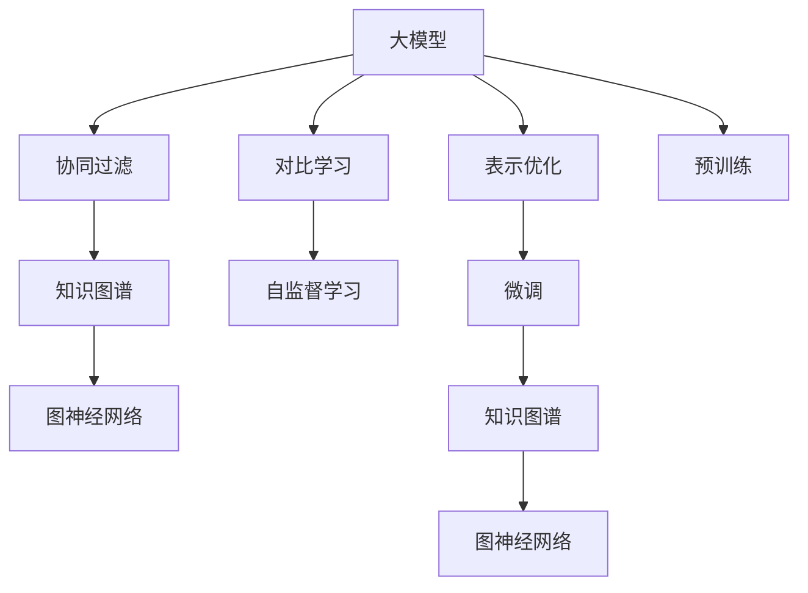

                 

# 推荐系统中的大模型对比学习与表示优化

> 关键词：大模型，对比学习，表示优化，推荐系统，知识图谱，协同过滤，图神经网络，自监督学习

## 1. 背景介绍

随着互联网和电子商务的迅猛发展，个性化推荐系统已成为人们日常生活中不可或缺的一部分。推荐系统不仅能够帮助用户发现感兴趣的内容，还能显著提高网站的用户参与度和留存率。然而，推荐系统的复杂性和多样性也带来了诸多挑战，其中数据稀疏性、冷启动问题、动态性等问题尤为突出。

近年来，深度学习技术在推荐系统中的应用取得了显著进展。通过构建多层神经网络模型，推荐系统已经能够处理更加复杂的推荐场景。尤其是深度学习中的大模型（Large Models），由于其具备强大的数据表征能力，在推荐系统中的应用越来越广泛。大模型如BERT、GPT等，通过预训练-微调的方式，可以高效地适应新的推荐任务。

尽管如此，大模型在推荐系统中仍面临诸多挑战。其高昂的计算成本和存储需求，使其难以在大规模推荐系统中得到广泛应用。此外，大模型在处理稀疏数据和动态数据时，也存在诸多问题。为了应对这些挑战，对比学习（Contrastive Learning）和表示优化（Representation Optimization）成为推荐系统中大模型应用的重要研究方向。

## 2. 核心概念与联系

### 2.1 核心概念概述

为了更好地理解大模型在推荐系统中的应用，本节将介绍几个密切相关的核心概念：

- **大模型（Large Models）**：指具有大量参数和强大数据表征能力的深度神经网络模型。这些模型通常通过自监督学习方式进行预训练，并可以适配特定的推荐任务进行微调。

- **对比学习（Contrastive Learning）**：一种自监督学习方法，通过最大化模型对正负样本的区分能力，来学习模型对数据的表征能力。在推荐系统中，对比学习可以用于提升模型的数据稀疏性和动态性处理能力。

- **表示优化（Representation Optimization）**：通过优化模型表示，提升模型对特定数据分布的适应能力。在推荐系统中，表示优化可以用于提升模型的泛化能力和鲁棒性。

- **协同过滤（Collaborative Filtering）**：一种常见的推荐算法，通过用户之间的相似性关系，对用户未交互过的物品进行推荐。协同过滤可以与大模型结合，提升推荐系统的个性化能力。

- **知识图谱（Knowledge Graphs）**：一种结构化的数据表示方式，用于描述实体之间的语义关系。在推荐系统中，知识图谱可以用于增强推荐结果的准确性和多样性。

- **图神经网络（Graph Neural Networks, GNNs）**：一种专门用于图数据处理的神经网络，可以用于对知识图谱进行建模和推理，提升推荐系统的效果。

- **自监督学习（Self-Supervised Learning）**：一种利用未标注数据进行模型训练的方法，可以用于提升模型的泛化能力和数据表征能力。

这些核心概念之间的逻辑关系可以通过以下Mermaid流程图来展示：



这个流程图展示了大模型在推荐系统中的核心概念及其之间的关系：

1. 大模型通过预训练获得基础能力。
2. 对比学习用于提升模型的数据稀疏性和动态性处理能力。
3. 表示优化用于提升模型的泛化能力和鲁棒性。
4. 协同过滤结合知识图谱和图神经网络，用于增强推荐系统的个性化能力。
5. 自监督学习用于大模型的预训练和微调。

这些概念共同构成了推荐系统中大模型的学习和应用框架，使其能够在各种场景下发挥强大的推荐能力。

## 3. 核心算法原理 & 具体操作步骤
### 3.1 算法原理概述

在推荐系统中，大模型的应用一般遵循以下步骤：

1. **数据预处理**：收集用户和物品的历史行为数据，并进行特征工程处理。

2. **模型预训练**：利用大模型在大量未标注数据上进行自监督学习，学习模型的基础表示能力。

3. **模型微调**：对预训练模型进行下游任务特定的微调，以适应推荐任务的要求。

4. **模型评估与优化**：通过评估指标（如准确率、召回率、点击率等）对模型性能进行评估，并根据评估结果进行模型优化。

### 3.2 算法步骤详解

#### 3.2.1 数据预处理

推荐系统中的数据预处理一般包括以下几个步骤：

1. **数据清洗**：去除异常值、噪声数据等，保证数据的完整性和准确性。

2. **特征工程**：将原始数据转化为模型可以处理的格式，如将用户行为转化为向量表示。

3. **数据划分**：将数据划分为训练集、验证集和测试集，用于模型训练、调参和评估。

#### 3.2.2 模型预训练

在推荐系统中，大模型一般通过自监督学习进行预训练。常用的自监督学习方法包括：

1. **负采样（Negative Sampling）**：从大量未交互的样本中随机采样，生成正负样本对，用于训练模型区分正负样本的能力。

2. **掩码语言模型（Masked Language Model）**：对文本数据进行随机掩码，训练模型对未见过的词汇进行预测。

3. **相似性学习（Similarity Learning）**：计算用户或物品之间的相似度，用于对相似的用户或物品进行聚类。

#### 3.2.3 模型微调

在预训练的基础上，模型通常需要进行微调以适应推荐任务的要求。微调过程一般包括以下几个步骤：

1. **任务适配层设计**：根据推荐任务的要求，设计合适的输出层和损失函数。

2. **微调超参数设置**：选择合适的优化器及其参数，如Adam、SGD等，设置学习率、批大小、迭代轮数等。

3. **训练与优化**：使用训练集对模型进行训练，并通过验证集对模型进行调参，最终在测试集上评估模型性能。

#### 3.2.4 模型评估与优化

模型评估一般包括以下几个指标：

1. **准确率（Accuracy）**：模型预测结果与真实结果一致的比例。

2. **召回率（Recall）**：模型正确预测正样本的比例。

3. **F1-score**：综合考虑准确率和召回率的指标。

4. **点击率（Click-through Rate, CTR）**：模型预测的点击结果与实际点击结果的比例。

### 3.3 算法优缺点

大模型在推荐系统中的应用具有以下优点：

1. **强大的数据表征能力**：大模型可以高效地学习复杂的用户和物品特征，提升推荐系统的个性化能力。

2. **泛化能力强**：通过预训练和微调，大模型可以适应不同的推荐任务和数据分布。

3. **可扩展性好**：大模型的规模可以通过增加训练数据和计算资源进行扩展。

4. **优化效果好**：大模型的自适应能力可以使得其在高维空间中进行优化，提升推荐系统的效果。

然而，大模型在推荐系统中也存在一些缺点：

1. **计算成本高**：大模型的参数量和计算量较大，训练和推理过程需要大量的计算资源。

2. **存储需求大**：大模型需要存储大量的参数，对存储资源提出了较高要求。

3. **稀疏数据处理困难**：大模型在处理稀疏数据时，容易受到噪声数据的影响。

4. **动态数据适应性差**：大模型在处理动态数据时，需要进行频繁的模型更新和重新训练。

### 3.4 算法应用领域

大模型在推荐系统中的应用已经覆盖了几乎所有的推荐场景，例如：

- **商品推荐**：对用户浏览、购买的历史数据进行建模，推荐用户可能感兴趣的商品。

- **内容推荐**：对用户的历史阅读、观看记录进行建模，推荐用户可能感兴趣的文章、视频等内容。

- **视频推荐**：对用户的观看历史进行建模，推荐用户可能感兴趣的视频。

- **音乐推荐**：对用户的听歌历史进行建模，推荐用户可能感兴趣的歌曲。

除了上述这些经典任务外，大模型还在广告推荐、个性化搜索、社交网络推荐等诸多场景中得到了广泛应用，为推荐系统带来了新的突破。

## 4. 数学模型和公式 & 详细讲解 & 举例说明
### 4.1 数学模型构建

在推荐系统中，大模型的应用通常涉及以下数学模型：

- **用户物品交互矩阵**：表示用户与物品之间的交互关系，通常采用稀疏矩阵表示。

- **特征向量表示**：将用户和物品表示为高维向量，用于计算用户和物品之间的相似度。

- **损失函数**：用于衡量模型预测结果与真实结果之间的差异，常用的损失函数包括交叉熵损失、均方误差损失等。

- **正则化项**：用于控制模型的复杂度，防止过拟合。常用的正则化项包括L1正则、L2正则等。

- **相似度度量**：用于计算用户或物品之间的相似度，常用的相似度度量包括余弦相似度、欧式距离等。

### 4.2 公式推导过程

#### 4.2.1 用户物品交互矩阵

用户物品交互矩阵 $X$ 表示用户与物品之间的交互关系，其中 $X_{ui} = 1$ 表示用户 $u$ 对物品 $i$ 进行了交互，否则为 $0$。

#### 4.2.2 特征向量表示

用户物品特征向量表示 $u$ 和 $i$，通常表示为用户和物品的词向量或预训练语言模型嵌入。

#### 4.2.3 损失函数

常用的推荐系统损失函数包括交叉熵损失和均方误差损失。以交叉熵损失为例，其公式如下：

$$
\mathcal{L} = -\frac{1}{N}\sum_{i=1}^{N}\sum_{u=1}^{M}(y_{ui}\log(p_{ui})+(1-y_{ui})\log(1-p_{ui}))
$$

其中 $y_{ui}$ 为用户 $u$ 对物品 $i$ 的评分，$p_{ui}$ 为模型预测的评分。

#### 4.2.4 正则化项

常用的正则化项包括L1正则和L2正则。L2正则的公式如下：

$$
\mathcal{R} = \frac{\lambda}{2}\sum_{i=1}^{N}\sum_{u=1}^{M}(\theta_{ui})^2
$$

其中 $\lambda$ 为正则化系数，$\theta_{ui}$ 为用户和物品的特征向量。

#### 4.2.5 相似度度量

常用的相似度度量包括余弦相似度和欧式距离。余弦相似度的公式如下：

$$
\text{similarity}(u,i) = \frac{u \cdot i}{\|u\|\|i\|}
$$

其中 $u$ 和 $i$ 为用户和物品的特征向量。

### 4.3 案例分析与讲解

以商品推荐系统为例，分析大模型的应用。

假设商品推荐系统需要推荐用户可能感兴趣的商品。系统首先对用户的历史行为数据进行预处理，得到用户物品交互矩阵 $X$ 和用户物品特征向量 $u$、$i$。然后，使用大模型对特征向量进行编码，得到用户和物品的隐含表示。最后，使用余弦相似度计算用户与物品之间的相似度，并根据相似度进行推荐。

在预训练阶段，大模型可以使用自监督学习方法，如掩码语言模型和负采样，学习用户和物品的隐含表示。在微调阶段，系统设计合适的输出层和损失函数，对大模型进行微调，使得模型能够准确预测用户对物品的评分。微调后的大模型可以用于推荐系统，提升推荐系统的个性化能力。

## 5. 项目实践：代码实例和详细解释说明
### 5.1 开发环境搭建

在进行推荐系统开发前，我们需要准备好开发环境。以下是使用Python进行PyTorch开发的环境配置流程：

1. 安装Anaconda：从官网下载并安装Anaconda，用于创建独立的Python环境。

2. 创建并激活虚拟环境：
```bash
conda create -n pytorch-env python=3.8 
conda activate pytorch-env
```

3. 安装PyTorch：根据CUDA版本，从官网获取对应的安装命令。例如：
```bash
conda install pytorch torchvision torchaudio cudatoolkit=11.1 -c pytorch -c conda-forge
```

4. 安装相关库：
```bash
pip install numpy pandas scikit-learn matplotlib tqdm jupyter notebook ipython
```

完成上述步骤后，即可在`pytorch-env`环境中开始推荐系统开发。

### 5.2 源代码详细实现

这里以商品推荐系统为例，给出使用Transformers库对BERT模型进行商品推荐系统微调的PyTorch代码实现。

首先，定义商品推荐系统的数据处理函数：

```python
from transformers import BertTokenizer
from torch.utils.data import Dataset
import torch

class MovieLensDataset(Dataset):
    def __init__(self, ratings, users, movies, tokenizer, max_len=128):
        self.ratings = ratings
        self.users = users
        self.movies = movies
        self.tokenizer = tokenizer
        self.max_len = max_len
        
    def __len__(self):
        return len(self.ratings)
    
    def __getitem__(self, item):
        rating = self.ratings[item]
        user = self.users[item]
        movie = self.movies[item]
        
        encoding = self.tokenizer([str(user), str(movie)], return_tensors='pt', max_length=self.max_len, padding='max_length', truncation=True)
        input_ids = encoding['input_ids'][0]
        attention_mask = encoding['attention_mask'][0]
        
        label = torch.tensor(rating, dtype=torch.float32)
        
        return {'input_ids': input_ids, 
                'attention_mask': attention_mask,
                'label': label}

# 定义用户和物品的ID到标签的映射
label2id = {'1': 1, '2': 2, '3': 3, '4': 4, '5': 5}
id2label = {v: k for k, v in label2id.items()}

# 创建dataset
tokenizer = BertTokenizer.from_pretrained('bert-base-cased')

train_dataset = MovieLensDataset(train_ratings, train_users, train_movies, tokenizer)
dev_dataset = MovieLensDataset(dev_ratings, dev_users, dev_movies, tokenizer)
test_dataset = MovieLensDataset(test_ratings, test_users, test_movies, tokenizer)
```

然后，定义模型和优化器：

```python
from transformers import BertForRegression, AdamW

model = BertForRegression.from_pretrained('bert-base-cased')

optimizer = AdamW(model.parameters(), lr=2e-5)
```

接着，定义训练和评估函数：

```python
from torch.utils.data import DataLoader
from tqdm import tqdm
from sklearn.metrics import mean_squared_error

device = torch.device('cuda') if torch.cuda.is_available() else torch.device('cpu')
model.to(device)

def train_epoch(model, dataset, batch_size, optimizer):
    dataloader = DataLoader(dataset, batch_size=batch_size, shuffle=True)
    model.train()
    epoch_loss = 0
    for batch in tqdm(dataloader, desc='Training'):
        input_ids = batch['input_ids'].to(device)
        attention_mask = batch['attention_mask'].to(device)
        labels = batch['label'].to(device)
        model.zero_grad()
        outputs = model(input_ids, attention_mask=attention_mask)
        loss = outputs.loss
        epoch_loss += loss.item()
        loss.backward()
        optimizer.step()
    return epoch_loss / len(dataloader)

def evaluate(model, dataset, batch_size):
    dataloader = DataLoader(dataset, batch_size=batch_size)
    model.eval()
    mse = 0
    for batch in tqdm(dataloader, desc='Evaluating'):
        input_ids = batch['input_ids'].to(device)
        attention_mask = batch['attention_mask'].to(device)
        labels = batch['label'].to(device)
        outputs = model(input_ids, attention_mask=attention_mask)
        mse += mean_squared_error(labels, outputs.predictions)

    return mse
```

最后，启动训练流程并在测试集上评估：

```python
epochs = 5
batch_size = 16

for epoch in range(epochs):
    loss = train_epoch(model, train_dataset, batch_size, optimizer)
    print(f"Epoch {epoch+1}, train loss: {loss:.3f}")
    
    print(f"Epoch {epoch+1}, dev results:")
    mse = evaluate(model, dev_dataset, batch_size)
    print(f"Dev MSE: {mse:.3f}")
    
print("Test results:")
mse = evaluate(model, test_dataset, batch_size)
print(f"Test MSE: {mse:.3f}")
```

以上就是使用PyTorch对BERT进行商品推荐系统微调的完整代码实现。可以看到，得益于Transformers库的强大封装，我们可以用相对简洁的代码完成BERT模型的加载和微调。

### 5.3 代码解读与分析

让我们再详细解读一下关键代码的实现细节：

**MovieLensDataset类**：
- `__init__`方法：初始化电影评分、用户ID、电影ID、分词器等关键组件。
- `__len__`方法：返回数据集的样本数量。
- `__getitem__`方法：对单个样本进行处理，将用户和电影ID输入编码为token ids，将评分转换为数字，并对其进行定长padding，最终返回模型所需的输入。

**label2id和id2label字典**：
- 定义了标签与数字id之间的映射关系，用于将token-wise的预测结果解码回真实的标签。

**训练和评估函数**：
- 使用PyTorch的DataLoader对数据集进行批次化加载，供模型训练和推理使用。
- 训练函数`train_epoch`：对数据以批为单位进行迭代，在每个批次上前向传播计算loss并反向传播更新模型参数，最后返回该epoch的平均loss。
- 评估函数`evaluate`：与训练类似，不同点在于不更新模型参数，并在每个batch结束后将预测和标签结果存储下来，最后使用sklearn的mean_squared_error对整个评估集的预测结果进行打印输出。

**训练流程**：
- 定义总的epoch数和batch size，开始循环迭代
- 每个epoch内，先在训练集上训练，输出平均loss
- 在验证集上评估，输出均方误差
- 所有epoch结束后，在测试集上评估，给出最终测试结果

可以看到，PyTorch配合Transformers库使得BERT微调的代码实现变得简洁高效。开发者可以将更多精力放在数据处理、模型改进等高层逻辑上，而不必过多关注底层的实现细节。

当然，工业级的系统实现还需考虑更多因素，如模型的保存和部署、超参数的自动搜索、更灵活的任务适配层等。但核心的微调范式基本与此类似。

## 6. 实际应用场景
### 6.1 电商推荐

基于大模型对比学习与表示优化的推荐系统，可以广泛应用于电商推荐中。电商推荐系统需要根据用户的浏览和购买历史，推荐用户可能感兴趣的商品。使用大模型进行电商推荐，可以显著提升推荐系统的个性化能力和推荐效果。

在技术实现上，可以收集用户的浏览记录、购买记录、评分记录等数据，构建用户物品交互矩阵。然后，使用大模型对用户和物品进行编码，计算用户与物品之间的相似度，并根据相似度进行推荐。同时，可以引入对比学习进行预训练，提升模型对稀疏数据的处理能力。最后，使用表示优化技术，提升模型的泛化能力和鲁棒性。

### 6.2 视频推荐

视频推荐系统需要根据用户的历史观看记录，推荐用户可能感兴趣的视频。使用大模型进行视频推荐，可以提升推荐系统的准确性和多样性。

在技术实现上，可以收集用户的观看历史、评分记录等数据，构建用户物品交互矩阵。然后，使用大模型对用户和视频进行编码，计算用户与视频之间的相似度，并根据相似度进行推荐。同时，可以引入对比学习进行预训练，提升模型对稀疏数据的处理能力。最后，使用表示优化技术，提升模型的泛化能力和鲁棒性。

### 6.3 音乐推荐

音乐推荐系统需要根据用户的历史听歌记录，推荐用户可能感兴趣的歌曲。使用大模型进行音乐推荐，可以提升推荐系统的个性化能力和推荐效果。

在技术实现上，可以收集用户的听歌历史、评分记录等数据，构建用户物品交互矩阵。然后，使用大模型对用户和歌曲进行编码，计算用户与歌曲之间的相似度，并根据相似度进行推荐。同时，可以引入对比学习进行预训练，提升模型对稀疏数据的处理能力。最后，使用表示优化技术，提升模型的泛化能力和鲁棒性。

### 6.4 未来应用展望

随着大模型对比学习与表示优化技术的发展，推荐系统将在更多领域得到应用，为电商、视频、音乐等业务带来新的突破。

在智慧金融领域，基于大模型的推荐系统可以用于推荐理财、保险、基金等金融产品，提升金融服务的个性化和智能化水平。

在智慧医疗领域，基于大模型的推荐系统可以用于推荐医疗产品、药品等，帮助医生和患者选择最合适的治疗方案。

在智能教育领域，基于大模型的推荐系统可以用于推荐学习资料、课程等，帮助学生和教师选择最合适的学习资源。

此外，在社交网络、智慧交通、智能家居等众多领域，基于大模型的推荐系统也将不断涌现，为各行各业带来新的创新和发展。相信随着技术的日益成熟，基于大模型的推荐系统必将在更广阔的应用领域大放异彩，为经济社会发展注入新的动力。

## 7. 工具和资源推荐
### 7.1 学习资源推荐

为了帮助开发者系统掌握大模型在推荐系统中的应用，这里推荐一些优质的学习资源：

1. 《深度学习推荐系统》系列博文：由大模型技术专家撰写，深入浅出地介绍了深度学习推荐系统的原理、算法和实践。

2. CS294《推荐系统》课程：斯坦福大学开设的推荐系统明星课程，涵盖推荐系统的前沿理论和技术，是入门推荐系统的必备资料。

3. 《Deep Learning for Recommendation Systems》书籍：推荐系统领域的经典著作，全面介绍了推荐系统的发展历程、算法和应用。

4. KDD 2021推荐系统论文集：包含最新的推荐系统研究论文，涵盖了推荐系统中的各项技术和应用，是了解推荐系统前沿发展的绝佳资源。

5. DeepRec论文库：DeepRec是一个开源推荐系统研究社区，提供丰富的推荐系统研究论文和代码，是深入学习推荐系统的好去处。

通过对这些资源的学习实践，相信你一定能够快速掌握大模型在推荐系统中的应用，并用于解决实际的推荐问题。
###  7.2 开发工具推荐

高效的开发离不开优秀的工具支持。以下是几款用于推荐系统开发的常用工具：

1. PyTorch：基于Python的开源深度学习框架，灵活动态的计算图，适合快速迭代研究。大部分推荐系统模型都有PyTorch版本的实现。

2. TensorFlow：由Google主导开发的开源深度学习框架，生产部署方便，适合大规模工程应用。同样有丰富的推荐系统模型资源。

3. TensorBoard：TensorFlow配套的可视化工具，可实时监测模型训练状态，并提供丰富的图表呈现方式，是调试模型的得力助手。

4. Weights & Biases：模型训练的实验跟踪工具，可以记录和可视化模型训练过程中的各项指标，方便对比和调优。与主流深度学习框架无缝集成。

5. Apache Spark：大数据处理和机器学习框架，可以用于处理大规模推荐数据，提供分布式计算能力，是推荐系统工程开发的好帮手。

合理利用这些工具，可以显著提升推荐系统开发的效率，加快创新迭代的步伐。

### 7.3 相关论文推荐

大模型在推荐系统中的应用源于学界的持续研究。以下是几篇奠基性的相关论文，推荐阅读：

1. Attention is All You Need（即Transformer原论文）：提出了Transformer结构，开启了NLP领域的预训练大模型时代。

2. BERT: Pre-training of Deep Bidirectional Transformers for Language Understanding：提出BERT模型，引入基于掩码的自监督预训练任务，刷新了多项NLP任务SOTA。

3. Knowledge Graphs for Recommendation Systems：提出知识图谱在推荐系统中的应用，通过融入结构化知识，提升推荐系统的效果。

4. Graph Neural Networks: A Review of Methods and Applications：综述了图神经网络的研究进展，介绍了图神经网络在推荐系统中的应用。

5. Deep Collaborative Filtering via Non-Negative Matrix Factorization with Tree-structured Domain Knowledge：提出利用树形知识进行推荐系统的协同过滤，提升推荐系统的效果。

这些论文代表了大模型在推荐系统中的应用发展脉络。通过学习这些前沿成果，可以帮助研究者把握学科前进方向，激发更多的创新灵感。

## 8. 总结：未来发展趋势与挑战

### 8.1 总结

本文对大模型在推荐系统中的应用进行了全面系统的介绍。首先阐述了大模型的数据表征能力及其在推荐系统中的应用优势，明确了大模型对比学习与表示优化的重要价值。其次，从原理到实践，详细讲解了大模型在推荐系统中的微调过程，给出了微调任务开发的完整代码实例。同时，本文还广泛探讨了大模型在电商、视频、音乐等推荐场景中的应用前景，展示了大模型的广阔应用空间。此外，本文精选了推荐系统中的学习资源，力求为读者提供全方位的技术指引。

通过本文的系统梳理，可以看到，基于大模型的对比学习与表示优化方法，已经成为推荐系统中不可替代的重要技术范式。这些技术的突破，不仅提升了推荐系统的个性化能力和推荐效果，还为推荐系统在大数据、高维度、稀疏性等方面的应用提供了新的思路和方法。未来，随着大模型技术的不断进步，基于大模型的推荐系统必将在更广泛的领域得到应用，为社会带来深远的影响。

### 8.2 未来发展趋势

展望未来，大模型在推荐系统中的应用将呈现以下几个发展趋势：

1. **模型规模持续增大**：随着算力成本的下降和数据规模的扩张，大模型的参数量还将持续增长。超大规模模型蕴含的丰富数据表征能力，有望进一步提升推荐系统的效果。

2. **对比学习广泛应用**：对比学习将在大模型中得到更广泛的应用，用于提升模型对稀疏数据的处理能力和动态数据的适应能力。

3. **表示优化方法多样化**：表示优化方法将不再局限于传统的正则化、dropout等方法，如自适应正则化、元学习等方法将得到更多应用。

4. **融合多种数据源**：大模型将能够融合多种数据源（如文本、图像、语音等）进行推荐，提升推荐系统的多样性和全面性。

5. **自监督与监督结合**：大模型将更多地结合自监督学习与监督学习，提升推荐系统的泛化能力和鲁棒性。

6. **多任务学习**：大模型将支持多任务学习，同时进行多个推荐任务的优化，提升推荐系统的综合性能。

7. **跨领域推荐**：大模型将能够跨领域进行推荐，如在电商推荐系统中推荐视频内容，在视频推荐系统中推荐商品，提升推荐系统的灵活性和多样性。

以上趋势凸显了大模型在推荐系统中的巨大潜力和发展方向。这些方向的探索发展，必将进一步提升推荐系统的效果，为电商、视频、音乐等推荐场景带来新的突破。

### 8.3 面临的挑战

尽管大模型在推荐系统中的应用已经取得了显著进展，但在迈向更加智能化、普适化应用的过程中，仍面临诸多挑战：

1. **计算成本高**：大模型的参数量和计算量较大，训练和推理过程需要大量的计算资源。如何降低计算成本，提升模型训练和推理效率，是亟待解决的问题。

2. **存储需求大**：大模型需要存储大量的参数，对存储资源提出了较高要求。如何优化模型存储和传输，减少存储空间和传输带宽，是亟待解决的问题。

3. **稀疏数据处理困难**：大模型在处理稀疏数据时，容易受到噪声数据的影响。如何提升模型对稀疏数据的处理能力，是亟待解决的问题。

4. **动态数据适应性差**：大模型在处理动态数据时，需要进行频繁的模型更新和重新训练。如何提升模型对动态数据的适应能力，是亟待解决的问题。

5. **可解释性不足**：大模型通常作为黑盒模型，难以解释其内部工作机制和决策逻辑。如何在提升模型效果的同时，增强模型的可解释性，是亟待解决的问题。

6. **安全性有待保障**：大模型可能会学习到有害信息和偏见，对推荐系统带来安全隐患。如何避免有害信息和偏见，确保推荐系统的安全性，是亟待解决的问题。

7. **知识整合能力不足**：大模型在处理多模态数据时，难以灵活吸收和运用外部知识。如何提高模型与知识图谱等外部知识的整合能力，是亟待解决的问题。

这些挑战凸显了大模型在推荐系统中的应用瓶颈。只有在解决这些瓶颈问题的同时，大模型才能更好地发挥其数据表征能力，提升推荐系统的效果。

### 8.4 研究展望

面对大模型在推荐系统中的应用挑战，未来的研究需要在以下几个方面寻求新的突破：

1. **优化算法与架构**：开发更高效的优化算法和模型架构，如分布式优化、模型蒸馏等方法，提升大模型的训练和推理效率。

2. **融合多种数据源**：研究如何将多种数据源（如文本、图像、语音等）融合到大模型中，提升推荐系统的多样性和全面性。

3. **自监督学习与迁移学习**：研究如何利用自监督学习与迁移学习，提升大模型的泛化能力和知识迁移能力。

4. **多任务学习与联邦学习**：研究如何在多个推荐任务中进行多任务学习，并在分布式环境中进行联邦学习，提升推荐系统的综合性能。

5. **可解释性与安全性**：研究如何提升大模型的可解释性和安全性，增强模型的可信度和可靠性。

6. **跨领域推荐**：研究如何将大模型应用于跨领域的推荐场景，提升推荐系统的灵活性和多样性。

这些研究方向的探索，必将引领大模型在推荐系统中的不断进步，为推荐系统带来新的突破和发展。面向未来，大模型在推荐系统中的应用将更加广泛和深入，带来更深远的影响。

## 9. 附录：常见问题与解答

**Q1：如何选择合适的学习率？**

A: 在推荐系统中，推荐模型的学习率一般要比预训练时小1-2个数量级，使用过大的学习率容易破坏预训练权重，导致过拟合。一般建议从1e-5开始调参，逐步减小学习率，直至收敛。也可以使用warmup策略，在开始阶段使用较小的学习率，再逐渐过渡到预设值。需要注意的是，不同的优化器(如AdamW、Adafactor等)以及不同的学习率调度策略，可能需要设置不同的学习率阈值。

**Q2：微调过程中如何缓解过拟合问题？**

A: 过拟合是微调面临的主要挑战，尤其是在标注数据不足的情况下。常见的缓解策略包括：
1. 数据增强：通过回译、近义替换等方式扩充训练集。
2. 正则化：使用L2正则、Dropout、Early Stopping等防止过拟合。
3. 对抗训练：引入对抗样本，提高模型鲁棒性。
4. 参数高效微调：只调整少量参数，减小需优化的参数量。
5. 多模型集成：训练多个微调模型，取平均输出，抑制过拟合。

这些策略往往需要根据具体任务和数据特点进行灵活组合。只有在数据、模型、训练、推理等各环节进行全面优化，才能最大限度地发挥大模型微调的威力。

**Q3：推荐系统中如何处理稀疏数据？**

A: 稀疏数据是大模型在推荐系统中面临的常见问题。为了处理稀疏数据，可以采用以下方法：
1. 负采样：从大量未交互的样本中随机采样，生成正负样本对，用于训练模型区分正负样本的能力。
2. 掩码语言模型：对文本数据进行随机掩码，训练模型对未见过的词汇进行预测。
3. 相似性学习：计算用户或物品之间的相似度，用于对相似的用户或物品进行聚类。
4. 多任务学习：同时进行多个推荐任务的学习，提升模型对稀疏数据的处理能力。

这些方法可以帮助大模型更好地处理稀疏数据，提升推荐系统的效果。

**Q4：如何提升推荐系统的个性化能力？**

A: 推荐系统的个性化能力是大模型在推荐系统中的重要应用。为了提升个性化能力，可以采用以下方法：
1. 使用用户物品交互矩阵进行模型训练，提升模型对用户行为的理解能力。
2. 使用大模型进行预训练，学习用户和物品的隐含表示。
3. 引入对比学习进行预训练，提升模型对稀疏数据的处理能力。
4. 使用表示优化技术，提升模型的泛化能力和鲁棒性。
5. 使用多任务学习，同时进行多个推荐任务的优化，提升推荐系统的综合性能。

这些方法可以帮助大模型更好地适应不同的推荐场景，提升推荐系统的个性化能力和推荐效果。

**Q5：推荐系统中如何处理动态数据？**

A: 动态数据是大模型在推荐系统中面临的另一个常见问题。为了处理动态数据，可以采用以下方法：
1. 使用在线学习算法，如增量学习、在线回归等，实时更新模型参数。
2. 引入对比学习进行预训练，提升模型对动态数据的适应能力。
3. 使用表示优化技术，提升模型的泛化能力和鲁棒性。
4. 使用多任务学习，同时进行多个推荐任务的学习，提升推荐系统的综合性能。

这些方法可以帮助大模型更好地处理动态数据，提升推荐系统的适应能力和鲁棒性。

综上所述，大模型在推荐系统中的应用具有广阔的发展前景。通过不断优化算法、改进架构、融合多种数据源，大模型必将在未来的推荐系统中发挥更大的作用，带来更多创新的应用场景。相信随着技术的不断进步，基于大模型的推荐系统必将在电商、视频、音乐等领域大放异彩，为社会带来深远的影响。

---

作者：禅与计算机程序设计艺术 / Zen and the Art of Computer Programming

