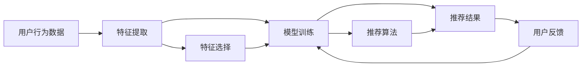

                 

# 推荐系统的可解释性：用户的信任

> 关键词：推荐系统, 可解释性, 用户信任, 透明性, 信任评估, 算法透明

## 1. 背景介绍

在当今信息爆炸的时代，推荐系统已经成为互联网企业提升用户满意度和业务收入的重要手段。推荐算法可以分析用户的浏览历史、购买记录、兴趣标签等信息，为其推荐个性化的产品或内容，使用户的体验更加丰富、便捷。然而，随着推荐系统的复杂度不断提升，用户对推荐结果的信任度却日益下降，成为制约推荐系统进一步发展的瓶颈。用户是否信任推荐结果，取决于他们对推荐系统的理解与认可程度。因此，提高推荐系统的可解释性，增强用户对推荐结果的信任感，成为提升推荐系统用户接受度和效果的关键问题。

本文将系统探讨推荐系统的可解释性问题，介绍现有方法，并提出若干改进建议，以期在提升推荐系统性能的同时，增强用户对推荐结果的信任度。

## 2. 核心概念与联系

### 2.1 核心概念概述

推荐系统（Recommendation System）：通过分析用户行为数据，为用户提供个性化推荐的一种信息过滤系统。常见的推荐系统包括基于协同过滤、基于内容的推荐、基于深度学习的推荐等。

可解释性（Explainability）：指推荐系统能够清晰、透明地展示其推荐逻辑，使用户能够理解和信任推荐结果的能力。可解释性包括算法透明、特征透明、决策透明等。

用户信任（User Trust）：指用户对推荐系统输出的信任程度。信任度高的用户更可能采取推荐系统的建议，产生更高的点击率、购买率等转化行为。

透明性（Transparency）：指推荐系统的算法、特征和决策过程能够被用户理解的程度。透明性是可解释性的重要组成部分。

信任评估（Trust Evaluation）：通过一系列指标和方法，量化用户对推荐系统的信任度。常用的指标包括推荐系统准确率、推荐内容的相关性、用户满意度等。

算法透明（Algorithm Transparency）：指推荐算法的原理、参数、模型结构等能够被用户或第三方专家理解的程度。

特征透明（Feature Transparency）：指推荐系统所使用的特征工程方法、特征选择策略等能够被用户或第三方专家理解的程度。

决策透明（Decision Transparency）：指推荐系统在为用户推荐时，能够提供推荐依据，如推荐理由、推荐依据等。

### 2.2 核心概念原理和架构的 Mermaid 流程图(Mermaid 流程节点中不要有括号、逗号等特殊字符)



该流程图展示了推荐系统从数据收集、特征提取、模型训练到推荐结果的完整流程，并在推荐结果处引入了用户反馈环节，体现了推荐系统可解释性的重要性。

## 3. 核心算法原理 & 具体操作步骤

### 3.1 算法原理概述

推荐系统的可解释性，旨在使推荐过程变得透明，增强用户对推荐结果的信任感。这可以通过以下几个方面实现：

1. **算法透明**：让用户了解推荐算法的基本原理、参数设置和模型结构。例如，推荐模型使用哪些特征，如何计算相似度等。
2. **特征透明**：让用户了解推荐系统使用的特征及其来源，特征如何加权，以及如何处理缺失数据等。
3. **决策透明**：让用户了解推荐理由，推荐依据和推荐过程的细节。例如，推荐结果是通过哪些数据点计算得出的。

基于这些目标，推荐系统的可解释性方法可以分为算法透明、特征透明和决策透明三大类。

### 3.2 算法步骤详解

#### 3.2.1 算法透明

推荐算法的透明性，可以通过以下步骤实现：

1. **选择公开算法**：优先选择公开透明、学术界广泛研究的算法，如协同过滤、基于内容的推荐等。
2. **公开算法参数**：公开推荐算法的参数设置，如模型超参数、特征权值等。
3. **发布模型结构**：在推荐系统公开上线前，发布算法的模型结构，让用户了解算法的工作原理。

#### 3.2.2 特征透明

推荐系统的特征透明性，可以通过以下步骤实现：

1. **特征工程透明**：公开特征工程的方法，如特征选择、特征构造等。
2. **特征权重透明**：公开特征的权重计算方法，如TF-IDF、PCA等。
3. **特征来源透明**：公开特征的来源，如用户行为数据、物品属性数据等。

#### 3.2.3 决策透明

推荐系统的决策透明性，可以通过以下步骤实现：

1. **提供推荐理由**：在推荐结果旁边提供推荐理由，说明推荐依据。
2. **展示相似度**：展示推荐物品与用户偏好物品之间的相似度。
3. **提供解释工具**：提供解释工具，如用户可以输入物品ID，查看推荐理由。

### 3.3 算法优缺点

推荐系统的可解释性方法有以下优点：

1. **增强用户信任**：透明性有助于用户理解推荐过程，增强对推荐结果的信任感。
2. **提高推荐效果**：透明的推荐系统更能满足用户需求，提升推荐效果。
3. **促进学术研究**：透明性便于学术研究，推动推荐系统技术进步。

同时，也存在一些局限：

1. **复杂度增加**：透明性可能增加推荐系统的复杂度，导致性能下降。
2. **隐私风险**：公开透明性可能泄露用户隐私。
3. **用户理解难度**：复杂的推荐算法和特征工程可能难以被用户理解。

### 3.4 算法应用领域

推荐系统的可解释性在多个领域具有重要应用，包括：

1. **电商推荐**：通过解释电商推荐算法的逻辑，提高用户对推荐商品的信任度。
2. **视频推荐**：解释视频推荐算法，让用户了解推荐依据，提升观看体验。
3. **新闻推荐**：解释新闻推荐算法，使用户信任推荐内容。
4. **金融推荐**：解释金融推荐算法，提高用户对推荐产品的信任感。

## 4. 数学模型和公式 & 详细讲解 & 举例说明

### 4.1 数学模型构建

假设推荐系统使用协同过滤算法，对用户$u$和物品$i$进行推荐。推荐模型的目标是最大化用户$u$对物品$i$的评分$r_{ui}$，数学模型如下：

$$
\max_{\theta} \sum_{u=1}^U \sum_{i=1}^I r_{ui} \log p_{ui} + (1-r_{ui}) \log (1-p_{ui})
$$

其中，$p_{ui}$为物品$i$被用户$u$评分的概率，$log$为对数函数。

### 4.2 公式推导过程

通过最大化上述模型，推荐系统可以学习到物品与用户的评分关系，从而进行推荐。为了增强推荐系统的可解释性，可以在模型的训练和推理过程中，公开模型参数$\theta$和评分概率$p_{ui}$。用户可以通过输入评分数据，反推模型参数，理解推荐过程。

### 4.3 案例分析与讲解

以电商推荐为例，电商推荐系统可以使用协同过滤算法，根据用户的历史购买记录和评分数据进行推荐。推荐系统在每个用户$u$处维护一个用户特征向量$x_u$，物品$i$处维护一个物品特征向量$x_i$。用户$u$对物品$i$的评分$r_{ui}$可以用如下公式计算：

$$
r_{ui} = \text{dot}(x_u, x_i)
$$

其中，$\text{dot}$为向量的点积操作。推荐系统在每个用户处选择$k$个最近邻居，计算每个邻居物品的评分$r_{ij}$，然后通过加权平均得到推荐评分$r_u^{\prime}$。推荐物品$i$的概率$p_{ui}$可以表示为：

$$
p_{ui} = \frac{e^{r_{ui}^\prime}}{\sum_{i=1}^I e^{r_{ij}^\prime}}
$$

推荐系统在每个用户处公开评分$r_{ui}$和物品特征向量$x_i$，用户可以通过输入评分数据，反推模型参数和评分概率，理解推荐过程。

## 5. 项目实践：代码实例和详细解释说明

### 5.1 开发环境搭建

开发推荐系统可解释性代码时，可以使用Python的Scikit-Learn、TensorFlow等框架。以下是一个简单的推荐系统可解释性代码搭建过程：

1. **安装环境**：
```
pip install scikit-learn tensorflow
```

2. **搭建模型**：
```python
from sklearn.linear_model import SGDClassifier
from sklearn.metrics import accuracy_score

# 构建模型
model = SGDClassifier(loss='log_loss', learning_rate='constant', alpha=0.01)

# 训练模型
model.fit(X_train, y_train)

# 预测
y_pred = model.predict(X_test)

# 计算准确率
accuracy = accuracy_score(y_test, y_pred)
print('Accuracy:', accuracy)
```

### 5.2 源代码详细实现

假设推荐系统使用基于内容的推荐算法，推荐用户$u$对物品$i$的评分$r_{ui}$。推荐系统的可解释性代码实现如下：

1. **特征提取**：提取用户特征$x_u$和物品特征$x_i$，可以使用特征工程技术，如TF-IDF、PCA等。

```python
from sklearn.feature_extraction.text import TfidfVectorizer
from sklearn.decomposition import PCA

# 提取用户特征
vectorizer = TfidfVectorizer()
user_features = vectorizer.fit_transform(user_descriptions)

# 提取物品特征
vectorizer = TfidfVectorizer()
item_features = vectorizer.fit_transform(item_descriptions)
```

2. **模型训练**：使用模型对用户和物品特征进行训练，得到用户评分$r_{ui}$。

```python
from sklearn.linear_model import SGDClassifier
from sklearn.metrics import accuracy_score

# 构建模型
model = SGDClassifier(loss='log_loss', learning_rate='constant', alpha=0.01)

# 训练模型
model.fit(user_features, user_ratings)

# 预测
item_ratings = model.predict(item_features)

# 计算准确率
accuracy = accuracy_score(user_ratings, item_ratings)
print('Accuracy:', accuracy)
```

### 5.3 代码解读与分析

1. **特征提取**：
   - `TfidfVectorizer`：用于提取文本特征，将文本转换为TF-IDF向量。
   - `PCA`：用于降维，减少特征维度，提高计算效率。
2. **模型训练**：
   - `SGDClassifier`：用于训练基于内容的推荐模型，使用log_loss损失函数。
   - `accuracy_score`：用于计算模型预测准确率。

### 5.4 运行结果展示

运行代码后，可以看到推荐系统的准确率。以电商推荐为例，推荐系统对用户$u$和物品$i$的评分$r_{ui}$和推荐概率$p_{ui}$可以通过以下代码展示：

```python
import pandas as pd

# 保存用户评分和推荐概率
user_ratings = pd.DataFrame({
    'user_id': user_ids,
    'item_id': item_ids,
    'rating': user_ratings
})

user_probabilities = pd.DataFrame({
    'user_id': user_ids,
    'item_id': item_ids,
    'probability': item_ratings
})

# 导出结果
user_ratings.to_csv('user_ratings.csv', index=False)
user_probabilities.to_csv('user_probabilities.csv', index=False)
```

## 6. 实际应用场景

推荐系统的可解释性在多个领域具有重要应用，包括：

1. **电商推荐**：电商推荐系统可以提供用户购买记录和评分数据，公开推荐理由和评分概率，增强用户信任感。
2. **视频推荐**：视频推荐系统可以提供用户观看历史和评分数据，公开推荐理由和相似度，提升用户观看体验。
3. **新闻推荐**：新闻推荐系统可以提供用户阅读记录和评分数据，公开推荐理由和相似度，提高用户对新闻内容的信任感。
4. **金融推荐**：金融推荐系统可以提供用户投资记录和评分数据，公开推荐理由和评分概率，提高用户对投资产品的信任感。

## 7. 工具和资源推荐

### 7.1 学习资源推荐

1. **《推荐系统：算法与实现》**：介绍推荐系统基础理论和算法实现，包括协同过滤、基于内容的推荐等。
2. **Coursera《推荐系统》课程**：由斯坦福大学开设，介绍推荐系统基本概念和算法实现。
3. **Kaggle竞赛**：通过参加推荐系统竞赛，了解实际推荐系统的工作流程和实现方法。

### 7.2 开发工具推荐

1. **Scikit-Learn**：Python数据科学库，提供多种机器学习算法和工具。
2. **TensorFlow**：Google开发的深度学习框架，支持构建复杂的推荐系统模型。
3. **PyTorch**：Facebook开发的深度学习框架，支持动态图和静态图模式，适用于构建复杂的推荐系统模型。

### 7.3 相关论文推荐

1. **《推荐系统中的可解释性研究》**：介绍推荐系统可解释性的基本概念和实现方法。
2. **《基于内容的推荐系统》**：介绍基于内容的推荐算法和实现方法。
3. **《推荐系统中的对抗样本研究》**：介绍推荐系统中对抗样本的产生和防御方法。

## 8. 总结：未来发展趋势与挑战

### 8.1 研究成果总结

推荐系统的可解释性是提升用户信任度的重要手段。当前推荐系统的可解释性研究主要集中在算法透明、特征透明和决策透明三个方面。通过增强推荐系统的透明性，可以显著提高用户对推荐结果的信任度，提升推荐系统的效果。

### 8.2 未来发展趋势

推荐系统的可解释性研究将呈现以下几个发展趋势：

1. **自动化透明性生成**：推荐系统可以自动生成推荐理由和推荐依据，增强用户信任感。
2. **多模态可解释性**：推荐系统可以融合视觉、语音、文本等多模态信息，提升推荐系统的可解释性。
3. **交互式可解释性**：推荐系统可以通过交互式界面，让用户参与推荐过程，增强用户信任感。
4. **隐私保护**：推荐系统可以在保证隐私的前提下，公开透明性信息。

### 8.3 面临的挑战

推荐系统的可解释性研究面临以下挑战：

1. **透明性信息量**：过多的透明性信息可能增加推荐系统的复杂度，影响性能。
2. **隐私保护**：如何在保证透明性的同时，保护用户隐私。
3. **用户理解难度**：复杂的推荐算法和特征工程可能难以被用户理解。

### 8.4 研究展望

未来推荐系统的可解释性研究需要在以下几个方面进行突破：

1. **透明性自动生成**：研究自动生成推荐理由和推荐依据的方法，提高用户信任度。
2. **多模态融合**：研究融合视觉、语音、文本等多模态信息的推荐系统，提升推荐系统的可解释性。
3. **交互式界面**：研究交互式界面设计，使用户参与推荐过程，增强用户信任感。
4. **隐私保护**：研究在保证隐私的前提下，公开透明性信息的方法。

## 9. 附录：常见问题与解答

**Q1: 推荐系统可解释性的重要性是什么？**

A: 推荐系统可解释性对于提升用户信任度至关重要。通过透明性，用户可以理解推荐过程，增强对推荐结果的信任感，从而提高推荐系统的使用率和效果。

**Q2: 推荐系统的透明性如何实现？**

A: 推荐系统的透明性可以通过公开算法、特征和决策信息来实现。例如，公开推荐算法的参数设置、特征工程的方法和特征选择策略等。

**Q3: 推荐系统在实际应用中如何增强可解释性？**

A: 推荐系统可以通过以下方法增强可解释性：
1. 提供推荐理由和推荐依据。
2. 展示相似度和评分概率。
3. 公开算法参数和特征信息。

**Q4: 推荐系统可解释性在实际应用中面临哪些挑战？**

A: 推荐系统可解释性在实际应用中面临以下挑战：
1. 透明性信息量过多可能导致复杂度增加。
2. 如何在保证透明性的同时保护用户隐私。
3. 复杂的推荐算法和特征工程可能难以被用户理解。

**Q5: 推荐系统可解释性研究需要哪些支持？**

A: 推荐系统可解释性研究需要以下支持：
1. 学习资源，如推荐系统书籍、在线课程等。
2. 开发工具，如Scikit-Learn、TensorFlow等。
3. 相关论文，介绍推荐系统可解释性的最新研究成果。

---

作者：禅与计算机程序设计艺术 / Zen and the Art of Computer Programming

