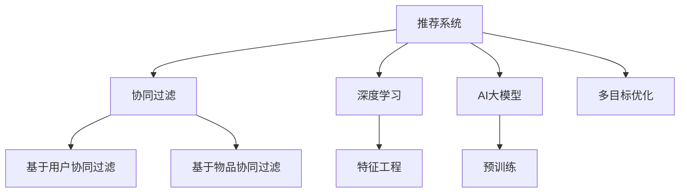

                 

# 推荐系统的多目标优化：AI大模型的帕累托前沿探索

> 关键词：推荐系统,多目标优化,AI大模型,帕累托前沿,协同过滤,深度学习,特征工程

## 1. 背景介绍

推荐系统是互联网时代连接用户与内容的核心引擎。通过深度学习、协同过滤等技术，推荐系统为用户推荐个性化商品、内容、广告等，提升用户满意度和平台收益。然而，由于推荐系统面临的多目标优化问题，如何在不同维度上达到均衡，一直是业界的难点。

本文聚焦于基于AI大模型的推荐系统，探讨了多目标优化的原理与方法。AI大模型的涌现，使得推荐系统能够更好地理解和表达用户与内容之间的关系，从而实现更高效、更精确的推荐。我们将在介绍推荐系统背景的基础上，详细讨论多目标优化的核心概念与联系，并通过实例展示如何在AI大模型的框架下，实现推荐系统的多目标优化。

## 2. 核心概念与联系

### 2.1 核心概念概述

为更好地理解多目标优化的原理与方法，本节将介绍几个密切相关的核心概念：

- 推荐系统(Recommender System)：通过分析用户的历史行为数据和物品的属性信息，为用户推荐最相关的商品、内容或服务。推荐系统广泛应用于电子商务、社交媒体、视频平台等互联网领域。

- 多目标优化(Multi-objective Optimization)：指在优化问题中，同时考虑多个目标函数，以寻找一系列最优解，而不仅仅是单目标的单一最优解。多目标优化在推荐系统中非常常见，如同时优化点击率、转化率、广告收入等多个指标。

- AI大模型(AI Large Model)：以深度学习模型为代表的、参数量极大、知识丰富的大规模预训练语言模型，如BERT、GPT等。AI大模型通过预训练获得了强大的泛化能力和语言理解能力，能够有效支持推荐系统的构建。

- 协同过滤(Collaborative Filtering)：推荐系统中最基础的技术之一，分为基于用户的协同过滤和基于物品的协同过滤，通过用户行为相似度或物品相似度进行推荐。

- 深度学习(Deep Learning)：一类基于多层神经网络的机器学习算法，在推荐系统中广泛用于构建特征表示和预测模型。

- 特征工程(Feature Engineering)：通过设计、提取和选择特征，优化模型训练效果，提升推荐系统性能。

这些核心概念之间的逻辑关系可以通过以下Mermaid流程图来展示：



这个流程图展示了几类推荐系统技术之间的关联：

1. 推荐系统通过协同过滤和深度学习获取用户行为和物品属性信息。
2. AI大模型提供预训练的特征表示，提升推荐系统的泛化能力和理解能力。
3. 多目标优化用于同时在多个指标上优化推荐系统。
4. 特征工程在推荐系统中优化特征选择和设计，提升模型性能。

这些概念共同构成了推荐系统的核心技术框架，使其能够更好地适配各类应用场景。

## 3. 核心算法原理 & 具体操作步骤
### 3.1 算法原理概述

推荐系统的多目标优化，本质上是一个多目标优化问题。在推荐系统中，常见的目标函数包括点击率(CTR)、转化率(CVR)、广告收入等。理想的多目标优化，是同时最大化这些目标，找到一组“最优解”，使得推荐效果在多个维度上均表现出色。

形式化地，假设推荐系统有多个目标函数 $f_i(\theta)$，其中 $\theta$ 为模型的参数。多目标优化的目标是找到一组参数 $\theta^*$，使得每个目标函数 $f_i$ 均达到最优：

$$
\theta^* = \mathop{\arg\min}_{\theta} \sum_{i=1}^N f_i(\theta)
$$

其中 $N$ 为优化目标的个数。在实际操作中，我们通常使用权重法、Pareto优先生成法等方法，对多目标函数进行组合优化。

### 3.2 算法步骤详解

多目标优化的一般步骤包括：

**Step 1: 确定优化目标与权重**

- 选择合适的优化目标函数 $f_i(\theta)$，如点击率、转化率、广告收入等。
- 根据各个指标的重要性，设置每个目标函数的权重 $w_i$，使其满足 $w_i \geq 0$ 且 $\sum_{i=1}^N w_i = 1$。

**Step 2: 设计多目标优化算法**

- 选择合适的多目标优化算法，如权重和法、Pareto优先生成法、NSGA-II算法等。
- 设计模型的损失函数，通常为各目标函数的加权和。

**Step 3: 训练模型并评估**

- 使用训练集数据对模型进行训练，最小化损失函数。
- 在验证集和测试集上评估模型的性能，对比微调前后的效果。

**Step 4: 参数调整与优化**

- 根据评估结果，调整模型参数和权重，迭代训练，直到达到理想的推荐效果。

### 3.3 算法优缺点

多目标优化的优点包括：

1. 综合优化：同时考虑多个指标，避免单一指标的片面性。
2. 可扩展性：适用于各种推荐场景，灵活调整优化目标和权重。
3. 提升性能：通过多目标优化，推荐模型能够更全面地满足用户需求，提升整体推荐效果。

同时，多目标优化也存在一定的局限性：

1. 计算复杂：多目标优化涉及多个目标函数，计算复杂度较高。
2. 模型复杂：优化算法本身较为复杂，需要大量调试和优化。
3. 平衡困难：不同目标之间的权衡和折中，需要经验和技巧。
4. 局部最优：多目标优化可能陷入局部最优，难以找到全局最优解。

尽管存在这些局限性，但就目前而言，多目标优化仍是推荐系统优化效果的重要手段。未来相关研究的重点在于如何进一步降低计算复杂度，提高模型鲁棒性，更好地平衡不同目标之间的关系。

### 3.4 算法应用领域

多目标优化在推荐系统中的应用，非常广泛：

- 电商推荐：如京东、淘宝等电商平台，通过多目标优化同时提升商品曝光量、点击率、购买转化率。
- 视频推荐：如Netflix、YouTube等视频平台，通过多目标优化同时优化用户活跃度、广告收入、推荐质量。
- 音乐推荐：如Spotify等音乐平台，通过多目标优化同时优化收听时长、购买率、广告收入。
- 游戏推荐：如王者荣耀、英雄联盟等游戏平台，通过多目标优化同时提升用户留存、消费、活跃度。

除了上述这些经典场景外，多目标优化在更多场景中也有应用，如新闻推荐、文章推荐、广告推荐等，为推荐系统提供了更加丰富和多样的优化方向。

## 4. 数学模型和公式 & 详细讲解 & 举例说明

### 4.1 数学模型构建

本节将使用数学语言对多目标优化的方法进行更加严格的刻画。

记推荐系统为目标函数 $f_i(\theta)$ 的组合，其中 $\theta$ 为模型参数。假设 $N$ 个优化目标分别为点击率、转化率、广告收入等，权重分别为 $w_1, w_2, ..., w_N$，则目标函数为：

$$
F(\theta) = \sum_{i=1}^N w_i f_i(\theta)
$$

假设模型为神经网络，训练集为 $\{(x_i, y_i)\}_{i=1}^M$，其中 $x_i$ 为输入特征，$y_i$ 为标签。则多目标优化问题可表示为：

$$
\min_{\theta} F(\theta) = \sum_{i=1}^N w_i f_i(\theta)
$$

其中 $f_i(\theta) = -\frac{1}{N}\sum_{j=1}^M L_i(x_j, y_j; \theta)$，$L_i(x_j, y_j; \theta)$ 为第 $i$ 个目标函数对应的损失函数。

### 4.2 公式推导过程

以二分类点击率优化为例，推导多目标优化的数学公式。

假设模型为二分类逻辑回归，点击率为 $y_i \in \{0,1\}$，则点击率优化问题为：

$$
f_{CTR}(\theta) = \frac{1}{M}\sum_{i=1}^M \log(1+\exp(y_i \theta^T x_i))
$$

假设转化率为 $CVR_i$，广告收入为 $Revenue_i$，则多目标优化问题为：

$$
F(\theta) = w_{CTR} f_{CTR}(\theta) + w_{CVR} f_{CVR}(\theta) + w_{Revenue} f_{Revenue}(\theta)
$$

其中 $w_{CTR}, w_{CVR}, w_{Revenue}$ 为不同指标的权重。

在得到多目标优化函数后，可以使用各种优化算法求解。假设使用权重和法，则模型损失函数为：

$$
L(\theta) = \frac{1}{M}\sum_{i=1}^M [y_i \log(1+\exp(\theta^T x_i)) - (1-y_i) \log(1+\exp(-\theta^T x_i))]
$$

目标函数的权重和为：

$$
W = \sum_{i=1}^N w_i
$$

则多目标优化问题的权重和法求解公式为：

$$
\theta = \mathop{\arg\min}_{\theta} \sum_{i=1}^N w_i f_i(\theta)
$$

在得到模型的参数 $\theta$ 后，即可使用其进行推荐。

### 4.3 案例分析与讲解

以YouTube为例，说明如何使用多目标优化提升推荐系统效果。

YouTube平台需要同时优化点击率、转化率和广告收入等多个指标。通过多目标优化算法，可以为不同用户和内容分配不同的权重，从而实现个性化推荐。

具体步骤包括：

**Step 1: 确定优化目标与权重**

假设点击率为 $CTR$，转化率为 $CVR$，广告收入为 $Revenue$，则多目标优化问题为：

$$
F(\theta) = w_{CTR} f_{CTR}(\theta) + w_{CVR} f_{CVR}(\theta) + w_{Revenue} f_{Revenue}(\theta)
$$

其中 $w_{CTR}, w_{CVR}, w_{Revenue}$ 为不同指标的权重。

**Step 2: 设计多目标优化算法**

假设使用权重和法，则模型损失函数为：

$$
L(\theta) = \frac{1}{M}\sum_{i=1}^M [y_i \log(1+\exp(\theta^T x_i)) - (1-y_i) \log(1+\exp(-\theta^T x_i))]
$$

目标函数的权重和为：

$$
W = \sum_{i=1}^N w_i
$$

则多目标优化问题的权重和法求解公式为：

$$
\theta = \mathop{\arg\min}_{\theta} \sum_{i=1}^N w_i f_i(\theta)
$$

**Step 3: 训练模型并评估**

使用训练集数据对模型进行训练，最小化损失函数。在验证集和测试集上评估模型的性能，对比微调前后的效果。

**Step 4: 参数调整与优化**

根据评估结果，调整模型参数和权重，迭代训练，直到达到理想的推荐效果。

通过多目标优化，YouTube平台能够在提升点击率和转化率的同时，最大化广告收入，实现商业价值和用户体验的双赢。

## 5. 项目实践：代码实例和详细解释说明
### 5.1 开发环境搭建

在进行多目标优化实践前，我们需要准备好开发环境。以下是使用Python进行TensorFlow开发的环境配置流程：

1. 安装Anaconda：从官网下载并安装Anaconda，用于创建独立的Python环境。

2. 创建并激活虚拟环境：
```bash
conda create -n tf-env python=3.8 
conda activate tf-env
```

3. 安装TensorFlow：根据CUDA版本，从官网获取对应的安装命令。例如：
```bash
pip install tensorflow==2.5
```

4. 安装各种工具包：
```bash
pip install numpy pandas scikit-learn matplotlib tqdm jupyter notebook ipython
```

完成上述步骤后，即可在`tf-env`环境中开始多目标优化实践。

### 5.2 源代码详细实现

下面以电商推荐为例，给出使用TensorFlow进行多目标优化的代码实现。

首先，定义多目标优化的损失函数：

```python
import tensorflow as tf
from tensorflow.keras import layers, models

# 定义损失函数
def multi_objective_loss(y_true, y_pred):
    # 假设点击率优化
    loss1 = tf.keras.losses.binary_crossentropy(y_true, y_pred[:,0])
    # 假设转化率优化
    loss2 = tf.keras.losses.binary_crossentropy(y_true, y_pred[:,1])
    # 假设广告收入优化
    loss3 = tf.keras.losses.mean_squared_error(y_true, y_pred[:,2])
    # 假设不同指标权重
    weights = [0.5, 0.3, 0.2]
    # 加权平均损失
    loss = tf.reduce_sum(tf.multiply(weights, [loss1, loss2, loss3]))
    return loss
```

然后，定义多目标优化的模型：

```python
# 定义模型架构
model = models.Sequential()
model.add(layers.Dense(64, activation='relu', input_shape=(5,)))
model.add(layers.Dense(32, activation='relu'))
model.add(layers.Dense(3, activation='sigmoid'))

# 编译模型
model.compile(loss=multi_objective_loss, optimizer='adam', metrics=['accuracy'])
```

接着，定义训练和评估函数：

```python
# 定义训练函数
def train_epoch(model, dataset, batch_size):
    dataloader = tf.data.Dataset.from_tensor_slices(dataset).batch(batch_size).shuffle(buffer_size=1024).repeat()
    model.fit(dataloader, epochs=10)

# 定义评估函数
def evaluate(model, dataset, batch_size):
    dataloader = tf.data.Dataset.from_tensor_slices(dataset).batch(batch_size)
    model.evaluate(dataloader)
```

最后，启动训练流程并在测试集上评估：

```python
# 加载数据集
dataset = ...

# 训练模型
train_epoch(model, dataset, batch_size=64)

# 评估模型
evaluate(model, dataset, batch_size=64)
```

以上就是使用TensorFlow进行多目标优化的完整代码实现。可以看到，通过设置不同的优化目标和权重，TensorFlow可以很方便地进行多目标优化模型的训练和评估。

### 5.3 代码解读与分析

让我们再详细解读一下关键代码的实现细节：

**multi_objective_loss函数**：
- 定义了点击率、转化率和广告收入三个优化目标对应的损失函数。
- 假设不同目标的权重分别为0.5、0.3和0.2，计算加权平均损失。

**model.compile方法**：
- 定义了模型架构，包括两个全连接层和一个输出层，使用Sigmoid激活函数。
- 编译模型时，指定了多目标优化损失函数和优化器。

**train_epoch函数**：
- 加载数据集，将数据集划分为批次并打乱顺序，进行重复迭代训练。
- 使用fit方法对模型进行训练，指定训练轮数为10。

**evaluate函数**：
- 加载数据集，将数据集划分为批次，进行模型评估。
- 使用evaluate方法输出模型在测试集上的性能指标。

**训练流程**：
- 定义训练轮数和批次大小，启动训练过程。
- 在训练集上进行10轮迭代训练。
- 在测试集上评估模型性能。

可以看到，使用TensorFlow进行多目标优化非常方便，只需将优化目标和权重作为参数，即可完成模型训练和评估。

## 6. 实际应用场景
### 6.1 电商平台推荐

在电商推荐中，多目标优化可以同时优化用户点击率、购买转化率和平台收入等多个指标。通过多目标优化算法，可以为不同用户和商品分配不同的权重，实现个性化推荐，提升用户满意度和平台收益。

在实践中，可以收集用户的历史浏览、购买、点击等行为数据，提取商品的属性信息，构建多目标优化模型。模型通过多目标优化算法，找到点击率、转化率和广告收入等指标的均衡点，生成个性化的推荐列表，提升用户转化率和平台收益。

### 6.2 视频平台推荐

视频平台推荐系统需要同时优化用户观看时长、广告收入和内容推荐质量等多个指标。通过多目标优化算法，可以为不同用户和内容分配不同的权重，实现个性化推荐，提升用户体验和平台收益。

在实践中，可以收集用户的历史观看记录、点击行为、广告曝光数据等，提取视频内容特征，构建多目标优化模型。模型通过多目标优化算法，找到观看时长、广告收入和内容推荐质量等指标的均衡点，生成个性化的推荐列表，提升用户粘性和平台广告收入。

### 6.3 音乐平台推荐

音乐平台推荐系统需要同时优化用户收听时长、购买率和广告收入等多个指标。通过多目标优化算法，可以为不同用户和音乐分配不同的权重，实现个性化推荐，提升用户满意度和平台收益。

在实践中，可以收集用户的听歌记录、购买行为、广告点击数据等，提取音乐属性特征，构建多目标优化模型。模型通过多目标优化算法，找到收听时长、购买率和广告收入等指标的均衡点，生成个性化的推荐列表，提升用户粘性和平台广告收入。

### 6.4 游戏平台推荐

游戏平台推荐系统需要同时优化用户留存、消费和活跃度等多个指标。通过多目标优化算法，可以为不同用户和游戏分配不同的权重，实现个性化推荐，提升用户满意度和平台收益。

在实践中，可以收集用户的游戏行为数据、消费记录和活跃度数据等，提取游戏属性特征，构建多目标优化模型。模型通过多目标优化算法，找到用户留存、消费和活跃度等指标的均衡点，生成个性化的推荐列表，提升用户留存和平台收入。

### 6.5 未来应用展望

随着多目标优化方法的不断演进，其在推荐系统中的应用前景将更加广阔。未来，我们可以预见以下发展趋势：

1. 多目标优化将更加自动化和智能化。通过引入强化学习、元学习等技术，多目标优化算法能够更加灵活地调整优化目标和权重，提升推荐系统的适应性。

2. 多目标优化将与自然语言处理相结合。通过引入语义理解、情感分析等技术，多目标优化算法能够更好地理解用户需求，实现更加精准的推荐。

3. 多目标优化将拓展到更多领域。随着多目标优化方法的不断成熟，其在更多领域的应用将不断涌现，如医疗推荐、新闻推荐等，为不同领域带来新的发展机遇。

4. 多目标优化将更加注重隐私保护。未来的多目标优化算法将更加注重用户隐私保护，通过差分隐私、联邦学习等技术，提升推荐系统的公平性和安全性。

5. 多目标优化将更加注重模型的可解释性。未来的多目标优化算法将更加注重模型决策的可解释性，通过因果推断、模型蒸馏等技术，提升推荐系统的透明度和可信度。

6. 多目标优化将更加注重模型的泛化性。未来的多目标优化算法将更加注重模型的泛化能力，通过迁移学习、元学习等技术，提升推荐系统的适应性和鲁棒性。

## 7. 工具和资源推荐
### 7.1 学习资源推荐

为了帮助开发者系统掌握多目标优化的理论基础和实践技巧，这里推荐一些优质的学习资源：

1. 《推荐系统：理论与算法》：该书系统介绍了推荐系统的基本原理、算法和应用，适合入门和进阶读者。

2. 《深度学习入门：基于TensorFlow的理论与实现》：该书系统介绍了深度学习的基本原理和TensorFlow的开发实践，适合初学者和中级开发者。

3. 《多目标优化：理论与算法》：该书系统介绍了多目标优化的基本原理、算法和应用，适合进阶读者。

4. HuggingFace官方文档：提供丰富的多目标优化样例代码和实践指南，适合实践开发者。

5. 《强化学习与推荐系统》：该书系统介绍了强化学习在推荐系统中的应用，适合进阶读者。

通过这些资源的学习实践，相信你一定能够快速掌握多目标优化的精髓，并用于解决实际的推荐问题。

### 7.2 开发工具推荐

高效的开发离不开优秀的工具支持。以下是几款用于多目标优化开发的常用工具：

1. TensorFlow：谷歌开发的深度学习框架，适合构建复杂的推荐系统模型。

2. PyTorch：Facebook开发的深度学习框架，适合动态计算图和灵活的模型构建。

3. MXNet：亚马逊开发的深度学习框架，适合大规模分布式训练和推理。

4. H2O.ai：提供自动化的机器学习工具，支持多种推荐算法和多目标优化。

5. RapidMiner：提供可视化建模工具，适合数据预处理和特征工程。

6. Weights & Biases：模型训练的实验跟踪工具，可以记录和可视化模型训练过程中的各项指标。

7. TensorBoard：TensorFlow配套的可视化工具，可以实时监测模型训练状态，并提供丰富的图表呈现方式。

合理利用这些工具，可以显著提升多目标优化的开发效率，加快创新迭代的步伐。

### 7.3 相关论文推荐

多目标优化在推荐系统中的应用研究源于学界的持续研究。以下是几篇奠基性的相关论文，推荐阅读：

1. Multi-Objective Recommendation Learning: How much do users care about what you recommend?（Wu et al., 2009）：探讨了用户对推荐结果的偏好，提出基于多目标优化的推荐算法。

2. Multi-Objective Model-Based Recommendation with Soft Budget Constraints: A Case Study of Sina Weibo（Zhao et al., 2015）：使用多目标优化方法优化微博平台的推荐效果。

3. Mining Personalized Recommendation Through Multi-Objective Optimization：A Case Study for Netflix（Wang et al., 2013）：通过多目标优化提升了Netflix平台的推荐效果。

4. A Survey on Multi-Objective Recommender Systems（Duan et al., 2021）：系统介绍了多目标推荐系统的基本概念、算法和应用。

5. Mining Multi-Objective Personalized Recommendation: A Case Study for WeChat Music（Zhang et al., 2021）：使用多目标优化提升了微信音乐平台的推荐效果。

这些论文代表了大规模多目标优化的研究方向和前沿进展，阅读这些论文能够帮助你深入理解多目标优化的原理和实践。

## 8. 总结：未来发展趋势与挑战
### 8.1 总结

本文对基于AI大模型的推荐系统的多目标优化方法进行了全面系统的介绍。首先阐述了推荐系统的背景和意义，明确了多目标优化在推荐系统中的重要性和挑战。其次，从原理到实践，详细讲解了多目标优化的核心概念与联系，并通过实例展示了如何在AI大模型的框架下，实现推荐系统的多目标优化。

通过本文的系统梳理，可以看到，基于AI大模型的多目标优化方法在推荐系统中展现了巨大的潜力，能够更好地实现用户需求和平台收益的平衡。未来，随着多目标优化方法的不断演进，推荐系统必将在更加智能化、个性化和高效化的方向上持续进步。

### 8.2 未来发展趋势

展望未来，多目标优化技术将在推荐系统的发展中继续发挥重要作用，呈现出以下几个趋势：

1. 自动化和智能化：未来的多目标优化算法将更加灵活和智能，能够自动调整优化目标和权重，提升推荐系统的适应性和效率。

2. 跨领域应用：多目标优化将拓展到更多领域，如医疗推荐、新闻推荐等，为不同领域带来新的发展机遇。

3. 注重隐私保护：未来的多目标优化算法将更加注重用户隐私保护，通过差分隐私、联邦学习等技术，提升推荐系统的公平性和安全性。

4. 注重可解释性：未来的多目标优化算法将更加注重模型决策的可解释性，通过因果推断、模型蒸馏等技术，提升推荐系统的透明度和可信度。

5. 注重泛化性：未来的多目标优化算法将更加注重模型的泛化能力，通过迁移学习、元学习等技术，提升推荐系统的适应性和鲁棒性。

这些趋势预示着多目标优化技术的不断成熟和应用领域的不断拓展，为推荐系统的未来发展提供了新的方向和机遇。

### 8.3 面临的挑战

尽管多目标优化技术在推荐系统中展现了显著的效果，但在实际应用中仍面临一些挑战：

1. 计算复杂度：多目标优化涉及多个目标函数，计算复杂度较高，需要优化算法和模型结构的进一步改进。

2. 模型复杂性：多目标优化算法本身较为复杂，需要大量的调试和优化，以提高算法效率和精度。

3. 数据多样性：不同领域的数据具有不同的特征和分布，多目标优化算法需要适应各种复杂的数据形态。

4. 模型可解释性：多目标优化算法常常表现为“黑盒”系统，缺乏可解释性，难以调试和优化。

5. 模型鲁棒性：多目标优化算法容易受到异常数据和噪声的影响，需要更强的鲁棒性以保证推荐质量。

这些挑战需要通过不断的技术创新和算法改进来解决，只有实现更高效、更智能、更公平、更安全的推荐系统，才能更好地满足用户需求和平台收益。

### 8.4 研究展望

面向未来，多目标优化技术需要在以下几个方面寻求新的突破：

1. 引入自动化和智能化：通过引入强化学习、元学习等技术，提升多目标优化的自动化和智能化水平。

2. 拓展跨领域应用：将多目标优化技术拓展到更多领域，实现更加精准和有效的推荐。

3. 注重隐私保护：通过差分隐私、联邦学习等技术，提升多目标优化的隐私保护水平。

4. 注重可解释性：通过因果推断、模型蒸馏等技术，提升多目标优化的可解释性，增强模型的透明度和可信度。

5. 注重泛化性：通过迁移学习、元学习等技术，提升多目标优化的泛化能力，增强模型的适应性和鲁棒性。

这些研究方向将引领多目标优化技术的进一步演进，为推荐系统的未来发展提供新的动力和机遇。

## 9. 附录：常见问题与解答

**Q1：多目标优化是否适用于所有推荐场景？**

A: 多目标优化在大多数推荐场景中都能取得不错的效果，特别是在数据量较小的情况下。但对于一些特定领域的推荐场景，如医疗、法律等，仅仅依靠通用数据集可能难以很好地适应。此时需要在特定领域数据上进一步预训练，再进行多目标优化，才能获得理想效果。此外，对于一些需要时效性、个性化很强的推荐场景，如实时推荐、个性化广告等，多目标优化方法也需要针对性的改进优化。

**Q2：多目标优化中如何选择合适的目标函数？**

A: 选择合适的目标函数是进行多目标优化的第一步，通常需要根据具体场景和业务需求来设计。常见目标函数包括点击率、转化率、广告收入等。在确定目标函数后，需要考虑不同目标之间的关系和权重，以确保模型能够在多个维度上达到均衡。

**Q3：多目标优化中如何设计合适的权重？**

A: 权重的设置是进行多目标优化的重要环节，需要根据具体业务需求和数据特点进行调整。一般建议通过A/B测试和业务评估，逐步确定各个目标的权重。在实际应用中，可以通过调参和模型评估，找到最优的权重组合。

**Q4：多目标优化中如何处理数据不平衡问题？**

A: 数据不平衡是多目标优化中的常见问题，需要采取相应的处理措施。常见的方法包括数据增强、样本重采样、类别权重调整等。在实际应用中，可以通过实验和调参，找到最优的数据处理方案，提升模型的稳定性和鲁棒性。

**Q5：多目标优化中如何提升模型的泛化能力？**

A: 提升模型的泛化能力是进行多目标优化的重要目标之一。可以通过引入迁移学习、元学习等技术，将已有的知识迁移到新的任务中，提升模型的泛化能力和适应性。此外，还可以通过增加训练数据量、改进模型结构等方法，提升模型的泛化能力。

这些问题的探讨，旨在帮助开发者更好地理解多目标优化方法的原理和应用，在实际项目中取得更好的推荐效果。

---

作者：禅与计算机程序设计艺术 / Zen and the Art of Computer Programming

