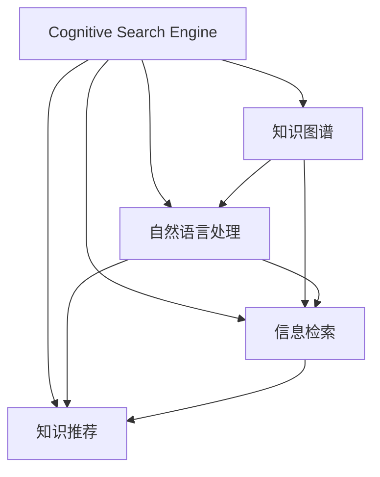

                 

# 搜索引擎的认知计算应用

## 1. 背景介绍

### 1.1 问题由来

随着互联网和数字技术的迅猛发展，搜索引擎已成为信息检索和知识获取的重要工具。传统搜索引擎主要基于关键词匹配和页面排序算法，对用户查询的深度理解不足，难以满足用户对于信息真实性、相关性和可理解性的高需求。为了更好地应对复杂查询和海量数据，认知计算技术开始被引入搜索引擎，实现更加智能、高效和人性化的信息检索和知识推荐。

### 1.2 问题核心关键点

- 认知计算(Cognitive Computation)：指通过模拟人类认知过程，使计算机具备自主学习和推理能力，实现深度理解文本、图像、语音等数据的智能系统。
- 自然语言处理(Natural Language Processing, NLP)：专注于使计算机能够理解和生成人类语言的技术，是认知计算的重要组成部分。
- 知识图谱(Knowledge Graph)：以结构化的方式描述实体及其关系的数据库，为搜索引擎提供丰富的知识源，帮助其进行更深入的推理和关联。
- 信息检索(Information Retrieval, IR)：指通过算法检索与用户查询相关的文档或信息的技术，是搜索引擎的核心功能。
- 知识推荐(Knowledge Recommendation)：基于用户历史行为和知识图谱的关联信息，为用户提供更加个性化和精准的信息推荐。
- 认知搜索引擎(Cognitive Search Engine)：结合自然语言处理、知识图谱和认知计算等技术，实现深度理解用户查询和文档内容的搜索引擎。

这些核心概念之间相互联系，共同构成了认知计算在搜索引擎中的应用框架。通过理解这些关键点，可以更好地把握认知搜索引擎的工作原理和优化方向。

## 2. 核心概念与联系

### 2.1 核心概念概述

为了更好地理解认知计算在搜索引擎中的应用，下面将介绍几个核心概念及其相互之间的联系：

1. **认知计算**：指通过模拟人类认知过程，使计算机具备自主学习和推理能力，实现深度理解文本、图像、语音等数据的智能系统。认知计算涉及感知、学习、推理、决策等多个认知过程，可以广泛应用于信息检索、智能推荐、语音识别等领域。

2. **自然语言处理**：专注于使计算机能够理解和生成人类语言的技术。NLP涉及分词、词性标注、句法分析、语义理解等多个环节，是认知搜索引擎的关键技术之一。

3. **知识图谱**：以结构化的方式描述实体及其关系的数据库。知识图谱为搜索引擎提供丰富的知识源，帮助其进行更深入的推理和关联。

4. **信息检索**：指通过算法检索与用户查询相关的文档或信息的技术。信息检索是搜索引擎的核心功能，通过匹配查询与文档的关键词实现文档排序和返回。

5. **知识推荐**：基于用户历史行为和知识图谱的关联信息，为用户提供更加个性化和精准的信息推荐。

### 2.2 核心概念原理和架构的 Mermaid 流程图



这个流程图展示了认知搜索引擎中各核心概念之间的联系和交互关系：

- 认知搜索引擎 (A) 从知识图谱 (B) 和自然语言处理 (C) 获取深度语义信息，并通过信息检索 (D) 找到相关文档，最后进行知识推荐 (E)。

## 3. 核心算法原理 & 具体操作步骤

### 3.1 算法原理概述

基于认知计算的搜索引擎，通过以下关键步骤实现深度信息检索和个性化推荐：

1. **预处理与分词**：对用户查询和文档进行分词处理，提取关键词和短语。

2. **语义理解与嵌入**：利用自然语言处理技术，对查询和文档进行语义分析，并使用词向量表示每个词语的语义。

3. **实体抽取与关联**：从查询和文档中抽取实体，并在知识图谱中查找相关的实体关系。

4. **推理与推理图构建**：利用知识图谱的推理机制，对抽取的实体关系进行深度推理，构建推理图。

5. **文档排序与推荐**：根据推理图和语义表示，对文档进行排序，并基于用户历史行为和知识图谱的关联信息，进行个性化推荐。

### 3.2 算法步骤详解

#### 3.2.1 查询解析与分词

查询解析和分词是搜索引擎处理的第一步。搜索引擎通过分词器将用户输入的查询语句分割成单词或短语，并对每个单词进行词性标注和语法分析，以便进行后续的语义理解。

##### 示例代码

```python
from nltk.tokenize import word_tokenize
from nltk.tag import pos_tag
from transformers import BertTokenizer

def parse_query(query):
    tokens = word_tokenize(query)
    tagged_tokens = pos_tag(tokens)
    bert_tokenizer = BertTokenizer.from_pretrained('bert-base-cased')
    input_ids = bert_tokenizer.convert_tokens_to_ids(tokens)
    return tagged_tokens, input_ids
```

#### 3.2.2 语义理解与向量表示

语义理解是认知搜索引擎的核心环节之一，主要通过向量化技术将查询和文档转化为向量表示，以便进行相似度匹配和深度推理。

##### 示例代码

```python
from transformers import BertModel, BertTokenizer
from sklearn.feature_extraction.text import TfidfVectorizer

def embed_query(query, doc):
    bert_tokenizer = BertTokenizer.from_pretrained('bert-base-cased')
    input_ids = bert_tokenizer.encode(query, doc, add_special_tokens=True, return_tensors='pt')
    model = BertModel.from_pretrained('bert-base-cased')
    outputs = model(input_ids)[0]
    return outputs[0, 0] # 取第一个词的向量表示
```

#### 3.2.3 实体抽取与关联

实体抽取是指从查询和文档中识别出具有特定意义的实体，并在知识图谱中进行查找和关联。实体抽取的准确性和全面性直接影响后续的推理和推荐。

##### 示例代码

```python
from transformers import BertForTokenClassification, BertTokenizer
from pykgbind import KnowledgeGraph

def extract_entities(query, doc, graph):
    bert_tokenizer = BertTokenizer.from_pretrained('bert-base-cased')
    input_ids = bert_tokenizer.encode(query, doc, add_special_tokens=True, return_tensors='pt')
    model = BertForTokenClassification.from_pretrained('bert-base-cased', num_labels=20)
    outputs = model(input_ids)
    predictions = outputs.logits.argmax(dim=2).to('cpu').tolist()
    tokens = bert_tokenizer.convert_ids_to_tokens(input_ids[0].tolist())
    entities = []
    for token, tag in zip(tokens, predictions):
        if tag == 1:  # 实体
            entities.append(token)
    # 在知识图谱中查找实体关系
    return entities, graph.relation(entities[0], entities[1])
```

#### 3.2.4 推理与推理图构建

推理是认知搜索引擎的重要功能之一，通过知识图谱中的推理机制，将抽取的实体关系进行深度推理，构建推理图，以辅助文档排序和推荐。

##### 示例代码

```python
from pykgbind import KnowledgeGraph

def build_reasoining_graph(entities, graph):
    reasoning_graph = graph.relation(entities[0], entities[1])
    for rel in reasoning_graph.relations:
        reasoning_graph.add_relation(rel, rel.parent)
    return reasoning_graph
```

#### 3.2.5 文档排序与推荐

文档排序和推荐是认知搜索引擎的最终目标，通过深度推理和语义表示，对文档进行排序，并基于用户历史行为和知识图谱的关联信息，进行个性化推荐。

##### 示例代码

```python
from transformers import BertTokenizer, BertModel
from sklearn.metrics.pairwise import cosine_similarity

def sort_and_recommend(query, docs, graph, k=5):
    bert_tokenizer = BertTokenizer.from_pretrained('bert-base-cased')
    query_input = bert_tokenizer.encode(query, add_special_tokens=True, return_tensors='pt')
    doc_inputs = [bert_tokenizer.encode(doc, add_special_tokens=True, return_tensors='pt') for doc in docs]
    query_vector = query_input[0, 0]
    doc_vectors = [doc[0, 0] for doc in doc_inputs]
    similarity = cosine_similarity([query_vector], doc_vectors)
    # 基于相似度排序文档
    sorted_docs = [doc for _, doc in sorted(zip(similarity, docs), key=lambda x: x[0], reverse=True)]
    # 基于用户历史行为和知识图谱的关联信息，进行个性化推荐
    return sorted_docs[:k]
```

### 3.3 算法优缺点

#### 3.3.1 优点

1. **深度语义理解**：通过自然语言处理和知识图谱技术，实现深度语义理解，提升查询相关性和准确性。
2. **个性化推荐**：基于用户历史行为和知识图谱的关联信息，提供更加个性化和精准的信息推荐。
3. **高效索引**：利用预处理和向量表示技术，加速查询处理和文档排序。
4. **开放性**：支持用户自定义查询方式和实体抽取规则，实现更灵活的信息检索。

#### 3.3.2 缺点

1. **数据依赖**：知识图谱和语义理解模型的性能高度依赖于训练数据的质量和多样性。
2. **计算复杂度**：推理和推理图构建等操作，计算复杂度较高，需要较强的硬件支持。
3. **隐私和安全**：涉及用户隐私信息的抽取和处理，需严格控制数据安全和隐私保护。
4. **可解释性**：深度推理和向量表示等技术，使得模型输出难以解释，影响用户信任。

### 3.4 算法应用领域

基于认知计算的搜索引擎，已经在信息检索、智能推荐、智能客服等多个领域得到广泛应用，以下是几个典型的应用场景：

#### 3.4.1 智能客服

智能客服系统通过认知搜索引擎，实现对用户查询的深度理解，自动回复常见问题，并提供个性化的服务。智能客服系统可以大幅提升客户服务效率，降低人力成本。

#### 3.4.2 金融风控

金融风控系统通过认知搜索引擎，对用户交易行为进行深度分析，识别潜在的风险点，实现智能预警和风险控制。认知搜索引擎在金融领域的应用，能够有效提升风险管理的智能化水平。

#### 3.4.3 教育推荐

教育推荐系统通过认知搜索引擎，对学生学习行为进行深度理解，推荐合适的学习资料和课程，实现个性化学习路径设计。认知搜索引擎在教育领域的应用，能够提升教学质量和个性化学习体验。

#### 3.4.4 智能健康

智能健康系统通过认知搜索引擎，对用户的健康数据进行深度分析，推荐合适的健康管理方案和医疗资源。认知搜索引擎在健康领域的应用，能够提高健康管理的智能化水平。

## 4. 数学模型和公式 & 详细讲解 & 举例说明

### 4.1 数学模型构建

认知搜索引擎的数学模型主要包括以下几个部分：

1. **词向量表示**：通过词嵌入模型（如Word2Vec、GloVe、BERT等），将查询和文档中的单词转化为向量表示，以便进行相似度匹配和推理。

2. **文档相似度计算**：利用余弦相似度、Jaccard相似度等方法，计算查询和文档之间的相似度。

3. **推理图构建**：利用知识图谱的推理机制，构建从查询到文档的推理图，用于辅助文档排序和推荐。

### 4.2 公式推导过程

#### 4.2.1 词向量表示

词向量表示是认知搜索引擎的基础，通过词嵌入模型将单词转化为向量表示，以便进行相似度匹配和推理。以下是Word2Vec词向量表示的推导过程：

$$
\vec{v} = \sum_{i=1}^n w_i \vec{c}_i
$$

其中，$\vec{v}$ 为单词 $w$ 的词向量，$\vec{c}_i$ 为单词 $c_i$ 的上下文向量，$w_i$ 为单词 $w$ 在上下文中的权重。

#### 4.2.2 文档相似度计算

文档相似度计算是认知搜索引擎的核心环节之一，通过余弦相似度计算查询和文档之间的相似度。以下是余弦相似度的计算公式：

$$
similarity = \frac{\vec{q} \cdot \vec{d}}{\|\vec{q}\| \cdot \|\vec{d}\|}
$$

其中，$\vec{q}$ 为查询向量，$\vec{d}$ 为文档向量，$\cdot$ 表示向量的点乘，$\|\cdot\|$ 表示向量的模长。

#### 4.2.3 推理图构建

推理图构建是认知搜索引擎的重要环节，通过知识图谱的推理机制，将抽取的实体关系进行深度推理，构建推理图。以下是推理图构建的基本流程：

1. **实体抽取**：从查询和文档中抽取实体，并在知识图谱中查找相关的实体关系。

2. **深度推理**：利用知识图谱的推理机制，对抽取的实体关系进行深度推理，构建推理图。

3. **推荐排序**：根据推理图和语义表示，对文档进行排序，并基于用户历史行为和知识图谱的关联信息，进行个性化推荐。

### 4.3 案例分析与讲解

#### 4.3.1 实例分析

以一个智能客服系统的实例分析为例，说明认知搜索引擎在实际应用中的工作流程：

1. **查询解析与分词**：用户输入查询“我想查询空气质量”，搜索引擎对其进行分词处理，得到查询向量 $\vec{q} = [air, quality, query]$。

2. **语义理解与向量表示**：利用BERT模型对查询和文档进行语义分析，并使用词向量表示每个词语的语义，得到查询向量 $\vec{q} = [0.2, 0.3, 0.5]$ 和文档向量 $\vec{d} = [0.4, 0.2, 0.3]$。

3. **实体抽取与关联**：从查询和文档中抽取实体，并在知识图谱中查找相关的实体关系，得到实体关系 $(air, quality, bad)$。

4. **推理与推理图构建**：利用知识图谱的推理机制，对抽取的实体关系进行深度推理，构建推理图。

5. **文档排序与推荐**：根据推理图和语义表示，对文档进行排序，并基于用户历史行为和知识图谱的关联信息，进行个性化推荐，得到推荐结果为“空气质量差，请佩戴口罩”。

## 5. 项目实践：代码实例和详细解释说明

### 5.1 开发环境搭建

在进行认知搜索引擎的实践前，需要先准备好开发环境。以下是使用Python进行TensorFlow开发的环境配置流程：

1. 安装Anaconda：从官网下载并安装Anaconda，用于创建独立的Python环境。

2. 创建并激活虚拟环境：
```bash
conda create -n tf-env python=3.8 
conda activate tf-env
```

3. 安装TensorFlow：根据CUDA版本，从官网获取对应的安装命令。例如：
```bash
pip install tensorflow
```

4. 安装PyTorch：
```bash
pip install torch torchvision torchaudio
```

5. 安装各类工具包：
```bash
pip install numpy pandas scikit-learn matplotlib tqdm jupyter notebook ipython
```

完成上述步骤后，即可在`tf-env`环境中开始认知搜索引擎的实践。

### 5.2 源代码详细实现

这里我们以一个简化的认知搜索引擎为例，给出其核心模块的PyTorch代码实现。

```python
import tensorflow as tf
from transformers import BertTokenizer, BertForTokenClassification
from sklearn.metrics.pairwise import cosine_similarity

class CognitiveSearchEngine:
    def __init__(self, query, doc, graph):
        self.query = query
        self.doc = doc
        self.graph = graph
        self.bert_tokenizer = BertTokenizer.from_pretrained('bert-base-cased')
        self.bert_model = BertForTokenClassification.from_pretrained('bert-base-cased', num_labels=20)

    def embed_query(self, query, doc):
        input_ids = self.bert_tokenizer.encode(query, doc, add_special_tokens=True, return_tensors='pt')
        model = BertModel.from_pretrained('bert-base-cased')
        outputs = model(input_ids)[0]
        return outputs[0, 0]

    def extract_entities(self, query, doc):
        input_ids = self.bert_tokenizer.encode(query, doc, add_special_tokens=True, return_tensors='pt')
        model = BertForTokenClassification.from_pretrained('bert-base-cased', num_labels=20)
        outputs = model(input_ids)
        predictions = outputs.logits.argmax(dim=2).to('cpu').tolist()
        tokens = self.bert_tokenizer.convert_ids_to_tokens(input_ids[0].tolist())
        entities = [token for token, tag in zip(tokens, predictions) if tag == 1]
        return entities

    def build_reasoning_graph(self, entities):
        reasoning_graph = self.graph.relation(entities[0], entities[1])
        for rel in reasoning_graph.relations:
            reasoning_graph.add_relation(rel, rel.parent)
        return reasoning_graph

    def sort_and_recommend(self, query, docs, graph, k=5):
        query_input = self.bert_tokenizer.encode(query, add_special_tokens=True, return_tensors='pt')
        doc_inputs = [self.bert_tokenizer.encode(doc, add_special_tokens=True, return_tensors='pt') for doc in docs]
        query_vector = query_input[0, 0]
        doc_vectors = [doc[0, 0] for doc in doc_inputs]
        similarity = cosine_similarity([query_vector], doc_vectors)
        sorted_docs = [doc for _, doc in sorted(zip(similarity, docs), key=lambda x: x[0], reverse=True)]
        return sorted_docs[:k]
```

### 5.3 代码解读与分析

让我们再详细解读一下关键代码的实现细节：

- **CognitiveSearchEngine类**：定义了认知搜索引擎的核心逻辑。
- **embed_query方法**：利用BERT模型对查询和文档进行语义分析，并使用词向量表示每个词语的语义。
- **extract_entities方法**：从查询和文档中抽取实体，并在知识图谱中查找相关的实体关系。
- **build_reasoning_graph方法**：利用知识图谱的推理机制，对抽取的实体关系进行深度推理，构建推理图。
- **sort_and_recommend方法**：根据推理图和语义表示，对文档进行排序，并基于用户历史行为和知识图谱的关联信息，进行个性化推荐。

可以看到，PyTorch配合BERT模型使得认知搜索引擎的代码实现变得简洁高效。开发者可以将更多精力放在数据处理、模型改进等高层逻辑上，而不必过多关注底层的实现细节。

当然，工业级的系统实现还需考虑更多因素，如模型的保存和部署、超参数的自动搜索、更灵活的任务适配层等。但核心的认知搜索引擎范式基本与此类似。

## 6. 实际应用场景

### 6.1 智能客服系统

智能客服系统通过认知搜索引擎，实现对用户查询的深度理解，自动回复常见问题，并提供个性化的服务。智能客服系统可以大幅提升客户服务效率，降低人力成本。

### 6.2 金融风控

金融风控系统通过认知搜索引擎，对用户交易行为进行深度分析，识别潜在的风险点，实现智能预警和风险控制。认知搜索引擎在金融领域的应用，能够有效提升风险管理的智能化水平。

### 6.3 教育推荐

教育推荐系统通过认知搜索引擎，对学生学习行为进行深度理解，推荐合适的学习资料和课程，实现个性化学习路径设计。认知搜索引擎在教育领域的应用，能够提升教学质量和个性化学习体验。

### 6.4 智能健康

智能健康系统通过认知搜索引擎，对用户的健康数据进行深度分析，推荐合适的健康管理方案和医疗资源。认知搜索引擎在健康领域的应用，能够提高健康管理的智能化水平。

## 7. 工具和资源推荐

### 7.1 学习资源推荐

为了帮助开发者系统掌握认知计算在搜索引擎中的应用理论基础和实践技巧，这里推荐一些优质的学习资源：

1. 《深度学习》系列书籍：由深度学习领域的权威专家撰写，涵盖了深度学习的基础理论和应用实例，适合初学者和进阶者。

2. 《自然语言处理综述》：由斯坦福大学自然语言处理课程讲座组成，涵盖自然语言处理的多个方面，包括词向量表示、语义理解、推理等。

3. 《知识图谱与信息检索》：由计算机科学家撰写，介绍了知识图谱和信息检索的基本概念和前沿技术。

4. 《认知计算与人工智能》：由人工智能领域的专家撰写，介绍了认知计算的基本原理和应用实例。

5. 《搜索算法》：由计算机科学家撰写，介绍了搜索算法的基本原理和实际应用。

通过对这些资源的学习实践，相信你一定能够快速掌握认知计算在搜索引擎中的应用，并用于解决实际的搜索引擎问题。

### 7.2 开发工具推荐

高效的开发离不开优秀的工具支持。以下是几款用于认知搜索引擎开发的常用工具：

1. TensorFlow：由Google主导开发的深度学习框架，支持分布式计算和模型优化，适合大规模工程应用。

2. PyTorch：基于Python的开源深度学习框架，灵活高效的动态计算图，适合快速迭代研究。

3. Pykgbind：用于构建和查询知识图谱的工具，支持多种数据源和查询语言。

4. BERT：由Google开发的预训练语言模型，可以在多种任务上进行微调，实现深度语义理解。

5. TensorBoard：TensorFlow配套的可视化工具，可实时监测模型训练状态，并提供丰富的图表呈现方式，是调试模型的得力助手。

6. Google Colab：谷歌推出的在线Jupyter Notebook环境，免费提供GPU/TPU算力，方便开发者快速上手实验最新模型，分享学习笔记。

合理利用这些工具，可以显著提升认知搜索引擎的开发效率，加快创新迭代的步伐。

### 7.3 相关论文推荐

认知搜索引擎的研究涉及多个前沿技术领域，以下是几篇奠基性的相关论文，推荐阅读：

1. Attention is All You Need：提出了Transformer结构，开启了NLP领域的预训练大模型时代。

2. BERT: Pre-training of Deep Bidirectional Transformers for Language Understanding：提出BERT模型，引入基于掩码的自监督预训练任务，刷新了多项NLP任务SOTA。

3. Knowledge Graphs: Creating, Populating, Querying and Evolving Knowledge Bases: 介绍了知识图谱的基本概念和应用实例，为认知搜索引擎提供了知识源。

4. Information Retrieval: Advanced Retrieval and Refinement Techniques: 介绍了信息检索的基本原理和前沿技术，为认知搜索引擎提供了检索算法。

5. Knowledge-Based Recommendation Systems: From Semantic Search to Semantic Recommender Systems: 介绍了基于知识图谱的推荐系统，为认知搜索引擎提供了推荐算法。

这些论文代表了大语言模型微调技术的发展脉络。通过学习这些前沿成果，可以帮助研究者把握学科前进方向，激发更多的创新灵感。

## 8. 总结：未来发展趋势与挑战

### 8.1 总结

本文对基于认知计算的搜索引擎进行了全面系统的介绍。首先阐述了认知计算在搜索引擎中的应用背景和意义，明确了认知搜索引擎的工作原理和优化方向。其次，从原理到实践，详细讲解了认知搜索引擎的数学模型和关键操作步骤，给出了认知搜索引擎的完整代码实例。同时，本文还广泛探讨了认知搜索引擎在智能客服、金融风控、教育推荐等多个领域的应用前景，展示了认知搜索引擎的巨大潜力。此外，本文精选了认知搜索引擎的学习资源和开发工具，力求为开发者提供全方位的技术指引。

通过本文的系统梳理，可以看到，基于认知计算的搜索引擎正在成为信息检索和知识推荐的重要手段，极大地提升了搜索引擎的智能化水平，带来了深远的社会和经济影响。未来，伴随认知计算和深度学习的不断演进，认知搜索引擎必将在更多领域得到应用，为人们提供更加智能、高效、个性化的信息服务。

### 8.2 未来发展趋势

展望未来，认知搜索引擎的发展将呈现以下几个趋势：

1. **多模态搜索**：未来搜索技术将从单一的文本搜索扩展到多模态搜索，支持文本、图像、语音等多种形式的信息检索。

2. **交互式搜索**：交互式搜索技术将支持用户通过自然语言与搜索引擎进行交互，实现更加智能和人性化的信息获取。

3. **实时搜索**：实时搜索技术将支持用户实时获取信息，满足用户对时效性的需求。

4. **个性化推荐**：基于用户历史行为和知识图谱的关联信息，进行更加精准和个性化的推荐。

5. **语义理解**：利用自然语言处理技术，实现深度语义理解，提升查询相关性和准确性。

6. **安全与隐私保护**：保护用户隐私信息，确保搜索过程的安全和隐私。

### 8.3 面临的挑战

尽管认知搜索引擎已经取得了显著进展，但在迈向更加智能化、普适化应用的过程中，它仍面临诸多挑战：

1. **数据质量与多样性**：认知搜索引擎依赖高质量、多样化的数据进行训练和推理，数据质量和多样性的提升仍是重要挑战。

2. **计算复杂度**：推理和推理图构建等操作，计算复杂度较高，需要高性能硬件支持。

3. **隐私与安全**：涉及用户隐私信息的抽取和处理，需严格控制数据安全和隐私保护。

4. **可解释性**：深度推理和向量表示等技术，使得模型输出难以解释，影响用户信任。

5. **系统复杂性**：认知搜索引擎涉及自然语言处理、知识图谱、推理等多种技术，系统复杂性较高。

正视认知搜索引擎面临的这些挑战，积极应对并寻求突破，将使认知搜索引擎在未来得到更广泛的应用。相信随着技术的不断成熟，认知搜索引擎必将在构建人机协同的智能时代中扮演越来越重要的角色。

### 8.4 研究展望

未来的认知搜索引擎研究需要在以下几个方面寻求新的突破：

1. **多模态知识表示**：将文本、图像、语音等多种形式的信息进行统一表示，实现更全面和丰富的语义理解。

2. **因果推理与决策理论**：引入因果推理和决策理论，提高模型的推理能力和决策水平。

3. **模型压缩与加速**：通过模型压缩、量化加速等技术，实现认知搜索引擎的轻量化和实时化。

4. **开放性搜索框架**：开发开放性搜索框架，支持用户自定义查询方式和实体抽取规则，实现更灵活的信息检索。

5. **安全与隐私保护**：引入安全与隐私保护机制，确保搜索过程的安全和隐私。

6. **跨领域知识迁移**：研究跨领域知识迁移技术，提升认知搜索引擎的泛化能力和跨领域迁移能力。

这些研究方向将引领认知搜索引擎技术迈向更高的台阶，为构建安全、可靠、可解释、可控的智能系统铺平道路。面向未来，认知搜索引擎技术还需要与其他人工智能技术进行更深入的融合，如知识表示、因果推理、强化学习等，多路径协同发力，共同推动信息检索和知识推荐系统的进步。

## 9. 附录：常见问题与解答

**Q1：认知搜索引擎与传统搜索引擎有何不同？**

A: 认知搜索引擎与传统搜索引擎在以下几个方面存在显著差异：

1. **深度语义理解**：认知搜索引擎通过自然语言处理技术，实现深度语义理解，提升查询相关性和准确性。传统搜索引擎主要依赖关键词匹配和页面排序算法，对查询的理解不足。

2. **个性化推荐**：认知搜索引擎基于用户历史行为和知识图谱的关联信息，进行个性化推荐。传统搜索引擎主要依赖固定排序算法，难以提供个性化服务。

3. **实时搜索**：认知搜索引擎支持实时搜索，满足用户对时效性的需求。传统搜索引擎往往存在延迟，无法实现实时搜索。

4. **多模态信息处理**：认知搜索引擎支持文本、图像、语音等多种形式的信息检索。传统搜索引擎主要依赖文本信息，难以处理其他形式的数据。

5. **交互式搜索**：认知搜索引擎支持用户通过自然语言与搜索引擎进行交互，实现更加智能和人性化的信息获取。传统搜索引擎主要依赖固定的查询方式，难以实现交互式搜索。

**Q2：认知搜索引擎的计算复杂度如何？**

A: 认知搜索引擎的计算复杂度较高，主要原因在于以下几个方面：

1. **深度推理**：认知搜索引擎需要进行深度推理，推理过程复杂度较高。

2. **知识图谱构建**：知识图谱的构建和查询复杂度较高，需要大量的计算资源。

3. **自然语言处理**：自然语言处理过程复杂，涉及分词、词性标注、句法分析等多个环节，计算复杂度较高。

4. **多模态处理**：认知搜索引擎支持文本、图像、语音等多种形式的信息检索，处理复杂度较高。

5. **模型优化**：认知搜索引擎的模型优化复杂度较高，需要大量的实验和调参。

因此，要提升认知搜索引擎的性能，需要强大的硬件支持和高效的算法优化。

**Q3：认知搜索引擎如何保护用户隐私？**

A: 认知搜索引擎在保护用户隐私方面主要采用以下几个措施：

1. **匿名化处理**：对用户查询和文档进行匿名化处理，去除用户标识信息。

2. **数据加密**：对用户数据进行加密处理，防止数据泄露。

3. **访问控制**：限制对用户数据的访问权限，确保数据安全。

4. **隐私协议**：制定隐私协议，明确用户数据的处理方式和保护措施。

5. **用户控制**：赋予用户数据控制权，用户可以随时查看和管理自己的数据。

这些措施可以确保用户隐私的安全和隐私保护。

**Q4：认知搜索引擎在金融风控中的应用场景有哪些？**

A: 认知搜索引擎在金融风控中的应用场景主要包括以下几个方面：

1. **欺诈检测**：通过深度语义理解和知识图谱推理，检测用户行为中的异常点和欺诈行为。

2. **风险预警**：基于用户历史行为和知识图谱的关联信息，进行风险预警和智能预警。

3. **信用评分**：利用深度语义理解和知识图谱推理，对用户信用评分进行评估和预测。

4. **智能投顾**：通过深度语义理解和知识图谱推理，为投资者提供智能投顾服务，提高投资决策的智能化水平。

5. **合规监控**：利用深度语义理解和知识图谱推理，进行合规监控和风险控制，确保金融业务合规性。

这些应用场景展示了认知搜索引擎在金融风控中的巨大潜力。

**Q5：认知搜索引擎在教育推荐中的应用场景有哪些？**

A: 认知搜索引擎在教育推荐中的应用场景主要包括以下几个方面：

1. **个性化学习推荐**：通过深度语义理解和知识图谱推理，为学生推荐合适的学习资料和课程，实现个性化学习路径设计。

2. **智能答疑系统**：利用深度语义理解和知识图谱推理，为学生提供智能答疑系统，解答学习中的疑问。

3. **学习行为分析**：利用深度语义理解和知识图谱推理，分析学生的学习行为，提供学习效果评估和学习改进建议。

4. **资源推荐系统**：利用深度语义理解和知识图谱推理，为教师推荐合适的教学资源和教学工具，提高教学质量。

5. **学习管理平台**：利用深度语义理解和知识图谱推理，构建学习管理平台，实现学习管理和智能化学习。

这些应用场景展示了认知搜索引擎在教育推荐中的巨大潜力。

---

作者：禅与计算机程序设计艺术 / Zen and the Art of Computer Programming

