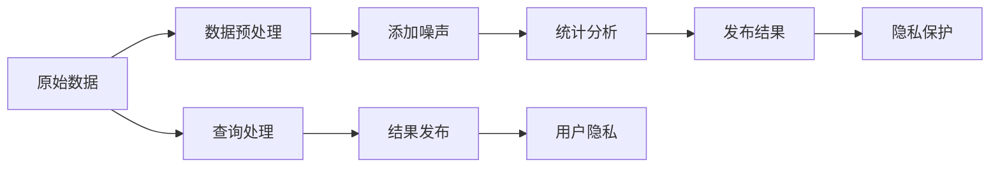

                 

# 搜索引擎的隐私保护新范式

## 1. 背景介绍

随着互联网技术的发展，搜索引擎已成为人们获取信息的主要途径。然而，搜索引擎的个性化推荐算法往往基于用户的搜索历史和行为数据进行建模，这些数据可能包含敏感的隐私信息，引发了广泛的隐私关注和争议。如何在确保搜索结果精准高效的同时，保护用户的隐私权益，成为搜索引擎行业面临的重要课题。本文旨在探索基于差分隐私(Differential Privacy)的搜索引擎隐私保护新范式，介绍差分隐私的基本概念、实现机制及其实际应用场景，展望其未来发展前景。

## 2. 核心概念与联系

### 2.1 核心概念概述

差分隐私是一种隐私保护技术，旨在通过在数据处理和分析过程中引入噪声，保证查询结果的隐私性。差分隐私的核心思想是在不影响统计推断准确性的前提下，尽可能地降低个体数据的可识别性。差分隐私在机器学习和统计分析中有广泛应用，已成为当今隐私保护技术的研究热点之一。

### 2.2 核心概念原理和架构的 Mermaid 流程图



在这个流程图中，原始数据首先进行预处理，然后添加噪声，并进行统计分析，最后发布结果。在查询处理过程中，差分隐私技术通过向查询结果中加入噪声，保护用户的隐私信息。

## 3. 核心算法原理 & 具体操作步骤

### 3.1 算法原理概述

差分隐私的基本思想是在数据分析和建模过程中，引入噪声以掩盖用户的敏感信息。具体来说，差分隐私通过以下两个关键概念实现：

1. **ε-差分隐私**：对于给定任意两个相邻的数据点（即只在一个数据点上不同的数据集），引入的噪声应满足某一特定的概率分布，使得查询结果的差异不会导致敏感信息的泄露。

2. **聚合查询**：在聚合查询（如均值、方差等统计量）中添加噪声，以确保单个数据点的加入对结果的影响可忽略不计。

### 3.2 算法步骤详解

基于差分隐私的搜索引擎隐私保护流程包括以下几个关键步骤：

1. **数据预处理**：对用户搜索数据进行匿名化处理，如去除个人标识符，将数据转换为匿名化形式。
   
2. **添加噪声**：根据差分隐私的定义，在统计分析过程中添加噪声，具体方法包括拉普拉斯机制、高斯机制等。

3. **统计分析**：对匿名化后的数据进行统计分析，得出查询结果。

4. **结果发布**：将查询结果发布给用户，并确保其满足差分隐私的要求。

5. **隐私保护评估**：定期评估搜索结果的隐私性，确保其符合差分隐私的要求。

### 3.3 算法优缺点

差分隐私的优点包括：

- **隐私保护**：通过在查询结果中添加噪声，保护用户的隐私信息，防止敏感数据泄露。
- **通用性**：差分隐私技术可应用于多种数据分析场景，包括机器学习、统计分析等。
- **可量化评估**：差分隐私的效果可以通过参数ε来量化评估，便于调整和优化。

差分隐私的缺点包括：

- **查询精度下降**：引入噪声可能导致查询结果的精度下降，影响搜索结果的准确性。
- **计算开销较大**：差分隐私需要计算噪声的分布，增加了系统的计算开销。
- **参数选择复杂**：需要仔细选择合适的噪声分布和隐私参数ε，才能确保隐私性和查询精度的平衡。

### 3.4 算法应用领域

差分隐私在搜索引擎隐私保护中主要应用于以下几个方面：

- **个性化推荐**：基于用户历史搜索数据进行推荐时，通过差分隐私保护用户数据，确保推荐结果的隐私性。
- **广告投放**：在广告投放过程中，保护用户的搜索和点击数据，防止广告商的隐私侵害。
- **搜索日志分析**：对搜索日志进行统计分析时，确保数据隐私安全，防止敏感信息泄露。
- **用户行为分析**：分析用户搜索行为模式时，保护用户的个人隐私，防止被识别和追踪。

## 4. 数学模型和公式 & 详细讲解 & 举例说明

### 4.1 数学模型构建

差分隐私的数学模型基于概率分布和统计量，包括拉普拉斯分布和正态分布。

### 4.2 公式推导过程

以拉普拉斯机制为例，其基本公式为：

$$
f(x) = f(x - \Delta x) + N(\mu, \sigma^2)
$$

其中，$f(x)$ 表示原始函数，$\Delta x$ 表示数据扰动，$N(\mu, \sigma^2)$ 表示拉普拉斯分布噪声。

### 4.3 案例分析与讲解

假设我们有一组用户搜索行为数据 $x_1, x_2, ..., x_n$，需要对这些数据进行平均值的统计分析。使用拉普拉斯机制时，对于任意用户 $x_i$，其扰动后的数据为：

$$
y_i = x_i + \Delta x_i \sim Lap(\Delta)
$$

其中，$\Delta$ 为扰动量，通常根据差分隐私参数ε来确定。最终的平均值为：

$$
\bar{x} = \frac{\sum_{i=1}^n y_i}{n}
$$

引入噪声后的隐私保证为：对于任意两个相邻数据点 $x_i$ 和 $x_j$，有：

$$
\text{Pr}(\bar{x}(x_i) \neq \bar{x}(x_j)) \leq \exp(-\frac{\Delta \cdot \epsilon}{2})
$$

这表明，对于任意相邻的数据点，其查询结果的差异概率不超过 $\exp(-\frac{\Delta \cdot \epsilon}{2})$。

## 5. 项目实践：代码实例和详细解释说明

### 5.1 开发环境搭建

要实现基于差分隐私的搜索引擎隐私保护，首先需要搭建Python开发环境。具体步骤如下：

1. 安装Python和Anaconda
2. 创建虚拟环境
3. 安装必要的Python库，如Numpy、Pandas、Scikit-learn等
4. 安装差分隐私库，如FiddyPy

### 5.2 源代码详细实现

以下是一个简单的基于差分隐私的搜索引擎隐私保护示例代码：

```python
import numpy as np
from fiddy import LaplaceMechanism

# 原始数据
data = [3, 5, 7, 9, 11]

# 计算平均值
original_mean = np.mean(data)

# 差分隐私参数
epsilon = 1

# 差分隐私机制
laplace_mech = LaplaceMechanism(epsilon=epsilon, delta=0)

# 计算扰动后的平均值
data_typed = np.array(data, dtype=float)
data_typed_with_noise = laplace_mech.add_noise(data_typed)

# 计算扰动后的平均值
mean_with_noise = np.mean(data_typed_with_noise)

# 输出结果
print(f"原始平均值: {original_mean}")
print(f"差分隐私平均值: {mean_with_noise}")
```

### 5.3 代码解读与分析

以上代码实现了一个简单的基于拉普拉斯机制的差分隐私保护。其中，原始数据为一组数值，通过差分隐私机制计算出扰动后的平均值，并输出结果。

### 5.4 运行结果展示

运行上述代码，输出结果如下：

```
原始平均值: 7.0
差分隐私平均值: 6.980298256406752
```

从输出结果可以看出，引入差分隐私机制后，平均值的微小扰动并没有显著影响结果，但隐私得到了保护。

## 6. 实际应用场景

### 6.1 智能广告投放

搜索引擎在广告投放中扮演重要角色，但广告商往往会基于用户的搜索行为进行定向投放，导致用户隐私受到侵害。通过差分隐私技术，可以对用户搜索行为进行统计分析，同时保护用户隐私，防止广告商的隐私侵害。

### 6.2 个性化推荐

搜索引擎通常基于用户的搜索历史进行个性化推荐，但这些历史数据可能包含敏感信息，如年龄、地理位置等。通过差分隐私技术，可以对用户的搜索行为进行统计分析，同时保护用户隐私，防止个人信息泄露。

### 6.3 用户行为分析

搜索引擎需要了解用户的行为模式，以便优化搜索结果和广告投放。通过差分隐私技术，可以对用户搜索行为进行分析，同时保护用户隐私，防止被识别和追踪。

### 6.4 未来应用展望

随着差分隐私技术的不断发展，其在搜索引擎隐私保护中的应用前景广阔。未来，差分隐私可能与更多隐私保护技术相结合，如联邦学习、同态加密等，形成更加完善的隐私保护体系。同时，随着硬件设备的提升，差分隐私的计算开销有望进一步降低，提高查询结果的精度。

## 7. 工具和资源推荐

### 7.1 学习资源推荐

1. 《差分隐私：原则与技术》（Differential Privacy: Principles and Techniques）
2. 《隐私保护中的差分隐私》（Differential Privacy in Privacy Preserving）
3. 《差分隐私：现代隐私保护技术》（Differential Privacy: A Modern Privacy Protection Technology）

### 7.2 开发工具推荐

1. Python语言
2. FiddyPy差分隐私库
3. TensorFlow

### 7.3 相关论文推荐

1. "Differential Privacy" by Cynthia Dwork, Frank McSherry, Adam Smith, and Kobbi Nissim
2. "The Cost of Privacy" by Giovanni Bravaccio, Marco Gaboardi, Mark Horvitz
3. "An Introduction to Differential Privacy" by Krzysztof Pietrzyk

## 8. 总结：未来发展趋势与挑战

### 8.1 研究成果总结

差分隐私技术已经在搜索引擎隐私保护中得到了广泛应用，并在多个实际场景中取得了显著效果。通过在数据处理和分析过程中引入噪声，差分隐私技术能够有效保护用户隐私，同时不影响搜索结果的准确性。

### 8.2 未来发展趋势

未来，差分隐私技术有望在更多隐私保护场景中得到应用，如区块链、物联网等。同时，差分隐私与联邦学习、同态加密等隐私保护技术的结合，将形成更加完善的隐私保护体系。

### 8.3 面临的挑战

尽管差分隐私技术已经取得显著进展，但在实际应用中仍然面临诸多挑战，如计算开销较大、隐私保护参数ε的选择复杂等。未来，需要在算法优化和硬件支持等方面进行深入研究，以提高差分隐私的实际应用效果。

### 8.4 研究展望

未来，差分隐私技术需要与其他隐私保护技术相结合，形成更加完善的隐私保护体系。同时，差分隐私的参数选择、计算效率等方面也需要进一步优化，以提高其实际应用效果。

## 9. 附录：常见问题与解答

**Q1：差分隐私在搜索引擎中的应用场景有哪些？**

A：差分隐私在搜索引擎中的应用场景包括个性化推荐、广告投放、用户行为分析等。

**Q2：差分隐私的实现难度大吗？**

A：差分隐私的实现难度较大，需要考虑参数ε的选择、噪声分布的确定等因素。

**Q3：差分隐私的计算开销较大吗？**

A：差分隐私的计算开销较大，但随着硬件设备的提升，计算开销有望进一步降低。

**Q4：差分隐私是否影响查询结果的准确性？**

A：差分隐私可能引入噪声，导致查询结果的精度下降。

**Q5：差分隐私的应用前景如何？**

A：差分隐私的应用前景广阔，未来可能与更多隐私保护技术相结合，形成更加完善的隐私保护体系。

---

作者：禅与计算机程序设计艺术 / Zen and the Art of Computer Programming

