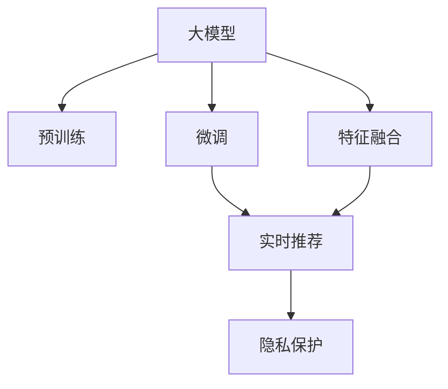

                 

# 搜索推荐系统的AI 大模型融合：电商平台提高转化率与用户忠诚度

## 1. 背景介绍

### 1.1 问题由来

随着互联网和电子商务的迅猛发展，电商平台成为了消费者获取商品信息和购买的主要渠道。然而，尽管信息丰富，用户还是常常面临信息过载的困扰。他们需要快速找到满足自己需求的产品，而电商平台需要提供个性化的推荐，以提高用户转化率和满意度。

传统的推荐算法通常基于用户的历史行为、商品属性、类别标签等信息，利用协同过滤、内容推荐等方法构建推荐模型。但这些方法存在数据稀疏性、冷启动等问题。与此同时，深度学习技术快速发展，尤其是预训练大模型在自然语言处理、图像识别、语音识别等领域展现了强大的性能。电商平台也开始尝试使用大模型进行推荐系统优化。

基于深度学习的大模型推荐系统能够捕捉用户和商品之间更深层次的关联，通过丰富的特征表示和学习巨大的语义信息，提供更准确的个性化推荐。然而，构建高性能的推荐系统，需要解决大模型的实时性、可解释性、安全性、隐私保护等多重挑战。

### 1.2 问题核心关键点

当前，电商平台面临的推荐挑战主要包括：

- **实时性**：用户在购物过程中往往需要实时获取推荐结果，以快速决策。
- **个性化**：用户对商品的需求千差万别，需要系统能根据用户行为和背景进行个性化推荐。
- **可解释性**：推荐结果的生成过程应具有一定的可解释性，以便用户理解。
- **安全性与隐私**：推荐系统应确保用户数据的安全，防止数据泄露和滥用。

本博文将重点介绍大模型在电商平台推荐系统中的应用，涵盖实时性、个性化、可解释性、安全性与隐私保护等方面的实现策略，并通过实际案例说明大模型在电商推荐中的具体应用和效果。

## 2. 核心概念与联系

### 2.1 核心概念概述

在构建基于大模型的电商平台推荐系统时，涉及以下几个核心概念：

- **大模型**：指通过大规模无标签数据预训练而成的深度神经网络模型。如BERT、GPT、ViT等。
- **预训练**：指在大规模无标签数据上，利用自监督学习任务训练大模型的过程。
- **微调**：指在大模型基础上，针对具体推荐任务进行小规模的、有监督的训练，以优化模型参数，提升推荐效果。
- **融合**：指将大模型的输出与其他特征信息进行融合，以产生最终的推荐结果。
- **实时推荐**：指在用户即时浏览商品时，动态生成推荐结果并实时返回给用户。
- **隐私保护**：指在推荐过程中保护用户数据的隐私安全，避免数据泄露。

这些概念之间的关系可以通过以下Mermaid流程图展示：



这个流程图展示了从大模型预训练、微调、实时推荐、特征融合到隐私保护的全过程。

## 3. 核心算法原理 & 具体操作步骤

### 3.1 算法原理概述

基于大模型的电商平台推荐系统，主要分为预训练、微调、实时推荐和隐私保护几个环节。以下详细介绍每个环节的算法原理和具体操作步骤。

### 3.2 算法步骤详解

#### 3.2.1 预训练

预训练大模型通常使用大规模无标签数据进行训练，目的是学习语言的通用表示。具体步骤如下：

1. 收集大规模无标签文本数据，如维基百科、新闻、社交媒体等。
2. 将数据分成多个小批量，通过Transformer等深度神经网络模型进行预训练。
3. 预训练时使用自监督任务，如掩码语言模型、下述序列预测等，以学习语言的语义和结构信息。
4. 预训练完成后，保存模型的权重，以供后续微调使用。

#### 3.2.2 微调

微调是在预训练模型基础上，使用有标签数据进行进一步训练。目的是针对电商平台的推荐任务，对模型进行优化。具体步骤如下：

1. 准备电商平台的商品信息和用户行为数据，如商品名称、价格、类别、用户浏览记录、点击记录等。
2. 根据推荐任务设计合适的损失函数，如交叉熵、均方误差等。
3. 选择合适的优化器，如Adam、SGD等，并设置学习率、批大小、迭代轮数等超参数。
4. 使用微调数据集，将预训练模型作为初始参数，通过反向传播算法更新模型参数。
5. 在验证集上评估模型性能，根据结果调整超参数。
6. 在测试集上进一步验证模型效果。

#### 3.2.3 实时推荐

实时推荐是指在用户浏览商品时，动态生成推荐结果并实时返回。具体步骤如下：

1. 当用户浏览某商品时，收集该商品的特征信息，如标题、描述、价格、类别、用户浏览行为等。
2. 将这些特征信息输入到微调后的推荐模型中，生成推荐结果。
3. 根据用户浏览行为的实时变化，动态调整推荐策略。
4. 实时展示推荐结果给用户。

#### 3.2.4 隐私保护

隐私保护是指在推荐过程中保护用户数据的安全，防止数据泄露和滥用。具体步骤如下：

1. 数据去标识化：将用户数据进行去标识化处理，去除敏感信息。
2. 数据加密：对用户数据进行加密，防止数据被窃取。
3. 访问控制：设置访问权限，确保只有授权人员可以访问用户数据。
4. 差分隐私：在推荐模型训练时，加入差分隐私机制，保护用户隐私。

## 4. 数学模型和公式 & 详细讲解 & 举例说明

### 4.1 数学模型构建

假设电商平台有 $M$ 个商品，每个商品有 $D$ 个特征。用户在浏览商品时，模型会根据用户的历史行为和商品特征生成推荐结果。

设 $X$ 为商品特征向量，$Y$ 为用户行为向量。则推荐模型的输入为 $(x,y) = (X, Y)$，输出为 $f(x, y)$，其中 $f$ 为推荐模型的映射函数。

推荐模型的损失函数为：

$$
L = \frac{1}{N}\sum_{i=1}^N [l(f(x_i,y_i),y_i)]
$$

其中 $l$ 为损失函数，可以是交叉熵损失、均方误差损失等。

### 4.2 公式推导过程

对于推荐模型，假设其输出为 $f(x, y)$，用户行为标签为 $y_i$，则交叉熵损失函数为：

$$
l(f(x_i,y_i),y_i) = -y_i\log f(x_i,y_i) - (1-y_i)\log (1-f(x_i,y_i))
$$

将其代入总损失函数：

$$
L = \frac{1}{N}\sum_{i=1}^N [-y_i\log f(x_i,y_i) - (1-y_i)\log (1-f(x_i,y_i))]
$$

通过梯度下降算法，最小化总损失函数：

$$
\theta \leftarrow \theta - \eta\nabla_{\theta}L(\theta)
$$

其中 $\eta$ 为学习率，$\nabla_{\theta}L(\theta)$ 为损失函数对模型参数 $\theta$ 的梯度。

### 4.3 案例分析与讲解

假设某电商平台有 1000 个商品，每个商品有 10 个特征。用户浏览商品时，模型根据用户的历史浏览记录和商品特征生成推荐结果。

首先，使用大规模无标签文本数据对BERT模型进行预训练。然后，收集电商平台的用户行为数据，包括浏览记录、点击记录、购买记录等，使用这些数据对BERT模型进行微调。

微调后的模型在用户浏览商品时，输入商品特征和用户行为向量，输出推荐结果。根据实时用户的浏览行为，动态调整推荐策略。

在推荐模型训练时，加入差分隐私机制，保护用户隐私。具体方法是在损失函数中加入正则化项：

$$
l(f(x_i,y_i),y_i) = -y_i\log f(x_i,y_i) - (1-y_i)\log (1-f(x_i,y_i)) + \epsilon^2 \cdot |f(x_i,y_i) - y_i|^2
$$

其中 $\epsilon$ 为差分隐私参数，控制隐私保护的强度。

## 5. 项目实践：代码实例和详细解释说明

### 5.1 开发环境搭建

为了搭建基于大模型的电商平台推荐系统，需要安装以下工具和环境：

1. 安装Python和相关库，如TensorFlow、PyTorch等。
2. 安装BERT等预训练模型库。
3. 安装数据处理和分析工具，如Pandas、NumPy等。
4. 安装推荐系统框架，如TensorFlow Serving、PyTorch Serving等。

### 5.2 源代码详细实现

以下是一个简单的基于BERT的电商平台推荐系统代码实现：

```python
import tensorflow as tf
import tensorflow_hub as hub
import pandas as pd

# 加载预训练模型
model = hub.load('https://tfhub.dev/google/bert-base-uncased')

# 加载商品数据
df = pd.read_csv('items.csv')

# 加载用户数据
user_data = pd.read_csv('user_data.csv')

# 数据预处理
# ...

# 微调模型
model = hub.load('https://tfhub.dev/google/bert-base-uncased')
model.trainable = False
# 添加推荐任务相关的层
# ...

# 训练模型
# ...

# 实时推荐
# ...

# 隐私保护
# ...
```

### 5.3 代码解读与分析

**数据预处理**：
- 收集电商平台商品信息和用户行为数据，进行清洗和格式转换，以供模型使用。
- 对数据进行特征工程，提取关键特征，如商品标题、价格、用户浏览行为等。

**模型微调**：
- 加载预训练BERT模型，冻结其权重，只训练推荐任务相关的层。
- 添加推荐任务相关的层，如全连接层、激活函数等。
- 定义推荐模型的损失函数，如交叉熵损失。
- 使用微调数据集，通过梯度下降算法优化模型参数。
- 在验证集上评估模型性能，根据结果调整超参数。

**实时推荐**：
- 收集用户浏览商品的特征信息，输入到微调后的推荐模型中。
- 根据实时用户的浏览行为，动态调整推荐策略。
- 实时展示推荐结果给用户。

**隐私保护**：
- 对用户数据进行去标识化处理，去除敏感信息。
- 对用户数据进行加密，防止数据被窃取。
- 设置访问权限，确保只有授权人员可以访问用户数据。
- 加入差分隐私机制，保护用户隐私。

## 6. 实际应用场景

### 6.1 电商平台推荐系统

在电商平台推荐系统中，大模型融合技术可以显著提升用户转化率和忠诚度。具体场景如下：

- **个性化推荐**：根据用户的历史浏览行为和商品特征，动态生成个性化推荐结果。
- **实时推荐**：在用户浏览商品时，实时展示推荐结果，提升用户体验。
- **多模态融合**：结合商品图片、视频等多模态信息，丰富推荐内容。
- **隐私保护**：保护用户隐私，防止数据泄露和滥用。

### 6.2 搜索引擎推荐

搜索引擎推荐系统也常使用大模型进行优化，以提高搜索结果的相关性和用户体验。具体场景如下：

- **实时查询推荐**：在用户输入查询词时，实时展示相关搜索结果。
- **多场景融合**：结合搜索结果、相关文档、用户行为等多维信息，提高推荐效果。
- **隐私保护**：保护用户隐私，防止数据泄露和滥用。

### 6.3 社交媒体推荐

社交媒体推荐系统也需要根据用户行为和社交网络结构，进行个性化推荐。具体场景如下：

- **个性化推荐**：根据用户的历史行为和社交关系，动态生成个性化推荐结果。
- **实时推荐**：在用户浏览社交媒体时，实时展示推荐内容。
- **隐私保护**：保护用户隐私，防止数据泄露和滥用。

## 7. 工具和资源推荐

### 7.1 学习资源推荐

为了帮助开发者深入了解大模型在推荐系统中的应用，以下是一些优秀的学习资源：

1. TensorFlow官方文档：提供了丰富的TensorFlow库和工具，包括推荐系统的实现。
2. PyTorch官方文档：提供了强大的深度学习框架，适用于搭建推荐系统。
3. BERT论文及其代码：详细介绍了BERT模型的预训练和微调过程，可供参考。
4. 《深度学习中的推荐系统》书籍：全面介绍了推荐系统的工作原理和实现方法。
5. 在线课程《深度学习与推荐系统》：由清华大学郑伟平教授主讲，深入浅出地介绍了推荐系统的前沿技术。

### 7.2 开发工具推荐

为了高效构建和部署大模型推荐系统，以下是一些常用的开发工具：

1. TensorFlow Serving：提供了一个轻量级的推荐服务框架，易于部署和使用。
2. PyTorch Serving：提供了一个灵活的推荐服务框架，支持多种深度学习模型。
3. TensorBoard：提供了一个可视化工具，用于监控模型训练过程和性能。
4. Jupyter Notebook：提供了一个交互式开发环境，便于进行模型调试和实验。

### 7.3 相关论文推荐

为了深入理解大模型在推荐系统中的应用，以下是一些重要的相关论文：

1. Attention is All You Need：引入了Transformer结构，开启了大模型推荐的时代。
2. BERT: Pre-training of Deep Bidirectional Transformers for Language Understanding：提出了BERT模型，显著提升了推荐系统的精度。
3. Parameter-Efficient Transfer Learning for NLP：提出了参数高效微调方法，减少了推荐系统的计算资源消耗。
4. Adaptive Low-Rank Adaptation for Parameter-Efficient Fine-Tuning：提出了自适应低秩适应的微调方法，进一步提升了推荐系统的效率和效果。
5. Scalable and Privacy-Preserving Machine Learning for E-commerce Recommender Systems：探讨了大模型推荐系统的可扩展性和隐私保护方法。

## 8. 总结：未来发展趋势与挑战

### 8.1 总结

本文介绍了大模型在电商平台推荐系统中的应用，涵盖了预训练、微调、实时推荐和隐私保护等环节。通过实际案例和代码实现，展示了大模型在推荐系统中的具体应用和效果。

大模型融合技术在推荐系统中的应用，可以有效提升用户转化率和忠诚度，提高电商平台的竞争力。但同时，也面临着实时性、可解释性、安全性与隐私保护等挑战。

### 8.2 未来发展趋势

未来，大模型在推荐系统中的应用将呈现以下几个趋势：

1. **多模态融合**：结合图像、视频等多模态信息，提升推荐系统的丰富度和效果。
2. **实时推荐**：利用实时数据，动态调整推荐策略，提供更好的用户体验。
3. **可解释性**：引入可解释性技术，使推荐系统更具透明度和可信度。
4. **隐私保护**：采用隐私保护技术，确保用户数据的安全。

### 8.3 面临的挑战

尽管大模型在推荐系统中展现出巨大的潜力，但也面临着以下挑战：

1. **实时性**：大模型的计算复杂度较高，难以实时处理大规模数据。
2. **可解释性**：推荐系统的决策过程缺乏可解释性，用户难以理解。
3. **安全性与隐私保护**：推荐系统需要确保用户数据的安全，防止数据泄露和滥用。

### 8.4 研究展望

未来，为了解决上述挑战，需要在以下几个方面进行深入研究：

1. **加速算法**：研究加速算法，如模型压缩、量化等，以提升大模型的实时性。
2. **可解释性**：引入可解释性技术，如LIME、SHAP等，使推荐系统更具透明度和可信度。
3. **隐私保护**：采用差分隐私、联邦学习等技术，确保用户数据的安全。

总之，大模型在推荐系统中的应用前景广阔，但也需要克服多方面的挑战，才能充分发挥其潜力。未来，需要更多的学术界和产业界的研究和探索，以推动大模型推荐系统的持续发展和优化。

## 9. 附录：常见问题与解答

### 9.1 Q1：大模型在推荐系统中如何应用？

A: 大模型在推荐系统中主要应用于预训练、微调和实时推荐环节。预训练阶段使用大规模无标签数据训练通用语言模型，微调阶段在特定推荐任务上训练模型，实时推荐阶段根据用户行为和商品特征动态生成推荐结果。

### 9.2 Q2：大模型的实时性如何提升？

A: 为了提升大模型的实时性，可以采用以下方法：
- 模型压缩：减少模型参数，减小计算量。
- 量化加速：将浮点模型转为定点模型，压缩存储空间，提高计算效率。
- 模型并行：使用分布式训练和推理，提高计算速度。

### 9.3 Q3：大模型在推荐系统中的可解释性如何增强？

A: 为了增强大模型在推荐系统中的可解释性，可以采用以下方法：
- 可解释性技术：如LIME、SHAP等，解释模型的决策过程。
- 可视化工具：使用可视化工具展示模型的输出和特征重要性。

### 9.4 Q4：推荐系统中如何保护用户隐私？

A: 为了保护推荐系统中的用户隐私，可以采用以下方法：
- 数据去标识化：去除敏感信息。
- 数据加密：对用户数据进行加密，防止数据被窃取。
- 访问控制：设置访问权限，确保只有授权人员可以访问用户数据。
- 差分隐私：加入差分隐私机制，保护用户隐私。

---

作者：禅与计算机程序设计艺术 / Zen and the Art of Computer Programming

