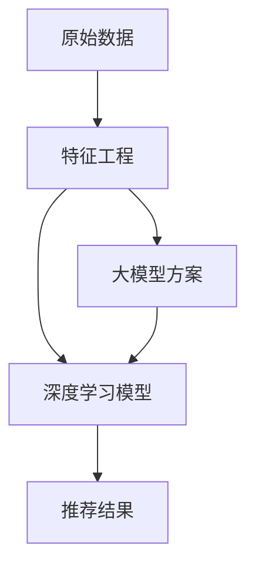

                 

# 搜索推荐系统的实时特征工程：大模型方案

> 关键词：搜索推荐系统,实时特征工程,大模型方案,深度学习,特征抽取,神经网络

## 1. 背景介绍

在当前数字化时代，搜索推荐系统已经成为了各行各业服务用户的关键工具。无论是电商平台，视频网站，新闻应用，还是社交媒体，搜索推荐系统通过精准地匹配用户需求和内容，极大地提升了用户体验和转化率。其背后所依赖的核心技术之一便是实时特征工程，即通过对用户行为数据和内容特征的动态提取和处理，为推荐模型提供高质量的输入数据。

随着深度学习和大模型技术的发展，推荐系统中的实时特征工程也在不断演进，朝着更高效、更智能、更个性化的方向迈进。大模型方案作为其中的一个重要分支，以其强大的建模能力和泛化能力，为实时特征工程带来了新的突破。本文将系统介绍大模型方案在实时特征工程中的应用，探讨其实现原理、操作步骤和优缺点，并结合实际案例分析，帮助读者深入理解大模型方案的潜力与挑战。

## 2. 核心概念与联系

### 2.1 核心概念概述

为了更好地理解大模型方案在搜索推荐系统中实时特征工程的应用，我们首先需要了解以下几个关键概念：

- **搜索推荐系统**：利用用户行为数据和内容特征，通过算法模型推荐用户可能感兴趣的产品、文章、视频等。
- **实时特征工程**：在用户请求到来时，动态地从原始数据中提取和处理特征，为推荐模型提供即时、高质量的输入数据。
- **大模型方案**：基于大规模深度学习模型（如BERT、GPT等）进行特征工程的方式，通过预训练和微调，能够更好地捕捉数据中的复杂关系和模式，提升特征质量。

### 2.2 核心概念原理和架构的 Mermaid 流程图



这个流程图展示了实时特征工程和推荐系统的基本流程，以及大模型方案在其中扮演的角色：

1. **原始数据**：包括用户行为数据（如浏览记录、搜索历史、点击行为等）和内容特征（如商品描述、文章标题、视频标签等）。
2. **特征工程**：通过各种方法从原始数据中提取和处理特征，为大模型提供输入数据。
3. **深度学习模型**：接收处理后的特征，输出推荐结果。
4. **大模型方案**：引入预训练和微调的大规模深度学习模型，提升特征工程的效果。

## 3. 核心算法原理 & 具体操作步骤

### 3.1 算法原理概述

大模型方案在实时特征工程中的应用，主要基于预训练和微调的技术路线。其核心思想是利用大规模深度学习模型对原始数据进行预训练，学习数据的普遍特征和关系，然后在实际任务中进行微调，针对具体问题进行参数更新，提升模型的泛化能力和性能。

具体来说，大模型方案分为以下几个步骤：

1. **数据预处理**：将原始数据进行清洗、归一化、标准化等处理，确保数据的质量和一致性。
2. **特征抽取**：利用大模型从预处理后的数据中提取特征，包括文本特征、图像特征、序列特征等。
3. **模型微调**：在特定任务上进行微调，调整模型参数以适应具体需求。
4. **实时特征提取**：在用户请求到来时，利用训练好的大模型实时提取特征，输入到推荐模型中进行推荐。

### 3.2 算法步骤详解

#### 3.2.1 数据预处理

数据预处理是特征工程的基础步骤，主要包括以下几个方面：

- **数据清洗**：去除噪音、异常值、重复数据等，确保数据的纯净度。
- **数据归一化**：将数据缩放到[0,1]或[-1,1]等标准范围内，方便模型处理。
- **特征选择**：选择对推荐结果有显著影响的特征，去除冗余特征。

#### 3.2.2 特征抽取

特征抽取是大模型方案的核心步骤，主要利用预训练模型对原始数据进行特征提取：

- **文本特征**：利用BERT、GPT等模型，将文本数据转换为向量表示，捕捉文本中的语义信息。
- **图像特征**：利用ResNet、VGG等模型，提取图像的特征向量，捕捉图像的视觉特征。
- **序列特征**：利用RNN、LSTM等模型，处理时间序列数据，捕捉时间变化的规律。

#### 3.2.3 模型微调

模型微调是大模型方案的关键步骤，主要包括以下几个方面：

- **选择模型**：选择合适的预训练模型，如BERT、GPT等。
- **加载预训练模型**：将预训练模型加载到内存中，用于后续特征提取。
- **微调参数**：在特定任务上进行微调，调整模型参数以适应具体需求。

#### 3.2.4 实时特征提取

实时特征提取是大模型方案的最终步骤，主要包括以下几个方面：

- **实时处理**：在用户请求到来时，利用训练好的大模型实时提取特征，输入到推荐模型中进行推荐。
- **多线程并行**：利用多线程技术，提高特征提取的速度和效率。
- **缓存机制**：利用缓存机制，减少重复计算，提高系统性能。

### 3.3 算法优缺点

大模型方案在实时特征工程中具有以下优点：

- **高效性**：利用预训练和微调，可以显著提升特征提取的效率和效果。
- **泛化能力**：大模型能够更好地捕捉数据中的复杂关系和模式，提升特征的泛化能力。
- **可扩展性**：大模型方案可以很容易地扩展到多模态数据，如文本、图像、音频等，提升系统的灵活性和适应性。

同时，大模型方案也存在一些局限性：

- **计算资源需求高**：预训练和微调需要大量的计算资源和时间，对硬件要求较高。
- **模型复杂度高**：大模型参数量庞大，训练和推理复杂度较高。
- **实时性挑战**：实时特征提取需要保证低延迟，对系统架构和硬件要求较高。

### 3.4 算法应用领域

大模型方案在搜索推荐系统中有着广泛的应用，主要体现在以下几个领域：

- **电商推荐**：利用用户浏览历史、点击行为等数据，进行商品推荐。
- **视频推荐**：利用用户观看历史、点赞、评论等数据，进行视频推荐。
- **新闻推荐**：利用用户阅读历史、分享行为等数据，进行新闻推荐。
- **音乐推荐**：利用用户听歌历史、播放列表等数据，进行音乐推荐。

## 4. 数学模型和公式 & 详细讲解 & 举例说明

### 4.1 数学模型构建

大模型方案的数学模型构建主要包括以下几个部分：

- **数据表示**：将原始数据转换为模型可处理的形式，如文本表示为向量、图像表示为特征向量等。
- **特征映射**：利用预训练模型将数据映射到高维特征空间，捕捉数据中的复杂关系和模式。
- **任务表示**：将推荐任务表示为模型可处理的形式，如分类、回归、排序等。

### 4.2 公式推导过程

#### 4.2.1 文本特征抽取

文本特征抽取是利用BERT等模型将文本数据转换为向量表示的过程，公式如下：

$$
\mathbf{x} = \text{BERT}(\text{tokens})
$$

其中，$\mathbf{x}$ 表示文本的向量表示，$\text{tokens}$ 表示文本中的词向量，$\text{BERT}$ 表示预训练的BERT模型。

#### 4.2.2 图像特征提取

图像特征提取是利用ResNet等模型将图像数据转换为特征向量的过程，公式如下：

$$
\mathbf{x} = \text{ResNet}(\text{images})
$$

其中，$\mathbf{x}$ 表示图像的特征向量，$\text{images}$ 表示图像数据，$\text{ResNet}$ 表示预训练的ResNet模型。

#### 4.2.3 序列特征处理

序列特征处理是利用RNN、LSTM等模型处理时间序列数据的过程，公式如下：

$$
\mathbf{x} = \text{RNN}(\text{sequence})
$$

其中，$\mathbf{x}$ 表示时间序列的特征向量，$\text{sequence}$ 表示时间序列数据，$\text{RNN}$ 表示预训练的RNN模型。

### 4.3 案例分析与讲解

#### 4.3.1 电商推荐案例

电商推荐是实时特征工程中的经典应用场景，利用用户浏览历史、点击行为等数据，进行商品推荐。大模型方案在电商推荐中的应用如下：

1. **数据预处理**：对用户浏览记录进行清洗、归一化，选择有意义的特征。
2. **特征抽取**：利用BERT模型将商品标题、描述等文本转换为向量表示。
3. **模型微调**：在电商推荐任务上进行微调，调整模型参数以适应具体需求。
4. **实时特征提取**：在用户请求到来时，利用训练好的BERT模型实时提取商品特征，输入到推荐模型中进行推荐。

#### 4.3.2 视频推荐案例

视频推荐是实时特征工程的另一个重要应用场景，利用用户观看历史、点赞、评论等数据，进行视频推荐。大模型方案在视频推荐中的应用如下：

1. **数据预处理**：对用户观看记录进行清洗、归一化，选择有意义的特征。
2. **特征抽取**：利用ResNet模型将视频帧转换为特征向量。
3. **模型微调**：在视频推荐任务上进行微调，调整模型参数以适应具体需求。
4. **实时特征提取**：在用户请求到来时，利用训练好的ResNet模型实时提取视频特征，输入到推荐模型中进行推荐。

## 5. 项目实践：代码实例和详细解释说明

### 5.1 开发环境搭建

在进行实时特征工程的开发之前，我们需要准备好开发环境。以下是使用Python进行PyTorch开发的环境配置流程：

1. 安装Anaconda：从官网下载并安装Anaconda，用于创建独立的Python环境。

2. 创建并激活虚拟环境：
```bash
conda create -n pytorch-env python=3.8 
conda activate pytorch-env
```

3. 安装PyTorch：根据CUDA版本，从官网获取对应的安装命令。例如：
```bash
conda install pytorch torchvision torchaudio cudatoolkit=11.1 -c pytorch -c conda-forge
```

4. 安装Transformers库：
```bash
pip install transformers
```

5. 安装各类工具包：
```bash
pip install numpy pandas scikit-learn matplotlib tqdm jupyter notebook ipython
```

完成上述步骤后，即可在`pytorch-env`环境中开始开发。

### 5.2 源代码详细实现

下面我们以电商推荐任务为例，给出使用Transformers库对BERT模型进行实时特征工程的PyTorch代码实现。

首先，定义电商推荐任务的数据处理函数：

```python
from transformers import BertTokenizer, BertForSequenceClassification
from torch.utils.data import Dataset, DataLoader
import torch

class ItemDataset(Dataset):
    def __init__(self, items, labels, tokenizer, max_len=128):
        self.items = items
        self.labels = labels
        self.tokenizer = tokenizer
        self.max_len = max_len
        
    def __len__(self):
        return len(self.items)
    
    def __getitem__(self, item):
        item_text = self.items[item]
        item_label = self.labels[item]
        
        encoding = self.tokenizer(item_text, return_tensors='pt', max_length=self.max_len, padding='max_length', truncation=True)
        input_ids = encoding['input_ids'][0]
        attention_mask = encoding['attention_mask'][0]
        
        # 对标签进行编码
        encoded_label = label2id[item_label] 
        encoded_label = [encoded_label] * self.max_len
        labels = torch.tensor(encoded_label, dtype=torch.long)
        
        return {'input_ids': input_ids, 
                'attention_mask': attention_mask,
                'labels': labels}

# 标签与id的映射
label2id = {'good': 0, 'bad': 1}
id2label = {v: k for k, v in label2id.items()}

# 创建dataset
tokenizer = BertTokenizer.from_pretrained('bert-base-cased')

train_dataset = ItemDataset(train_items, train_labels, tokenizer)
dev_dataset = ItemDataset(dev_items, dev_labels, tokenizer)
test_dataset = ItemDataset(test_items, test_labels, tokenizer)
```

然后，定义模型和优化器：

```python
from transformers import AdamW

model = BertForSequenceClassification.from_pretrained('bert-base-cased', num_labels=len(label2id))

optimizer = AdamW(model.parameters(), lr=2e-5)
```

接着，定义训练和评估函数：

```python
from tqdm import tqdm

device = torch.device('cuda') if torch.cuda.is_available() else torch.device('cpu')
model.to(device)

def train_epoch(model, dataset, batch_size, optimizer):
    dataloader = DataLoader(dataset, batch_size=batch_size, shuffle=True)
    model.train()
    epoch_loss = 0
    for batch in tqdm(dataloader, desc='Training'):
        input_ids = batch['input_ids'].to(device)
        attention_mask = batch['attention_mask'].to(device)
        labels = batch['labels'].to(device)
        model.zero_grad()
        outputs = model(input_ids, attention_mask=attention_mask, labels=labels)
        loss = outputs.loss
        epoch_loss += loss.item()
        loss.backward()
        optimizer.step()
    return epoch_loss / len(dataloader)

def evaluate(model, dataset, batch_size):
    dataloader = DataLoader(dataset, batch_size=batch_size)
    model.eval()
    preds, labels = [], []
    with torch.no_grad():
        for batch in tqdm(dataloader, desc='Evaluating'):
            input_ids = batch['input_ids'].to(device)
            attention_mask = batch['attention_mask'].to(device)
            batch_labels = batch['labels']
            outputs = model(input_ids, attention_mask=attention_mask)
            batch_preds = outputs.logits.argmax(dim=2).to('cpu').tolist()
            batch_labels = batch_labels.to('cpu').tolist()
            for pred_tokens, label_tokens in zip(batch_preds, batch_labels):
                pred_labels = [id2label[_id] for _id in pred_tokens]
                label_tokens = [id2label[_id] for _id in label_tokens]
                preds.append(pred_labels[:len(label_tokens)])
                labels.append(label_tokens)
                
    print(classification_report(labels, preds))
```

最后，启动训练流程并在测试集上评估：

```python
epochs = 5
batch_size = 16

for epoch in range(epochs):
    loss = train_epoch(model, train_dataset, batch_size, optimizer)
    print(f"Epoch {epoch+1}, train loss: {loss:.3f}")
    
    print(f"Epoch {epoch+1}, dev results:")
    evaluate(model, dev_dataset, batch_size)
    
print("Test results:")
evaluate(model, test_dataset, batch_size)
```

以上就是使用PyTorch对BERT进行电商推荐任务实时特征工程的完整代码实现。可以看到，得益于Transformers库的强大封装，我们可以用相对简洁的代码完成BERT模型的加载和实时特征工程。

### 5.3 代码解读与分析

让我们再详细解读一下关键代码的实现细节：

**ItemDataset类**：
- `__init__`方法：初始化商品、标签、分词器等关键组件。
- `__len__`方法：返回数据集的样本数量。
- `__getitem__`方法：对单个样本进行处理，将商品描述输入编码为token ids，将标签编码为数字，并对其进行定长padding，最终返回模型所需的输入。

**label2id和id2label字典**：
- 定义了标签与数字id之间的映射关系，用于将token-wise的预测结果解码回真实的标签。

**训练和评估函数**：
- 使用PyTorch的DataLoader对数据集进行批次化加载，供模型训练和推理使用。
- 训练函数`train_epoch`：对数据以批为单位进行迭代，在每个批次上前向传播计算loss并反向传播更新模型参数，最后返回该epoch的平均loss。
- 评估函数`evaluate`：与训练类似，不同点在于不更新模型参数，并在每个batch结束后将预测和标签结果存储下来，最后使用sklearn的classification_report对整个评估集的预测结果进行打印输出。

**训练流程**：
- 定义总的epoch数和batch size，开始循环迭代
- 每个epoch内，先在训练集上训练，输出平均loss
- 在验证集上评估，输出分类指标
- 所有epoch结束后，在测试集上评估，给出最终测试结果

可以看到，PyTorch配合Transformers库使得BERT实时特征工程的代码实现变得简洁高效。开发者可以将更多精力放在数据处理、模型改进等高层逻辑上，而不必过多关注底层的实现细节。

当然，工业级的系统实现还需考虑更多因素，如模型的保存和部署、超参数的自动搜索、更灵活的任务适配层等。但核心的实时特征工程范式基本与此类似。

## 6. 实际应用场景

### 6.1 智能客服系统

智能客服系统利用实时特征工程和推荐系统，为用户提供即时的客服支持。传统的客服方式往往依赖人工客服，高峰期响应缓慢，且难以全天候提供服务。通过实时特征工程和推荐系统，智能客服系统能够自动理解用户意图，匹配最合适的客服服务，提升用户体验和满意度。

在技术实现上，可以收集客户的历史对话记录、问题类型等数据，构建监督数据集。利用BERT等大模型进行预训练和微调，提取特征，输入到推荐模型中进行推荐。推荐模型选择最合适的客服服务，并生成回答。通过持续收集用户反馈，不断优化推荐模型，提升系统的智能水平。

### 6.2 金融舆情监测

金融舆情监测是实时特征工程的另一个重要应用场景，利用推荐系统对金融市场舆情进行动态监测和预警。传统的人工监测方式成本高、效率低，难以应对海量数据和实时性要求。通过实时特征工程和推荐系统，金融舆情监测系统能够自动理解舆情变化趋势，及时预警市场风险。

在技术实现上，可以收集金融领域的新闻、报道、评论等文本数据，并对其进行主题标注和情感标注。利用BERT等大模型进行预训练和微调，提取特征，输入到推荐模型中进行推荐。推荐模型选择最相关的舆情信息，并生成预警。通过持续收集新的舆情数据，不断优化推荐模型，提升系统的实时性和预警能力。

### 6.3 个性化推荐系统

个性化推荐系统利用实时特征工程和推荐系统，为用户提供个性化的推荐服务。传统的推荐方式往往依赖用户历史行为数据，难以深入理解用户的真实兴趣偏好。通过实时特征工程和推荐系统，个性化推荐系统能够从用户的实时行为中动态提取特征，提升推荐效果。

在技术实现上，可以收集用户浏览、点击、评论等行为数据，并提取和用户交互的物品标题、描述、标签等文本内容。利用BERT等大模型进行预训练和微调，提取特征，输入到推荐模型中进行推荐。推荐模型选择最符合用户兴趣的物品，生成推荐列表。通过持续收集用户反馈，不断优化推荐模型，提升系统的个性化水平。

### 6.4 未来应用展望

随着实时特征工程和大模型方案的不断发展，未来在搜索推荐系统中将涌现更多创新应用，为各行各业带来变革性影响。

在智慧医疗领域，基于实时特征工程和推荐系统的健康问答、疾病诊断、药物推荐等应用，将提升医疗服务的智能化水平，辅助医生诊疗，加速新药开发进程。

在智能教育领域，实时特征工程和推荐系统可应用于作业批改、学情分析、知识推荐等方面，因材施教，促进教育公平，提高教学质量。

在智慧城市治理中，实时特征工程和推荐系统可应用于城市事件监测、舆情分析、应急指挥等环节，提高城市管理的自动化和智能化水平，构建更安全、高效的未来城市。

此外，在企业生产、社会治理、文娱传媒等众多领域，实时特征工程和大模型方案的应用也将不断涌现，为传统行业数字化转型升级提供新的技术路径。相信随着技术的日益成熟，实时特征工程和大模型方案必将在构建人机协同的智能时代中扮演越来越重要的角色。

## 7. 工具和资源推荐

### 7.1 学习资源推荐

为了帮助开发者系统掌握实时特征工程和大模型方案的理论基础和实践技巧，这里推荐一些优质的学习资源：

1. 《深度学习实践》系列博文：由大模型技术专家撰写，深入浅出地介绍了深度学习模型的原理、训练技巧、优化策略等前沿话题。

2. 《Transformer from Scratch》书籍：详细讲解了Transformer模型的实现原理、应用场景、优化策略等，适合深入学习。

3. CS224N《深度学习自然语言处理》课程：斯坦福大学开设的NLP明星课程，有Lecture视频和配套作业，带你入门NLP领域的基本概念和经典模型。

4. 《Natural Language Processing with Transformers》书籍：Transformer库的作者所著，全面介绍了如何使用Transformer库进行NLP任务开发，包括实时特征工程的实现。

5. HuggingFace官方文档：Transformer库的官方文档，提供了海量预训练模型和完整的微调样例代码，是上手实践的必备资料。

通过对这些资源的学习实践，相信你一定能够快速掌握实时特征工程和大模型方案的精髓，并用于解决实际的NLP问题。

### 7.2 开发工具推荐

高效的开发离不开优秀的工具支持。以下是几款用于实时特征工程和大模型方案开发的常用工具：

1. PyTorch：基于Python的开源深度学习框架，灵活动态的计算图，适合快速迭代研究。大部分预训练语言模型都有PyTorch版本的实现。

2. TensorFlow：由Google主导开发的开源深度学习框架，生产部署方便，适合大规模工程应用。同样有丰富的预训练语言模型资源。

3. Transformers库：HuggingFace开发的NLP工具库，集成了众多SOTA语言模型，支持PyTorch和TensorFlow，是进行实时特征工程和大模型方案开发的利器。

4. Weights & Biases：模型训练的实验跟踪工具，可以记录和可视化模型训练过程中的各项指标，方便对比和调优。与主流深度学习框架无缝集成。

5. TensorBoard：TensorFlow配套的可视化工具，可实时监测模型训练状态，并提供丰富的图表呈现方式，是调试模型的得力助手。

6. Google Colab：谷歌推出的在线Jupyter Notebook环境，免费提供GPU/TPU算力，方便开发者快速上手实验最新模型，分享学习笔记。

合理利用这些工具，可以显著提升实时特征工程和大模型方案的开发效率，加快创新迭代的步伐。

### 7.3 相关论文推荐

实时特征工程和大模型方案的发展源于学界的持续研究。以下是几篇奠基性的相关论文，推荐阅读：

1. Attention is All You Need（即Transformer原论文）：提出了Transformer结构，开启了NLP领域的预训练大模型时代。

2. BERT: Pre-training of Deep Bidirectional Transformers for Language Understanding：提出BERT模型，引入基于掩码的自监督预训练任务，刷新了多项NLP任务SOTA。

3. Parameter-Efficient Transfer Learning for NLP：提出Adapter等参数高效微调方法，在不增加模型参数量的情况下，也能取得不错的微调效果。

4. Semi-supervised Sequence Labeling with BERT：利用无标注数据进行预训练，结合少量标注数据进行微调，显著提升了序列标注任务的性能。

5. BERT with Masked Prediction Adversarial Training（BERT与掩码预测对抗训练）：通过对抗训练提高模型鲁棒性，提升序列标注任务的泛化能力。

这些论文代表了大模型方案的发展脉络。通过学习这些前沿成果，可以帮助研究者把握学科前进方向，激发更多的创新灵感。

## 8. 总结：未来发展趋势与挑战

### 8.1 总结

本文对实时特征工程和大模型方案在搜索推荐系统中的应用进行了全面系统的介绍。首先阐述了实时特征工程和大模型方案的研究背景和意义，明确了其在提升推荐系统性能、增强用户体验方面的独特价值。其次，从原理到实践，详细讲解了实时特征工程的数学模型、公式推导和操作步骤，给出了实时特征工程的完整代码实例。同时，本文还广泛探讨了实时特征工程在大模型方案中的应用场景，展示了其实现原理和优势。

通过本文的系统梳理，可以看到，实时特征工程和大模型方案在推荐系统中发挥着越来越重要的作用，极大地提升了推荐系统的性能和用户满意度。未来，伴随深度学习和大模型技术的进一步发展，实时特征工程和大模型方案必将在更多行业领域大放异彩。

### 8.2 未来发展趋势

展望未来，实时特征工程和大模型方案将呈现以下几个发展趋势：

1. **多模态特征工程**：未来的推荐系统将不仅仅是文本推荐，还将包含图像、音频等多模态数据的处理。实时特征工程需要更好地处理多模态数据，提升系统的全面性和智能化水平。

2. **自监督学习**：传统的监督学习需要大量标注数据，成本高且难以获取。自监督学习通过无标注数据进行预训练，可以显著降低标注成本，提升模型的泛化能力。

3. **联邦学习**：联邦学习通过分布式训练，保护用户数据隐私，同时提升模型的鲁棒性和泛化能力。实时特征工程需要结合联邦学习技术，提升系统的可扩展性和安全性。

4. **解释性和可控性**：当前推荐系统缺乏解释性，难以进行人工干预和调试。未来的推荐系统需要更好的解释性和可控性，让用户能够理解和信任推荐结果。

5. **实时性优化**：实时特征工程需要更高效的算法和更优化的硬件架构，以应对高并发的实时请求，提升系统的响应速度和稳定性。

6. **跨领域迁移**：未来的推荐系统需要更好地处理跨领域迁移问题，提升模型在不同场景下的适应性和泛化能力。

### 8.3 面临的挑战

尽管实时特征工程和大模型方案已经取得了显著成果，但在迈向更加智能化、普适化应用的过程中，它仍面临着诸多挑战：

1. **计算资源需求高**：预训练和微调需要大量的计算资源和时间，对硬件要求较高。如何提高算法的效率和硬件的利用率，是未来的一个重要研究方向。

2. **模型鲁棒性不足**：当前推荐模型面对域外数据时，泛化性能往往大打折扣。如何提高推荐模型的鲁棒性和泛化能力，避免模型过拟合，是未来的一个重要研究方向。

3. **实时性挑战**：实时特征工程需要保证低延迟，对系统架构和硬件要求较高。如何在保证实时性的前提下，提升系统的性能和稳定性，是未来的一个重要研究方向。

4. **可解释性不足**：当前推荐系统缺乏解释性，难以进行人工干预和调试。如何赋予推荐模型更强的可解释性，让用户能够理解和信任推荐结果，是未来的一个重要研究方向。

5. **隐私和安全问题**：推荐系统需要处理大量的用户数据，存在隐私泄露和安全风险。如何在保护用户隐私的同时，提升推荐系统的性能和安全性，是未来的一个重要研究方向。

6. **用户行为变化快**：用户行为和兴趣偏好是动态变化的，推荐系统需要及时捕捉变化，提升系统的灵活性和适应性。如何更好地处理用户行为变化，是未来的一个重要研究方向。

### 8.4 研究展望

面对实时特征工程和大模型方案所面临的挑战，未来的研究需要在以下几个方面寻求新的突破：

1. **自监督学习与多模态特征工程**：结合自监督学习和多模态数据处理技术，提升推荐系统的泛化能力和全面性。

2. **联邦学习和跨领域迁移**：结合联邦学习和跨领域迁移技术，提升推荐系统的可扩展性和适应性。

3. **实时性优化和解释性增强**：结合实时性优化和解释性增强技术，提升推荐系统的性能和可控性。

4. **隐私保护和安全控制**：结合隐私保护和安全控制技术，保护用户数据隐私，提升推荐系统的安全性和可信度。

5. **用户行为建模**：结合用户行为建模技术，捕捉用户行为和兴趣偏好的动态变化，提升推荐系统的灵活性和适应性。

这些研究方向的探索，必将引领实时特征工程和大模型方案技术迈向更高的台阶，为构建安全、可靠、智能的推荐系统铺平道路。面向未来，实时特征工程和大模型方案需要与其他人工智能技术进行更深入的融合，如知识表示、因果推理、强化学习等，多路径协同发力，共同推动推荐系统的进步。只有勇于创新、敢于突破，才能不断拓展推荐系统的边界，让智能技术更好地服务于人类社会。

## 9. 附录：常见问题与解答

**Q1：实时特征工程是否适用于所有推荐系统？**

A: 实时特征工程在大多数推荐系统中都能取得不错的效果，特别是在数据量较大的推荐系统中。但对于一些特定领域的推荐系统，如医疗、法律等，仅仅依靠通用语料预训练的模型可能难以很好地适应。此时需要在特定领域语料上进一步预训练，再进行微调，才能获得理想效果。此外，对于一些需要时效性、个性化很强的任务，如对话、推荐等，实时特征工程方法也需要针对性的改进优化。

**Q2：实时特征工程在大模型方案中如何选择模型？**

A: 在大模型方案中，选择合适的预训练模型是关键。一般来说，应该选择与任务相关的预训练模型。例如，对于文本推荐，可以选择BERT等预训练语言模型；对于图像推荐，可以选择ResNet等预训练图像模型；对于序列推荐，可以选择RNN、LSTM等预训练序列模型。同时，还需要考虑模型的规模和计算资源，选择适合的模型进行微调。

**Q3：实时特征工程在大模型方案中如何优化性能？**

A: 实时特征工程在大模型方案中的性能优化可以从以下几个方面进行：
1. **数据增强**：通过回译、近义替换等方式扩充训练集，提升模型的泛化能力。
2. **正则化技术**：使用L2正则、Dropout、Early Stopping等避免过拟合。
3. **对抗训练**：引入对抗样本，提高模型鲁棒性。
4. **多模型集成**：训练多个模型，取平均输出，抑制过拟合。
5. **缓存机制**：利用缓存机制，减少重复计算，提高系统性能。
6. **实时处理优化**：利用多线程并行等技术，提高特征提取的速度和效率。

这些策略往往需要根据具体任务和数据特点进行灵活组合。只有在数据、模型、训练、推理等各环节进行全面优化，才能最大限度地发挥实时特征工程和大模型方案的威力。

**Q4：实时特征工程在大模型方案中如何处理多模态数据？**

A: 实时特征工程在大模型方案中处理多模态数据，可以采用以下方法：
1. **特征融合**：将不同模态的数据进行特征融合，生成统一的特征表示，输入到推荐模型中进行推荐。
2. **多模型联合训练**：分别训练单模态的特征提取模型，联合训练多个模型的输出，提升推荐效果。
3. **自监督学习**：利用无标注数据进行预训练，提升模型的泛化能力和鲁棒性。
4. **知识图谱嵌入**：将符号化的知识图谱嵌入到特征表示中，提升推荐系统的准确性和全面性。
5. **跨模态学习**：结合不同模态的特征进行联合学习，提升模型的跨模态理解和推理能力。

这些方法需要根据具体任务和数据特点进行灵活选择和组合，以提升推荐系统的性能和效果。

**Q5：实时特征工程在大模型方案中如何优化实时性？**

A: 实时特征工程在大模型方案中的实时性优化可以从以下几个方面进行：
1. **硬件优化**：利用GPU、TPU等高性能设备，提高计算速度和效率。
2. **算法优化**：优化特征提取算法，减少计算量和资源消耗。
3. **多线程并行**：利用多线程技术，提高特征提取的速度和效率。
4. **缓存机制**：利用缓存机制，减少重复计算，提高系统性能。
5. **数据分布式处理**：利用分布式计算技术，提升特征提取和处理的效率。
6. **模型压缩**：利用模型压缩技术，减小模型大小和计算量，提升实时性。

这些策略需要根据具体任务和系统架构进行灵活选择和组合，以优化实时特征工程和大模型方案的实时性。

**Q6：实时特征工程在大模型方案中如何进行模型微调？**

A: 实时特征工程在大模型方案中的模型微调主要包括以下几个方面：
1. **选择合适的任务**：根据具体推荐任务，选择合适的微调任务，如文本分类、序列标注等。
2. **加载预训练模型**：将预训练模型加载到内存中，用于后续特征提取。
3. **微调参数**：在微调任务上进行微调，调整模型参数以适应具体需求。
4. **实时特征提取**：在用户请求到来时，利用训练好的预训练模型实时提取特征，输入到推荐模型中进行推荐。

需要注意的是，微调过程需要控制学习率和正则化强度，避免过拟合。同时，还需要结合实际任务和数据特点，灵活选择微调策略，以提升推荐系统的性能和效果。

---

作者：禅与计算机程序设计艺术 / Zen and the Art of Computer Programming

