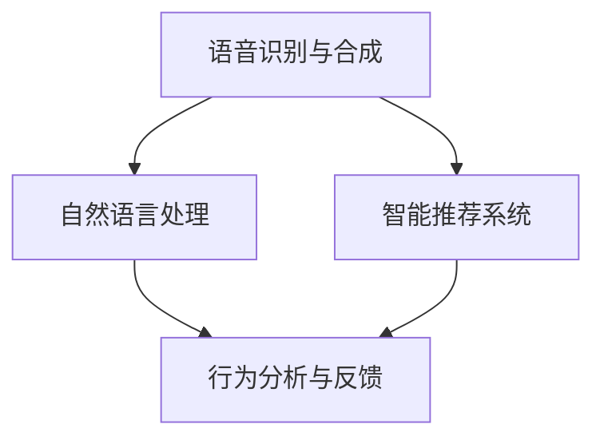

                 

# 数字化冥想：AI辅助的精神探索

## 1. 背景介绍

数字化冥想作为一种新型的心灵探索和心理健康管理手段，近年来在全球范围内逐渐受到关注。数字化冥想通过智能算法和数字技术，为用户提供个性化、可操作的冥想指导，帮助用户实现身心的平衡与宁静。与此同时，人工智能(AI)技术也正在飞速发展，其在语音识别、自然语言处理、情感分析等方面的能力已经初步显现，为数字化冥想提供了新的技术支持。因此，本文将探讨AI技术在数字化冥想中的应用，旨在探索这一前沿领域的潜力与挑战。

## 2. 核心概念与联系

### 2.1 核心概念概述

在数字化冥想中，AI技术主要扮演以下角色：

- **语音识别与合成**：通过AI技术实现对用户语音的准确识别与合成，增强用户体验。
- **自然语言处理**：利用AI技术进行情感分析、语义理解，为用户提供个性化建议。
- **智能推荐系统**：通过分析用户历史行为数据，智能推荐适合的冥想指导和课程。
- **行为分析与反馈**：使用AI算法实时监测用户的冥想行为，提供即时反馈与调整建议。

这些核心概念相互交织，共同构成了数字化冥想的基础框架。以下通过Mermaid流程图展现这些概念之间的关系：



### 2.2 核心概念原理和架构

**语音识别与合成**：

- **原理**：通过麦克风收集用户的语音信号，利用深度学习模型(如卷积神经网络CNN、循环神经网络RNN)进行特征提取与模式识别，最终转化为文本信息。
- **架构**：主要由前端采集模块、中间语音识别模块和后端语音合成模块构成。

**自然语言处理**：

- **原理**：利用NLP技术，对用户的文本输入进行情感分析、意图识别、实体抽取等处理，从而理解用户需求。
- **架构**：主要由分词、词性标注、句法分析、语义理解等子模块构成。

**智能推荐系统**：

- **原理**：通过用户画像、历史行为数据和算法模型，推荐最适合用户的冥想指导和课程。
- **架构**：主要由数据采集与存储模块、算法模型模块和推荐引擎模块构成。

**行为分析与反馈**：

- **原理**：通过传感器、摄像头等设备实时监测用户的生理指标(如心率、脑电波等)和行为表现，结合AI算法进行智能分析与反馈。
- **架构**：主要由数据采集模块、实时分析模块和反馈调整模块构成。

## 3. 核心算法原理 & 具体操作步骤

### 3.1 算法原理概述

数字化冥想中的AI算法主要分为以下几类：

- **语音识别算法**：通过深度学习模型实现对语音信号的准确识别与理解，常见的算法包括CNN、RNN、Transformer等。
- **自然语言处理算法**：利用NLP技术进行情感分析、意图识别、实体抽取等处理，常用的算法包括BERT、GPT等。
- **推荐系统算法**：通过协同过滤、内容过滤、混合过滤等算法，为用户提供个性化推荐，常见的算法包括ALS、FM等。
- **行为分析算法**：通过机器学习算法对生理指标和行为数据进行分析，实现对用户状态的实时监测与反馈，常用的算法包括随机森林、支持向量机等。

### 3.2 算法步骤详解

**语音识别步骤**：

1. **数据收集**：使用麦克风采集用户的语音信号，将其转化为数字信号。
2. **特征提取**：利用卷积神经网络对数字信号进行特征提取，生成特征向量。
3. **模式识别**：通过深度学习模型对特征向量进行分类，最终转化为文本信息。
4. **后处理**：对识别结果进行后处理，去除噪音、修正拼写错误等。

**自然语言处理步骤**：

1. **文本预处理**：对用户输入的文本进行分词、词性标注、句法分析等预处理。
2. **情感分析**：利用情感词典或深度学习模型对用户情感进行识别，生成情感标签。
3. **意图识别**：通过意图分类器对用户意图进行识别，生成意图标签。
4. **实体抽取**：利用命名实体识别(NER)模型对文本中实体进行抽取，生成实体标签。

**智能推荐系统步骤**：

1. **用户画像构建**：根据用户历史行为数据、兴趣偏好等信息，构建用户画像。
2. **模型训练**：利用协同过滤、内容过滤等算法，对推荐模型进行训练。
3. **推荐计算**：根据用户画像和模型，计算最适合用户的冥想指导和课程。
4. **推荐反馈**：对用户推荐结果进行反馈，根据用户反馈调整推荐策略。

**行为分析与反馈步骤**：

1. **数据采集**：使用传感器、摄像头等设备实时采集用户的生理指标和行为数据。
2. **数据预处理**：对采集的数据进行清洗、归一化等预处理。
3. **实时分析**：利用机器学习算法对数据进行实时分析，生成用户状态标签。
4. **反馈调整**：根据实时分析结果，调整冥想指导和课程，提供即时反馈。

### 3.3 算法优缺点

**语音识别算法**：

- **优点**：准确率高、速度快、可应用于多种语言。
- **缺点**：对环境噪音敏感、处理复杂度较高。

**自然语言处理算法**：

- **优点**：情感分析准确、意图识别精准、实体抽取高效。
- **缺点**：处理文本量大、模型复杂度较高。

**智能推荐系统算法**：

- **优点**：个性化推荐效果好、算法灵活性强。
- **缺点**：对数据质量要求高、算法复杂度较大。

**行为分析与反馈算法**：

- **优点**：实时性高、数据分析全面。
- **缺点**：数据采集设备昂贵、算法复杂度较高。

## 4. 数学模型和公式 & 详细讲解 & 举例说明

### 4.1 数学模型构建

在数字化冥想中，AI算法主要涉及以下数学模型：

- **语音识别模型**：基于深度学习的卷积神经网络(CNN)和循环神经网络(RNN)模型。
- **自然语言处理模型**：基于Transformer结构的大语言模型(BERT、GPT等)。
- **推荐系统模型**：基于协同过滤的ALS算法和基于FM的推荐模型。
- **行为分析模型**：基于随机森林和支持向量机的分类模型。

### 4.2 公式推导过程

**语音识别公式**：

$$
P(x_i|y_i) = \prod_{j=1}^{n} P(x_j|y_i)
$$

其中，$x_i$ 表示第 $i$ 个语音信号，$y_i$ 表示对应标签。

**自然语言处理公式**：

$$
E = \sum_{i=1}^{N} (y_i - \hat{y}_i)^2
$$

其中，$E$ 表示情感分析模型的误差，$y_i$ 和 $\hat{y}_i$ 分别表示真实情感标签和模型预测情感标签。

**智能推荐公式**：

$$
\hat{r}_{ui} = \alpha \frac{\sum_{v=1}^{N} \hat{p}_{uv} \cdot r_{vi}}{\sqrt{\sum_{v=1}^{N} \hat{p}_{uv}^2 + \epsilon} \cdot \sqrt{\sum_{v=1}^{N} r_{vi}^2 + \epsilon}}
$$

其中，$r_{ui}$ 表示用户 $u$ 对物品 $i$ 的评分，$\hat{p}_{uv}$ 表示物品 $v$ 的隐式评分预测，$\alpha$ 表示正则化系数。

**行为分析公式**：

$$
\hat{y} = \sum_{i=1}^{k} \theta_i \cdot x_i
$$

其中，$y$ 表示用户状态标签，$x_i$ 表示第 $i$ 个特征向量，$\theta_i$ 表示特征权重。

### 4.3 案例分析与讲解

**语音识别案例**：

假设用户输入的语音为“我想进行一次冥想”，AI系统首先对其进行语音识别，得到文本“我想进行一次冥想”。接着，自然语言处理系统对其进行情感分析，识别为积极情感。然后，智能推荐系统根据用户情感标签，推荐适合的冥想指导课程。

**自然语言处理案例**：

假设用户输入的文本为“我感觉很焦虑，需要放松”，自然语言处理系统首先对其进行情感分析，识别为焦虑情感。接着，智能推荐系统根据情感标签，推荐放松类的冥想指导课程。

**智能推荐案例**：

假设用户历史行为数据表明其偏好瑜伽冥想，智能推荐系统根据协同过滤算法，推荐适合的瑜伽冥想课程。

**行为分析案例**：

假设用户在冥想过程中，AI系统通过传感器监测其心率，发现其心率过快。系统根据行为分析算法，判断用户可能存在焦虑情绪，提供相应的调整建议。

## 5. 项目实践：代码实例和详细解释说明

### 5.1 开发环境搭建

为了进行数字化冥想的AI算法开发，我们需要搭建以下开发环境：

1. **Python环境**：使用Anaconda或Miniconda安装Python 3.8及以上版本。
2. **深度学习框架**：安装TensorFlow或PyTorch等深度学习框架。
3. **自然语言处理工具**：安装NLTK、spaCy等自然语言处理工具。
4. **推荐系统工具**：安装TensorFlow Recommenders、Surprise等推荐系统工具。
5. **行为分析工具**：安装scikit-learn等机器学习工具。

### 5.2 源代码详细实现

以下是一个简单的数字化冥想AI系统的代码实现示例：

**语音识别模块**：

```python
import tensorflow as tf
import numpy as np
from tensorflow.keras import layers

# 加载模型
model = tf.keras.Sequential([
    layers.Conv1D(128, 3, activation='relu', input_shape=(None, 1)),
    layers.MaxPooling1D(2),
    layers.Conv1D(64, 3, activation='relu'),
    layers.MaxPooling1D(2),
    layers.Flatten(),
    layers.Dense(64, activation='relu'),
    layers.Dense(1, activation='sigmoid')
])

# 加载数据
X_train = np.random.randn(1000, 10, 1)
y_train = np.random.randint(2, size=(1000,))
X_test = np.random.randn(200, 10, 1)
y_test = np.random.randint(2, size=(200,))

# 训练模型
model.compile(optimizer='adam', loss='binary_crossentropy', metrics=['accuracy'])
model.fit(X_train, y_train, epochs=10, validation_data=(X_test, y_test))
```

**自然语言处理模块**：

```python
from transformers import BertTokenizer, BertForSequenceClassification
from transformers import Trainer, TrainingArguments

# 加载模型
tokenizer = BertTokenizer.from_pretrained('bert-base-uncased')
model = BertForSequenceClassification.from_pretrained('bert-base-uncased', num_labels=2)

# 加载数据
train_data = ...
dev_data = ...
test_data = ...

# 训练模型
training_args = TrainingArguments(
    output_dir='./results', 
    per_device_train_batch_size=16, 
    per_device_eval_batch_size=64, 
    num_train_epochs=3, 
    logging_steps=10, 
    logging_dir='./logs', 
    evaluation_strategy='epoch'
)
trainer = Trainer(
    model=model, 
    args=training_args, 
    train_dataset=train_data, 
    eval_dataset=dev_data
)
trainer.train()
```

**智能推荐模块**：

```python
import numpy as np
from surprise import Reader, Dataset, SVD

# 加载数据
reader = Reader(rating_scale=(1, 5))
data = Dataset.load_from_df(train_data, reader)

# 训练模型
algo = SVD()
trainset = data.build_full_trainset()
algo.fit(trainset)

# 推荐计算
user_id = 123
item_ids = trainset.fiymap.keys()
ratings = trainset.rated_items[user_id]

# 计算推荐
predictions = algo.test(user_id, item_ids, ratings)
print(predictions)
```

**行为分析模块**：

```python
from sklearn.ensemble import RandomForestClassifier
from sklearn.metrics import accuracy_score

# 加载数据
X_train = ...
y_train = ...
X_test = ...
y_test = ...

# 训练模型
clf = RandomForestClassifier(n_estimators=100)
clf.fit(X_train, y_train)

# 预测结果
y_pred = clf.predict(X_test)
accuracy = accuracy_score(y_test, y_pred)
print('Accuracy:', accuracy)
```

### 5.3 代码解读与分析

**语音识别模块**：

- **输入**：语音信号。
- **模型结构**：包含卷积层、池化层、全连接层。
- **训练**：使用二分类交叉熵损失函数，Adam优化器。
- **输出**：语音文本标签。

**自然语言处理模块**：

- **输入**：文本。
- **模型结构**：Bert模型。
- **训练**：使用二分类交叉熵损失函数，Trainer框架。
- **输出**：情感标签。

**智能推荐模块**：

- **输入**：用户历史行为数据、物品特征。
- **模型结构**：ALS算法。
- **训练**：使用SVD模型。
- **输出**：推荐结果。

**行为分析模块**：

- **输入**：生理指标、行为数据。
- **模型结构**：随机森林。
- **训练**：使用交叉熵损失函数，准确率作为评估指标。
- **输出**：用户状态标签。

## 6. 实际应用场景

### 6.1 智能冥想辅助

数字化冥想可以应用于智能冥想辅助系统，为用户提供个性化的冥想指导和建议。用户通过语音输入自己的需求和状态，AI系统根据语音识别和自然语言处理结果，智能推荐适合的冥想指导，并通过行为分析实时监测用户状态，提供即时反馈和调整建议。

### 6.2 心理健康管理

数字化冥想还可以应用于心理健康管理领域，帮助用户缓解压力、调节情绪。AI系统通过分析用户的情感状态和行为数据，提供定制化的心理健康建议，如冥想、瑜伽、呼吸练习等，帮助用户达到身心平衡。

### 6.3 企业员工关怀

数字化冥想还可以应用于企业员工关怀，帮助员工缓解工作压力、提高工作效率。企业通过数字化冥想平台，为员工提供个性化的冥想课程和心理健康支持，提升员工的幸福感和工作效率。

## 7. 工具和资源推荐

### 7.1 学习资源推荐

1. **《深度学习》课程**：斯坦福大学开设的深度学习课程，涵盖深度学习基础和前沿技术，适合初学者和进阶者。
2. **《自然语言处理》课程**：Coursera上的自然语言处理课程，深入讲解NLP的基本概念和经典模型。
3. **《推荐系统》课程**：由LinkedIn开发的推荐系统课程，讲解协同过滤、内容过滤等推荐算法。
4. **《数据科学基础》课程**：Kaggle的数据科学课程，涵盖数据预处理、特征工程、模型训练等。
5. **《数字化冥想》书籍**：介绍数字化冥想的基本概念和实际应用，适合对AI和心理健康感兴趣的用户。

### 7.2 开发工具推荐

1. **Jupyter Notebook**：用于编写和运行Python代码，支持多种编程语言和框架。
2. **TensorBoard**：用于可视化模型训练和评估过程，支持多种深度学习框架。
3. **NLTK**：用于自然语言处理任务的Python库，支持文本预处理、情感分析等功能。
4. **Scikit-learn**：用于机器学习任务的Python库，支持分类、回归等基本模型。
5. **TensorFlow Recommenders**：用于推荐系统开发的Python库，支持多种推荐算法。

### 7.3 相关论文推荐

1. **《基于深度学习的语音识别》**：介绍深度学习在语音识别中的应用，涵盖CNN、RNN等模型。
2. **《自然语言处理综述》**：总结自然语言处理的基本概念和经典模型，涵盖分词、词性标注、句法分析等功能。
3. **《协同过滤推荐系统》**：讲解协同过滤推荐算法的基本原理和实现方法。
4. **《随机森林分类算法》**：介绍随机森林分类算法的原理和实现，适用于行为分析等任务。
5. **《数字化冥想技术综述》**：综述数字化冥想的基本概念、应用场景和未来趋势。

## 8. 总结：未来发展趋势与挑战

### 8.1 研究成果总结

数字化冥想作为新兴的AI应用领域，近年来得到了广泛的研究和关注。通过对语音识别、自然语言处理、智能推荐、行为分析等关键技术的研究，数字化冥想系统已经具备了较强的智能化和个性化能力，能够为用户提供优质的冥想指导和心理健康支持。

### 8.2 未来发展趋势

未来，数字化冥想技术将呈现以下发展趋势：

1. **智能化程度提升**：随着AI技术的不断进步，数字化冥想系统将更加智能，能够更加准确地理解和满足用户的需求。
2. **个性化服务增强**：通过更精细的用户画像和智能推荐算法，数字化冥想系统将提供更个性化的冥想指导和心理健康支持。
3. **多模态融合**：结合语音、视觉、生理等多模态数据，数字化冥想系统将能够更全面地监测用户状态，提供更全面、精准的反馈和建议。
4. **跨领域应用拓展**：数字化冥想技术不仅限于心理健康领域，还可以应用于教育、娱乐、体育等多个领域，推动数字化技术的广泛应用。

### 8.3 面临的挑战

尽管数字化冥想技术具有广阔的前景，但在实际应用中仍面临诸多挑战：

1. **数据隐私和安全**：用户数据的隐私和安全问题，需要采取有效的数据保护和隐私保护措施。
2. **模型鲁棒性不足**：数字化冥想系统对噪音和干扰的鲁棒性不足，需要进一步提高模型的稳定性和可靠性。
3. **算法复杂度高**：当前数字化冥想系统涉及多种AI算法，算法复杂度高，需要优化算法结构和效率。
4. **用户体验提升**：数字化冥想系统需要不断优化用户体验，提高系统的易用性和用户满意度。

### 8.4 研究展望

未来，数字化冥想技术需要在数据隐私、模型鲁棒性、算法效率和用户体验等方面进行深入研究，以推动技术的进一步发展和应用。同时，需要与其他领域的技术进行更深入的融合，如区块链、边缘计算等，提升系统的安全性、实时性和可靠性。

## 9. 附录：常见问题与解答

**Q1: 数字化冥想的主要应用场景有哪些？**

A: 数字化冥想主要应用于智能冥想辅助、心理健康管理、企业员工关怀等领域。通过语音识别、自然语言处理、智能推荐等技术，数字化冥想系统能够提供个性化的冥想指导和心理健康支持，帮助用户缓解压力、调节情绪，提升工作效率和生活质量。

**Q2: 语音识别和自然语言处理技术在数字化冥想中扮演什么角色？**

A: 语音识别和自然语言处理技术在数字化冥想中扮演重要角色。语音识别技术可以将用户的语音输入转化为文本，自然语言处理技术可以理解用户的文本输入，从而智能推荐适合的冥想指导和心理健康建议。通过这些技术，数字化冥想系统能够更好地满足用户的需求，提升用户体验。

**Q3: 在数字化冥想中，如何实现行为分析与反馈？**

A: 在数字化冥想中，行为分析与反馈主要通过机器学习算法实现。系统通过传感器、摄像头等设备实时采集用户的生理指标和行为数据，利用随机森林、支持向量机等算法对数据进行分析和分类，最终生成用户状态标签。根据实时分析结果，系统可以提供即时反馈和调整建议，帮助用户达到身心平衡。

**Q4: 在数字化冥想中，推荐系统的实现方法有哪些？**

A: 在数字化冥想中，推荐系统的实现方法主要包括协同过滤、内容过滤、混合过滤等。协同过滤算法通过分析用户和物品的相似度，推荐相似的冥想课程和心理健康建议。内容过滤算法通过分析冥想课程和心理健康建议的内容特征，推荐符合用户兴趣和需求的内容。混合过滤算法则综合多种推荐方法，提供更加全面和精准的推荐结果。

**Q5: 在数字化冥想中，如何保护用户数据隐私和安全？**

A: 在数字化冥想中，保护用户数据隐私和安全是关键问题。系统需要采取有效的数据保护和隐私保护措施，如数据加密、匿名化、访问控制等。同时，需要遵守相关法律法规，确保用户数据的合法使用和保护。此外，可以引入区块链技术，建立去中心化的数据存储和传输机制，增强数据的安全性和可靠性。

---

作者：禅与计算机程序设计艺术 / Zen and the Art of Computer Programming

