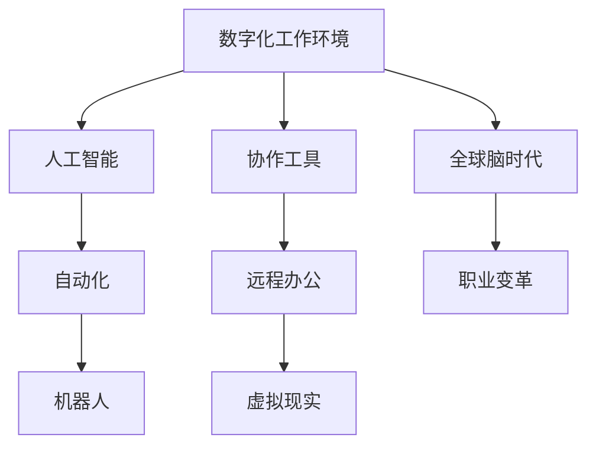

                 

# 数字化工作环境：全球脑时代的职业变革

> 关键词：数字化工作环境, 全球脑时代, 职业变革, 自动化, 协作工具, 远程办公, 虚拟现实, 人工智能

## 1. 背景介绍

### 1.1 问题由来
随着科技的迅猛发展，数字化工作环境正成为现代社会的新常态。从传统的办公室办公到全面转向远程办公，从单一的信息处理到全面的协作系统，从传统的集中式管理到分布式自动化，数字化转型正在改变我们的工作方式。特别是在全球脑时代，互联网与人工智能等先进技术深刻影响着工作环境，催生着新的职业变革。数字化工具的普及、全球协作的深化、人工智能的崛起，共同塑造了一个全新的工作生态。

### 1.2 问题核心关键点
数字化工作环境的核心在于通过先进的技术手段，优化和重构工作流程，提升工作效率，实现资源的合理配置。其中，人工智能、大数据、物联网等技术的应用尤为关键。本文将围绕数字化工具、远程办公、协作系统、自动化等方面，探讨全球脑时代下的职业变革，为数字化转型提供指导。

### 1.3 问题研究意义
了解数字化工作环境下的职业变革，对于企业和员工都具有重要意义：

- 对于企业：数字化工作环境可以提升企业的效率和创新能力，降低运营成本，更好地应对全球市场的变化。
- 对于员工：数字化转型提供了更多远程工作、弹性工作、智能协作的机会，助力员工实现自我提升和职业发展。

## 2. 核心概念与联系

### 2.1 核心概念概述

为更好地理解全球脑时代下的职业变革，本节将介绍几个关键概念：

- 数字化工作环境(Digital Work Environment)：利用互联网、大数据、云计算、人工智能等技术手段，优化和重构工作流程，提升工作效率和管理水平。

- 全球脑时代(Globa Brain Era)：互联网和人工智能的普及，使得全球化的协作和知识共享成为可能，一个以智慧和创新为核心的全球协作网络正在形成。

- 自动化(Automation)：通过机器人、AI等技术，实现工作任务的自动化处理，减少人力投入，提高生产效率。

- 协作工具(Collaboration Tools)：如Slack、Trello、Microsoft Teams等，支持团队之间的实时沟通和协作，增强远程工作的效率和便捷性。

- 远程办公(Remote Work)：指员工通过网络远程完成工作任务，借助各种数字化工具，实现全球化协作。

- 虚拟现实(Virtual Reality, VR)：通过虚拟现实技术，增强远程协作的沉浸感和互动性。

- 人工智能(Artificial Intelligence, AI)：利用机器学习和深度学习等技术，实现对数据的智能分析、预测和决策。

这些核心概念之间的逻辑关系可以通过以下Mermaid流程图来展示：



这个流程图展示了几组关键概念及其相互关系：

1. 数字化工作环境以人工智能为核心技术，提供自动化、协作工具、远程办公、虚拟现实等应用。
2. 全球脑时代下，这些工具和技术的深度应用，推动了职业变革，增强了全球协作的能力。
3. 职业变革不仅包括技术应用，还涵盖了管理、文化、教育等多个方面。

## 3. 核心算法原理 & 具体操作步骤
### 3.1 算法原理概述

数字化工作环境中的核心算法原理主要围绕数据处理、人工智能、自动化、协作系统等展开。通过数据处理和人工智能技术，实现对任务的智能分析、预测和优化；通过自动化技术，提高工作效率，减少人力投入；通过协作系统，实现实时通信和协作，提升团队协作效率。

### 3.2 算法步骤详解

数字化工作环境下的算法步骤一般包括以下几个关键环节：

**Step 1: 数据采集与预处理**
- 收集与业务相关的数据，如用户行为数据、业务数据、设备数据等。
- 对数据进行清洗、去重、归一化等预处理，确保数据质量。

**Step 2: 数据建模与分析**
- 利用机器学习算法，对数据进行建模和分析，提取关键特征，识别模式和趋势。
- 使用深度学习算法，对复杂数据进行建模和预测，提升决策效率。

**Step 3: 自动化流程设计**
- 根据业务需求，设计自动化流程，如自动化生产、自动化客服、自动化报告等。
- 利用机器人、流程自动化软件等工具，实现任务的自动化处理。

**Step 4: 协作系统部署**
- 部署协作工具，如Slack、Trello、Microsoft Teams等，支持实时通信和协作。
- 设计工作流和任务管理流程，确保团队协作高效。

**Step 5: 监控与优化**
- 实时监控系统运行状态，检测异常和故障。
- 根据监控数据和用户反馈，优化系统性能，提升用户体验。

### 3.3 算法优缺点

数字化工作环境下的算法具有以下优点：

1. 高效性：通过自动化和智能化技术，大大提升工作效率，减少人力投入。
2. 灵活性：通过协作系统和虚拟现实等技术，实现灵活的工作方式，支持远程办公。
3. 实时性：通过实时监控和反馈机制，确保系统的高效运行和及时优化。

同时，也存在一定的局限性：

1. 技术门槛高：设计和部署数字化工作环境需要较高的技术水平和经验。
2. 数据隐私和安全：数据处理和存储需要确保数据安全和隐私保护，防止数据泄露和滥用。
3. 员工适应性：员工需要适应新的工作方式和工具，初期可能需要一定培训和适应期。

### 3.4 算法应用领域

数字化工作环境在多个领域得到了广泛应用，例如：

- 制造业：通过自动化和机器人技术，实现智能化生产和管理。
- 金融行业：利用大数据和人工智能技术，进行风险评估、交易分析等。
- 医疗行业：通过远程医疗和智能诊断系统，提高医疗服务质量和效率。
- 教育行业：利用在线学习平台和协作工具，实现远程教育和个性化教学。
- 零售行业：通过智能推荐和自动化仓储，提升客户体验和运营效率。
- 服务行业：利用自动化客服和虚拟现实技术，提升客户服务质量。

## 4. 数学模型和公式 & 详细讲解 & 举例说明
### 4.1 数学模型构建

数字化工作环境中的数学模型主要涉及机器学习、深度学习、优化算法等领域。以下以智能推荐系统为例，构建数学模型。

假设用户对物品的评分可以表示为 $x_i \in [0,1]$，物品的属性特征向量为 $y_i \in \mathbb{R}^d$，则评分预测模型的目标是最小化均方误差：

$$
\min_{\theta} \frac{1}{N} \sum_{i=1}^N (y_i - \hat{y}_i)^2
$$

其中 $\theta$ 为模型参数，$\hat{y}_i$ 为预测评分，通常使用线性模型或非线性模型进行预测。

### 4.2 公式推导过程

以线性模型为例，评分预测公式为：

$$
\hat{y}_i = \theta^T \phi(x_i)
$$

其中 $\phi(x_i)$ 为特征映射函数，将用户行为数据转换为模型可接受的格式。

推导该模型的梯度如下：

$$
\frac{\partial \mathcal{L}}{\partial \theta} = -2\frac{1}{N} \sum_{i=1}^N (\hat{y}_i - y_i) \phi(x_i)
$$

通过梯度下降算法，更新模型参数 $\theta$，最小化损失函数 $\mathcal{L}$。

### 4.3 案例分析与讲解

以亚马逊推荐系统为例，使用协同过滤算法进行推荐。协同过滤算法基于用户行为数据，利用相似性度量，推荐用户可能感兴趣的商品。协同过滤算法分为基于用户的协同过滤和基于物品的协同过滤两种方法。

基于用户的协同过滤算法公式如下：

$$
\hat{y}_i = \frac{\sum_{j=1}^N \alpha_j y_j}{\sum_{j=1}^N \alpha_j}
$$

其中 $\alpha_j$ 为相似性度量，通常使用余弦相似度或皮尔逊相关系数。

亚马逊推荐系统的具体实现步骤如下：

1. 收集用户历史行为数据，包括浏览、点击、购买等行为。
2. 对数据进行清洗、去重、归一化等预处理。
3. 构建用户-物品评分矩阵，计算用户相似性度量。
4. 使用协同过滤算法，预测用户未浏览物品的评分。
5. 根据评分预测结果，推荐用户可能感兴趣的商品。

## 5. 项目实践：代码实例和详细解释说明
### 5.1 开发环境搭建

在进行数字化工作环境的项目实践前，我们需要准备好开发环境。以下是使用Python进行PyTorch开发的环境配置流程：

1. 安装Anaconda：从官网下载并安装Anaconda，用于创建独立的Python环境。

2. 创建并激活虚拟环境：
```bash
conda create -n pytorch-env python=3.8 
conda activate pytorch-env
```

3. 安装PyTorch：根据CUDA版本，从官网获取对应的安装命令。例如：
```bash
conda install pytorch torchvision torchaudio cudatoolkit=11.1 -c pytorch -c conda-forge
```

4. 安装TensorFlow：由Google主导开发的开源深度学习框架，生产部署方便，适合大规模工程应用。同样有丰富的预训练语言模型资源。

5. 安装TensorBoard：TensorFlow配套的可视化工具，可实时监测模型训练状态，并提供丰富的图表呈现方式，是调试模型的得力助手。

6. 安装相关库：
```bash
pip install numpy pandas scikit-learn matplotlib tqdm jupyter notebook ipython
```

完成上述步骤后，即可在`pytorch-env`环境中开始项目实践。

### 5.2 源代码详细实现

这里我们以智能推荐系统为例，给出使用TensorFlow进行协同过滤推荐算法的Python代码实现。

首先，定义协同过滤推荐算法：

```python
import tensorflow as tf
from sklearn.metrics.pairwise import cosine_similarity

def collaborative_filtering(train_data, test_data, user_num, item_num):
    # 构建用户相似性矩阵
    user_similarity = cosine_similarity(train_data, train_data)
    
    # 构建物品相似性矩阵
    item_similarity = cosine_similarity(train_data.T, train_data.T)
    
    # 计算推荐结果
    user_pred = tf.matmul(user_similarity, item_similarity)
    user_pred = tf.matmul(user_pred, user_similarity)
    
    # 取前K个推荐结果
    top_k = 5
    user_pred = user_pred.numpy()[:,:top_k]
    
    # 计算平均评分
    user_pred = user_pred.mean(axis=1)
    
    # 返回推荐结果
    return user_pred
```

然后，准备数据集并进行推荐：

```python
# 准备数据集
train_data = np.load('train_data.npy')
test_data = np.load('test_data.npy')

# 进行推荐
user_num = train_data.shape[0]
item_num = train_data.shape[1]
user_pred = collaborative_filtering(train_data, test_data, user_num, item_num)

# 输出推荐结果
for i in range(user_pred.shape[0]):
    print(f"User {i+1}'s top {top_k} recommendations: {user_pred[i,:].tolist()}")
```

以上就是使用TensorFlow进行协同过滤推荐算法的完整代码实现。可以看到，TensorFlow提供了丰富的机器学习库和工具，可以高效实现复杂的算法模型。

### 5.3 代码解读与分析

让我们再详细解读一下关键代码的实现细节：

**collaborative_filtering函数**：
- 定义协同过滤推荐算法，利用余弦相似度计算用户和物品的相似性，构建相似性矩阵。
- 计算推荐结果，取前K个推荐结果并计算平均评分。

**数据准备**：
- 加载训练数据和测试数据，进行推荐。

**输出结果**：
- 输出每个用户的前K个推荐结果。

可以看到，TensorFlow使得机器学习算法的实现变得简单高效，开发者可以将更多精力放在算法优化和数据处理上，而不必过多关注底层的实现细节。

当然，实际应用中还需要考虑更多因素，如模型的可解释性、性能优化、生产部署等。但核心的协同过滤推荐算法基本与此类似。

## 6. 实际应用场景
### 6.1 智能制造

数字化工作环境在智能制造中的应用，通过自动化和机器人技术，实现了生产线的智能化管理。传统的制造业需要大量人力进行生产线的监控、维护和管理，不仅成本高，还容易出现人为失误。

通过数字化工作环境，制造业可以部署自动化生产线和机器人系统，实现自动化装配、自动检测和自动维护。使用智能推荐系统，根据生产线数据进行优化调度，提高生产效率和质量。智能制造不仅提升了企业的竞争力，还降低了对人工的依赖，减少了生产成本。

### 6.2 远程办公

随着全球脑时代的到来，远程办公成为数字化工作环境的重要组成部分。许多企业采用了远程办公模式，员工通过网络进行协作和沟通，提高了工作效率和灵活性。

远程办公需要依赖各种协作工具和平台，如Slack、Trello、Microsoft Teams等。通过这些工具，员工可以实现实时沟通和协作，共享文件和任务，提升团队的协作效率和生产力。同时，虚拟现实技术的应用，增强了远程办公的沉浸感和互动性，使远程协作更加高效。

### 6.3 智能客服

数字化工作环境中的智能客服系统，通过自然语言处理和机器学习技术，实现了自动化客户服务。传统的客服模式需要大量人力进行人工客服，不仅成本高，还容易出现人工错误和延迟。

使用智能客服系统，企业可以部署自然语言理解和生成模型，自动解答客户咨询，提供个性化的服务。智能客服不仅提高了客户满意度，还减少了客服人员的负担，提高了企业的服务质量。

### 6.4 未来应用展望

随着数字化工作环境的不断发展，未来在更多领域将得到广泛应用，为各行各业带来变革性影响：

- 在智慧医疗领域，通过远程医疗和智能诊断系统，提高医疗服务的智能化水平，辅助医生诊疗，加速新药开发进程。
- 在智能教育领域，利用在线学习平台和协作工具，实现远程教育和个性化教学，因材施教，促进教育公平，提高教学质量。
- 在智慧城市治理中，通过数字化系统和智能算法，提高城市管理的自动化和智能化水平，构建更安全、高效的未来城市。
- 在企业生产、社会治理、文娱传媒等众多领域，数字化工作环境的应用将不断涌现，为传统行业带来新的技术路径和商业机会。

## 7. 工具和资源推荐
### 7.1 学习资源推荐

为了帮助开发者系统掌握数字化工作环境的技术基础和实践技巧，这里推荐一些优质的学习资源：

1. 《机器学习实战》：李航著，深入浅出地介绍了机器学习的基本原理和应用方法，适合初学者入门。

2. 《深度学习》：Ian Goodfellow等著，全面介绍了深度学习的基本原理和算法，适合有一定基础的读者。

3. 《TensorFlow实战》：James Bergstra等著，详细介绍了TensorFlow的使用方法和应用案例，适合TensorFlow的开发者。

4. PyTorch官方文档：PyTorch的官方文档，提供了丰富的学习资源和样例代码，是PyTorch开发的必备资料。

5. Coursera和edX在线课程：这些平台提供了大量的机器学习和深度学习课程，适合各类读者学习。

6. Kaggle竞赛：Kaggle提供了大量的机器学习和深度学习竞赛，可以锻炼读者的实践能力。

通过对这些资源的学习实践，相信你一定能够快速掌握数字化工作环境的技术基础，并用于解决实际的NLP问题。

### 7.2 开发工具推荐

高效的开发离不开优秀的工具支持。以下是几款用于数字化工作环境开发的常用工具：

1. Python：作为最流行的编程语言之一，Python拥有丰富的机器学习和深度学习库，如TensorFlow、PyTorch、Scikit-learn等。

2. TensorFlow：由Google主导开发的开源深度学习框架，生产部署方便，适合大规模工程应用。

3. PyTorch：基于Python的开源深度学习框架，灵活动态的计算图，适合快速迭代研究。

4. Jupyter Notebook：强大的交互式编程环境，支持Python、R、Julia等多种语言，适合开发和测试机器学习算法。

5. Visual Studio Code：开源的代码编辑器，支持Python等语言，提供了丰富的插件和扩展，方便开发和调试。

6. Kaggle平台：提供了丰富的数据集和算法竞赛，可以帮助开发者实践和提升技能。

合理利用这些工具，可以显著提升数字化工作环境开发的效率，加快创新迭代的步伐。

### 7.3 相关论文推荐

数字化工作环境的发展源于学界的持续研究。以下是几篇奠基性的相关论文，推荐阅读：

1. DeepMind的AlphaGo论文：展示了深度学习和强化学习在复杂决策问题中的应用，为智能推荐系统提供了新的思路。

2. Facebook的GraphSAGE论文：提出了基于图结构的深度学习算法，用于社交网络推荐和搜索，为社交网络数据分析提供了新的方法。

3. Google的BERT论文：提出了基于掩码语言模型的预训练技术，显著提升了自然语言处理任务的性能，为智能推荐系统提供了新的数据表示方法。

4. 百度的DAMO论文：展示了基于对抗学习的深度推荐系统，提高了推荐系统的鲁棒性和安全性。

5. 阿里巴巴的Alibaba的推荐系统论文：介绍了大规模推荐系统的设计和实现方法，为推荐系统开发提供了宝贵的经验。

这些论文代表了大语言模型微调技术的发展脉络。通过学习这些前沿成果，可以帮助研究者把握学科前进方向，激发更多的创新灵感。

## 8. 总结：未来发展趋势与挑战
### 8.1 总结

本文对数字化工作环境下的职业变革进行了全面系统的介绍。首先阐述了数字化工作环境的核心概念和技术原理，明确了数字化工作环境对职业变革的影响和意义。其次，从原理到实践，详细讲解了数字化工作环境的核心算法和具体操作步骤，给出了数字工作环境的代码实例。同时，本文还广泛探讨了数字化工作环境在多个行业领域的应用前景，展示了数字化工作环境的巨大潜力。

通过本文的系统梳理，可以看到，数字化工作环境正在改变我们的工作方式，提升工作效率，推动职业变革。未来，伴随数字化工作环境技术的不断进步，相信更多行业将从中受益，引领全球脑时代的发展。

### 8.2 未来发展趋势

展望未来，数字化工作环境的发展趋势主要集中在以下几个方向：

1. 自动化和智能化：自动化技术将继续发展，提高生产效率和质量。智能化系统将更加普及，通过机器学习和深度学习技术，实现对数据的智能分析、预测和决策。

2. 协作工具和平台：协作工具和平台将更加智能化和集成化，支持远程办公、虚拟现实等新工作模式。未来将出现更多的协作平台，提升团队协作效率和效果。

3. 数据驱动决策：企业将更加依赖数据分析和智能决策，通过数据驱动的管理和运营，提升竞争力。

4. 跨领域融合：数字化工作环境将与物联网、大数据、区块链等技术融合，形成更加完善的数字化生态系统。

5. 人机协同：人机协同将更加普及，通过智能助手和虚拟现实技术，提高工作效率和用户体验。

以上趋势凸显了数字化工作环境的技术前沿和应用前景。这些方向的探索发展，必将推动数字化工作环境的深入应用，实现更加高效、灵活和智能的工作模式。

### 8.3 面临的挑战

尽管数字化工作环境技术发展迅速，但在迈向更加智能化、普适化应用的过程中，它仍面临诸多挑战：

1. 技术门槛高：数字化工作环境的设计和实现需要较高的技术水平和经验。未来需要更多的技术普及和教育，降低技术门槛。

2. 数据隐私和安全：数据处理和存储需要确保数据安全和隐私保护，防止数据泄露和滥用。

3. 员工适应性：员工需要适应新的工作方式和工具，初期可能需要一定培训和适应期。

4. 系统兼容性和互操作性：不同系统之间的兼容性和互操作性需要进一步提升，实现无缝集成。

5. 资源消耗高：数字化工作环境需要大量的计算资源和存储空间，如何降低资源消耗，提高效率，是一个重要的研究方向。

6. 系统复杂性：数字化工作环境涉及多层次、多领域的协同管理，系统设计和实现需要综合考虑各方面因素。

这些挑战需要在未来的研究和实践中不断突破，推动数字化工作环境技术的成熟和普及。

### 8.4 研究展望

未来的研究需要在以下几个方面寻求新的突破：

1. 自动化和智能化：进一步提高自动化和智能化的水平，实现更加高效的自动化生产和管理。

2. 协作工具和平台：开发更加智能和集成化的协作工具和平台，提升团队协作效率和效果。

3. 数据驱动决策：利用大数据和机器学习技术，提升企业的数据驱动决策能力。

4. 跨领域融合：将数字化工作环境与物联网、大数据、区块链等技术融合，形成更加完善的数字化生态系统。

5. 人机协同：开发更加智能和高效的人机协同系统，提升工作体验和效果。

这些研究方向的探索，必将推动数字化工作环境的深入应用，实现更加高效、灵活和智能的工作模式。只有勇于创新、敢于突破，才能不断拓展数字化工作环境的边界，为构建人机协同的智能时代铺平道路。

