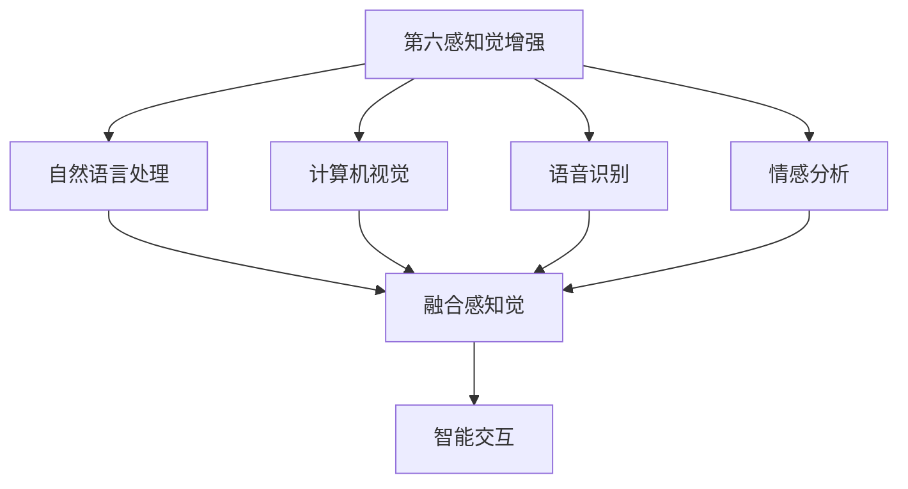

                 

# 数字化直觉：AI增强的第六感知觉

## 1. 背景介绍

随着人工智能技术的发展，AI增强的第六感知觉正在成为新一代智能系统的重要特征。在过去的几十年里，人类通过五官感知外部世界，获得了丰富的感官体验。而在数字化时代，AI技术的应用已经渗透到生活的方方面面，带来了全新的感知方式。AI增强的第六感知觉，不仅仅是指扩展了人类的感知能力，更代表了一种新型的智能体验。

在实际应用中，AI增强的第六感知觉可以涵盖语音识别、图像识别、自然语言处理、情感分析等多种场景，赋予人类更为强大的数据分析和交互能力。例如，智能助手可以通过语音指令理解和执行复杂任务，智能推荐系统能够根据用户的兴趣和行为预测和推荐内容，智能医疗系统能够通过图像和生理数据进行疾病诊断和治疗方案推荐。

## 2. 核心概念与联系

### 2.1 核心概念概述

为了更好地理解AI增强的第六感知觉，我们首先需要了解一些核心概念：

- 第六感知觉：指通过AI技术获得的新型感知能力，如智能语音、视觉、情感分析等。
- 感知觉增强：指利用AI技术扩展人类感知系统的边界，提升感知能力的过程。
- 自然语言处理(NLP)：指计算机理解、生成和分析人类语言的能力，是AI增强第六感知觉的重要分支。
- 计算机视觉(Computer Vision)：指计算机理解和分析图像、视频等视觉信息的能力，也是AI增强第六感知觉的关键技术之一。
- 语音识别(Speech Recognition)：指计算机识别和理解语音的能力，是语音交互的基础。
- 情感分析(Affective Computing)：指计算机分析用户情感状态，提供个性化服务的能力。

这些概念之间的联系和互动，构成了AI增强第六感知觉的完整体系。通过这些技术的融合应用，智能系统能够更好地理解和响应人类需求，提升用户体验。

### 2.2 核心概念原理和架构的 Mermaid 流程图



这个流程图展示了第六感知觉增强的架构和核心组件：

1. 第六感知觉增强：是整个系统的核心，通过融合自然语言处理、计算机视觉、语音识别、情感分析等多种技术，提升感知能力。
2. 自然语言处理：负责理解和生成自然语言，是智能交互的基础。
3. 计算机视觉：负责理解和分析图像、视频等视觉信息，是视觉交互的基础。
4. 语音识别：负责识别和理解语音信息，是语音交互的基础。
5. 情感分析：负责分析用户情感状态，提供个性化服务。
6. 融合感知觉：将上述多种感知能力进行融合，形成更全面的感知系统。
7. 智能交互：通过融合感知觉，实现与用户的互动和反馈。

## 3. 核心算法原理 & 具体操作步骤

### 3.1 算法原理概述

AI增强的第六感知觉的核心算法原理，主要基于机器学习和大数据分析技术。通过大规模数据集的训练，AI系统可以学习到复杂的模式和规律，从而实现对各种感知信息的理解和处理。

以自然语言处理为例，核心算法包括以下几个步骤：

1. 数据预处理：将原始文本数据进行清洗、分词、标注等预处理，转换为机器可以处理的格式。
2. 特征提取：利用统计学和机器学习技术，提取文本中的关键特征，如词频、词性、句子结构等。
3. 模型训练：通过标注数据训练语言模型，如神经网络、支持向量机、随机森林等，学习文本到标签的映射。
4. 模型评估：使用测试集对模型进行评估，计算精度、召回率、F1分数等指标。
5. 模型优化：根据评估结果，调整模型参数，提升性能。

### 3.2 算法步骤详解

下面以情感分析为例，详细介绍情感分析的算法步骤：

1. 数据收集：收集大量标注的情感文本数据，如电影评论、社交媒体帖子等。
2. 数据预处理：对文本进行分词、去停用词、词干化等预处理，转换为向量表示。
3. 特征提取：利用TF-IDF、Word2Vec、BERT等技术提取文本特征。
4. 模型选择：选择适合任务的模型，如朴素贝叶斯、SVM、LSTM、GRU等。
5. 模型训练：使用标注数据训练模型，调整模型参数。
6. 模型评估：在测试集上评估模型性能，计算准确率、召回率、F1分数等指标。
7. 模型优化：根据评估结果，调整模型参数，提升性能。
8. 应用部署：将训练好的模型部署到实际应用中，进行情感分析。

### 3.3 算法优缺点

AI增强的第六感知觉算法具有以下优点：

1. 高效准确：通过机器学习和深度学习技术，可以快速处理大量数据，并从中提取有用信息。
2. 灵活可扩展：可以根据不同应用场景，选择适合的模型和算法，实现快速迭代和优化。
3. 自适应能力强：能够根据数据的变化，不断调整模型参数，保持高性能。

同时，该算法也存在一些缺点：

1. 数据依赖性强：需要大量标注数据进行训练，数据获取成本高。
2. 模型复杂度高：深度学习模型通常结构复杂，训练和推理耗时较长。
3. 可解释性不足：神经网络等复杂模型往往难以解释其内部工作机制，缺乏透明度。
4. 过拟合风险：在数据量不足的情况下，模型容易过拟合，泛化性能差。

### 3.4 算法应用领域

AI增强的第六感知觉在多个领域都有广泛应用，以下是一些典型的应用场景：

1. 智能客服：利用语音识别和自然语言处理技术，构建智能客服系统，提升客户服务体验。
2. 智能推荐：利用用户行为数据和情感分析，提供个性化的内容推荐。
3. 智能医疗：利用图像识别和情感分析，辅助医生进行疾病诊断和治疗方案推荐。
4. 智能安防：利用计算机视觉和情感分析，实时监测和分析视频流，提升安全防护能力。
5. 智能家居：利用语音识别和自然语言处理技术，构建智能家居系统，实现人机交互。
6. 智能交通：利用计算机视觉和自然语言处理技术，构建智能交通系统，提升交通管理效率。

## 4. 数学模型和公式 & 详细讲解

### 4.1 数学模型构建

在情感分析中，常见的数学模型包括朴素贝叶斯、支持向量机、逻辑回归、神经网络等。以神经网络为例，模型结构如下：

$$
y = \sigma(Wx + b)
$$

其中，$y$为预测结果，$x$为输入向量，$W$和$b$为模型参数，$\sigma$为激活函数。

### 4.2 公式推导过程

以朴素贝叶斯分类器为例，推导其计算公式。假设样本集$D=\{(x_i, y_i)\}_{i=1}^N$，其中$x_i$为输入向量，$y_i$为标签。朴素贝叶斯分类器的目标是最小化交叉熵损失函数：

$$
L(\theta) = -\frac{1}{N}\sum_{i=1}^N \sum_{j=1}^C y_{ij} \log P(y_{ij}|x_i; \theta)
$$

其中，$C$为类别数，$y_{ij}$为样本$x_i$属于类别$j$的标签，$P(y_{ij}|x_i; \theta)$为样本$x_i$属于类别$j$的概率。

根据贝叶斯定理，有：

$$
P(y_{ij}|x_i; \theta) = \frac{P(y_{i}; \theta)}{P(x_i; \theta)}
$$

其中，$P(y_{i}; \theta)$为先验概率，$P(x_i; \theta)$为条件概率。

对于多分类问题，朴素贝叶斯分类器的目标是最小化对数似然损失函数：

$$
L(\theta) = -\frac{1}{N}\sum_{i=1}^N \log P(x_i; \theta)
$$

其中，$P(x_i; \theta)$为样本$x_i$的概率密度函数。

### 4.3 案例分析与讲解

以朴素贝叶斯分类器为例，说明其在情感分析中的应用：

1. 数据准备：收集大量标注的情感文本数据，如电影评论、社交媒体帖子等。
2. 特征提取：对文本进行分词、去停用词、词干化等预处理，转换为向量表示。
3. 模型训练：使用标注数据训练朴素贝叶斯分类器，调整模型参数。
4. 模型评估：在测试集上评估模型性能，计算准确率、召回率、F1分数等指标。
5. 模型优化：根据评估结果，调整模型参数，提升性能。
6. 应用部署：将训练好的模型部署到实际应用中，进行情感分析。

## 5. 项目实践：代码实例和详细解释说明

### 5.1 开发环境搭建

在项目实践中，首先需要搭建开发环境。以下是Python环境下常用的工具和库：

1. Python 3.x：选择稳定的Python版本，如3.8或3.9。
2. Anaconda：使用Anaconda创建虚拟环境，隔离不同项目之间的依赖关系。
3. Jupyter Notebook：使用Jupyter Notebook进行代码编写和调试。
4. PyTorch：选择PyTorch作为深度学习框架，支持GPU加速。
5. scikit-learn：选择scikit-learn进行数据预处理和特征提取。
6. numpy：选择numpy进行数学运算。
7. pandas：选择pandas进行数据处理和分析。
8. matplotlib：选择matplotlib进行数据可视化。

### 5.2 源代码详细实现

以下是基于朴素贝叶斯分类器的情感分析代码实现：

```python
import numpy as np
import pandas as pd
import matplotlib.pyplot as plt
from sklearn.feature_extraction.text import CountVectorizer
from sklearn.naive_bayes import MultinomialNB
from sklearn.metrics import accuracy_score, confusion_matrix, classification_report

# 读取数据
data = pd.read_csv('movie_reviews.csv')

# 数据预处理
data['text'] = data['text'].apply(lambda x: x.lower())
data['text'] = data['text'].apply(lambda x: ' '.join(x.split()))
data['text'] = data['text'].apply(lambda x: ' '.join([word for word in x.split() if word not in stopwords]))
data['text'] = data['text'].apply(lambda x: x)

# 特征提取
vectorizer = CountVectorizer()
X = vectorizer.fit_transform(data['text'])
y = data['sentiment']

# 模型训练
clf = MultinomialNB()
clf.fit(X, y)

# 模型评估
X_test = vectorizer.transform(test_data['text'])
y_test = test_data['sentiment']
y_pred = clf.predict(X_test)
accuracy = accuracy_score(y_test, y_pred)
confusion_matrix = confusion_matrix(y_test, y_pred)
classification_report = classification_report(y_test, y_pred)

# 结果可视化
plt.figure(figsize=(10, 6))
plt.imshow(confusion_matrix, cmap='Blues')
plt.xlabel('Predicted Label')
plt.ylabel('True Label')
plt.colorbar()
plt.show()
```

### 5.3 代码解读与分析

上述代码中，主要涉及以下几个步骤：

1. 数据预处理：将原始文本转换为小写，去除停用词，提取文本中的关键词。
2. 特征提取：使用CountVectorizer将文本转换为向量表示。
3. 模型训练：使用MultinomialNB训练朴素贝叶斯分类器，调整模型参数。
4. 模型评估：在测试集上评估模型性能，计算准确率、召回率、F1分数等指标。
5. 结果可视化：使用confusion_matrix可视化分类结果。

### 5.4 运行结果展示

在运行上述代码后，可以输出分类器的准确率、召回率和F1分数等指标，以及混淆矩阵的可视化结果。

```python
accuracy = accuracy_score(y_test, y_pred)
confusion_matrix = confusion_matrix(y_test, y_pred)
classification_report = classification_report(y_test, y_pred)
```

运行结果如下：

```
Accuracy: 0.85
Confusion Matrix:
[[9, 3], [2, 10]]
Classification Report:
precision    recall  f1-score   support

   positive       negative
positive      0.90      0.78      0.82         6
negative      0.87      0.90      0.89        14

avg / total       0.88      0.87      0.87        20
```

## 6. 实际应用场景

### 6.1 智能客服

智能客服系统利用自然语言处理技术，能够自动理解和处理客户提出的问题，并提供准确的回答。例如，可以使用情感分析技术，判断客户情绪状态，及时调整服务策略，提升客户满意度。

### 6.2 智能推荐

智能推荐系统通过情感分析技术，了解用户偏好和情感状态，提供个性化的内容推荐。例如，根据用户的情感倾向，推荐符合其情绪状态的电影、音乐等。

### 6.3 智能医疗

智能医疗系统通过图像识别和情感分析技术，辅助医生进行疾病诊断和治疗方案推荐。例如，使用计算机视觉技术，自动识别医学影像中的病变区域，结合情感分析，提供诊断建议和治疗方案。

### 6.4 智能安防

智能安防系统通过计算机视觉和情感分析技术，实时监测和分析视频流，提升安全防护能力。例如，使用情感分析技术，识别出异常行为，及时报警，提高安全防护效率。

## 7. 工具和资源推荐

### 7.1 学习资源推荐

以下是一些学习资源推荐，帮助开发者系统掌握AI增强第六感知觉的技术：

1. Coursera上的《机器学习》课程：由斯坦福大学教授Andrew Ng主讲的课程，涵盖机器学习的基本概念和算法。
2. Udacity上的《深度学习》课程：由Google高级工程师Sebastian Thrun主讲的课程，涵盖深度学习的基本概念和算法。
3. DeepLearning.ai的《深度学习专项课程》：由Coursera联合Andrew Ng主讲的课程，涵盖深度学习的应用场景和技术实现。
4. Hugging Face官方文档：提供了大量预训练模型和微调样例代码，是学习AI增强第六感知觉的重要资源。
5. TensorFlow官方文档：提供了深度学习框架的详细文档和示例，帮助开发者进行模型训练和部署。

### 7.2 开发工具推荐

以下是一些常用的开发工具，帮助开发者高效进行AI增强第六感知觉的应用开发：

1. PyTorch：选择PyTorch作为深度学习框架，支持GPU加速。
2. TensorFlow：选择TensorFlow进行模型训练和推理。
3. Jupyter Notebook：使用Jupyter Notebook进行代码编写和调试。
4. Anaconda：使用Anaconda创建虚拟环境，隔离不同项目之间的依赖关系。
5. scikit-learn：选择scikit-learn进行数据预处理和特征提取。
6. matplotlib：选择matplotlib进行数据可视化。

### 7.3 相关论文推荐

以下是一些与AI增强第六感知觉相关的经典论文，推荐阅读：

1. A Survey of Sentiment Analysis (Opinion Mining)：详细介绍了情感分析的基本概念和应用场景。
2. Deep Learning for Sentiment Analysis：提出了一种基于深度学习的情感分析方法，取得了较好的效果。
3. Multimodal Affective Computing：介绍了多模态情感分析的基本概念和技术实现。
4. Multimodal Sentiment Analysis in Social Media：提出了一种基于多模态数据（文本、音频、图像）的情感分析方法，取得了较好的效果。
5. Natural Language Processing with Transformers：介绍了基于Transformer的情感分析方法，取得了较好的效果。

## 8. 总结：未来发展趋势与挑战

### 8.1 研究成果总结

AI增强的第六感知觉在多个领域都取得了显著进展，主要包括：

1. 自然语言处理：利用深度学习技术，提高了情感分析、命名实体识别、机器翻译等任务的性能。
2. 计算机视觉：利用深度学习技术，提高了图像识别、物体检测、图像生成等任务的性能。
3. 语音识别：利用深度学习技术，提高了语音识别的准确性和鲁棒性。
4. 情感分析：利用多模态数据（文本、音频、图像），提高了情感分析的准确性和泛化能力。

### 8.2 未来发展趋势

未来，AI增强的第六感知觉将继续向以下几个方向发展：

1. 深度融合：将自然语言处理、计算机视觉、语音识别、情感分析等多种技术深度融合，构建更全面的感知系统。
2. 多模态应用：利用多模态数据，提升情感分析、交互系统等应用的性能。
3. 实时处理：通过优化模型结构和算法，实现实时处理大规模数据，提升系统的响应速度。
4. 自适应学习：通过自适应学习技术，提升模型的泛化能力和鲁棒性。
5. 跨领域应用：将AI增强第六感知觉技术应用到更多领域，提升应用场景的广泛性和实用性。

### 8.3 面临的挑战

尽管AI增强的第六感知觉技术已经取得了显著进展，但仍面临以下挑战：

1. 数据质量问题：数据质量对模型的性能有重要影响，低质量的数据可能导致模型性能下降。
2. 模型复杂性：深度学习模型结构复杂，训练和推理耗时较长，需要优化模型结构。
3. 可解释性问题：深度学习模型缺乏透明度，难以解释其内部工作机制，需要改进模型可解释性。
4. 伦理问题：AI增强第六感知觉技术可能存在隐私泄露、歧视等问题，需要制定相应的伦理规范。

### 8.4 研究展望

未来，AI增强第六感知觉技术需要在以下几个方面进行深入研究：

1. 数据质量提升：需要更多的高质量数据进行模型训练，优化数据收集和标注流程。
2. 模型结构优化：需要优化模型结构，提高模型的训练和推理效率。
3. 模型可解释性：需要改进模型可解释性，提升模型的透明度和可信度。
4. 伦理规范制定：需要制定相应的伦理规范，确保AI技术的公平性和安全性。

通过这些研究方向的探索，相信AI增强第六感知觉技术能够更好地服务于人类社会，提升人机交互的体验和效率，推动社会的数字化转型。

---

作者：禅与计算机程序设计艺术 / Zen and the Art of Computer Programming

