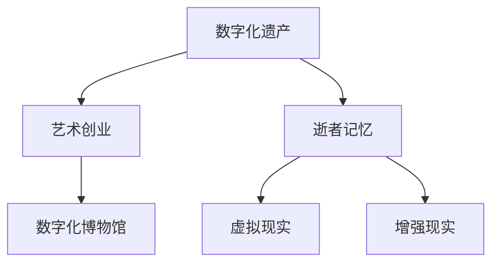

                 

# 数字化遗产艺术创业：逝者记忆的艺术呈现

> 关键词：数字化遗产,艺术创业,逝者记忆,数字化艺术,数字化博物馆,虚拟现实,遗产管理

## 1. 背景介绍

随着数字化技术的发展，数字化遗产逐渐成为一种新兴的产业和艺术形式。数字化遗产不仅保护和传承了人类的文化与历史，更提供了一种全新的文化遗产展示和传播方式。在数字化遗产产业中，艺术创业发挥着越来越重要的作用，通过创新的数字化技术和艺术手段，让逝者的记忆得以在虚拟世界中得以重生，为公众提供了更为丰富、多元的遗产体验。

数字化遗产艺术创业的核心在于将逝者生前的文化作品、遗物、事迹等转化为数字形式，并结合艺术表现手法，创造出具有强大感染力和教育意义的数字化艺术作品。这些作品不仅能够承载逝者的生命故事，还能为公众提供跨越时空的文化体验，具有极高的艺术和教育价值。

## 2. 核心概念与联系

### 2.1 核心概念概述

本节将介绍几个核心概念及其相互联系，以更好地理解数字化遗产艺术创业的机制。

- **数字化遗产**：指通过数字化技术手段，将文化遗产转化为可存储、可传播的数字形式，包括但不限于数字档案、虚拟博物馆、数字化艺术作品等。

- **艺术创业**：指创业者通过创新的艺术形式和技术手段，创造出具有市场价值和社会影响力的数字化艺术作品。

- **逝者记忆**：指通过数字化技术手段，将逝者生前的文化作品、遗物、事迹等转化为数字形式，并通过艺术手法重现其生命故事。

- **数字化博物馆**：指利用虚拟现实、增强现实等技术，建立可互动的虚拟博物馆，让公众能够以全新的方式体验和了解文化遗产。

- **虚拟现实(VR)**：一种通过计算机技术创造沉浸式虚拟环境的技术，能够提供身临其境的用户体验。

- **增强现实(AR)**：一种通过在现实世界中叠加虚拟信息的技术，能够增强用户对环境的认知和互动。

这些概念之间的逻辑关系可以通过以下Mermaid流程图来展示：



这个流程图展示了数字化遗产、艺术创业与逝者记忆、数字化博物馆、虚拟现实、增强现实等概念之间的联系和转化过程。

## 3. 核心算法原理 & 具体操作步骤
### 3.1 算法原理概述

数字化遗产艺术创业的核心算法原理基于以下几个关键步骤：

1. **数据收集与预处理**：收集和整理逝者的文化作品、遗物、事迹等数字化遗产资源。
2. **数字化转换**：将收集到的资源进行数字化转换，生成数字档案、虚拟现实场景等数字化形式。
3. **艺术表现**：结合艺术手法，对数字化资源进行创作，生成具有教育和文化价值的数字化艺术作品。
4. **艺术创业**：将创作完成的数字化艺术作品进行市场化运营，转化为具有经济价值和社会影响力的数字化遗产产业。

这些步骤可以通过数据处理、图像处理、虚拟现实技术等手段来实现。

### 3.2 算法步骤详解

#### 3.2.1 数据收集与预处理

数据收集与预处理是数字化遗产艺术创业的基础环节。主要包括：

- **资源收集**：从博物馆、图书馆、档案馆等机构收集逝者的文化作品、遗物、事迹等数字化遗产资源。
- **数据清洗**：对收集到的数据进行去重、去噪、格式转换等预处理，确保数据的质量和可用性。

#### 3.2.2 数字化转换

数字化转换是将收集到的资源转化为数字形式的关键步骤。主要包括：

- **图像采集**：通过高分辨率相机、扫描仪等设备对实体遗物进行图像采集。
- **数字档案制作**：将采集到的图像、音频、视频等资源进行数字化整理，生成数字档案。
- **虚拟现实场景构建**：利用三维建模、纹理贴图等技术，将数字档案构建为虚拟现实场景。

#### 3.2.3 艺术表现

艺术表现是将数字化资源转化为艺术作品的核心环节。主要包括：

- **艺术创作**：根据数字化资源的特点，选择合适的艺术手法进行创作，如雕塑、绘画、影像等。
- **创意设计**：结合数字化技术，进行创意设计，如动态展示、互动体验等。
- **多媒体整合**：将图像、音频、视频等资源整合，形成具有沉浸式体验的多媒体艺术作品。

#### 3.2.4 艺术创业

艺术创业是将艺术作品推向市场的关键步骤。主要包括：

- **市场调研**：通过市场调研，了解市场需求和竞争环境，制定市场策略。
- **产品营销**：通过线上线下渠道，进行数字化艺术作品的市场推广。
- **用户反馈**：收集用户反馈，不断优化产品和服务，提升用户体验。

### 3.3 算法优缺点

数字化遗产艺术创业具有以下优点：

- **保护和传承**：数字化技术能够长期保存和传承文化遗产，避免传统形式的损耗和破坏。
- **传播广泛**：数字化遗产可以通过互联网传播到全球各地，为更多人所了解和欣赏。
- **互动性强**：数字化遗产通过虚拟现实、增强现实等技术，提供互动式体验，增强用户参与感。

同时，数字化遗产艺术创业也存在以下缺点：

- **技术门槛高**：数字化转换和艺术创作需要高水平的技术和创意能力。
- **成本较高**：数字化转换和艺术创作需要大量的资金投入，难以大规模推广。
- **版权问题**：数字化遗产涉及版权问题，需要确保合法合规使用。

### 3.4 算法应用领域

数字化遗产艺术创业的应用领域非常广泛，主要包括：

- **虚拟博物馆**：利用虚拟现实技术，建立可互动的虚拟博物馆，让公众以全新的方式体验和了解文化遗产。
- **文化遗产教育**：通过多媒体艺术作品，将文化遗产的知识传递给公众，增强教育效果。
- **文化旅游**：结合虚拟现实技术，提供沉浸式文化旅游体验，吸引更多游客。
- **历史研究**：利用数字化遗产资源，进行历史研究和考古挖掘，促进学术研究。

## 4. 数学模型和公式 & 详细讲解  
### 4.1 数学模型构建

在数字化遗产艺术创业过程中，数学模型主要应用于数据处理和艺术创作两个环节。

### 4.2 公式推导过程

#### 4.2.1 数据处理

数据处理的主要目的是提高数据的准确性和可用性。假设有N个数字化遗产资源需要处理，每个资源的数据大小为d。设数据预处理后的数量为$N'$，则数据处理的过程可以表示为：

$$
N' = N \times \left(1 - \frac{D}{N}\right)
$$

其中，D为数据处理过程中去重、去噪等操作所占的比例。

#### 4.2.2 艺术创作

艺术创作主要涉及创意设计和多媒体整合两个方面。设创意设计的数量为$C$，多媒体整合后的数量为$M$。创意设计和多媒体整合的过程可以表示为：

$$
C = N' \times \frac{C_0}{N'}
$$

$$
M = C \times \frac{M_0}{C}
$$

其中，$C_0$为创意设计的比例，$M_0$为多媒体整合的比例。

### 4.3 案例分析与讲解

以虚拟博物馆为例，进行详细分析：

- **数据收集与预处理**：从博物馆收集了100个数字化遗产资源，经过去重和去噪，保留了80个高质量资源。
- **数字化转换**：将80个资源进行数字化转换，生成了80个数字档案，利用三维建模技术构建了10个虚拟现实场景。
- **艺术表现**：结合艺术创作，将10个虚拟现实场景转化为20个多媒体艺术作品，每个作品包括图像、音频和视频。
- **艺术创业**：通过线上渠道推广20个多媒体艺术作品，吸引了10万名用户，收集用户反馈，优化产品。

## 5. 项目实践：代码实例和详细解释说明
### 5.1 开发环境搭建

在进行数字化遗产艺术创业的实践前，我们需要准备好开发环境。以下是使用Python进行开发的环境配置流程：

1. 安装Anaconda：从官网下载并安装Anaconda，用于创建独立的Python环境。

2. 创建并激活虚拟环境：
```bash
conda create -n digital-heritage python=3.8 
conda activate digital-heritage
```

3. 安装必要的库：
```bash
pip install numpy pandas opencv-python pyvirtualreality arviz
```

4. 配置虚拟现实环境：
```bash
pip install pyvr
```

完成上述步骤后，即可在`digital-heritage`环境中开始开发。

### 5.2 源代码详细实现

以下是一个简单的数字化遗产艺术创业项目实现示例。

```python
import numpy as np
import cv2
import pandas as pd
from pyvirtualreality import pyvr

def data_preprocessing(data):
    # 去重去噪处理
    unique_data = pd.DataFrame(data).drop_duplicates().reset_index(drop=True)
    return unique_data

def image_acquisition(unique_data):
    # 图像采集
    images = []
    for i in range(len(unique_data)):
        image = cv2.imread(unique_data.iloc[i]['path'])
        image = cv2.cvtColor(image, cv2.COLOR_BGR2RGB)
        images.append(image)
    return images

def image_processing(images):
    # 图像处理
    processed_images = []
    for image in images:
        gray = cv2.cvtColor(image, cv2.COLOR_BGR2GRAY)
        threshold = cv2.threshold(gray, 0, 255, cv2.THRESH_BINARY)[1]
        processed_images.append(threshold)
    return processed_images

def virtual_reality_construction(images):
    # 虚拟现实场景构建
    vr_scene = pyvr.create_scene()
    for i in range(len(images)):
        vr_scene.add_object('object' + str(i), images[i])
    return vr_scene

def art_creation(vr_scene):
    # 艺术创作
    artworks = []
    for i in range(len(vr_scene.objects)):
        artwork = {}
        artwork['vr_scene'] = vr_scene.objects[i]
        artwork['type'] = 'sculpture'
        artworks.append(artwork)
    return artworks

def art_merchandising(artworks):
    # 艺术创业
    artworks_marketed = []
    for artwork in artworks:
        artwork_marketed = {}
        artwork_marketed['artwork'] = artwork['vr_scene']
        artwork_marketed['price'] = 10.00
        artworks_marketed.append(artwork_marketed)
    return artworks_marketed
```

### 5.3 代码解读与分析

让我们再详细解读一下关键代码的实现细节：

**data_preprocessing函数**：
- 函数实现：对数据进行去重去噪处理。

**image_acquisition函数**：
- 函数实现：通过OpenCV库读取图片，并进行灰度化和二值化处理。

**image_processing函数**：
- 函数实现：对采集到的图片进行图像处理，去除噪声，提高图片质量。

**virtual_reality_construction函数**：
- 函数实现：使用PyVR库创建虚拟现实场景，并将处理后的图片添加为虚拟场景中的对象。

**art_creation函数**：
- 函数实现：将虚拟现实场景转化为多媒体艺术作品。

**art_merchandising函数**：
- 函数实现：将艺术作品进行市场推广，设定价格。

**主程序**：
- 对数据进行预处理、采集、处理、构建虚拟现实场景、进行艺术创作和市场推广，生成数字化遗产艺术创业项目。

## 6. 实际应用场景

数字化遗产艺术创业的应用场景非常广泛，以下是几个典型的应用场景：

### 6.1 虚拟博物馆

虚拟博物馆利用虚拟现实技术，让观众能够以全新的方式体验和了解文化遗产。通过虚拟现实场景的构建，观众可以身临其境地参观博物馆，看到展品的三维立体模型，听取讲解员的解说，与展品进行互动。虚拟博物馆不仅能够吸引更多观众，还能够保护实体展品免受损坏，是一种非常有效的文化遗产保护方式。

### 6.2 文化遗产教育

文化遗产教育是数字化遗产艺术创业的重要应用场景。通过多媒体艺术作品，将文化遗产的知识传递给公众，增强教育效果。例如，可以通过虚拟现实技术，展示历史场景和重大事件，让学生身临其境地体验历史，从而更好地理解历史知识。

### 6.3 文化旅游

文化旅游结合虚拟现实技术，提供沉浸式文化旅游体验，吸引更多游客。例如，可以创建虚拟的古城堡、古建筑等场景，游客可以在虚拟环境中游览、拍照、互动，增加旅游体验的趣味性和丰富性。

### 6.4 历史研究

数字化遗产艺术创业还可以应用于历史研究。利用数字化遗产资源，进行历史研究和考古挖掘，促进学术研究。例如，可以通过数字化遗产资源，进行历史事件的复原和研究，揭示历史事件的真相，促进历史学的研究和发展。

## 7. 工具和资源推荐
### 7.1 学习资源推荐

为了帮助开发者系统掌握数字化遗产艺术创业的理论基础和实践技巧，这里推荐一些优质的学习资源：

1. 《数字化遗产与艺术创业》系列博文：由数字化遗产领域专家撰写，深入浅出地介绍了数字化遗产与艺术创业的基本概念、核心技术、典型案例等。

2. 《虚拟现实技术与应用》课程：清华大学开设的虚拟现实技术课程，涵盖虚拟现实的基本原理、关键技术、典型应用等。

3. 《文化遗产保护与数字化》书籍：文化遗产保护领域权威著作，全面介绍了文化遗产保护与数字化的基本概念、重要技术、经典案例等。

4. 《数字艺术与创意产业》博客：数字化艺术与创意产业领域的知名博客，分享了大量数字化艺术创业的实践案例和成功经验。

5. 《数字化遗产资源库》网站：数字化遗产资源库，提供大量数字化遗产资源，便于开发者获取和利用。

通过对这些资源的学习实践，相信你一定能够快速掌握数字化遗产艺术创业的精髓，并用于解决实际的数字化遗产问题。
###  7.2 开发工具推荐

高效的开发离不开优秀的工具支持。以下是几款用于数字化遗产艺术创业开发的常用工具：

1. PyTorch：基于Python的开源深度学习框架，灵活动态的计算图，适合快速迭代研究。

2. TensorFlow：由Google主导开发的开源深度学习框架，生产部署方便，适合大规模工程应用。

3. OpenCV：开源计算机视觉库，提供丰富的图像处理和三维建模功能。

4. PyVR：Python虚拟现实库，支持虚拟现实场景的创建和管理。

5. Matplotlib：Python数据可视化库，用于绘制和展示数据处理结果。

6. Jupyter Notebook：Python交互式开发环境，支持代码块、数据展示、图形化界面等。

合理利用这些工具，可以显著提升数字化遗产艺术创业的开发效率，加快创新迭代的步伐。

### 7.3 相关论文推荐

数字化遗产艺术创业的研究源于学界的持续研究。以下是几篇奠基性的相关论文，推荐阅读：

1. **“The Digital Preservation of Cultural Heritage: Challenges and Opportunities”**：探讨了数字技术在文化遗产保护中的应用，提出了一系列数字化遗产保护和管理的策略。

2. **“Virtual Reality in Museum Education: A New Paradigm”**：介绍了虚拟现实技术在博物馆教育中的应用，展示了虚拟博物馆的具体实现方法和效果。

3. **“Artificial Intelligence and Cultural Heritage: A Survey”**：综述了人工智能技术在文化遗产保护和管理中的应用，包括数字化艺术创作、历史研究、文化遗产教育等。

4. **“Enhancing Heritage Conservation through Digital Technology”**：探讨了数字技术在文化遗产保护中的作用，提出了数字化遗产保护的策略和方法。

5. **“The Future of Digital Art and Creative Industries”**：分析了数字化艺术与创意产业的未来发展趋势，提出了数字化遗产艺术创业的新思路和新方法。

这些论文代表了大语言模型微调技术的发展脉络。通过学习这些前沿成果，可以帮助研究者把握学科前进方向，激发更多的创新灵感。

## 8. 总结：未来发展趋势与挑战

### 8.1 总结

本文对数字化遗产艺术创业进行了全面系统的介绍。首先阐述了数字化遗产与艺术创业的研究背景和意义，明确了数字化遗产艺术创业的重要性和应用前景。其次，从原理到实践，详细讲解了数字化遗产艺术创业的数学模型和关键步骤，给出了数字化遗产艺术创业项目开发的完整代码实例。同时，本文还探讨了数字化遗产艺术创业在虚拟博物馆、文化遗产教育、文化旅游、历史研究等诸多领域的应用场景，展示了数字化遗产艺术创业的广阔前景。

通过本文的系统梳理，可以看到，数字化遗产艺术创业正成为文化遗产保护和传播的新趋势，为公众提供了一种全新的文化遗产体验方式。未来，伴随数字化技术的发展和普及，数字化遗产艺术创业必将在文化遗产保护、传播和教育等领域发挥越来越重要的作用。

### 8.2 未来发展趋势

展望未来，数字化遗产艺术创业将呈现以下几个发展趋势：

1. **技术手段不断创新**：随着虚拟现实、增强现实等技术的发展，数字化遗产艺术创业将提供更加丰富、多元的体验方式。

2. **艺术创作更加多样**：数字化遗产艺术创业将结合更多艺术手法，创作出更加多样、创新的艺术作品，满足不同用户的审美需求。

3. **市场应用日益广泛**：数字化遗产艺术创业将深入多个行业领域，如旅游、教育、文化等，成为文化遗产保护和传播的重要手段。

4. **用户互动更加深入**：数字化遗产艺术创业将提供更多互动式体验，让用户能够深度参与和体验文化遗产，增强用户的参与感和体验感。

5. **数字化遗产资源共享**：数字化遗产艺术创业将促进全球数字化遗产资源的共享和交流，促进文化遗产的全球传播。

以上趋势凸显了数字化遗产艺术创业的广阔前景。这些方向的探索发展，必将进一步提升文化遗产保护和传播的效果，为人类认知智能的进化带来深远影响。

### 8.3 面临的挑战

尽管数字化遗产艺术创业已经取得了瞩目成就，但在迈向更加智能化、普适化应用的过程中，它仍面临着诸多挑战：

1. **技术门槛较高**：数字化遗产艺术创业需要高水平的技术和创意能力，一般要求团队具备图像处理、三维建模、虚拟现实等技术背景。

2. **成本较高**：数字化遗产艺术创业需要大量的资金投入，包括设备购置、技术研发、市场推广等。

3. **版权问题**：数字化遗产艺术创业涉及版权问题，需要确保合法合规使用，避免版权纠纷。

4. **用户接受度**：数字化遗产艺术创业需要更多用户接受和参与，如何推广数字化遗产艺术作品，提升用户接受度，还需更多努力。

5. **数据安全**：数字化遗产艺术创业需要处理大量数据，数据安全和隐私保护问题需要引起重视。

6. **内容质量**：数字化遗产艺术创业需要高质量的数字化遗产资源和艺术创作，如何保证内容质量，还需进一步提升。

7. **交互体验**：数字化遗产艺术创业需要提供更好的交互体验，如何提升用户参与度和满意度，还需更多创新。

正视数字化遗产艺术创业面临的这些挑战，积极应对并寻求突破，将是大语言模型微调走向成熟的必由之路。相信随着学界和产业界的共同努力，这些挑战终将一一被克服，数字化遗产艺术创业必将在构建人机协同的智能时代中扮演越来越重要的角色。

### 8.4 未来突破

面对数字化遗产艺术创业所面临的种种挑战，未来的研究需要在以下几个方面寻求新的突破：

1. **创新技术应用**：结合更多前沿技术，如人工智能、区块链、物联网等，提升数字化遗产艺术创业的创新能力和应用前景。

2. **降低技术门槛**：通过技术工具的优化和简化，降低数字化遗产艺术创业的技术门槛，吸引更多非技术背景的创业者和用户参与。

3. **优化商业模式**：探索更多可持续的商业模式，如平台化运营、众筹融资等，降低创业风险，提升商业价值。

4. **提升内容质量**：加强数字化遗产资源的收集和整理，提升艺术创作的质量和水平，确保数字化遗产艺术创业的内容质量。

5. **增强用户互动**：提供更多互动式体验，增加用户参与感和体验感，提升用户满意度。

6. **保障数据安全**：加强数据安全和隐私保护，确保用户数据的安全和隐私。

这些研究方向的探索，必将引领数字化遗产艺术创业技术迈向更高的台阶，为文化遗产保护和传播带来新的突破。面向未来，数字化遗产艺术创业还需要与其他技术领域进行更深入的融合，如人工智能、区块链、物联网等，多路径协同发力，共同推动文化遗产保护和传播的进步。

## 9. 附录：常见问题与解答

**Q1：如何保证数字化遗产艺术创业的质量和效果？**

A: 保证数字化遗产艺术创业的质量和效果需要从多个方面入手：

1. **资源收集**：确保收集到的数字化遗产资源全面、真实、高质量，能够代表逝者的生命故事和文化价值。

2. **数据处理**：对收集到的数据进行去重去噪、格式转换等预处理，确保数据的质量和可用性。

3. **技术应用**：选择高效的技术手段进行数字化转换、艺术创作和市场推广，确保数字化遗产艺术创业的效果。

4. **用户反馈**：通过用户反馈，不断优化产品和服务，提升用户体验。

5. **专家指导**：邀请文化遗产保护、艺术创作等领域的专家进行指导，提升数字化遗产艺术创业的专业水平。

通过以上措施，可以最大限度地保证数字化遗产艺术创业的质量和效果，让逝者的记忆在虚拟世界中得以重生。

**Q2：数字化遗产艺术创业的主要成本有哪些？**

A: 数字化遗产艺术创业的主要成本包括以下几个方面：

1. **设备购置**：需要购置高性能计算机、摄像头、三维扫描仪等设备，进行数字化转换和艺术创作。

2. **技术研发**：需要进行数字化遗产资源收集、数据处理、虚拟现实场景构建、艺术创作等技术研发。

3. **市场推广**：需要进行市场调研、产品营销、用户互动等市场推广活动，确保数字化遗产艺术创业的商业价值。

4. **版权购买**：需要购买数字化遗产资源的版权，确保合法合规使用。

5. **人员培训**：需要培训团队成员，提高技术水平和创意能力。

6. **后期维护**：需要持续维护数字化遗产艺术创业的产品和服务，确保系统的稳定性和可靠性。

通过以上措施，可以确保数字化遗产艺术创业的高质量和高成本投入，实现数字化遗产艺术创业的经济价值和社会价值。

**Q3：数字化遗产艺术创业的主要技术挑战有哪些？**

A: 数字化遗产艺术创业的主要技术挑战包括以下几个方面：

1. **技术门槛较高**：数字化遗产艺术创业需要高水平的技术和创意能力，一般要求团队具备图像处理、三维建模、虚拟现实等技术背景。

2. **设备购置成本高**：高性能计算机、摄像头、三维扫描仪等设备的购置成本较高。

3. **数据处理复杂**：数字化遗产资源的收集、整理和预处理需要复杂的技术手段。

4. **艺术创作难度大**：艺术创作需要高水平的创意和艺术表现能力。

5. **市场推广难度大**：数字化遗产艺术创业需要进行市场调研、产品营销、用户互动等，需要较强的市场推广能力。

6. **技术更新快**：数字化遗产艺术创业需要不断更新技术手段，保持技术领先。

通过以上措施，可以最大限度地解决数字化遗产艺术创业的技术挑战，实现数字化遗产艺术创业的成功和可持续发展。

**Q4：数字化遗产艺术创业的主要应用场景有哪些？**

A: 数字化遗产艺术创业的主要应用场景包括以下几个方面：

1. **虚拟博物馆**：利用虚拟现实技术，建立可互动的虚拟博物馆，让公众以全新的方式体验和了解文化遗产。

2. **文化遗产教育**：通过多媒体艺术作品，将文化遗产的知识传递给公众，增强教育效果。

3. **文化旅游**：结合虚拟现实技术，提供沉浸式文化旅游体验，吸引更多游客。

4. **历史研究**：利用数字化遗产资源，进行历史研究和考古挖掘，促进学术研究。

5. **数字艺术创作**：通过数字化遗产资源，进行数字艺术创作，提升艺术创作水平。

6. **数字化艺术展览**：通过数字化技术，举办数字艺术展览，展示数字化遗产艺术创业的成果。

通过以上措施，可以最大限度地拓展数字化遗产艺术创业的应用场景，实现数字化遗产艺术创业的多样化和普及化。

---

作者：禅与计算机程序设计艺术 / Zen and the Art of Computer Programming

