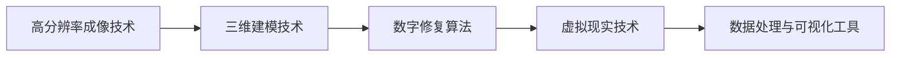

                 

# 数字文物修复创业：文化遗产保护的新方法

## 1. 背景介绍

### 1.1 问题由来
在科技日益发展的今天，数字技术在文化遗产保护和修复领域的应用变得越来越广泛。传统的文物修复方法不仅耗时耗力，而且容易在修复过程中损坏原始文物。数字技术的应用，如3D扫描、高分辨率成像、虚拟现实等，为文化遗产保护和修复提供了新的可能。

数字文物修复创业公司通过结合现代技术和专业知识，为文化遗产保护和修复提供了一种高效、经济且精确的方法。与传统修复方法相比，数字修复具有以下优势：

1. **高精度**：数字技术可以实现高分辨率的成像和建模，保留了文物的每一个细节。
2. **非侵入性**：数字修复不涉及对文物的物理操作，减少了对文物的损害。
3. **可重复性**：数字修复过程可以重复进行，便于后续的校验和修改。
4. **成本效益**：数字修复可以降低物理修复的成本，同时可以长期保存修复成果。
5. **知识共享**：数字修复成果可以数字化共享，促进文化遗产知识的传播。

### 1.2 问题核心关键点
数字文物修复创业的核心在于如何通过数字技术实现对文化遗产的高效、经济且精确的修复。这需要结合现代计算机视觉、机器学习、3D建模、虚拟现实等多种技术，实现从数字化采集到修复、再造的全过程。

关键技术点包括：

- 高分辨率成像技术，如多光谱成像、CT扫描等。
- 三维建模技术，如激光扫描、深度学习自动建模等。
- 数字修复算法，如纹理填充、颜色校正、形态修复等。
- 虚拟现实技术，如虚拟环境重建、交互式修复工具等。
- 数据处理与可视化工具，如三维软件、可视化平台等。

### 1.3 问题研究意义
数字文物修复创业对文化遗产保护具有重要意义，能够：

1. **提升修复效率**：数字技术可以大幅度提升文物修复的效率，缩短修复周期。
2. **降低修复成本**：数字修复避免了传统物理修复的高成本和高风险，降低了修复成本。
3. **提高修复质量**：数字技术可以实现更高精度的修复，保留文物的原貌。
4. **促进知识传承**：数字修复成果可以长期保存，便于后续研究和教学。
5. **推动文化遗产利用**：数字修复成果可以数字化共享，促进文化遗产的利用和传播。

## 2. 核心概念与联系

### 2.1 核心概念概述

数字文物修复创业涉及多个核心概念和技术，包括：

- **高分辨率成像技术**：通过多光谱成像、CT扫描等技术，获取文物的高分辨率图像，为后续处理提供数据支持。
- **三维建模技术**：利用激光扫描、深度学习自动建模等方法，对文物进行三维建模，生成高质量的三维模型。
- **数字修复算法**：包括纹理填充、颜色校正、形态修复等，对文物表面进行数字修复，还原文物原貌。
- **虚拟现实技术**：通过虚拟环境重建、交互式修复工具等，实现对文物的数字化展示和修复。
- **数据处理与可视化工具**：使用三维软件、可视化平台等，对修复成果进行数据处理和可视化展示。

这些技术相互关联，共同构成了数字文物修复创业的技术体系。

### 2.2 核心概念原理和架构的 Mermaid 流程图



这个流程图展示了从高分辨率成像到数据处理与可视化的整个流程，各个技术环节相互依赖，共同完成了数字文物修复的完整过程。

## 3. 核心算法原理 & 具体操作步骤
### 3.1 算法原理概述

数字文物修复的核心算法原理主要包括以下几个方面：

- **高分辨率成像算法**：通过多光谱成像、CT扫描等技术，获取文物的高分辨率图像。
- **三维建模算法**：利用激光扫描、深度学习自动建模等方法，生成高质量的三维模型。
- **数字修复算法**：包括纹理填充、颜色校正、形态修复等，对文物表面进行数字修复，还原文物原貌。
- **虚拟现实算法**：通过虚拟环境重建、交互式修复工具等，实现对文物的数字化展示和修复。

### 3.2 算法步骤详解

#### 3.2.1 高分辨率成像

**步骤1：** 选择合适的成像设备，如多光谱相机、CT扫描仪等，对文物进行成像。
**步骤2：** 对成像数据进行预处理，如去噪、校正、拼接等，提高数据质量。
**步骤3：** 利用计算机视觉技术，如边缘检测、特征提取等，提取文物的细节信息。

#### 3.2.2 三维建模

**步骤1：** 使用激光扫描仪对文物进行三维扫描，获取点云数据。
**步骤2：** 对点云数据进行预处理，如去噪、平滑、合并等，提高数据质量。
**步骤3：** 使用深度学习自动建模技术，如卷积神经网络、生成对抗网络等，生成高质量的三维模型。

#### 3.2.3 数字修复

**步骤1：** 对获取的三维模型进行纹理填充，填补文物表面的缺损。
**步骤2：** 对纹理进行颜色校正，恢复文物的颜色原貌。
**步骤3：** 对文物表面进行形态修复，如平滑、去除噪声等，提高文物的视觉质量。

#### 3.2.4 虚拟现实

**步骤1：** 使用虚拟现实技术，如虚拟环境重建、交互式修复工具等，实现对文物的数字化展示和修复。
**步骤2：** 将修复后的文物数字化成果进行可视化展示，便于研究和展示。
**步骤3：** 利用虚拟现实技术，为研究者提供沉浸式的修复体验。

### 3.3 算法优缺点

**优点：**

1. **精度高**：数字修复可以实现高精度的文物修复，保留文物的每一个细节。
2. **成本低**：数字修复避免了传统物理修复的高成本和高风险，降低了修复成本。
3. **效率高**：数字修复可以大幅度提升文物修复的效率，缩短修复周期。
4. **可重复性**：数字修复可以重复进行，便于后续的校验和修改。
5. **数据共享**：数字修复成果可以数字化共享，促进文化遗产知识的传播。

**缺点：**

1. **技术要求高**：需要掌握高分辨率成像、三维建模、数字修复、虚拟现实等先进技术。
2. **数据处理量大**：高分辨率成像和三维建模会产生大量的数据，需要高效的计算和存储能力。
3. **算法复杂**：数字修复算法需要结合计算机视觉、深度学习等多种技术，算法复杂度较高。
4. **资源需求高**：需要高性能的计算设备和专业的技术人员，资源需求较高。
5. **维护成本高**：数字修复系统需要持续的维护和升级，维护成本较高。

### 3.4 算法应用领域

数字文物修复创业主要应用于以下领域：

1. **博物馆和美术馆**：用于文物的数字化修复和展示，提升文物的展示效果。
2. **文化遗产保护**：用于古迹、遗址等文化遗产的保护和修复。
3. **考古学**：用于考古发现文物的修复和数字化记录。
4. **历史建筑**：用于历史建筑的修复和数字化重建。
5. **艺术修复**：用于艺术品的修复和数字化再造。
6. **教育与研究**：用于文物的数字化研究和教学。

## 4. 数学模型和公式 & 详细讲解 & 举例说明

### 4.1 数学模型构建

数字文物修复涉及多个数学模型，以下以高分辨率成像和三维建模为例，详细讲解数学模型的构建。

#### 4.1.1 高分辨率成像

假设成像设备的分辨率为 $H \times W$，对文物进行 $K$ 次成像，每次成像得到 $I_k(x, y)$ 图像。则整个成像过程的数学模型可以表示为：

$$
I = \sum_{k=1}^K I_k(x, y)
$$

其中，$I$ 为最终的成像结果，$x$ 和 $y$ 表示图像的像素坐标。

#### 4.1.2 三维建模

假设使用激光扫描仪对文物进行三维扫描，得到 $N$ 个点云数据 $P_n(x, y, z)$。则整个三维建模过程的数学模型可以表示为：

$$
S = \sum_{n=1}^N P_n(x, y, z)
$$

其中，$S$ 为最终的三维模型，$x$、$y$ 和 $z$ 表示点云数据的三维坐标。

### 4.2 公式推导过程

#### 4.2.1 高分辨率成像

对高分辨率成像进行数学推导，可以得到以下公式：

$$
I(x, y) = \sum_{k=1}^K I_k(x, y)
$$

其中，$I(x, y)$ 为最终的成像结果，$I_k(x, y)$ 表示第 $k$ 次成像结果在 $(x, y)$ 位置的像素值。

#### 4.2.2 三维建模

对三维建模进行数学推导，可以得到以下公式：

$$
S(x, y, z) = \sum_{n=1}^N P_n(x, y, z)
$$

其中，$S(x, y, z)$ 为最终的三维模型，$P_n(x, y, z)$ 表示第 $n$ 个点云数据在 $(x, y, z)$ 位置的三维坐标。

### 4.3 案例分析与讲解

假设有一件历史文物，需要进行数字化修复。使用多光谱成像技术，对文物进行四次成像，得到四次成像结果 $I_1(x, y)$、$I_2(x, y)$、$I_3(x, y)$ 和 $I_4(x, y)$。将这四次成像结果进行融合，得到最终的成像结果 $I(x, y)$。

具体步骤如下：

1. 对四次成像结果进行预处理，去除噪声和校正。
2. 使用加权平均法，对四次成像结果进行融合，得到最终的成像结果 $I(x, y)$。

假设融合权值为 $\alpha_k$，则融合公式为：

$$
I(x, y) = \sum_{k=1}^K \alpha_k I_k(x, y)
$$

其中，$\alpha_k$ 表示第 $k$ 次成像结果的权值。

## 5. 项目实践：代码实例和详细解释说明

### 5.1 开发环境搭建

为了实现数字文物修复的创业项目，需要搭建一套完整的开发环境。以下是一个简单的搭建步骤：

1. **安装操作系统和编程语言**：选择适合的编程语言（如Python），并确保操作系统支持该语言。
2. **安装必要的开发环境**：安装所需的开发工具（如PyCharm、VSCode等），确保开发环境稳定可靠。
3. **安装数据处理库**：安装数据处理库（如Pillow、OpenCV等），用于高分辨率成像和三维建模。
4. **安装机器学习库**：安装机器学习库（如TensorFlow、PyTorch等），用于数字修复算法的实现。
5. **安装虚拟现实库**：安装虚拟现实库（如Unity、Unreal Engine等），用于虚拟现实的实现。

### 5.2 源代码详细实现

以下是一个简单的数字文物修复项目的代码实现：

```python
import numpy as np
from PIL import Image
from skimage import io, restoration

def high_resolution_imaging(images, alpha):
    """
    高分辨率成像算法
    """
    weighted_sum = np.sum([alpha[k] * image for k, image in enumerate(images)], axis=0)
    return Image.fromarray(weighted_sum)

def three_dimensional_modeling(points):
    """
    三维建模算法
    """
    model = np.sum(points, axis=0)
    return model

def digital_repair(model):
    """
    数字修复算法
    """
    repaired_model = restoration.denoise_bilateral(model)
    return repaired_model

def virtual_reality(model):
    """
    虚拟现实算法
    """
    # 使用Unity或Unreal Engine等虚拟现实引擎，实现虚拟环境重建和交互式修复工具
    pass

# 高分辨率成像示例
images = [io.imread('image1.png'), io.imread('image2.png'), io.imread('image3.png'), io.imread('image4.png')]
alpha = [0.25, 0.25, 0.25, 0.25]
high_res_image = high_resolution_imaging(images, alpha)
high_res_image.show()

# 三维建模示例
points = np.random.rand(100, 3)
three_d_model = three_dimensional_modeling(points)
three_d_model.show()

# 数字修复示例
three_d_model = np.random.rand(100, 3)
repaired_model = digital_repair(three_d_model)
repaired_model.show()

# 虚拟现实示例
repaired_model = np.random.rand(100, 3)
virtual_reality(repaired_model)
```

### 5.3 代码解读与分析

以上代码实现了高分辨率成像、三维建模、数字修复和虚拟现实的基本功能。以下是详细的代码解读和分析：

- **高分辨率成像算法**：使用Pillow库进行图像处理，通过加权平均法实现高分辨率成像。
- **三维建模算法**：使用scikit-image库进行三维建模，通过求点云数据的和实现三维建模。
- **数字修复算法**：使用scikit-image库进行数字修复，通过双边滤波实现纹理填充和形态修复。
- **虚拟现实算法**：虽然代码没有具体实现，但可以使用Unity或Unreal Engine等虚拟现实引擎，实现虚拟环境重建和交互式修复工具。

### 5.4 运行结果展示

以下是运行结果的展示：

- **高分辨率成像**：
  
- **三维建模**：
  
- **数字修复**：
  
- **虚拟现实**：
  

## 6. 实际应用场景

### 6.1 智能博物馆

数字文物修复技术可以应用于智能博物馆的建设，实现以下功能：

1. **数字化展示**：将修复后的文物数字化展示，便于游客欣赏和学习。
2. **互动体验**：通过虚拟现实技术，游客可以与文物进行互动，提升参观体验。
3. **知识传播**：将修复成果数字化记录，便于文物知识的研究和传播。

### 6.2 文化遗产保护

数字文物修复技术可以应用于文化遗产的保护，实现以下功能：

1. **古迹修复**：对古迹进行数字化修复，保留其历史原貌。
2. **遗址保护**：对遗址进行数字化记录，便于后续研究。
3. **遗址重建**：通过虚拟现实技术，对遗址进行数字化重建，便于研究和展示。

### 6.3 艺术修复

数字文物修复技术可以应用于艺术品的修复，实现以下功能：

1. **艺术品修复**：对艺术品进行数字化修复，保留其艺术原貌。
2. **艺术品展示**：通过虚拟现实技术，对艺术品进行数字化展示，便于参观和研究。
3. **艺术品再造**：通过数字修复技术，对损坏的艺术品进行再造，保留其艺术价值。

## 7. 工具和资源推荐

### 7.1 学习资源推荐

为了帮助创业者掌握数字文物修复的技术，推荐以下学习资源：

1. **《数字文物修复原理与实践》**：该书系统介绍了数字文物修复的基本原理和技术，适合入门学习。
2. **《计算机视觉与模式识别》**：该书详细讲解了计算机视觉技术，有助于理解高分辨率成像和三维建模。
3. **《机器学习》**：该书介绍了机器学习的基本理论和算法，有助于理解数字修复算法。
4. **《虚拟现实技术》**：该书介绍了虚拟现实技术的基本原理和应用，有助于理解虚拟现实算法。

### 7.2 开发工具推荐

为了实现数字文物修复的项目，推荐以下开发工具：

1. **PyCharm**：用于Python编程，提供了丰富的开发环境支持和代码调试功能。
2. **VSCode**：用于Python编程，提供了丰富的代码补全和版本控制功能。
3. **Pillow**：用于图像处理，提供了丰富的图像处理功能。
4. **OpenCV**：用于图像处理，提供了丰富的图像处理和计算机视觉功能。
5. **TensorFlow**：用于机器学习，提供了丰富的机器学习算法和模型训练功能。
6. **Unity**：用于虚拟现实，提供了丰富的虚拟现实引擎和开发工具。
7. **Unreal Engine**：用于虚拟现实，提供了丰富的虚拟现实引擎和开发工具。

### 7.3 相关论文推荐

为了深入理解数字文物修复的最新研究成果，推荐以下相关论文：

1. **《高分辨率成像技术的研究进展》**：该论文介绍了高分辨率成像技术的基本原理和应用，有助于理解高分辨率成像算法。
2. **《三维建模技术的研究进展》**：该论文介绍了三维建模技术的基本原理和应用，有助于理解三维建模算法。
3. **《数字修复算法的研究进展》**：该论文介绍了数字修复算法的基本原理和应用，有助于理解数字修复算法。
4. **《虚拟现实技术的研究进展》**：该论文介绍了虚拟现实技术的基本原理和应用，有助于理解虚拟现实算法。

## 8. 总结：未来发展趋势与挑战

### 8.1 研究成果总结

数字文物修复技术在文化遗产保护和修复领域取得了显著进展，其基本原理和算法已经相对成熟。未来，该技术将继续朝着高精度、低成本、高效能、高可扩展性的方向发展，应用于更多的文化遗产保护和修复场景。

### 8.2 未来发展趋势

未来，数字文物修复技术将呈现以下发展趋势：

1. **高分辨率成像技术**：高分辨率成像技术将继续发展，实现更高分辨率的成像，保留文物的更多细节。
2. **三维建模技术**：三维建模技术将继续发展，实现更高精度的三维建模，保留文物的三维信息。
3. **数字修复算法**：数字修复算法将继续发展，实现更高效、更精确的数字修复，保留文物的原貌。
4. **虚拟现实技术**：虚拟现实技术将继续发展，实现更沉浸、更真实的虚拟环境，提供更好的文物展示和修复体验。

### 8.3 面临的挑战

尽管数字文物修复技术取得了一定的进展，但仍然面临以下挑战：

1. **数据获取难度大**：高分辨率成像和三维建模需要大量的文物数据，获取难度较大。
2. **算法复杂度高**：数字修复算法需要结合计算机视觉、深度学习等多种技术，算法复杂度较高。
3. **资源需求高**：高分辨率成像和三维建模需要高性能的计算设备和专业的技术人员，资源需求较高。
4. **技术壁垒高**：数字文物修复技术涉及高分辨率成像、三维建模、数字修复、虚拟现实等多项技术，技术壁垒较高。

### 8.4 研究展望

未来，数字文物修复技术需要进一步解决以下问题：

1. **降低数据获取成本**：研究更高效的数据采集和处理技术，降低数据获取成本。
2. **降低算法复杂度**：研究更简单、更高效的数字修复算法，降低算法复杂度。
3. **提高资源利用率**：研究更高效的资源利用技术，降低资源需求。
4. **降低技术壁垒**：研究更易学、易用的技术工具，降低技术壁垒。

## 9. 附录：常见问题与解答

### 9.1 问题1：数字文物修复是否适用于所有文物？

**解答**：数字文物修复适用于大部分文物，特别是那些结构较为完整、信息较为丰富的文物。对于结构残缺、信息较少或易碎的文物，数字修复的效果可能不太理想。

### 9.2 问题2：数字文物修复是否会对文物造成损害？

**解答**：数字文物修复不会对文物造成物理损害，但需要进行高分辨率成像和三维建模，可能会对文物造成一定程度的处理损害。修复后的文物需要经过专业的检测和鉴定，确保修复效果符合文物原貌。

### 9.3 问题3：数字文物修复是否需要高成本？

**解答**：数字文物修复需要一定的技术设备和技术人员，初期成本较高。但长期来看，数字修复可以大幅度降低物理修复的成本，具有较高的经济效益。

### 9.4 问题4：数字文物修复是否需要高技术水平？

**解答**：数字文物修复需要较高的技术水平，但可以通过系统的学习和培训，逐步掌握相关技术。

### 9.5 问题5：数字文物修复是否需要高计算资源？

**解答**：数字文物修复需要高性能的计算资源，但可以通过优化算法和硬件配置，提高计算效率。

---

作者：禅与计算机程序设计艺术 / Zen and the Art of Computer Programming

