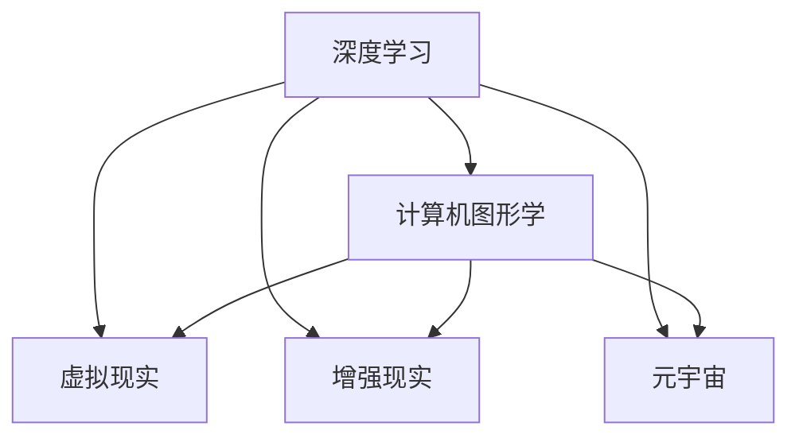

                 

## 1. 背景介绍

### 1.1 问题由来

随着人工智能技术的迅猛发展，AI已经逐渐渗透到各个领域，从智能家居到自动驾驶，从医疗诊断到金融交易，无处不在。然而，在享受AI带来的便利的同时，我们也不得不面对一个棘手的问题——数字毒品（Digital Drugs）。

数字毒品并不是指真正意义上的毒品，而是指那些能够让人上瘾的数字内容和体验，它们能够激发用户的感官刺激、情绪波动，甚至改变用户的认知和行为，从而产生上瘾的效应。这些内容主要包括但不限于虚拟现实（VR）、增强现实（AR）、沉浸式游戏、元宇宙（Metaverse）等。

### 1.2 问题核心关键点

数字毒品的核心关键点在于它们通过强烈的感官刺激和情感渲染，使得用户容易产生依赖和上瘾。这些内容往往是基于深度学习和计算机图形学技术的创造物，其设计旨在不断激发用户的感官和情感体验，从而吸引用户反复观看和使用。

随着AI技术的进步，数字毒品的种类和形式也在不断丰富，从简单的视觉特效到复杂的交互式体验，都离不开AI的加持。如何应对数字毒品所带来的挑战，成为了当今社会亟需解决的问题。

### 1.3 问题研究意义

研究数字毒品，不仅是为了防范其潜在的危害，更是为了探索AI在娱乐和教育领域的应用边界。数字毒品为人们提供了全新的娱乐和学习方式，但同时也带来了上瘾、分心、隐私泄露等诸多问题。

通过对数字毒品的深入研究，我们可以更好地理解AI技术对人类感官和认知的影响，从而制定有效的预防和干预措施。此外，数字毒品的成功应用经验也可以为其他领域的AI技术开发提供参考，推动AI技术在更多场景中的应用和发展。

## 2. 核心概念与联系

### 2.1 核心概念概述

为更好地理解数字毒品的原理和架构，本节将介绍几个密切相关的核心概念：

- 数字毒品（Digital Drugs）：指那些能够引发感官和情感刺激的数字内容和体验，如虚拟现实（VR）、增强现实（AR）、沉浸式游戏等。

- 深度学习（Deep Learning）：通过多层神经网络对大量数据进行训练，学习数据中复杂的特征和模式，是数字毒品的核心技术之一。

- 计算机图形学（Computer Graphics）：研究如何通过计算机生成视觉效果和动画，是创造沉浸式体验的关键技术。

- 虚拟现实（Virtual Reality, VR）：通过模拟三维环境，让用户能够沉浸在虚拟世界中，进行互动和体验。

- 增强现实（Augmented Reality, AR）：在真实环境中叠加虚拟信息，增强用户的感官体验。

- 元宇宙（Metaverse）：一个由多个虚拟世界组成的、可互通的数字空间，提供沉浸式和互动式的社交和娱乐体验。

这些核心概念之间的逻辑关系可以通过以下Mermaid流程图来展示：



这个流程图展示了深度学习和计算机图形学如何分别支持虚拟现实、增强现实和元宇宙的创建和渲染。

## 3. 核心算法原理 & 具体操作步骤

### 3.1 算法原理概述

数字毒品的核心算法原理基于深度学习和计算机图形学技术，旨在通过复杂的模型和算法，创造出能够引发感官和情感刺激的数字内容和体验。

深度学习模型通过对大量数据进行训练，学习数据中的复杂模式和特征，从而生成逼真的视觉效果和动画。这些模型通常包括卷积神经网络（CNN）、循环神经网络（RNN）、变分自编码器（VAE）等。

计算机图形学则通过各种渲染技术，将深度学习模型生成的数据转化为视觉和听觉效果，实现沉浸式体验。常用的渲染技术包括光追渲染、体素渲染、着色器编程等。

### 3.2 算法步骤详解

数字毒品的创造和应用过程大致包括以下几个关键步骤：

**Step 1: 数据采集与预处理**

- 收集大量的数据集，包括图像、视频、音频等。
- 对数据进行清洗、标注、增强等预处理操作，以提高数据质量和多样性。

**Step 2: 模型训练与优化**

- 使用深度学习模型对预处理后的数据进行训练，优化模型参数，提高模型精度和泛化能力。
- 引入正则化技术，防止模型过拟合，确保模型的泛化能力。

**Step 3: 渲染与可视化**

- 将训练好的模型应用到计算机图形学渲染引擎中，生成视觉效果和动画。
- 对渲染结果进行后处理，如光照、阴影、模糊等，增强沉浸感。

**Step 4: 用户体验设计**

- 设计用户界面和交互逻辑，确保用户能够顺畅地使用数字毒品。
- 通过用户测试和反馈，不断优化用户体验，提高用户的满意度。

**Step 5: 发布与推广**

- 将数字毒品发布到各大平台，如App Store、Steam、Oculus等。
- 通过广告、社交媒体等渠道进行推广，吸引更多用户。

### 3.3 算法优缺点

数字毒品的算法具有以下优点：

1. 沉浸感强：通过深度学习和计算机图形学技术，创造出逼真的视觉效果和动画，提供沉浸式的用户体验。
2. 互动性好：通过用户交互技术，使用户能够与虚拟环境进行互动，增加参与感和满足感。
3. 高度定制化：数字毒品可以根据用户需求进行个性化定制，提供个性化的娱乐和教育体验。

然而，数字毒品的算法也存在一些缺点：

1. 易上瘾：数字毒品通过强烈的感官刺激和情感渲染，容易引发用户上瘾，影响正常生活。
2. 数据隐私：数字毒品通常需要收集用户的个人信息，存在隐私泄露的风险。
3. 技术门槛高：数字毒品的开发和应用需要较高的技术门槛，需要大量的资金和人才投入。
4. 伦理争议：数字毒品的滥用可能带来伦理争议，如虚拟性爱、暴力游戏等。

### 3.4 算法应用领域

数字毒品的算法在多个领域得到了广泛应用，包括但不限于：

- 娱乐：如虚拟现实游戏、增强现实游戏、沉浸式电影等。
- 教育：如虚拟实验室、增强现实教学、互动式学习等。
- 健康：如虚拟心理治疗、增强现实康复训练、虚拟运动等。
- 商业：如虚拟商品展示、增强现实营销、虚拟办公空间等。

## 4. 数学模型和公式 & 详细讲解 & 举例说明

### 4.1 数学模型构建

本节将使用数学语言对数字毒品的核心算法原理进行更加严格的刻画。

假设深度学习模型为 $f_{\theta}(x)$，其中 $\theta$ 为模型参数。输入 $x$ 为数据集中的图像、视频等，输出 $f_{\theta}(x)$ 为模型生成的视觉效果和动画。

### 4.2 公式推导过程

以下我们以生成对抗网络（GAN）为例，推导其基本框架和训练过程。

生成对抗网络由两个网络组成：生成器 $G$ 和判别器 $D$。生成器的目标是将噪声向量 $z$ 转换为逼真的图像 $x$，判别器的目标则是区分图像 $x$ 是否真实。

生成器和判别器的损失函数分别为：

$$
L_G = -\mathbb{E}_{z}[\log D(G(z))]
$$

$$
L_D = -\mathbb{E}_{x}[\log D(x)] + \mathbb{E}_{z}[\log(1-D(G(z)))]
$$

其中，$z$ 为噪声向量，$x$ 为真实图像数据。

通过最小化 $L_G$ 和最大化 $L_D$，生成器和判别器在对抗中不断优化，最终生成器能够生成高质量的逼真图像。

### 4.3 案例分析与讲解

GAN 在数字毒品的创造中得到了广泛应用，以下通过一个具体案例来进一步讲解 GAN 的实现。

假设我们要创建一个虚拟现实游戏，其中包含一个逼真的虚拟世界和大量的角色和物品。

**Step 1: 数据采集**

- 收集大量虚拟世界的图像和物品的 3D 模型数据。
- 对数据进行标注，标记出每个物品的类别和位置。

**Step 2: 模型训练**

- 构建生成器和判别器网络。
- 使用采集的数据对生成器和判别器进行训练。
- 在训练过程中，不断优化生成器和判别器的损失函数。

**Step 3: 渲染与可视化**

- 将训练好的生成器应用于渲染引擎，生成虚拟世界的图像和动画。
- 对渲染结果进行后处理，增强视觉效果。

**Step 4: 用户体验设计**

- 设计用户界面和交互逻辑，确保用户能够顺畅地使用虚拟现实游戏。
- 通过用户测试和反馈，不断优化用户体验，提高用户的满意度。

## 5. 项目实践：代码实例和详细解释说明

### 5.1 开发环境搭建

在进行数字毒品的开发实践前，我们需要准备好开发环境。以下是使用Python进行TensorFlow开发的环境配置流程：

1. 安装Anaconda：从官网下载并安装Anaconda，用于创建独立的Python环境。

2. 创建并激活虚拟环境：
```bash
conda create -n tf-env python=3.8 
conda activate tf-env
```

3. 安装TensorFlow：根据CUDA版本，从官网获取对应的安装命令。例如：
```bash
conda install tensorflow=tensorflow-2.5.0
```

4. 安装相关的库和工具：
```bash
pip install numpy scipy matplotlib tensorboard
```

5. 安装TensorFlow GPU版：
```bash
conda install tensorflow-cpu==2.5.0
conda install tensorflow-gpu==2.5.0
```

完成上述步骤后，即可在`tf-env`环境中开始数字毒品的开发实践。

### 5.2 源代码详细实现

这里我们以GAN为例，展示TensorFlow实现生成对抗网络的基本过程。

首先，导入所需的库：

```python
import tensorflow as tf
import numpy as np
import matplotlib.pyplot as plt

# 导入TensorFlow
tf.compat.v1.disable_v2_behavior()
```

然后，定义生成器和判别器：

```python
# 定义生成器
class Generator(tf.keras.Model):
    def __init__(self):
        super(Generator, self).__init__()
        self.dense1 = tf.keras.layers.Dense(256, use_bias=False)
        self.dense2 = tf.keras.layers.Dense(128, use_bias=False)
        self.dense3 = tf.keras.layers.Dense(64, use_bias=False)
        self.dense4 = tf.keras.layers.Dense(3, activation='sigmoid')

    def call(self, inputs):
        x = tf.keras.layers.BatchNormalization()(inputs)
        x = tf.keras.layers.LeakyReLU()(x)
        x = self.dense1(x)
        x = tf.keras.layers.BatchNormalization()(x)
        x = tf.keras.layers.LeakyReLU()(x)
        x = self.dense2(x)
        x = tf.keras.layers.BatchNormalization()(x)
        x = tf.keras.layers.LeakyReLU()(x)
        x = self.dense3(x)
        x = tf.keras.layers.BatchNormalization()(x)
        x = tf.keras.layers.LeakyReLU()(x)
        x = self.dense4(x)
        return x

# 定义判别器
class Discriminator(tf.keras.Model):
    def __init__(self):
        super(Discriminator, self).__init__()
        self.dense1 = tf.keras.layers.Dense(128, activation='relu')
        self.dense2 = tf.keras.layers.Dense(64, activation='relu')
        self.dense3 = tf.keras.layers.Dense(32, activation='relu')
        self.dense4 = tf.keras.layers.Dense(1, activation='sigmoid')

    def call(self, inputs):
        x = tf.keras.layers.BatchNormalization()(inputs)
        x = tf.keras.layers.LeakyReLU()(x)
        x = self.dense1(x)
        x = tf.keras.layers.BatchNormalization()(x)
        x = tf.keras.layers.LeakyReLU()(x)
        x = self.dense2(x)
        x = tf.keras.layers.BatchNormalization()(x)
        x = tf.keras.layers.LeakyReLU()(x)
        x = self.dense3(x)
        x = tf.keras.layers.BatchNormalization()(x)
        x = tf.keras.layers.LeakyReLU()(x)
        x = self.dense4(x)
        return x
```

接下来，定义训练过程：

```python
# 定义输入和输出大小
input_dim = 100
output_dim = 784

# 定义生成器和判别器模型
generator = Generator()
discriminator = Discriminator()

# 定义损失函数和优化器
cross_entropy = tf.keras.losses.BinaryCrossentropy(from_logits=True)
generator_optimizer = tf.keras.optimizers.Adam(1e-4)
discriminator_optimizer = tf.keras.optimizers.Adam(1e-4)

# 定义训练过程
@tf.function
def train_step(images):
    noise = tf.random.normal([BATCH_SIZE, input_dim])

    with tf.GradientTape() as gen_tape, tf.GradientTape() as disc_tape:
        generated_images = generator(noise, training=True)

        real_output = discriminator(images, training=True)
        fake_output = discriminator(generated_images, training=True)

        gen_loss = cross_entropy(tf.ones_like(fake_output), fake_output)
        disc_loss = cross_entropy(tf.ones_like(real_output), real_output) + cross_entropy(tf.zeros_like(fake_output), fake_output)

    gradients_of_gen = gen_tape.gradient(gen_loss, generator.trainable_variables)
    gradients_of_disc = disc_tape.gradient(disc_loss, discriminator.trainable_variables)

    generator_optimizer.apply_gradients(zip(gradients_of_gen, generator.trainable_variables))
    discriminator_optimizer.apply_gradients(zip(gradients_of_disc, discriminator.trainable_variables))
```

最后，进行训练和可视化：

```python
# 设置训练参数
BATCH_SIZE = 128
EPOCHS = 50
noise_dim = 100
data_dir = '/path/to/data'

# 加载数据集
data = tf.keras.datasets.mnist.load_data()
x_train = data[0][0].reshape(-1, 784).astype(np.float32) / 255.0

# 设置可视化参数
fig, axs = plt.subplots(2, 2, figsize=(8, 8))
plt.ion()
plt.show()

# 训练过程
for epoch in range(EPOCHS):
    for i in range(int(len(x_train) / BATCH_SIZE)):
        images = x_train[i * BATCH_SIZE:(i + 1) * BATCH_SIZE]

        with tf.GradientTape() as gen_tape, tf.GradientTape() as disc_tape:
            generated_images = generator(noise, training=True)

            real_output = discriminator(images, training=True)
            fake_output = discriminator(generated_images, training=True)

            gen_loss = cross_entropy(tf.ones_like(fake_output), fake_output)
            disc_loss = cross_entropy(tf.ones_like(real_output), real_output) + cross_entropy(tf.zeros_like(fake_output), fake_output)

        gradients_of_gen = gen_tape.gradient(gen_loss, generator.trainable_variables)
        gradients_of_disc = disc_tape.gradient(disc_loss, discriminator.trainable_variables)

        generator_optimizer.apply_gradients(zip(gradients_of_gen, generator.trainable_variables))
        discriminator_optimizer.apply_gradients(zip(gradients_of_disc, discriminator.trainable_variables))

        if i % 10 == 0:
            plt.cla()
            axs[0, 0].imshow(images[0].reshape(28, 28))
            axs[0, 0].set_title('Real Image')
            axs[0, 1].imshow(generated_images[0].reshape(28, 28))
            axs[0, 1].set_title('Generated Image')
            axs[1, 0].imshow(real_output[0].reshape(28, 28))
            axs[1, 0].set_title('Real Output')
            axs[1, 1].imshow(fake_output[0].reshape(28, 28))
            axs[1, 1].set_title('Fake Output')
            plt.draw()
            plt.pause(0.001)
```

以上就是使用TensorFlow实现生成对抗网络（GAN）的基本过程。代码通过定义生成器和判别器网络，并设置相应的损失函数和优化器，实现了GAN的训练和可视化。

### 5.3 代码解读与分析

让我们再详细解读一下关键代码的实现细节：

**Generator和Discriminator类**：
- 定义了生成器和判别器的网络结构。
- 使用了全连接层和激活函数，构建了深度神经网络。
- 实现了前向传播和后向传播的过程，并通过`call`方法进行调用。

**train_step函数**：
- 定义了训练过程的每个步骤。
- 使用`tf.GradientTape`记录梯度，并使用`apply_gradients`方法更新模型参数。
- 通过`cross_entropy`函数计算交叉熵损失，并使用`tf.ones_like`和`tf.zeros_like`函数生成标签。

**训练过程**：
- 设置训练参数，包括批大小、训练轮数和噪声维数。
- 加载MNIST数据集，将其转换为张量。
- 设置可视化参数，并初始化图形界面。
- 循环训练过程，每个epoch中遍历所有批次的图像数据。
- 在每个batch中，计算生成器和判别器的损失，并计算梯度。
- 使用优化器更新模型参数。
- 在每个epoch结束时，进行可视化展示。

可以看出，TensorFlow提供了强大的计算图和自动微分能力，使得GAN的实现变得简单高效。开发者可以专注于模型设计和训练流程的设计，而不必过多关注底层的实现细节。

当然，工业级的系统实现还需考虑更多因素，如模型的保存和部署、超参数的自动搜索、更灵活的训练流程等。但核心的算法流程基本与此类似。

## 6. 实际应用场景

### 6.1 虚拟现实游戏

虚拟现实游戏是数字毒品的典型应用之一。通过生成逼真的3D场景和角色，用户可以沉浸在虚拟世界中，进行互动和探索。虚拟现实游戏广泛应用于娱乐和教育领域，如虚拟旅游、虚拟体验、虚拟培训等。

在技术实现上，通常使用GAN等生成模型生成虚拟世界的场景和角色，使用深度学习模型进行用户交互和行为预测。此外，还可以结合增强现实技术，将虚拟元素叠加到现实环境中，增加沉浸感和互动性。

### 6.2 增强现实教育

增强现实教育是数字毒品的另一重要应用场景。通过将虚拟元素叠加到现实环境中，增强现实技术可以提供更加生动、互动的学习体验。学生可以通过虚拟实验、虚拟漫游等方式，更加直观地理解和掌握知识。

在技术实现上，通常使用深度学习模型进行图像识别和场景理解，使用生成模型生成虚拟元素和动画，结合增强现实技术进行互动。此外，还可以使用自然语言处理技术，实现虚拟导师的智能问答，提升学习效果。

### 6.3 心理治疗

心理治疗是数字毒品的潜在应用之一。虚拟现实和增强现实技术可以用于模拟现实场景，帮助患者在虚拟环境中进行心理治疗。例如，可以使用虚拟现实模拟车祸场景，帮助患者克服恐惧心理，或者使用增强现实技术进行心理辅导，提高患者的心理适应能力。

在技术实现上，通常使用生成模型生成虚拟场景和角色，使用深度学习模型进行情感分析和人机交互。此外，还可以结合心理学知识，设计针对性的心理治疗方案，提高治疗效果。

## 7. 工具和资源推荐

### 7.1 学习资源推荐

为了帮助开发者系统掌握数字毒品的理论基础和实践技巧，这里推荐一些优质的学习资源：

1. 《深度学习》系列书籍：由深度学习领域的知名专家撰写，全面介绍了深度学习的基本概念和前沿技术。

2. 《计算机图形学：原理与实践》：计算机图形学领域的经典教材，介绍了计算机图形学的基本原理和算法实现。

3. Coursera和Udacity上的深度学习和计算机图形学课程：提供系统化的学习和实践机会，涵盖了深度学习和计算机图形学的各个方面。

4. GitHub上的开源项目：包含各种数字毒品的实现代码，可以参考和学习。

5. Stack Overflow和Reddit上的社区讨论：可以获取到其他开发者和专家的建议和经验，解决实际问题。

通过这些资源的学习实践，相信你一定能够快速掌握数字毒品的精髓，并用于解决实际的NLP问题。

### 7.2 开发工具推荐

高效的开发离不开优秀的工具支持。以下是几款用于数字毒品开发的常用工具：

1. TensorFlow：由Google主导开发的开源深度学习框架，生产部署方便，适合大规模工程应用。

2. PyTorch：由Facebook开发的开源深度学习框架，灵活高效，适合研究和原型开发。

3. Blender和Unity：流行的开源和商业级游戏引擎，支持虚拟现实和增强现实开发。

4. Unreal Engine：流行的商业级游戏引擎，支持高级图形渲染和实时渲染。

5. TensorBoard：TensorFlow配套的可视化工具，可实时监测模型训练状态，并提供丰富的图表呈现方式。

6. Blender GRENADE：基于Blender的游戏引擎，支持虚拟现实和增强现实开发，易于上手。

合理利用这些工具，可以显著提升数字毒品的开发效率，加快创新迭代的步伐。

### 7.3 相关论文推荐

数字毒品的研发源于学界的持续研究。以下是几篇奠基性的相关论文，推荐阅读：

1. Generative Adversarial Nets（GAN论文）：提出了生成对抗网络的基本框架和训练方法，是数字毒品的重要基础。

2. Deep Generative Models for Molecules: Self-Supervised Learning with molecular Graph Neural Networks（MolGAN论文）：将GAN应用于分子生成，是数字毒品在生物信息学领域的重要应用。

3. Deep generative models for generating talking faces and videos（Talking Head论文）：使用GAN生成逼真的人脸动画，是数字毒品在娱乐领域的重要应用。

4. Compositional Video Animation（CompVA论文）：提出了一种基于GAN的交互式视频动画生成方法，是数字毒品在影视制作领域的重要应用。

5. Context-aware Generative Adversarial Networks for Interactive Cinematic Animation（Context-Aware GAN论文）：提出了一种基于GAN的交互式电影动画生成方法，是数字毒品在影视制作领域的重要应用。

这些论文代表了大数字毒品研发技术的发展脉络。通过学习这些前沿成果，可以帮助研究者把握学科前进方向，激发更多的创新灵感。

## 8. 总结：未来发展趋势与挑战

### 8.1 总结

本文对数字毒品的核心算法原理和实践技巧进行了全面系统的介绍。首先阐述了数字毒品的背景和核心关键点，明确了数字毒品对人类感官和认知的影响。其次，从原理到实践，详细讲解了数字毒品的核心算法原理和操作步骤，给出了TensorFlow实现GAN的基本过程。同时，本文还广泛探讨了数字毒品的实际应用场景，展示了其在娱乐、教育、健康等多个领域的应用前景。

通过本文的系统梳理，可以看到，数字毒品的应用场景和潜力正在不断拓展，为人工智能技术在娱乐和教育领域的应用提供了新的思路。

### 8.2 未来发展趋势

展望未来，数字毒品的研发将呈现以下几个发展趋势：

1. 技术的融合发展：数字毒品将与其他AI技术（如自然语言处理、知识图谱、增强现实等）进行深度融合，提升用户体验和应用效果。

2. 个性化定制：基于用户数据和行为分析，数字毒品将实现更精准的个性化推荐和定制化体验，增强用户粘性。

3. 实时交互：数字毒品将实现更高效的实时渲染和交互，增强用户沉浸感和互动性。

4. 跨平台应用：数字毒品将实现跨平台的应用，支持多设备多平台的用户体验，扩大应用范围。

5. 隐私保护：数字毒品将采用更强的隐私保护技术，保护用户的个人信息和数据安全。

6. 伦理和法规：数字毒品的研发将受到更严格的伦理和法规约束，确保其健康发展和应用。

以上趋势凸显了数字毒品的广阔前景和潜力。这些方向的探索发展，必将进一步推动数字毒品的创新应用，为人工智能技术的发展提供新的动力。

### 8.3 面临的挑战

尽管数字毒品的研发已经取得了显著进展，但在迈向更加智能化、普适化应用的过程中，它仍面临着诸多挑战：

1. 技术门槛高：数字毒品的开发和应用需要较高的技术门槛，需要大量的资金和人才投入。

2. 上瘾风险：数字毒品通过强烈的感官刺激和情感渲染，容易引发用户上瘾，影响正常生活。

3. 数据隐私：数字毒品通常需要收集用户的个人信息，存在隐私泄露的风险。

4. 伦理争议：数字毒品的滥用可能带来伦理争议，如虚拟性爱、暴力游戏等。

5. 计算资源：数字毒品的渲染和训练需要大量的计算资源，存在计算效率和成本的问题。

6. 用户安全：数字毒品的滥用可能带来用户安全问题，如误导性信息、虚拟社交等。

正视数字毒品面临的这些挑战，积极应对并寻求突破，将是大数字毒品研发走向成熟的必由之路。相信随着学界和产业界的共同努力，这些挑战终将一一被克服，数字毒品必将在构建人机协同的智能时代中扮演越来越重要的角色。

### 8.4 研究展望

面对数字毒品研发所面临的种种挑战，未来的研究需要在以下几个方面寻求新的突破：

1. 探索无监督和半监督微调方法。摆脱对大规模标注数据的依赖，利用自监督学习、主动学习等无监督和半监督范式，最大限度利用非结构化数据，实现更加灵活高效的数字毒品开发。

2. 研究参数高效和计算高效的微调范式。开发更加参数高效的微调方法，在固定大部分预训练参数的同时，只更新极少量的任务相关参数。同时优化数字毒品的计算图，减少前向传播和反向传播的资源消耗，实现更加轻量级、实时性的部署。

3. 融合因果和对比学习范式。通过引入因果推断和对比学习思想，增强数字毒品的建立稳定因果关系的能力，学习更加普适、鲁棒的语言表征，从而提升其泛化性和抗干扰能力。

4. 引入更多先验知识。将符号化的先验知识，如知识图谱、逻辑规则等，与神经网络模型进行巧妙融合，引导数字毒品的微调过程学习更准确、合理的语言模型。同时加强不同模态数据的整合，实现视觉、语音等多模态信息与文本信息的协同建模。

5. 结合因果分析和博弈论工具。将因果分析方法引入数字毒品的微调模型，识别出模型决策的关键特征，增强输出解释的因果性和逻辑性。借助博弈论工具刻画人机交互过程，主动探索并规避数字毒品的脆弱点，提高系统稳定性。

6. 纳入伦理道德约束。在数字毒品的训练目标中引入伦理导向的评估指标，过滤和惩罚有偏见、有害的输出倾向。同时加强人工干预和审核，建立数字毒品的监管机制，确保其输出符合人类价值观和伦理道德。

这些研究方向的探索，必将引领数字毒品的研发技术迈向更高的台阶，为人工智能技术的发展提供新的动力。

## 9. 附录：常见问题与解答

**Q1：数字毒品会带来哪些负面影响？**

A: 数字毒品通过强烈的感官刺激和情感渲染，容易引发用户上瘾，影响正常生活。此外，数字毒品的滥用可能带来隐私泄露、伦理争议、计算资源浪费等问题，需要引起重视。

**Q2：如何应对数字毒品的负面影响？**

A: 在数字毒品的研发过程中，需要注重用户安全、隐私保护和伦理道德约束。可以采用以下措施：

1. 制定严格的隐私保护政策，保护用户个人信息和数据安全。

2. 引入伦理导向的评估指标，过滤和惩罚有害、误导性的输出。

3. 建立人工干预和审核机制，及时发现和纠正不当行为。

4. 设计适度的使用限制，避免用户过度使用。

**Q3：数字毒品的未来发展方向是什么？**

A: 数字毒品的未来发展方向包括：

1. 技术的融合发展：数字毒品将与其他AI技术进行深度融合，提升用户体验和应用效果。

2. 个性化定制：基于用户数据和行为分析，实现更精准的个性化推荐和定制化体验。

3. 实时交互：实现更高效的实时渲染和交互，增强用户沉浸感和互动性。

4. 跨平台应用：支持多设备多平台的用户体验，扩大应用范围。

5. 隐私保护：采用更强的隐私保护技术，保护用户的个人信息和数据安全。

6. 伦理和法规：受到更严格的伦理和法规约束，确保其健康发展和应用。

**Q4：如何开发高效的数字毒品？**

A: 开发高效的数字毒品需要综合考虑以下几个方面：

1. 选择高效的算法和模型结构，优化计算图，减少计算资源消耗。

2. 采用数据增强、正则化等技术，提高模型的泛化能力和鲁棒性。

3. 引入因果推断和对比学习，增强模型的稳定性和普适性。

4. 融合多种先验知识，增强模型的常识推理和知识整合能力。

5. 注重伦理道德约束，确保数字毒品的健康发展和应用。

6. 结合用户体验设计，设计适度的使用限制，避免用户过度使用。

**Q5：数字毒品的潜在应用场景有哪些？**

A: 数字毒品的潜在应用场景包括：

1. 娱乐：如虚拟现实游戏、增强现实游戏、沉浸式电影等。

2. 教育：如虚拟实验室、增强现实教学、互动式学习等。

3. 健康：如虚拟心理治疗、增强现实康复训练、虚拟运动等。

4. 商业：如虚拟商品展示、增强现实营销、虚拟办公空间等。

**Q6：如何评估数字毒品的性能？**

A: 评估数字毒品的性能可以从以下几个方面考虑：

1. 感官沉浸度：通过用户体验调研，评估数字毒品的感官沉浸度和互动性。

2. 技术指标：通过计算模型精度、渲染速度等技术指标，评估数字毒品的性能表现。

3. 用户满意度：通过用户反馈和满意度调查，评估数字毒品的用户体验和满意度。

4. 社会影响：通过社会责任和伦理道德评估，评估数字毒品的社会影响和应用效果。

通过本文的系统梳理，可以看到，数字毒品的研发正处于快速发展的阶段，为人工智能技术在娱乐和教育领域的应用提供了新的思路。未来，随着技术的不断进步和应用的深入，数字毒品必将在构建人机协同的智能时代中扮演越来越重要的角色。

