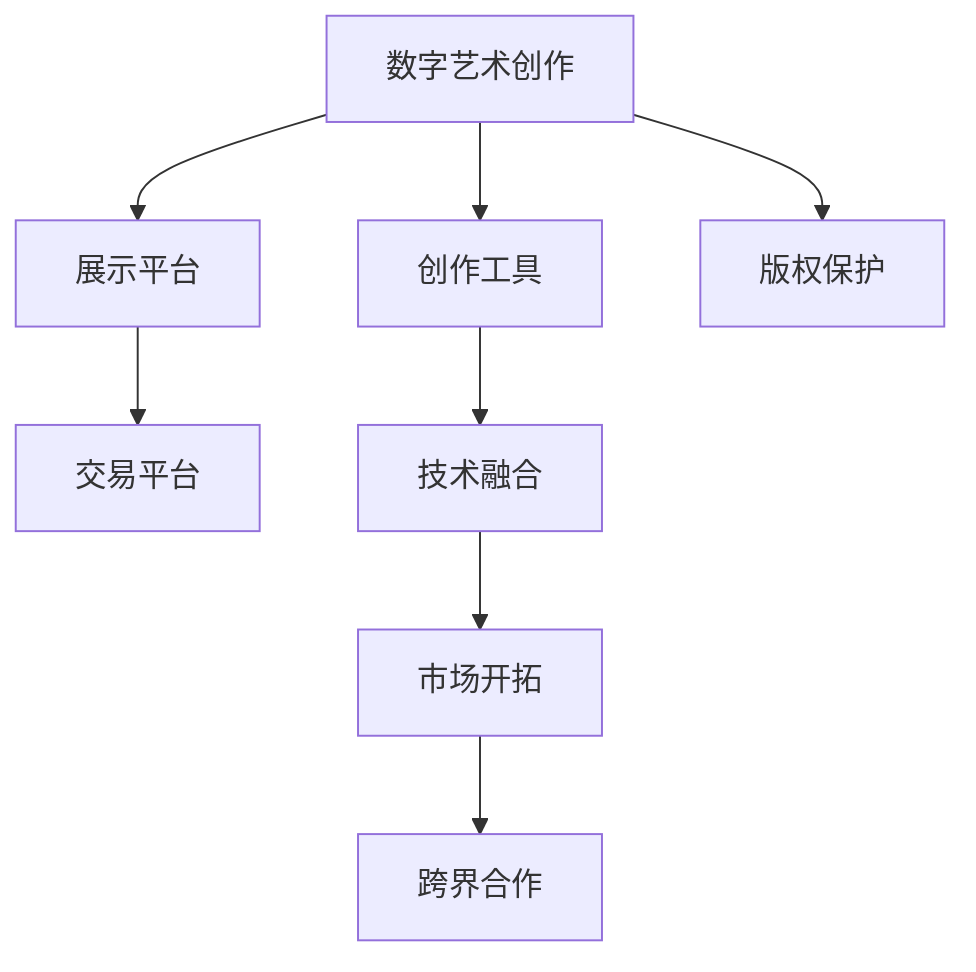

                 

# 数字艺术创业：艺术与科技的完美融合

> 关键词：数字艺术,艺术与科技融合,创业,艺术科技公司,创作平台,数字化,技术驱动,艺术创作工具

## 1. 背景介绍

### 1.1 问题由来

随着数字技术的迅猛发展，数字艺术（Digital Art）作为一种新的艺术表现形式，逐渐进入公众视野。数字艺术不仅拓宽了艺术创作的边界，也开创了艺术与科技融合的新纪元。数字艺术创业，将科技的力量与艺术家的创意思维结合起来，催生了大量富有创新的艺术作品和应用平台。

近年来，随着人工智能、虚拟现实、增强现实等技术的不断成熟，数字艺术创业者们可以通过科技手段，实现从艺术创作到展示、交易等全流程的数字化。这不仅极大地提升了艺术创作的效率和质量，也为艺术作品的市场化、产业化提供了新的可能性。

### 1.2 问题核心关键点

数字艺术创业的核心关键点在于如何利用科技手段，提升艺术创作的自由度、效率和影响力。以下是几个核心的关键点：

- **技术融合**：如何结合多种数字技术，如AI生成、3D建模、AR/VR等，来创作出创新的艺术作品。
- **平台搭建**：如何构建一个覆盖创作、展示、交易等全链条的数字艺术平台，支持艺术家的创作与作品的流通。
- **市场开拓**：如何将数字艺术作品推广到更广泛的市场，实现艺术与商业的良性互动。
- **版权保护**：如何确保艺术作品的知识产权，防止盗版和侵权，维护艺术家的合法权益。
- **跨界合作**：如何与品牌、媒体、教育机构等外部力量合作，拓宽艺术创作与展示的渠道。

这些关键点共同构成了数字艺术创业的挑战与机遇，也奠定了未来发展的方向。

## 2. 核心概念与联系

### 2.1 核心概念概述

为了更好地理解数字艺术创业的本质，本节将介绍几个关键概念及其联系：

- **数字艺术（Digital Art）**：利用数字技术，如计算机图形、3D建模、AI生成等，创作和展示的艺术作品。

- **艺术科技（Arts and Technology）**：将科技与艺术相结合，利用技术手段提升艺术创作的效率、质量和表现力。

- **创业平台（Digital Art Platform）**：搭建一个支持数字艺术创作、展示、交易的全流程平台，促进艺术家与消费者之间的互动。

- **创作工具（Digital Art Tools）**：提供一系列的科技工具，如AI绘画、3D建模软件、虚拟现实平台等，支持艺术家的创作。

- **市场化（Marketization）**：通过线上线下渠道，将数字艺术作品推向市场，实现商业价值。

- **版权保护（Copyright Protection）**：确保艺术作品的知识产权，防止盗版和侵权，维护艺术家和版权方的利益。

### 2.2 核心概念原理和架构的 Mermaid 流程图



这个流程图展示了数字艺术创作、展示、交易、版权保护、技术融合、市场开拓和跨界合作的相互联系与影响。

## 3. 核心算法原理 & 具体操作步骤

### 3.1 算法原理概述

数字艺术创业的核心在于将艺术创作与科技手段紧密结合，通过算法优化和平台建设，提升艺术作品的生产效率和市场影响力。以下是对核心算法的概述：

- **创作算法**：利用机器学习和深度学习技术，生成创意性艺术作品。如通过GAN生成图像，或使用AI绘画生成抽象艺术。
- **展示算法**：利用AR/VR技术，打造沉浸式的艺术展示体验。通过虚拟现实引擎，艺术家可以创建互动式的虚拟艺术空间。
- **交易算法**：基于区块链技术，建立去中心化的艺术作品交易平台，确保交易的透明性和安全性。
- **版权保护算法**：利用数字水印技术，确保艺术作品的独特性，防止盗版和侵权。

### 3.2 算法步骤详解

以下是数字艺术创业中几个主要算法的详细步骤：

#### 创作算法

1. **数据采集与预处理**：收集艺术作品的数据集，如绘画、摄影、雕塑等，进行预处理，包括图像归一化、尺寸调整等。
2. **模型选择与训练**：选择合适的生成模型，如GAN、VAE等，进行模型训练。训练过程中，使用大量的艺术作品数据，优化模型参数。
3. **作品生成与优化**：生成新的艺术作品，并通过调整模型参数、迭代训练等手段，提升作品的艺术性和创意性。

#### 展示算法

1. **虚拟场景搭建**：利用3D建模软件，创建虚拟艺术空间，包括展厅、雕塑、绘画等。
2. **交互设计**：在虚拟空间中，加入交互元素，如触摸感应、声音反馈等，提升用户的沉浸式体验。
3. **平台集成**：将虚拟空间集成到展示平台中，用户可以通过VR头盔或网页体验虚拟艺术。

#### 交易算法

1. **智能合约编写**：基于区块链技术，编写智能合约，确保交易的透明性和安全性。
2. **作品上链**：将艺术作品信息上传至区块链，确保作品的唯一性和不可篡改性。
3. **交易执行**：通过智能合约，实现作品的无缝交易，艺术家和买家可以实时监控交易进程。

#### 版权保护算法

1. **数字水印嵌入**：在艺术作品中嵌入数字水印，确保作品的独特性和原创性。
2. **版权登记**：将作品的版权信息上传至版权登记平台，确保版权的合法性和有效性。
3. **侵权检测**：通过对比水印信息，检测作品是否被侵权或盗版，一旦发现侵权行为，立即采取法律行动。

### 3.3 算法优缺点

#### 创作算法

**优点**：
- 能够快速生成大量创意性艺术作品，提高创作效率。
- 利用AI技术，可以生成一些传统手段难以实现的复杂艺术形式。

**缺点**：
- 过度依赖算法，可能导致作品缺乏个人风格和深度。
- 生成模型的可解释性不足，艺术家难以理解其创作过程。

#### 展示算法

**优点**：
- 提供沉浸式的艺术展示体验，增强用户的参与感和互动性。
- 打破空间限制，让艺术作品可以广泛传播。

**缺点**：
- 对硬件设备的要求较高，成本较高。
- 用户体验可能受限于技术实现的成熟度。

#### 交易算法

**优点**：
- 确保交易的透明性和安全性，降低欺诈风险。
- 去中心化的交易方式，降低了对传统中介机构的依赖。

**缺点**：
- 技术门槛较高，普通人难以理解和使用。
- 交易速度和费用可能受区块链网络的影响。

#### 版权保护算法

**优点**：
- 确保作品版权的唯一性和不可篡改性，维护艺术家权益。
- 通过数字水印技术，便于版权追踪和维权。

**缺点**：
- 对作品进行数字处理，可能改变其原始状态。
- 数字水印技术可能被破解或绕过，存在一定的安全隐患。

### 3.4 算法应用领域

数字艺术创业中的算法技术，已经广泛应用于以下几个领域：

- **艺术创作**：如通过AI生成艺术作品、利用AR技术创作互动式艺术等。
- **艺术展示**：如虚拟现实艺术展览、3D打印艺术作品等。
- **艺术交易**：如基于区块链的数字艺术交易平台，支持在线拍卖、作品捐赠等。
- **版权保护**：如数字水印技术在艺术作品的防伪和追踪中的应用。

这些应用领域展示了数字艺术创业的广阔前景和多样性，也反映了科技在艺术创作中的重要作用。

## 4. 数学模型和公式 & 详细讲解 & 举例说明

### 4.1 数学模型构建

数字艺术创业中的核心算法涉及多个数学模型，以下列举几个典型模型：

- **生成对抗网络（GAN）**：
  $$
  \begin{aligned}
  & G(x): \mathbb{R}^{z} \rightarrow \mathbb{R}^{d} \\
  & D(x): \mathbb{R}^{d} \rightarrow [0, 1]
  \end{aligned}
  $$
  其中，$G$为生成器，$D$为判别器，$x$为随机噪声向量，$d$为数据维度。

- **变分自编码器（VAE）**：
  $$
  p_{\text{data}}(x) = \mathcal{N}(x; \mu(x), \sigma^2(x))
  $$
  其中，$\mu(x)$和$\sigma^2(x)$分别为数据的均值和方差。

- **数字水印嵌入算法**：
  $$
  \text{Watermark} = \mathcal{E}(\text{Data}, \text{Key})
  $$
  其中，$\mathcal{E}$为嵌入函数，$\text{Data}$为原始数据，$\text{Key}$为水印密钥。

### 4.2 公式推导过程

#### 生成对抗网络（GAN）

生成对抗网络由生成器$G$和判别器$D$组成，通过对抗训练，生成器可以生成高质量的假数据，判别器可以区分真实数据和假数据。以下是GAN的训练过程推导：

1. **生成器训练**：
  $$
  \max_{G} \mathbb{E}_{p_{\text{data}}}[D(G(x))] + \mathbb{E}_{p_{z}}[\log(1 - D(G(z)))]
  $$
  其中，$z$为随机噪声向量，$G(z)$为生成的假数据。

2. **判别器训练**：
  $$
  \max_{D} \mathbb{E}_{p_{\text{data}}}[D(x)] - \mathbb{E}_{p_{z}}[\log(D(G(z)))]
  $$

#### 变分自编码器（VAE）

变分自编码器通过编码器将数据映射到潜在空间，通过解码器将潜在空间中的数据映射回原始数据空间。以下是VAE的推导过程：

1. **编码器**：
  $$
  z = \mu(x) + \sigma(x) \odot \epsilon
  $$
  其中，$\mu(x)$和$\sigma(x)$分别为数据的均值和方差，$\epsilon$为标准正态分布的随机噪声。

2. **解码器**：
  $$
  x = \mu(z) + \sigma(z) \odot \epsilon
  $$

#### 数字水印嵌入算法

数字水印的嵌入算法通过将水印信息嵌入原始数据中，实现对作品的保护。以下是水印嵌入和提取的推导过程：

1. **嵌入**：
  $$
  \text{Watermark} = \mathcal{E}(\text{Data}, \text{Key}) = \text{Data} + \text{Key} \odot \text{Hash}(\text{Data})
  $$
  其中，$\odot$表示向量内积，$\text{Hash}$为哈希函数。

2. **提取**：
  $$
  \text{Extract}(\text{Watermark}, \text{Data}) = \text{Data} - \text{Key} \odot \text{Hash}(\text{Data})
  $$

### 4.3 案例分析与讲解

#### 案例1：AI生成艺术作品

某数字艺术创业公司利用GAN技术，训练生成器生成抽象艺术作品。具体步骤如下：
1. **数据收集**：收集大量抽象艺术作品，作为训练集。
2. **模型训练**：使用GAN模型，训练生成器生成新的抽象艺术作品。
3. **作品展示**：将生成的艺术作品在网站上展示，供用户浏览购买。

#### 案例2：AR艺术展览

某数字艺术创业公司利用AR技术，打造虚拟现实艺术展览。具体步骤如下：
1. **虚拟空间搭建**：使用3D建模软件，创建虚拟艺术空间。
2. **交互设计**：在虚拟空间中，加入触摸感应、声音反馈等交互元素。
3. **平台集成**：将虚拟空间集成到展示平台中，用户可以通过VR头盔体验虚拟艺术。

## 5. 项目实践：代码实例和详细解释说明

### 5.1 开发环境搭建

在进行数字艺术创业的实践时，我们需要准备好开发环境。以下是使用Python进行PyTorch开发的环境配置流程：

1. 安装Anaconda：从官网下载并安装Anaconda，用于创建独立的Python环境。

2. 创建并激活虚拟环境：
```bash
conda create -n pytorch-env python=3.8 
conda activate pytorch-env
```

3. 安装PyTorch：根据CUDA版本，从官网获取对应的安装命令。例如：
```bash
conda install pytorch torchvision torchaudio cudatoolkit=11.1 -c pytorch -c conda-forge
```

4. 安装Transformers库：
```bash
pip install transformers
```

5. 安装各类工具包：
```bash
pip install numpy pandas scikit-learn matplotlib tqdm jupyter notebook ipython
```

完成上述步骤后，即可在`pytorch-env`环境中开始数字艺术创业的实践。

### 5.2 源代码详细实现

这里我们以数字水印嵌入算法为例，给出使用PyTorch实现的代码实现。

首先，定义数字水印嵌入函数：

```python
import torch
import torch.nn as nn
import torch.nn.functional as F

class WatermarkEmbedding(nn.Module):
    def __init__(self, key_size):
        super(WatermarkEmbedding, self).__init__()
        self.key_size = key_size
        
    def forward(self, data):
        # 随机生成水印密钥
        key = torch.randn(data.size(0), self.key_size)
        
        # 计算数据哈希值
        data_hash = torch.abs(data)
        data_hash = torch.clamp(data_hash, min=1e-6)
        data_hash = torch.pow(data_hash, 0.5)
        
        # 水印嵌入
        watermark = torch.sin(data_hash * key)
        watermark = watermark * data
        
        return watermark
```

然后，定义数字水印提取函数：

```python
class WatermarkExtraction(nn.Module):
    def __init__(self, key_size):
        super(WatermarkExtraction, self).__init__()
        self.key_size = key_size
        
    def forward(self, watermark, data):
        # 随机生成水印密钥
        key = torch.randn(watermark.size(0), self.key_size)
        
        # 水印提取
        watermark = watermark * data
        watermark_hash = torch.sin(watermark)
        watermark_hash = watermark_hash / data
        
        return watermark_hash
```

最后，定义数字水印生成与验证函数：

```python
import numpy as np
import matplotlib.pyplot as plt

def generate_watermark(data, key):
    watermark = torch.sin(data * key)
    watermark = watermark * data
    return watermark

def validate_watermark(watermark, data):
    watermark_hash = torch.sin(watermark)
    watermark_hash = watermark_hash / data
    return watermark_hash

# 测试数据
data = torch.randn(100, 3, 3)
key = torch.randn(100, 3)

# 水印嵌入
watermark = WatermarkEmbedding(key_size=3)(data)
watermark = generate_watermark(data, key)

# 水印提取
watermark_hash = WatermarkExtraction(key_size=3)(watermark, data)
watermark_hash = validate_watermark(watermark, data)

# 可视化结果
plt.imshow(watermark.numpy(), cmap='gray')
plt.title('Watermark Image')
plt.show()
```

以上就是使用PyTorch进行数字水印嵌入算法的代码实现。可以看到，数字水印的嵌入和提取过程相对简单，利用了数据哈希和正弦函数的特性。

### 5.3 代码解读与分析

让我们再详细解读一下关键代码的实现细节：

**WatermarkEmbedding类**：
- `__init__`方法：初始化水印密钥的大小。
- `forward`方法：生成数字水印，具体过程包括随机生成水印密钥、计算数据哈希值、水印嵌入等。

**WatermarkExtraction类**：
- `__init__`方法：初始化水印密钥的大小。
- `forward`方法：提取数字水印，具体过程包括随机生成水印密钥、水印提取、计算水印哈希值等。

**generate_watermark函数**：
- 定义数字水印的生成过程，包括计算数据哈希值、正弦函数嵌入等。

**validate_watermark函数**：
- 定义数字水印的验证过程，包括计算水印哈希值、水印提取等。

可以看到，数字水印嵌入和提取的代码实现相对简洁，利用了数据哈希和正弦函数的特性，可以有效地实现数字水印的嵌入和验证。

当然，在实际应用中，还需要考虑更多的细节，如水印密钥的安全性、水印算法的鲁棒性等。但核心的算法思想基本与此类似。

## 6. 实际应用场景

### 6.1 智能艺术创作

数字艺术创业在智能艺术创作领域具有广阔的应用前景。通过利用AI技术，艺术家可以更加高效地生成创意性作品，如抽象画、3D建模等。

在技术实现上，可以采用GAN、VAE等生成模型，训练生成器生成高质量的艺术作品。艺术家可以在生成器的基础上进行二次创作，提升作品的独特性和艺术性。

### 6.2 虚拟现实艺术展览

数字艺术创业在虚拟现实艺术展览领域也有着广泛的应用。通过AR/VR技术，艺术家可以打造沉浸式的虚拟艺术空间，用户可以通过虚拟头盔或显示器，全方位体验艺术作品。

在技术实现上，可以搭建虚拟场景，加入交互元素，如触摸感应、声音反馈等，提升用户的沉浸式体验。艺术家可以将作品集成到虚拟展览平台中，用户可以通过平台进行互动和浏览。

### 6.3 数字艺术交易

数字艺术创业在数字艺术交易领域也有着重要的应用。通过区块链技术，艺术家和买家可以在去中心化的平台上进行艺术作品的交易，确保交易的透明性和安全性。

在技术实现上，可以编写智能合约，实现艺术作品的自动化交易。买家可以通过平台进行浏览、选购和支付，艺术家可以实时监控交易进程，确保权益的保障。

### 6.4 未来应用展望

随着数字艺术创业的发展，未来的应用场景将更加多样化和前沿化。以下是一些未来应用的展望：

- **艺术版权保护**：利用区块链和数字水印技术，确保艺术作品的版权，防止盗版和侵权。
- **跨界合作**：与品牌、媒体、教育机构等外部力量合作，拓宽艺术创作与展示的渠道。
- **元宇宙艺术**：结合虚拟现实和数字艺术，打造元宇宙艺术世界，提升艺术作品的市场价值。
- **个性化艺术**：通过AI技术，生成个性化的艺术作品，满足用户的个性化需求。
- **艺术数据平台**：建立艺术数据平台，收集和分析艺术作品的数据，提供更丰富的艺术信息和资源。

## 7. 工具和资源推荐

### 7.1 学习资源推荐

为了帮助开发者系统掌握数字艺术创业的理论基础和实践技巧，这里推荐一些优质的学习资源：

1. **《数字艺术与科技融合》系列博文**：由数字艺术创业领域专家撰写，深入浅出地介绍了数字艺术创作、展示、交易等核心内容。

2. **Coursera《数字艺术与科技》课程**：由知名高校和机构开设的课程，涵盖数字艺术创作的多种技术和工具。

3. **Artsy Insight系列文章**：Artsy网站提供的多篇文章，介绍数字艺术在当代艺术中的应用和趋势。

4. **《数字艺术创新》书籍**：全面介绍数字艺术创业的各个环节，包括艺术创作、展示、交易等。

5. **Transformers官方文档**：Transformer库的官方文档，提供了海量预训练模型和完整的代码样例，是数字艺术创业的重要参考。

### 7.2 开发工具推荐

高效的开发离不开优秀的工具支持。以下是几款用于数字艺术创业开发的常用工具：

1. **PyTorch**：基于Python的开源深度学习框架，灵活动态的计算图，适合快速迭代研究。

2. **TensorFlow**：由Google主导开发的开源深度学习框架，生产部署方便，适合大规模工程应用。

3. **Blender**：免费的三维动画软件，支持多种模型和纹理制作，广泛应用于虚拟现实艺术创作。

4. **Unity3D**：跨平台的虚拟现实引擎，支持多种平台，提供丰富的VR/AR开发工具和资源。

5. **Blockchain Explorer**：区块链浏览器，可以实时查看区块链上的交易信息，确保数字艺术交易的透明性和安全性。

### 7.3 相关论文推荐

数字艺术创业领域的研究已经取得了诸多成果，以下是几篇奠基性的相关论文，推荐阅读：

1. **Generative Adversarial Networks: Training Generative Adversarial Nets**：提出GAN生成对抗网络，开创了生成模型的新纪元。

2. **Variational Autoencoders**：提出VAE变分自编码器，实现数据的潜在空间表示和重构。

3. **Watermarking Digital Art**：介绍数字水印技术在艺术作品保护中的应用，确保作品的唯一性和不可篡改性。

4. **Digital Art Platforms and Markets**：分析数字艺术平台的发展现状和未来趋势，探讨数字艺术在市场化应用中的机遇和挑战。

5. **Arts and Technology Interplay**：讨论艺术与科技的融合，探讨数字艺术创业的发展方向和前景。

这些论文代表了大数字艺术创业领域的研究方向，通过学习这些前沿成果，可以帮助研究者把握学科前进方向，激发更多的创新灵感。

## 8. 总结：未来发展趋势与挑战

### 8.1 研究成果总结

本文对数字艺术创业中的算法原理和操作步骤进行了全面系统的介绍。首先，阐述了数字艺术创业的背景和意义，明确了数字艺术和科技融合的价值。其次，从原理到实践，详细讲解了创作算法、展示算法、交易算法和版权保护算法的核心步骤，给出了代码实例和详细解释。同时，本文还探讨了数字艺术创业在多个领域的应用前景，展示了其广阔的发展潜力。

通过本文的系统梳理，可以看到，数字艺术创业正成为数字艺术领域的重要方向，通过科技手段提升艺术创作的效率和影响力，创造出更多具有前瞻性的艺术作品和应用平台。未来，随着技术的不断进步，数字艺术创业将迎来更多创新，进一步推动艺术与科技的深度融合。

### 8.2 未来发展趋势

展望未来，数字艺术创业将呈现以下几个发展趋势：

- **AI技术的深度融合**：通过更先进的生成模型和智能算法，提升艺术创作的效率和创意性。
- **虚拟现实与艺术结合**：利用AR/VR技术，打造沉浸式的艺术展示体验，打破空间限制。
- **区块链的应用普及**：通过去中心化的平台，确保艺术作品的透明性和安全性，推动数字艺术交易的市场化。
- **元宇宙艺术的发展**：结合虚拟现实和数字艺术，打造元宇宙艺术世界，提升艺术作品的市场价值。
- **跨界合作的拓展**：与更多行业和领域合作，拓宽艺术创作与展示的渠道，提升艺术作品的影响力。

以上趋势凸显了数字艺术创业的广阔前景和多样性，为数字艺术的发展提供了更多可能性。

### 8.3 面临的挑战

尽管数字艺术创业已经取得了不少成果，但在迈向更加智能化、普适化应用的过程中，仍面临诸多挑战：

- **技术壁垒高**：数字艺术创业需要掌握多种高科技工具和算法，对技术和资源的要求较高。
- **市场接受度低**：数字艺术作品的市场化和普及还需要时间，普通消费者对数字艺术的理解和接受度仍有待提高。
- **版权保护问题**：数字艺术作品容易被复制和盗版，如何确保作品的版权和原创性是一个重要问题。
- **跨界合作复杂**：与不同行业和领域的合作，涉及到多方利益和流程，协调难度较大。
- **技术成熟度不足**：一些技术手段如AR/VR、区块链等，仍处于快速发展阶段，存在技术成熟度不足的问题。

正视数字艺术创业面临的这些挑战，积极应对并寻求突破，将是大数字艺术创业走向成熟的必由之路。相信随着学界和产业界的共同努力，这些挑战终将一一被克服，数字艺术创业必将在构建人机协同的智能时代中扮演越来越重要的角色。

### 8.4 研究展望

面对数字艺术创业所面临的挑战，未来的研究需要在以下几个方面寻求新的突破：

- **技术优化**：开发更加高效、易用的数字艺术创作和展示工具，降低技术门槛。
- **市场拓展**：通过营销和教育，提升数字艺术作品的认知度和市场接受度。
- **版权保护**：研究更加高效、可靠的版权保护技术，确保作品的独特性和原创性。
- **跨界合作**：建立多方合作机制，提升跨行业合作的效率和效果。
- **技术融合**：探索更多跨界融合的创新方向，如艺术与编程、艺术与游戏等。

这些研究方向的探索，必将引领数字艺术创业技术迈向更高的台阶，为数字艺术的发展提供更多创新动力。面向未来，数字艺术创业需要更多来自学界和产业界的关注和支持，共同推动数字艺术与科技的深度融合，开创更多具有前瞻性和创意性的艺术作品。

## 9. 附录：常见问题与解答

**Q1：数字艺术创业如何与传统艺术相结合？**

A: 数字艺术创业可以与传统艺术相结合，通过数字化手段提升传统艺术的创作效率和市场影响力。例如，可以将传统绘画作品数字化，利用AI技术生成数字衍生品，或者通过AR技术展示传统艺术作品。

**Q2：数字艺术创业的盈利模式有哪些？**

A: 数字艺术创业的盈利模式主要包括以下几种：
- **数字艺术作品销售**：通过线上平台，直接售卖数字艺术作品。
- **数字艺术品租赁**：用户可以以租金形式租赁数字艺术作品，长期使用。
- **数字艺术版权交易**：通过数字版权交易平台，进行数字艺术作品的交易和授权。
- **数字艺术体验服务**：提供虚拟现实艺术展览、数字艺术创作课程等体验服务。

**Q3：数字艺术创业需要哪些关键技术？**

A: 数字艺术创业需要以下关键技术：
- **生成模型**：如GAN、VAE等，用于生成高质量的数字艺术作品。
- **AR/VR技术**：用于打造沉浸式的艺术展示体验，提升用户的参与感和互动性。
- **区块链技术**：用于确保数字艺术作品的版权和交易的透明性、安全性。
- **数字水印技术**：用于确保数字艺术作品的原创性和独特性。
- **数据处理技术**：用于艺术作品的数据采集、处理和分析。

**Q4：数字艺术创业有哪些发展趋势？**

A: 数字艺术创业的发展趋势主要包括：
- **AI技术深度融合**：利用先进的生成模型和智能算法，提升艺术创作的效率和创意性。
- **虚拟现实与艺术结合**：利用AR/VR技术，打造沉浸式的艺术展示体验。
- **区块链的应用普及**：通过去中心化的平台，确保数字艺术作品的透明性和安全性。
- **元宇宙艺术的发展**：结合虚拟现实和数字艺术，打造元宇宙艺术世界。
- **跨界合作的拓展**：与更多行业和领域合作，拓宽艺术创作与展示的渠道。

**Q5：数字艺术创业面临哪些挑战？**

A: 数字艺术创业面临以下挑战：
- **技术壁垒高**：数字艺术创业需要掌握多种高科技工具和算法，对技术和资源的要求较高。
- **市场接受度低**：数字艺术作品的市场化和普及还需要时间，普通消费者对数字艺术的理解和接受度仍有待提高。
- **版权保护问题**：数字艺术作品容易被复制和盗版，如何确保作品的版权和原创性是一个重要问题。
- **跨界合作复杂**：与不同行业和领域的合作，涉及到多方利益和流程，协调难度较大。
- **技术成熟度不足**：一些技术手段如AR/VR、区块链等，仍处于快速发展阶段，存在技术成熟度不足的问题。

**Q6：数字艺术创业的未来展望是什么？**

A: 数字艺术创业的未来展望主要包括以下几个方向：
- **技术优化**：开发更加高效、易用的数字艺术创作和展示工具，降低技术门槛。
- **市场拓展**：通过营销和教育，提升数字艺术作品的认知度和市场接受度。
- **版权保护**：研究更加高效、可靠的版权保护技术，确保作品的独特性和原创性。
- **跨界合作**：建立多方合作机制，提升跨行业合作的效率和效果。
- **技术融合**：探索更多跨界融合的创新方向，如艺术与编程、艺术与游戏等。

通过回答这些常见问题，可以帮助读者更好地理解数字艺术创业的各个方面，为未来的实践和研究提供有价值的参考。

