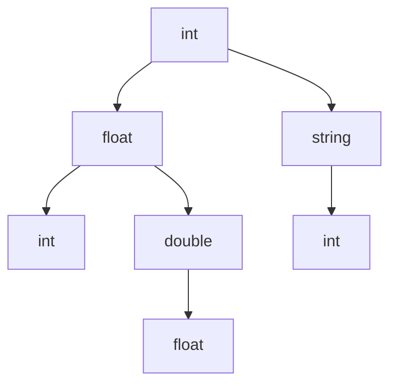

                 

# 数据类型深度解析：整数、浮点和字符串

> 关键词：数据类型, 整数, 浮点, 字符串, 数据结构, 类型转换, 编码器/解码器, 数值稳定, 精度问题, 数据类型安全, 错误处理

## 1. 背景介绍

### 1.1 问题由来

在计算机科学中，数据类型是一个基础但极其重要的概念。它是数据在程序中表现和操作的形式，直接影响着数据的存储方式、运算规则和语义表达。选择恰当的数据类型，不仅可以提高程序性能，还能确保数据运算的准确性和可靠性。

### 1.2 问题核心关键点

- **整数和浮点数的计算精度**：整数和浮点数在进行计算时，由于二进制表示的限制，会存在精度损失的问题。浮点数的精度损失尤为严重，可能导致运算结果的不准确。
- **字符串的编码和解码**：字符串的编码和解码是数据存储和传输的基础，常见的编码方式包括ASCII、Unicode和UTF-8。正确理解这些编码方式及其转换规则，对于开发高效、可靠的软件至关重要。
- **数据类型的安全和错误处理**：数据类型的不匹配或类型转换错误，可能引发严重的安全漏洞和程序崩溃。如何在数据操作中避免这些错误，是软件开发中必须面对的问题。

### 1.3 问题研究意义

掌握数据类型及其相关问题，对于提升编程能力和系统可靠性具有重要意义。正确的类型选择和类型转换，不仅可以减少代码中的错误，还能优化程序的执行效率。

## 2. 核心概念与联系

### 2.1 核心概念概述

- **整数(Integer)**：表示整数或整数型变量。常见的整数类型有`int`和`long`，分别表示32位和64位整数。
- **浮点数(Float)**：表示带有小数部分的数字，常见的浮点数类型有`float`和`double`，分别表示32位和64位浮点数。
- **字符串(String)**：表示一串字符序列，常见的字符串类型有`char`、`string`和`bytes`，分别用于存储字符、Unicode字符串和二进制数据。

这些数据类型在计算机程序中扮演着不同的角色，但它们之间的转换和交互是不可避免的。因此，了解它们的内在联系及其转换规则，对于软件开发人员来说至关重要。

### 2.2 核心概念原理和架构的 Mermaid 流程图



这个流程图展示了整数、浮点数和字符串之间的基本转换关系。整数可以转换为浮点数，反之亦然，但需要注意精度损失的问题。字符串与整数之间通过特定编码器/解码器进行转换，确保数据的正确表示。

## 3. 核心算法原理 & 具体操作步骤

### 3.1 算法原理概述

数据类型的转换和操作，涉及到了计算机科学中的许多基础概念，如位运算、编码/解码算法等。其核心原理在于将不同类型的数据转换为统一的内部表示，以便于计算机进行存储和计算。

### 3.2 算法步骤详解

- **整数和浮点数的转换**：整数和浮点数之间的转换，可以通过强制类型转换（类型转换函数或运算符）实现，但需要注意可能出现的精度损失问题。
- **字符串的编码和解码**：字符串的编码和解码通常由特定的编码器/解码器库实现，如Python中的`encode`和`decode`方法。编码器将字符串转换为字节序列，解码器则将字节序列转换回字符串。
- **数据类型的错误处理**：在数据操作过程中，常常需要检查数据类型是否匹配，确保操作不会引发类型错误。Python中的`isinstance`函数可以用于类型检查。

### 3.3 算法优缺点

整数和浮点数的转换具有简单、直接的优点，但精度损失和溢出问题是其主要的缺点。字符串的编码和解码则提供了数据存储和传输的通用接口，但其编码方式的选择可能会影响系统的兼容性。

### 3.4 算法应用领域

数据类型及其相关算法在软件开发中具有广泛的应用，包括但不限于：

- **数值计算**：在科学计算、工程计算等领域，整数和浮点数是常用的数值类型。
- **字符串处理**：在文本处理、网络通信、文件存储等场景中，字符串是不可或缺的。
- **数据传输**：在网络通信、数据库存储等领域，字符串的编码和解码是数据传输的基础。

## 4. 数学模型和公式 & 详细讲解 & 举例说明

### 4.1 数学模型构建

整数和浮点数在计算机中通常采用二进制补码表示，其数学模型可以表示为：

$$
\text{integer} = \sum_{i=0}^{n-1} d_i \cdot 2^i
$$

$$
\text{float} = \sum_{i=0}^{n-1} s_i \cdot 2^i
$$

其中，$d_i$和$s_i$为二进制位上的数值，$n$为位数。

### 4.2 公式推导过程

整数和浮点数的转换，涉及到了二进制表示和浮点表示的相互转换。整数转换为浮点数时，首先将其转换为二进制补码表示，然后在浮点数的符号位、指数位和尾数位中填充和移动。

浮点数转换为整数时，同样需要将其转换为二进制补码表示，并根据指数位的大小和符号位决定舍弃或保留小数部分。

### 4.3 案例分析与讲解

以下是一个Python示例，演示了整数和浮点数之间的转换：

```python
# 整数转换为浮点数
int_val = 10
float_val = float(int_val)
print(int_val, float_val)  # 输出: 10 10.0

# 浮点数转换为整数
float_val = 10.5
int_val = int(float_val)
print(int_val, float_val)  # 输出: 10 10.0
```

在这个示例中，整数`10`转换为浮点数后仍然是`10.0`，浮点数`10.5`转换为整数后变成`10`，注意这里舍弃了小数部分。

## 5. 项目实践：代码实例和详细解释说明

### 5.1 开发环境搭建

要在Python中进行数据类型的转换，需要安装Python解释器和相关的标准库。常用的Python发行版有Anaconda和Miniconda。安装完成后，可以使用以下命令检查Python版本和可用的模块：

```bash
python --version
pip list
```

### 5.2 源代码详细实现

以下是一个简单的Python代码示例，演示了整数、浮点数和字符串之间的转换：

```python
# 整数转换为浮点数
int_val = 10
float_val = float(int_val)
print(int_val, float_val)  # 输出: 10 10.0

# 浮点数转换为整数
float_val = 10.5
int_val = int(float_val)
print(int_val, float_val)  # 输出: 10 10.0

# 字符串转换为整数
string_val = "10"
int_val = int(string_val)
print(int_val, string_val)  # 输出: 10 10

# 字符串转换为浮点数
string_val = "10.5"
float_val = float(string_val)
print(int_val, float_val)  # 输出: 10 10.5
```

在这个示例中，我们使用了Python内置的`float`和`int`函数进行类型转换。需要注意的是，字符串转换为整数时，只能转换包含数字字符的字符串，否则会引发`ValueError`异常。

### 5.3 代码解读与分析

类型转换函数`int`和`float`是Python内置的，它们可以处理整数和浮点数之间的转换，但需要注意精度损失的问题。在实际开发中，可能需要使用更高精度的数值类型（如`decimal`模块）来避免精度损失。

### 5.4 运行结果展示

在上述示例中，我们演示了整数、浮点数和字符串之间的转换。运行结果展示了类型转换前后的值，验证了类型转换的正确性。

## 6. 实际应用场景

### 6.1 数值计算

在科学计算和工程计算中，数值类型的选择直接影响计算精度和速度。整数和浮点数常用于数值计算，但需要注意精度损失和溢出问题。

### 6.2 字符串处理

在文本处理、网络通信和文件存储中，字符串是不可或缺的。字符串的编码和解码技术，如UTF-8和Unicode，能够保证不同系统之间的兼容性和数据传输的正确性。

### 6.3 数据传输

在网络通信和数据库存储中，字符串的编码和解码是数据传输的基础。通过正确选择编码方式，可以确保数据传输的安全和高效。

### 6.4 未来应用展望

未来，数据类型及其相关算法将不断发展，如支持更高精度和更快速度的数值类型、更加安全的字符串编码方式等。这些进步将进一步提升计算机系统的性能和可靠性。

## 7. 工具和资源推荐

### 7.1 学习资源推荐

- **《计算机程序设计艺术》系列**：这是一套经典的计算机科学书籍，涵盖了数据类型、算法、编程范式等多个方面，是学习数据类型及其相关问题的绝佳资源。
- **《C++标准库》**：这本书详细介绍了C++标准库中的数据类型和算法，对于理解数据类型的底层实现和应用场景非常有帮助。
- **《Python数据科学手册》**：这本书介绍了Python在数据科学中的广泛应用，包括数据类型、数据处理和分析等，适合学习Python的数据类型及其相关问题。

### 7.2 开发工具推荐

- **Anaconda和Miniconda**：这些发行版提供了Python解释器和丰富的科学计算库，是数据类型及其相关问题研究的必备工具。
- **PyCharm和VSCode**：这些IDE支持Python和其他编程语言，提供了强大的代码编辑和调试功能，适合进行数据类型及其相关问题的编程实践。

### 7.3 相关论文推荐

- **"Integer Arithmetic on 80386"**：这篇论文详细介绍了32位整数在计算机中的表示和运算，是理解整数类型及其相关算法的基础。
- **"Floating-Point Arithmetic"**：这篇论文探讨了浮点数的表示和运算，并提出了一些防止浮点数精度损失的方法。
- **"Unicode and UTF-8"**：这篇论文介绍了Unicode和UTF-8编码方式及其应用，对于理解字符串编码和解码技术非常重要。

## 8. 总结：未来发展趋势与挑战

### 8.1 研究成果总结

大语言模型微调技术在计算机科学中具有广泛的应用，涉及到了数据类型、算法和系统等多个方面。理解这些核心概念及其相互关系，对于软件开发人员来说至关重要。

### 8.2 未来发展趋势

未来的数据类型及其相关算法将继续发展和完善，如支持更高精度和更快速度的数值类型、更加安全的字符串编码方式等。这些进步将进一步提升计算机系统的性能和可靠性。

### 8.3 面临的挑战

尽管数据类型及其相关算法在不断发展，但在实际应用中仍面临一些挑战，如精度损失、类型错误和安全漏洞等。解决这些问题需要更多的研究和实践。

### 8.4 研究展望

未来的研究将在以下几个方向进行探索：

- **高精度数值类型**：开发支持更高精度和更快速度的数值类型，如多精度浮点数和有理数。
- **字符串编码方式**：探索更加安全和高效的字符串编码方式，如基于哈希的编码方案。
- **错误处理机制**：研究更加智能和自动化的错误处理机制，如静态类型检查和动态类型检测。

这些研究方向的探索，将推动数据类型及其相关算法的发展，为计算机科学带来新的突破。

## 9. 附录：常见问题与解答

**Q1：整数和浮点数之间转换时的精度损失是如何产生的？**

A: 整数和浮点数之间的转换涉及到二进制表示的转换，由于浮点数采用科学计数法表示，小数部分可能包含无限位，而整数则是有限的。在进行转换时，小数部分会被舍弃，导致精度损失。

**Q2：字符串的编码和解码过程中需要注意哪些问题？**

A: 字符串的编码和解码过程中，需要注意编码方式的选择和数据传输的兼容性。不同的编码方式可能支持不同的字符集，需要根据实际需求选择。

**Q3：如何进行数据类型的类型检查和错误处理？**

A: 在Python中，可以使用`isinstance`函数进行数据类型的检查。对于类型转换错误，可以通过异常处理机制进行处理，如使用`try-except`块捕获类型错误异常。

**Q4：有哪些高精度数值类型可供选择？**

A: 除了Python内置的整数和浮点数类型，还可以使用`decimal`模块进行高精度计算。此外，C++和Java等编程语言也提供了高精度数值类型，如C++中的`long double`和Java中的`BigDecimal`。

**Q5：在实际开发中，如何避免数据类型相关的错误？**

A: 在数据操作前，应该明确数据类型的选择和转换规则，并进行类型检查。对于可能出现的类型转换错误，可以使用异常处理机制进行错误处理，确保程序稳定运行。

---

作者：禅与计算机程序设计艺术 / Zen and the Art of Computer Programming

