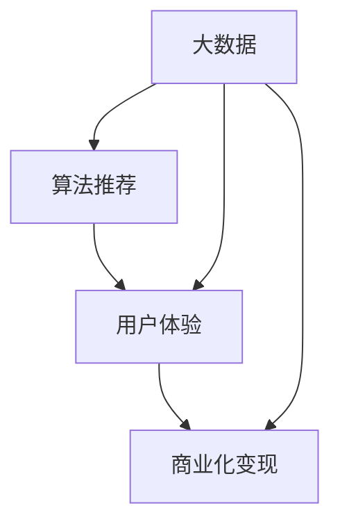

                 

# 新媒体创业：内容产业的未来之星

> 关键词：新媒体，内容产业，创业，数据分析，用户体验，算法推荐，数据驱动

## 1. 背景介绍

### 1.1 问题由来

在新媒体时代，内容产业正处于飞速发展阶段。随着互联网技术的进步和移动设备的普及，人们获取信息的方式越来越多样化，视频、音频、图片、文字等多媒体形式的内容需求日益增长。新媒体的崛起不仅改变了人们的生活习惯，也催生了新的商业模式和创业机会。

内容产业的未来之星，不仅是传统媒体，更是那些能够在海量信息中挖掘价值、提供个性化推荐、优化用户体验、实现商业化的新媒体创业者。这些创业者通过数据驱动的策略，运用先进的算法和工具，构建了集信息、娱乐、商业于一体的全新内容生态。

### 1.2 问题核心关键点

新媒体创业的核心关键点在于如何通过数据分析和算法推荐，提供个性化的内容推荐，提升用户体验，实现商业化变现。具体而言：

1. **数据分析**：收集、处理和分析用户行为数据，挖掘用户兴趣和需求，优化内容推荐算法。
2. **个性化推荐**：根据用户画像和历史行为，实时动态调整推荐内容，提升用户的满意度和粘性。
3. **用户体验优化**：通过界面设计、交互流程优化、加载速度提升等手段，增强用户的沉浸感和舒适度。
4. **商业化变现**：探索多元化的盈利模式，如广告、付费订阅、电商、知识付费等，实现业务的持续增长。

本文将深入探讨新媒体创业中的核心算法和技术，帮助创业者在信息爆炸时代脱颖而出。

## 2. 核心概念与联系

### 2.1 核心概念概述

在探讨新媒体创业的核心算法和技术前，首先需要明确几个关键概念：

- **大数据**：指收集到的海量数据，通常用于分析用户行为和兴趣。
- **算法推荐**：通过机器学习算法，对用户进行个性化推荐，提升用户体验和满意度。
- **用户体验(UX)**：涉及用户界面的直观性、易用性、美观性等方面，是吸引和留住用户的关键。
- **商业化变现**：将用户流量转化为实际收益的过程，包括广告收入、付费会员、电商交易等。

这些概念之间的联系可以通过以下Mermaid流程图来展示：



这个流程图展示了大数据、算法推荐、用户体验和商业化变现之间的逻辑关系：

1. 大数据是算法推荐的基础，通过数据分析算法，能够准确推荐用户感兴趣的内容。
2. 用户体验是用户留存的关键，好的用户体验能够提高用户粘性和满意度。
3. 商业化变现是创业的最终目标，通过多种方式将用户流量转化为收益。
4. 数据和算法通过用户行为的反馈不断优化，提升商业化变现的效果。

## 3. 核心算法原理 & 具体操作步骤
### 3.1 算法原理概述

新媒体创业的核心算法原理主要是基于机器学习和大数据处理的技术，通过分析和预测用户行为，实现个性化的内容推荐。核心算法包括协同过滤、基于内容的推荐、深度学习推荐系统等。

协同过滤算法主要通过分析用户行为数据，找到相似用户群体的兴趣偏好，从而推荐用户可能感兴趣的内容。基于内容的推荐则基于内容的相似性，通过分析内容特征，为用户推荐类似的内容。深度学习推荐系统则通过构建神经网络模型，学习用户与内容之间的复杂非线性关系，实现更精准的推荐。

### 3.2 算法步骤详解

新媒体创业中的算法推荐系统主要包括以下几个关键步骤：

**Step 1: 数据收集与预处理**
- 收集用户行为数据，如浏览记录、点击行为、搜索关键词、评论等。
- 对数据进行清洗、去重、缺失值处理等预处理操作，确保数据质量。
- 对数据进行特征提取，转化为算法模型可处理的格式。

**Step 2: 用户画像建立**
- 通过K-Means聚类、PCA降维等技术，对用户行为数据进行特征提取和建模，建立用户画像。
- 根据用户画像，构建用户兴趣模型，如用户兴趣图谱、用户兴趣标签等。

**Step 3: 内容特征提取**
- 对内容进行特征提取，如提取关键词、元数据、情感标签等，构建内容特征向量。
- 使用TF-IDF、Word2Vec、Doc2Vec等技术，对内容特征进行向量化处理。

**Step 4: 算法模型训练**
- 选择合适的算法模型，如协同过滤、基于内容的推荐、深度学习推荐系统等。
- 对模型进行训练，调整模型参数，优化推荐效果。
- 使用交叉验证、A/B测试等方法，评估模型性能，避免过拟合。

**Step 5: 推荐系统部署与优化**
- 将训练好的模型部署到实际应用中，集成到内容推荐系统中。
- 实时收集用户反馈，调整推荐策略，优化用户体验。
- 使用缓存、负载均衡、分布式计算等技术，提升系统的稳定性和响应速度。

### 3.3 算法优缺点

新媒体创业中的算法推荐系统具有以下优点：
1. 高度个性化：通过分析用户行为数据，能够精准推荐用户感兴趣的内容，提升用户满意度。
2. 高效的资源利用：算法推荐系统能够根据用户行为数据动态调整推荐内容，提升内容的使用效率。
3. 商业化变现能力强：通过优化用户体验和提高内容吸引力，能够促进商业化变现。

同时，该系统也存在一些局限性：
1. 数据依赖性强：推荐系统的性能很大程度上依赖于数据的质量和多样性。
2. 冷启动问题：新用户或新内容难以快速获得推荐，需要进行特殊处理。
3. 数据隐私问题：收集和处理用户行为数据时，需要严格遵守数据隐私保护法规。
4. 算法复杂度高：深度学习等算法模型的训练和部署需要较高的计算资源和时间成本。

尽管存在这些局限性，但就目前而言，基于算法推荐的新媒体创业方法仍然是最主流范式。未来相关研究的重点在于如何进一步降低数据依赖，提高推荐系统的冷启动能力和泛化能力，同时兼顾数据隐私和算法复杂度。

### 3.4 算法应用领域

基于算法推荐的新媒体创业方法，已经广泛应用于多个领域，如新闻媒体、视频网站、电商平台、社交网络等。以下是几个典型的应用场景：

- **新闻媒体**：通过算法推荐系统，为用户推荐相关新闻、热点事件、深度报道等，提升用户粘性和阅读量。
- **视频网站**：根据用户观看历史和兴趣偏好，推荐用户感兴趣的视频内容，提升观看时长和满意度。
- **电商平台**：通过算法推荐系统，为用户推荐相关商品，提升销售转化率和客户满意度。
- **社交网络**：推荐用户感兴趣的朋友、群组、内容等，促进用户活跃度和社交关系构建。
- **在线教育**：推荐用户感兴趣的课程、讲师、学习资料等，提升学习效果和平台使用率。

除了上述这些经典应用外，算法推荐技术还正在被创新性地应用到更多场景中，如智能客服、智慧医疗、虚拟现实等，为各行各业带来了新的发展机遇。

## 4. 数学模型和公式 & 详细讲解 & 举例说明

### 4.1 数学模型构建

为了更好地理解新媒体创业中的算法推荐系统，本节将介绍几个常用的数学模型：

- **协同过滤模型**：通过用户行为数据构建用户画像，推荐用户可能感兴趣的内容。常见方法包括基于用户的协同过滤、基于物品的协同过滤等。
- **基于内容的推荐模型**：根据内容特征，为用户推荐相关内容。常见方法包括余弦相似度、Jaccard相似度等。
- **深度学习推荐模型**：通过神经网络模型，学习用户与内容之间的复杂非线性关系。常见方法包括基于用户-物品交互矩阵的深度推荐模型、序列推荐模型等。

### 4.2 公式推导过程

以基于用户-物品交互矩阵的深度推荐模型为例，推导其核心公式。

设用户集合为 $U=\{u_1,u_2,...,u_m\}$，物品集合为 $V=\{v_1,v_2,...,v_n\}$。用户 $u_i$ 对物品 $v_j$ 的评分矩阵为 $R\in \mathbb{R}^{m\times n}$。设用户 $u_i$ 的隐藏特征向量为 $h_i\in \mathbb{R}^k$，物品 $v_j$ 的隐藏特征向量为 $g_j\in \mathbb{R}^k$。模型的目标是最小化预测评分与实际评分之间的均方误差：

$$
\min_{h,g}\frac{1}{N}\sum_{(i,j)\in R}\|r_{ij}-\langle h_i,g_j\rangle\|^2
$$

其中 $N$ 为用户与物品的交互次数，$\langle h_i,g_j\rangle$ 表示用户和物品之间的相似度。通过最小化上述损失函数，可以训练得到用户和物品的隐藏特征向量。

### 4.3 案例分析与讲解

假设有一家电商平台，拥有用户和商品的评分数据。我们可以构建基于用户-物品交互矩阵的深度推荐模型，推荐用户可能感兴趣的商品。具体步骤如下：

1. 收集用户和商品的评分数据，构建用户与物品的评分矩阵 $R$。
2. 对用户和物品的评分数据进行特征提取，如使用词袋模型、TF-IDF等技术，转化为向量化形式。
3. 使用深度学习框架（如TensorFlow、PyTorch）构建深度推荐模型，优化损失函数。
4. 将训练好的模型集成到推荐系统中，实时推荐用户感兴趣的商品。
5. 通过A/B测试等方法，评估模型的推荐效果，不断优化模型参数。

通过这一案例，可以看出，基于深度学习的推荐模型能够通过学习用户和物品的隐含关系，实现更加精准的推荐。

## 5. 项目实践：代码实例和详细解释说明
### 5.1 开发环境搭建

在进行新媒体创业中的算法推荐系统开发前，我们需要准备好开发环境。以下是使用Python进行TensorFlow开发的环境配置流程：

1. 安装Anaconda：从官网下载并安装Anaconda，用于创建独立的Python环境。
2. 创建并激活虚拟环境：
```bash
conda create -n tf-env python=3.8 
conda activate tf-env
```

3. 安装TensorFlow：根据CUDA版本，从官网获取对应的安装命令。例如：
```bash
conda install tensorflow-gpu -c pytorch -c conda-forge
```

4. 安装各类工具包：
```bash
pip install numpy pandas scikit-learn matplotlib tqdm jupyter notebook ipython
```

完成上述步骤后，即可在`tf-env`环境中开始项目开发。

### 5.2 源代码详细实现

这里以一个简单的协同过滤推荐系统为例，展示使用TensorFlow进行开发的代码实现。

```python
import tensorflow as tf
import numpy as np
import pandas as pd

# 构建用户-物品评分矩阵
ratings = pd.read_csv('ratings.csv')
user_ids = ratings['user_id'].values
item_ids = ratings['item_id'].values
scores = ratings['score'].values
R = np.zeros((len(user_ids), len(item_ids)))
for i, row in ratings.iterrows():
    R[int(row['user_id'])-1, int(row['item_id'])-1] = row['score']

# 定义协同过滤模型
user_factors = tf.Variable(tf.random.normal([len(user_ids), 10]))
item_factors = tf.Variable(tf.random.normal([len(item_ids), 10]))
scores_pred = tf.matmul(tf.matmul(user_factors, R), tf.transpose(item_factors))

# 定义损失函数
loss = tf.reduce_mean(tf.square(scores_pred - scores))

# 定义优化器
optimizer = tf.optimizers.Adam(learning_rate=0.01)

# 定义训练函数
def train_step():
    with tf.GradientTape() as tape:
        predicted_scores = tf.matmul(tf.matmul(user_factors, R), tf.transpose(item_factors))
        loss = tf.reduce_mean(tf.square(predicted_scores - scores))
    grads = tape.gradient(loss, [user_factors, item_factors])
    optimizer.apply_gradients(zip(grads, [user_factors, item_factors]))

# 训练模型
for i in range(100):
    train_step()

# 使用训练好的模型进行推荐
user_id = 1
item_id = 3
user_factors_value = user_factors.numpy()[user_id-1]
item_factors_value = item_factors.numpy()[item_id-1]
prediction = np.dot(user_factors_value, R.T.dot(item_factors_value))
print(prediction)
```

### 5.3 代码解读与分析

让我们再详细解读一下关键代码的实现细节：

**构建用户-物品评分矩阵**：
- 从CSV文件中读取用户评分数据，构建用户与物品的评分矩阵 $R$。

**定义协同过滤模型**：
- 使用TensorFlow定义用户和物品的隐藏特征向量，初始化为随机向量。
- 定义预测评分函数，通过矩阵乘法计算用户和物品的相似度。

**定义损失函数和优化器**：
- 使用均方误差作为损失函数，优化器采用Adam。
- 定义训练函数，通过反向传播计算梯度，并使用Adam优化器更新参数。

**训练模型和推荐预测**：
- 通过训练函数进行100轮训练，调整用户和物品的特征向量。
- 使用训练好的模型对特定用户和物品进行评分预测。

通过这一代码实例，可以看出，使用TensorFlow开发协同过滤推荐系统相对简洁高效。开发者可以将更多精力放在数据处理、模型改进等高层逻辑上，而不必过多关注底层的实现细节。

当然，工业级的系统实现还需考虑更多因素，如模型的保存和部署、超参数的自动搜索、更灵活的任务适配层等。但核心的算法推荐范式基本与此类似。

## 6. 实际应用场景
### 6.1 智能推荐系统

基于算法推荐的新媒体创业方法，已经广泛应用于智能推荐系统中。传统推荐系统往往只能根据静态的用户历史行为数据进行推荐，难以满足用户的多样化和动态化需求。而基于算法推荐的新媒体创业方法，能够实时分析用户行为数据，动态调整推荐策略，提供更加个性化的推荐内容。

在技术实现上，可以收集用户浏览、点击、搜索、购买等行为数据，构建用户画像和内容画像，在此基础上训练推荐模型。训练好的模型能够实时分析用户行为数据，动态调整推荐策略，为用户推荐最感兴趣的内容。通过智能推荐系统，不仅能够提升用户的满意度，还能够促进内容的消费和使用，实现商业化变现。

### 6.2 社交网络

基于算法推荐的新媒体创业方法，在社交网络中的应用也非常广泛。社交网络平台能够通过分析用户的行为数据，推荐用户可能感兴趣的朋友、群组、内容等，促进用户活跃度和社交关系构建。

具体而言，社交网络平台可以收集用户的互动数据、好友关系、发布内容等，构建用户画像和内容画像。通过训练推荐模型，能够实时分析用户行为数据，动态调整推荐策略，推荐用户感兴趣的内容。通过社交网络平台，不仅能够提升用户活跃度和满意度，还能够实现广告和商业化变现。

### 6.3 智慧医疗

基于算法推荐的新媒体创业方法，在智慧医疗领域也有广泛应用。智慧医疗平台能够通过分析用户的行为数据和历史健康数据，推荐用户可能感兴趣的健康知识和医疗服务，提升用户的健康水平和医疗服务体验。

具体而言，智慧医疗平台可以收集用户的健康数据、医疗记录、互动数据等，构建用户画像和内容画像。通过训练推荐模型，能够实时分析用户行为数据，动态调整推荐策略，推荐用户感兴趣的健康知识和医疗服务。通过智慧医疗平台，不仅能够提升用户的健康水平和医疗服务体验，还能够实现健康管理、医疗咨询等商业化变现。

### 6.4 未来应用展望

随着算法推荐技术的不断发展，基于算法推荐的新媒体创业方法将广泛应用于更多领域，为各行各业带来变革性影响。

在智慧城市治理中，智能推荐系统能够推荐城市事件、公共交通信息、公共服务等内容，提升城市管理的自动化和智能化水平，构建更安全、高效的未来城市。

在金融领域，推荐系统能够推荐金融产品、投资策略、市场信息等内容，提升用户的投资体验和满意度，实现金融服务的商业化变现。

在教育领域，推荐系统能够推荐课程、讲师、学习资料等内容，提升学习效果和平台使用率，实现教育服务的商业化变现。

此外，在旅游、零售、媒体、娱乐等众多领域，基于算法推荐的新媒体创业方法也将不断涌现，为各行各业带来新的发展机遇。相信随着技术的日益成熟，算法推荐技术将在更广阔的应用领域大放异彩。

## 7. 工具和资源推荐
### 7.1 学习资源推荐

为了帮助开发者系统掌握算法推荐技术的理论基础和实践技巧，这里推荐一些优质的学习资源：

1. 《深度学习推荐系统》书籍：李航教授所著，全面介绍了推荐系统的发展历程、算法原理和实现方法。
2. 《TensorFlow推荐系统实战》书籍：详细介绍了TensorFlow推荐系统的构建和优化技巧。
3. CS345N《信息检索与推荐系统》课程：斯坦福大学开设的推荐系统明星课程，涵盖推荐系统的经典算法和实践案例。
4. Kaggle推荐系统竞赛：通过参加Kaggle竞赛，积累推荐系统开发和调优的实战经验。
5. Weights & Biases：模型训练的实验跟踪工具，可以记录和可视化模型训练过程中的各项指标，方便对比和调优。

通过对这些资源的学习实践，相信你一定能够快速掌握算法推荐技术的精髓，并用于解决实际的推荐问题。
###  7.2 开发工具推荐

高效的开发离不开优秀的工具支持。以下是几款用于推荐系统开发的常用工具：

1. TensorFlow：基于Python的开源深度学习框架，灵活动态的计算图，适合快速迭代研究。
2. PyTorch：基于Python的开源深度学习框架，灵活性高，支持自动微分，适合深度学习推荐系统的开发。
3. Scikit-learn：Python科学计算库，包含多种经典机器学习算法和数据处理工具，适合算法推荐系统的数据预处理和模型训练。
4. Apache Spark：大数据处理和机器学习框架，支持大规模数据处理和分布式计算，适合大规模推荐系统的开发。
5. Elasticsearch：搜索引擎，适合构建用户画像和内容画像，支持实时搜索和推荐。

合理利用这些工具，可以显著提升算法推荐系统的开发效率，加快创新迭代的步伐。

### 7.3 相关论文推荐

算法推荐技术的发展源于学界的持续研究。以下是几篇奠基性的相关论文，推荐阅读：

1. Beyond Matrix Factorization: A Canonical Tensor Factorization Framework for Recommenders：提出TensorDecomp模型，解决了稀疏矩阵因子的求解问题，提升了推荐系统的性能。
2. Neural Collaborative Filtering：提出基于神经网络的协同过滤模型，提升了推荐系统的泛化能力和表示能力。
3. Deep Interest Network：提出深度兴趣网络模型，解决了用户兴趣表达的连续性问题，提升了推荐系统的个性化能力。
4. Heterogeneous Knowledge-aware Recommender Systems：提出知识图谱增强的推荐系统，提升了推荐系统的鲁棒性和泛化能力。
5. Decoupled Training for Scalable Deep Recommendation Models：提出解耦训练方法，提升了推荐系统的可扩展性和训练效率。

这些论文代表了大数据推荐系统的发展脉络。通过学习这些前沿成果，可以帮助研究者把握学科前进方向，激发更多的创新灵感。

## 8. 总结：未来发展趋势与挑战

### 8.1 总结

本文对基于算法推荐的新媒体创业方法进行了全面系统的介绍。首先阐述了新媒体创业的核心关键点在于如何通过数据分析和算法推荐，提供个性化的内容推荐，提升用户体验，实现商业化变现。接着从原理到实践，详细讲解了推荐算法的核心步骤和关键技术，给出了推荐系统开发的完整代码实例。同时，本文还广泛探讨了推荐算法在智能推荐系统、社交网络、智慧医疗等多个行业领域的应用前景，展示了算法推荐技术的巨大潜力。此外，本文精选了推荐技术的各类学习资源，力求为读者提供全方位的技术指引。

通过本文的系统梳理，可以看到，基于算法推荐的新媒体创业方法正在成为推荐系统应用的重要范式，极大地拓展了算法推荐的应用边界，催生了更多的落地场景。受益于大数据、深度学习等技术的持续演进，推荐系统在推荐精度、实时性、可扩展性等方面取得了显著提升，有望进一步提升新媒体创业的成功率。

### 8.2 未来发展趋势

展望未来，推荐系统的发展趋势包括：

1. 个性化推荐：通过更精确的用户画像和内容画像，实现更加个性化的推荐，提升用户满意度和忠诚度。
2. 实时推荐：通过实时分析用户行为数据，动态调整推荐策略，实现更加即时和精准的推荐。
3. 跨模态推荐：融合多模态数据，如文本、图像、音频等，提升推荐系统的泛化能力和鲁棒性。
4. 可解释性推荐：通过可解释性算法和模型，提升推荐系统的透明性和可解释性，增强用户的信任和满意度。
5. 混合推荐：结合多种推荐算法，如协同过滤、基于内容的推荐、深度学习等，提升推荐系统的性能和鲁棒性。
6. 强化学习推荐：通过强化学习算法，优化推荐策略，提升推荐系统的智能化和自适应能力。

这些趋势凸显了推荐系统的广阔前景。这些方向的探索发展，必将进一步提升推荐系统的性能和应用范围，为新媒体创业带来更多创新和突破。

### 8.3 面临的挑战

尽管推荐系统已经取得了瞩目成就，但在迈向更加智能化、普适化应用的过程中，它仍面临着诸多挑战：

1. 数据质量问题：推荐系统的性能很大程度上依赖于数据的质量和多样性。如何获取高质量、多样化的数据，是一个重要的挑战。
2. 冷启动问题：新用户或新内容难以快速获得推荐，需要进行特殊处理。如何应对冷启动问题，是推荐系统的一个难点。
3. 数据隐私问题：收集和处理用户行为数据时，需要严格遵守数据隐私保护法规。如何在数据隐私和推荐效果之间找到平衡，是一个重要的挑战。
4. 算法复杂度高：深度学习等算法模型的训练和部署需要较高的计算资源和时间成本。如何降低算法复杂度，提高推荐系统的效率，是一个重要的研究方向。
5. 推荐多样性问题：推荐系统容易陷入“过滤泡泡”，即推荐算法过度关注用户的历史行为，忽视了新的和多样化的内容。如何增加推荐多样性，提升用户的探索性，是一个重要的挑战。

这些挑战凸显了推荐系统技术的不成熟，需要更多理论和实践的积累。相信随着学界和产业界的共同努力，这些挑战终将一一被克服，推荐系统必将在更广阔的应用领域大放异彩。

### 8.4 研究展望

面对推荐系统面临的种种挑战，未来的研究需要在以下几个方面寻求新的突破：

1. 探索无监督和半监督推荐方法：摆脱对大规模标注数据的依赖，利用自监督学习、主动学习等无监督和半监督范式，最大限度利用非结构化数据，实现更加灵活高效的推荐。
2. 研究参数高效和计算高效的推荐范式：开发更加参数高效的推荐方法，在固定大部分预训练参数的同时，只更新极少量的任务相关参数。同时优化推荐模型的计算图，减少前向传播和反向传播的资源消耗，实现更加轻量级、实时性的部署。
3. 融合因果和对比学习范式：通过引入因果推断和对比学习思想，增强推荐系统建立稳定因果关系的能力，学习更加普适、鲁棒的用户和内容表示，从而提升推荐系统的泛化性和抗干扰能力。
4. 引入更多先验知识：将符号化的先验知识，如知识图谱、逻辑规则等，与神经网络模型进行巧妙融合，引导推荐过程学习更准确、合理的用户和内容表示。同时加强不同模态数据的整合，实现视觉、语音等多模态信息与文本信息的协同建模。
5. 结合因果分析和博弈论工具：将因果分析方法引入推荐系统，识别出推荐决策的关键特征，增强推荐系统的透明性和可解释性。借助博弈论工具刻画人机交互过程，主动探索并规避推荐系统的脆弱点，提高系统稳定性。
6. 纳入伦理道德约束：在推荐系统训练目标中引入伦理导向的评估指标，过滤和惩罚有害的输出倾向。同时加强人工干预和审核，建立推荐系统的监管机制，确保输出的安全性和伦理合规性。

这些研究方向的探索，必将引领推荐系统技术迈向更高的台阶，为新媒体创业提供更可靠、高效、安全的推荐服务。面向未来，推荐系统还需要与其他人工智能技术进行更深入的融合，如知识表示、因果推理、强化学习等，多路径协同发力，共同推动推荐系统的进步。只有勇于创新、敢于突破，才能不断拓展推荐系统的边界，为新媒体创业带来更多创新和突破。

## 9. 附录：常见问题与解答

**Q1：算法推荐系统是如何提升用户满意度的？**

A: 算法推荐系统通过分析用户的历史行为数据，构建用户画像，挖掘用户的兴趣和需求，动态调整推荐策略，为用户推荐最感兴趣的内容。通过个性化的内容推荐，能够提升用户的满意度，增加用户的粘性和活跃度。

**Q2：推荐系统如何应对冷启动问题？**

A: 推荐系统应对冷启动问题的方法包括：
1. 基于物品的协同过滤：通过分析相似物品的评分数据，为用户推荐相似物品。
2. 基于内容的推荐：通过分析物品的特征向量，为用户推荐相似物品。
3. 混合推荐：结合多种推荐算法，如协同过滤、基于内容的推荐、深度学习等，提高推荐系统的鲁棒性。
4. 主动学习：通过主动收集用户反馈数据，不断优化推荐策略，提升推荐效果。

这些方法可以结合使用，降低冷启动问题的影响，提升推荐系统的初始推荐效果。

**Q3：推荐系统的数据质量如何保障？**

A: 推荐系统的数据质量保障方法包括：
1. 数据清洗：通过数据清洗和去重，去除噪音和错误数据。
2. 数据增强：通过数据增强和扩充，提高数据的完整性和多样性。
3. 数据标注：对关键数据进行标注和校验，确保数据的质量和可靠性。
4. 数据隐私保护：在数据收集和处理过程中，严格遵守数据隐私保护法规，保障用户数据的安全性和隐私性。

通过以上方法，可以提升推荐系统的数据质量，确保推荐效果。

**Q4：推荐系统如何实现实时推荐？**

A: 推荐系统实现实时推荐的方法包括：
1. 实时数据采集：通过实时数据采集技术，实时获取用户行为数据。
2. 实时数据处理：通过实时数据处理技术，快速分析和处理用户行为数据。
3. 实时推荐策略调整：根据实时数据分析结果，动态调整推荐策略，实现实时推荐。

通过以上方法，可以实现推荐系统的实时推荐，提升用户的满意度和平台的用户粘性。

**Q5：推荐系统的可解释性如何实现？**

A: 推荐系统的可解释性实现方法包括：
1. 模型透明化：通过模型透明化技术，将推荐模型转化为可解释的规则和特征，提升推荐系统的透明性和可解释性。
2. 特征可视化：通过特征可视化技术，展示推荐模型的特征权重和重要性，提升推荐系统的可解释性。
3. 用户反馈机制：通过用户反馈机制，收集用户对推荐结果的评价和意见，不断优化推荐模型。

通过以上方法，可以提升推荐系统的可解释性，增强用户对推荐结果的信任和满意度。

---

作者：禅与计算机程序设计艺术 / Zen and the Art of Computer Programming

