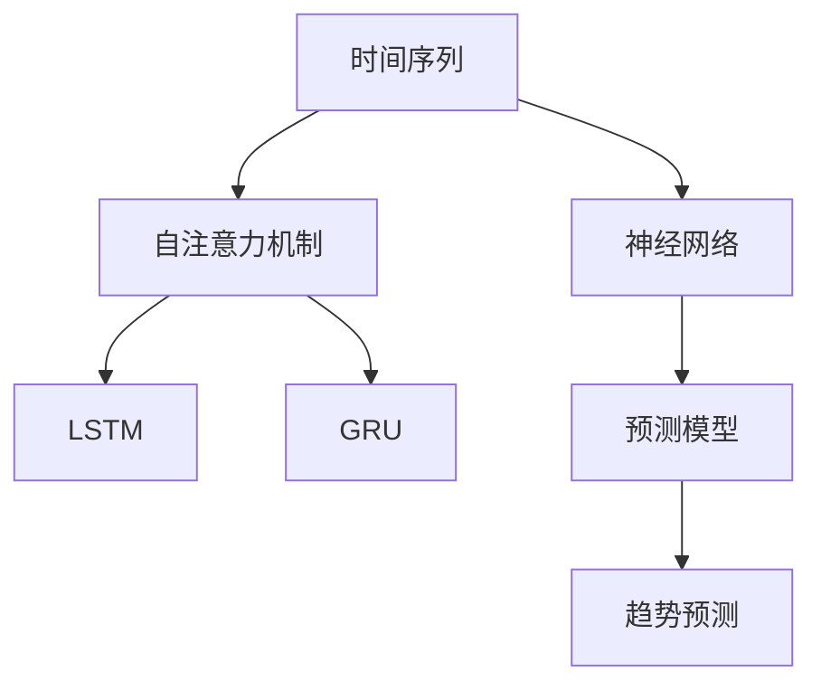

                 

# 时间序列分析在注意力趋势预测中的应用

## 1. 背景介绍

### 1.1 问题由来
在当前数据驱动的时代，时间序列数据在金融、气象、交通、能源等诸多领域的应用中扮演着重要角色。通过对历史时间序列数据的分析，不仅可以发现数据中的模式和趋势，还可以预测未来的变化。传统的时间序列分析方法如ARIMA、VAR等，已经广泛应用于各类场景，但随着数据规模的不断增长和处理需求的多样化，传统的统计模型已经难以满足复杂的预测需求。

近年来，随着深度学习技术的发展，神经网络被引入时间序列分析，取得了显著的进展。特别是基于Transformer的注意力机制，极大地提升了模型对序列数据的处理能力。本论文旨在探讨基于注意力机制的时间序列分析方法，以期在大规模时间序列数据的趋势预测中取得更好的效果。

### 1.2 问题核心关键点
- 时间序列分析：指对按时间顺序排列的数据序列进行建模和分析的方法。
- 注意力机制：一种模拟人类注意力的计算方式，用于加强模型的特征选择和序列建模能力。
- 趋势预测：通过对时间序列数据的趋势分析，预测未来的变化趋势。

本论文将重点探讨基于注意力机制的时间序列分析方法，并详细讲解其算法原理和具体实现。同时，本论文还将分析该方法在实际应用场景中的应用效果，并展望未来趋势。

## 2. 核心概念与联系

### 2.1 核心概念概述

为更好地理解基于注意力机制的时间序列分析方法，本节将介绍几个密切相关的核心概念：

- 时间序列：指按时间顺序排列的数据序列，常用于刻画事物的动态变化。
- 神经网络：一种模拟人脑神经元处理信息的方式，具有强大的拟合能力和泛化能力。
- 自注意力机制(Self-Attention)：一种能够捕获序列中不同位置间依赖关系的机制，用于增强神经网络对序列数据的建模能力。
- 长短期记忆网络(LSTM)：一种针对序列数据设计的循环神经网络，能够有效捕捉序列中的长期依赖关系。
- 门控循环单元(GRU)：一种结构更为简洁的循环神经网络，与LSTM类似，但参数更少，计算效率更高。
- 预测模型：指能够根据已有数据预测未来趋势的模型，常用于金融、气象、交通等领域的时间序列分析。

这些核心概念之间的逻辑关系可以通过以下Mermaid流程图来展示：



这个流程图展示了几类核心概念及其之间的关系：

1. 时间序列通过神经网络进行建模。
2. 神经网络通过自注意力机制来捕捉序列中的依赖关系。
3. LSTM和GRU是常用的序列建模神经网络。
4. 预测模型用于根据已有数据预测未来趋势。

这些概念共同构成了时间序列分析的框架，使得模型能够有效地从历史数据中学习到规律，并应用于趋势预测。

## 3. 核心算法原理 & 具体操作步骤
### 3.1 算法原理概述

基于注意力机制的时间序列分析方法，本质上是一种利用神经网络对时间序列数据进行建模，并应用自注意力机制提取序列特征的方法。其核心思想是：将时间序列数据看作一个序列，通过神经网络模型学习到序列中的规律，并通过自注意力机制捕捉不同位置之间的依赖关系，从而实现对趋势的预测。

形式化地，假设时间序列数据为 $\{x_t\}_{t=1}^T$，其中 $x_t$ 为时间 $t$ 处的观测值。模型的输入为 $x_t$，输出为时间 $t+1$ 处的预测值 $\hat{x}_{t+1}$。通过神经网络模型和自注意力机制，可以建立时间序列的预测模型 $f(x_t)$。

模型训练的优化目标为最小化预测值与真实值的差异，即：

$$
\min_{f(x)} \sum_{t=1}^T \|x_t - f(x_t)\|
$$

其中 $\|.\|$ 为误差度量函数，如均方误差(MSE)。

### 3.2 算法步骤详解

基于注意力机制的时间序列分析方法包括以下几个关键步骤：

**Step 1: 数据预处理**
- 将时间序列数据进行归一化，减少不同时间点的量纲差异。
- 根据时间序列的周期性，划分出训练集和测试集。
- 如果数据存在缺失，采用插值、补全等方法进行填补。

**Step 2: 设计模型架构**
- 选择适合的神经网络架构，如LSTM、GRU、Transformer等。
- 引入自注意力机制，增强模型的序列建模能力。
- 设计预测层，输出时间序列的预测值。

**Step 3: 模型训练**
- 使用训练集数据对模型进行训练，调整模型参数，使得预测值与真实值尽可能接近。
- 应用正则化技术，如L2正则、Dropout等，防止模型过拟合。
- 使用验证集对模型进行评估，调整超参数，选择最优模型。

**Step 4: 模型测试**
- 使用测试集数据对模型进行测试，评估模型的预测性能。
- 应用误差度量函数，如MSE、MAE等，计算模型预测误差。
- 根据误差指标调整模型结构或参数，进一步提升预测精度。

**Step 5: 模型应用**
- 将训练好的模型应用于实际数据，进行趋势预测。
- 根据预测结果进行决策，如金融投资、气象预警等。
- 持续收集新数据，定期重新训练模型，以适应数据分布的变化。

以上是基于注意力机制的时间序列分析方法的通用流程。在实际应用中，还需要针对具体任务进行优化设计，如改进特征提取方式，引入更多的正则化技术，搜索最优的超参数组合等，以进一步提升模型性能。

### 3.3 算法优缺点

基于注意力机制的时间序列分析方法具有以下优点：
1. 强大的序列建模能力。自注意力机制可以捕捉不同位置之间的依赖关系，提升模型对序列数据的建模能力。
2. 泛化能力强。神经网络模型具有较强的泛化能力，可以适应不同类型的序列数据。
3. 适应性强。可以灵活地应用于各种时间序列预测任务，如趋势预测、周期性分析等。

同时，该方法也存在一定的局限性：
1. 计算复杂度高。神经网络模型参数多，计算复杂度高，需要较强的计算资源支持。
2. 对数据质量要求高。模型的性能很大程度上依赖于数据的完整性和质量，需要仔细处理数据缺失和异常值。
3. 模型难以解释。基于神经网络的模型往往缺乏可解释性，难以对其内部决策过程进行分析和调试。

尽管存在这些局限性，但就目前而言，基于注意力机制的时间序列分析方法仍是大规模时间序列数据的趋势预测的主流范式。未来相关研究的重点在于如何进一步降低计算复杂度，提高模型的可解释性和鲁棒性，同时兼顾模型性能和计算效率。

### 3.4 算法应用领域

基于注意力机制的时间序列分析方法在金融、气象、交通、能源等诸多领域得到了广泛的应用，覆盖了几乎所有常见任务，例如：

- 金融市场趋势预测：对股票、期货等金融市场价格走势进行预测，辅助投资决策。
- 气象预报：对天气、气候等气象数据进行趋势预测，保障生产生活安全。
- 交通流量预测：对城市交通流量进行预测，优化交通管理。
- 能源需求预测：对电力、水力等能源需求进行预测，优化能源供应和调度。
- 地震预测：对地震活动进行预测，减轻灾害损失。

除了上述这些经典任务外，时间序列分析方法还被创新性地应用到更多场景中，如环境监测、农业生产、医疗诊断等，为这些领域提供了有力的技术支持。

## 4. 数学模型和公式 & 详细讲解  
### 4.1 数学模型构建

本节将使用数学语言对基于注意力机制的时间序列分析方法进行更加严格的刻画。

记时间序列数据为 $\{x_t\}_{t=1}^T$，其中 $x_t$ 为时间 $t$ 处的观测值。假设神经网络模型的输入为 $x_t$，输出为时间 $t+1$ 处的预测值 $\hat{x}_{t+1}$。

定义模型 $f(x)$ 在时间序列数据 $\{x_t\}_{t=1}^T$ 上的预测误差为 $\varepsilon = \sum_{t=1}^T \|x_t - f(x_t)\|$，其中 $\|.\|$ 为误差度量函数，如均方误差(MSE)。

模型的优化目标是最小化预测误差 $\varepsilon$，即：

$$
\min_{f(x)} \varepsilon
$$

在实践中，我们通常使用基于梯度的优化算法（如SGD、Adam等）来近似求解上述最优化问题。设 $\eta$ 为学习率，$\lambda$ 为正则化系数，则参数的更新公式为：

$$
\theta \leftarrow \theta - \eta \nabla_{\theta}\varepsilon - \eta\lambda\theta
$$

其中 $\nabla_{\theta}\varepsilon$ 为预测误差对模型参数 $\theta$ 的梯度，可通过反向传播算法高效计算。

### 4.2 公式推导过程

以下我们以LSTM模型为例，推导预测误差及其梯度的计算公式。

假设模型 $f(x)$ 在输入 $x_t$ 上的输出为 $\hat{x}_{t+1}=f(x_t)$，定义预测误差为 $\varepsilon_t = x_t - \hat{x}_{t+1}$。根据定义，预测误差可以表示为：

$$
\varepsilon = \sum_{t=1}^T \varepsilon_t
$$

使用LSTM模型进行预测时，模型分为输入层、LSTM层和输出层三部分。其中，输入层和输出层都是全连接层，LSTM层包含多个循环神经元。假设输入层的权重矩阵为 $W_{in}$，LSTM层的权重矩阵为 $W_{lstm}$，输出层的权重矩阵为 $W_{out}$。则模型的预测输出可以表示为：

$$
\hat{x}_{t+1} = \sigma_{out}(W_{out} \cdot \sigma_{lstm}(W_{lstm} \cdot \sigma_{in}(W_{in} \cdot x_t) + b_{lstm} + c_{lstm}))
$$

其中 $\sigma_{in}$、$\sigma_{lstm}$、$\sigma_{out}$ 分别为输入层、LSTM层和输出层的激活函数，$b_{lstm}$ 和 $c_{lstm}$ 分别为LSTM层的偏置向量。

模型的预测误差为：

$$
\varepsilon_t = x_t - \hat{x}_{t+1}
$$

根据链式法则，预测误差对权重矩阵 $W_{in}$、$W_{lstm}$、$W_{out}$ 的梯度分别为：

$$
\frac{\partial \varepsilon}{\partial W_{in}} = \sum_{t=1}^T \frac{\partial \varepsilon_t}{\partial W_{in}} = \sum_{t=1}^T \frac{\partial x_t}{\partial W_{in}} - \frac{\partial \hat{x}_{t+1}}{\partial W_{in}}
$$

其中 $\frac{\partial x_t}{\partial W_{in}}$ 为输入层的梯度，$\frac{\partial \hat{x}_{t+1}}{\partial W_{in}}$ 为LSTM层的梯度。

同理，可以得到 $W_{lstm}$ 和 $W_{out}$ 的梯度。

在得到预测误差的梯度后，即可带入参数更新公式，完成模型的迭代优化。重复上述过程直至收敛，最终得到适应数据分布的预测模型。

## 5. 项目实践：代码实例和详细解释说明
### 5.1 开发环境搭建

在进行时间序列分析实践前，我们需要准备好开发环境。以下是使用Python进行PyTorch开发的环境配置流程：

1. 安装Anaconda：从官网下载并安装Anaconda，用于创建独立的Python环境。

2. 创建并激活虚拟环境：
```bash
conda create -n ts-env python=3.8 
conda activate ts-env
```

3. 安装PyTorch：根据CUDA版本，从官网获取对应的安装命令。例如：
```bash
conda install pytorch torchvision torchaudio cudatoolkit=11.1 -c pytorch -c conda-forge
```

4. 安装PyTorch Lightning：用于简化模型训练和验证的库，方便快速开发和部署模型。
```bash
pip install pytorch-lightning
```

5. 安装各类工具包：
```bash
pip install numpy pandas scikit-learn matplotlib tqdm jupyter notebook ipython
```

完成上述步骤后，即可在`ts-env`环境中开始时间序列分析实践。

### 5.2 源代码详细实现

下面我们以LSTM模型为例，给出使用PyTorch Lightning进行时间序列分析的PyTorch代码实现。

首先，定义时间序列数据集类：

```python
from torch.utils.data import Dataset

class TimeSeriesDataset(Dataset):
    def __init__(self, x, y=None):
        self.x = x
        self.y = y
        
    def __len__(self):
        return len(self.x)
    
    def __getitem__(self, idx):
        return self.x[idx], self.y[idx]
```

然后，定义LSTM模型：

```python
import torch.nn as nn
import torch.nn.functional as F

class LSTMModel(nn.Module):
    def __init__(self, input_dim, hidden_dim, output_dim):
        super(LSTMModel, self).__init__()
        self.hidden_dim = hidden_dim
        self.lstm = nn.LSTM(input_dim, hidden_dim, 1, batch_first=True)
        self.fc = nn.Linear(hidden_dim, output_dim)
    
    def forward(self, x):
        batch_size = x.size(0)
        hidden = self.init_hidden(batch_size)
        lstm_out, hidden = self.lstm(x, hidden)
        lstm_out = lstm_out[-1]
        prediction = self.fc(lstm_out)
        return prediction
    
    def init_hidden(self, batch_size):
        return (torch.zeros(1, batch_size, self.hidden_dim), torch.zeros(1, batch_size, self.hidden_dim))
```

接着，定义训练和评估函数：

```python
from torch.optim import Adam
from torch.utils.data import DataLoader

def train_model(model, train_loader, optimizer, device, num_epochs=10, batch_size=64):
    model.to(device)
    for epoch in range(num_epochs):
        total_loss = 0
        for batch in train_loader:
            inputs, targets = batch.to(device)
            optimizer.zero_grad()
            outputs = model(inputs)
            loss = F.mse_loss(outputs, targets)
            loss.backward()
            optimizer.step()
            total_loss += loss.item()
        print(f"Epoch {epoch+1}, Loss: {total_loss/len(train_loader)}")
    
def evaluate_model(model, test_loader, device):
    model.eval()
    total_loss = 0
    for batch in test_loader:
        inputs, targets = batch.to(device)
        outputs = model(inputs)
        loss = F.mse_loss(outputs, targets)
        total_loss += loss.item()
    print(f"Test Loss: {total_loss/len(test_loader)}")
```

最后，启动训练流程并在测试集上评估：

```python
from torch.optim import Adam

# 加载数据集
train_x, train_y = ...
test_x, test_y = ...

# 初始化模型、优化器和设备
model = LSTMModel(input_dim, hidden_dim, output_dim)
optimizer = Adam(model.parameters(), lr=0.001)
device = torch.device('cuda' if torch.cuda.is_available() else 'cpu')

# 划分数据集
train_loader = DataLoader(TimeSeriesDataset(train_x, train_y), batch_size=batch_size, shuffle=True)
test_loader = DataLoader(TimeSeriesDataset(test_x, test_y), batch_size=batch_size, shuffle=False)

# 训练模型
train_model(model, train_loader, optimizer, device)

# 评估模型
evaluate_model(model, test_loader, device)
```

以上就是使用PyTorch Lightning对LSTM模型进行时间序列分析的完整代码实现。可以看到，得益于PyTorch Lightning的强大封装，我们可以用相对简洁的代码完成LSTM模型的加载和训练。

### 5.3 代码解读与分析

让我们再详细解读一下关键代码的实现细节：

**TimeSeriesDataset类**：
- `__init__`方法：初始化训练集和测试集的数据。
- `__len__`方法：返回数据集的样本数量。
- `__getitem__`方法：返回单个数据样本的输入和输出。

**LSTMModel类**：
- `__init__`方法：初始化LSTM模型的参数。
- `forward`方法：定义模型的前向传播过程。
- `init_hidden`方法：初始化LSTM模型的隐藏状态。

**train_model和evaluate_model函数**：
- `train_model`函数：对LSTM模型进行训练，记录每个epoch的损失。
- `evaluate_model`函数：对训练好的LSTM模型进行测试，计算测试集的损失。

**训练流程**：
- 初始化LSTM模型、优化器和设备。
- 创建训练集和测试集的DataLoader。
- 使用PyTorch Lightning对LSTM模型进行训练。
- 在测试集上对训练好的LSTM模型进行评估。

可以看到，PyTorch Lightning提供了方便易用的API，可以大大简化模型训练和验证的代码实现。开发者可以将更多精力放在模型设计和参数调优等核心逻辑上，而不必过多关注底层的实现细节。

当然，工业级的系统实现还需考虑更多因素，如模型的保存和部署、超参数的自动搜索、更灵活的模型架构等。但核心的微调范式基本与此类似。

## 6. 实际应用场景
### 6.1 金融市场趋势预测

时间序列分析在金融市场趋势预测中的应用非常广泛。通过收集历史市场数据，可以使用LSTM模型对股票、期货等金融市场价格走势进行预测，辅助投资决策。

在实际应用中，可以收集金融市场的交易数据、财务数据、宏观经济数据等，构建时间序列数据集。将数据集输入到LSTM模型中，通过微调学习到金融市场的规律，并用于预测未来的价格走势。通过这种方式，投资者可以更加准确地把握市场趋势，做出更明智的投资决策。

### 6.2 气象预报

气象预报是时间序列分析的重要应用场景之一。通过收集历史气象数据，可以使用LSTM模型对天气、气候等气象数据进行预测，保障生产生活安全。

在实际应用中，可以收集气象站点的气温、湿度、降水量等数据，构建时间序列数据集。将数据集输入到LSTM模型中，通过微调学习到气象数据的规律，并用于预测未来的天气变化。通过这种方式，可以提前做好防范措施，减轻气象灾害带来的损失。

### 6.3 交通流量预测

交通流量预测是城市交通管理的重要环节。通过收集历史交通流量数据，可以使用LSTM模型对未来交通流量进行预测，优化交通管理。

在实际应用中，可以收集城市道路的交通流量数据，构建时间序列数据集。将数据集输入到LSTM模型中，通过微调学习到交通流量的规律，并用于预测未来的流量变化。通过这种方式，可以提前调整交通信号灯，优化交通拥堵，提高城市交通效率。

### 6.4 未来应用展望

随着时间序列数据量的不断增长，基于注意力机制的时间序列分析方法的应用前景将更加广阔。未来，该方法将在大规模数据上取得更好的效果，并逐步应用于更多场景中。

在智慧城市建设中，时间序列分析将进一步发挥作用，用于城市事件监测、舆情分析、应急指挥等环节。在农业生产中，可以用于精准农业、作物生长预测等。在医疗诊断中，可以用于疾病预测、流行病监测等。

此外，在智能制造、供应链管理、能源调度等诸多领域，时间序列分析方法也将被广泛应用，为相关行业的智能化转型提供技术支持。

## 7. 工具和资源推荐
### 7.1 学习资源推荐

为了帮助开发者系统掌握时间序列分析的原理和实践技巧，这里推荐一些优质的学习资源：

1. 《深度学习与时间序列分析》系列博文：由深度学习领域专家撰写，系统讲解了时间序列分析的基本概念和算法原理，适合初学者入门。

2. 《Python深度学习》课程：由深度学习领域的权威教材《深度学习》的作者撰写，详细介绍了使用PyTorch进行时间序列分析的方法和技巧。

3. 《TensorFlow实战Google深度学习》书籍：由Google深度学习团队撰写，提供了使用TensorFlow进行时间序列分析的案例和代码。

4. Udacity《深度学习：时间序列预测》课程：由深度学习领域的知名讲师撰写，涵盖了时间序列分析的多种方法和工具。

5. Kaggle《时间序列预测》竞赛：提供丰富的实际数据集和比赛任务，通过实践积累经验，巩固所学知识。

通过对这些资源的学习实践，相信你一定能够快速掌握时间序列分析的精髓，并用于解决实际的预测问题。

### 7.2 开发工具推荐

高效的开发离不开优秀的工具支持。以下是几款用于时间序列分析开发的常用工具：

1. PyTorch：基于Python的开源深度学习框架，灵活动态的计算图，适合快速迭代研究。主流的深度学习模型都有PyTorch版本的实现。

2. TensorFlow：由Google主导开发的开源深度学习框架，生产部署方便，适合大规模工程应用。同样有丰富的深度学习模型资源。

3. PyTorch Lightning：用于简化模型训练和验证的库，方便快速开发和部署模型。

4. Weights & Biases：模型训练的实验跟踪工具，可以记录和可视化模型训练过程中的各项指标，方便对比和调优。与主流深度学习框架无缝集成。

5. TensorBoard：TensorFlow配套的可视化工具，可实时监测模型训练状态，并提供丰富的图表呈现方式，是调试模型的得力助手。

6. Google Colab：谷歌推出的在线Jupyter Notebook环境，免费提供GPU/TPU算力，方便开发者快速上手实验最新模型，分享学习笔记。

合理利用这些工具，可以显著提升时间序列分析的开发效率，加快创新迭代的步伐。

### 7.3 相关论文推荐

时间序列分析技术的发展源于学界的持续研究。以下是几篇奠基性的相关论文，推荐阅读：

1. Graves et al., "Generating Sequences with Recurrent Neural Networks"：提出了LSTM网络，奠定了基于神经网络的时间序列分析基础。

2. Hochreiter et al., "Long Short-Term Memory"：引入了LSTM网络，进一步提升了序列建模的性能。

3. Cho et al., "Learning Phrase Representations using RNN Encoder-Decoder for Statistical Machine Translation"：提出了Transformer模型，开启了基于自注意力机制的神经网络时代。

4. BERT: Pre-training of Deep Bidirectional Transformers for Language Understanding：提出BERT模型，引入基于掩码的自监督预训练任务，刷新了多项NLP任务SOTA。

5. Keras：使用Keras库进行深度学习开发，提供了丰富的模型和工具支持，方便快速构建时间序列分析模型。

这些论文代表了大规模时间序列分析的发展脉络。通过学习这些前沿成果，可以帮助研究者把握学科前进方向，激发更多的创新灵感。

## 8. 总结：未来发展趋势与挑战

### 8.1 总结

本文对基于注意力机制的时间序列分析方法进行了全面系统的介绍。首先阐述了时间序列分析的背景和意义，明确了注意力机制在序列建模中的重要地位。其次，从原理到实践，详细讲解了注意力机制的时间序列分析方法，并给出了微调技术的代码实例。同时，本文还分析了该方法在实际应用场景中的应用效果，并展望了未来趋势。

通过本文的系统梳理，可以看到，基于注意力机制的时间序列分析方法正在成为时间序列分析的主流范式，极大地拓展了时间序列数据的预测能力。这些方法的结合使用，使得模型能够更好地适应不同类型的序列数据，预测精度和泛化能力都有了显著提升。未来，随着技术的发展和应用场景的拓展，时间序列分析将在更多领域中发挥重要作用。

### 8.2 未来发展趋势

展望未来，时间序列分析方法将呈现以下几个发展趋势：

1. 深度学习模型的不断创新。随着深度学习技术的发展，新的模型结构和方法不断涌现。如何结合最新的深度学习技术，提升时间序列分析的性能，将是未来的研究方向。

2. 多模态数据的融合。时间序列分析不仅关注单一的数据模态，还将逐步融合多模态数据，如文本、图像、音频等。多模态数据的结合将进一步提升预测精度和鲁棒性。

3. 自监督学习的应用。如何利用无标签数据进行预训练，提升模型的泛化能力，将是未来的研究重点。

4. 时间序列生成模型的发展。除了预测任务，时间序列生成模型也将得到广泛应用，如天气模拟、股票生成等。

5. 跨领域的应用拓展。时间序列分析方法不仅在传统领域应用广泛，还将拓展到更多新兴领域，如智慧医疗、智能制造等。

这些趋势凸显了时间序列分析技术的广阔前景。这些方向的探索发展，必将进一步提升时间序列分析模型的预测性能和应用范围，为更多领域带来变革性影响。

### 8.3 面临的挑战

尽管时间序列分析方法已经取得了显著成果，但在迈向更加智能化、普适化应用的过程中，它仍面临诸多挑战：

1. 数据质量问题。时间序列分析对数据的质量要求高，数据缺失、异常值等问题难以处理，可能会影响模型的性能。

2. 模型复杂度。时间序列分析模型通常参数较多，计算复杂度高，需要较强的计算资源支持。

3. 模型可解释性。基于深度学习的方法往往缺乏可解释性，难以对其内部决策过程进行分析和调试。

4. 模型稳定性。时间序列数据往往具有非平稳性，模型在面对数据变化时可能难以保持稳定性。

5. 跨领域应用难度。时间序列分析方法在跨领域应用时，需要结合领域知识进行模型设计，增加了应用的复杂度。

尽管存在这些挑战，但随着技术的不断进步和应用场景的拓展，时间序列分析方法必将在更多领域中发挥重要作用。

### 8.4 研究展望

面对时间序列分析所面临的诸多挑战，未来的研究需要在以下几个方面寻求新的突破：

1. 探索新的神经网络结构。开发更加高效、灵活的神经网络结构，适应不同类型的序列数据。

2. 引入更多的先验知识。将符号化的先验知识，如知识图谱、逻辑规则等，与神经网络模型进行巧妙融合，提升模型的预测能力。

3. 融合因果分析和博弈论工具。通过引入因果分析方法，识别出模型决策的关键特征，增强模型的稳定性。借助博弈论工具刻画人机交互过程，主动探索并规避模型的脆弱点，提高系统稳定性。

4. 纳入伦理道德约束。在模型训练目标中引入伦理导向的评估指标，过滤和惩罚有害的输出倾向，确保输出的安全性和伦理性。

这些研究方向的探索，必将引领时间序列分析方法迈向更高的台阶，为构建稳定、可靠、可解释、可控的智能系统铺平道路。面向未来，时间序列分析方法还需要与其他人工智能技术进行更深入的融合，如知识表示、因果推理、强化学习等，多路径协同发力，共同推动时间序列分析技术的进步。

## 9. 附录：常见问题与解答

**Q1：时间序列分析是否适用于所有类型的数据？**

A: 时间序列分析主要适用于具有时间依赖关系的数据，如金融市场数据、气象数据、交通流量数据等。对于非时序数据，如图像、文本等，通常需要结合其他技术进行处理。

**Q2：时间序列分析对数据质量要求有多高？**

A: 时间序列分析对数据质量要求较高，需要数据具有较好的时序性、一致性和完整性。数据缺失、异常值等问题需要认真处理，避免影响模型性能。

**Q3：如何选择合适的时间序列分析方法？**

A: 选择合适的时间序列分析方法需要考虑数据的类型、规模、特性等因素。一般来说，可以使用LSTM、GRU等深度学习模型，对于小规模数据可以使用ARIMA、VAR等传统方法。

**Q4：时间序列分析的超参数调优有哪些方法？**

A: 时间序列分析的超参数调优方法包括网格搜索、随机搜索、贝叶斯优化等。其中贝叶斯优化方法可以通过更少的迭代次数，快速找到最优超参数组合。

**Q5：时间序列分析在实际应用中应注意哪些问题？**

A: 在实际应用中，时间序列分析需要注意数据预处理、模型结构设计、超参数调优等问题。数据预处理包括数据归一化、插值补全等，模型结构设计包括选择合适的神经网络架构，超参数调优包括学习率、批量大小等参数的调整。

这些问题的探讨和解答，旨在帮助开发者更好地理解时间序列分析的核心原理和实际应用。通过不断探索和优化，相信时间序列分析将在更多领域中发挥重要作用，为相关行业带来深刻变革。

