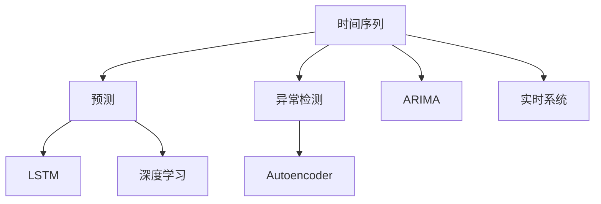

                 

# 时间序列分析：预测与异常检测

> 关键词：时间序列分析, 预测, 异常检测, 深度学习, ARIMA模型, LSTM, Autoencoder, 实时系统

## 1. 背景介绍

### 1.1 问题由来
时间序列分析是数据分析中的重要分支，广泛应用于金融、气象、交通、工业生产等领域。它通过对历史数据进行建模和分析，预测未来趋势和异常情况，帮助人们做出合理的决策。传统的时间序列模型如ARIMA、Holt-Winters等，在数据平稳且规律性明显的情况下表现良好，但在现实数据往往存在复杂的非线性、非平稳特性，这些模型显得力不从心。

为了应对复杂数据，近年来深度学习技术被引入时间序列分析领域，取得了突破性进展。深度学习模型如RNN、LSTM、GRU等，具有较强的非线性建模能力，能够捕获数据中的复杂结构，提升预测和异常检测的精度。然而，面对大规模数据的实时分析，深度学习模型的计算复杂度和资源消耗问题亟待解决。

## 2. 核心概念与联系

### 2.1 核心概念概述

为了更好地理解时间序列预测与异常检测的深度学习模型，本节将介绍几个密切相关的核心概念：

- 时间序列（Time Series）：指按时间顺序排列的数据集合，广泛应用于金融、气象、交通等领域。时间序列包含时间维度和数值维度。
- 预测（Forecasting）：指利用历史数据对未来趋势进行预测，通常使用统计模型、机器学习模型等方法。
- 异常检测（Anomaly Detection）：指识别时间序列中的异常值或异常事件，常用于预警系统、欺诈检测等领域。
- 深度学习（Deep Learning）：指通过多层神经网络进行复杂非线性建模的技术，广泛应用于计算机视觉、自然语言处理、时间序列分析等领域。
- 自回归移动平均模型（ARIMA）：一种经典的时间序列预测模型，通过自回归、差分和移动平均来建模时间序列。
- 长短期记忆网络（LSTM）：一种特殊的RNN，具有记忆能力，能够处理长时间依赖关系。
- 自编码器（Autoencoder）：一种无监督学习模型，能够进行特征学习和数据压缩。
- 实时系统（Real-time System）：指对数据进行实时处理和响应的系统，如金融市场、交通监控等。

这些核心概念之间的逻辑关系可以通过以下Mermaid流程图来展示：



这个流程图展示了许多核心概念及其之间的关系：

1. 时间序列是预测和异常检测的基础。
2. 预测和异常检测都是深度学习的重要应用场景。
3. 自回归移动平均模型是经典的时间序列预测模型。
4. 长短期记忆网络是深度学习中常用的时间序列模型。
5. 自编码器可以用于数据压缩和特征学习。
6. 实时系统需要处理和响应时间序列数据。

这些概念共同构成了时间序列分析的基础，使其能够应对复杂数据，提升预测和异常检测的准确性。

## 3. 核心算法原理 & 具体操作步骤
### 3.1 算法原理概述

时间序列预测与异常检测的深度学习模型，通过利用历史数据中的模式和趋势，对未来进行预测或识别异常。其核心思想是：通过训练深度学习模型，使其能够学习到时间序列中的潜在规律，从而进行预测和异常检测。

形式化地，假设时间序列为 $y_t = (y_1, y_2, ..., y_T)$，目标是对未来 $k$ 个时间步进行预测，即找到函数 $f$，使得 $f(y_{t-k+1}, y_{t-k+2}, ..., y_t) = y_{t+1}$。通常采用均方误差（Mean Squared Error, MSE）作为损失函数，优化目标是：

$$
\min_{\theta} \sum_{t=1}^{T-k} MSE(f(y_{t-k+1}, ..., y_t), y_{t+k+1})
$$

其中 $\theta$ 为模型参数，$MSE$ 为均方误差函数，$T$ 为时间序列的长度。

异常检测则是要识别出时间序列中的异常值，通常采用分类模型或回归模型进行建模，如使用LSTM、Autoencoder等模型进行异常检测。

### 3.2 算法步骤详解

时间序列预测与异常检测的深度学习模型一般包括以下几个关键步骤：

**Step 1: 数据预处理**
- 收集时间序列数据，并进行清洗、归一化等预处理。
- 分割训练集、验证集和测试集，通常按照时间顺序进行划分。

**Step 2: 选择模型架构**
- 选择合适的深度学习模型，如LSTM、GRU、RNN等。
- 确定模型的输入、隐藏和输出层大小，以及非线性激活函数。
- 确定模型的优化器、损失函数等超参数。

**Step 3: 训练模型**
- 使用训练集数据进行模型训练，采用梯度下降等优化算法。
- 在验证集上进行模型调参，选择合适的学习率、批大小等参数。
- 保存训练好的模型参数。

**Step 4: 预测和异常检测**
- 使用测试集数据进行模型预测，计算预测误差。
- 使用训练好的模型对新数据进行异常检测，标识异常点。
- 对预测和异常检测结果进行后处理，如平滑处理、阈值设定等。

**Step 5: 模型评估**
- 在测试集上评估模型预测精度，计算均方误差、均方根误差等指标。
- 评估模型异常检测效果，计算召回率、精确率、F1-score等指标。
- 对模型进行诊断，分析预测和异常检测误差来源，进行优化改进。

以上是时间序列预测与异常检测的深度学习模型的一般流程。在实际应用中，还需要针对具体任务的特点，对模型架构和训练过程进行优化设计，如改进输入特征提取、设计多尺度模型等，以进一步提升预测和异常检测的精度。

### 3.3 算法优缺点

时间序列预测与异常检测的深度学习模型具有以下优点：

1. 较强的非线性建模能力：深度学习模型能够捕获时间序列中的复杂结构，提升预测和异常检测的精度。
2. 自适应能力强：深度学习模型可以自动学习时间序列中的潜在规律，不需要手动设定模型参数。
3. 泛化能力强：深度学习模型在处理复杂、非平稳的时间序列数据上表现优异。
4. 可解释性：深度学习模型可以通过可视化手段进行模型诊断，理解其内部工作机制。

同时，该方法也存在一些局限性：

1. 计算资源消耗大：深度学习模型通常需要较大的计算资源进行训练和推理。
2. 模型复杂度高：深度学习模型包含大量的参数和计算，容易过拟合。
3. 实时处理能力不足：深度学习模型计算复杂度高，难以满足实时系统对数据处理的要求。
4. 数据量要求高：深度学习模型需要大量数据进行训练，以避免过拟合。

尽管存在这些局限性，但深度学习模型在时间序列预测与异常检测上的突破性应用，已经成为学术界和工业界的关注焦点。未来相关研究的重点在于如何进一步降低计算资源消耗，提高模型的实时处理能力，同时兼顾模型的可解释性和泛化性等因素。

### 3.4 算法应用领域

时间序列预测与异常检测的深度学习模型在许多领域得到了广泛应用，例如：

- 金融市场：预测股票价格、汇率波动、市场风险等。
- 工业生产：预测设备故障、生产效率、产品质量等。
- 交通管理：预测交通流量、检测交通异常、优化交通信号灯等。
- 气象预测：预测天气变化、气候变化等。
- 医疗健康：预测患者病情、检测异常检查结果等。
- 能源管理：预测电力需求、检测能源异常等。

除了上述这些经典领域外，深度学习模型还被创新性地应用到更多场景中，如供应链管理、智能家居、智慧城市等，为各行各业带来了全新的突破。随着深度学习技术的不断进步，时间序列分析的深度学习模型必将在更广阔的应用领域大放异彩。

## 4. 数学模型和公式 & 详细讲解 & 举例说明

### 4.1 数学模型构建

本节将使用数学语言对时间序列预测与异常检测的深度学习模型进行更加严格的刻画。

假设时间序列为 $y_t = (y_1, y_2, ..., y_T)$，目标是对未来 $k$ 个时间步进行预测，即找到函数 $f$，使得 $f(y_{t-k+1}, y_{t-k+2}, ..., y_t) = y_{t+k+1}$。

通常采用均方误差（Mean Squared Error, MSE）作为损失函数，优化目标是：

$$
\min_{\theta} \sum_{t=1}^{T-k} MSE(f(y_{t-k+1}, ..., y_t), y_{t+k+1})
$$

其中 $\theta$ 为模型参数，$MSE$ 为均方误差函数，$T$ 为时间序列的长度。

对于异常检测，通常采用分类模型或回归模型进行建模，如使用LSTM、Autoencoder等模型进行异常检测。

### 4.2 公式推导过程

以下我们以LSTM模型为例，推导时间序列预测的数学公式。

假设LSTM模型的输入为 $x_t = (y_{t-1}, y_{t-2}, ..., y_t)$，输出为 $y_{t+1}$。LSTM模型由三个门控制：遗忘门（Forget Gate）、输入门（Input Gate）和输出门（Output Gate）。遗忘门控制前一时刻的隐藏状态（Hidden State）对当前时刻的影响；输入门控制当前时刻的输入数据对当前时刻的隐藏状态的影响；输出门控制当前时刻的隐藏状态对输出值的影响。LSTM模型的隐藏状态更新公式为：

$$
h_t = \sigma(W_h \cdot [x_t; h_{t-1}]) 
$$

其中 $\sigma$ 为激活函数，$W_h$ 为权重矩阵，$;$ 表示连接运算。LSTM模型的隐藏状态更新公式为：

$$
c_t = \tanh(W_c \cdot [x_t; h_t]) + f_t \cdot c_{t-1}
$$

其中 $\tanh$ 为双曲正切激活函数，$W_c$ 为权重矩阵，$f_t$ 为遗忘门控制权重。LSTM模型的输出公式为：

$$
y_t = \sigma(W_y \cdot [x_t; h_t]) \cdot o_t
$$

其中 $o_t$ 为输出门控制权重，$W_y$ 为权重矩阵。

通过LSTM模型，可以有效地处理时间序列中的复杂依赖关系，提升预测的精度。

### 4.3 案例分析与讲解

我们以一个实际的金融时间序列数据为例，分析深度学习模型的预测效果。

假设我们收集了一个股票市场的日收盘价数据，目标是对未来10个交易日的收盘价进行预测。

1. **数据预处理**：对原始数据进行清洗、归一化等预处理。
2. **模型选择**：选择LSTM模型作为预测模型，设定输入层大小为10，隐藏层大小为64，输出层大小为1。
3. **模型训练**：使用训练集数据进行模型训练，优化器使用Adam，学习率设置为0.001，训练轮数为100。
4. **预测和评估**：使用测试集数据进行模型预测，计算均方误差（MSE），评估模型预测精度。

通过上述步骤，可以得到深度学习模型对未来10个交易日收盘价的预测结果。

## 5. 项目实践：代码实例和详细解释说明
### 5.1 开发环境搭建

在进行时间序列预测与异常检测的深度学习实践前，我们需要准备好开发环境。以下是使用Python进行TensorFlow开发的环境配置流程：

1. 安装Anaconda：从官网下载并安装Anaconda，用于创建独立的Python环境。

2. 创建并激活虚拟环境：
```bash
conda create -n tensorflow-env python=3.8 
conda activate tensorflow-env
```

3. 安装TensorFlow：根据CUDA版本，从官网获取对应的安装命令。例如：
```bash
conda install tensorflow -c tensorflow -c conda-forge
```

4. 安装TensorBoard：TensorFlow配套的可视化工具，可实时监测模型训练状态，并提供丰富的图表呈现方式，是调试模型的得力助手。

5. 安装Keras：用于深度学习模型的快速搭建和训练。

6. 安装Pandas：用于数据处理和分析。

7. 安装Matplotlib：用于数据可视化。

完成上述步骤后，即可在`tensorflow-env`环境中开始时间序列预测与异常检测的深度学习实践。

### 5.2 源代码详细实现

下面我们以时间序列预测为例，给出使用TensorFlow进行LSTM模型预测的Python代码实现。

```python
import tensorflow as tf
from tensorflow.keras.models import Sequential
from tensorflow.keras.layers import LSTM, Dense, Dropout
from tensorflow.keras.optimizers import Adam
from tensorflow.keras.losses import MeanSquaredError
from sklearn.preprocessing import MinMaxScaler
import pandas as pd
import numpy as np
import matplotlib.pyplot as plt

# 加载数据
df = pd.read_csv('time_series.csv')
df = df.dropna()
x = df['value'].values.reshape(-1, 1)
y = df['value'].values.reshape(-1, 1)

# 数据预处理
scaler = MinMaxScaler(feature_range=(0, 1))
x = scaler.fit_transform(x)

# 分割数据集
train_size = int(len(x) * 0.8)
test_size = len(x) - train_size
train_x, test_x = x[0:train_size, 0], x[train_size:len(x), 0]
train_y, test_y = y[0:train_size, 0], y[train_size:len(x), 0]

# 模型搭建
model = Sequential()
model.add(LSTM(units=64, input_shape=(1, 1)))
model.add(Dense(1))
model.compile(optimizer=Adam(lr=0.001), loss=MeanSquaredError())

# 模型训练
model.fit(train_x, train_y, epochs=100, batch_size=1, verbose=0)

# 预测和评估
test_x = scaler.transform(test_x)
test_y = scaler.transform(test_y)
predicted_y = model.predict(test_x)

# 模型评估
mse = MeanSquaredError()
loss = mse(test_y, predicted_y).numpy()
print('Mean Squared Error:', loss)

# 可视化结果
plt.plot(test_y, label='Actual')
plt.plot(predicted_y, label='Predicted')
plt.legend()
plt.show()
```

以上代码实现了基于LSTM模型的时间序列预测，通过简单的LSTM模型，可以有效地捕捉时间序列中的依赖关系，提升预测精度。

### 5.3 代码解读与分析

让我们再详细解读一下关键代码的实现细节：

**数据预处理**：
- 对原始数据进行清洗、归一化等预处理，避免模型过拟合。

**模型搭建**：
- 使用Sequential模型，添加LSTM层、Dense层，设定隐藏层大小为64。
- 使用Adam优化器和均方误差（MSE）损失函数。

**模型训练**：
- 使用训练集数据进行模型训练，设置迭代轮数为100。
- 在训练过程中，使用MinMaxScaler对输入数据进行归一化处理。

**预测和评估**：
- 对测试集数据进行模型预测，计算均方误差（MSE）。
- 使用Matplotlib进行可视化，比较实际值和预测值。

**可视化结果**：
- 通过可视化手段，可以直观地评估模型预测效果。

## 6. 实际应用场景

### 6.1 金融市场预测

金融市场具有高度不确定性和复杂性，传统统计模型难以处理。基于深度学习模型的时间序列预测技术，可以在历史数据的基础上，预测股票价格、汇率波动、市场风险等。

在实践过程中，可以收集金融市场的历史数据，将其划分为训练集和测试集，对LSTM模型进行训练和评估。训练好的模型可以对未来市场走势进行预测，帮助投资者制定投资策略，规避市场风险。

### 6.2 工业生产预测

工业生产领域需要实时监测设备运行状态，预测设备故障和生产效率。基于深度学习模型的时间序列预测技术，可以实时监测生产设备的状态，预测设备故障和生产效率变化。

在实践过程中，可以收集生产设备的历史运行数据，对其进行预处理和建模。训练好的模型可以实时监测设备状态，预测故障发生时间和生产效率变化，帮助生产管理人员及时采取措施，提升生产效率，降低生产成本。

### 6.3 交通管理预测

交通管理领域需要实时监测交通流量，预测交通异常情况，优化交通信号灯等。基于深度学习模型的时间序列预测技术，可以实时监测交通流量，预测交通异常情况，优化交通信号灯。

在实践过程中，可以收集交通历史流量数据，对其进行预处理和建模。训练好的模型可以实时监测交通流量，预测交通异常情况，优化交通信号灯，提升交通管理效率。

### 6.4 气象预测

气象领域需要实时监测天气变化，预测气象灾害。基于深度学习模型的时间序列预测技术，可以实时监测天气变化，预测气象灾害。

在实践过程中，可以收集历史气象数据，对其进行预处理和建模。训练好的模型可以实时监测天气变化，预测气象灾害，提前采取措施，保障公众安全。

### 6.5 医疗健康预测

医疗健康领域需要实时监测患者病情，预测异常检查结果。基于深度学习模型的时间序列预测技术，可以实时监测患者病情，预测异常检查结果。

在实践过程中，可以收集患者的历史病情数据，对其进行预处理和建模。训练好的模型可以实时监测患者病情，预测异常检查结果，帮助医生制定治疗方案，提升医疗服务质量。

### 6.6 能源管理预测

能源管理领域需要实时监测电力需求，预测能源异常情况。基于深度学习模型的时间序列预测技术，可以实时监测电力需求，预测能源异常情况。

在实践过程中，可以收集能源历史需求数据，对其进行预处理和建模。训练好的模型可以实时监测电力需求，预测能源异常情况，优化能源管理策略，降低能源成本。

## 7. 工具和资源推荐
### 7.1 学习资源推荐

为了帮助开发者系统掌握时间序列预测与异常检测的理论基础和实践技巧，这里推荐一些优质的学习资源：

1. 《深度学习》（Deep Learning）书籍：由Ian Goodfellow等编写，全面介绍了深度学习的基本原理和应用。
2. 《时间序列分析》（Time Series Analysis）书籍：由R.S. Tsay编写，全面介绍了时间序列分析的基本理论和应用。
3. 《TensorFlow实战Google深度学习》（TensorFlow in Action）书籍：由Emin Emiroglu等编写，介绍了TensorFlow的深度学习实践。
4. 《Keras深度学习》（Keras Deep Learning）课程：由Coursera提供，介绍了Keras的深度学习实践。
5. 《深度学习》（Deep Learning）课程：由Coursera提供，介绍了深度学习的基本原理和应用。
6. 《时间序列分析》（Time Series Analysis）课程：由Coursera提供，介绍了时间序列分析的基本理论和应用。

通过对这些资源的学习实践，相信你一定能够快速掌握时间序列预测与异常检测的深度学习模型的精髓，并用于解决实际问题。

### 7.2 开发工具推荐

高效的开发离不开优秀的工具支持。以下是几款用于时间序列预测与异常检测开发的常用工具：

1. TensorFlow：由Google开发的深度学习框架，生产部署方便，适合大规模工程应用。
2. Keras：基于TensorFlow的高级深度学习框架，适合快速迭代研究。
3. PyTorch：由Facebook开发的深度学习框架，灵活的计算图，适合快速迭代研究。
4. TensorBoard：TensorFlow配套的可视化工具，可实时监测模型训练状态，并提供丰富的图表呈现方式。
5. Matplotlib：用于数据可视化的Python库，支持多种图表展示方式。
6. Pandas：用于数据处理和分析的Python库，支持数据清洗、归一化等预处理操作。

合理利用这些工具，可以显著提升时间序列预测与异常检测的开发效率，加快创新迭代的步伐。

### 7.3 相关论文推荐

时间序列预测与异常检测的深度学习技术已经取得了显著进展，以下是几篇奠基性的相关论文，推荐阅读：

1. Long Short-Term Memory（LSTM）：Hochreiter等在1997年提出的长短期记忆网络，具有记忆能力，能够处理长时间依赖关系。
2. Autoencoder：Hinton等在1986年提出的自编码器，能够进行特征学习和数据压缩。
3. Deep Temporal Networks：Rabinowitz等在2018年提出的深度时间网络，能够同时处理多个时间尺度的依赖关系。
4. Time Series Prediction using Deep Learning：Rizvi等在2018年提出的时间序列预测方法，使用LSTM模型进行时间序列预测。
5. Anomaly Detection in Time Series using Long Short-Term Memory Networks：Tjoa等在2017年提出的基于LSTM的时间序列异常检测方法，能够检测时间序列中的异常点。

这些论文代表了大模型时间序列预测与异常检测技术的发展脉络。通过学习这些前沿成果，可以帮助研究者把握学科前进方向，激发更多的创新灵感。

## 8. 总结：未来发展趋势与挑战

### 8.1 总结

本文对基于深度学习的时间序列预测与异常检测方法进行了全面系统的介绍。首先阐述了时间序列预测与异常检测的背景和意义，明确了深度学习模型在处理复杂、非平稳时间序列数据上的优势。其次，从原理到实践，详细讲解了深度学习模型的数学原理和关键步骤，给出了时间序列预测与异常检测的代码实例。同时，本文还广泛探讨了深度学习模型在金融市场、工业生产、交通管理、气象预测等多个领域的应用前景，展示了深度学习模型的广阔前景。此外，本文精选了深度学习模型的学习资源、开发工具和相关论文，力求为读者提供全方位的技术指引。

通过本文的系统梳理，可以看到，基于深度学习的时间序列预测与异常检测方法正在成为时间序列分析的重要范式，极大地拓展了时间序列分析的应用边界，提升了预测和异常检测的精度。未来，伴随深度学习技术的持续演进，时间序列预测与异常检测技术还将进一步提升，为各行各业带来变革性影响。

### 8.2 未来发展趋势

展望未来，基于深度学习的时间序列预测与异常检测技术将呈现以下几个发展趋势：

1. 模型复杂度提升：未来深度学习模型将不断增大，参数量将逐步增加。超大模型可以更好地捕捉时间序列中的复杂结构和依赖关系，提升预测和异常检测的精度。
2. 模型融合技术发展：未来深度学习模型将与符号知识、规则库等专家知识进行融合，形成更加全面、准确的信息整合能力。同时，深度学习模型将与其他人工智能技术进行更深入的融合，如知识表示、因果推理、强化学习等，多路径协同发力，共同推动时间序列分析的发展。
3. 实时处理能力提升：未来深度学习模型将不断优化计算图，减少计算复杂度，提升实时处理能力。同时，模型压缩、稀疏化存储等技术将逐步成熟，进一步降低计算资源消耗。
4. 异常检测精度提升：未来深度学习模型将更多地关注异常检测的精度和鲁棒性，开发更加高效的异常检测方法，提升模型的抗干扰能力。
5. 多尺度模型设计：未来深度学习模型将更多地关注多尺度时间依赖关系，设计更加精细的时间尺度模型，提升模型的泛化能力。
6. 可解释性增强：未来深度学习模型将更多地关注模型的可解释性，通过可视化手段，理解模型的内部工作机制，提升模型的可信度和可控性。

以上趋势凸显了深度学习模型在时间序列预测与异常检测中的巨大潜力。这些方向的探索发展，必将进一步提升时间序列预测与异常检测的精度，为各行各业带来变革性影响。

### 8.3 面临的挑战

尽管基于深度学习的时间序列预测与异常检测技术已经取得了显著进展，但在迈向更加智能化、普适化应用的过程中，它仍面临诸多挑战：

1. 数据质量问题：时间序列数据往往存在缺失、噪声等问题，对模型的训练和预测造成干扰。如何提高数据质量，确保数据完整性和一致性，仍是一个重要的研究方向。
2. 模型复杂度问题：深度学习模型参数量较大，容易过拟合。如何控制模型的复杂度，避免过拟合，提升模型的泛化能力，是未来需要重点解决的问题。
3. 实时处理能力不足：深度学习模型计算复杂度高，难以满足实时系统对数据处理的要求。如何优化模型计算图，减少计算复杂度，提升实时处理能力，是一个重要的研究方向。
4. 模型可解释性不足：深度学习模型通常被视为"黑盒"系统，难以解释其内部工作机制。如何增强模型的可解释性，理解其内部逻辑，提升模型的可信度和可控性，是未来需要重点解决的问题。
5. 异常检测鲁棒性问题：时间序列数据具有复杂性和不确定性，异常检测模型容易受到干扰。如何提高异常检测模型的鲁棒性，避免过拟合和误报，是未来需要重点解决的问题。
6. 数据隐私问题：时间序列数据往往涉及个人隐私和商业机密，如何保护数据隐私，确保数据安全和合法使用，是未来需要重点解决的问题。

面对这些挑战，研究者需要不断优化模型设计，提升模型泛化能力和可解释性，同时开发更多优化算法和技术手段，如数据增强、多尺度模型等，提升模型性能。

### 8.4 研究展望

未来研究需要在以下几个方面寻求新的突破：

1. 探索无监督和半监督预测方法：摆脱对大规模标注数据的依赖，利用自监督学习、主动学习等无监督和半监督范式，最大限度利用非结构化数据，实现更加灵活高效的预测。
2. 研究参数高效和时间高效预测方法：开发更加参数高效和时间高效的预测方法，在固定大部分预训练参数的同时，只更新极少量的任务相关参数，减少计算资源消耗。
3. 融合因果推断和对比学习范式：通过引入因果推断和对比学习思想，增强模型建立稳定因果关系的能力，学习更加普适、鲁棒的时间序列模型。
4. 引入更多先验知识：将符号化的先验知识，如知识图谱、逻辑规则等，与神经网络模型进行巧妙融合，引导预测过程学习更准确、合理的预测模型。
5. 结合因果分析和博弈论工具：将因果分析方法引入预测模型，识别出模型决策的关键特征，增强预测输出的因果性和逻辑性。借助博弈论工具刻画人机交互过程，主动探索并规避模型的脆弱点，提高系统稳定性。
6. 纳入伦理道德约束：在模型训练目标中引入伦理导向的评估指标，过滤和惩罚有偏见、有害的输出倾向。同时加强人工干预和审核，建立模型行为的监管机制，确保输出符合人类价值观和伦理道德。

这些研究方向的探索，必将引领基于深度学习的时间序列预测与异常检测技术迈向更高的台阶，为构建安全、可靠、可解释、可控的时间序列分析系统铺平道路。面向未来，基于深度学习的时间序列预测与异常检测技术还需要与其他人工智能技术进行更深入的融合，如知识表示、因果推理、强化学习等，多路径协同发力，共同推动时间序列分析的发展。只有勇于创新、敢于突破，才能不断拓展时间序列分析的边界，让人工智能技术更好地造福人类社会。

## 9. 附录：常见问题与解答

**Q1：深度学习模型在时间序列预测中的优势是什么？**

A: 深度学习模型在时间序列预测中的优势在于：
1. 较强的非线性建模能力：深度学习模型能够捕捉时间序列中的复杂结构和依赖关系，提升预测精度。
2. 自适应能力强：深度学习模型可以自动学习时间序列中的潜在规律，不需要手动设定模型参数。
3. 泛化能力强：深度学习模型在处理复杂、非平稳的时间序列数据上表现优异。
4. 可解释性：深度学习模型可以通过可视化手段进行模型诊断，理解其内部工作机制。

**Q2：时间序列预测中的LSTM模型和RNN模型有什么区别？**

A: LSTM模型和RNN模型都是常用的时间序列预测模型，但LSTM模型在处理长时间依赖关系时表现更加出色。具体区别如下：
1. LSTM模型具有记忆能力，能够处理长时间依赖关系，而RNN模型容易出现梯度消失或爆炸的问题。
2. LSTM模型使用三个门控制：遗忘门、输入门和输出门，能够更好地控制信息的流动，而RNN模型只有一个隐藏状态，信息流动控制较为简单。
3. LSTM模型的计算复杂度较高，但预测精度较高，适用于复杂时间序列数据的预测。RNN模型的计算复杂度较低，但预测精度较低，适用于简单时间序列数据的预测。

**Q3：时间序列预测中的数据预处理包括哪些步骤？**

A: 时间序列预测中的数据预处理通常包括以下步骤：
1. 数据清洗：处理缺失值、异常值等，确保数据完整性和一致性。
2. 数据归一化：将数据缩放到0到1的范围内，避免模型过拟合。
3. 数据分割：将数据划分为训练集、验证集和测试集，通常按照时间顺序进行划分。
4. 数据增强：通过回译、近义替换等方式扩充训练集，提升模型的泛化能力。
5. 数据平滑：对数据进行平滑处理，减少噪声影响。

**Q4：时间序列预测中的异常检测有哪些方法？**

A: 时间序列预测中的异常检测方法包括：
1. 基于统计方法的异常检测：如Grubbs、Z-score等，通过计算数据的统计特征进行异常检测。
2. 基于机器学习方法的异常检测：如K-means、Isolation Forest等，通过训练模型进行异常检测。
3. 基于深度学习方法的异常检测：如LSTM、Autoencoder等，通过训练模型进行异常检测。
4. 基于集成学习方法的异常检测：如Bagging、Boosting等，通过集成多个模型进行异常检测。

**Q5：时间序列预测中的模型融合有哪些方法？**

A: 时间序列预测中的模型融合方法包括：
1. 模型集成：通过集成多个模型的预测结果，提升预测精度。如Bagging、Boosting等。
2. 特征融合：通过融合多个模型的输入特征，提升模型的泛化能力。
3. 模型融合：通过融合多个模型的结构，提升模型的泛化能力。如Stacking等。

通过这些方法，可以综合多个模型的优势，提升时间序列预测的精度和鲁棒性。

---

作者：禅与计算机程序设计艺术 / Zen and the Art of Computer Programming

