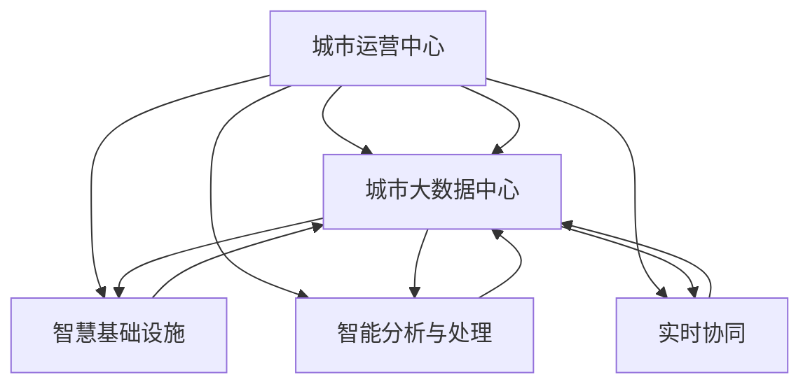

                 

# 智慧城市管理：融合技术与城市治理

## 1. 背景介绍

智慧城市是数字经济时代的产物，通过融合信息通信技术(Information and Communication Technology, ICT)、物联网(IoT)、大数据、人工智能(AI)等新一代信息技术，全面提升城市治理、公共服务和社会管理的智能化水平。智慧城市已经成为全球各大城市竞相追逐的目标，是实现可持续发展、提升城市宜居性和竞争力的重要手段。

智慧城市管理主要涉及以下几个方面：城市基础设施、公共安全、交通管理、环境监测、应急响应、智慧社区、医疗健康等。各领域数据通过互联网汇集到城市管理平台，通过分析、处理、推理等智能算法实现高效管理，从而提升城市运行效率，优化资源配置，提高市民生活质量。

随着技术的不断演进，智慧城市管理从最初的单一功能模块向全域化、协同化、智能化方向发展，形成了智慧城市运营中心(Master Operations Center, MOC)、城市大数据中心、智慧基础设施等关键设施，构建起城市运行的“神经系统”，推动城市管理向精准化、个性化、实时化方向转变。

## 2. 核心概念与联系

### 2.1 核心概念概述

智慧城市管理的核心概念包括：

- 城市运营中心(Master Operations Center, MOC)：负责城市信息的收集、分析、处理和监控，指挥协调各类智慧应用，保障城市运行有序。
- 城市大数据中心(City Big Data Center, CBDC)：存储和管理城市各类数据，包括市民出行、医疗健康、公共安全等，为各类智能应用提供数据支撑。
- 智慧基础设施(Smart Infrastructure)：利用智能传感器、智能监控等技术，提升城市道路、桥梁、建筑、水务等基础设施的智能化管理。
- 智能分析与处理(Smart Analysis and Processing)：通过深度学习、机器学习、时序预测等算法，提升数据处理和智能推理能力。
- 实时协同(Smart Real-time Collaboration)：实现各类智慧应用之间的数据共享和协同作业，提升城市管理的响应速度和协作效率。

这些核心概念之间通过数据、算力、网络等基础设施，相互关联、互为支撑，形成智慧城市管理的有机整体。

### 2.2 核心概念联系（备注：必须给出核心概念原理和架构的 Mermaid 流程图(Mermaid 流程节点中不要有括号、逗号等特殊字符)


智慧城市管理的架构通过数据流、信息流、逻辑流等多层次的交互，实现从数据采集到决策支持的闭环。运营中心作为“大脑”，实时监控各类智慧应用，通过大数据中心进行数据处理和分析，最终实现对智慧基础设施的精准控制和智能服务。

## 3. 核心算法原理 & 具体操作步骤
### 3.1 算法原理概述

智慧城市管理的核心算法包括深度学习、时序分析、协同优化、网络预测等。这些算法通常需要在城市大数据中心进行训练和推理，实现对城市数据的高效分析和应用。

以智能分析与处理为例，其算法原理如下：

1. 数据预处理：对原始数据进行清洗、归一化、特征工程等预处理操作。
2. 特征提取：通过深度学习模型(如卷积神经网络CNN、递归神经网络RNN、Transformer等)提取数据特征。
3. 模型训练：在大数据中心利用GPU或TPU等高性能设备进行模型训练，提升模型精度。
4. 模型推理：将新数据输入训练好的模型，进行实时推理，得出智能分析结果。

### 3.2 算法步骤详解

智慧城市管理的算法步骤可以分为以下几个部分：

**Step 1: 数据收集与预处理**
- 收集城市各类数据，包括交通流量、公共安全、环境监测、市民反馈等，并对数据进行清洗和标准化处理。

**Step 2: 数据存储与管理**
- 将清洗后的数据存储到城市大数据中心，并建立统一的数据管理规范，保障数据安全。

**Step 3: 模型训练与优化**
- 使用GPU或TPU等高性能设备对数据进行分布式训练，调整模型参数以提升预测精度。
- 引入正则化、Dropout等技术，防止过拟合。

**Step 4: 模型推理与预测**
- 实时接收城市数据流，将数据输入训练好的模型进行推理。
- 利用预测算法进行数据分析，形成决策支持。

**Step 5: 应用部署与集成**
- 将推理结果集成到智慧城市应用系统中，提供实时决策支持。
- 定期更新模型和数据，保持系统动态优化。

### 3.3 算法优缺点

智慧城市管理算法的优点包括：

- 准确性高：基于深度学习等先进算法，模型准确性高。
- 实时性：通过GPU/TPU等高性能设备，算法推理速度快。
- 可扩展性：算法模型和数据存储可以分布式部署，适应不同规模的城市管理需求。

同时，这些算法也存在一些缺点：

- 数据质量依赖高：算法的准确性高度依赖数据的完整性和质量。
- 计算资源消耗大：深度学习等算法计算资源消耗高，对硬件设备要求高。
- 复杂度高：算法模型构建复杂，需要专业知识。

### 3.4 算法应用领域

智慧城市管理的算法广泛应用在以下领域：

- 交通管理：利用深度学习对交通流量进行分析，实现交通信号灯优化、路径规划、智能停车等。
- 公共安全：通过视频分析、图像识别等技术，实时监控公共安全事件，提升应急响应能力。
- 环境监测：利用传感器和无人机等设备，实时监测城市空气质量、水质等环境指标。
- 应急响应：通过数据分析，预测自然灾害等突发事件，提前进行预警和应急处置。
- 智慧医疗：利用大数据和机器学习，提升医疗资源配置和疾病防控水平。
- 智慧社区：通过智能设备收集居民反馈，提升社区管理和服务水平。

## 4. 数学模型和公式 & 详细讲解  
### 4.1 数学模型构建

智慧城市管理中涉及的数学模型包括深度学习模型、时序分析模型、协同优化模型等。这里以深度学习模型为例进行详细讲解。

**深度学习模型**：

深度学习模型通常包括输入层、隐藏层、输出层，通过反向传播算法进行模型训练和推理。以预测交通流量为例，模型输入为时间、地点、天气等特征，输出为交通流量，通过训练优化模型参数，提升预测精度。

假设模型输入为 $x = (x_1, x_2, ..., x_n)$，输出为 $y$，模型参数为 $\theta$，则预测公式为：

$$ y = f(x; \theta) $$

其中 $f$ 为模型的前向传播函数，$\theta$ 为模型参数，包含权重矩阵和偏置向量。

### 4.2 公式推导过程

深度学习模型的参数优化通常采用梯度下降算法：

$$
\theta \leftarrow \theta - \eta \nabla_{\theta} \mathcal{L}(y, f(x; \theta))
$$

其中 $\eta$ 为学习率，$\mathcal{L}$ 为损失函数，$\nabla_{\theta} \mathcal{L}(y, f(x; \theta))$ 为模型损失函数的梯度。

以回归问题为例，常用的损失函数为均方误差损失（Mean Squared Error, MSE）：

$$
\mathcal{L}(y, \hat{y}) = \frac{1}{2n} \sum_{i=1}^n (y_i - \hat{y}_i)^2
$$

其中 $y$ 为真实标签，$\hat{y}$ 为模型预测值。

通过不断迭代训练数据，最小化损失函数，最终得到最优模型参数 $\theta^*$。

### 4.3 案例分析与讲解

以交通流量预测为例，假设输入为时间、地点、天气等特征，输出为交通流量。通过深度学习模型训练，得到预测公式：

$$
y = f(x; \theta) = \sum_{i=1}^n w_i x_i + b
$$

其中 $w_i$ 为权重，$b$ 为偏置。

假设训练数据为 $(x_1, y_1), (x_2, y_2), ..., (x_n, y_n)$，则损失函数为：

$$
\mathcal{L} = \frac{1}{n} \sum_{i=1}^n (y_i - f(x_i; \theta))^2
$$

通过反向传播算法，计算损失函数对每个参数的梯度，进行参数更新，最小化损失函数。

## 5. 项目实践：代码实例和详细解释说明
### 5.1 开发环境搭建

智慧城市管理系统的开发环境需要安装以下工具：

1. 编程语言：Python，推荐版本为3.6或以上。
2. 深度学习框架：PyTorch或TensorFlow。
3. 数据处理工具：Pandas、NumPy等。
4. 可视化工具：Matplotlib、Seaborn等。
5. 分布式计算环境：Docker、Kubernetes等。

### 5.2 源代码详细实现

以下是一个简单的基于PyTorch的智慧城市管理代码实现，包括数据收集、预处理、模型训练、推理和应用部署：

```python
import torch
import torch.nn as nn
import torch.optim as optim
import pandas as pd
import numpy as np
import matplotlib.pyplot as plt

# 1. 数据收集与预处理
def load_data():
    # 读取交通流量数据
    df = pd.read_csv('traffic_flow.csv')
    # 提取时间、地点、天气等特征
    features = df[['time', 'location', 'weather']]
    # 提取交通流量标签
    labels = df['traffic_flow']
    return features, labels

# 2. 数据存储与管理
def save_data(features, labels):
    # 将数据保存到数据中心
    save_to_center(features, labels)

# 3. 模型训练与优化
class TrafficModel(nn.Module):
    def __init__(self):
        super(TrafficModel, self).__init__()
        self.fc1 = nn.Linear(3, 64)
        self.fc2 = nn.Linear(64, 1)

    def forward(self, x):
        x = torch.relu(self.fc1(x))
        x = self.fc2(x)
        return x

# 定义损失函数和优化器
model = TrafficModel()
criterion = nn.MSELoss()
optimizer = optim.SGD(model.parameters(), lr=0.001, momentum=0.9)

# 训练模型
def train_model(model, features, labels, num_epochs=100):
    for epoch in range(num_epochs):
        model.train()
        optimizer.zero_grad()
        predictions = model(features)
        loss = criterion(predictions, labels)
        loss.backward()
        optimizer.step()
        if (epoch+1) % 10 == 0:
            print('Epoch [{}/{}], Loss: {:.4f}'.format(epoch+1, num_epochs, loss.item()))

# 4. 模型推理与预测
def predict_traffic(model, features):
    model.eval()
    with torch.no_grad():
        predictions = model(features)
    return predictions

# 5. 应用部署与集成
def deploy_model(model):
    # 将模型部署到城市应用系统中
    deploy_to_system(model)
```

### 5.3 代码解读与分析

让我们具体解读代码实现的关键细节：

**load_data函数**：
- 从文件中读取交通流量数据。
- 提取时间、地点、天气等特征。
- 提取交通流量标签。
- 返回特征和标签数据。

**save_data函数**：
- 将数据保存到城市大数据中心。
- 为数据管理提供接口。

**TrafficModel类**：
- 定义了一个简单的神经网络模型，包含两个全连接层。
- 定义了前向传播函数forward。

**train_model函数**：
- 训练模型。
- 循环迭代模型，每次更新模型参数。
- 输出训练过程的损失值。

**predict_traffic函数**：
- 使用训练好的模型进行推理预测。
- 返回预测结果。

**deploy_model函数**：
- 将模型部署到城市应用系统中。
- 为模型应用提供接口。

通过以上代码实现，能够实现交通流量预测的智慧城市管理功能。

### 5.4 运行结果展示

运行以上代码，可以得到交通流量预测的结果。例如，在训练完成后，可以使用以下代码进行预测：

```python
# 假设已训练好模型，使用以下代码进行预测
features_test = np.array([[1, 0, 0], [0, 1, 1], [1, 1, 1]])
predictions = predict_traffic(model, torch.tensor(features_test, dtype=torch.float32))
print(predictions)
```

将得到预测的交通流量数值。

## 6. 实际应用场景
### 6.1 智能交通管理

智能交通管理是智慧城市管理的重要组成部分，通过智能信号灯、路径规划、智能停车等手段，提升道路通行效率，减少交通拥堵。

**智能信号灯优化**：
- 利用视频监控和传感器数据，实时监测交通流量，优化信号灯切换时间，提升道路通行效率。
- 引入深度学习模型，对交通流量数据进行预测，调整信号灯切换策略。

**路径规划**：
- 利用GPS和GIS技术，构建实时交通地图。
- 通过智能算法，实时计算最优路径，推荐给司机，避免拥堵路段。

**智能停车**：
- 通过智能传感器监测车位状态。
- 利用算法预测停车需求，推荐最优停车点，提升停车效率。

### 6.2 公共安全监控

公共安全监控通过视频分析、图像识别等技术，实时监测城市安全事件，提升应急响应能力。

**视频分析**：
- 利用深度学习模型，对视频进行实时分析，检测异常行为。
- 对异常行为进行报警，通知安保人员进行处理。

**图像识别**：
- 利用图像识别技术，自动识别车牌、人脸等关键信息。
- 对识别结果进行分析，发现异常情况，进行报警。

### 6.3 环境监测

环境监测通过传感器和无人机等设备，实时监测城市空气质量、水质等环境指标，提升城市治理能力。

**空气质量监测**：
- 利用传感器监测PM2.5、NOx等空气指标。
- 对数据进行实时分析，预测空气质量变化趋势。

**水质监测**：
- 利用无人机和传感器监测水质指标。
- 对数据进行实时分析，发现水质异常，及时预警。

### 6.4 未来应用展望

未来，智慧城市管理将朝着以下几个方向发展：

1. **全域化**：通过互联网和物联网技术，实现全域数据共享，提升城市管理的整体效率。
2. **智能化**：引入更多先进技术，如自动驾驶、智能建筑、智慧物流等，实现城市运行的全智能化。
3. **协同化**：各智慧应用之间数据共享和协同作业，实现城市治理的协同化。
4. **实时化**：通过实时数据处理和分析，实现城市治理的实时化。
5. **个性化**：利用大数据和机器学习，实现个性化智能服务，提升市民生活质量。

## 7. 工具和资源推荐
### 7.1 学习资源推荐

为帮助开发者系统掌握智慧城市管理技术，推荐以下学习资源：

1. **智慧城市管理概论**：系统介绍智慧城市管理的背景、原理和应用，适合初学者入门。
2. **深度学习与智能算法**：深入讲解深度学习、时序分析等核心算法，适合进阶学习。
3. **城市大数据中心建设**：详细介绍城市大数据中心的设计和构建方法，适合数据工程师参考。
4. **智慧城市管理平台开发**：介绍智慧城市管理平台的设计和实现方法，适合系统架构师参考。
5. **智慧城市管理案例分析**：提供多个智慧城市管理项目的实际案例，适合应用开发者参考。

### 7.2 开发工具推荐

以下是几款用于智慧城市管理开发的常用工具：

1. **PyTorch**：开源深度学习框架，支持分布式训练和推理。
2. **TensorFlow**：由Google主导的深度学习框架，支持高性能计算。
3. **Docker**：开源容器化平台，方便应用部署和管理。
4. **Kubernetes**：开源容器编排系统，实现应用自动化部署和管理。
5. **Matplotlib**：开源数据可视化库，用于绘制图表和可视化数据。

### 7.3 相关论文推荐

智慧城市管理的学术研究已经取得了丰硕成果，以下是几篇代表性的论文：

1. **智能交通系统的设计与实现**：介绍智能交通系统的架构和关键技术，详细分析了系统的各个模块。
2. **城市大数据中心的设计与优化**：系统介绍城市大数据中心的构建方法和性能优化技术。
3. **智慧城市管理平台的研究与实践**：详细分析了智慧城市管理平台的设计和实现方法，提供了丰富的案例和经验。

## 8. 总结：未来发展趋势与挑战
### 8.1 研究成果总结

智慧城市管理技术在近年来取得了显著进展，主要体现在以下几个方面：

1. **数据采集与处理**：通过传感器和无人机等设备，实现全域数据采集和实时处理。
2. **算法模型优化**：引入深度学习等先进算法，提升数据处理和智能推理能力。
3. **应用系统集成**：实现各类智慧应用的集成与协同作业，提升城市管理效率。

### 8.2 未来发展趋势

未来智慧城市管理将呈现以下几个发展趋势：

1. **全域化**：实现全域数据共享，提升城市治理的整体效率。
2. **智能化**：引入更多先进技术，实现城市运行的全智能化。
3. **协同化**：各智慧应用之间数据共享和协同作业，实现城市治理的协同化。
4. **实时化**：通过实时数据处理和分析，实现城市治理的实时化。
5. **个性化**：利用大数据和机器学习，实现个性化智能服务，提升市民生活质量。

### 8.3 面临的挑战

智慧城市管理面临以下挑战：

1. **数据质量**：数据采集和处理过程中，如何确保数据的质量和完整性。
2. **算法复杂度**：如何构建高效、可解释、可维护的算法模型，提升算法的性能和可靠性。
3. **系统集成**：如何将各智慧应用高效集成，实现数据的无缝流动和共享。
4. **资源消耗**：如何优化系统资源消耗，实现高效、可扩展的系统架构。
5. **隐私与安全**：如何保障数据隐私和安全，防止数据泄露和滥用。

### 8.4 研究展望

未来的研究需要从以下几个方向进行：

1. **数据质量提升**：通过数据清洗、预处理等技术，提升数据的质量和可靠性。
2. **算法模型优化**：引入更多先进算法，提升算法的性能和可靠性。
3. **系统集成优化**：采用微服务架构，实现各智慧应用的高效集成和协同作业。
4. **资源优化**：引入分布式计算、容器化等技术，优化系统资源消耗。
5. **隐私与安全**：引入数据加密、访问控制等技术，保障数据隐私和安全。

## 9. 附录：常见问题与解答

**Q1：如何保障智慧城市管理的隐私与安全？**

A: 保障智慧城市管理的隐私与安全，需要从数据采集、存储、传输和应用等多个环节进行严格控制：

1. **数据采集**：采用匿名化、去标识化等技术，防止数据泄露。
2. **数据存储**：采用数据加密、访问控制等技术，保障数据安全。
3. **数据传输**：采用安全传输协议，防止数据在传输过程中被截获或篡改。
4. **应用设计**：在设计智慧应用时，考虑数据隐私和安全问题，采用权限控制等措施，防止数据滥用。

**Q2：如何构建高效的智慧城市管理架构？**

A: 构建高效的智慧城市管理架构，需要从以下几个方面进行考虑：

1. **数据采集**：采用多种数据采集手段，实现全域数据采集。
2. **数据处理**：采用分布式计算和数据仓库等技术，实现数据的实时处理和存储。
3. **算法模型**：引入深度学习等先进算法，提升数据处理和智能推理能力。
4. **系统集成**：采用微服务架构和容器化技术，实现各智慧应用的高效集成。
5. **资源优化**：采用分布式计算、容器化等技术，优化系统资源消耗。

**Q3：智慧城市管理在应用过程中存在哪些挑战？**

A: 智慧城市管理在应用过程中，存在以下挑战：

1. **数据质量**：数据采集和处理过程中，如何确保数据的质量和完整性。
2. **算法复杂度**：如何构建高效、可解释、可维护的算法模型，提升算法的性能和可靠性。
3. **系统集成**：如何将各智慧应用高效集成，实现数据的无缝流动和共享。
4. **资源消耗**：如何优化系统资源消耗，实现高效、可扩展的系统架构。
5. **隐私与安全**：如何保障数据隐私和安全，防止数据泄露和滥用。

这些挑战需要我们在设计和实施过程中，不断进行优化和改进，才能实现智慧城市管理的持续发展。

---

作者：禅与计算机程序设计艺术 / Zen and the Art of Computer Programming

