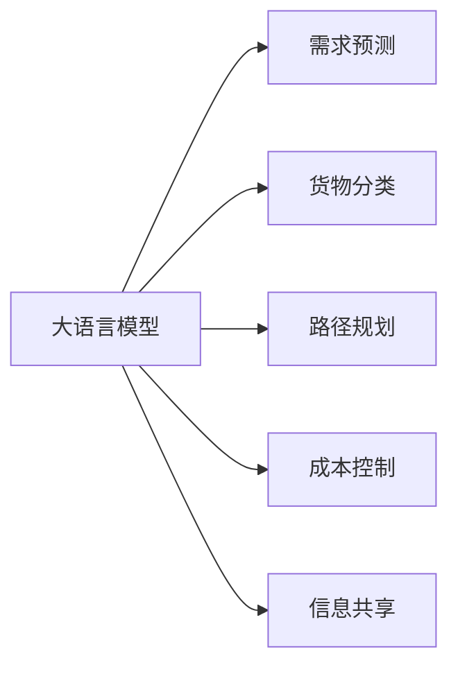

                 

# 智能供应链优化：LLM在物流管理中的角色

在当今快节奏的商业环境中，供应链管理的重要性日益凸显。对于物流公司而言，高效、灵活、低成本的供应链管理是其能否在竞争激烈的市场中脱颖而出的关键因素。大语言模型（Large Language Model, LLM）的出现，为物流管理提供了一种全新的智能解决方案，极大地提升了供应链的优化能力。本文将深入探讨LLM在物流管理中的角色，分析其核心概念与联系，展示其算法原理与操作步骤，并通过实际案例和项目实践，进一步揭示LLM在供应链优化中的潜力。

## 1. 背景介绍

### 1.1 问题由来

随着电子商务的迅猛发展，物流行业面临着前所未有的挑战：

1. **需求波动性**：电商平台的销售峰值往往集中在某些特定时段，导致物流需求大起大落，增加了运营难度。
2. **货物多样性**：不同类型的货物需要不同的处理方式，增加了物流管理的复杂性。
3. **成本控制**：物流成本直接关系到企业利润，如何在保证服务质量的前提下控制成本是关键问题。
4. **信息透明度**：供应链上下游信息的不对称，增加了管理难度和运营风险。

传统物流管理系统依赖于固定的规则和人工经验，难以灵活应对上述挑战。而大语言模型通过在海量数据上训练，具备强大的语义理解能力和推理能力，可以为物流管理提供更加智能化、自动化的解决方案。

### 1.2 问题核心关键点

LLM在物流管理中的核心作用在于通过自然语言处理和推理，优化供应链的各个环节，提升效率、降低成本、提高透明度。具体而言：

- **需求预测**：通过自然语言理解技术，对用户评论、社交媒体、新闻等多种来源的信息进行分析，预测未来的物流需求。
- **货物分类**：利用自然语言处理技术，自动识别货物的类型、特性，选择合适的处理方式。
- **路径规划**：通过语言生成技术，自动生成最优物流路径和配送计划。
- **成本控制**：通过自然语言推理技术，实时调整物流策略，优化成本结构。
- **信息共享**：利用自然语言交互技术，提升供应链上下游的信息透明度和沟通效率。

## 2. 核心概念与联系

### 2.1 核心概念概述

大语言模型（LLM）是一种通过自监督学习训练的深度学习模型，能够理解和生成自然语言，具备强大的语义理解能力。在物流管理中，LLM通过自然语言处理（Natural Language Processing, NLP）技术，对文本数据进行处理和分析，生成有价值的供应链优化建议。

物流管理包括需求预测、货物分类、路径规划、成本控制和信息共享等多个环节，每个环节都可以通过LLM进行智能化优化。

### 2.2 核心概念原理和架构的 Mermaid 流程图



这个流程图展示了LLM在物流管理中的核心应用场景。大语言模型通过自然语言处理技术，对不同的输入文本进行分析和处理，最终生成各个环节的优化建议。

## 3. 核心算法原理 & 具体操作步骤

### 3.1 算法原理概述

LLM在物流管理中的应用基于自然语言处理和自然语言推理技术。核心算法原理包括以下几个方面：

- **自然语言理解**：通过语言模型分析输入文本，提取关键信息，如货物种类、数量、目的地等。
- **自然语言生成**：利用语言模型生成输出文本，如优化后的路径、配送计划、成本分析报告等。
- **自然语言推理**：通过逻辑推理，对不同场景下的物流策略进行优化和调整。

### 3.2 算法步骤详解

基于LLM的物流管理优化可以分为以下几个关键步骤：

1. **数据收集与预处理**：从多种数据源收集相关文本数据，如订单信息、物流评论、新闻报道等，并进行清洗、标注和分词处理。
2. **模型选择与训练**：选择合适的预训练语言模型（如GPT、BERT等），利用标注数据对其进行微调，以适应特定的物流场景。
3. **文本分析与处理**：通过自然语言处理技术，对输入文本进行语义分析、情感分析、实体识别等处理，提取关键信息。
4. **优化建议生成**：利用自然语言生成技术，生成物流优化建议，如路径规划、配送策略、库存管理等。
5. **结果评估与反馈**：对生成的优化建议进行评估和验证，根据实际运营效果进行调整和优化。

### 3.3 算法优缺点

#### 优点：

1. **高效灵活**：LLM能够处理大规模的文本数据，快速生成优化建议，适应不同的物流场景。
2. **准确性高**：基于深度学习模型的自监督训练，LLM具备高准确性和鲁棒性，能够有效应对各种异常情况。
3. **可解释性强**：LLM生成的优化建议可以通过自然语言形式进行解释和理解，便于决策和执行。

#### 缺点：

1. **数据依赖性强**：模型的性能依赖于输入数据的质量和量，需要大量高质量的标注数据进行训练。
2. **计算资源消耗大**：大规模的LLM模型对计算资源要求较高，训练和推理过程可能较为耗时。
3. **鲁棒性不足**：在面对突发事件或异常数据时，模型可能表现出较差的鲁棒性。

### 3.4 算法应用领域

LLM在物流管理中的应用领域非常广泛，涵盖以下几个方面：

1. **需求预测**：通过分析电商平台的订单数据、用户评论、社交媒体等，预测未来的物流需求，优化库存和配送策略。
2. **货物分类**：根据货物的描述信息，自动识别货物类型和特性，选择合适的处理方式，如冷藏、防潮等。
3. **路径规划**：利用自然语言推理技术，结合实时交通数据，自动生成最优物流路径和配送计划，提高配送效率。
4. **成本控制**：通过分析历史物流数据和实时运营数据，优化配送路线、运输方式，降低物流成本。
5. **信息共享**：通过自然语言交互技术，提升供应链上下游的信息透明度和沟通效率，减少信息不对称带来的风险。

## 4. 数学模型和公式 & 详细讲解 & 举例说明

### 4.1 数学模型构建

基于LLM的物流管理优化模型主要包含以下几个部分：

1. **输入文本编码**：将输入的文本数据转换为模型可以处理的向量形式。
2. **自然语言理解**：通过语言模型提取关键信息，如货物种类、数量、目的地等。
3. **自然语言生成**：利用生成模型生成优化建议，如路径规划、配送计划、成本分析等。
4. **自然语言推理**：通过逻辑推理对不同场景下的物流策略进行优化和调整。

### 4.2 公式推导过程

以需求预测为例，假设我们有训练好的预训练语言模型 $M$，输入文本为 $x$，表示电商平台的订单信息，输出为 $y$，表示预测的物流需求量。

模型的训练过程可以通过以下步骤完成：

1. 数据预处理：将订单数据进行清洗、分词、标注，生成训练集 $\{(x_i,y_i)\}_{i=1}^N$。
2. 模型选择与训练：选择合适的预训练语言模型 $M$，利用训练集进行微调，得到优化后的模型 $M_{\theta}$。
3. 文本分析与处理：通过自然语言理解技术，对输入订单信息进行语义分析，提取关键信息。
4. 优化建议生成：利用自然语言生成技术，生成预测的物流需求量。
5. 结果评估与反馈：根据实际运营数据，评估预测结果的准确性，调整模型参数。

### 4.3 案例分析与讲解

假设某电商平台每天接收大量订单，通过分析订单数据，发现某些商品的销售量在特定时间段急剧上升。为了应对这种需求波动，利用LLM进行需求预测，具体步骤如下：

1. 收集订单数据，并进行清洗、分词处理，生成训练集。
2. 选择GPT模型作为预训练语言模型，利用训练集对其进行微调，得到优化后的模型。
3. 对新订单进行语义分析，提取商品名称、销售量等信息。
4. 利用模型生成预测的物流需求量，并根据实时交通数据和库存情况进行优化。
5. 根据实际运营数据评估预测结果，调整模型参数，进一步提升预测精度。

## 5. 项目实践：代码实例和详细解释说明

### 5.1 开发环境搭建

在进行LLM在物流管理中的应用开发前，我们需要准备好开发环境。以下是使用Python进行PyTorch开发的环境配置流程：

1. 安装Anaconda：从官网下载并安装Anaconda，用于创建独立的Python环境。
2. 创建并激活虚拟环境：
   ```bash
   conda create -n pytorch-env python=3.8 
   conda activate pytorch-env
   ```
3. 安装PyTorch：根据CUDA版本，从官网获取对应的安装命令。例如：
   ```bash
   conda install pytorch torchvision torchaudio cudatoolkit=11.1 -c pytorch -c conda-forge
   ```
4. 安装Transformer库：
   ```bash
   pip install transformers
   ```
5. 安装各类工具包：
   ```bash
   pip install numpy pandas scikit-learn matplotlib tqdm jupyter notebook ipython
   ```

完成上述步骤后，即可在`pytorch-env`环境中开始开发实践。

### 5.2 源代码详细实现

下面我们以需求预测任务为例，给出使用Transformers库对GPT模型进行微调的PyTorch代码实现。

首先，定义需求预测任务的数据处理函数：

```python
from transformers import GPT2Tokenizer, GPT2Model
from torch.utils.data import Dataset, DataLoader
import torch

class DemandPredictionDataset(Dataset):
    def __init__(self, texts, labels, tokenizer, max_len=128):
        self.texts = texts
        self.labels = labels
        self.tokenizer = tokenizer
        self.max_len = max_len
        
    def __len__(self):
        return len(self.texts)
    
    def __getitem__(self, item):
        text = self.texts[item]
        label = self.labels[item]
        
        encoding = self.tokenizer(text, return_tensors='pt', max_length=self.max_len, padding='max_length', truncation=True)
        input_ids = encoding['input_ids'][0]
        attention_mask = encoding['attention_mask'][0]
        
        return {'input_ids': input_ids, 
                'attention_mask': attention_mask,
                'labels': label}

# 标签与id的映射
label2id = {'low': 0, 'medium': 1, 'high': 2}
id2label = {v: k for k, v in label2id.items()}

# 创建dataset
tokenizer = GPT2Tokenizer.from_pretrained('gpt2')
train_dataset = DemandPredictionDataset(train_texts, train_labels, tokenizer)
dev_dataset = DemandPredictionDataset(dev_texts, dev_labels, tokenizer)
test_dataset = DemandPredictionDataset(test_texts, test_labels, tokenizer)
```

然后，定义模型和优化器：

```python
from transformers import GPT2Model, AdamW

model = GPT2Model.from_pretrained('gpt2', num_labels=len(label2id))

optimizer = AdamW(model.parameters(), lr=2e-5)
```

接着，定义训练和评估函数：

```python
from sklearn.metrics import accuracy_score
from tqdm import tqdm

device = torch.device('cuda') if torch.cuda.is_available() else torch.device('cpu')
model.to(device)

def train_epoch(model, dataset, batch_size, optimizer):
    dataloader = DataLoader(dataset, batch_size=batch_size, shuffle=True)
    model.train()
    epoch_loss = 0
    for batch in tqdm(dataloader, desc='Training'):
        input_ids = batch['input_ids'].to(device)
        attention_mask = batch['attention_mask'].to(device)
        labels = batch['labels'].to(device)
        model.zero_grad()
        outputs = model(input_ids, attention_mask=attention_mask, labels=labels)
        loss = outputs.loss
        epoch_loss += loss.item()
        loss.backward()
        optimizer.step()
    return epoch_loss / len(dataloader)

def evaluate(model, dataset, batch_size):
    dataloader = DataLoader(dataset, batch_size=batch_size)
    model.eval()
    preds, labels = [], []
    with torch.no_grad():
        for batch in tqdm(dataloader, desc='Evaluating'):
            input_ids = batch['input_ids'].to(device)
            attention_mask = batch['attention_mask'].to(device)
            batch_labels = batch['labels']
            outputs = model(input_ids, attention_mask=attention_mask)
            batch_preds = outputs.logits.argmax(dim=2).to('cpu').tolist()
            batch_labels = batch_labels.to('cpu').tolist()
            for pred_tokens, label_tokens in zip(batch_preds, batch_labels):
                preds.append(pred_tokens[:len(label_tokens)])
                labels.append(label_tokens)
                
    return accuracy_score(labels, preds)

# 定义训练流程
epochs = 5
batch_size = 16

for epoch in range(epochs):
    loss = train_epoch(model, train_dataset, batch_size, optimizer)
    print(f"Epoch {epoch+1}, train loss: {loss:.3f}")
    
    print(f"Epoch {epoch+1}, dev accuracy: {evaluate(model, dev_dataset, batch_size)}")
    
print("Test accuracy:")
print(evaluate(model, test_dataset, batch_size))
```

以上就是使用PyTorch对GPT模型进行需求预测任务微调的完整代码实现。可以看到，得益于Transformer库的强大封装，我们可以用相对简洁的代码完成GPT模型的加载和微调。

### 5.3 代码解读与分析

让我们再详细解读一下关键代码的实现细节：

**DemandPredictionDataset类**：
- `__init__`方法：初始化文本、标签、分词器等关键组件。
- `__len__`方法：返回数据集的样本数量。
- `__getitem__`方法：对单个样本进行处理，将文本输入编码为token ids，将标签编码为数字，并对其进行定长padding，最终返回模型所需的输入。

**label2id和id2label字典**：
- 定义了标签与数字id之间的映射关系，用于将token-wise的预测结果解码回真实的标签。

**训练和评估函数**：
- 使用PyTorch的DataLoader对数据集进行批次化加载，供模型训练和推理使用。
- 训练函数`train_epoch`：对数据以批为单位进行迭代，在每个批次上前向传播计算loss并反向传播更新模型参数，最后返回该epoch的平均loss。
- 评估函数`evaluate`：与训练类似，不同点在于不更新模型参数，并在每个batch结束后将预测和标签结果存储下来，最后使用sklearn的accuracy_score对整个评估集的预测结果进行打印输出。

**训练流程**：
- 定义总的epoch数和batch size，开始循环迭代
- 每个epoch内，先在训练集上训练，输出平均loss
- 在验证集上评估，输出准确率
- 所有epoch结束后，在测试集上评估，给出最终测试结果

可以看到，PyTorch配合Transformer库使得GPT微调的需求预测任务代码实现变得简洁高效。开发者可以将更多精力放在数据处理、模型改进等高层逻辑上，而不必过多关注底层的实现细节。

当然，工业级的系统实现还需考虑更多因素，如模型的保存和部署、超参数的自动搜索、更灵活的任务适配层等。但核心的微调范式基本与此类似。

## 6. 实际应用场景

### 6.1 智能仓储管理

智能仓储是物流管理中的关键环节，通过LLM可以对仓储管理进行智能化优化。例如，通过分析历史订单数据和库存信息，LLM可以预测未来的货物需求量，生成库存管理和补货策略，提高仓储管理效率。

在技术实现上，可以收集仓储管理的历史数据，如订单量、货物类型、存储位置等，将其作为监督数据，对预训练模型进行微调。微调后的模型能够根据历史数据预测未来的货物需求量，生成最优的库存管理和补货策略。

### 6.2 智能配送中心

智能配送中心是物流管理的另一个重要环节，通过LLM可以对配送中心的运营进行智能化优化。例如，通过分析历史配送数据和实时交通数据，LLM可以生成最优的配送路径和配送计划，提高配送效率，降低配送成本。

在技术实现上，可以收集配送中心的历史配送数据，如配送路线、配送时间、车辆信息等，将其作为监督数据，对预训练模型进行微调。微调后的模型能够根据实时交通数据和历史配送数据，生成最优的配送路径和配送计划，提高配送效率，降低配送成本。

### 6.3 智能运输调度

智能运输调度是物流管理中的核心任务，通过LLM可以对运输调度进行智能化优化。例如，通过分析历史运输数据和实时交通数据，LLM可以生成最优的运输路径和运输计划，提高运输效率，降低运输成本。

在技术实现上，可以收集运输历史数据，如运输路线、运输时间、运输车辆等，将其作为监督数据，对预训练模型进行微调。微调后的模型能够根据实时交通数据和历史运输数据，生成最优的运输路径和运输计划，提高运输效率，降低运输成本。

### 6.4 未来应用展望

随着LLM和微调方法的不断发展，基于微调范式将在更多领域得到应用，为物流管理带来变革性影响。

在智慧物流领域，基于微调的语言模型将可以更好地理解用户的物流需求，提供更加个性化的物流服务。例如，通过分析用户的历史订单数据，生成个性化的物流方案，提高用户的满意度。

在智慧城市治理中，基于微调的语言模型可以用于智能交通管理，提高城市交通的效率和安全性。例如，通过分析交通数据和实时路况，生成最优的交通调度方案，减少交通拥堵和事故率。

在企业生产、社会治理、文娱传媒等众多领域，基于LLM的微调方法也将不断涌现，为物流管理带来新的突破。相信随着技术的日益成熟，LLM微调必将在构建智能物流体系中扮演越来越重要的角色。

## 7. 工具和资源推荐

### 7.1 学习资源推荐

为了帮助开发者系统掌握LLM在物流管理中的应用理论基础和实践技巧，这里推荐一些优质的学习资源：

1. 《深度学习在供应链管理中的应用》系列博文：由大模型技术专家撰写，深入浅出地介绍了深度学习在供应链管理中的应用，包括LLM在需求预测、货物分类、路径规划等方面的应用。

2. 《物流管理中的智能技术》课程：物流管理领域权威机构开设的课程，涵盖物流管理中的各种智能技术，包括LLM在物流管理中的应用。

3. 《NLP在供应链优化中的应用》书籍：该书系统介绍了NLP在供应链管理中的应用，包括LLM在物流管理中的应用。

4. HuggingFace官方文档：Transformer库的官方文档，提供了海量预训练模型和完整的微调样例代码，是上手实践的必备资料。

5. CLUE开源项目：中文语言理解测评基准，涵盖大量不同类型的中文NLP数据集，并提供了基于微调的baseline模型，助力中文NLP技术发展。

通过对这些资源的学习实践，相信你一定能够快速掌握LLM在物流管理中的应用精髓，并用于解决实际的物流问题。

### 7.2 开发工具推荐

高效的开发离不开优秀的工具支持。以下是几款用于LLM在物流管理中应用的常用工具：

1. PyTorch：基于Python的开源深度学习框架，灵活动态的计算图，适合快速迭代研究。大部分预训练语言模型都有PyTorch版本的实现。

2. TensorFlow：由Google主导开发的开源深度学习框架，生产部署方便，适合大规模工程应用。同样有丰富的预训练语言模型资源。

3. Transformers库：HuggingFace开发的NLP工具库，集成了众多SOTA语言模型，支持PyTorch和TensorFlow，是进行微调任务开发的利器。

4. Weights & Biases：模型训练的实验跟踪工具，可以记录和可视化模型训练过程中的各项指标，方便对比和调优。与主流深度学习框架无缝集成。

5. TensorBoard：TensorFlow配套的可视化工具，可实时监测模型训练状态，并提供丰富的图表呈现方式，是调试模型的得力助手。

6. Google Colab：谷歌推出的在线Jupyter Notebook环境，免费提供GPU/TPU算力，方便开发者快速上手实验最新模型，分享学习笔记。

合理利用这些工具，可以显著提升LLM在物流管理中的开发效率，加快创新迭代的步伐。

### 7.3 相关论文推荐

LLM在物流管理中的应用源于学界的持续研究。以下是几篇奠基性的相关论文，推荐阅读：

1. Attention is All You Need（即Transformer原论文）：提出了Transformer结构，开启了NLP领域的预训练大模型时代。

2. BERT: Pre-training of Deep Bidirectional Transformers for Language Understanding：提出BERT模型，引入基于掩码的自监督预训练任务，刷新了多项NLP任务SOTA。

3. Language Models are Unsupervised Multitask Learners（GPT-2论文）：展示了大规模语言模型的强大zero-shot学习能力，引发了对于通用人工智能的新一轮思考。

4. Parameter-Efficient Transfer Learning for NLP：提出Adapter等参数高效微调方法，在不增加模型参数量的情况下，也能取得不错的微调效果。

5. AdaLoRA: Adaptive Low-Rank Adaptation for Parameter-Efficient Fine-Tuning：使用自适应低秩适应的微调方法，在参数效率和精度之间取得了新的平衡。

6. Prompt Learning：引入基于连续型Prompt的微调范式，为如何充分利用预训练知识提供了新的思路。

这些论文代表了大语言模型在物流管理中的应用发展脉络。通过学习这些前沿成果，可以帮助研究者把握学科前进方向，激发更多的创新灵感。

## 8. 总结：未来发展趋势与挑战

### 8.1 总结

本文对基于大语言模型的智能供应链优化进行了全面系统的介绍。首先阐述了LLM在物流管理中的研究背景和意义，明确了LLM在需求预测、货物分类、路径规划、成本控制和信息共享等环节的应用价值。其次，从原理到实践，详细讲解了LLM在物流管理中的应用模型和算法步骤，并通过实际案例和项目实践，进一步揭示了LLM在供应链优化中的潜力。

通过本文的系统梳理，可以看到，基于LLM的智能供应链管理将智能技术与物流管理紧密结合，极大地提升了供应链的优化能力，具备高效、灵活、低成本的显著优势。未来，随着LLM和微调方法的持续演进，基于微调范式必将在更多领域得到应用，为智能物流体系的构建提供新的动力。

### 8.2 未来发展趋势

展望未来，LLM在物流管理中的应用将呈现以下几个发展趋势：

1. **模型规模持续增大**：随着算力成本的下降和数据规模的扩张，预训练语言模型的参数量还将持续增长。超大规模语言模型蕴含的丰富语言知识，将为物流管理提供更加全面、准确的信息整合能力。
2. **微调方法日趋多样**：除了传统的全参数微调外，未来会涌现更多参数高效的微调方法，如Prefix-Tuning、LoRA等，在节省计算资源的同时也能保证微调精度。
3. **持续学习成为常态**：随着数据分布的不断变化，微调模型也需要持续学习新知识以保持性能。如何在不遗忘原有知识的同时，高效吸收新样本信息，将成为重要的研究课题。
4. **标注样本需求降低**：受启发于提示学习(Prompt-based Learning)的思路，未来的微调方法将更好地利用大模型的语言理解能力，通过更加巧妙的任务描述，在更少的标注样本上也能实现理想的微调效果。
5. **多模态微调崛起**：当前的微调主要聚焦于纯文本数据，未来会进一步拓展到图像、视频、语音等多模态数据微调。多模态信息的融合，将显著提升语言模型对现实世界的理解和建模能力。

以上趋势凸显了LLM在物流管理中的应用前景。这些方向的探索发展，将进一步提升供应链的优化能力，为智能物流体系的构建提供新的动力。

### 8.3 面临的挑战

尽管LLM在物流管理中的应用已经取得了显著成果，但在迈向更加智能化、普适化应用的过程中，仍面临诸多挑战：

1. **数据依赖性强**：模型的性能依赖于输入数据的质量和量，需要大量高质量的标注数据进行训练。对于长尾应用场景，难以获得充足的高质量标注数据，成为制约微调性能的瓶颈。
2. **计算资源消耗大**：大规模的LLM模型对计算资源要求较高，训练和推理过程可能较为耗时。
3. **鲁棒性不足**：在面对突发事件或异常数据时，模型可能表现出较差的鲁棒性。
4. **可解释性不足**：当前LLM的决策过程通常缺乏可解释性，难以对其推理逻辑进行分析和调试。
5. **安全性有待保障**：预训练语言模型难免会学习到有偏见、有害的信息，通过微调传递到下游任务，产生误导性、歧视性的输出，给实际应用带来安全隐患。

### 8.4 研究展望

面对LLM在物流管理中面临的挑战，未来的研究需要在以下几个方面寻求新的突破：

1. **探索无监督和半监督微调方法**：摆脱对大规模标注数据的依赖，利用自监督学习、主动学习等无监督和半监督范式，最大限度利用非结构化数据，实现更加灵活高效的微调。
2. **研究参数高效和计算高效的微调范式**：开发更加参数高效的微调方法，在固定大部分预训练参数的同时，只更新极少量的任务相关参数。同时优化微调模型的计算图，减少前向传播和反向传播的资源消耗，实现更加轻量级、实时性的部署。
3. **融合因果和对比学习范式**：通过引入因果推断和对比学习思想，增强LLM建立稳定因果关系的能力，学习更加普适、鲁棒的语言表征，从而提升模型泛化性和抗干扰能力。
4. **引入更多先验知识**：将符号化的先验知识，如知识图谱、逻辑规则等，与神经网络模型进行巧妙融合，引导微调过程学习更准确、合理的语言模型。同时加强不同模态数据的整合，实现视觉、语音等多模态信息与文本信息的协同建模。
5. **结合因果分析和博弈论工具**：将因果分析方法引入LLM，识别出模型决策的关键特征，增强输出解释的因果性和逻辑性。借助博弈论工具刻画人机交互过程，主动探索并规避模型的脆弱点，提高系统稳定性。
6. **纳入伦理道德约束**：在模型训练目标中引入伦理导向的评估指标，过滤和惩罚有偏见、有害的输出倾向。同时加强人工干预和审核，建立模型行为的监管机制，确保输出符合人类价值观和伦理道德。

这些研究方向的探索，必将引领LLM在物流管理中的应用走向更高的台阶，为构建安全、可靠、可解释、可控的智能系统铺平道路。面向未来，LLM在物流管理中的应用还需要与其他人工智能技术进行更深入的融合，如知识表示、因果推理、强化学习等，多路径协同发力，共同推动智能物流体系的进步。只有勇于创新、敢于突破，才能不断拓展LLM的应用边界，让智能技术更好地造福人类社会。

## 9. 附录：常见问题与解答

**Q1：LLM在物流管理中的主要应用场景有哪些？**

A: LLM在物流管理中的应用场景主要包括以下几个方面：
1. **需求预测**：通过分析订单数据和社交媒体信息，预测未来的物流需求量。
2. **货物分类**：根据货物的描述信息，自动识别货物类型和特性，选择合适的处理方式。
3. **路径规划**：利用自然语言推理技术，结合实时交通数据，自动生成最优物流路径和配送计划。
4. **成本控制**：通过分析历史物流数据和实时运营数据，优化配送路线和运输方式，降低物流成本。
5. **信息共享**：利用自然语言交互技术，提升供应链上下游的信息透明度和沟通效率，减少信息不对称带来的风险。

**Q2：如何在训练过程中避免过拟合？**

A: 为了避免过拟合，可以采用以下策略：
1. 数据增强：通过回译、近义替换等方式扩充训练集。
2. 正则化：使用L2正则、Dropout、Early Stopping等避免模型过度适应小规模训练集。
3. 对抗训练：加入对抗样本，提高模型鲁棒性。
4. 参数高效微调：只调整少量模型参数，固定大部分预训练权重不变，以提高微调效率，避免过拟合。
5. 多模型集成：训练多个微调模型，取平均输出，抑制过拟合。

**Q3：LLM在物流管理中的计算资源消耗大，如何解决？**

A: 为了解决LLM在物流管理中的计算资源消耗问题，可以采用以下策略：
1. 梯度积累：通过累积多批次梯度，减少单批次计算量。
2. 混合精度训练：使用半精度浮点格式进行计算，降低计算量。
3. 模型并行：利用分布式计算，并行训练和推理，提高效率。
4. 模型裁剪：去除不必要的层和参数，减小模型尺寸，加快推理速度。
5. 量化加速：将浮点模型转为定点模型，压缩存储空间，提高计算效率。

**Q4：如何评估LLM在物流管理中的性能？**

A: 评估LLM在物流管理中的性能主要通过以下指标：
1. 准确率：用于评估需求预测、货物分类、路径规划等任务的准确性。
2. 召回率：用于评估需求预测、货物分类等任务中的召回能力。
3. 平均推理时间：用于评估模型推理速度。
4. 实际运营效果：通过实际物流数据评估模型预测和决策的效果。

**Q5：如何应对突发事件或异常数据？**

A: 应对突发事件或异常数据，可以采用以下策略：
1. 异常检测：通过异常检测技术，识别出异常数据和异常事件。
2. 鲁棒性训练：在训练过程中引入鲁棒性训练，提高模型的抗干扰能力。
3. 数据清洗：通过数据清洗技术，去除异常数据和噪声。
4. 多模型集成：通过多模型集成，提高模型的鲁棒性和泛化能力。
5. 动态调整：根据实际情况动态调整模型参数和策略，及时应对突发事件。

通过这些策略，可以有效提升LLM在物流管理中的鲁棒性和适应性，应对各种突发事件和异常数据，确保系统的稳定运行。

