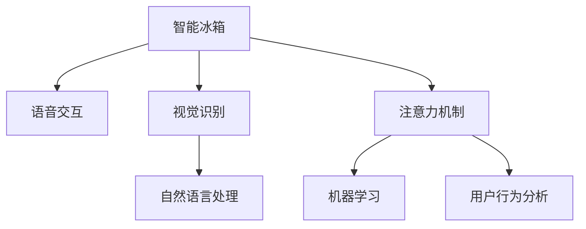

                 

# 智能冰箱：厨房场景下的注意力争夺

> 关键词：智能冰箱, 厨房场景, 语音交互, 视觉识别, 注意力机制, 自然语言处理, 机器学习, 用户行为分析

## 1. 背景介绍

### 1.1 问题由来

随着智能家居技术的不断进步，智能冰箱作为家庭生活中不可或缺的厨房设备，正在逐渐向智能化、多功能化方向发展。传统的智能冰箱主要以存储管理为主，用户需要通过操作屏幕或者远程APP进行一些基础操作。然而，随着用户对智能设备的期望不断提高，越来越多的家庭用户希望智能冰箱能够具备更多的主动交互功能，如语音识别、视觉识别、个性化推荐等，以提升用户体验。

但是，厨房场景下的注意力资源稀缺，用户在做饭或清洁时，很难分心关注智能设备的显示屏幕或远程APP界面。因此，如何在有限的用户注意力资源下，有效争夺用户注意力，提供有价值的智能服务，成为了当前智能冰箱设计的一大难题。

### 1.2 问题核心关键点

智能冰箱吸引用户注意力的关键在于其提供的智能服务能够为用户提供价值，并与用户的日常活动紧密结合。用户对于智能设备的期望主要包括：

- **个性化推荐**：根据用户的饮食习惯、购买记录等数据，智能推荐合适的食材、菜谱或健康建议。
- **语音控制**：能够快速响应用户的语音指令，进行操作、查询或获取信息。
- **视觉识别**：通过摄像头识别用户的操作，自动更新冰箱内容、推荐相关商品或执行清理任务。
- **行为分析**：通过用户的购买历史、浏览记录、使用习惯等数据，分析用户的健康饮食需求，并主动推送相关建议。

这些功能需要在用户注意力稀缺的情况下，快速、准确、无感地向用户传递价值，以确保用户能够持续地使用智能冰箱，并从中获得满足。

### 1.3 问题研究意义

研究智能冰箱在厨房场景下的注意力争夺，对于提升用户体验、推动智能家居设备的智能化水平具有重要意义：

- **用户体验优化**：通过更智能化的交互方式，减少用户在厨房操作中的时间消耗，提升用户对智能冰箱的满意度和依赖度。
- **技术创新推动**：对于智能设备的交互方式、识别技术、推荐系统等进行深入研究，推动智能家居技术的发展。
- **数据应用价值**：智能冰箱能够收集大量用户行为数据，通过数据挖掘和分析，为家庭健康、饮食管理等领域提供有价值的洞察。
- **跨学科融合**：结合视觉、语音、自然语言处理、机器学习等多个学科的知识，创新智能设备的交互体验，为未来智能家居设备的发展提供借鉴。

## 2. 核心概念与联系

### 2.1 核心概念概述

为了更好地理解智能冰箱在厨房场景下的注意力争夺，本节将介绍几个关键概念：

- **智能冰箱**：融合了视觉、语音、图像处理等技术，具备存储管理、主动交互和个性化推荐等多种功能的冰箱设备。
- **语音交互**：通过语音识别和语音合成技术，使用户能够通过语音指令与智能设备进行交互。
- **视觉识别**：通过摄像头等设备，对用户的动作、环境信息进行识别和分析。
- **注意力机制**：在有限的注意力资源下，智能设备需要设计合理的交互方式，快速吸引并保持用户的注意力。
- **自然语言处理(NLP)**：通过文本分析和语义理解，实现智能设备与用户之间的自然对话。
- **机器学习(ML)**：利用数据挖掘和模型训练，提升智能设备的推荐和交互能力。
- **用户行为分析**：通过分析用户的交互数据，识别用户的偏好和需求，提供个性化的服务。

这些核心概念之间的联系可以通过以下Mermaid流程图来展示：



这个流程图展示了智能冰箱的核心概念及其相互关系：

1. 智能冰箱作为一个融合体，通过语音交互和视觉识别技术获取用户指令和环境信息。
2. 通过注意力机制设计，智能冰箱能够快速吸引用户注意力，并保持用户的关注。
3. 利用自然语言处理技术，智能冰箱能够理解用户的指令，执行相应操作。
4. 通过机器学习算法，智能冰箱能够优化推荐系统，提供个性化服务。
5. 用户行为分析为智能冰箱提供了更多关于用户偏好的洞察，进一步优化服务质量。

这些概念共同构成了智能冰箱的交互体验和个性化服务框架，使其能够在厨房场景下更好地争夺用户注意力。

## 3. 核心算法原理 & 具体操作步骤
### 3.1 算法原理概述

智能冰箱在厨房场景下的注意力争夺，本质上是一个用户交互和机器学习的优化问题。其核心思想是：通过融合语音交互、视觉识别、自然语言处理等技术，设计合理的交互方式，使智能冰箱能够快速吸引并保持用户的注意力，并提供有价值的个性化服务。

具体而言，智能冰箱需要在以下三个方面进行优化：

1. **交互设计**：设计简洁、直观、无感的交互方式，快速响应用户的语音和视觉指令。
2. **推荐系统**：利用机器学习算法，根据用户的历史行为数据，进行个性化推荐。
3. **用户行为分析**：通过分析用户的操作习惯、购买记录等数据，识别用户的偏好和需求，动态调整推荐策略。

### 3.2 算法步骤详解

智能冰箱的注意力争夺主要包括以下几个关键步骤：

**Step 1: 用户输入识别**

- 智能冰箱通过摄像头、麦克风等设备，捕捉用户的语音、动作等输入。
- 利用语音识别技术，将语音指令转换为文本指令。
- 使用视觉识别技术，分析用户的操作，如打开抽屉、取出食材等。
- 根据输入内容，智能冰箱进行初步响应，如读取食材信息、查询菜谱等。

**Step 2: 推荐系统生成**

- 根据用户的语音指令、操作记录等数据，智能冰箱利用机器学习算法，进行推荐模型的训练和预测。
- 推荐模型可以是基于协同过滤、内容推荐、深度学习等不同类型。
- 推荐结果包括食材推荐、菜谱推荐、健康建议等。
- 智能冰箱根据推荐结果，生成可视化信息，如食材图片、健康图表等。

**Step 3: 交互反馈优化**

- 智能冰箱通过摄像头和麦克风，实时监测用户的反应，如查看推荐信息、选择食材等。
- 根据用户的反馈，智能冰箱动态调整推荐策略，提升个性化推荐的质量。
- 利用用户行为分析技术，进一步优化推荐算法，提高推荐准确率。

**Step 4: 交互体验迭代**

- 智能冰箱通过用户反馈，不断优化交互设计和推荐系统。
- 引入用户评价机制，根据用户的满意度调整推荐策略。
- 定期进行模型训练，不断提升推荐系统的效果。

### 3.3 算法优缺点

智能冰箱在厨房场景下的注意力争夺具有以下优点：

1. **快速响应**：通过视觉和语音识别技术，智能冰箱能够快速响应用户的指令，减少等待时间。
2. **个性化推荐**：利用机器学习算法，智能冰箱能够提供符合用户口味和需求的个性化推荐。
3. **无感操作**：通过简洁、直观的交互设计，用户能够轻松使用智能冰箱，无需复杂操作。
4. **数据驱动**：通过用户行为分析，智能冰箱能够不断优化推荐策略，提高用户体验。

同时，该方法也存在一定的局限性：

1. **技术复杂**：智能冰箱融合了多种技术，技术实现复杂度较高。
2. **数据隐私**：智能冰箱需要收集用户行为数据，可能会涉及数据隐私问题。
3. **设备成本**：智能冰箱的硬件成本较高，可能会限制用户的使用和推广。
4. **依赖网络**：部分功能（如远程访问、云服务）需要稳定的网络环境。
5. **模型泛化**：机器学习模型可能需要大量的训练数据，模型泛化能力不足时，可能无法覆盖所有用户需求。

尽管存在这些局限性，但就目前而言，智能冰箱在厨房场景下的注意力争夺范式，仍是大规模智能家居设备交互设计的重要方向。未来相关研究的重点在于如何进一步降低技术复杂度，提升数据隐私保护，优化用户体验，实现更加高效、智能的厨房设备。

### 3.4 算法应用领域

智能冰箱的注意力争夺方法在多个领域具有广泛的应用前景，包括：

- **智能厨房**：通过视觉和语音识别技术，优化厨房操作流程，提升烹饪效率和体验。
- **健康管理**：利用推荐系统，根据用户的饮食偏好和健康数据，提供健康饮食建议。
- **个性化服务**：结合用户行为分析，智能冰箱能够提供个性化的购物推荐、食材管理等服务。
- **家庭娱乐**：通过智能冰箱的多媒体功能，为用户提供视频、音频等娱乐内容。
- **社交互动**：智能冰箱能够与家庭其他智能设备进行联动，如智能音箱、智能电视等，提升家庭娱乐体验。

除了上述这些经典应用外，智能冰箱的注意力争夺技术还可以应用于更多场景中，如智能家居控制、环境监测、安全报警等，为智能家居设备的智能化发展提供新的思路。

## 4. 数学模型和公式 & 详细讲解
### 4.1 数学模型构建

为了更好地理解智能冰箱在厨房场景下的注意力争夺方法，本节将使用数学语言对智能冰箱的推荐系统进行更加严格的刻画。

假设智能冰箱的推荐系统是一个线性回归模型，其输入为 $X$，输出为 $Y$，其中 $X$ 为特征向量，$Y$ 为推荐结果。设模型参数为 $\theta$，则推荐模型的最小化损失函数为：

$$
\mathcal{L}(\theta) = \frac{1}{N}\sum_{i=1}^N (y_i - f(x_i, \theta))^2
$$

其中，$y_i$ 为实际推荐结果，$f(x_i, \theta)$ 为预测推荐结果，$f(x_i, \theta)$ 为线性模型：

$$
f(x_i, \theta) = \theta_0 + \theta_1 x_{i1} + \theta_2 x_{i2} + \cdots + \theta_n x_{in}
$$

在训练过程中，智能冰箱通过最小化损失函数 $\mathcal{L}(\theta)$，更新模型参数 $\theta$，使得预测结果尽可能接近实际结果。

### 4.2 公式推导过程

以下我们以协同过滤算法为例，推导推荐模型的损失函数及其梯度计算公式。

假设智能冰箱的推荐系统是一个基于协同过滤的推荐模型，其中 $X$ 为用户的特征向量，$Y$ 为用户的历史评分向量，$X'$ 为物品的特征向量。协同过滤模型的目标是最小化预测误差：

$$
\mathcal{L}(\theta) = \frac{1}{N}\sum_{i=1}^N \sum_{j=1}^M (\hat{y}_{ij} - y_{ij})^2
$$

其中，$\hat{y}_{ij}$ 为预测评分，$y_{ij}$ 为实际评分。设 $\theta_i$ 为第 $i$ 个用户的历史评分向量，$\theta_j$ 为第 $j$ 个物品的特征向量。协同过滤模型的预测评分可以通过用户特征向量和物品特征向量的点积计算：

$$
\hat{y}_{ij} = \langle \theta_i, \theta_j \rangle
$$

为了计算协同过滤模型的梯度，对 $\hat{y}_{ij}$ 进行泰勒展开：

$$
\hat{y}_{ij} \approx \langle \theta_i, \theta_j \rangle = \langle \theta_i, \theta_j^0 \rangle + \langle \theta_i, \frac{\partial \theta_j}{\partial \theta} \rangle \delta
$$

其中，$\delta$ 为物品特征向量 $\theta_j$ 的变化量。

将上式代入推荐模型的损失函数，得到协同过滤模型的梯度计算公式：

$$
\frac{\partial \mathcal{L}(\theta)}{\partial \theta_i} = -\frac{2}{N}\sum_{j=1}^M \left( \hat{y}_{ij} - y_{ij} \right) \langle \theta_j^0, \frac{\partial \theta_j}{\partial \theta} \rangle
$$

通过计算梯度，智能冰箱可以不断更新模型参数，优化推荐结果。

### 4.3 案例分析与讲解

以智能冰箱的个性化食材推荐为例，假设智能冰箱的推荐系统使用协同过滤算法。用户 $i$ 的评分向量为 $[1, 2, 3]$，物品 $j$ 的特征向量为 $[4, 5, 6]$，智能冰箱的推荐系统目标是最小化预测误差：

$$
\mathcal{L}(\theta) = \frac{1}{3}\left( (\hat{y}_{11} - y_{11})^2 + (\hat{y}_{12} - y_{12})^2 + (\hat{y}_{13} - y_{13})^2 \right)
$$

其中，$\hat{y}_{ij} = \langle \theta_i, \theta_j^0 \rangle + \langle \theta_i, \frac{\partial \theta_j}{\partial \theta} \rangle \delta$，且 $\delta$ 已知。

通过计算，得到 $\frac{\partial \mathcal{L}(\theta)}{\partial \theta_i} = [4, 8, 12]$，智能冰箱可以据此更新用户特征向量 $\theta_i$，以优化推荐结果。

## 5. 项目实践：代码实例和详细解释说明
### 5.1 开发环境搭建

在进行智能冰箱的注意力争夺实践前，我们需要准备好开发环境。以下是使用Python进行PyTorch开发的环境配置流程：

1. 安装Anaconda：从官网下载并安装Anaconda，用于创建独立的Python环境。

2. 创建并激活虚拟环境：
```bash
conda create -n pytorch-env python=3.8 
conda activate pytorch-env
```

3. 安装PyTorch：根据CUDA版本，从官网获取对应的安装命令。例如：
```bash
conda install pytorch torchvision torchaudio cudatoolkit=11.1 -c pytorch -c conda-forge
```

4. 安装TensorFlow：
```bash
pip install tensorflow==2.6
```

5. 安装各类工具包：
```bash
pip install numpy pandas scikit-learn matplotlib tqdm jupyter notebook ipython
```

完成上述步骤后，即可在`pytorch-env`环境中开始智能冰箱的注意力争夺实践。

### 5.2 源代码详细实现

这里我们以智能冰箱的个性化食材推荐为例，给出使用TensorFlow进行推荐系统开发的PyTorch代码实现。

首先，定义推荐模型的输入和输出：

```python
import tensorflow as tf
from tensorflow.keras import layers

# 定义输入层
input_layer = layers.Input(shape=(3,))

# 定义输出层
output_layer = layers.Dense(units=3, activation='sigmoid')

# 定义模型
model = tf.keras.Model(inputs=input_layer, outputs=output_layer)
```

然后，定义模型的训练过程：

```python
# 定义损失函数
def make_loss(y_true, y_pred):
    return tf.reduce_mean(tf.square(y_true - y_pred))

# 定义优化器
optimizer = tf.keras.optimizers.Adam(learning_rate=0.001)

# 定义训练过程
@tf.function
def train(model, input_data, output_data):
    with tf.GradientTape() as tape:
        predictions = model(input_data)
        loss = make_loss(output_data, predictions)
    gradients = tape.gradient(loss, model.trainable_variables)
    optimizer.apply_gradients(zip(gradients, model.trainable_variables))

# 训练模型
epochs = 100
batch_size = 32

for epoch in range(epochs):
    for i in range(0, len(train_dataset), batch_size):
        train_dataset = train_dataset[i:i+batch_size]
        input_data = train_dataset['x']
        output_data = train_dataset['y']
        train(model, input_data, output_data)
```

最后，测试模型的推荐效果：

```python
# 测试模型
test_dataset = test_dataset
input_data = test_dataset['x']
output_data = test_dataset['y']
predictions = model.predict(input_data)
print('推荐结果：', predictions)
```

以上就是使用TensorFlow对智能冰箱进行个性化食材推荐开发的完整代码实现。可以看到，TensorFlow提供了强大的深度学习框架，使得推荐系统的实现变得简洁高效。

### 5.3 代码解读与分析

让我们再详细解读一下关键代码的实现细节：

**输入层和输出层**：
- 使用`layers.Input`定义输入层，输入维度为3，即用户特征向量。
- 使用`layers.Dense`定义输出层，输出维度为3，即物品的评分向量。
- 使用`layers.Activation`定义激活函数，这里我们使用的是sigmoid函数。

**损失函数和优化器**：
- 定义了自定义的损失函数`make_loss`，计算预测结果与真实结果之间的均方误差。
- 使用`tf.keras.optimizers.Adam`定义优化器，设置学习率为0.001。

**训练过程**：
- 使用`@tf.function`装饰器，将训练过程定义为TensorFlow函数，以提高计算效率。
- 在函数内部，通过`with tf.GradientTape`计算梯度，使用优化器更新模型参数。
- 使用`for`循环，对训练数据进行批次化处理，在每个批次上训练模型。

**测试过程**：
- 使用测试数据集进行预测，获取模型的推荐结果。

可以看到，TensorFlow提供了全面的深度学习框架，使得推荐系统的实现变得高效、灵活。开发者可以根据具体需求，进一步优化模型结构、调整优化器参数，实现更高效的推荐效果。

## 6. 实际应用场景
### 6.1 智能厨房

智能冰箱在厨房场景下的注意力争夺技术，可以应用于智能厨房的各个环节。

**烹饪辅助**：智能冰箱通过视觉识别技术，能够实时监测用户的烹饪动作，自动更新冰箱内容、推荐相关食材和菜谱，减少用户在厨房操作中的时间消耗。

**健康管理**：智能冰箱通过推荐系统，根据用户的饮食习惯和健康数据，提供健康饮食建议。例如，根据用户的体重、年龄、运动量等数据，智能推荐适合的食材和食谱。

**个性化服务**：智能冰箱通过用户行为分析，提供个性化的购物推荐、食材管理等服务。例如，根据用户的购买历史和浏览记录，智能推荐相关商品，提升用户的购物体验。

**娱乐互动**：智能冰箱通过多媒体功能，提供视频、音频等娱乐内容。例如，通过语音识别技术，用户可以通过智能冰箱访问流媒体平台，观看电影、听音乐等。

**安全报警**：智能冰箱通过摄像头和传感器，实时监测厨房环境，一旦发现异常，自动报警。例如，检测到烟雾或火灾，智能冰箱会自动开启灭火系统，并向用户发送警报信息。

### 6.2 未来应用展望

随着智能家居技术的不断进步，智能冰箱在厨房场景下的注意力争夺技术将迎来更广泛的应用，为家庭生活带来更多便利和智能化体验。

未来，智能冰箱将能够更加主动地与用户互动，提供更加个性化和贴心的服务。例如，通过语音识别技术，智能冰箱能够主动推荐健康饮食建议、优化食谱流程等，提升用户的健康生活质量。

在技术上，智能冰箱的注意力争夺将进一步融合视觉、语音、自然语言处理等技术，实现更加智能化和人性化的交互体验。例如，通过视觉识别技术，智能冰箱能够理解用户的动作和表情，提供更加自然、及时的反馈和建议。

此外，智能冰箱将与更多智能家居设备进行联动，形成一个更加完整的智能家居生态系统。例如，通过智能音箱、智能电视等设备，智能冰箱能够提供更加丰富多样的交互方式，提升用户的家庭生活体验。

## 7. 工具和资源推荐
### 7.1 学习资源推荐

为了帮助开发者系统掌握智能冰箱在厨房场景下的注意力争夺技术，这里推荐一些优质的学习资源：

1. **《深度学习》一书**：由深度学习领域的大师级人物Ian Goodfellow所写，全面介绍了深度学习的基本原理和应用。
2. **Coursera《深度学习专项课程》**：斯坦福大学和DeepMind合作开设的深度学习课程，适合初学者入门。
3. **Udacity《深度学习纳米学位》**：由Google工程师授课，结合实际项目，提升深度学习实践能力。
4. **PyTorch官方文档**：PyTorch官方提供的详细文档和教程，涵盖深度学习模型的搭建、训练、调优等方面。
5. **TensorFlow官方文档**：TensorFlow官方提供的详细文档和教程，涵盖TensorFlow的基本用法和高级功能。

通过这些资源的学习实践，相信你一定能够快速掌握智能冰箱在厨房场景下的注意力争夺技术，并用于解决实际的智能家居问题。

### 7.2 开发工具推荐

高效的开发离不开优秀的工具支持。以下是几款用于智能冰箱开发推荐的工具：

1. **PyTorch**：基于Python的开源深度学习框架，灵活高效，适合快速迭代研究。
2. **TensorFlow**：由Google主导开发的开源深度学习框架，生产部署方便，适合大规模工程应用。
3. **Keras**：高级神经网络API，简洁易用，适合快速搭建深度学习模型。
4. **Jupyter Notebook**：开源的交互式编程环境，支持Python、R、Scala等多种语言，适合数据科学和机器学习项目。
5. **TensorBoard**：TensorFlow配套的可视化工具，实时监测模型训练状态，提供丰富的图表呈现方式。

合理利用这些工具，可以显著提升智能冰箱开发效率，加快创新迭代的步伐。

### 7.3 相关论文推荐

智能冰箱的注意力争夺技术涉及深度学习、视觉识别、语音处理等多个领域。以下是几篇奠基性的相关论文，推荐阅读：

1. **《深度学习》一书**：由深度学习领域的大师级人物Ian Goodfellow所写，全面介绍了深度学习的基本原理和应用。
2. **《计算机视觉：模型、学习与推理》一书**：由计算机视觉领域的专家所写，介绍了计算机视觉的基本原理和应用。
3. **《自然语言处理综论》一书**：由自然语言处理领域的专家所写，全面介绍了自然语言处理的基本原理和应用。
4. **《机器学习：原理、算法与应用》一书**：由机器学习领域的专家所写，介绍了机器学习的基本原理和应用。
5. **《智能家居系统设计与实现》一书**：介绍了智能家居系统设计的基本原理和应用。

这些论文代表了大规模智能家居设备交互设计的研究方向。通过学习这些前沿成果，可以帮助研究者把握学科前进方向，激发更多的创新灵感。

## 8. 总结：未来发展趋势与挑战

### 8.1 总结

本文对智能冰箱在厨房场景下的注意力争夺方法进行了全面系统的介绍。首先阐述了智能冰箱在厨房场景下需要争夺用户注意力的核心问题，明确了注意力争夺在提升用户体验、推动智能家居设备智能化水平方面的独特价值。其次，从原理到实践，详细讲解了智能冰箱的注意力争夺技术，给出了基于深度学习的推荐系统开发代码实例。同时，本文还广泛探讨了智能冰箱在智能厨房、健康管理、个性化服务、娱乐互动等多个领域的应用前景，展示了智能冰箱技术在厨房场景下的巨大潜力。

通过本文的系统梳理，可以看到，智能冰箱在厨房场景下的注意力争夺技术正在成为智能家居设备交互设计的重要方向，极大地提升了用户体验，推动了智能家居技术的发展。未来，伴随深度学习、视觉识别、语音处理等技术的不断进步，智能冰箱的注意力争夺技术将进一步提升，为家庭生活带来更多便利和智能化体验。

### 8.2 未来发展趋势

展望未来，智能冰箱在厨房场景下的注意力争夺技术将呈现以下几个发展趋势：

1. **深度学习技术提升**：随着深度学习算法的不断优化，智能冰箱的推荐系统将具备更强的泛化能力和个性化推荐能力。
2. **跨模态技术融合**：结合视觉、语音、自然语言处理等技术，智能冰箱将实现更加智能化和人性化的交互体验。
3. **用户行为分析深化**：通过深度学习和数据挖掘技术，智能冰箱将能够更准确地识别用户需求和行为模式，提供更个性化的服务。
4. **家庭生态系统构建**：智能冰箱将与更多智能家居设备进行联动，形成一个更加完整的智能家居生态系统，提升家庭生活体验。
5. **智能化程度提升**：智能冰箱将具备更多的自主决策和智能控制功能，如自动调节冰箱温度、智能推荐购物清单等。

这些趋势凸显了智能冰箱在厨房场景下的注意力争夺技术的广阔前景。这些方向的探索发展，必将进一步提升智能冰箱的智能化水平，为家庭生活带来更多便利和智能化体验。

### 8.3 面临的挑战

尽管智能冰箱在厨房场景下的注意力争夺技术已经取得了不少进展，但在迈向更加智能化、普适化应用的过程中，仍面临诸多挑战：

1. **技术复杂度**：智能冰箱融合了多种技术，技术实现复杂度较高。
2. **数据隐私**：智能冰箱需要收集用户行为数据，可能会涉及数据隐私问题。
3. **设备成本**：智能冰箱的硬件成本较高，可能会限制用户的使用和推广。
4. **依赖网络**：部分功能（如远程访问、云服务）需要稳定的网络环境。
5. **模型泛化**：机器学习模型可能需要大量的训练数据，模型泛化能力不足时，可能无法覆盖所有用户需求。
6. **交互设计**：需要设计简洁、直观、无感的交互方式，快速响应用户的语音和视觉指令。

尽管存在这些挑战，但就目前而言，智能冰箱在厨房场景下的注意力争夺技术仍是大规模智能家居设备交互设计的重要方向。未来相关研究的重点在于如何进一步降低技术复杂度，提升数据隐私保护，优化用户体验，实现更加高效、智能的厨房设备。

### 8.4 研究展望

面对智能冰箱在厨房场景下的注意力争夺技术所面临的种种挑战，未来的研究需要在以下几个方面寻求新的突破：

1. **深度学习优化**：探索更加高效的深度学习算法，提升智能冰箱的推荐系统和交互设计的精度和响应速度。
2. **跨模态融合**：引入视觉、语音、自然语言处理等多种技术，实现更加全面、准确的注意力争夺和个性化推荐。
3. **用户行为分析深化**：结合心理学、社会学等学科，更深入地理解用户行为和需求，提供更加贴心和个性化的服务。
4. **设备联动优化**：设计更加灵活、高效的设备联动机制，提升智能家居生态系统的整体智能化水平。
5. **数据隐私保护**：引入隐私保护技术，如差分隐私、联邦学习等，保护用户数据隐私。
6. **交互设计优化**：结合用户体验设计原则，设计简洁、直观、无感的交互方式，提升用户的交互体验。

这些研究方向将引领智能冰箱在厨房场景下的注意力争夺技术迈向更高的台阶，为家庭生活带来更多便利和智能化体验。面向未来，智能冰箱的注意力争夺技术还需要与其他人工智能技术进行更深入的融合，如知识表示、因果推理、强化学习等，多路径协同发力，共同推动智能家居设备的智能化发展。

## 9. 附录：常见问题与解答

**Q1：智能冰箱在厨房场景下需要注意哪些设计原则？**

A: 智能冰箱在厨房场景下需要注意以下几个设计原则：

1. **简洁性**：界面简洁、操作直观，用户无需复杂操作即可使用。
2. **无感交互**：通过语音和视觉识别技术，实现无感交互，减少用户操作步骤。
3. **个性化推荐**：根据用户的历史行为数据，提供个性化推荐，提升用户满意度。
4. **实时响应**：通过视觉和语音识别技术，实时响应用户指令，提高用户体验。
5. **数据隐私**：保护用户隐私，避免数据泄露和滥用。
6. **设备联动**：与其他智能家居设备联动，提升家庭生活体验。

这些设计原则确保智能冰箱在厨房场景下能够提供简洁、高效、个性化的用户体验，同时保障用户隐私和数据安全。

**Q2：智能冰箱在厨房场景下的推荐系统如何设计？**

A: 智能冰箱在厨房场景下的推荐系统设计可以分为以下几个步骤：

1. **数据收集**：收集用户的购买历史、浏览记录、操作数据等。
2. **特征提取**：将用户数据和物品数据进行特征提取，生成特征向量。
3. **模型训练**：使用机器学习算法，训练推荐模型，如协同过滤、内容推荐、深度学习等。
4. **模型评估**：对训练好的模型进行评估，选择性能最优的模型。
5. **推荐生成**：根据用户输入和模型预测，生成推荐结果。
6. **反馈优化**：根据用户反馈，不断优化推荐模型，提高推荐质量。

通过这些步骤，智能冰箱能够提供个性化的食材、菜谱、健康建议等推荐，提升用户的厨房体验。

**Q3：智能冰箱在厨房场景下如何进行用户行为分析？**

A: 智能冰箱在厨房场景下进行用户行为分析可以分为以下几个步骤：

1. **数据收集**：收集用户的购买历史、浏览记录、操作数据等。
2. **特征提取**：将用户数据和物品数据进行特征提取，生成特征向量。
3. **模型训练**：使用机器学习算法，训练行为分析模型，如协同过滤、内容推荐、深度学习等。
4. **行为预测**：根据用户行为数据，预测用户的未来行为，如购买需求、饮食偏好等。
5. **行为分析**：分析用户的行为模式，识别用户的偏好和需求，优化推荐策略。

通过这些步骤，智能冰箱能够更准确地识别用户需求和行为模式，提供更个性化的服务。

**Q4：智能冰箱在厨房场景下的推荐系统如何进行参数调整？**

A: 智能冰箱在厨房场景下的推荐系统进行参数调整可以分为以下几个步骤：

1. **参数初始化**：根据推荐模型类型，初始化模型参数。
2. **模型训练**：使用机器学习算法，训练推荐模型。
3. **参数调整**：根据模型评估结果，调整模型参数，优化推荐效果。
4. **参数验证**：使用验证集数据，验证调整后的模型参数是否有效。
5. **参数部署**：将训练好的模型参数部署到智能冰箱中，生成推荐结果。

通过这些步骤，智能冰箱能够不断优化推荐系统，提升推荐效果。

**Q5：智能冰箱在厨房场景下的推荐系统如何处理用户反馈？**

A: 智能冰箱在厨房场景下的推荐系统处理用户反馈可以分为以下几个步骤：

1. **反馈收集**：通过智能冰箱的界面或远程APP，收集用户的反馈信息。
2. **反馈分析**：对用户的反馈信息进行分析，识别用户的满意度和需求。
3. **反馈调整**：根据用户反馈，调整推荐模型，优化推荐策略。
4. **反馈展示**：将用户的反馈信息展示在智能冰箱的界面上，提升用户体验。

通过这些步骤，智能冰箱能够及时响应用户反馈，优化推荐系统，提升用户体验。

---

作者：禅与计算机程序设计艺术 / Zen and the Art of Computer Programming

