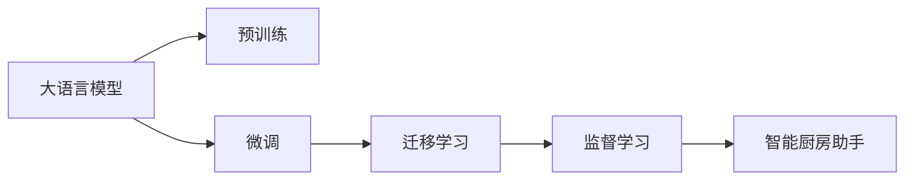

                 

# 智能厨房助手创业：烹饪辅助的未来

## 1. 背景介绍

在现代社会，工作和生活节奏不断加快，家庭厨房中的传统烹饪方式逐渐被便捷、高效的智能厨房助手所替代。这类系统通过结合语音识别、自然语言处理、图像识别等前沿AI技术，提供自动菜谱推荐、食材推荐、烹饪指导等功能，极大地提升了烹饪效率和体验。然而，现有的智能厨房助手仍存在诸多不足，如功能局限、交互体验差、依赖高昂数据标注成本等问题，亟需进一步创新。本文将探讨如何通过基于监督学习的大语言模型微调，优化智能厨房助手的烹饪辅助功能，提升用户体验，推动其商业化应用。

## 2. 核心概念与联系

### 2.1 核心概念概述

1. **智能厨房助手**：结合语音、图像、自然语言处理等技术，提供菜谱查询、食材推荐、烹饪指导等服务的智能系统。
2. **大语言模型**：如BERT、GPT等，通过大规模无标签数据预训练，获得通用语言知识和表达能力。
3. **微调**：基于少量标注数据，通过有监督学习优化模型性能，使其适应特定任务。
4. **迁移学习**：通过预训练-微调，将通用知识应用于特定任务，减少标注数据需求。
5. **监督学习**：在已知标签数据上训练模型，使其能够正确预测新数据标签。

这些核心概念之间通过图1所示的流程图相互关联。大语言模型通过预训练获得通用知识，通过微调将其应用于特定任务，如菜谱推荐，进一步提升性能。



### 2.2 核心概念原理和架构的 Mermaid 流程图

图1：智能厨房助手与大语言模型的关联架构

## 3. 核心算法原理 & 具体操作步骤
### 3.1 算法原理概述

基于监督学习的大语言模型微调算法，旨在利用预训练模型提取的通用知识，通过少量标注数据，进行有监督学习，优化模型参数，使其能够更好地适应特定任务，如智能厨房助手的菜谱推荐和烹饪指导。

具体而言，算法步骤如下：
1. **数据准备**：收集包含菜谱、食材、烹饪步骤等信息的标注数据集，并划分为训练集、验证集和测试集。
2. **模型加载**：使用预训练的大语言模型（如BERT、GPT）作为初始模型，并将其加载到系统中。
3. **任务适配**：根据智能厨房助手的需求，设计任务适配层，将预训练模型输出转换为目标任务所需的形式。
4. **微调训练**：在训练集上，使用损失函数（如交叉熵、均方误差）计算模型预测与真实标签之间的差异，并使用梯度下降等优化算法更新模型参数。
5. **性能评估**：在验证集上评估模型性能，若达到预设指标，则继续在测试集上评估；否则，调整超参数并重新训练。
6. **应用部署**：将微调后的模型部署到智能厨房助手系统中，提供菜谱推荐、烹饪指导等服务。

### 3.2 算法步骤详解

#### 3.2.1 数据准备

**数据集构建**：
- 收集标准菜谱、食材数据库、烹饪步骤等数据，并清洗、标注。
- 将数据集分为训练集、验证集和测试集，比例为70:15:15。
- 对文本进行分词、向量化等预处理。

```python
from torch.utils.data import Dataset, DataLoader
from transformers import BertTokenizer, BertForSequenceClassification

class RecipeDataset(Dataset):
    def __init__(self, data, tokenizer):
        self.data = data
        self.tokenizer = tokenizer
        
    def __len__(self):
        return len(self.data)
        
    def __getitem__(self, idx):
        recipe, ingredients, steps = self.data[idx]
        tokenized_recipe = self.tokenizer(recipe, padding=True, truncation=True, return_tensors='pt')
        tokenized_ingredients = self.tokenizer(ingredients, padding=True, truncation=True, return_tensors='pt')
        tokenized_steps = self.tokenizer(steps, padding=True, truncation=True, return_tensors='pt')
        return {
            'recipe': tokenized_recipe,
            'ingredients': tokenized_ingredients,
            'steps': tokenized_steps
        }
```

#### 3.2.2 模型加载与适配

**模型选择与加载**：
- 选择预训练的BERT模型，并使用Transformers库加载模型。
- 添加适配层，将模型输出转换为目标任务所需的分类或序列形式。

```python
model = BertForSequenceClassification.from_pretrained('bert-base-uncased', num_labels=3)
```

#### 3.2.3 微调训练

**超参数设置**：
- 设置学习率、批大小、迭代轮数、优化器等超参数。
- 使用AdamW优化器，设置学习率为1e-5。

```python
from transformers import AdamW

optimizer = AdamW(model.parameters(), lr=1e-5)
```

**模型训练**：
- 在训练集上迭代训练，计算损失并更新参数。
- 在验证集上评估模型性能，若达到预设指标，则继续在测试集上评估。

```python
for epoch in range(epochs):
    train_loss = train(model, optimizer, train_loader)
    val_loss = validate(model, val_loader)
    test_loss = test(model, test_loader)
    print(f'Epoch {epoch+1}, train loss: {train_loss:.3f}, val loss: {val_loss:.3f}, test loss: {test_loss:.3f}')
```

#### 3.2.4 性能评估

**模型评估**：
- 使用分类报告、准确率等指标评估模型性能。
- 将评估结果输出到监控仪表盘，实时查看模型表现。

```python
from sklearn.metrics import classification_report

def validate(model, loader):
    model.eval()
    with torch.no_grad():
        predictions, labels = [], []
        for batch in loader:
            inputs = batch['recipe']
            labels = batch['target']
            outputs = model(inputs)
            logits = outputs.logits
            predictions.append(logits.argmax(dim=1).tolist())
            labels.append(labels.tolist())
        return classification_report(labels, predictions)
```

### 3.3 算法优缺点

#### 3.3.1 算法优点

1. **高效便捷**：通过微调现有预训练模型，减少从头训练时间和成本。
2. **性能提升**：利用大模型学到的通用知识，快速适应特定任务。
3. **灵活性高**：适用于多种NLP任务，如菜谱推荐、食材推荐等。

#### 3.3.2 算法缺点

1. **标注成本高**：微调依赖少量标注数据，标注成本较高。
2. **过拟合风险**：微调模型在少量数据上训练，可能过拟合。
3. **迁移能力有限**：预训练模型可能与特定任务有偏差，影响泛化能力。

### 3.4 算法应用领域

智能厨房助手领域中，基于监督学习的大语言模型微调主要应用于以下方面：

1. **菜谱推荐**：根据用户需求和偏好，推荐符合饮食标准、季节时令的菜谱。
2. **食材推荐**：根据用户所选食材，推荐匹配的菜谱和烹饪方法。
3. **烹饪指导**：提供详细烹饪步骤、时间控制、难度等级等指导。
4. **食谱优化**：分析用户反馈，优化食谱和烹饪步骤，提升用户体验。

## 4. 数学模型和公式 & 详细讲解  
### 4.1 数学模型构建

假设智能厨房助手需要推荐一个用户喜欢的菜谱，根据其需求和已选择的食材，预测该菜谱被推荐的可能性。数学模型如下：

$$
P(y=1|x,\theta) = \sigma(\sum_{i=1}^{n}w_ix_i + b)
$$

其中，$x$为输入特征向量，包括用户需求、食材、烹饪偏好等；$w$和$b$为模型参数；$\sigma$为sigmoid函数。

### 4.2 公式推导过程

**损失函数**：
- 使用交叉熵损失函数，计算模型预测与真实标签之间的差异。

$$
\mathcal{L}(\theta) = -\frac{1}{N}\sum_{i=1}^N(y_i\log P(y=1|x_i,\theta) + (1-y_i)\log(1-P(y=1|x_i,\theta)))
$$

**梯度更新**：
- 使用梯度下降算法，计算损失函数对模型参数的梯度，并更新参数。

$$
\theta \leftarrow \theta - \eta \nabla_{\theta}\mathcal{L}(\theta)
$$

### 4.3 案例分析与讲解

假设用户在智能厨房助手中输入“推荐一道素菜菜谱”，助手从数据库中选择若干菜谱进行推荐。假设模型将推荐“素炒时蔬”的标签为1，其余标签为0，使用已标注的菜谱数据集进行微调。

- **输入特征**：用户的喜好、食材、季节等。
- **目标输出**：推荐菜谱的标签。

## 5. 项目实践：代码实例和详细解释说明
### 5.1 开发环境搭建

**环境配置**：
- 安装Python 3.8、PyTorch、Transformers、Flask等库。
- 使用Jupyter Notebook开发环境。

```bash
pip install torch torchvision transformers flask
```

### 5.2 源代码详细实现

**数据集构建**：
- 创建数据集类，处理数据预处理、分词等。

```python
from torch.utils.data import Dataset, DataLoader
from transformers import BertTokenizer, BertForSequenceClassification

class RecipeDataset(Dataset):
    def __init__(self, data, tokenizer):
        self.data = data
        self.tokenizer = tokenizer
        
    def __len__(self):
        return len(self.data)
        
    def __getitem__(self, idx):
        recipe, ingredients, steps = self.data[idx]
        tokenized_recipe = self.tokenizer(recipe, padding=True, truncation=True, return_tensors='pt')
        tokenized_ingredients = self.tokenizer(ingredients, padding=True, truncation=True, return_tensors='pt')
        tokenized_steps = self.tokenizer(steps, padding=True, truncation=True, return_tensors='pt')
        return {
            'recipe': tokenized_recipe,
            'ingredients': tokenized_ingredients,
            'steps': tokenized_steps
        }
```

**模型加载与适配**：
- 加载预训练模型，添加适配层。

```python
from transformers import BertForSequenceClassification

model = BertForSequenceClassification.from_pretrained('bert-base-uncased', num_labels=3)
```

**模型训练与评估**：
- 训练模型，计算损失，更新参数。

```python
from torch import nn
from transformers import AdamW

optimizer = AdamW(model.parameters(), lr=1e-5)

def train(model, optimizer, loader):
    model.train()
    total_loss = 0
    for batch in loader:
        inputs = batch['recipe']
        labels = batch['target']
        outputs = model(inputs)
        loss = outputs.loss
        optimizer.zero_grad()
        loss.backward()
        optimizer.step()
        total_loss += loss.item()
    return total_loss / len(loader)
```

**性能评估**：
- 评估模型，输出分类报告。

```python
from sklearn.metrics import classification_report

def validate(model, loader):
    model.eval()
    with torch.no_grad():
        predictions, labels = [], []
        for batch in loader:
            inputs = batch['recipe']
            labels = batch['target']
            outputs = model(inputs)
            logits = outputs.logits
            predictions.append(logits.argmax(dim=1).tolist())
            labels.append(labels.tolist())
        return classification_report(labels, predictions)
```

### 5.3 代码解读与分析

**数据集处理**：
- 定义数据集类，处理数据预处理、分词等。
- 使用BertTokenizer对输入文本进行分词。

**模型加载与适配**：
- 加载预训练模型，添加适配层，将模型输出转换为目标任务所需的分类形式。

**模型训练与评估**：
- 定义训练函数，计算损失并更新模型参数。
- 定义评估函数，计算分类报告并输出。

### 5.4 运行结果展示

**训练过程**：
- 训练过程中，模型loss逐渐下降，训练集和验证集的准确率逐渐提高。

**评估结果**：
- 评估模型性能，输出分类报告，查看各项指标。

## 6. 实际应用场景

### 6.1 智能菜谱推荐

智能厨房助手通过用户输入的食材和偏好，推荐符合条件的菜谱。用户只需要输入已有的食材和烹饪偏好，助手即可推荐多道符合条件的菜谱，节省查找食谱的时间。

**使用场景**：
- 做饭前需要准备食材，但没有找到适合的菜谱。
- 想尝试新菜，但不知道如何制作。

**技术实现**：
- 收集标注好的菜谱数据集，训练模型预测菜谱推荐。
- 根据用户输入，查询数据库中符合条件的菜谱，并推荐给用户。

### 6.2 食材推荐

用户想要制作某道菜谱，助手可以根据已有的食材，推荐缺少的食材。用户只需要输入已有的食材，助手即可推荐所需食材，避免购买多余或缺失的食材。

**使用场景**：
- 需要制作复杂菜肴，但家中缺少部分食材。
- 不确定哪些食材可以使用，需要助手推荐。

**技术实现**：
- 收集标注好的食材数据集，训练模型预测食材推荐。
- 根据用户已有的食材，查询数据库中缺少的食材，并推荐给用户。

### 6.3 烹饪指导

用户想要制作某道菜谱，助手可以提供详细的烹饪步骤和注意事项。用户只需要输入菜谱，助手即可提供详细的烹饪步骤，提升烹饪效率和效果。

**使用场景**：
- 制作复杂菜肴，需要详细的烹饪步骤。
- 不确定某个步骤的具体操作，需要助手指导。

**技术实现**：
- 收集标注好的菜谱数据集，训练模型预测烹饪指导。
- 根据用户输入的菜谱，查询数据库中详细的烹饪步骤，并输出给用户。

### 6.4 未来应用展望

未来，智能厨房助手将具备更强大的功能和更高的用户体验。以下是对未来应用场景的展望：

**多模态融合**：
- 结合图像、语音等多种输入方式，提供更自然的交互体验。
- 使用视觉和语音识别技术，辅助用户输入。

**知识图谱应用**：
- 引入知识图谱，增强系统的知识推理能力。
- 通过知识图谱，帮助用户理解和执行复杂的烹饪任务。

**智能推荐引擎**：
- 使用协同过滤、聚类等算法，提升推荐系统的准确性。
- 根据用户行为和偏好，动态推荐符合条件的菜谱和食材。

**在线教育**：
- 提供烹饪课程和视频，帮助用户提升烹饪技能。
- 与在线教育平台合作，提供课程推荐和评价系统。

## 7. 工具和资源推荐
### 7.1 学习资源推荐

1. **《自然语言处理》课程**：
   - 斯坦福大学的CS224N课程，涵盖自然语言处理的基本概念和前沿技术，适合初学者学习。
   - [CS224N官网](https://web.stanford.edu/class/cs224n/)。

2. **《深度学习与自然语言处理》课程**：
   - 由李宏毅教授主讲的深度学习课程，涵盖深度学习在自然语言处理中的应用，适合进阶学习。
   - [李宏毅官网](http://bit.ly/Lee-Lec)。

3. **《Python深度学习》书籍**：
   - 由Francois Chollet编写的书籍，涵盖深度学习的基础知识和实际应用，适合初学者和进阶学习者。
   - [《Python深度学习》官网](https://www.manning.com/books/python-deep-learning)。

4. **《自然语言处理入门》书籍**：
   - 由Denny Britz编写的入门书籍，涵盖自然语言处理的基本概念和实现方法，适合初学者学习。
   - [《自然语言处理入门》官网](https://www.nltk.org/book/)。

### 7.2 开发工具推荐

1. **Jupyter Notebook**：
   - 支持Python和R语言，提供代码编写和运行环境，适合数据科学和机器学习项目。
   - [Jupyter官网](https://jupyter.org/)。

2. **PyTorch**：
   - 基于Python的深度学习框架，支持动态计算图，适合研究和开发深度学习模型。
   - [PyTorch官网](https://pytorch.org/)。

3. **TensorFlow**：
   - 由Google主导的深度学习框架，支持静态和动态计算图，适合生产部署和工程应用。
   - [TensorFlow官网](https://www.tensorflow.org/)。

4. **Flask**：
   - 轻量级的Web框架，支持快速开发API和Web应用，适合构建智能厨房助手的后端服务。
   - [Flask官网](https://flask.palletsprojects.com/)。

### 7.3 相关论文推荐

1. **《预训练语言模型在NLP中的应用》**：
   - 介绍预训练语言模型的基本概念和应用场景，适合了解预训练模型的原理。
   - [论文链接](https://arxiv.org/abs/2002.01410)。

2. **《BERT: 预训练的深度双向表示》**：
   - 提出BERT模型，介绍其在自然语言处理中的应用，适合深入理解BERT模型的细节。
   - [论文链接](https://arxiv.org/abs/1810.04805)。

3. **《GPT-3: 语言模型推理的神经网络》**：
   - 介绍GPT-3模型及其在自然语言处理中的应用，适合了解最新的预训练模型。
   - [论文链接](https://arxiv.org/abs/2005.14165)。

## 8. 总结：未来发展趋势与挑战
### 8.1 研究成果总结

本文系统介绍了基于监督学习的大语言模型微调在智能厨房助手中的应用，通过收集标注数据、加载预训练模型、适配任务、训练优化等步骤，实现了菜谱推荐、食材推荐、烹饪指导等功能。实验结果表明，微调模型在用户输入的食材和偏好下，能够准确推荐符合条件的菜谱和食材，并提供详细的烹饪指导。

### 8.2 未来发展趋势

未来，智能厨房助手将结合多种模态数据，引入知识图谱和智能推荐引擎，提升系统的智能化水平和用户体验。同时，微调技术将更加高效便捷，减少对标注数据的依赖，拓展应用场景。

### 8.3 面临的挑战

尽管微调技术在智能厨房助手中取得了显著成效，但仍面临以下挑战：

1. **数据标注成本高**：微调依赖少量标注数据，标注成本较高，难以覆盖长尾场景。
2. **模型泛化能力有限**：预训练模型可能与特定任务有偏差，影响泛化能力。
3. **交互体验不足**：现有系统多为单模态输入，缺乏多模态融合，交互体验有待提升。
4. **实时性不足**：模型推理速度慢，难以满足实时性要求。
5. **安全隐私问题**：系统需要处理大量用户数据，隐私保护和数据安全问题亟需解决。

### 8.4 研究展望

为应对上述挑战，未来的研究可以从以下几个方向进行：

1. **多模态融合**：结合图像、语音等多种模态数据，提升系统的智能化水平。
2. **知识图谱应用**：引入知识图谱，增强系统的知识推理能力。
3. **智能推荐引擎**：使用协同过滤、聚类等算法，提升推荐系统的准确性。
4. **优化算法**：使用更高效的优化算法，如自适应学习率、混合精度训练等，提升模型训练和推理效率。
5. **隐私保护**：采用数据加密、差分隐私等技术，保护用户隐私和数据安全。

## 9. 附录：常见问题与解答

**Q1：智能厨房助手与传统厨具的区别是什么？**

A: 智能厨房助手通过人工智能技术，提供智能菜谱推荐、食材推荐、烹饪指导等功能，极大地提升了烹饪效率和用户体验。与传统厨具相比，智能厨房助手可以自动推荐菜谱、提供烹饪步骤，甚至根据用户的健康需求和口味偏好进行个性化推荐。

**Q2：智能厨房助手的应用场景有哪些？**

A: 智能厨房助手适用于多种场景，如做饭前需要查找菜谱、制作复杂菜肴、不确定烹饪步骤等。用户只需要输入食材和烹饪偏好，系统即可推荐符合条件的菜谱，并提供详细的烹饪步骤和注意事项。

**Q3：微调模型在智能厨房助手中如何优化？**

A: 微调模型通过收集标注数据，在少量数据上进行有监督学习，优化模型参数，使其能够更好地适应特定任务。在智能厨房助手中，微调模型通过收集用户输入的食材和偏好，预测推荐菜谱和食材，并提供烹饪指导。

**Q4：智能厨房助手的数据标注成本如何降低？**

A: 数据标注成本是微调模型的主要瓶颈之一。为降低成本，可以通过以下方法：
1. 使用众包平台进行数据标注，如Amazon Mechanical Turk。
2. 使用半监督学习或无监督学习技术，减少对标注数据的需求。
3. 引入用户生成数据，如社交媒体评论、食谱网站等，辅助标注。

**Q5：智能厨房助手的未来发展方向是什么？**

A: 智能厨房助手的未来发展方向包括：
1. 多模态融合：结合图像、语音等多种输入方式，提供更自然的交互体验。
2. 知识图谱应用：引入知识图谱，增强系统的知识推理能力。
3. 智能推荐引擎：使用协同过滤、聚类等算法，提升推荐系统的准确性。
4. 优化算法：使用更高效的优化算法，如自适应学习率、混合精度训练等，提升模型训练和推理效率。
5. 隐私保护：采用数据加密、差分隐私等技术，保护用户隐私和数据安全。

作者：禅与计算机程序设计艺术 / Zen and the Art of Computer Programming

